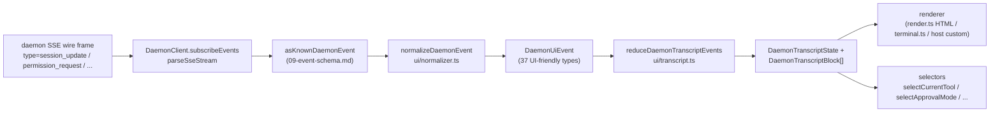

# Gemeinsame UI-Transkript-Ebene

> **Aktueller Status**: `packages/cli/src/ui/daemon/daemon-tui-adapter.ts` ist auf `main` noch als experimenteller CLI-seitiger Adapter vorhanden. Dieses Dokument beschreibt die neuere SDK-seitige gemeinsame UI-Transkript-Ebene: wiederverwendbare Daemon-Ereignisnormalisierung und Transkript-Primitive, die jeder UI-Host konsumieren kann, einschließlich Web, TUI, IDE und IM-Kanäle. CLI TUI, Kanal und VS Code IDE Migrationen sind Folgearbeiten.

## Überblick

`packages/sdk-typescript/src/daemon/ui/` fügt dem SDK ein `ui/*`-Unterpaket hinzu. Es wandelt den Daemon-SSE-Ereignisstrom über wiederverwendbare Primitive in UI-renderbare Transkriptblöcke um:

- **Normalisierung** (`normalizer.ts`): bildet die 43 bekannten Ereignistypen des Daemon-Wire-Schemas (siehe [`09-event-schema.md`](./09-event-schema.md)) auf 37 UI-freundliche semantische Ereignisse des Typs `DaemonUiEventType` ab, wie z. B. `assistant.text.delta`, `tool.update` und `session.metadata.changed`.
- **Zustandsmaschine** (`transcript.ts`, `store.ts`): reiner Reducer plus abonnierbarer Store, der UI-Ereignisse in geordnete `DaemonTranscriptBlock[]` projiziert.
- **Renderer** (`render.ts`, `terminal.ts`, `toolPreview.ts`): Transkriptblöcke in HTML, Terminaltext und Werkzeugvorschau-Zeichenketten. Hosts können sie verwenden oder ersetzen.
- **Konformität** (`conformance.ts`): plattformübergreifende Konsistenzprüfungen, die verwendet werden, wenn Kanal-, TUI- und IDE-Oberflächen auf diese Primitive migriert werden.

Der erste Produktionskonsument ist **`packages/webui/src/daemon/`** ([#4328](https://github.com/QwenLM/qwen-code/pull/4328)). Sein React-`DaemonSessionProvider` und Transkript-Adapter ermöglichen es der Weboberfläche, sich direkt mit Daemon HTTP+SSE zu verbinden, anstatt nur den Host-`postMessage`-Verkehr zu rendern. CLI TUI, Kanalbasis und VS Code IDE können dieselbe Ebene später wiederverwenden; [`../daemon-ui/MIGRATION.md`](../daemon-ui/MIGRATION.md) dokumentiert den inkrementellen Migrationsleitfaden der Version 2.

## Zuständigkeiten

- Normalisierung der 43 Daemon-Wire-Ereignisse in ein stabiles UI-Vokabular (`DaemonUiEventType`), sodass Renderer nicht `rawEvent.data` inspizieren müssen.
- Beibehaltung der Daemon-monotonen SSE-`eventId` als **primärer Ordnungsschlüssel**, sodass verschiedene Clients Transkripte in derselben Reihenfolge rendern.
- Verwendung eines reinen Reducers zur Erzeugung von Transkriptblöcken, mit Selektoren für ausstehende Berechtigungen, aktuelles Werkzeug, Genehmigungsmodus, Werkzeugfortschritt und Subagent-Kinder.
- Bereitstellung von Basis-HTML- und Terminal-Renderern bei gleichzeitiger Möglichkeit hostspezifischer Darstellung.
- Bereitstellung öffentlicher Konstanten wie `DAEMON_PLAN_TOOL_CALL_ID` für Plan-Panels.
- Bewahrung additiver Wire-Kompatibilität: unbekannte Ereignistypen werden auf `debug` normalisiert statt verworfen.

## Architektur

### Paketstruktur

| Datei                                             | Exporte                                                                                                                                                           | Zweck                        |
| ------------------------------------------------ | ----------------------------------------------------------------------------------------------------------------------------------------------------------------- | ---------------------------- |
| `packages/sdk-typescript/src/daemon/ui/index.ts` | Unterpaket-Barrel                                                                                                                                                 | Öffentlicher Einstiegspunkt  |
| `ui/types.ts`                                    | `DaemonUiEventType`, per-Typ `DaemonUiEvent*`-Schnittstellen, `DaemonTranscriptBlock`, `DaemonTranscriptState`, `DaemonUiToolProvenance`, `DAEMON_PLAN_TOOL_CALL_ID` | Typen                        |
| `ui/normalizer.ts`                               | `normalizeDaemonEvent(evt) -> DaemonUiEvent`, `getSessionUpdatePayload(evt)`                                                                                      | Wire-zu-UI-Abbildung         |
| `ui/transcript.ts`                               | `createDaemonTranscriptState()`, `appendLocalUserTranscriptMessage()`, `reduceDaemonTranscriptEvents()`, `rebuildDaemonTranscriptBlockIndex()`, Selektoren        | Zustandsmaschine und Selektoren |
| `ui/store.ts`                                    | `createDaemonTranscriptStore(initial?)`                                                                                                                           | Abonnierbarer Reducer-Store  |
| `ui/toolPreview.ts`                              | `createDaemonToolPreview(toolEvent)`                                                                                                                              | Zusammenfassungstext für Toolaufrufe |
| `ui/render.ts`                                   | `DaemonHtmlRenderOptions`, `DaemonRenderOptions`, Render-Funktionen                                                                                               | HTML und generisches Rendering |
| `ui/terminal.ts`                                 | Terminalspezifisches Rendering                                                                                                                                    | TUI-Vorbereitung             |
| `ui/conformance.ts`                              | Plattformübergreifende Konformitätssuite                                                                                                                          | Migrations-Paritätstests     |
| `ui/utils.ts`                                    | Hilfsfunktionen wie `DaemonUiContentPart`                                                                                                                         | Interne gemeinsam genutzte Hilfsfunktionen |

### `DaemonUiEventType`-Vokabular

`ui/types.ts` definiert 37 UI-Ereignistypen, gruppiert nach Domäne.

**Chat-Stream (Stufe 1)**

- `user.text.delta`, `user.image.delta`, `user.shell.command`, `assistant.text.delta`, `assistant.done`, `thought.text.delta`
- `tool.update`, `shell.output`, `user.shell.output`
- `permission.request`, `permission.resolved`
- `model.changed`, `status`, `error`, `debug`

**Sitzungsmetadaten**

- `session.metadata.changed`, `session.approval_mode.changed`
- `session.available_commands`, `session.state_resync_required`, `session.replay_complete`

**Prompt-Lebenszyklus (clientübergreifend)**

- `prompt.cancelled`, `followup.suggestion`

**Arbeitsbereich (Welle 3-4)**

- `workspace.memory.changed`, `workspace.agent.changed`
- `workspace.tool.toggled`, `workspace.settings.changed`, `workspace.initialized`
- `workspace.mcp.budget_warning`, `workspace.mcp.child_refused`
- `workspace.mcp.server_restarted`, `workspace.mcp.server_restart_refused`

**Authentifizierungsablauf (Welle 4 OAuth)**

- `auth.device_flow.started`, `auth.device_flow.throttled`, `auth.device_flow.authorized`
- `auth.device_flow.failed`, `auth.device_flow.cancelled`

`normalizeDaemonEvent` bildet die 43 bekannten Daemon-Wire-Ereignisse auf dieses Vokabular ab. Unbekannte, nicht modellierte oder fehlerhafte Ereignistypen werden auf `debug` normalisiert und bewahren `rawEvent` für Host-Diagnosen.

### Reducer und Selektoren

```ts
// Initialen Zustand erstellen.
const state = createDaemonTranscriptState();

// Eine SSE-Ereignissequenz anwenden.
const next = reduceDaemonTranscriptEvents(state, daemonUiEvents);

// Selektoren.
selectTranscriptBlocks(state); // alle Blöcke
selectTranscriptBlocksOrderedByEventId(state); // geordnet nach eventId; bevorzugter Schlüssel
selectPendingPermissionBlocks(state);
selectCurrentTool(state);
selectApprovalMode(state);
selectToolProgress(state, toolCallId);
selectSubagentChildBlocks(state, parentBlockId);
isSubagentChildBlock(block);
formatBlockTimestamp(block);
formatMissedRange(state); // Text "Sie haben X verpasst" nach state_resync_required
```

### Store

`createDaemonTranscriptStore()` bietet subscribe und dispatch:

```ts
const store = createDaemonTranscriptStore();
store.subscribe(() => render(store.getState()));
store.dispatch(uiEvents); // führt intern den Reducer aus
```

Der `DaemonSessionProvider` der Weboberfläche baut seinen React-Kontext auf diesem Store auf.

## Ablauf

### Ein einzelnes SSE-Ereignis von Anfang bis Ende



Hosts können bei Schritt (E) stoppen und einen eigenen Reducer implementieren oder (G) und die bereitgestellten Selektoren konsumieren. Die Weboberfläche nutzt den vollständigen Pfad (B) → (H). Eine migrierte TUI kann (G) konsumieren und mit Ink-spezifischen Komponenten rendern.

### `state_resync_required`

`session.state_resync_required` wird auf eine Transkript-Markierung für den „verpassten Bereich“ abgebildet. UI-Code kann `formatMissedRange(state)` aufrufen, um Text wie „Ereignisse X-Y verpasst“ darzustellen. Der Reducer **wendet weiterhin spätere Ereignisse an**, markiert aber betroffene Blöcke mit `resyncRecovery: true`, sodass Renderer visuellen Kontext hinzufügen können. Siehe [`10-event-bus.md`](./10-event-bus.md) für Ring-Eviction und `state_resync_required`-Semantik.

## Konsumenten

### `packages/webui/src/daemon/`

Diese Änderung wurde in [#4328](https://github.com/QwenLM/qwen-code/pull/4328) eingeführt.

| Datei                        | Exporte                                                                                                                                                                                                                                                                                                                        |
| ---------------------------- | ------------------------------------------------------------------------------------------------------------------------------------------------------------------------------------------------------------------------------------------------------------------------------------------------------------------------------ |
| `DaemonSessionProvider.tsx`  | React `<DaemonSessionProvider />`; `useDaemonSession()`, `useDaemonTranscriptStore()`, `useDaemonTranscriptState()`, `useDaemonTranscriptBlocks()`, `useDaemonPendingPermissions()`, `useDaemonActions()`, `useDaemonConnection()`-Hooks; `DaemonConnectionStatus`, `DaemonConnectionState`, `DaemonSessionContextValue`-Typen |
| `transcriptAdapter.ts`       | Passt SDK-`DaemonTranscriptBlock` in die `UnifiedMessage` der Weboberfläche an, einschließlich Markdown-Streaming-Chunk-Zusammenführung und Tool-Aufruf-Zusammenfassungen                                                                                                                                                      |
| `index.ts`                   | Unterpaket-Barrel                                                                                                                                                                                                                                                                                                              |

Die Weboberfläche kann jetzt direkt mit Daemon HTTP+SSE verbinden und ein Transkript rendern. Der alte `ACPAdapter`-Host-`postMessage`-Pfad bleibt verfügbar.

### Spätere Migrationen

[`../daemon-ui/MIGRATION.md`](../daemon-ui/MIGRATION.md) bietet einen inkrementellen Leitfaden der Version 2 für Web-Chat- und Web-Terminal-Adapter. Er stellt explizit klar, dass **CLI TUI, Kanalbasis und VS Code IDE von diesem PR nicht migriert werden**; jede wird in Folge-PRs migriert und nutzt die Konformitätssuite, um Rendering-Parität zu bewahren.

## Beziehung zum Legacy-`daemon-tui-adapter.ts`

| Dimension         | Legacy CLI `DaemonTuiAdapter`                                   | Neue gemeinsame Transkript-Ebene                                |
| ----------------- | --------------------------------------------------------------- | --------------------------------------------------------------- |
| Paket             | `packages/cli/src/ui/daemon/`                                   | `packages/sdk-typescript/src/daemon/ui/`                        |
| Öffentliche Oberfläche | `DaemonTuiAdapter`, `DaemonTuiUpdate`, `DaemonTuiSessionClient` | `DaemonUiEventType`, `reduceDaemonTranscriptEvents`, Selektoren |
| Umfang            | Nur CLI Ink TUI                                                 | Web, TUI, IDE oder IM-UI                                        |
| Zustandsform      | TUI-lokale Update-Union                                         | Reine Transkript-Blockliste plus Zustandsfelder                 |
| Ordnung           | `createdAt`                                                     | `eventId` (Daemon-monoton, konsistent über Clients hinweg)      |
| Unbekannter Wire-Typ | Verworfen in `reduceDaemonEventToTuiUpdates`                | Auf `debug` normalisiert und beibehalten                        |
| Tests             | Paketinterne Unit-Tests                                         | Globale Konformitätssuite für plattformübergreifende Parität    |

## Abhängigkeiten

- Upstream-Wire-Typen: `packages/sdk-typescript/src/daemon/events.ts` (siehe [`09-event-schema.md`](./09-event-schema.md)).
- Tatsächlicher Downstream-Konsument: `packages/webui/src/daemon/`.
- Spätere Migrationsziele: `packages/cli/src/ui/`, `packages/channels/base/` und `packages/vscode-ide-companion/src/services/daemonIdeConnection.ts`.
- Parallele Referenzen: [`../daemon-ui/README.md`](../daemon-ui/README.md), [`../daemon-ui/MIGRATION.md`](../daemon-ui/MIGRATION.md) und [`../daemon-client-adapters/web-ui.md`](../daemon-client-adapters/web-ui.md).

## Konfiguration

- Keine Laufzeitkonfiguration. Reducer und Selektoren sind reine Funktionen.
- Hosts wählen ihren Renderer: HTML (`render.ts`), Terminal (`terminal.ts`) oder benutzerdefiniertes Rendering.
- Für Debugging unterstützt `render.ts` `includeRawEvent: true`, um den rohen Wire-Frame in der gerenderten Ausgabe einzuschließen.

## Einschränkungen und bekannte Grenzen

- **`daemon-tui-adapter.ts` existiert noch**. Es ist der experimentelle Legacy-Adapter des CLI-Pakets. Neuer Code sollte SDK `ui/*` bevorzugen: `normalizeDaemonEvent`, `reduceDaemonTranscriptEvents` und `DaemonTranscriptBlock`.
- **CLI TUI, Kanalbasis und VS Code IDE sind noch nicht migriert**. Sie pflegen weiterhin ihre eigene Rendering-Logik. Das Verzeichnis `docs/developers/daemon-client-adapters/` enthält noch `ide.md`, `channel-web.md` und den historischen `tui.md`-Entwurf; die neuere `web-ui.md` behandelt das Design des Web-UI-Adapters.
- **`eventId` ist der primäre Ordnungsschlüssel**. `createdAt` bleibt als veraltetes Alias (`clientReceivedAt`) erhalten. Neuer Code sollte `selectTranscriptBlocksOrderedByEventId(state)` verwenden. `MIGRATION.md` zeigt das Code-Diff für den Wechsel von der `createdAt`- zur `eventId`-Ordnung.
- **Unbekannte Wire-Typen werden auf `debug` normalisiert**. Sie werden nicht mehr wie im alten Adapter verworfen. Renderer zeigen `debug` standardmäßig nicht an; Hosts müssen sich für die Anzeige opt-in entscheiden.
- **Bundle-Größe**: Das `ui/*`-Unterpaket wird als ESM-Subpfad über `@qwen-code/sdk/daemon` exportiert und zieht keine React- oder DOM-Abhängigkeiten nach sich. Die React-Integration wird nur geladen, wenn ein Web-UI-Konsument `DaemonSessionProvider` verwendet.

## Referenzen

- `packages/sdk-typescript/src/daemon/ui/types.ts` (`DaemonUiEventType`-Vokabular)
- `packages/sdk-typescript/src/daemon/ui/transcript.ts` (Reducer und Selektoren)
- `packages/sdk-typescript/src/daemon/ui/normalizer.ts` (Wire-zu-UI-Abbildung)
- `packages/sdk-typescript/src/daemon/ui/store.ts`, `render.ts`, `terminal.ts`, `toolPreview.ts`, `conformance.ts`
- `packages/sdk-typescript/src/daemon/index.ts` (`ui/*`-Reexport-Block)
- `packages/webui/src/daemon/DaemonSessionProvider.tsx`, `transcriptAdapter.ts`
- Upstream-Dokumente: [`../daemon-ui/README.md`](../daemon-ui/README.md), [`../daemon-ui/MIGRATION.md`](../daemon-ui/MIGRATION.md), [`../daemon-client-adapters/web-ui.md`](../daemon-client-adapters/web-ui.md)
- Kontext-PRs: [#4328](https://github.com/QwenLM/qwen-code/pull/4328) (v1 Transkript-Ebene und Web-UI-Provider), [#4353](https://github.com/QwenLM/qwen-code/pull/4353) (v2 vereinheitlichte Vollständigkeit, Nachbereitung)