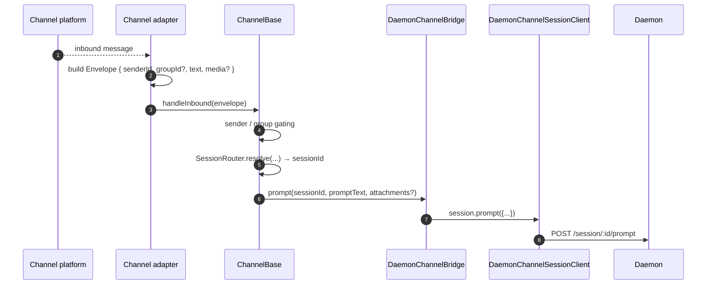
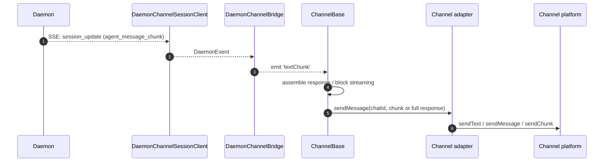
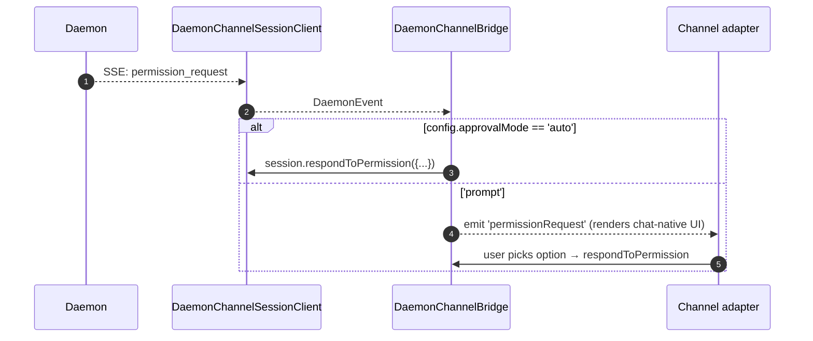

# Kanal-Adapter

## Übersicht

`packages/channels/` enthält die **IM-Kanal-Adapter**, die eingehende Nachrichten einer Chat-Plattform in einen Daemon-Prompt und die ausgehenden Ereignisse des Daemons in Chat-Plattform-Nachrichten umwandeln. Derzeit werden vier konkrete Kanäle ausgeliefert: DingTalk, WeChat (Weixin), Telegram und Feishu. Sie teilen sich eine Basisschicht (`packages/channels/base/`) sowie eine `DaemonChannelBridge`, die das Session-Multiplexing und den SSE-Konsum übernimmt.

Jeder Kanal bildet eingehenden Chat-Traffic auf Daemon-Sessions unter einem konfigurierbaren `SessionScope` (`user`, `thread` oder `single`) ab. Der Adapter delegiert an die `DaemonChannelBridge`, die wiederum an den `DaemonSessionClient` des SDK delegiert (siehe [`13-sdk-daemon-client.md`](./13-sdk-daemon-client.md)).

## Zuständigkeiten

- Empfangen eingehender Nachrichten vom nativen Transport des Kanals (DingTalk WebSocket-Stream, WeChat HTTP Long-Poll, Telegram Bot Long-Poll, Feishu WebSocket oder HTTP-Webhook).
- Auflösen von `(senderId, groupId?)` in eine Daemon-Session über `DaemonChannelSessionFactory`.
- Weiterleiten der Benutzernachricht als Daemon-Prompt und Zurückstreamen der Antwort als ausgehende Chat-Nachrichten, ggf. aufgeteilt in Blöcke.
- Darstellen von Berechtigungsanfragen als chat-native Prompts bei interaktivem Modus; andernfalls automatische Genehmigung gemäß `ChannelConfig.approvalMode`.
- Anwenden von Sender-Gating (Allowlists / Denylists), Gruppen-Gating und Inhaltsnormalisierung (Markdown / HTML pro Kanal).

## Architektur

### `DaemonChannelBridge` (gemeinsame Basis, `packages/channels/base/src/DaemonChannelBridge.ts`)

```ts
class DaemonChannelBridge extends EventEmitter {
  constructor(opts: {
    cwd: string;
    sessionFactory: DaemonChannelSessionFactory;
    modelServiceId?: string;
    sessionScope?: SessionScope;
  });
  newSession(cwd: string): Promise<string>;
  loadSession(sessionId: string, cwd: string): Promise<string>;
  prompt(sessionId: string, text: string, options?): Promise<string>;
  cancelSession(sessionId: string): Promise<void>;
  stop(): void;
}
```

Hält Daemon-Session-Clients, die nach Daemon-`sessionId` indiziert sind; `ChannelBase` und `SessionRouter` entscheiden, welches eingehende Chat-Ziel auf diese Session abgebildet wird. Jede angehängte Session hat:

- Einen `DaemonChannelSessionClient` (Form eines `DaemonSessionClient` ohne kanalirrelevante Methoden).
- Eine Live-SSE-Consumer-Pumpe.
- Einen entprellten Prompt-Assembler (für Adapter, die Benutzereingaben über mehrere eingehende Nachrichten fragmentieren).
- Eine Auto-Approval-Richtlinie pro Anfrage.

Ausgegebene Ereignisse: `textChunk`, `toolCall`, `sessionUpdate`, `permissionRequest`, `permissionResolved`, `modelSwitched`, `modelSwitchFailed`, `sessionDied`, `promptComplete` und `error`. Die Kanal-Adapter verbinden diese mit plattformnativen APIs.

### `ChannelBase` (`packages/channels/base/src/ChannelBase.ts`)

```ts
abstract class ChannelBase {
  abstract connect(): Promise<void>;
  abstract sendMessage(chatId: string, text: string): Promise<void>;
  abstract disconnect(): void;
  handleInbound(envelope: Envelope): Promise<void>; // → SessionRouter.resolve + bridge.prompt
}
```

Behandelt übergreifende Querschnittsaufgaben: Sender-Gating (Allowlist / Denylist), Gruppen-Gating, Nachrichtenblock-Streaming (Chunk-Größe, Drosselung), eingehende Entprellung.

### Pro-Kanal-Adapter

| Adapter         | Datei                                                | Transport                                              | Anmerkungen                                                                                                        |
| --------------- | ---------------------------------------------------- | ------------------------------------------------------ | ------------------------------------------------------------------------------------------------------------------ |
| DingTalk        | `packages/channels/dingtalk/src/DingtalkAdapter.ts`  | DingTalk Stream SDK WebSocket                          | Sendet über `sessionWebhook` POST; Medienbilder werden über die DT API heruntergeladen, base64 im Envelope.        |
| WeChat (Weixin) | `packages/channels/weixin/src/WeixinAdapter.ts`      | iLink Bot HTTP long-poll                               | Sendet über proprietäre `sendText`/`sendImage` API; Tipp-Indikatoren.                                               |
| Telegram        | `packages/channels/telegram/src/TelegramAdapter.ts`  | Telegram Bot API long-poll (grammy)                    | Sendet HTML-Blöcke über `sendMessage`.                                                                             |
| Feishu          | `packages/channels/feishu/src/FeishuAdapter.ts`      | Feishu/Lark Stream WebSocket (default) or HTTP webhook | Sendet über das Lark SDK als interaktive Karten; Webhook-Modus erfordert `encryptKey` zur HMAC-Signaturüberprüfung. |

Jeder Adapter implementiert:

1. Eingehender Transport (Abonnieren / Abfragen von Nachrichten).
2. Envelope-Konstruktion (`{ senderId, groupId?, text, media?, raw }`).
3. Sender-/Gruppen-Gating (delegiert an `ChannelBase`).
4. Ausgehende Serialisierung (Markdown → HTML / WeChat-nativ / DingTalk-nativ).
5. Lebenszyklus (Start / Herunterfahren).

### Adapter-Matrix
| Adapter      | Transport                       | Identität                                                 | Berechtigungs-UX                       | Konfiguration der automatischen Genehmigung                               |
| ------------ | ------------------------------- | -------------------------------------------------------- | ----------------------------------- | ------------------------------------------------- |
| **DingTalk** | WebSocket-Stream                | `senderStaffId` (+ optional `conversationId` für Gruppen) | Inline-Schaltflächen über DT-Markdown      | `ChannelConfig.approvalMode = 'auto' \| 'prompt'` |
| **WeChat**   | HTTP-Long-Poll                  | `senderWxid` (+ optional `groupWxid`)                    | Rein textuelle Eingabeaufforderungen mit Antwort-Tokens | Gleiche                                              |
| **Telegram**  | Bot API Long-Poll               | `from.id` (+ optional `chat.id` für Gruppen)             | Inline-Keyboard-Schaltflächen             | Gleiche                                              |
| **Feishu**   | WebSocket-Stream / HTTP-Webhook | `sender.open_id` (+ optional `chat_id` für Gruppen)      | Interaktive Karten-Schaltflächen            | Gleiche                                              |

> **Hinweis:** Die Spalte „Berechtigungs-UX“ beschreibt die native Unterstützung jeder Plattform, aber keine ist noch aktiviert – `AcpBridge.requestPermission` genehmigt derzeit jede Anfrage automatisch (`packages/channels/base/src/AcpBridge.ts`), und `ChannelConfig.approvalMode` ist deklariert, wird aber noch nicht gelesen. Interaktive Genehmigung ist geplant (Phase 5).

## Workflow

### Eingehender Prompt



### SSE-gesteuerter ausgehender Datenverkehr



### Automatische Genehmigung von Berechtigungen



## Zustand & Lebenszyklus

- `DaemonChannelBridge` lebt für die Lebensdauer des Channel-Adapters; Sitzungen innerhalb davon leben entsprechend dem konfigurierten `SessionScope`.
- Jede aktive Sitzung verbindet sich automatisch neu, wenn die SSE-Verbindung abbricht – `DaemonSessionClient.events()` verfolgt `lastSeenEventId`, sodass die Wiedergabe korrekt ist.
- `shutdown()` schließt jede aktive Sitzung und den zugrunde liegenden Transport (den WebSocket / Long-Poll des Channels).
- DingTalk’s WebSocket-Stream unterstützt Server-Push; WeChat’s Long-Poll erfordert eine Backoff-Strategie bei Leerlauf-Antworten; Telegram’s Long-Poll hat einen integrierten `timeout`-Parameter.

## Abhängigkeiten

- `packages/channels/base/` – `ChannelBase`, `DaemonChannelBridge`, `types.ts` (`ChannelConfig`, `Envelope`, `SessionScope`, `ChannelPlugin`).
- `packages/sdk-typescript/src/daemon/` – `DaemonSessionClient` und verwandte.
- Pro-Channel-SDKs: `@dingtalk/stream` (DingTalk), proprietäres iLink Bot HTTP (Weixin), `grammy` (Telegram).

## Konfiguration

`ChannelConfig` (aus `packages/channels/base/src/types.ts`):

| Parameter                              | Wirkung                                                                                                    |
| -------------------------------------- | ---------------------------------------------------------------------------------------------------------- |
| `sessionScope`                         | `'user'` (Absender + Chat), `'thread'` (Thread-ID oder Chat) oder `'single'` (eine gemeinsame Sitzung pro Channel). |
| `approvalMode`                         | `'auto'` (automatische Antwort) / `'prompt'` (UI anzeigen).                                                         |
| `allowlist?: string[]`                 | Zugelassene Absender-IDs; fehlend = offen.                                                                       |
| `denylist?: string[]`                  | Abgelehnte Absender-IDs.                                                                                        |
| `chunkSize`, `chunkIntervalMs`         | Einstellungen für ausgehendes Block-Streaming.                                                                        |
| `daemon: { baseUrl, token?, clientId? }` | Weitergeleitet an `DaemonChannelSessionFactory`.                                                               |
Kanalspezifische Schlüssel werden darauf gelegt (DingTalk: `streamCredentials`; WeChat: `ilinkUrl`, `botId`; Telegram: `botToken`; Feishu: `clientId` (appId), `clientSecret` (appSecret), `verificationToken`, `encryptKey` (Webhook-Modus)).

## Hinweise & bekannte Einschränkungen

- **Kanäle importieren `@qwen-code/sdk` nicht direkt.** Sie gehen über `ChannelBase` → `DaemonChannelBridge` → `DaemonChannelSessionClient` (den der Bridge aus dem SDK erstellt). Die Indirektion erlaubt es dem Bridge, Implementierungen auszutauschen, z. B. einen Test-Stub, ohne dass Kanaländerungen erforderlich sind.
- **Berechtigungs-UI ist kanalspezifisch.** DingTalk verwendet Markdown-Buttons; WeChat ist nur Text; Telegram nutzt Inline-Keyboards; Feishu verwendet interaktive Karten-Buttons. (Alle genehmigen derzeit automatisch über `AcpBridge`; interaktive Genehmigung ist geplant.) Es gibt noch keine gemeinsame Abstraktion für ein „interaktives Berechtigungs-Widget".
- **Die automatische Genehmigung ist eine Entscheidung auf der Deployment-Seite**, nicht auf der Daemon-Seite. Die `permission_mediation`-Richtlinie des Daemons gilt weiterhin; automatische Genehmigung bedeutet nur, dass der Kanal antwortet, ohne den Menschen zu fragen. Kombinieren Sie `auto` nicht mit Workflows der Stufe `enforce`.
- **Ratenbegrenzungen pro Kanal / Nachrichtengrößenbegrenzungen sind die Aufgabe des Adapters.** `DaemonChannelBridge` behandelt nur das Chunking; das Überschreiten der WeChat-Nachrichtengröße oder des Telegram-Flood-Limits liegt am Adapter.
- **Kein Rückruf von DingTalk / WeChat / Telegram / Feishu** — Kanäle sind unidirektional (Chat → Daemon → Chat). Der native Push-Pfad der IM-Plattform, wie z. B. ein DingTalk-Karten-Callback, ist noch nicht in den Bridge eingebunden.

## Referenzen

- `packages/channels/base/src/DaemonChannelBridge.ts`
- `packages/channels/base/src/ChannelBase.ts`
- `packages/channels/base/src/types.ts`
- `packages/channels/dingtalk/src/DingtalkAdapter.ts`
- `packages/channels/weixin/src/WeixinAdapter.ts`
- `packages/channels/telegram/src/TelegramAdapter.ts`
- `packages/channels/plugin-example/` (Referenzgerüst für Plugins)
- Leitfaden für Kanal-Plugins: [`../channel-plugins.md`](../channel-plugins.md).
- SDK-Referenz: [`13-sdk-daemon-client.md`](./13-sdk-daemon-client.md).
