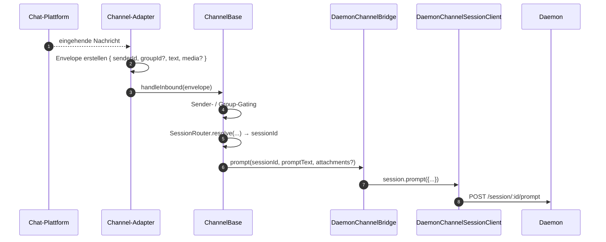
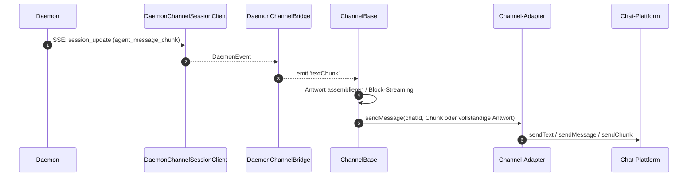
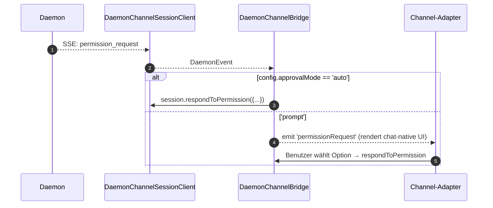

# Channel-Adapter

## Übersicht

`packages/channels/` enthält die **IM-Channel-Adapter**, die eine eingehende Nachricht einer Chat-Plattform in einen Agent-Prompt umwandeln und die Agent-Antwort zurück an die Chat-Plattform senden. Aktuell sind vier konkrete Channels verfügbar: DingTalk, WeChat (Weixin), Telegram und Feishu. Sie teilen sich eine Basisschicht (`packages/channels/base/`) und einen adapterseitigen `ChannelAgentBridge`-Contract.

Es gibt aktuell zwei Host-Modi:

- `qwen channel start [name]` ist der eigenständige, ACP-gestützte Channel-Service. Er übergibt den Adaptern eine `AcpBridge`-Implementierung von `ChannelAgentBridge`.
- `qwen serve --channel <name>` und `qwen serve --channel all` sind experimentelle, vom Daemon verwaltete Modi. `qwen serve` startet einen Out-of-Process-Channel-Worker, der Worker verbindet sich über das SDK mit dem Daemon, und die Adapter erhalten eine von `DaemonChannelBridge` gestützte `ChannelAgentBridge`-Fassade.

Im Daemon-verwalteten Modus mappt jeder Channel den eingehenden Chat-Traffic auf Daemon-Sessions unter einem konfigurierbaren `SessionScope` (`user`, `thread` oder `single`). Der Adapter delegiert an `DaemonChannelBridge`, was wiederum an den `DaemonSessionClient` des SDKs delegiert (siehe [`13-sdk-daemon-client.md`](./13-sdk-daemon-client.md)). Ein Daemon ist an genau einen Workspace gebunden, daher muss das `cwd` jedes ausgewählten Channels auf den Daemon-Workspace aufgelöst werden.

## Aufgaben

- Empfangen eingehender Nachrichten vom nativen Transport des Channels (DingTalk WebSocket-Stream, WeChat HTTP Long-Poll, Telegram Bot Long-Poll, Feishu WebSocket oder HTTP Webhook).
- Auflösen von `(senderId, groupId?)` in eine Daemon-Session über `DaemonChannelSessionFactory`.
- Weiterleiten der Benutzer-Nachricht als Daemon-Prompt und Zurückstreamen der Antwort als ausgehende Chat-Nachrichten, ggf. in Chunks.
- Rendern von Berechtigungsanfragen als chat-native Prompts, wenn interaktiv; andernfalls automatisches Genehmigen gemäß `ChannelConfig.approvalMode`.
- Anwenden von Sender-Gating (Allowlists / Denylists), Group-Gating und Inhaltsnormalisierung (Markdown / HTML je nach Channel).

## Architektur

### `DaemonChannelBridge` (gemeinsame Basis, `packages/channels/base/src/DaemonChannelBridge.ts`)

```ts
class DaemonChannelBridge extends EventEmitter {
  constructor(opts: {
    cwd: string;
    sessionFactory: DaemonChannelSessionFactory;
    modelServiceId?: string;
    sessionScope?: SessionScope;
  });
  newSession(cwd: string): Promise<string>;
  loadSession(sessionId: string, cwd: string): Promise<string>;
  prompt(sessionId: string, text: string, options?): Promise<string>;
  cancelSession(sessionId: string): Promise<void>;
  stop(): void;
}
```

Hält Daemon-Session-Clients, gekeyed nach Daemon-`sessionId`; `ChannelBase` und `SessionRouter` entscheiden, welches eingehende Chat-Ziel auf diese Session gemappt wird. Jede angehängte Session verfügt über:

- Einen `DaemonChannelSessionClient` (Form von `DaemonSessionClient` ohne channel-irrelevante Methoden).
- Eine Live-SSE-Consumer-Pump.
- Einen Debounced-Prompt-Assembler (für Adapter, die Benutzereingaben über mehrere eingehende Nachrichten fragmentieren).
- Eine Auto-Approve-Richtlinie pro Anfrage.

Ausgegebene Events: `textChunk`, `toolCall`, `sessionUpdate`, `permissionRequest`, `permissionResolved`, `modelSwitched`, `modelSwitchFailed`, `sessionDied`, `promptComplete` und `error`. Channel-Adapter verdrahten diese mit plattformspezifischen APIs.

### `ChannelBase` (`packages/channels/base/src/ChannelBase.ts`)

Abstrakte Basisklasse, die jeder Adapter erweitert:

```ts
abstract class ChannelBase {
  abstract connect(): Promise<void>;
  abstract sendMessage(chatId: string, text: string): Promise<void>;
  abstract disconnect(): void;
  handleInbound(envelope: Envelope): Promise<void>; // → SessionRouter.resolve + bridge.prompt
}
```

Behandelt gängige Cross-Cutting-Concerns: Sender-Gating (Allowlist / Denylist), Group-Gating, Message-Block-Streaming (Chunk-Größe, Throttling), Inbound-Debounce.

### Channel-spezifische Adapter

| Adapter         | Datei                                               | Transport                                              | Hinweise                                                                                                   |
| --------------- | --------------------------------------------------- | ------------------------------------------------------ | ---------------------------------------------------------------------------------------------------------- |
| DingTalk        | `packages/channels/dingtalk/src/DingtalkAdapter.ts` | DingTalk Stream SDK WebSocket                          | Sendet via `sessionWebhook` POST; Medien-Bilder werden über die DT-API heruntergeladen, base64 im Envelope.|
| WeChat (Weixin) | `packages/channels/weixin/src/WeixinAdapter.ts`     | iLink Bot HTTP long-poll                               | Sendet über proprietäre `sendText` / `sendImage` API; Typing-Indikatoren.                                  |
| Telegram        | `packages/channels/telegram/src/TelegramAdapter.ts` | Telegram Bot API long-poll (grammy)                    | Sendet HTML-Chunks via `sendMessage`.                                                                      |
| Feishu          | `packages/channels/feishu/src/FeishuAdapter.ts`     | Feishu/Lark Stream WebSocket (default) oder HTTP webhook | Sendet über Lark SDK als interaktive Karten; Webhook-Modus erfordert `encryptKey` für HMAC-Signaturverifizierung. |

Jeder Adapter implementiert:

1. Inbound-Transport (Subscriben / Pollen auf Nachrichten).
2. Envelope-Konstruktion (`{ senderId, groupId?, text, media?, raw }`).
3. Sender- / Group-Gating (delegiert an `ChannelBase`).
4. Outbound-Serialisierung (Markdown → HTML / WeChat-nativ / DingTalk-nativ).
5. Lifecycle (Start / Shutdown).

### Adapter-Matrix

| Adapter      | Transport                       | Identität                                              | Permission-UX                       | Auto-Approve-Konfiguration                    |
| ------------ | ------------------------------- | ------------------------------------------------------ | ----------------------------------- | --------------------------------------------- |
| **DingTalk** | WebSocket stream                | `senderStaffId` (+ optional `conversationId` für Gruppen) | Inline-Buttons via DT-Markdown      | `ChannelConfig.approvalMode = 'auto' \| 'prompt'` |
| **WeChat**   | HTTP long-poll                  | `senderWxid` (+ optional `groupWxid`)                  | Text-Prompts mit Reply-Tokens       | Gleich                                        |
| **Telegram** | Bot API long-poll               | `from.id` (+ optional `chat.id` für Gruppen)           | Inline-Keyboard-Buttons             | Gleich                                        |
| **Feishu**   | WebSocket stream / HTTP webhook | `sender.open_id` (+ optional `chat_id` für Gruppen)    | Interaktive Karten-Buttons          | Gleich                                        |

> **Hinweis:** Die Spalte "Permission-UX" beschreibt die native Affordanz jeder Plattform, aber keine ist derzeit verdrahtet – `AcpBridge.requestPermission` genehmigt derzeit jede Anfrage automatisch (`packages/channels/base/src/AcpBridge.ts`), und `ChannelConfig.approvalMode` ist deklariert, wird aber noch nicht ausgelesen. Interaktives Genehmigen ist geplant (Phase 5).

## Workflow

### Inbound-Prompt



### SSE-gesteuerter Outbound



### Permission-Auto-Approve



## State & Lifecycle

- `DaemonChannelBridge` lebt für die Lebensdauer des Channel-Adapters; Sessions darin leben gemäß dem konfigurierten `SessionScope`.
- Jede aktive Session verbindet sich automatisch neu, wenn SSE abbricht – `DaemonSessionClient.events()` trackt `lastSeenEventId`, sodass das Replay korrekt ist.
- `shutdown()` schließt jede aktive Session und den zugrunde liegenden Transport (WebSocket / Long-Poll des Channels).
- Der WebSocket-Stream von DingTalk unterstützt Server-Push; der Long-Poll von WeChat erfordert eine Backoff-Strategie bei Idle-Responses; der Long-Poll von Telegram hat einen eingebauten `timeout`-Parameter.

## Abhängigkeiten

- `packages/channels/base/` — `ChannelBase`, `DaemonChannelBridge`, `types.ts` (`ChannelConfig`, `Envelope`, `SessionScope`, `ChannelPlugin`).
- `packages/sdk-typescript/src/daemon/` — `DaemonSessionClient` und verwandte Klassen.
- Channel-spezifische SDKs: `@dingtalk/stream` (DingTalk), proprietärer iLink Bot HTTP (Weixin), `grammy` (Telegram).

## Konfiguration

`ChannelConfig` (aus `packages/channels/base/src/types.ts`):

| Knob                                     | Effekt                                                                                                    |
| ---------------------------------------- | --------------------------------------------------------------------------------------------------------- |
| `sessionScope`                           | `'user'` (Sender + Chat), `'thread'` (Thread-ID oder Chat) oder `'single'` (eine gemeinsame Session pro Channel). |
| `approvalMode`                           | `'auto'` (automatisch antworten) / `'prompt'` (UI rendern).                                               |
| `allowlist?: string[]`                   | Erlaubte Sender-IDs; fehlend = offen.                                                                     |
| `denylist?: string[]`                    | Abgewiesene Sender-IDs.                                                                                   |
| `chunkSize`, `chunkIntervalMs`           | Outbound-Block-Streaming-Einstellungen.                                                                   |
| `daemon: { baseUrl, token?, clientId? }` | Wird an `DaemonChannelSessionFactory` weitergeleitet.                                                     |

Channel-spezifische Keys werden darüber hinaus hinzugefügt (DingTalk: `streamCredentials`; WeChat: `ilinkUrl`, `botId`; Telegram: `botToken`; Feishu: `clientId` (appId), `clientSecret` (appSecret), `verificationToken`, `encryptKey` (Webhook-Modus)).

## Einschränkungen & bekannte Limits

- **Channels importieren nicht direkt `@qwen-code/sdk`.** Sie gehen über `ChannelBase` → `DaemonChannelBridge` → `DaemonChannelSessionClient` (welches der Bridge aus dem SDK konstruiert). Diese Indirektion ermöglicht es der Bridge, Implementierungen auszutauschen, wie z. B. einen Test-Stub, ohne Änderungen an den Channels zu erfordern.
- **Permission-UX ist channel-spezifisch.** DingTalk verwendet Markdown-Buttons; WeChat ist textbasiert; Telegram nutzt Inline-Keyboards; Feishu verwendet interaktive Karten-Buttons. (Alle genehmigen derzeit automatisch über `AcpBridge`; interaktives Genehmigen ist geplant.) Es gibt noch keine gemeinsame Abstraktion für ein "interaktives Permission-Widget".
- **Auto-Approve ist eine Entscheidung auf Deployment-Seite**, nicht auf Daemon-Seite. Die `permission_mediation`-Richtlinie des Daemons gilt weiterhin; Auto-Approve bedeutet nur, dass der Channel antwortet, ohne den Menschen zu prompten. Kombiniere `auto` nicht mit Workflows der `enforce`-Klasse.
- **Channel-spezifische Rate-Limits / Nachrichtengrößen-Limits sind Aufgabe des Adapters.** `DaemonChannelBridge` übernimmt nur das Chunking; das Überschreiten der Nachrichtengröße von WeChat oder des Flood-Limits von Telegram liegt beim Adapter.
- **Keine DingTalk- / WeChat- / Telegram- / Feishu-Reverse-Calls** – Channels sind unidirektional (Chat → Daemon → Chat). Der native Push-Pfad der IM-Plattform, wie z. B. ein DingTalk-Card-Callback, ist noch nicht in die Bridge integriert.

## Referenzen

- `packages/channels/base/src/DaemonChannelBridge.ts`
- `packages/channels/base/src/ChannelBase.ts`
- `packages/channels/base/src/types.ts`
- `packages/channels/dingtalk/src/DingtalkAdapter.ts`
- `packages/channels/weixin/src/WeixinAdapter.ts`
- `packages/channels/telegram/src/TelegramAdapter.ts`
- `packages/channels/plugin-example/` (Referenz-Plugin-Scaffold)
- Channel-Plugin-Guide: [`../channel-plugins.md`](../channel-plugins.md).
- SDK-Referenz: [`13-sdk-daemon-client.md`](./13-sdk-daemon-client.md).