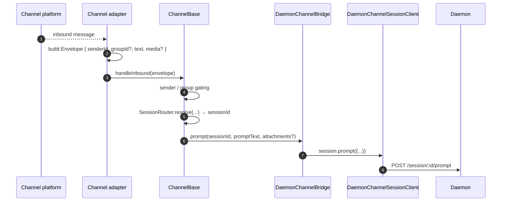
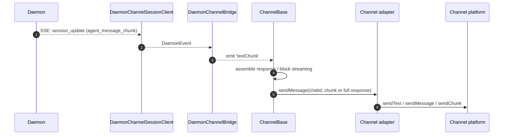
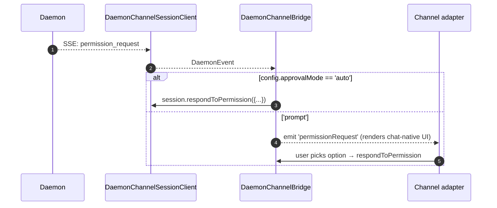

# Kanaladapter

## Übersicht

`packages/channels/` enthält die **IM-Kanaladapter**, die eingehende Nachrichten einer Chat-Plattform in einen Daemon-Prompt und die ausgehenden Ereignisse des Daemons in Chat-Plattform-Nachrichten umwandeln. Heute werden vier konkrete Kanäle ausgeliefert: DingTalk, WeChat (Weixin), Telegram und Feishu. Sie teilen sich eine gemeinsame Basisschicht (`packages/channels/base/`) sowie eine `DaemonChannelBridge`, die Session-Multiplexing und SSE-Verarbeitung übernimmt.

Jeder Kanal ordnet eingehenden Chat-Traffic unter einem konfigurierbaren `SessionScope` (`user`, `thread` oder `single`) Daemon-Sessions zu. Der Adapter delegiert an `DaemonChannelBridge`, die wiederum an den SDK-`DaemonSessionClient` delegiert (siehe [`13-sdk-daemon-client.md`](./13-sdk-daemon-client.md)).

## Verantwortlichkeiten

- Empfangen eingehender Nachrichten vom nativen Transport des Kanals (DingTalk WebSocket-Stream, WeChat HTTP Long-Poll, Telegram Bot Long-Poll, Feishu WebSocket oder HTTP Webhook).
- Auflösen von `(senderId, groupId?)` in eine Daemon-Session über `DaemonChannelSessionFactory`.
- Weiterleiten der Benutzernachricht als Daemon-Prompt und Zurückstreamen der Antwort als ausgehende Chat-Nachrichten, möglicherweise aufgeteilt in Blöcke.
- Darstellen von Berechtigungsanfragen als chat-native Prompts, wenn interaktiv; andernfalls automatische Genehmigung gemäß `ChannelConfig.approvalMode`.
- Anwenden von Sender-Gating (Allowlists/Denylists), Group-Gating und Inhaltsnormalisierung (Markdown/HTML pro Kanal).

## Architektur

### `DaemonChannelBridge` (gemeinsame Basis, `packages/channels/base/src/DaemonChannelBridge.ts`)

```ts
class DaemonChannelBridge extends EventEmitter {
  constructor(opts: {
    cwd: string;
    sessionFactory: DaemonChannelSessionFactory;
    modelServiceId?: string;
    sessionScope?: SessionScope;
  });
  newSession(cwd: string): Promise<string>;
  loadSession(sessionId: string, cwd: string): Promise<string>;
  prompt(sessionId: string, text: string, options?): Promise<string>;
  cancelSession(sessionId: string): Promise<void>;
  stop(): void;
}
```

Hält Daemon-Session-Clients, die nach der Daemon-`sessionId` indiziert sind; `ChannelBase` und `SessionRouter` entscheiden, welches eingehende Chat-Ziel dieser Session zugeordnet wird. Jede angeschlossene Session hat:

- Einen `DaemonChannelSessionClient` (Form von `DaemonSessionClient` ohne kanalirrelevante Methoden).
- Eine live laufende SSE-Consumer-Pumpe.
- Einen entprellten Prompt-Assembler (für Adapter, die Benutzereingaben über mehrere eingehende Nachrichten fragmentieren).
- Eine automatische Genehmigungsrichtlinie pro Anfrage.

Ausgegebene Events: `textChunk`, `toolCall`, `sessionUpdate`, `permissionRequest`, `permissionResolved`, `modelSwitched`, `modelSwitchFailed`, `sessionDied`, `promptComplete` und `error`. Kanaladapter verbinden diese mit plattformnativen APIs.

### `ChannelBase` (`packages/channels/base/src/ChannelBase.ts`)

Abstrakte Basis, die jeder Adapter erweitert:

```ts
abstract class ChannelBase {
  abstract connect(): Promise<void>;
  abstract sendMessage(chatId: string, text: string): Promise<void>;
  abstract disconnect(): void;
  handleInbound(envelope: Envelope): Promise<void>; // → SessionRouter.resolve + bridge.prompt
}
```

Behandelt gemeinsame Querschnittsbelange: Sender-Gating (Allowlist/Denylist), Group-Gating, Nachrichtenblock-Streaming (Chunk-Größe, Drosselung), eingehende Entprellung.

### Kanal-spezifische Adapter

| Adapter         | Datei                                                | Transport                                               | Anmerkungen                                                                                                                                    |
| --------------- | ---------------------------------------------------- | ------------------------------------------------------- | ---------------------------------------------------------------------------------------------------------------------------------------------- |
| DingTalk        | `packages/channels/dingtalk/src/DingtalkAdapter.ts` | DingTalk Stream SDK WebSocket                           | Sendet via `sessionWebhook` POST; Medienbilder via DT API heruntergeladen, base64 im Envelope.                                                 |
| WeChat (Weixin) | `packages/channels/weixin/src/WeixinAdapter.ts`     | iLink Bot HTTP Long-Poll                                | Sendet via proprietärer `sendText`/`sendImage` API; Tipp-Anzeigen.                                                                             |
| Telegram        | `packages/channels/telegram/src/TelegramAdapter.ts` | Telegram Bot API Long-Poll (grammy)                     | Sendet HTML-Blöcke via `sendMessage`.                                                                                                          |
| Feishu          | `packages/channels/feishu/src/FeishuAdapter.ts`     | Feishu/Lark Stream WebSocket (Standard) oder HTTP Webhook | Sendet via Lark SDK als interaktive Karten; Webhook-Modus erfordert `encryptKey` für HMAC-Signaturprüfung. |

Jeder Adapter implementiert:

1. Inbound-Transport (Nachrichten abonnieren/abfragen).
2. Envelope-Konstruktion (`{ senderId, groupId?, text, media?, raw }`).
3. Sender-/Group-Gating (delegiert an `ChannelBase`).
4. Outbound-Serialisierung (Markdown → HTML/WeChat-nativ/DingTalk-nativ).
5. Lebenszyklus (Starten/Herunterfahren).

### Adapter-Matrix

| Adapter      | Transport                          | Identität                                                  | Berechtigungs-UX                     | Auto-Approval-Konfiguration                     |
| ------------ | ---------------------------------- | ---------------------------------------------------------- | ------------------------------------ | ----------------------------------------------- |
| **DingTalk** | WebSocket-Stream                   | `senderStaffId` (+ optional `conversationId` für Gruppen) | Inline-Buttons via DT-Markdown       | `ChannelConfig.approvalMode = 'auto' \| 'prompt'` |
| **WeChat**   | HTTP Long-Poll                     | `senderWxid` (+ optional `groupWxid`)                      | Textbasierte Prompts mit Antwort-Tokens | Gleich                                         |
| **Telegram** | Bot API Long-Poll                  | `from.id` (+ optional `chat.id` für Gruppen)              | Inline-Keyboard-Buttons              | Gleich                                         |
| **Feishu**   | WebSocket-Stream / HTTP Webhook    | `sender.open_id` (+ optional `chat_id` für Gruppen)       | Interaktive Karten-Buttons            | Gleich                                         |

> [!note]
> Die Spalte „Berechtigungs-UX“ beschreibt die native Möglichkeit jeder Plattform, aber keine ist derzeit verdrahtet – `AcpBridge.requestPermission` genehmigt derzeit jede Anfrage automatisch (`packages/channels/base/src/AcpBridge.ts`), und `ChannelConfig.approvalMode` ist zwar deklariert, aber noch nicht ausgelesen. Interaktive Genehmigung ist geplant (Phase 5).

## Workflow

### Eingehender Prompt



### SSE-gesteuerte Ausgabe



### Automatische Genehmigung (Auto-approve)



## Zustand & Lebenszyklus

- `DaemonChannelBridge` lebt für die gesamte Lebensdauer des Kanaladapters; die darin enthaltenen Sessions leben gemäß dem konfigurierten `SessionScope`.
- Jede aktive Session verbindet sich automatisch neu, falls die SSE-Verbindung abbricht – `DaemonSessionClient.events()` verfolgt `lastSeenEventId`, sodass die Wiedergabe korrekt ist.
- `shutdown()` schließt jede aktive Session und den zugrunde liegenden Transport (den WebSocket/Long-Poll des Kanals).
- Der WebSocket-Stream von DingTalk unterstützt Server-Push; der Long-Poll von WeChat erfordert eine Backoff-Strategie bei Leerlaufantworten; der Long-Poll von Telegram hat einen integrierten `timeout`-Parameter.

## Abhängigkeiten

- `packages/channels/base/` – `ChannelBase`, `DaemonChannelBridge`, `types.ts` (`ChannelConfig`, `Envelope`, `SessionScope`, `ChannelPlugin`).
- `packages/sdk-typescript/src/daemon/` – `DaemonSessionClient` und Verwandte.
- Kanal-spezifische SDKs: `@dingtalk/stream` (DingTalk), proprietäres iLink Bot HTTP (Weixin), `grammy` (Telegram).

## Konfiguration

`ChannelConfig` (aus `packages/channels/base/src/types.ts`):

| Einstellung                               | Auswirkung                                                                                                                           |
| ---------------------------------------- | -------------------------------------------------------------------------------------------------------------------------------------- |
| `sessionScope`                           | `'user'` (Sender + Chat), `'thread'` (Thread-ID oder Chat) oder `'single'` (eine gemeinsame Session pro Kanal).                       |
| `approvalMode`                           | `'auto'` (automatische Antwort) / `'prompt'` (UI anzeigen).                                                                           |
| `allowlist?: string[]`                   | Erlaubte Sender-IDs; fehlt = offen.                                                                                                   |
| `denylist?: string[]`                    | Abgelehnte Sender-IDs.                                                                                                                |
| `chunkSize`, `chunkIntervalMs`           | Einstellungen für das Streaming ausgehender Blöcke.                                                                                    |
| `daemon: { baseUrl, token?, clientId? }` | An `DaemonChannelSessionFactory` weitergeleitet.                                                                                       |

Kanalspezifische Schlüssel kommen oben drauf (DingTalk: `streamCredentials`; WeChat: `ilinkUrl`, `botId`; Telegram: `botToken`; Feishu: `clientId` (appId), `clientSecret` (appSecret), `verificationToken`, `encryptKey` (Webhook-Modus)).

## Einschränkungen & bekannte Grenzen

- **Kanäle importieren `@qwen-code/sdk` nicht direkt.** Sie gehen über `ChannelBase` → `DaemonChannelBridge` → `DaemonChannelSessionClient` (den die Bridge aus dem SDK erstellt). Diese Indirektion ermöglicht es der Bridge, Implementierungen (z. B. einen Test-Stub) auszutauschen, ohne Kanaländerungen zu erfordern.
- **Die Berechtigungs-UX ist kanalspezifisch.** DingTalk verwendet Markdown-Buttons; WeChat ist rein textbasiert; Telegram verwendet Inline-Keyboards; Feishu verwendet interaktive Karten-Buttons. (Alle genehmigen derzeit automatisch über `AcpBridge`; interaktive Genehmigung ist geplant.) Es gibt noch keine gemeinsame Abstraktion für ein „interaktives Berechtigungs-Widget“.
- **Auto-approve ist eine Entscheidung auf Deployment-Seite**, nicht auf Daemon-Seite. Die `permission_mediation`-Richtlinie des Daemons gilt weiterhin; Auto-approve bedeutet nur, dass der Kanal antwortet, ohne den Menschen aufzufordern. Kombinieren Sie `auto` nicht mit Workflows der Stufe `enforce`.
- **Kanalspezifische Ratenbegrenzungen/Nachrichtengrößenlimits sind Sache des Adapters.** `DaemonChannelBridge` kümmert sich nur um das Aufteilen in Blöcke; das Überschreiten der WeChat-Nachrichtengröße oder des Telegram-Flood-Limits liegt beim Adapter.
- **Kein DingTalk/WeChat/Telegram/Feishu Reverse-Call** – Kanäle sind unidirektional (Chat → Daemon → Chat). Der native Push-Pfad der IM-Plattform (z. B. ein DingTalk-Karten-Callback) ist noch nicht in die Bridge eingebunden.

## Referenzen

- `packages/channels/base/src/DaemonChannelBridge.ts`
- `packages/channels/base/src/ChannelBase.ts`
- `packages/channels/base/src/types.ts`
- `packages/channels/dingtalk/src/DingtalkAdapter.ts`
- `packages/channels/weixin/src/WeixinAdapter.ts`
- `packages/channels/telegram/src/TelegramAdapter.ts`
- `packages/channels/plugin-example/` (Referenz-Plugin-Gerüst)
- Kanal-Plugin-Anleitung: [`../channel-plugins.md`](../channel-plugins.md).
- SDK-Referenz: [`13-sdk-daemon-client.md`](./13-sdk-daemon-client.md).