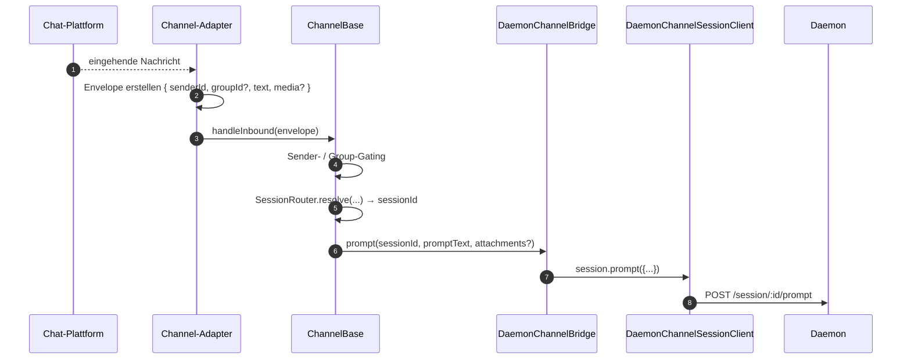
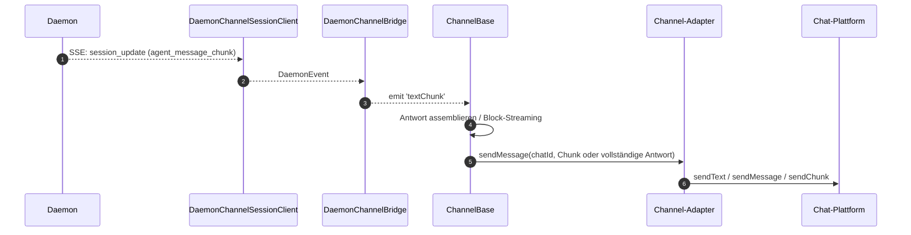
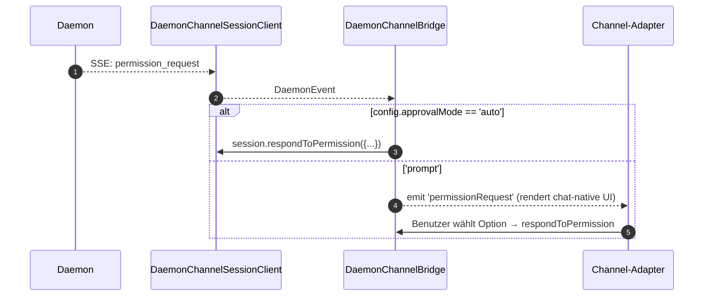

# Channel-Adapter

## Übersicht

`packages/channels/` enthält die **IM-Channel-Adapter**, die eine eingehende Nachricht einer Chat-Plattform in einen Agent-Prompt umwandeln und die Agent-Antwort zurück an die Chat-Plattform senden. Aktuell sind vier konkrete Channels verfügbar: DingTalk, WeChat (Weixin), Telegram und Feishu. Sie teilen sich eine Basisschicht (`packages/channels/base/`) und einen adapterseitigen `ChannelAgentBridge`-Contract.

Es gibt zwei Host-Modi:

- `qwen channel start [name]` ist der eigenständige, ACP-gestützte Channel-Service. Er übergibt den Adaptern eine `AcpBridge`-Implementierung von `ChannelAgentBridge`.
- `qwen serve --channel <name>` und `qwen serve --channel all` sind experimentelle, vom Daemon verwaltete Modi. Benannte Auswahlen werden nach besitzendem Workspace gruppiert und `qwen serve` startet einen Out-of-Process-Worker pro besitzender Runtime; jeder Worker verbindet sich über das SDK mit dem Daemon und die Adapter erhalten eine von `DaemonChannelBridge` gestützte `ChannelAgentBridge`-Fassade. `--channel all` bleibt eine Primary-only-Auswahl.

Im Daemon-verwalteten Modus mappt jeder Channel den eingehenden Chat-Traffic auf Daemon-Sessions unter einem konfigurierbaren `SessionScope` (`user`, `chat_thread` oder `single`). Der Legacy-Channel-Wert `thread` bleibt für bestehende Konfigurationen les- und schreibbar, aber neue WebShell-Konfigurationen bieten ihn nicht an; dies ist getrennt vom `single`/`thread`-Session-Creation-Knob der Daemon-Bridge. Bei `sessionScope: "user"` und `multiSession: true` fügt `ChannelBase` einen persistierten Named-Session-Katalog hinzu, gekeyed nach Channel, Chat und Sender, während `SessionRouter` die ausgewählte Session als Kompatibilitäts-Route beibehält. Exakte Named-Session-Loads verwenden niemals den Legacy-Load-or-Replace-Pfad. Ein Named-Turn reserviert seine exakte Session vor der asynchronen Vorbereitung und bleibt auch nach späteren Auswahländerungen gebunden, ohne die Kompatibilitäts-Route neu zu binden. Named-Tasks können parallel laufen, `/session cancel [<name>]` zielt nur auf den verifizierten aktiven Prompt, und Bare-Text-Berechtigungs-Befehle berücksichtigen nur den ausgewählten Task. Named-Turns erfassen außerdem ein Delivery-only Task-Quelllabel: Direktnachrichten verwenden `[task]`, Gruppen verwenden `[sender · task]`, und exakte Text-Berechtigungsprompts enthalten die Request-ID. Das Label wird nicht zur Modellantwort oder zum Transkript hinzugefügt. Der Adapter delegiert an `DaemonChannelBridge`, was wiederum an den `DaemonSessionClient` des SDKs delegiert (siehe [`13-sdk-daemon-client.md`](./13-sdk-daemon-client.md)). Jeder benannte Channel muss einem registrierten, vertrauenswürdigen Workspace aufgelöst werden. Der Worker verwendet das kanonische cwd, `QWEN_DAEMON_WORKSPACE` und das Environment-Overlay dieser Runtime; die Ownership-Auflösung fällt niemals auf Primary zurück.

### Webhook-getriggerte Channel-Tasks

Webhook-getriggerte Tasks werden von `qwen serve` gehostet und innerhalb des Daemon-verwalteten Channel-Workers ausgeführt. Die HTTP-Route validiert die Quelle und leitet einen `ChannelWebhookTask` über IPC an den Worker weiter. Der Worker ruft `ChannelBase.runWebhookTask()` auf, sodass Adapter keine Webhook-Parsung implementieren.

Adapter beteiligen sich weiterhin über Proactive-Send-Support: `supportsProactiveSend()` teilt dem Host mit, ob ein Channel ohne eingehende Nachricht senden kann, `supportsProactiveTarget()` behandelt Zustelllimits für bestimmte Target-Formen und `pushProactive()` transportiert den ausgehenden Inhalt.

## Aufgaben

- Empfangen eingehender Nachrichten vom nativen Transport des Channels (DingTalk WebSocket-Stream, WeChat HTTP Long-Poll, Telegram Bot Long-Poll, Feishu WebSocket oder HTTP Webhook).
- Auflösen von `(senderId, groupId?)` in eine Daemon-Session über `DaemonChannelSessionFactory`.
- Weiterleiten der Benutzer-Nachricht als Daemon-Prompt und Zurückstreamen der Antwort als ausgehende Chat-Nachrichten, ggf. in Chunks.
- Rendern von Berechtigungsanfragen als chat-native Prompts, wenn interaktiv; andernfalls automatisches Genehmigen gemäß `ChannelConfig.approvalMode`.
- Anwenden von Sender-Gating (Allowlists / Denylists), Group-Gating und Inhaltsnormalisierung (Markdown / HTML je nach Channel).

## Architektur

### `DaemonChannelBridge` (gemeinsame Basis, `packages/channels/base/src/DaemonChannelBridge.ts`)

```ts
class DaemonChannelBridge extends EventEmitter {
  constructor(opts: {
    cwd: string;
    sessionFactory: DaemonChannelSessionFactory;
    modelServiceId?: string;
    sessionScope?: SessionScope;
  });
  newSession(cwd: string): Promise<string>;
  loadSession(sessionId: string, cwd: string): Promise<string>;
  prompt(sessionId: string, text: string, options?): Promise<string>;
  cancelSession(sessionId: string): Promise<void>;
  stop(): void;
}
```

Hält Daemon-Session-Clients, gekeyed nach Daemon-`sessionId`; `ChannelBase` und `SessionRouter` entscheiden, welches eingehende Chat-Ziel auf diese Session gemappt wird. Jede angehängte Session verfügt über:

- Einen `DaemonChannelSessionClient` (Form von `DaemonSessionClient` ohne channel-irrelevante Methoden).
- Eine Live-SSE-Consumer-Pump.
- Einen Debounced-Prompt-Assembler (für Adapter, die Benutzereingaben über mehrere eingehende Nachrichten fragmentieren).
- Eine Auto-Approve-Richtlinie pro Anfrage.

Ausgegebene Events: `textChunk`, `toolCall`, `sessionUpdate`, `permissionRequest`, `permissionResolved`, `modelSwitched`, `modelSwitchFailed`, `sessionDied`, `promptComplete` und `error`. Channel-Adapter verdrahten diese mit plattformspezifischen APIs.

### `ChannelBase` (`packages/channels/base/src/ChannelBase.ts`)

Abstrakte Basisklasse, die jeder Adapter erweitert:

```ts
abstract class ChannelBase {
  abstract connect(): Promise<void>;
  abstract sendMessage(chatId: string, text: string): Promise<void>;
  abstract disconnect(): void;
  handleInbound(envelope: Envelope): Promise<void>; // → SessionRouter.resolve + bridge.prompt
}
```

Die gesamte interne Nachrichtenzustellung läuft über `sendThreadMessage(chatId, threadId, text, sourceLabel)`. Die Standard-Implementierung fällt auf `sendMessage(chatId, attributedText)` durch und ignoriert `threadId`. Polling-, Rich-Card-, Media-, Streaming- und Platform-Splitting-Adapter überschreiben diese Grenze, sodass das optionale Plain-Text-Source-Label für die Plattform escaped und auf jedem unabhängig sichtbaren Objekt wiederholt wird, ohne den Raw-Response-State zu verändern.

Behandelt gängige Cross-Cutting-Concerns: Sender-Gating (Allowlist / Denylist), Group-Gating, Message-Block-Streaming (Chunk-Größe, Throttling), Inbound-Debounce.

### Channel-spezifische Adapter

| Adapter         | Datei                                               | Transport                                              | Hinweise                                                                                                                                         |
| --------------- | --------------------------------------------------- | ------------------------------------------------------ | ------------------------------------------------------------------------------------------------------------------------------------------------ |
| DingTalk        | `packages/channels/dingtalk/src/DingtalkAdapter.ts` | DingTalk Stream SDK WebSocket                          | Sendet via `sessionWebhook` POST; Medien-Bilder werden über die DT-API heruntergeladen, base64 im Envelope.                                      |
| WeChat (Weixin) | `packages/channels/weixin/src/WeixinAdapter.ts`     | iLink Bot HTTP long-poll                               | Sendet über proprietäre `sendText` / `sendImage` API; Typing-Indikatoren.                                                                        |
| Telegram        | `packages/channels/telegram/src/TelegramAdapter.ts` | Telegram Bot API long-poll (grammy)                    | Sendet HTML-Chunks via `sendMessage`.                                                                                                            |
| Feishu          | `packages/channels/feishu/src/FeishuAdapter.ts`     | Feishu/Lark Stream WebSocket (default) oder HTTP webhook | Sendet über Lark SDK als interaktive Karten; Webhook-Modus erfordert `encryptKey` für HMAC-Signaturverifizierung.                                |
| GitHub          | `packages/channels/github/src/GithubAdapter.ts`     | GitHub Notifications API polling (`@octokit/rest`)     | Erweitert `PollingChannelBase`; Cursor-basiertes Comment-Window-Dedup; postet Kommentare über die Issues API.                                    |
| GitLab          | `packages/channels/gitlab/src/GitlabAdapter.ts`     | GitLab Todos API polling (`@gitbeaker/rest`)           | Erweitert `PollingChannelBase`; dispatcht `todo.body` direkt; `action_prompt_template`-Konfiguration steuert Event-Filterung und Metadata-Rendering. |

Jeder Adapter implementiert:

1. Inbound-Transport (Subscriben / Pollen auf Nachrichten).
2. Envelope-Konstruktion (`{ senderId, groupId?, text, media?, raw }`).
3. Sender- / Group-Gating (delegiert an `ChannelBase`).
4. Outbound-Serialisierung (Markdown → HTML / WeChat-nativ / DingTalk-nativ).
5. Lifecycle (Start / Shutdown).

### Adapter-Matrix

| Adapter      | Transport                       | Identität                                              | Permission-UX                       | Auto-Approve-Konfiguration                    |
| ------------ | ------------------------------- | ------------------------------------------------------ | ----------------------------------- | --------------------------------------------- |
| **DingTalk** | WebSocket stream                | `senderStaffId` (+ optional `conversationId` für Gruppen) | Inline-Buttons via DT-Markdown      | `ChannelConfig.approvalMode = 'auto' \| 'prompt'` |
| **WeChat**   | HTTP long-poll                  | `senderWxid` (+ optional `groupWxid`)                  | Text-Prompts mit Reply-Tokens       | Gleich                                        |
| **Telegram** | Bot API long-poll               | `from.id` (+ optional `chat.id` für Gruppen)           | Inline-Keyboard-Buttons             | Gleich                                        |
| **Feishu**   | WebSocket stream / HTTP webhook | `sender.open_id` (+ optional `chat_id` für Gruppen)    | Interaktive Karten-Buttons          | Gleich                                        |
| **GitHub**   | Notifications API polling       | Numerische `user.id` (unveränderlich; Login beim Connect aufgelöst) | Error-Kommentar + Re-Mention          | `senderPolicy: 'allowlist' \| 'open'`             |
| **GitLab**   | Todos API polling               | `author.username` (lowercased)                         | Log + Re-Mention                    | `senderPolicy: 'allowlist' \| 'open'`             |

> **Hinweis:** Die Spalte "Permission-UX" beschreibt die native Affordanz jeder Plattform, aber keine ist derzeit verdrahtet – `AcpBridge.requestPermission` genehmigt derzeit jede Anfrage automatisch (`packages/channels/base/src/AcpBridge.ts`), und `ChannelConfig.approvalMode` ist deklariert, wird aber noch nicht ausgelesen. Interaktives Genehmigen ist geplant (Phase 5).

## Workflow

### Inbound-Prompt


```mermaid
sequenceDiagram
    autonumber
    participant CH as Chat-Plattform
    participant AD as Channel-Adapter
    participant CB as ChannelBase
    participant BR as DaemonChannelBridge
    participant SC as DaemonChannelSessionClient
    participant D as Daemon

    CH-->>AD: eingehende Nachricht
    AD->>AD: Envelope erstellen { senderId, groupId?, text, media? }
    AD->>CB: handleInbound(envelope)
    CB->>CB: Sender- / Group-Gating
    CB->>CB: SessionRouter.resolve(...) → sessionId
    CB->>BR: prompt(sessionId, promptText, attachments?)
    BR->>SC: session.prompt({...})
    SC->>D: POST /session/:id/prompt
```

### SSE-gesteuerter Outbound


```mermaid
sequenceDiagram
    autonumber
    participant D as Daemon
    participant SC as DaemonChannelSessionClient
    participant BR as DaemonChannelBridge
    participant CB as ChannelBase
    participant AD as Channel-Adapter
    participant CH as Chat-Plattform

    D-->>SC: SSE: session_update (agent_message_chunk)
    SC-->>BR: DaemonEvent
    BR-->>CB: emit 'textChunk'
    CB->>CB: Antwort assemblieren / Block-Streaming
    CB->>AD: sendMessage(chatId, Chunk oder vollständige Antwort)
    AD->>CH: sendText / sendMessage / sendChunk
```

### Permission-Auto-Approve


```mermaid
sequenceDiagram
    autonumber
    participant D as Daemon
    participant SC as DaemonChannelSessionClient
    participant BR as DaemonChannelBridge
    participant AD as Channel-Adapter

    D-->>SC: SSE: permission_request
    SC-->>BR: DaemonEvent
    alt config.approvalMode == 'auto'
        BR->>SC: session.respondToPermission({...})
    else 'prompt'
        BR-->>AD: emit 'permissionRequest' (rendert chat-native UI)
        AD->>BR: Benutzer wählt Option → respondToPermission
    end
```

## State & Lifecycle

- `DaemonChannelBridge` lebt für die Lebensdauer des Channel-Adapters; Sessions darin leben gemäß dem konfigurierten `SessionScope`.
- Jede aktive Session verbindet sich automatisch neu, wenn SSE abbricht – `DaemonSessionClient.events()` trackt `lastSeenEventId`, sodass das Replay korrekt ist.
- `shutdown()` schließt jede aktive Session und den zugrunde liegenden Transport (WebSocket / Long-Poll des Channels).
- Der WebSocket-Stream von DingTalk unterstützt Server-Push; der Long-Poll von WeChat erfordert eine Backoff-Strategie bei Idle-Responses; der Long-Poll von Telegram hat einen eingebauten `timeout`-Parameter.

### Runtime-Auswahl und Settings-Reload

Der langlebige `ChannelWorkerManager` besitzt die feste Daemon-Auswahl und die nach Workspace gruppierten Supervisoren. Ein Daemon kann ohne `--channel` booten; das erste strikt-gatede `PUT /workspace/channel` lädt dynamisch die Channel-Runtime, reserviert die Service-PID-Datei, löst die Workspace-Ownership auf und startet die ausgewählten Worker. `GET /workspace/channel` liest den Manager-Snapshot und `DELETE /workspace/channel` stoppt ihn idempotent. SDK-Helper sind `getChannelWorkerControl()`, `setChannelWorkerSelection()` und `stopChannelWorker()`; der CLI-Einstieg ist `qwen channel set` plus die Remote-Varianten `status` und `stop`.

Der Daemon liest die Channel-Einstellungen aus `settings.json`, wenn jeder Worker startet (`packages/cli/src/commands/channel/daemon-worker.ts` → `loadSettings` → `loadChannelsConfig`). `POST /workspace/channel/reload` liest diese Einstellungen neu und erzwingt die Abstimmung mit der festen Auswahl. Alle Lifecycle-Mutationen teilen sich eine FIFO-Lane. Unveränderte Workspace-Gruppen überleben die gewöhnliche Auswahl-Ersetzung; geänderte Gruppen werden sequenziell gestoppt und gestartet, während die Serve-eigene PID-Lease gehalten wird.

Schlägt eine Ersetzung fehl, werden neu gestartete Worker gestoppt und alte Worker wiederhergestellt, bevor die Anfrage zurückkehrt. Ein Supervisor, der nach SIGTERM und SIGKILL keinen Exit beobachten kann, behält seine Kind-Referenz und schlägt beim Stoppen fehl; der Manager behält die PID-Lease und startet niemals einen zweiten Worker. Webhook-Konfiguration und -Routing ändern sich nur, wenn die Auswahl-Übernahme erfolgreich ist. Runtime-Auswahlen sind prozesslokal und verschwinden beim Daemon-Neustart.

Adapter-`connect()`-Fehler werden separat von Worker-Lifecycle-Fehlern gemeldet. Der Worker sendet jeden begrenzten, um Credentials bereinigten Fehler über die Startup-IPC und wartet auf eine Supervisor-Bestätigung, bevor er den nächsten Adapter versucht. Ein teilweise verbundener Worker bleibt laufend und exponiert `startupFailures` in seinem Snapshot. Schlägt jeder Adapter in einem dynamischen Versuch fehl, trägt die `502 channel_worker_start_failed`-Antwort die mit Workspace annotierten, versuchten Fehler, während `state` das Rollback-Ergebnis widerspiegelt; nachfolgende GET-Antworten behalten den Versuch nicht. Der Daemon-Boot ohne verbundenen Adapter bleibt fail-fast. Der optionale Adapter-`code` ist nur diagnostisch und die aktuelle `phase` ist `connect`.

## Abhängigkeiten

- `packages/channels/base/` — `ChannelBase`, `PollingChannelBase`, `DaemonChannelBridge`, `types.ts` (`ChannelConfig`, `Envelope`, `SessionScope`, `ChannelPlugin`).
- `packages/sdk-typescript/src/daemon/` — `DaemonSessionClient` und verwandte Klassen.
- Channel-spezifische SDKs: `@dingtalk/stream` (DingTalk), proprietärer iLink Bot HTTP (Weixin), `grammy` (Telegram), `@octokit/rest` (GitHub-Polling), `@gitbeaker/rest` (GitLab-Polling).

## Konfiguration

`ChannelConfig` (aus `packages/channels/base/src/types.ts`):

| Knob                                     | Effekt                                                                                                                              |
| ---------------------------------------- | ----------------------------------------------------------------------------------------------------------------------------------- |
| `sessionScope`                           | `'user'` (Sender + Chat), `'chat_thread'` (Channel + chatId + threadId) oder `'single'` (eine gemeinsame Session pro Channel). Legacy `'thread'` bleibt bei bestehender Konfiguration erhalten, wird aber für neue WebShell-Konfigurationen nicht angeboten. |
| `multiSession`                           | Daemon-only Named-Tasks für `sessionScope: 'user'`. Der Owner-Katalog wird unter dem Workspace/Channel-State-Verzeichnis persistiert; Tasks können parallel laufen, Cancel- und Berechtigungs-Befehle bleiben exakt-task-korreliert, und Ergebnisse und interaktive Surfaces identifizieren ihren Quell-Task. Webhooks, Group-History-Backfill, Loops und Per-Task-Worktrees bleiben ausgeschlossen. |
| `approvalMode`                           | `'auto'` (automatisch antworten) / `'prompt'` (UI rendern).                                                                         |
| `allowlist?: string[]`                   | Erlaubte Sender-IDs; fehlend = offen.                                                                                               |
| `denylist?: string[]`                    | Abgewiesene Sender-IDs.                                                                                                             |
| `chunkSize`, `chunkIntervalMs`           | Outbound-Block-Streaming-Einstellungen.                                                                                             |
| `daemon: { baseUrl, token?, clientId? }` | Wird an `DaemonChannelSessionFactory` weitergeleitet.                                                                               |

Channel-spezifische Keys werden darüber hinaus hinzugefügt (DingTalk: `streamCredentials`; WeChat: `ilinkUrl`, `botId`; Telegram: `botToken`; Feishu: `clientId` (appId), `clientSecret` (appSecret), `verificationToken`, `encryptKey` (Webhook-Modus)).

## Einschränkungen & bekannte Limits

- **Channels importieren nicht direkt `@qwen-code/sdk`.** Sie gehen über `ChannelBase` → `DaemonChannelBridge` → `DaemonChannelSessionClient` (welches der Bridge aus dem SDK konstruiert). Diese Indirektion ermöglicht es der Bridge, Implementierungen auszutauschen, wie z. B. einen Test-Stub, ohne Änderungen an den Channels zu erfordern.
- **Permission-UX ist channel-spezifisch.** DingTalk verwendet Markdown-Buttons; WeChat ist textbasiert; Telegram nutzt Inline-Keyboards; Feishu verwendet interaktive Karten-Buttons. (Alle genehmigen derzeit automatisch über `AcpBridge`; interaktives Genehmigen ist geplant.) Es gibt noch keine gemeinsame Abstraktion für ein "interaktives Permission-Widget".
- **Auto-Approve ist eine Entscheidung auf Deployment-Seite**, nicht auf Daemon-Seite. Die `permission_mediation`-Richtlinie des Daemons gilt weiterhin; Auto-Approve bedeutet nur, dass der Channel antwortet, ohne den Menschen zu prompten. Kombiniere `auto` nicht mit Workflows der `enforce`-Klasse.
- **Channel-spezifische Rate-Limits / Nachrichtengrößen-Limits sind Aufgabe des Adapters.** `DaemonChannelBridge` übernimmt nur das Chunking; das Überschreiten der Nachrichtengröße von WeChat oder des Flood-Limits von Telegram liegt beim Adapter.
- **Keine DingTalk- / WeChat- / Telegram- / Feishu-Reverse-Calls** – Channels sind unidirektional (Chat → Daemon → Chat). Der native Push-Pfad der IM-Plattform, wie z. B. ein DingTalk-Card-Callback, ist noch nicht in die Bridge integriert.

## Referenzen

- `packages/channels/base/src/DaemonChannelBridge.ts`
- `packages/channels/base/src/ChannelBase.ts`
- `packages/channels/base/src/types.ts`
- `packages/cli/src/serve/channel-worker-manager.ts` (Auswahl-Lifecycle + Serialisierung)
- `packages/cli/src/serve/channel-worker-group.ts` (Workspace-Differential-Reconcile)
- `packages/cli/src/serve/channel-worker-supervisor.ts` (Kind-Supervision)
- `packages/cli/src/serve/routes/workspace-channel-control.ts` (GET/PUT/DELETE/reload-Ressource)
- `packages/channels/dingtalk/src/DingtalkAdapter.ts`
- `packages/channels/weixin/src/WeixinAdapter.ts`
- `packages/channels/telegram/src/TelegramAdapter.ts`
- `packages/channels/plugin-example/` (Referenz-Plugin-Scaffold)
- Channel-Plugin-Guide: [`../channel-plugins.md`](../channel-plugins.md).
- SDK-Referenz: [`13-sdk-daemon-client.md`](./13-sdk-daemon-client.md).
