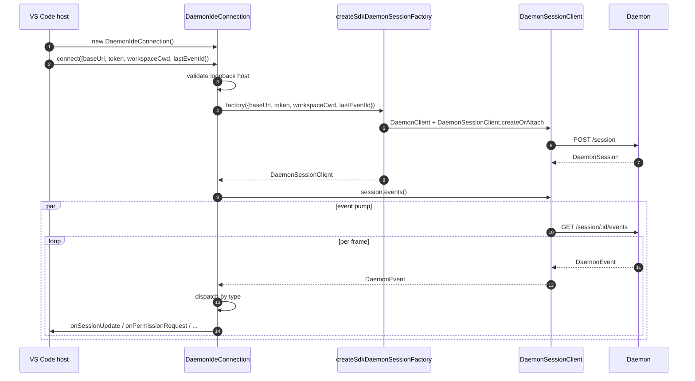
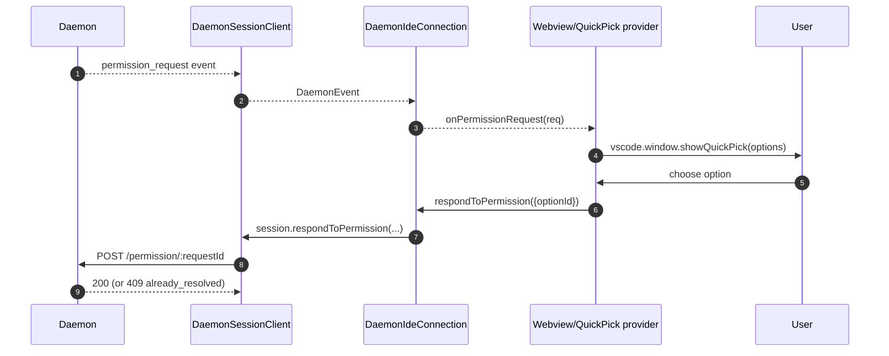
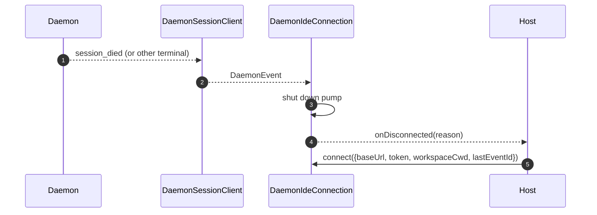

# VS Code IDE Daemon Adapter

## Übersicht

`packages/vscode-ide-companion/src/services/daemonIdeConnection.ts` ist der **Daemon-Adapter der VS Code-Erweiterung**. Er ermöglicht es dem IDE Companion, sich über HTTP + SSE mit einem laufenden `qwen serve`-Daemon zu verbinden, anstatt einen prozessinternen `qwen --acp`-Stdio-Child (den veralteten `AcpConnectionState`-Pfad) zu starten. Es ist das Transport-Pendant von [`14-cli-tui-adapter.md`](./14-cli-tui-adapter.md) für VS Code-Hosts.

Das Chat-Webview der IDE konsumiert Daemon-Ereignisse über diesen Adapter; Berechtigungsabfragen erscheinen als native VS Code Quick-Pick-Dialoge.

## Zuständigkeiten

- Erstellen eines `DaemonClient`- und `DaemonSessionClient`-Objekts aus einer auf Loopback geprüften `baseUrl`, die an `connect(options)` übergeben wird.
- Pumpen von SSE-Ereignissen vom Session Client in die Callback-Dispatch (`onSessionUpdate`, `onPermissionRequest`, `onAskUserQuestion`, `onEndTurn`, `onDisconnected`).
- Durchsetzen einer **Loopback-only**-Invariante in `connect(options)` (die IDE sollte sich nur mit einem Daemon auf demselben Host verbinden).
- Brücken von Daemon-Ereignissen in Webview-`postMessage`s, damit das Chatpanel synchron bleibt.
- Anzeigen von Berechtigungsanfragen über die native Quick-Pick-UI von VS Code.
- Serialisieren von Aufrufen in eine Warteschlange, damit ein schnelles doppeltes `connect()` vom Host nicht zu Wettlaufsituationen führt.

## Architektur

### Öffentliche Schnittstelle

```ts
class DaemonIdeConnection {
  connect(options: DaemonIdeConnectionOptions): Promise<void>;
  disconnect(): Promise<void>;
  sendPrompt(prompt: string | ContentBlock[]): Promise<DaemonIdePromptResult>;
  cancelSession(): Promise<void>;
  setModel(modelId: string): Promise<DaemonIdeSetModelResult>;

  onSessionUpdate: (data: SessionNotification) => void;
  onPermissionRequest: (
    data: RequestPermissionRequest,
  ) => Promise<{ optionId?: string }>;
  onAskUserQuestion: (data: AskUserQuestionRequest) => Promise<{
    optionId: string;
    answers?: Record<string, string>;
  }>;
  onEndTurn: (reason?: string) => void;
  onDisconnected: (code: number | null, signal: string | null) => void;
}

interface DaemonIdeConnectionOptions {
  baseUrl: string; // MUSS Loopback sein (127.0.0.1 / localhost / [::1])
  token?: string;
  workspaceCwd?: string;
  modelServiceId?: string;
  lastEventId?: number;
  sessionFactory?: DaemonIdeSessionFactory;
}
```

### Loopback-Validierung

In `connectInternal()`:

```ts
const baseUrl = validateDaemonBaseUrl(options.baseUrl);
```

Dies ist eine **clientseitige harte Einschränkung**, die sich von der eigenen `hostAllowlist` des Daemons unterscheidet (siehe [`12-auth-security.md`](./12-auth-security.md)). Der IDE Companion wird sich niemals mit einem entfernten Daemon verbinden – selbst wenn der Betreiber einen konfiguriert hat. Begründung: Das Bedrohungsmodell von VS Code geht davon aus, dass der Arbeitsbereich und der Daemon denselben Host teilen, einschließlich Dateisystemvertrauen und damit verbundener Annahmen.

### `createSdkDaemonSessionFactory()`

`createSdkDaemonSessionFactory()` konstruiert `DaemonClient` und ruft
`DaemonSessionClient.createOrAttach()` aus `@qwen-code/sdk` auf. Die Verbindungsklasse
hält die Factory, anstatt direkt zu instanziieren, damit Tests eine
Fake-Version einspielen können.

### Ereignis-Dispatch

Die Verbindung betreibt einen SSE-Consumer (`for await` über `session.events()`) und leitet jedes Ereignis nach Typ weiter:

| Daemon-Ereignis / Quelle                                                                                 | IDE-Callback / Aktion                                                    |
| -------------------------------------------------------------------------------------------------------- | ------------------------------------------------------------------------ |
| `session_update`                                                                                        | `onSessionUpdate`                                                        |
| Normales `permission_request`                                                                             | `onPermissionRequest`, dann `respondToPermission()`                      |
| `permission_request` mit `toolCall.kind === 'ask_user_question'` und `rawInput.questions` als Array      | `onAskUserQuestion`, dann `answers` an den Daemon weiterleiten           |
| `session_died` mit einer `sessionId`, die der aktuellen Sitzung entspricht                               | `onDisconnected(null, reason)`                                           |
| SSE-natürliches Ende / Stream-Fehler / manuelles `disconnect()`                                            | `onDisconnected(null, 'stream_ended' / 'daemon_error' / 'disconnected')` |
| Andere Daemon-Ereignisse                                                                                 | Debug-Level-Log; heute kein IDE-Callback.                                |

`onEndTurn` wird nicht vom SSE-Dispatch erzeugt. `sendPrompt()` wartet auf die Daemon-HTTP-Prompt-Antwort und ruft es mit `response.stopReason` auf; Nicht-Abbruch-Ausnahmepfade rufen `onEndTurn('error')` auf.

### Webview-Brücke

Die Verbindungsklasse ist **rein transportbezogen**. Die eigentliche VS Code-Integration befindet sich in `packages/vscode-ide-companion/src/webview/providers/ChatWebviewViewProvider.ts` (und verwandten Dateien). Der Provider abonniert die Callbacks der Verbindung und übersetzt sie in Webview-`postMessage`-Aufrufe. Das Webview selbst nutzt die gemeinsame Komponentenbibliothek `packages/webui/`, um die Darstellung zu rendern – siehe Adapter-Matrix in [`01-architecture.md`](./01-architecture.md).

### Connect-Serialisierung

`connect()` verwendet eine interne Warteschlange, sodass ein schneller doppelter Aufruf vom Host (z. B. der Benutzer öffnet das Panel zweimal während eines laufenden Handshakes) keine Wettlaufsituation verursacht. Der zweite Aufruf wartet auf den ersten; die Verbindung landet in einem einzigen, deterministischen Zustand.

## Arbeitsablauf

### Initiale Verbindung



### Berechtigungen via Quick-Pick



### Trennen / Wiederherstellen



## Zustand & Lebenszyklus

- Die Konstruktion erfolgt synchron; **keine Netzwerk-I/O** bis `connect(options)`.
- `connect()` ist durch die interne Warteschlange idempotent; zweimaliger Aufruf serialisiert.
- `disconnect()` bricht den SSE-Iterator ab (`AbortController` auf der Pumpe) und löscht die Callback-Registrierungen.
- `lastEventId` wird beim Trennen vom SDK-`DaemonSessionClient` erfasst und kann beim nächsten `connect()` für eine Wiederaufnahme erneut bereitgestellt werden.

## Abhängigkeiten

- `packages/sdk-typescript/src/daemon/` — `DaemonClient`, `DaemonSessionClient` (der eigentliche Transport).
- VS Code-Erweiterungs-API (`vscode.*`) — Host-APIs, Quick-Pick, Webview.
- `packages/webui/src/adapters/ACPAdapter.ts` — Webview-Rendering von ACP-förmigen Nachrichten, die über `postMessage` weitergeleitet werden.

## Konfiguration

| Knopf                                                 | Wo                             | Wirkung                                                            |
| ---------------------------------------------------- | ------------------------------ | ------------------------------------------------------------------ |
| `baseUrl`                                            | `connect(options)`             | Daemon-URL; muss Loopback sein.                                     |
| `token`                                              | `connect(options)`             | Bearer-Token (über SDK gestempelt).                                 |
| `workspaceCwd`                                       | `connect(options)`             | Wird für `POST /session` verwendet; muss mit dem gebundenen Arbeitsbereich des Daemons übereinstimmen. |
| `modelServiceId`                                     | `connect(options)` / `setModel()` | Anfangsmodell.                                                    |
| `lastEventId`                                        | `connect(options)`             | Fortsetzungs-Cursor (normalerweise aus dem Host-Status wiederhergestellt). |
| VS Code-Einstellung `qwen.ide.daemonUrl` (oder Äquivalent) | Arbeitsbereichseinstellungen | Vom Betreiber konfigurierte Daemon-URL.                            |

## Einschränkungen & bekannte Grenzen

- **Nur Loopback – harte Ablehnung in `connect(options)`.** Betreiber, die die IDE auf einen entfernten Daemon ausrichten möchten, müssen SSH-Port-Forwarding / lokalen Proxy verwenden; der Adapter verbindet sich nicht mit einer Nicht-Loopback-URL.
- **Der veraltete `AcpConnectionState`-Pfad ist immer noch primär** im IDE Companion (Stdio-Child). Dieser Adapter ist das Geschwister-Transport für die Mode-B-Migration; siehe [`../daemon-client-adapters/ide.md`](../daemon-client-adapters/ide.md) für die Migrationshindernisse und die geplanten `BridgeFileSystem`-Paritätsarbeiten.
- **Noch keine Reverse-RPC- oder Editor-Funktionsfläche über HTTP.** Funktionen, die vom Agenten einen Rückruf in die IDE erfordern (z. B. schreibgeschützter Pufferzugriff, Diff-Vorschau-Integration), sind derzeit nur auf dem Stdio-Pfad vorhanden.
- **Die Kopplung von Webview und Verbindung ist hosteigen**, nicht in diesem Adapter. Verlagern Sie keine Webview-spezifische Logik in `DaemonIdeConnection`.
- **`workspaceCwd`-Konflikt** mit dem gebundenen Arbeitsbereich des Daemons gibt `400 workspace_mismatch` zurück – zeigen Sie dies als klaren Einrichtungsfehler an, anstatt es erneut zu versuchen.

## Referenzen

- `packages/vscode-ide-companion/src/services/daemonIdeConnection.ts`
- `packages/vscode-ide-companion/src/services/daemonIdeConnection.ts` (`createSdkDaemonSessionFactory`)
- `packages/vscode-ide-companion/src/types/connectionTypes.ts` (veralteter `AcpConnectionState`)
- `packages/vscode-ide-companion/src/webview/providers/ChatWebviewViewProvider.ts` (Webview-Brücke)
- `packages/webui/src/adapters/ACPAdapter.ts` (Webview-ACP-Nachrichtenadapter)
- Entwurf: [`../daemon-client-adapters/ide.md`](../daemon-client-adapters/ide.md)
- SDK-Referenz: [`13-sdk-daemon-client.md`](./13-sdk-daemon-client.md)