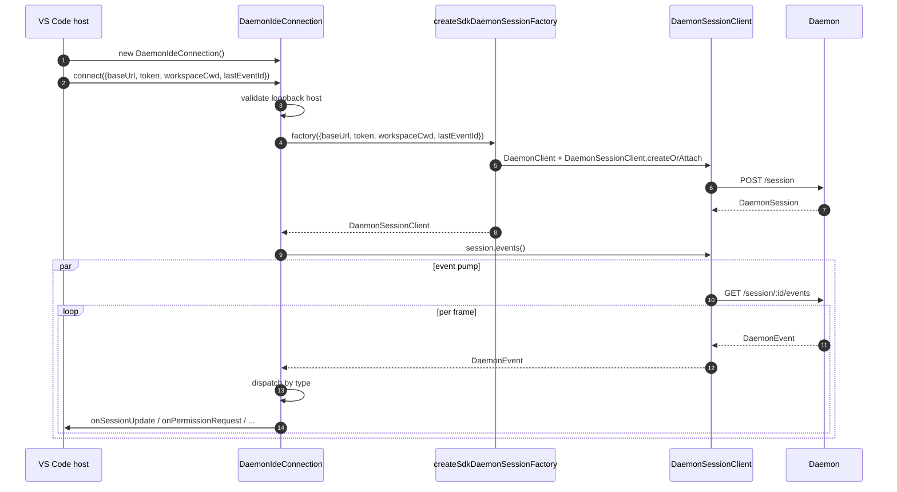
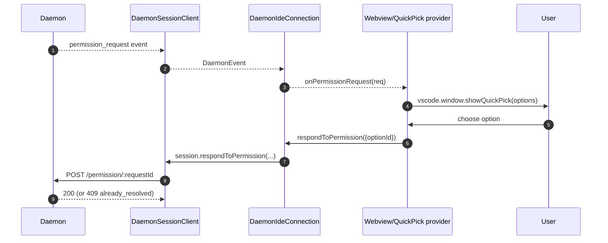
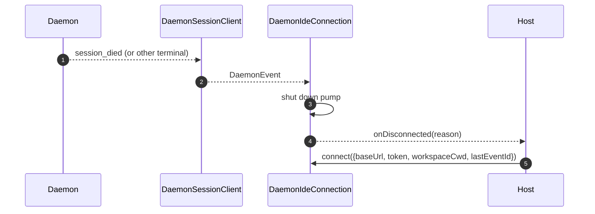

# VS Code IDE Daemon Adapter

## Überblick

`packages/vscode-ide-companion/src/services/daemonIdeConnection.ts` ist der **Daemon-Adapter der VS Code-Erweiterung**. Er ermöglicht dem IDE Companion die Verbindung zu einem laufenden `qwen serve`-Daemon über HTTP + SSE, anstatt einen `qwen --acp`-Stdio-Prozess (den legacy `AcpConnectionState`-Pfad) zu starten. Es ist das geschwisterliche Transport-Äquivalent zu [`14-cli-tui-adapter.md`](./14-cli-tui-adapter.md) für VS Code-Hosts.

Das Chat-Webview der IDE konsumiert Daemon-Ereignisse über diesen Adapter; Berechtigungsabfragen erscheinen als native VS-Quick-Pick-Dialoge.

## Verantwortlichkeiten

- Erstellt einen `DaemonClient` + `DaemonSessionClient` aus einer per Loopback validierten `baseUrl`, die an `connect(options)` übergeben wird.
- Leitet SSE-Ereignisse vom Session-Client in eine per-Callback-Dispatch weiter (`onSessionUpdate`, `onPermissionRequest`, `onAskUserQuestion`, `onEndTurn`, `onDisconnected`).
- Erzwingt eine **Nur-Loopback**-Invariante in `connect(options)` (die IDE sollte sich nur mit einem Daemon auf demselben Host verbinden).
- Überbrückt Daemon-Ereignisse in `postMessage`-Aufrufe des Webviews, damit das Chat-Panel synchron bleibt.
- Zeigt Berechtigungsanfragen über die native Quick-Pick-Oberfläche von VS Code an.
- Serialisiert Aufrufe in eine Warteschlange, sodass ein schneller doppelter `connect()` vom Host keine Race-Bedingung verursacht.

## Architektur

### Öffentliche Schnittstelle

```ts
class DaemonIdeConnection {
  connect(options: DaemonIdeConnectionOptions): Promise<void>;
  disconnect(): Promise<void>;
  sendPrompt(prompt: string | ContentBlock[]): Promise<DaemonIdePromptResult>;
  cancelSession(): Promise<void>;
  setModel(modelId: string): Promise<DaemonIdeSetModelResult>;

  onSessionUpdate: (data: SessionNotification) => void;
  onPermissionRequest: (
    data: RequestPermissionRequest,
  ) => Promise<{ optionId?: string }>;
  onAskUserQuestion: (data: AskUserQuestionRequest) => Promise<{
    optionId: string;
    answers?: Record<string, string>;
  }>;
  onEndTurn: (reason?: string) => void;
  onDisconnected: (code: number | null, signal: string | null) => void;
}

interface DaemonIdeConnectionOptions {
  baseUrl: string; // MUSS Loopback sein (127.0.0.1 / localhost / [::1])
  token?: string;
  workspaceCwd?: string;
  modelServiceId?: string;
  lastEventId?: number;
  sessionFactory?: DaemonIdeSessionFactory;
}
```

### Loopback-Validierung

In `connectInternal()`:

```ts
const baseUrl = validateDaemonBaseUrl(options.baseUrl);
```

Dies ist eine **clientseitige harte Einschränkung**, die sich von der eigenen `hostAllowlist` des Daemons unterscheidet (siehe [`12-auth-security.md`](./12-auth-security.md)). Der IDE Companion wird niemals eine Verbindung zu einem entfernten Daemon herstellen – selbst wenn der Betreiber einen konfiguriert hat. Begründung: Das Bedrohungsmodell von VS Code geht davon aus, dass der Arbeitsbereich und der Daemon denselben Host teilen, einschließlich Dateisystemvertrauen und damit verbundenen Annahmen.

### `createSdkDaemonSessionFactory()`

`createSdkDaemonSessionFactory()` erstellt `DaemonClient` und ruft
`DaemonSessionClient.createOrAttach()` aus `@qwen-code/sdk` auf. Die
Verbindungsklasse hält die Factory, anstatt direkt zu instanziieren, damit Tests einen
Fake einfügen können.

### Ereignis-Dispatch

Die Verbindung betreibt einen SSE-Consumer (`for await` über `session.events()`) und leitet jedes Ereignis nach Typ weiter:

| Daemon-Ereignis / Quelle                                                                                      | IDE-Callback / Aktion                                                       |
| ------------------------------------------------------------------------------------------------------------- | --------------------------------------------------------------------------- |
| `session_update`                                                                                              | `onSessionUpdate`                                                           |
| Normale `permission_request`                                                                                  | `onPermissionRequest`, dann `respondToPermission()`                         |
| `permission_request`, bei dem `toolCall.kind === 'ask_user_question'` und `rawInput.questions` ein Array ist   | `onAskUserQuestion`, dann `answers` an den Daemon weiterleiten              |
| `session_died` mit einer Nutzlast `sessionId`, die der aktuellen Sitzung entspricht                           | `onDisconnected(null, reason)`                                              |
| Natürliches Ende des SSE / Stream-Fehler / manuelles `disconnect()`                                            | `onDisconnected(null, 'stream_ended' / 'daemon_error' / 'disconnected')`    |
| Andere Daemon-Ereignisse                                                                                      | Debug-Level-Log; heute kein IDE-Callback.                                   |

`onEndTurn` wird nicht durch SSE-Dispatch erzeugt. `sendPrompt()` wartet auf die
HTTP-Prompt-Antwort des Daemons und ruft es mit `response.stopReason` auf;
Nicht-Abbruch-Ausnahmepfade rufen `onEndTurn('error')` auf.

### Webview-Brücke

Die Verbindungsklasse ist **nur für den Transport zuständig**. Die eigentliche VS Code-Integration lebt in `packages/vscode-ide-companion/src/webview/providers/ChatWebviewViewProvider.ts` (und Verwandten). Der Provider abonniert die Callbacks der Verbindung und übersetzt sie in `postMessage`-Aufrufe des Webviews. Das Webview selbst verwendet die gemeinsame `packages/webui/`-Komponentenbibliothek zur Darstellung – siehe Adapter-Matrix in [`01-architecture.md`](./01-architecture.md).
### Serialisierung von `connect()`

`connect()` verwendet eine interne Warteschlange, sodass ein schneller Doppelaufruf vom Host (z. B. der Benutzer öffnet das Panel zweimal während eines laufenden Handshakes) nicht zu einem Wettlauf führt. Der zweite Aufruf wartet auf den ersten; die Verbindung endet in einem einzigen, deterministischen Zustand.

## Arbeitsablauf

### Erste Verbindung



### Berechtigungsanfrage via Quick Pick



### Trennen / Wiederherstellen



## Zustand & Lebenszyklus

- Die Konstruktion ist synchron; **keine Netzwerk-I/O** bis `connect(options)`.
- `connect()` ist idempotent durch die interne Warteschlange; ein zweimaliger Aufruf serialisiert.
- `disconnect()` bricht den SSE-Iterator ab (`AbortController` auf der Pumpe) und löscht Callback-Registrierungen.
- `lastEventId` wird vom SDK `DaemonSessionClient` beim Trennen erfasst und kann beim nächsten `connect()` für die Wiederaufnahme bereitgestellt werden.

## Abhängigkeiten

- `packages/sdk-typescript/src/daemon/` — `DaemonClient`, `DaemonSessionClient` (der eigentliche Transport).
- VS Code-Erweiterungs-API (`vscode.*`) — Host-APIs, Quick Pick, Webview.
- `packages/webui/src/adapters/ACPAdapter.ts` — Webview-Rendering von ACP-förmigen Nachrichten, die über `postMessage` weitergeleitet werden.

## Konfiguration

| Parameter                                            | Ort                               | Effekt                                                            |
| ---------------------------------------------------- | --------------------------------- | ----------------------------------------------------------------- |
| `baseUrl`                                            | `connect(options)`                | Daemon-URL; muss Loopback sein.                                     |
| `token`                                              | `connect(options)`                | Bearer-Token (vom SDK gestempelt).                                   |
| `workspaceCwd`                                       | `connect(options)`                | Wird bei `POST /session` verwendet; muss mit dem gebundenen Workspace des Daemons übereinstimmen. |
| `modelServiceId`                                     | `connect(options)` / `setModel()` | Anfängliches Modell.                                                    |
| `lastEventId`                                        | `connect(options)`                | Fortsetzungscursor (normalerweise aus dem Host-Zustand wiederhergestellt).               |
| VS Code-Einstellung `qwen.ide.daemonUrl` (oder Äquivalent) | Workspace-Einstellungen                | Vom Betreiber konfigurierte Daemon-URL.                                   |

## Einschränkungen & bekannte Grenzen

- **Nur Loopback – harte Ablehnung in `connect(options)`.** Betreiber, die die IDE auf einen entfernten Daemon richten möchten, müssen SSH-Port-Weiterleitung / lokalen Proxy verwenden; der Adapter wird keine Verbindung zu einer Nicht-Loopback-URL herstellen.
- **Der veraltete `AcpConnectionState`-Pfad ist immer noch primär** im IDE-Begleitprozess (stdio-Kind). Dieser Adapter ist der Geschwistertransport für die Mode-B-Migration; siehe [`../daemon-client-adapters/ide.md`](../daemon-client-adapters/ide.md) für die Migrationsblocker und die geplante `BridgeFileSystem`-Paritätsarbeit.
- **Noch keine Reverse-RPC- oder Editor-Funktionsfläche über HTTP.** Funktionen, die einen Rückruf des Agents in die IDE erfordern (z. B. schreibgeschützter Pufferzugriff, Diff-Preview-Integration), leben derzeit nur auf dem stdio-Pfad.
- **Die Kopplung von Webview ↔ Verbindung gehört dem Host**, nicht diesem Adapter. Schieben Sie keine webview-spezifische Logik in `DaemonIdeConnection`.
- **`workspaceCwd`-Konflikt** mit dem gebundenen Workspace des Daemons gibt `400 workspace_mismatch` zurück – zeigen Sie dies als klaren Einrichtungsfehler an, anstatt es erneut zu versuchen.
## Referenzen

- `packages/vscode-ide-companion/src/services/daemonIdeConnection.ts`
- `packages/vscode-ide-companion/src/services/daemonIdeConnection.ts` (`createSdkDaemonSessionFactory`)
- `packages/vscode-ide-companion/src/types/connectionTypes.ts` (Legacy `AcpConnectionState`)
- `packages/vscode-ide-companion/src/webview/providers/ChatWebviewViewProvider.ts` (Webview-Bridge)
- `packages/webui/src/adapters/ACPAdapter.ts` (Webview-ACP-Nachrichtenadapter)
- Draft-Design: [`../daemon-client-adapters/ide.md`](../daemon-client-adapters/ide.md)
- SDK-Referenz: [`13-sdk-daemon-client.md`](./13-sdk-daemon-client.md)
