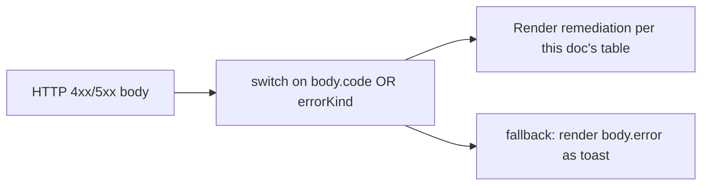
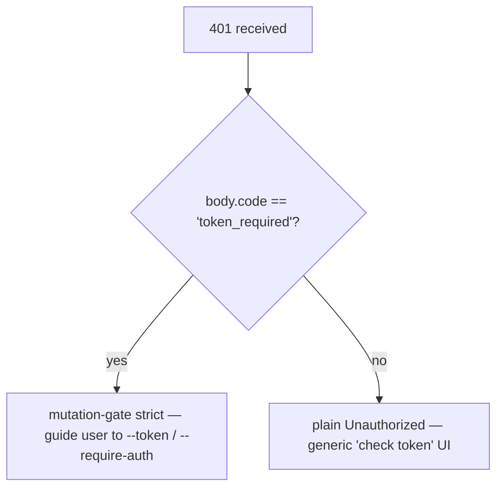

# Fehler-Taxonomie & Behebung

## Übersicht

Die Fehlermodi des Daemons sind bewusst als geschlossene Unions definiert, sodass SDK-Konsumenten diese erschöpfend abfragen und Routen-Handler konsistente HTTP-Antworten erzeugen können. Dieses Dokument katalogisiert jede typisierte Fehlerklasse / -art auf drei Ebenen:

1. **`packages/cli/src/serve/`** — Grenzfehler an der HTTP-Schnittstelle (Auth, Arbeitsbereich-Dateisystem, Daemon-Host-Preflight).
2. **`packages/acp-bridge/`** — Bridge-/Mediator-Fehler an der Daemon-zu-ACP-Child-Grenze.
3. **`packages/sdk-typescript/src/daemon/`** — SDK-seitige Kapselung und strukturierte Fehlerfelder.

Die Drahtformate der Fehler sind in [`../qwen-serve-protocol.md`](../qwen-serve-protocol.md) dokumentiert; dieses Dokument ergänzt Ursachen- und Behebungsanleitungen.

## Dateisystem-Grenze (`packages/cli/src/serve/fs/errors.ts`)

`FsError` trägt `{ kind, message, status, cause? }`. Die `FsErrorKind`-Union (14 Arten, standardmäßiger HTTP-Status):

| Art                       | HTTP      | Ursache                                                                        | Behebung                                                                                                                   |
| ------------------------- | --------- | ------------------------------------------------------------------------------ | -------------------------------------------------------------------------------------------------------------------------- |
| `path_outside_workspace`  | 400       | Der aufgelöste Pfad verlässt den gebundenen Arbeitsbereich.                    | Verwende einen Pfad innerhalb des `workspaceCwd` des Daemons; prüfe `/capabilities`.                                      |
| `symlink_escape`          | 400       | Das Ziel ist ein Symlink.                                                      | Greife den aufgelösten Pfad direkt an; Symlinks werden bewusst abgelehnt.                                                  |
| `path_not_found`          | 404       | `ENOENT`.                                                                      | Stelle sicher, dass die Datei existiert; beachte Groß-/Kleinschreibung unter Linux.                                        |
| `binary_file`             | 422       | Inhalt auf einer Text-Route als binär erkannt.                                 | Verwende `GET /file/bytes` für Rohbytes; die Text-Route lehnt Binärdateien ab.                                             |
| `file_too_large`          | 413       | Größer als `MAX_READ_BYTES` (256 KiB) oder `MAX_WRITE_BYTES` (5 MiB).          | Verwende Bytebereichs-Lesen; teile den Schreibvorgang auf.                                                                 |
| `hash_mismatch`           | 409       | Optimistische Nebenläufigkeit `expectedSha256` fehlgeschlagen.                 | Lese die Datei erneut und wiederhole mit dem neuen Hash.                                                                   |
| `file_already_exists`     | 409       | `mode: 'create'` gegen eine vorhandene Datei.                                 | Verwende `mode: 'overwrite'` oder wähle einen neuen Pfad.                                                                 |
| `text_not_found`          | 422       | Suchstring in `POST /file/edit` nicht in der Datei gefunden.                  | Überprüfe den Suchstring erneut; meistens liegt es an Leerzeichen-/Kodierungsunterschieden.                                |
| `ambiguous_text_match`    | 422       | Mehrere Treffer, obwohl nur einer erforderlich war.                            | Füge dem Suchstring mehr umgebenden Kontext hinzu, um ihn eindeutig zu machen.                                             |
| `untrusted_workspace`     | 403       | Schreibversuch in einem nicht vertrauenswürdigen Arbeitsbereich.               | Markiere den Arbeitsbereich als vertrauenswürdig (`Config.isTrustedFolder()`) oder verwende `runQwenServe` statt direktem `createServeApp`-Einbett. |
| `permission_denied`       | 403       | OS-Ebene `EACCES` / `EPERM`.                                                  | Passe die Dateisystem-ACLs an; dies ist **kein** Sicherheitsalarm.                                                          |
| `io_error`                | 503       | `ENOSPC` / `EIO` / `EBUSY` / `ETXTBSY` / `ENAMETOOLONG` / `EMFILE` / `ENFILE`. | Host-seitiger betrieblicher Fix (Festplatte voll, fd-Erschöpfung); benachrichtige Betrieb, nicht Sicherheit.               |
| `internal_error`          | 500       | Ein Fehler ohne errno erreicht die Grenze.                                      | Melde einen Daemon-Fehler (Bug).                                                                                           |
| `parse_error`             | 400 / 422 | Parsing-Fehler des Anfragetexts (400) oder Verstoß gegen Dienstebenen-Invarianten (422). | Validiere den Anfragetext; überprüfe die SDK-Version.                                                                      |

Die Unterscheidung zwischen `io_error` und `permission_denied` ist bewusst, damit Überwachungspipelines auf `errorKind` routen können; das Zusammenführen von ENOSPC in `permission_denied` würde Sicherheitsverantwortliche für ein `df -h`-Problem alarmieren.

## Bridge-Fehler (`packages/acp-bridge/src/bridgeErrors.ts`)

Typisierte Klassen, die von der Bridge/dem Mediator geworfen werden. Die meisten tragen einen HTTP-Status über den Switch des Routen-Handlers.

| Klasse                                | HTTP | Ursache                                                                            | Behebung                                                                                                                                                                              |
| ------------------------------------- | ---- | ---------------------------------------------------------------------------------- | ------------------------------------------------------------------------------------------------------------------------------------------------------------------------------------- |
| `SessionNotFoundError`                | 404  | sessionId nicht in `byId`.                                                         | Erstelle neu oder füge hinzu; die Sitzung könnte bereinigt worden sein.                                                                                                               |
| `WorkspaceMismatchError`              | 400  | `POST /session` `cwd` ≠ `boundWorkspace` des Daemons.                              | Lasse `cwd` weg (verwendet den gebundenen) oder leite an einen Daemon weiter, der an dein `cwd` gebunden ist.                                                                        |
| `SessionLimitExceededError`           | 503  | `byId.size >= maxSessions`.                                                        | Schließe alte Sitzungen; erhöhe `--max-sessions`.                                                                                                                                     |
| `InvalidClientIdError`                | 400  | `X-Qwen-Client-Id` außerhalb `[A-Za-z0-9._:-]{1,128}`.                              | Bereinige die Client-ID.                                                                                                                                                              |
| `InvalidSessionMetadataError`         | 400  | `displayName` > 256 Zeichen oder enthält Steuerzeichen.                            | Kürze / bereinige.                                                                                                                                                                    |
| `InvalidSessionScopeError`            | 400  | Unbekannter `sessionScope`-Wert.                                                   | Verwende `'single'` oder `'thread'`.                                                                                                                                                  |
| `RestoreInProgressError`              | 409  | Gleichzeitiges `loadSession` / `resumeSession`.                                    | Warte + wiederhole.                                                                                                                                                                   |
| `WorkspaceInitConflictError`          | 409  | `POST /workspace/init` gegen eine vorhandene Datei ohne `force`.                   | Übergib `force: true` oder wähle einen anderen Pfad.                                                                                                                                  |
| `WorkspaceInitPathEscapeError`        | 400  | Init-Pfad verlässt den Arbeitsbereich.                                             | Verwende einen Pfad innerhalb von `workspaceCwd`.                                                                                                                                     |
| `WorkspaceInitSymlinkError`           | 400  | Init-Pfad ist ein Symlink.                                                         | Greife den aufgelösten Pfad an.                                                                                                                                                       |
| `WorkspaceInitRaceError`              | 409  | TOCTOU-Wettlauf beim Init.                                                         | Wiederhole.                                                                                                                                                                           |
| `McpServerNotFoundError`              | 404  | Neustart für einen unbekannten Server.                                             | Überprüfe den Servernamen in `/workspace/mcp`.                                                                                                                                        |
| `McpServerRestartFailedError`         | 502  | Neustart im ACP-Child fehlgeschlagen.                                              | Überprüfe die ACP-Child-Logs; kann auf einen defekten MCP-Server hinweisen.                                                                                                           |
| `InvalidPermissionOptionError`        | 400  | Draht-Abstimmungsversuch, `CANCEL_VOTE_SENTINEL` über `optionId` einzuschleusen.  | Stimme mit `{outcome: 'cancelled'}` anstelle einer `optionId`.                                                                                                                        |
| `PermissionForbiddenError`            | 403  | Policy hat den Wähler abgelehnt (`designated_mismatch` / `remote_not_allowed`).   | Verwende die Client-ID des Urhebers (designated), registriere den Wähler vor (consensus) oder stimme über Loopback (local-only). Siehe [`04-permission-mediation.md`](./04-permission-mediation.md). |
| `CancelSentinelCollisionError`        | 500  | Agent hat `'__cancelled__'` als legitime Option veröffentlicht.                    | Agenten-Bug — ändere das Optionslabel auf etwas anderes als den Sentinel.                                                                                                             |
| `PermissionPolicyNotImplementedError` | 500  | Angeforderte Policy ist in diesem Daemon nicht eingebaut.                          | Aktualisiere den Daemon oder ändere `policy.permissionStrategy`.                                                                                                                      |
| `BridgeChannelClosedError`            | 503  | ACP-Child-Kanal während des Aufrufs geschlossen.                                   | Verbinde erneut / wiederhole; prüfe `session_died` auf Ursache.                                                                                                                       |
| `BridgeTimeoutError`                  | 504  | Bridge-seitige Wanduhrzeit überschritten.                                          | Wiederhole; untersuche zugrundeliegende Langsamkeit.                                                                                                                                  |
| `MissingCliEntryError`                | 500  | Die `qwen` CLI-Einstiegsdatei fehlt (definiert in `status.ts`, nicht `bridgeErrors.ts`). | Stelle sicher, dass die CLI-Installation vollständig ist; überprüfe, ob `packages/cli/index.ts` existiert.                                                                            |

## Boot-Zeit-Konfigurationsfehler (`packages/cli/src/serve/run-qwen-serve.ts`)

| Klasse                      | Wann                                                                                                                                                                                                                                   | Behebung                                                                                                                                                                                        |
| --------------------------- | -------------------------------------------------------------------------------------------------------------------------------------------------------------------------------------------------------------------------------------- | ----------------------------------------------------------------------------------------------------------------------------------------------------------------------------------------------- |
| `InvalidPolicyConfigError` | `validatePolicyConfig()` lehnt zusammengeführte Einstellungen ab: unbekanntes `policy.permissionStrategy` (validiert gegen `SERVE_CAPABILITY_REGISTRY.permission_mediation.modes`) oder nicht-positiv-ganzzahliges `policy.consensusQuorum`. Boot scheitert explizit. | Korrigiere das betreffende Feld in `settings.json`. Die Klasse unterstützt `instanceof`; `runQwenServe` verwendet es, um Policy-Konflikte von Lese-I/O-Fehlern der Einstellungen zu unterscheiden, die auf Standardwerte zurückfallen. |

## Device-Flow-Auth (`packages/cli/src/serve/auth/device-flow.ts`)

| Klasse                        | Wann                                                      | Hinweise                                                                                                                                                                                                                                                                                                                                                                                                                                    |
| ----------------------------- | --------------------------------------------------------- | ---------------------------------------------------------------------------------------------------------------------------------------------------------------------------------------------------------------------------------------------------------------------------------------------------------------------------------------------------------------------------------------------------------------------------------------- |
| `UpstreamDeviceFlowError`    | Der Upstream-IdP gibt während des Pollings einen strukturierten Fehler zurück. | `oauthError` wird mit `sanitizeForStderr` bereinigt, bevor es in stderr oder Audit-Hinweise eingefügt wird (CVE-2021-42574 / Trojan Source-Abwehr; siehe [`12-auth-security.md`](./12-auth-security.md)).                                                                                                                                                                                                                                         |
| `DeviceFlowPollTimeoutError` | Der Registry-Wettlauftimer feuert, bevor der Anbieter antwortet. | Anbieter-Code darf diesen Typ nicht werfen. Er wird für Tests exportiert, aber die Registry prüft `pollTimedOut` auf die Laufzeitmarke `_isRegistryTimeout: boolean`, nicht auf `instanceof`. Ein Anbieter, der `new DeviceFlowPollTimeoutError(ms)` importiert und wirft, durchläuft dennoch den generischen Anbieter-wirft-Audit-Pfad, weil `_isRegistryTimeout` standardmäßig `false` ist; nur die interne Factory `makeRegistryPollTimeoutError(ms)` setzt die Marke. |

## Daemon-Host-Fehlerarten (`packages/acp-bridge/src/status.ts`)

`SERVE_ERROR_KINDS` ist die geschlossene Aufzählung, die von Diagnosezellen und strukturierten Daemon-Fehlern verwendet wird:

| Art                       | Bedeutung                                                                |
| ------------------------- | ------------------------------------------------------------------------ |
| `missing_binary`          | Erforderliche lokale ausführbare Datei oder CLI-Einstieg konnte nicht aufgelöst werden. |
| `blocked_egress`          | Ausgehende Netzwerkprüfung fehlgeschlagen.                                |
| `auth_env_error`          | Auth-bezogene Umgebungsvariable, Anbieter oder Trust-Gate-Konfiguration ist ungültig. |
| `init_timeout`            | Daemon-seitiger Initialisierungsschritt hat seine Wanduhrzeit überschritten. |
| `protocol_error`          | ACP/HTTP-Protokollkonflikt.                                               |
| `missing_file`            | Erforderliche lokale Datei fehlt.                                         |
| `parse_error`             | Fehler beim Parsen einer lokalen Datei oder Anfrage.                      |
| `stat_failed`             | Fehler beim lokalen Dateisystem-`stat`.                                   |
| `budget_exhausted`        | MCP-Budget-Durchsetzung hat Erkennung oder einen Server-Eintrag abgelehnt. |
| `mcp_budget_would_exceed` | MCP-Neustart oder -Mutation würde das konfigurierte Budget überschreiten. |
| `mcp_server_spawn_failed` | Start oder Neustart des MCP-Servers fehlgeschlagen.                       |
| `invalid_config`          | MCP- oder Daemon-Konfiguration war ungültig.                              |
| `prompt_deadline_exceeded`| Frist der Prompt-Wanduhr abgelaufen.                                      |
| `writer_idle_timeout`     | SSE-Writer hat vor seinem Leerlauf-Timeout keine erfolgreichen Schreibvorgänge getätigt. |

Diese werden über das `errorKind` der Preflight-Zelle an die Oberfläche gebracht, sodass Client-UIs strukturierte Behebungsmaßnahmen (anstelle von rohen Stacktraces) anzeigen.

## Auth-Fehlerformate

| Status | Body                                         | Wann                                                                                                                                        |
| ------ | -------------------------------------------- | ------------------------------------------------------------------------------------------------------------------------------------------- |
| `401`  | `{ error: 'Unauthorized' }`                  | Fehlender/falscher/kein-Schema Bearer-Token. Einheitlich bei `fehlendem Header` / `falschem Schema` / `falschem Token`, sodass Sondierung keine Unterscheidung ermöglicht. |
| `401`  | `{ error: '...', code: 'token_required' }`   | Mutations-Sperre auf strenger Route bei einem Daemon ohne Token auf Loopback. SDKs geben Hinweis "konfiguriere --token / --require-auth".    |
| `403`  | `{ error: 'Request denied by CORS policy' }` | `denyBrowserOriginCors` hat eine Anfrage mit `Origin`-Header abgelehnt.                                                                       |
| `403`  | `{ error: 'Invalid Host header' }`           | `hostAllowlist` hat den `Host`-Header abgelehnt (DNS-Rebinding-Abwehr).                                                                      |

Siehe [`12-auth-security.md`](./12-auth-security.md) für das vollständige Auth-Modell.

## Berechtigungsergebnisse (Drahtform vs. Audit-Überladung)

`PermissionResolution` hat zwei terminale Arten:

- `{kind: 'option', optionId}` — eine Abstimmung hat gewonnen.
- `{kind: 'cancelled', reason: 'timeout' | 'session_closed' | 'agent_cancelled'}` — die Anfrage wurde abgebrochen. Das Drahtformat ist einfach (`{outcome: 'cancelled'}`); das Audit-Log unterscheidet timeout / session_closed / voter-cancelled / agent-cancelled in `decisionReason.type`. Diese Überladung wird bewusst beibehalten, um den eingefrorenen `permission.ts`-Vertrag nicht zu brechen.

## SDK-seitige Fehlerkapselung

`DaemonClient` gibt HTTP-Fehler als abgelehnte Promises mit dem geparsten Body als Ablehnungswert zurück. Methoden, die bei unbekannten Sitzungen auf `404` stoßen, lehnen mit `{error, sessionId}` ab; das SDK kapselt sie heute nicht in eine typisierte Klasse. Aufrufer sollten sich nicht auf `instanceof Error` plus `.message.includes(...)`-Abgleich verlassen; weiche stattdessen auf `err.code` oder `err.kind` aus dem Body aus.
`parseSseStream` bricht den Iterator bei einem 16-MiB-Pufferüberlauf ab (defensive Grenze).

## Workflow

### Einen Fehler für einen Benutzer sichtbar machen

### Authentifizierungsfehlermodi unterscheiden

## Abhängigkeiten

- Alle Fehlerklassen werden aus ihren jeweiligen Paketen exportiert; SDK-Konsumenten können im selben Node-Prozess mit `instanceof` gegen die `bridgeErrors.ts`-Typen prüfen. Über das Netzwerk hinweg wird anhand von `body.code` / `body.kind` / `body.errorKind` geroutet.

## Einschränkungen & bekannte Grenzen

- **`io_error` vs `permission_denied`** sind bewusst unterschiedlich. Nicht vermischen.
- **`PermissionForbiddenError`-Gründe (`designated_mismatch` / `remote_not_allowed`) sind überladen** für die `designated`- und `consensus`-Policies; das Audit-Log unterscheidet sie präzise, die Drahtform jedoch nicht.
- **`CancelSentinelCollisionError` deutet auf einen Agent-seitigen Bug hin**, kein Sicherheitsvorfall – die Bridge lehnt die Anfrage ab, anstatt stillschweigend zuzulassen, dass der Sentinel mit einer realen Option übereinstimmt.
- **SDK-seitige typisierte Fehler befinden sich noch in der Entwicklung.** Aufrufer sollten über body-Felder routen, anstatt sich auf die JS-Klassenidentität über das Netzwerk zu verlassen.
- **`internal_error` sollte immer untersucht werden.** Er signalisiert, dass ein `FsError`-Konstruktor mit einer für Nicht-errno-Pfade reservierten Fehlerart aufgerufen wurde (Programmierfehler); das `cause`-Feld im Antwort-Body kann die ursprüngliche Exception enthalten.

## Referenzen

- `packages/cli/src/serve/fs/errors.ts` (`FsErrorKind`, `FsErrorStatus`)
- `packages/acp-bridge/src/bridgeErrors.ts` (jede typisierte Klasse)
- `packages/acp-bridge/src/status.ts` (`SERVE_ERROR_KINDS`, `ServeErrorKind`)
- `packages/cli/src/serve/auth.ts` (Authentifizierungs-Bodies)
- Drahtreferenz: [`../qwen-serve-protocol.md`](../qwen-serve-protocol.md).