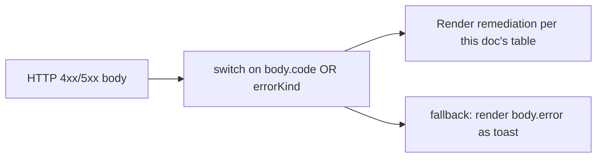
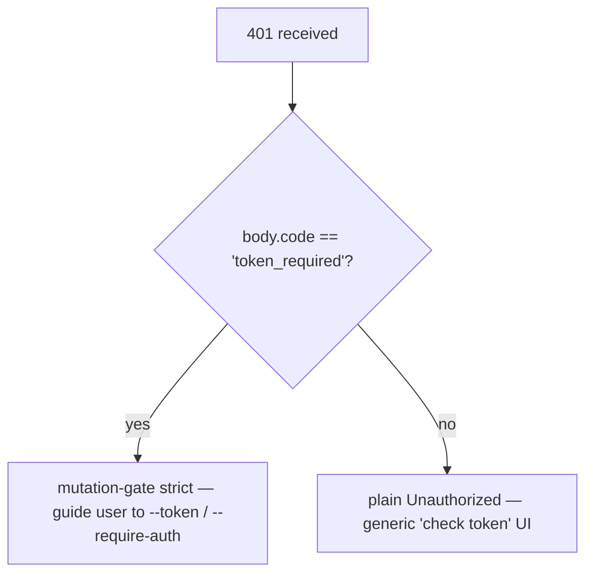

# Fehlertaxonomie und Behebung

## Übersicht

Die Fehlermodi des Daemons sind bewusst als abgeschlossene Vereinigungen (closed unions) gestaltet, sodass SDK-Konsumenten exhaustiv switchen und Route-Handler konsistente HTTP-Antworten formen können. Dieses Dokument katalogisiert jede typisierte Fehlerklasse / -art auf drei Ebenen:

1. **`packages/cli/src/serve/`** — Grenzfehler an der HTTP-Kante (Authentifizierung, Workspace-Dateisystem, Daemon-Host-Preflight).
2. **`packages/acp-bridge/`** — Bridge-/Mediator-Fehler an der Daemon-zu-ACP-Kind-Grenze.
3. **`packages/sdk-typescript/src/daemon/`** — SDK-seitige Kapselung und strukturierte Fehlerfelder.

Wire-Level-Fehlerformen sind in [`../qwen-serve-protocol.md`](../qwen-serve-protocol.md) dokumentiert; dieses Dokument ergänzt Ursachen und Behebungsanleitungen.

## Dateisystemgrenze (`packages/cli/src/serve/fs/errors.ts`)

`FsError` trägt `{ kind, message, status, cause? }`. `FsErrorKind`-Vereinigung (14 Arten, standardmäßiger HTTP-Status):

| Art                      | HTTP      | Ursache                                                                        | Behebung                                                                                                               |
| ------------------------ | --------- | ------------------------------------------------------------------------------ | ---------------------------------------------------------------------------------------------------------------------- |
| `path_outside_workspace` | 400       | Der aufgelöste Pfad verlässt den gebundenen Arbeitsbereich.                    | Verwenden Sie einen Pfad innerhalb des `workspaceCwd` des Daemons; prüfen Sie `/capabilities`.                         |
| `symlink_escape`         | 400       | Das Ziel ist ein Symlink.                                                      | Adressieren Sie den aufgelösten Pfad direkt; Symlinks werden absichtlich abgelehnt.                                    |
| `path_not_found`         | 404       | `ENOENT`.                                                                      | Bestätigen Sie, dass die Datei existiert; prüfen Sie auf case-sensitive Pfade unter Linux.                             |
| `binary_file`            | 422       | Inhalt wurde auf einer Text-Route als Binärdatei erkannt.                      | Verwenden Sie `GET /file/bytes` für Rohdaten; die Text-Route lehnt Binärdateien ab.                                    |
| `file_too_large`         | 413       | Über `MAX_READ_BYTES` (256 KiB) oder `MAX_WRITE_BYTES` (5 MiB).                | Nutzen Sie Bytebereich-Lesen; teilen Sie den Schreibvorgang auf.                                                       |
| `hash_mismatch`          | 409       | Optimistische Nebenläufigkeit `expectedSha256` ist fehlgeschlagen.             | Lesen Sie die Datei erneut und wiederholen Sie den Vorgang mit dem neuen Hash.                                         |
| `file_already_exists`    | 409       | `mode: 'create'` gegen eine vorhandene Datei.                                  | Verwenden Sie `mode: 'overwrite'` oder wählen Sie einen neuen Pfad.                                                    |
| `text_not_found`         | 422       | Suchstring in `POST /file/edit` nicht in der Datei.                            | Überprüfen Sie den Suchstring; meistens ist Leerraum oder Kodierungsinkonsistenz die Ursache.                          |
| `ambiguous_text_match`   | 422       | Mehrere Treffer, obwohl genau einer erforderlich war.                          | Fügen Sie mehr umgebenden Kontext zum Suchstring hinzu, um ihn eindeutig zu machen.                                    |
| `untrusted_workspace`    | 403       | Schreibversuch in einem nicht vertrauenswürdigen Arbeitsbereich.               | Markieren Sie den Arbeitsbereich als vertrauenswürdig (`Config.isTrustedFolder()`) oder verwenden Sie `runQwenServe` statt direkter Einbettung von `createServeApp`. |
| `permission_denied`      | 403       | Betriebssystemebene `EACCES` / `EPERM`.                                        | Passen Sie die Dateisystem-ACLs an; dies ist **kein** Sicherheitsalarm.                                                |
| `io_error`               | 503       | `ENOSPC` / `EIO` / `EBUSY` / `ETXTBSY` / `ENAMETOOLONG` / `EMFILE` / `ENFILE`. | Betriebssystemseitige operative Behebung (Festplatte voll, Dateideskriptor-Erschöpfung); Seitenoperationen, keine Sicherheit. |
| `internal_error`         | 500       | Ein nicht-errno-Fehler erreicht die Grenze.                                     | Melden Sie einen Daemon-Fehler.                                                                                        |
| `parse_error`            | 400 / 422 | Parse-Fehler des Request-Bodys (400) oder Verletzung einer Service-Invariante (422). | Validieren Sie den Request-Body; prüfen Sie die SDK-Version.                                                           |

Die Unterscheidung zwischen `io_error` und `permission_denied` ist bewusst gewählt, damit Überwachungspipelines auf `errorKind` routen können; das Zusammenführen von ENOSPC in `permission_denied` würde Sicherheitsverantwortliche für ein `df -h`-Problem alarmieren.
## Bridge-Fehler (`packages/acp-bridge/src/bridgeErrors.ts`)

Typisierte Klassen, die von der Bridge / dem Mediator geworfen werden. Die meisten tragen einen HTTP-Status via des Route-Handler-Switch.

| Klasse                               | HTTP | Ursache                                                                               | Abhilfe                                                                                                                                                                          |
| ------------------------------------ | ---- | ------------------------------------------------------------------------------------- | -------------------------------------------------------------------------------------------------------------------------------------------------------------------------------- |
| `SessionNotFoundError`               | 404  | sessionId nicht in `byId`.                                                              | Neu erstellen oder anhängen; die Session wurde möglicherweise abgeräumt.                                                                                                          |
| `WorkspaceMismatchError`             | 400  | `POST /session` `cwd` ≠ `boundWorkspace` des Daemons.                                    | `cwd` weglassen (dann wird `boundWorkspace` verwendet) oder an einen Daemon weiterleiten, der an Ihr `cwd` gebunden ist.                                                           |
| `SessionLimitExceededError`          | 503  | `byId.size >= maxSessions`.                                                           | Alte Sessions schließen; `--max-sessions` erhöhen.                                                                                                                               |
| `InvalidClientIdError`               | 400  | `X-Qwen-Client-Id` entspricht nicht `[A-Za-z0-9._:-]{1,128}`.                          | Client-ID bereinigen.                                                                                                                                                            |
| `InvalidSessionMetadataError`        | 400  | `displayName` länger als 256 Zeichen oder enthält Steuerzeichen.                       | Kürzen / bereinigen.                                                                                                                                                             |
| `InvalidSessionScopeError`           | 400  | Unbekannter Wert für `sessionScope`.                                                      | `'single'` oder `'thread'` verwenden.                                                                                                                                            |
| `RestoreInProgressError`             | 409  | Gleichzeitiger `loadSession` / `resumeSession`.                                           | Warten + erneut versuchen.                                                                                                                                                       |
| `WorkspaceInitConflictError`         | 409  | `POST /workspace/init` auf eine vorhandene Datei ohne `force`.                            | `force: true` übergeben oder einen anderen Pfad wählen.                                                                                                                        |
| `WorkspaceInitPathEscapeError`       | 400  | Init-Pfad verlässt das Arbeitsverzeichnis.                                                 | Einen Pfad innerhalb von `workspaceCwd` verwenden.                                                                                                                              |
| `WorkspaceInitSymlinkError`          | 400  | Init-Pfad ist ein symbolischer Link.                                                       | Den aufgelösten Pfad angeben.                                                                                                                                                    |
| `WorkspaceInitRaceError`             | 409  | TOCTOU-Rennbedingung bei Init.                                                          | Erneut versuchen.                                                                                                                                                                |
| `McpServerNotFoundError`             | 404  | Neustart für einen unbekannten Server.                                                    | Servernamen in `/workspace/mcp` überprüfen.                                                                                                                                      |
| `McpServerRestartFailedError`        | 502  | Neustart im ACP-Kindprozess fehlgeschlagen.                                                 | ACP-Kind-Logs prüfen; möglicherweise defekter MCP-Server.                                                                                                                        |
| `InvalidPermissionOptionError`       | 400  | Wire-Vote versuchte, `CANCEL_VOTE_SENTINEL` über `optionId` einzuschleusen.                | Statt `optionId` mit `{outcome: 'cancelled'}` abstimmen.                                                                                                                        |
| `PermissionForbiddenError`           | 403  | Richtlinie verweigerte dem Abstimmenden die Teilnahme (`designated_mismatch` / `remote_not_allowed`). | Die Client-ID des Urhebers verwenden (designated), den Abstimmenden vorregistrieren (consensus) oder über Loopback abstimmen (local-only). Siehe [`04-permission-mediation.md`](./04-permission-mediation.md). |
| `CancelSentinelCollisionError`       | 500  | Agent veröffentlichte `'__cancelled__'` als legitimen Optionslabel.                       | Agent-Fehler – Optionslabel auf etwas anderes als den Sentinel ändern.                                                                                                           |
| `PermissionPolicyNotImplementedError`| 500  | Angeforderte Richtlinie ist in diesem Daemon nicht eingebaut.                              | Daemon aktualisieren oder `policy.permissionStrategy` ändern.                                                                                                                   |
| `BridgeChannelClosedError`           | 503  | ACP-Kindkanal während eines Aufrufs geschlossen.                                          | Neu verbinden / erneut versuchen; Ursache in `session_died` prüfen.                                                                                                              |
| `BridgeTimeoutError`                 | 504  | Bridge-Level-Wallclock-Timeout überschritten.                                             | Erneut versuchen; zugrundeliegende Langsamkeit untersuchen.                                                                                                                     |
| `MissingCliEntryError`               | 500  | Die Einstiegsdatei der `qwen`-CLI fehlt (definiert in `status.ts`, nicht in `bridgeErrors.ts`). | Vollständigkeit der CLI-Installation prüfen; sicherstellen, dass `packages/cli/index.ts` existiert.                                                                              |
## Bootzeit-Konfigurationsfehler (`packages/cli/src/serve/run-qwen-serve.ts`)

| Klasse | Wann | Behebung |
| -------------------------- | ----------------------------------------------------------------------------------------------------------------------------------------------------------------------------------------------------------------------------------------- | ------------------------------------------------------------------------------------------------------------------------------------------------------------------------------------------------ |
| `InvalidPolicyConfigError` | `validatePolicyConfig()` lehnt zusammengeführte Einstellungen ab: unbekanntes `policy.permissionStrategy` (validiert gegen `SERVE_CAPABILITY_REGISTRY.permission_mediation.modes`) oder nicht positive Ganzzahl `policy.consensusQuorum`. Boot schlägt explizit fehl. | Beheben Sie das fehlerhafte Feld in `settings.json`. Die Klasse unterstützt `instanceof`; `runQwenServe` verwendet es, um Richtlinienkonflikte von I/O-Fehlern beim Lesen der Einstellungen zu unterscheiden, die auf Standardwerte zurückfallen. |

## Device Flow Authentifizierung (`packages/cli/src/serve/auth/device-flow.ts`)

| Klasse | Wann | Anmerkungen |
| ---------------------------- | ---------------------------------------------------------- | ---------------------------------------------------------------------------------------------------------------------------------------------------------------------------------------------------------------------------------------------------------------------------------------------------------------------------------------------------------------------------------------------------------------------------------------- |
| `UpstreamDeviceFlowError` | Der vorgelagerte IdP gibt beim Pollen einen strukturierten Fehler zurück. | `oauthError` wird mit `sanitizeForStderr` bereinigt, bevor es in stderr oder Audit-Hinweise interpoliert wird (CVE-2021-42574 / Trojan-Source-Abwehr; siehe [`12-auth-security.md`](./12-auth-security.md)). |
| `DeviceFlowPollTimeoutError` | Der Registry-Race-Timer feuert, bevor der Provider zurückkehrt. | Provider-Code darf diesen Typ nicht werfen. Er wird für Tests exportiert, aber die Registry sperrt `pollTimedOut` auf die Runtime-Marke `_isRegistryTimeout: boolean`, nicht auf `instanceof`. Ein Provider, der `new DeviceFlowPollTimeoutError(ms)` importiert und wirft, folgt trotzdem dem generischen Provider-Throw-Audit-Pfad, da `_isRegistryTimeout` standardmäßig `false` ist; nur die interne Factory `makeRegistryPollTimeoutError(ms)` setzt die Marke. |

## Daemon-Host-Fehlerarten (`packages/acp-bridge/src/status.ts`)

`SERVE_ERROR_KINDS` ist das geschlossene Enum, das von Diagnosezellen und strukturierten Daemon-Fehlern verwendet wird:

| Art | Bedeutung |
| -------------------------- | ----------------------------------------------------------------------- |
| `missing_binary` | Erforderliches lokales ausführbares Programm oder CLI-Eintrag konnte nicht aufgelöst werden. |
| `blocked_egress` | Ausgehender Netzwerktest fehlgeschlagen. |
| `auth_env_error` | Auth-bezogene Umgebungsvariable, Provider- oder Trust-Gate-Konfiguration ist ungültig. |
| `init_timeout` | Daemon-seitiger Initialisierungsschritt hat seine Wanduhrzeit überschritten. |
| `protocol_error` | ACP / HTTP Protokollkonflikt. |
| `missing_file` | Erforderliche lokale Datei fehlt. |
| `parse_error` | Parse-Fehler in lokaler Datei oder Anfrage. |
| `stat_failed` | Lokaler Dateisystem-stat fehlgeschlagen. |
| `budget_exhausted` | MCP-Budget-Durchsetzung verweigerte Erkennung oder einen Servereintrag. |
| `mcp_budget_would_exceed` | MCP-Neustart oder Mutation würde das konfigurierte Budget überschreiten. |
| `mcp_server_spawn_failed` | MCP-Server-Spawn oder Neustart fehlgeschlagen. |
| `invalid_config` | MCP- oder Daemon-Konfiguration war ungültig. |
| `prompt_deadline_exceeded` | Prompt-Wanduhrfrist abgelaufen. |
| `writer_idle_timeout` | SSE-Writer hat vor seinem Leerlauf-Timeout keine erfolgreichen Schreibvorgänge durchgeführt. |
Diese werden über die `errorKind`-Eigenschaft der Preflight-Zelle bereitgestellt, damit Client-UIs eine strukturierte Fehlerbehebung (anstelle von rohen Stack-Traces) rendern können.

## Auth-Fehlerformen

| Status | Body                                         | Wann                                                                                                                                      |
| ------ | -------------------------------------------- | ----------------------------------------------------------------------------------------------------------------------------------------- |
| `401`  | `{ error: 'Unauthorized' }`                  | Fehlender / falscher / schemaloser Bearer-Token. Einheitlich bei `missing header` / `wrong scheme` / `wrong token`, damit Sondierung nicht unterscheiden kann. |
| `401`  | `{ error: '...', code: 'token_required' }`   | Strikte Mutation-Gate-Route bei einem tokenlosen Loopback-Daemon. SDKs rendern einen Hinweis "configure --token / --require-auth".        |
| `403`  | `{ error: 'Request denied by CORS policy' }` | `denyBrowserOriginCors` hat eine `Origin`-tragende Anfrage abgelehnt.                                                                     |
| `403`  | `{ error: 'Invalid Host header' }`           | `hostAllowlist` hat den `Host`-Header abgelehnt (DNS-Rebinding-Abwehr).                                                                   |

Siehe [`12-auth-security.md`](./12-auth-security.md) für das vollständige Auth-Modell.

## Berechtigungsergebnisse (Wire- vs. Audit-Überladung)

`PermissionResolution` hat zwei terminale Arten:

- `{kind: 'option', optionId}` – eine Abstimmung gewonnen.
- `{kind: 'cancelled', reason: 'timeout' \| 'session_closed' \| 'agent_cancelled'}` – Anfrage wurde abgebrochen. Die Wire-Form ist einfach (`{outcome: 'cancelled'}`); das Audit-Log unterscheidet timeout / session_closed / voter-cancelled / agent-cancelled in `decisionReason.type`. Diese Überladung wird bewusst beibehalten, um den eingefrorenen `permission.ts`-Vertrag nicht zu brechen.

## SDK-seitige Fehlerumwicklung

`DaemonClient` gibt HTTP-Fehler als abgelehnte Promises zurück, mit dem geparsten Body als Ablehnungswert. Methoden, die bei unbekannten Sessions auf `404` treffen, lehnen mit `{error, sessionId}` ab; das SDK umwickelt sie heute nicht mit einer typisierten Klasse. Aufrufer sollten sich nicht auf `instanceof Error` plus `.message.includes(...)`-Abgleich verlassen; stattdessen auf `err.code` oder `err.kind` aus dem Body prüfen.

`parseSseStream` bricht den Iterator bei einem 16-MiB-Pufferüberlauf ab (defensive Grenze).

## Workflow

### Einen Fehler für einen Benutzer anzeigen

### Authentifizierungsfehlermodi unterscheiden

## Abhängigkeiten

- Alle Fehlerklassen werden aus ihren jeweiligen Paketen exportiert; SDK-Konsumenten können `instanceof` gegen die Typen aus `bridgeErrors.ts` verwenden, wenn sie im selben Node-Prozess laufen. Über die Leitung: Entscheiden Sie anhand von `body.code` / `body.kind` / `body.errorKind`.

## Einschränkungen und bekannte Grenzen

- **`io_error` vs. `permission_denied`** sind bewusst unterschiedlich. Nicht verwechseln.
- **`PermissionForbiddenError`-Gründe (`designated_mismatch` / `remote_not_allowed`) sind überladen** über die `designated`- und `consensus`-Richtlinien hinweg; das Audit-Log unterscheidet sie präzise, die Wire-Form jedoch nicht.
- **`CancelSentinelCollisionError` weist auf einen agentenseitigen Fehler hin**, kein Sicherheitsereignis – die Brücke lehnt die Anfrage ab, anstatt stillschweigend zuzulassen, dass der Sentinel mit einer echten Option übereinstimmt.
- **SDK-seitige typisierte Fehler entwickeln sich noch.** Aufrufer sollten anhand der Body-Felder entscheiden, anstatt sich auf die JS-Klassenidentität über die Leitung zu verlassen.
- **`internal_error` sollte immer untersucht werden.** Es signalisiert, dass ein `FsError`-Konstruktor mit einer Art aufgerufen wurde, die für Nicht-errno-Pfade reserviert ist (Programmierfehler); das `cause`-Feld des Antwort-Bodys kann den ursprünglichen Fehler enthalten.

## Referenzen

- `packages/cli/src/serve/fs/errors.ts` (`FsErrorKind`, `FsErrorStatus`)
- `packages/acp-bridge/src/bridgeErrors.ts` (jede typisierte Klasse)
- `packages/acp-bridge/src/status.ts` (`SERVE_ERROR_KINDS`, `ServeErrorKind`)
- `packages/cli/src/serve/auth.ts` (Auth-Bodies)
- Wire-Referenz: [`../qwen-serve-protocol.md`](../qwen-serve-protocol.md).
