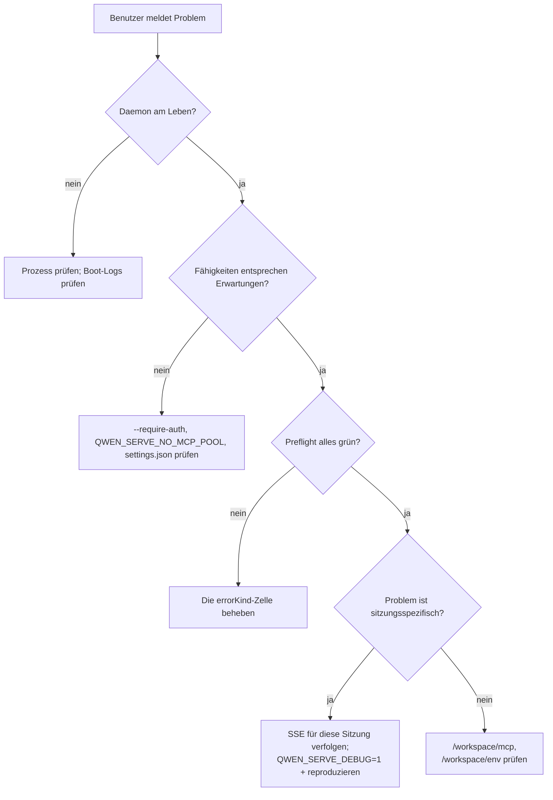

# Observability & Debugging

## Übersicht

`qwen serve` liefert derzeit **OpenTelemetry-Span-Instrumentierung**, **strukturierte Datei-Logs** (`DaemonLogger`), **anfragebezogene Access-Logs**, Debug-Stderr-Logs, strukturierte Preflight-Zellen und einen In-Memory-Berechtigungs-Audit-Ring. Diese Seite ist ein praktischer Leitfaden zur aktuellen Observability-Oberfläche und zu den Lücken, die bei der Fehlersuche beachtet werden müssen.

## Was es heute gibt

| Oberfläche                                   | Ort                                           | Zweck                                                                                                                                                                                                                                                                                         |
| -------------------------------------------- | --------------------------------------------- | ---------------------------------------------------------------------------------------------------------------------------------------------------------------------------------------------------------------------------------------------------------------------------------------------- |
| `QWEN_SERVE_DEBUG` Stderr-Logs               | `bridge.ts` und Aufrufstellen                 | Umgebungsvariablen-Werte `1` / `true` / `on` / `yes` (case-insensitive) geben `qwen serve debug: ...` Zeilen auf stderr aus.                                                                                                                                                                   |
| OpenTelemetry-Span-Instrumentierung          | `server.ts` `daemonTelemetryMiddleware`        | Jede HTTP-Anfrage wird in `withDaemonRequestSpan` eingebunden; Attribute umfassen Route, sessionId, clientId und Statuscode. Permission-Routen haben dedizierte Spans. Der Prompt-Lebenszyklus wird Ende-zu-Ende verfolgt. Die Konfiguration erfolgt in `settings.json` `telemetry`.             |
| `DaemonLogger` strukturierte Datei-Logs      | `serve/daemon-logger.ts`                      | Strukturierte JSON-ähnliche Logzeilen werden in eine Datei geschrieben. Beim Start wird `daemon log -> <path>` ausgegeben. Unterstützt Ebenen `info` / `warn` / `error` mit strukturierten Feldern wie `route`, `sessionId`, `clientId`, `childPid` und `channelId`.                            |
| Anfragebezogene Access-Log-Middleware        | `server.ts`, registriert vor `bearerAuth`     | Protokolliert `method`, `path`, `status`, `durationMs`, `sessionId` und `clientId` nach jeder Anfrage. Überspringt `GET /health` und Heartbeat. Bei 4xx+ wird `warn` verwendet; bei Erfolg `info`.                                                                                             |
| `/health`                                    | `server.ts` Route                             | Lebendigkeitsprüfung; `?deep=1` gibt erweiterte Details zurück.                                                                                                                                                                                                                                |
| `/capabilities`                              | `server.ts` Route                             | Preflight-Funktionserkennung. Siehe [`11-capabilities-versioning.md`](./11-capabilities-versioning.md).                                                                                                                                                                                        |
| `/workspace/preflight`                       | Route -> `DaemonStatusProvider`               | Strukturierte Bereitschaftszellen: Node-Version, CLI-Einstiegspunkt, ripgrep, git, npm, plus ACP-Zellen sobald ein Child-Prozess aktiv ist.                                                                                                                                                    |
| `/workspace/env`                             | Route -> `DaemonStatusProvider`               | Snapshot der Daemon-Prozess-Umgebung. Geheime Umgebungsvariablen melden nur die Existenz; Proxy-URL-Anmeldeinformationen werden entfernt.                                                                                                                                                       |
| `/workspace/mcp`                             | Route -> Bridge extMethod                     | Snapshot von Pool, Budget und Ablehnungen.                                                                                                                                                                                                                                                    |
| `/workspace/skills`, `/workspace/providers`  | Routen                                        | ACP-seitige Live-Snapshots; geben leere Leerlaufdaten zurück, wenn keine Sitzung existiert.                                                                                                                                                                                                   |
| Pro-Sitzung SSE                              | `GET /session/:id/events`                     | Echtzeit-Ereignisstream.                                                                                                                                                                                                                                                                      |
| `/demo` Debug-Konsole                        | `GET /demo` (`packages/cli/src/serve/demo.ts`) | Browserzugängliche Single-Page-Konsole: Chat, Ereignisprotokoll, Arbeitsbereichsinspektor und Berechtigungs-UX. Auf Loopback ist `http://127.0.0.1:4170/demo` der schnellste Ende-zu-Ende-Validierungspfad, ohne SDK-Code zu schreiben. Registrierungsregeln sind in [`02-serve-runtime.md`](./02-serve-runtime.md). |
| `PermissionAuditRing`                        | `permission-audit.ts`                         | Im-Speicher-FIFO von 512 Berechtigungsentscheidungen.                                                                                                                                                                                                                                          |
| Mediator `decisionReason` Audit              | `permissionMediator.ts`                       | Interner strukturierter Datensatz, der erklärt, warum eine Berechtigungsanfrage so aufgelöst wurde.                                                                                                                                                                                            |

## Was es heute nicht gibt

- **Kein Prometheus-/Metrik-Endpunkt.** Es gibt kein `process_cpu_seconds_total`, `http_requests_total` oder `event_bus_queue_depth`.
- **Kein externer Audit-Sink für `PermissionAuditRing`.** Der Ring existiert, aber Fan-Out-Hooks zu SIEM oder externem Speicher sind nicht verdrahtet.

## Debugging-Rezepte

### 1. Ist der Daemon am Leben?

```bash
curl -s http://127.0.0.1:4170/health
# {"status":"ok"}

curl -s 'http://127.0.0.1:4170/health?deep=1' | jq
# {"status":"ok","workspaceCwd":"/path","sessions":N,...}
```

Ein 401 auf Loopback bedeutet, dass `--require-auth` wahrscheinlich aktiviert ist. Verwenden Sie `QWEN_SERVE_DEBUG=1` beim Start, um Boot-Logs zu sehen.

### 2. Welche Funktionen werden angeboten?

```bash
curl -s http://127.0.0.1:4170/capabilities | jq
```

Prüfen Sie `mcp_workspace_pool` (F2-Pool aktiv?), `require_auth` (gehärtet?), `permission_mediation.modes` (unterstützte Richtlinien) und `policy.permission` (aktive Richtlinie).

### 3. Ist die Bereitschaft des Daemon-Hosts in Ordnung?

```bash
curl -s http://127.0.0.1:4170/workspace/preflight | jq
```

Zellen mit `status: 'not_started'` sind auf ACP-Ebene und werden erst nach dem Verbinden der ersten Sitzung befüllt. Zellen mit `status: 'fail'` enthalten einen geschlossenen `errorKind`; bieten strukturierte Abhilfe gemäß [`18-error-taxonomy.md`](./18-error-taxonomy.md).

### 4. Einen SSE-Stream einer Sitzung verfolgen

```bash
curl -N -H 'Accept: text/event-stream' \
     -H 'Authorization: Bearer XYZ' \
     -H 'X-Qwen-Client-Id: debug-tail' \
     -H 'Last-Event-ID: 0' \
     'http://127.0.0.1:4170/session/<sid>/events'
```

`-N` deaktiviert die curl-Ausgabepufferung. `Last-Event-ID: 0` fordert Wiederholung für Ringereignisse mit `id > 0`.

### 5. Warum wurde eine Berechtigungsanfrage so aufgelöst?

`PermissionAuditRing` ist im Speicher und hat heute keine HTTP-Oberfläche. Aktivieren Sie `QWEN_SERVE_DEBUG=1` und reproduzieren Sie; der Mediator gibt strukturierte Zeilen für jede Abstimmung und Entscheidung aus, einschließlich `decisionReason.type`. Ein späterer PR kann den Ring über HTTP bereitstellen.

### 6. Welcher Verbraucher ist langsam?

`slow_client_warning` wird einmal pro Überlauf-Episode ausgelöst, wenn die Warteschlange 75 % erreicht. Abonnieren Sie den SSE-Stream der Sitzung und achten Sie auf den synthetischen Frame; das Payload enthält `queueSize`, `maxQueued` und `lastEventId`. Wiederholte Warnungen deuten auf einen blockierten Verbraucher hin, in der Regel eine blockierte SDK-`for await`-Schleife.

### 7. Warum wurde ein MCP-Server abgelehnt?

Kombinieren Sie `/workspace/mcp` pro Zelle `disabledReason: 'budget'`, die Liste `refusedServerNames` und die SSE-Ereignisse `mcp_child_refused_batch`. Vergleichen Sie sie mit `/capabilities` `mcp_guardrails.modes` (`enforce` aktiv?) und dem Live-Zustand von `--mcp-client-budget`, der über `getReservedSlots()` sichtbar ist.

### 8. Der Daemon wird nicht heruntergefahren

Das erste Signal löst ein ordentliches Herunterfahren aus (siehe [`02-serve-runtime.md`](./02-serve-runtime.md)). Wenn es länger als 10s hängt, überprüfen Sie:

- ACP-Child-Prozess hat nicht auf ordentliches Schließen reagiert.
- Lange SSE-Verbindungen haben `server.close()` über `SHUTDOWN_FORCE_CLOSE_MS` (5s) hinaus offen gehalten.

Ein **zweites** SIGTERM/SIGINT löst absichtlich `bridge.killAllSync()` + `process.exit(1)` aus.

## Ablauf

### Typischer Triage-Ablauf



## Zustand und Lebenszyklus

- `QWEN_SERVE_DEBUG` wird bei jeder Prüfung durch `isServeDebugMode()` aus `debug-mode.ts` gelesen; ein Umschalten erfordert keinen Neustart. Boot-Logs sind nur verfügbar, wenn die Umgebungsvariable beim Start gesetzt war.
- `PermissionAuditRing` ist auf 512 FIFO-Einträge begrenzt; ältere Datensätze werden lautlos verworfen.
- `DaemonStatusProvider` baut Zellen pro Anfrage neu auf und speichert sie nicht zwischen; vermeiden Sie unnötiges Hochfrequenzabfragen.

## Abhängigkeiten

- `process.stderr.write` für Debug-Stderr.
- `DaemonLogger` für strukturierte Datei-Logs.
- OpenTelemetry SDK durch `initializeTelemetry` und `createDaemonBridgeTelemetry`.
- `node:process` für Umgebungs- und Signalinspektion.

## Konfiguration

| Stellschraube                     | Effekt                                                                                          |
| -------------------------------- | ----------------------------------------------------------------------------------------------- |
| `QWEN_SERVE_DEBUG`               | Aktiviert ausführliche Stderr-Logs. Siehe [`17-configuration.md`](./17-configuration.md).       |
| `settings.json` `telemetry`      | Steuert OTel-Verhalten: `enabled`, `otlpEndpoint`, `otlpProtocol` und signalbezogene Endpunkte. |
| `DaemonLogger` Log-Pfad          | Wird beim Start generiert und als `daemon log -> <path>` auf stderr ausgegeben.                 |
| `PermissionAuditRing`-Größe      | Heute auf 512 hartcodiert.                                                                      |
| `slow_client_warning`-Schwelle   | `0.75` / `0.375`, hartcodiert in `eventBus.ts`.                                                 |

## Einschränkungen und bekannte Grenzen

- **DaemonLogger-Datei-Logs sind strukturiert** und können nach `route`, `sessionId` und `clientId` gefiltert werden. `QWEN_SERVE_DEBUG` Stderr-Logs bleiben unstrukturierter Text.
- **OpenTelemetry-Spans enthalten anfragebezogene Korrelation.** Jeder HTTP-Anfrage-Span trägt Attribute für Route, sessionId und clientId, die in einem Tracing-Backend verknüpft werden können.
- **ACP-Ebene `/workspace/preflight`-Zellen erfordern eine aktive Sitzung.** Bei einem ruhenden Daemon können Auth / MCP / Skills / Provider `status: 'not_started'` anzeigen; dies ist erwartet.
- **`/workspace/env` meldet nur die Existenz von Geheimnissen, nicht die Werte.** Setzen Sie die Antwort nicht offen, wenn bereits die bloße Existenz eines Geheimnisses sensibel ist.
- **Der Audit-Ring ist prozesslokal** und der Verlauf geht beim Neustart des Daemon verloren.
- **Es gibt hier kein dokumentiertes Auslastungstest-Rezept.** Die Leistungsbaseline befindet sich im Branch `test/perf-daemon-baseline`.

## Referenzen

- `packages/cli/src/serve/daemon-status-provider.ts`
- `packages/cli/src/serve/daemon-logger.ts` (`DaemonLogger`, `buildDaemonLogLine`)
- `packages/cli/src/serve/debug-mode.ts` (`isServeDebugMode`)
- `packages/acp-bridge/src/permissionMediator.ts` (`PermissionDecisionReason`)
- `packages/cli/src/serve/server.ts` (`daemonTelemetryMiddleware`, Access-Log-Middleware)
- Konfiguration: [`17-configuration.md`](./17-configuration.md)
- Fehler-Taxonomie: [`18-error-taxonomy.md`](./18-error-taxonomy.md)
- Benutzerhandbuch: [`../../users/qwen-serve.md`](../../users/qwen-serve.md)