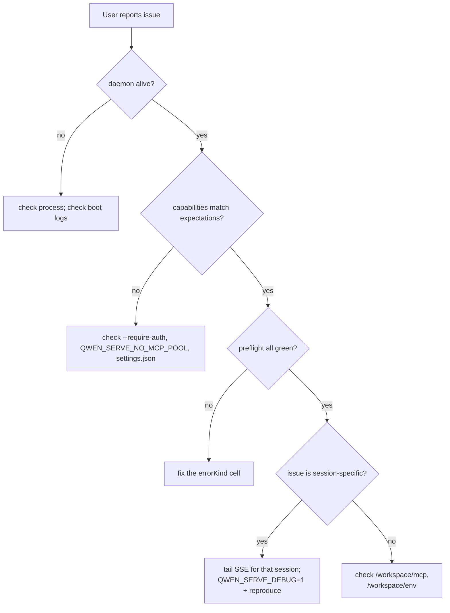

# Observability & Debugging

## Übersicht

`qwen serve` bietet derzeit **OpenTelemetry-Span-Instrumentierung**, **strukturierte Datei-Logs** (`DaemonLogger`), **Access-Logs pro Anfrage**, Debug-stderr-Logs, strukturierte Preflight-Zellen und einen In-Memory-Berechtigungs-Audit-Ring. Diese Seite ist ein praktischer Leitfaden zur aktuellen Observability-Oberfläche und zu den Lücken, die man während der Fehlersuche beachten sollte.

## Was heute existiert

| Oberfläche                                    | Ort                                               | Zweck                                                                                                                                                                                                                                                                                         |
| --------------------------------------------- | ------------------------------------------------- | --------------------------------------------------------------------------------------------------------------------------------------------------------------------------------------------------------------------------------------------------------------------------------------------- |
| `QWEN_SERVE_DEBUG` stderr-Logs                | `bridge.ts` und Aufrufstellen                     | Umgebungsvariablen mit den Werten `1` / `true` / `on` / `yes` (Groß-/Kleinschreibung egal) geben `qwen serve debug: ...` Zeilen auf stderr aus.                                                                                                                                                |
| OpenTelemetry-Span-Instrumentierung           | `server.ts` `daemonTelemetryMiddleware`           | Jede HTTP-Anfrage wird in `withDaemonRequestSpan` eingehüllt; Attribute umfassen Route, sessionId, clientId und Statuscode. Berechtigungsrouten haben dedizierte Spans. Der Prompt-Lebenszyklus wird Ende-zu-Ende verfolgt. Die Konfiguration befindet sich in `settings.json` unter `telemetry`. |
| `DaemonLogger` strukturierte Datei-Logs       | `serve/daemon-logger.ts`                          | Strukturierte, JSON-ähnliche Logzeilen werden in eine Datei geschrieben. Beim Start wird `daemon log -> <path>` ausgegeben. Unterstützt die Stufen `info` / `warn` / `error` mit strukturierten Feldern wie `route`, `sessionId`, `clientId`, `childPid` und `channelId`.                      |
| Access-Log-Middleware pro Anfrage              | `server.ts`, registriert vor `bearerAuth`         | Protokolliert `method`, `path`, `status`, `durationMs`, `sessionId` und `clientId` nach jeder Anfrage. Überspringt `GET /health` und Heartbeat. Bei 4xx+ wird `warn` verwendet; bei Erfolg `info`.                                                                                            |
| `/health`                                     | `server.ts` Route                                 | Liveness-Probe; `?deep=1` liefert erweiterte Details.                                                                                                                                                                                                                                         |
| `/capabilities`                               | `server.ts` Route                                 | Preflight-Feature-Erkennung. Siehe [`11-capabilities-versioning.md`](./11-capabilities-versioning.md).                                                                                                                                                                                        |
| `/workspace/preflight`                        | Route -> `DaemonStatusProvider`                   | Strukturierte Bereitschaftszellen: Node-Version, CLI-Einstieg, ripgrep, git, npm, plus ACP-Zellen, sobald ein Kindprozess läuft.                                                                                                                                                              |
| `/workspace/env`                              | Route -> `DaemonStatusProvider`                   | Snapshot der Daemon-Prozessumgebung. Geheime Umgebungsvariablen melden nur ihre Existenz; Proxy-URL-Zugangsdaten werden entfernt.                                                                                                                                                             |
| `/workspace/mcp`                              | Route -> bridge extMethod                         | Pool-, Budget- und Verweigerungs-Snapshot.                                                                                                                                                                                                                                                    |
| `/workspace/skills`, `/workspace/providers`   | Routen                                            | ACP-seitige Live-Snapshots; geben leere Daten zurück, wenn keine Sitzung vorhanden ist.                                                                                                                                                                                                       |
| Pro-Sitzung SSE                               | `GET /session/:id/events`                         | Echtzeit-Ereignisstrom.                                                                                                                                                                                                                                                                       |
| `/demo` Debug-Konsole                         | `GET /demo` (`packages/cli/src/serve/demo.ts`)    | Über den Browser zugängliche Einzelseiten-Konsole: Chat, Ereignislog, Workspace-Inspektor und Berechtigungs-UX. Auf Loopback ist `http://127.0.0.1:4170/demo` der schnellste Weg zur End-to-End-Validierung ohne SDK-Code. Die Registrierungsregeln sind in [`02-serve-runtime.md`](./02-serve-runtime.md). |
| `PermissionAuditRing`                         | `permission-audit.ts`                             | In-Memory-FIFO mit 512 Berechtigungsentscheidungen.                                                                                                                                                                                                                                           |
| Mediator `decisionReason`-Audit               | `permissionMediator.ts`                           | Interne strukturierte Aufzeichnung, die erklärt, warum eine Berechtigungsanfrage so entschieden wurde.                                                                                                                                                                                        |
## Was es derzeit nicht gibt

- **Kein Prometheus / Metrics-Endpunkt.** Es gibt keinen `process_cpu_seconds_total`, `http_requests_total` oder `event_bus_queue_depth`.
- **Kein externer Audit-Sink für `PermissionAuditRing`.** Der Ring existiert, aber Fan-out-Hooks zu SIEM oder externem Speicher sind nicht angebunden.

## Debugging-Rezepte

### 1. Lebt der Daemon?

```bash
curl -s http://127.0.0.1:4170/health
# {"status":"ok"}

curl -s 'http://127.0.0.1:4170/health?deep=1' | jq
# {"status":"ok","workspaceCwd":"/path","sessions":N,...}
```

Ein 401 auf Loopback bedeutet, dass `--require-auth` wahrscheinlich aktiviert ist. Verwenden Sie `QWEN_SERVE_DEBUG=1` beim Start, um die Boot-Logs zu sehen.

### 2. Welche Funktionen werden angekündigt?

```bash
curl -s http://127.0.0.1:4170/capabilities | jq
```

Überprüfen Sie `mcp_workspace_pool` (F2 Pool an?), `require_auth` (gehärtet?), `permission_mediation.modes` (unterstützte Richtlinien) und `policy.permission` (aktive Richtlinie).

### 3. Ist die Daemon-Host-Bereitschaft gesund?

```bash
curl -s http://127.0.0.1:4170/workspace/preflight | jq
```

Zellen mit `status: 'not_started'` sind auf ACP-Ebene und füllen sich erst, nachdem die erste Sitzung verbunden ist. Zellen mit `status: 'fail'` enthalten einen abgeschlossenen `errorKind`; stellen Sie eine strukturierte Abhilfe aus [`18-error-taxonomy.md`](./18-error-taxonomy.md) dar.

### 4. Einen Session-SSE-Stream verfolgen

```bash
curl -N -H 'Accept: text/event-stream' \
     -H 'Authorization: Bearer XYZ' \
     -H 'X-Qwen-Client-Id: debug-tail' \
     -H 'Last-Event-ID: 0' \
     'http://127.0.0.1:4170/session/<sid>/events'
```

`-N` deaktiviert die curl-Ausgabepufferung. `Last-Event-ID: 0` fordert eine Wiederholung für Ring-Ereignisse mit `id > 0`.

### 5. Warum wurde eine Berechtigungsanfrage so aufgelöst?

`PermissionAuditRing` ist im Arbeitsspeicher und hat derzeit keine HTTP-Oberfläche. Aktivieren Sie `QWEN_SERVE_DEBUG=1` und reproduzieren Sie den Vorgang; der Mediator gibt strukturierte Zeilen für jede Stimme und Entscheidung aus, einschließlich `decisionReason.type`. Ein späterer PR kann den Ring über HTTP verfügbar machen.

### 6. Welcher Consumer ist langsam?

`slow_client_warning` wird einmal pro Überlauf-Episode ausgelöst, wenn die Warteschlange 75% erreicht. Abonnieren Sie den Session-SSE-Stream und suchen Sie nach dem synthetischen Frame; die Nutzlast enthält `queueSize`, `maxQueued` und `lastEventId`. Wiederholte Warnungen deuten auf einen feststeckenden Consumer hin, in der Regel eine blockierte SDK-`for await`-Schleife.

### 7. Warum wurde ein MCP-Server abgelehnt?

Kombinieren Sie `/workspace/mcp` pro Zelle `disabledReason: 'budget'`, die Liste `refusedServerNames` und SSE-Ereignisse `mcp_child_refused_batch`. Vergleichen Sie diese mit `/capabilities` `mcp_guardrails.modes` (`enforce` aktiv?) und dem Live-`--mcp-client-budget`-Status, der über `getReservedSlots()` sichtbar ist.

### 8. Der Daemon lässt sich nicht herunterfahren

Das erste Signal löst ein Graceful Shutdown aus (siehe [`02-serve-runtime.md`](./02-serve-runtime.md)). Falls es länger als 10 Sekunden hängt, überprüfen Sie:

- Der ACP-Kindprozess hat nicht auf das Graceful Close reagiert.
- Lange SSE-Verbindungen haben HTTP `server.close()` länger als `SHUTDOWN_FORCE_CLOSE_MS` (5s) offen gehalten.

Ein **zweites** SIGTERM/SIGINT löst absichtlich `bridge.killAllSync()` + `process.exit(1)` aus.

## Ablauf

### Typischer Triage-Ablauf



## Zustand und Lebenszyklus

- `QWEN_SERVE_DEBUG` wird bei jeder Überprüfung durch `isServeDebugMode()` aus `debug-mode.ts` gelesen; das Umschalten erfordert keinen Neustart. Boot-Logs sind nicht verfügbar, es sei denn, die Umgebungsvariable wurde beim Booten gesetzt.
- `PermissionAuditRing` ist auf 512 FIFO-Einträge begrenzt; ältere Datensätze werden stillschweigend verworfen.
- `DaemonStatusProvider` baut Zellen pro Anfrage neu auf und speichert sie nicht zwischen; vermeiden Sie unnötiges Hochfrequenz-Polling.

## Abhängigkeiten

- `process.stderr.write` für Debug-Stderr.
- `DaemonLogger` für strukturierte Datei-Logs.
- OpenTelemetry SDK über `initializeTelemetry` und `createDaemonBridgeTelemetry`.
- `node:process` für Umgebungs- und Signal-Inspektion.

## Konfiguration

| Parameter                         | Effekt                                                                                       |
| ------------------------------- | -------------------------------------------------------------------------------------------- |
| `QWEN_SERVE_DEBUG`              | Aktiviert ausführliche stderr-Logs. Siehe [`17-configuration.md`](./17-configuration.md).    |
| `settings.json` `telemetry`     | Steuert das OTel-Verhalten: `enabled`, `otlpEndpoint`, `otlpProtocol` und Endpunkte pro Signal. |
| `DaemonLogger` log path         | Wird beim Booten generiert und als `daemon log -> <path>` auf stderr ausgegeben.             |
| `PermissionAuditRing` size      | Derzeit fest auf 512 codiert.                                                                 |
| `slow_client_warning` threshold | `0.75` / `0.375`, fest codiert in `eventBus.ts`.                                               |
## Einschränkungen und bekannte Grenzen

- **DaemonLogger-Dateilogs sind strukturiert** und können nach `route`, `sessionId` und `clientId` gefiltert werden. Die `QWEN_SERVE_DEBUG`-stderr-Logs bleiben unstrukturierter Text.
- **OpenTelemetry-Spans enthalten eine Korrelation pro Anfrage.** Jede HTTP-Anfrage-Span enthält die Attribute route, sessionId und clientId, die in einem Tracing-Backend verknüpft werden können.
- **ACP‑Level `/workspace/preflight`-Zellen erfordern eine aktive Sitzung.** Bei einem untätigen Daemon können Authentifizierung / MCP / Skills / Provider den Status `status: 'not_started'` anzeigen; das ist zu erwarten.
- **`/workspace/env` zeigt nur das Vorhandensein von Secrets an, nicht deren Werte.** Machen Sie die Antwort nicht zugänglich, wenn bereits die bloße Existenz eines Secrets sensibel ist.
- **Der Audit‑Ring ist prozesslokal** und die Historie geht beim Neustart des Daemon verloren.
- **Hier ist kein Lasttest‑Rezept dokumentiert.** Die Leistungsbasislinie befindet sich im Branch `test/perf-daemon-baseline`.

## Referenzen

- `packages/cli/src/serve/daemon-status-provider.ts`
- `packages/cli/src/serve/daemon-logger.ts` (`DaemonLogger`, `buildDaemonLogLine`)
- `packages/cli/src/serve/debug-mode.ts` (`isServeDebugMode`)
- `packages/acp-bridge/src/permissionMediator.ts` (`PermissionDecisionReason`)
- `packages/cli/src/serve/server.ts` (`daemonTelemetryMiddleware`, Access-Log-Middleware)
- Konfiguration: [`17-configuration.md`](./17-configuration.md)
- Fehlertaxonomie: [`18-error-taxonomy.md`](./18-error-taxonomy.md)
- Benutzerhandbuch: [`../../users/qwen-serve.md`](../../users/qwen-serve.md)
