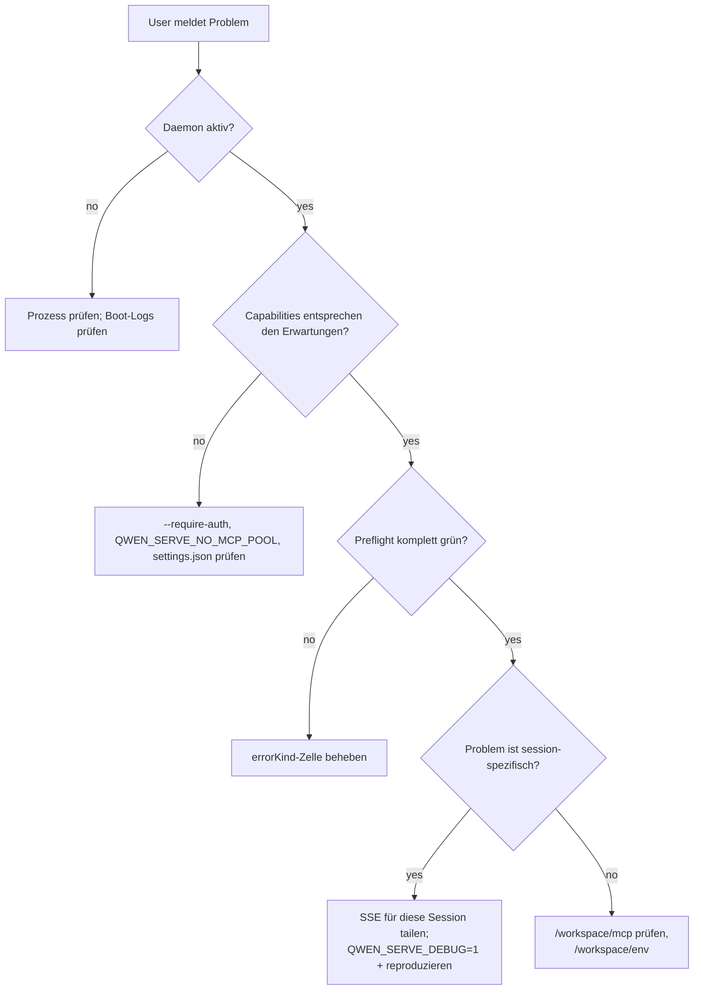

# Observability & Debugging

## Overview

`qwen serve` wird derzeit mit **OpenTelemetry Span Instrumentation**, **strukturierten Datei-Logs** (`DaemonLogger`), **Access-Logs pro Request**, Debug-Stderr-Logs, strukturierten Preflight-Zellen und einem In-Memory Permission Audit Ring ausgeliefert. Diese Seite ist ein praktischer Leitfaden zur aktuellen Observability-Oberfläche und den Lücken, die beim Triage zu beachten sind.

## Was heute verfügbar ist

| Bereich                                     | Ort                                       | Zweck                                                                                                                                                                                                                                                                                   |
| ------------------------------------------- | ---------------------------------------------- | ----------------------------------------------------------------------------------------------------------------------------------------------------------------------------------------------------------------------------------------------------------------------------------------- |
| `QWEN_SERVE_DEBUG` Stderr-Logs              | `bridge.ts` und Aufrufstellen                     | Umgebungsvariablen-Werte `1` / `true` / `on` / `yes` (Groß-/Kleinschreibung wird ignoriert) geben `qwen serve debug: ...`-Zeilen auf stderr aus.                                                                                                                                                                                  |
| OpenTelemetry Span Instrumentation          | `server.ts` `daemonTelemetryMiddleware`        | Jeder HTTP-Request wird in `withDaemonRequestSpan` eingehüllt; Attribute umfassen Route, sessionId, clientId und Statuscode. Permission-Routen haben eigene Spans. Der Prompt-Lifecycle wird End-to-End getracet. Die Konfiguration befindet sich in `settings.json` unter `telemetry`.                               |
| OpenTelemetry Daemon-Perf-Metriken           | `telemetry/*event-loop-lag*`, `daemon-metrics` | Event-Loop-Lag-Gauges für Daemon- und ACP-Child-Prozesse sowie Byte-Histogramme für Daemon-Child-Pipe-Nachrichten.                                                                                                                                                                                 |
| `DaemonLogger` strukturierte Datei-Logs         | `serve/daemon-logger.ts`                       | Strukturierte JSON-ähnliche Logzeilen werden in eine Datei geschrieben. Beim Boot wird `daemon log -> <path>` ausgegeben. Unterstützt die Level `info` / `warn` / `error` mit strukturierten Feldern wie `route`, `sessionId`, `clientId`, `childPid` und `channelId`.                                                        |
| Access-Log-Middleware pro Request           | `server.ts`, registriert vor `bearerAuth`    | Loggt `method`, `path`, `status`, `durationMs`, `sessionId` und `clientId` nach jedem Request. Überspringt `GET /health` und Heartbeat. 4xx+ verwendet `warn`; Erfolg verwendet `info`.                                                                                                                  |
| `/health`                                   | `server.ts` Route                              | Liveness-Probe; `?deep=1` gibt erweiterte Details zurück.                                                                                                                                                                                                                                       |
| `/capabilities`                             | `server.ts` Route                              | Preflight-Feature-Discovery. Siehe [`11-capabilities-versioning.md`](./11-capabilities-versioning.md).                                                                                                                                                                                      |
| `/workspace/preflight`                      | Route -> `DaemonStatusProvider`                | Strukturierte Readiness-Zellen: Node-Version, CLI-Entry, ripgrep, git, npm, plus ACP-Level-Zellen, sobald ein Child aktiv ist.                                                                                                                                                                       |
| `/workspace/env`                            | Route -> `DaemonStatusProvider`                | Snapshot der Daemon-Prozess-Umgebungsvariablen. Secret-Umgebungsvariablen melden nur ihre Existenz; Proxy-URL-Credentials werden entfernt.                                                                                                                                                                                    |
| `/workspace/mcp`                            | Route -> bridge extMethod                      | Pool-, Budget- und Refusal-Snapshot.                                                                                                                                                                                                                                                       |
| `/workspace/skills`, `/workspace/providers` | Routen                                         | ACP-seitige Live-Snapshots; geben leere Idle-Daten zurück, wenn keine Session existiert.                                                                                                                                                                                                                   |
| Pro-Session SSE                             | `GET /session/:id/events`                      | Echtzeit-Event-Stream.                                                                                                                                                                                                                                                                   |
| `/demo` Debug-Konsole                       | `GET /demo` (`packages/cli/src/serve/demo.ts`) | Browserzugängliche Single-Page-Konsole: Chat, Event-Log, Workspace-Inspector und Permission-UX. Auf Loopback ist `http://127.0.0.1:4170/demo` der schnellste End-to-End-Validierungspfad, ohne SDK-Code schreiben zu müssen. Registrierungsregeln finden sich in [`02-serve-runtime.md`](./02-serve-runtime.md). |
| `PermissionAuditRing`                       | `permission-audit.ts`                          | In-Memory FIFO mit 512 Permission-Entscheidungen.                                                                                                                                                                                                                                               |
| Mediator `decisionReason` Audit             | `permissionMediator.ts`                        | Interne strukturierte Aufzeichnung, die erklärt, warum eine Permission-Anfrage zu diesem Ergebnis geführt hat.                                                                                                                                                                                                   |

## Was derzeit nicht verfügbar ist

- **Kein Prometheus- / Metrik-Endpunkt.** OTel-Metriken können exportiert werden, aber der Daemon stellt keinen Prometheus-Scrape-Endpunkt bereit.
- **Kein externes Audit-Sink für `PermissionAuditRing`.** Der Ring existiert, aber Fan-out-Hooks zu SIEM oder externem Speicher sind nicht verbunden.

## Debugging-Rezepte

### 1. Ist der Daemon aktiv?

```bash
curl -s http://127.0.0.1:4170/health
# {"status":"ok"}

curl -s 'http://127.0.0.1:4170/health?deep=1' | jq
# {"status":"ok","workspaceCwd":"/path","sessions":N,...}
```

Ein 401 auf Loopback bedeutet, dass `--require-auth` wahrscheinlich aktiviert ist. Verwende `QWEN_SERVE_DEBUG=1` beim Start, um die Boot-Logs zu sehen.

### 2. Welche Features werden bereitgestellt?

```bash
curl -s http://127.0.0.1:4170/capabilities | jq
```

Prüfe `mcp_workspace_pool` (F2-Pool an?), `require_auth` (abgesichert?), `permission_mediation.modes` (unterstützte Policies) und `policy.permission` (aktive Policy).

### 3. Ist die Daemon-Host-Readiness in Ordnung?

```bash
curl -s http://127.0.0.1:4170/workspace/preflight | jq
```

Zellen mit `status: 'not_started'` sind auf ACP-Level und werden erst befüllt, nachdem die erste Session angehängt wurde. Zellen mit `status: 'fail'` enthalten eine geschlossene `errorKind`; leite die strukturierte Abhilfe aus [`18-error-taxonomy.md`](./18-error-taxonomy.md) ab.

### 4. Session-SSE-Stream tailen

```bash
curl -N -H 'Accept: text/event-stream' \
     -H 'Authorization: Bearer XYZ' \
     -H 'X-Qwen-Client-Id: debug-tail' \
     -H 'Last-Event-ID: 0' \
     'http://127.0.0.1:4170/session/<sid>/events'
```

`-N` deaktiviert das curl Output-Buffering. `Last-Event-ID: 0` fordert ein Replay für Ring-Events mit `id > 0` an.

### 5. Warum wurde eine Permission-Anfrage so aufgelöst?

`PermissionAuditRing` ist In-Memory und hat derzeit keine HTTP-Oberfläche. Aktiviere `QWEN_SERVE_DEBUG=1` und reproduziere das Problem; der Mediator gibt strukturierte Zeilen für jeden Vote und jede Entscheidung aus, einschließlich `decisionReason.type`. Ein späterer PR kann den Ring über HTTP verfügbar machen.

### 6. Welcher Consumer ist langsam?

`slow_client_warning` wird einmal pro Overflow-Episode ausgelöst, wenn die Queue 75 % erreicht. Abonniere den Session-SSE-Stream und suche nach dem synthetischen Frame; die Payload enthält `queueSize`, `maxQueued` und `lastEventId`. Wiederholte Warnungen deuten auf einen festsitzenden Consumer hin, normalerweise eine blockierte SDK-`for await`-Schleife.

### 7. Warum wurde ein MCP-Server abgelehnt?

Kombiniere `/workspace/mcp` pro Zelle `disabledReason: 'budget'`, die `refusedServerNames`-Liste und `mcp_child_refused_batch` SSE-Events. Vergleiche sie mit `/capabilities` `mcp_guardrails.modes` (`enforce` aktiv?) und dem Live-Status von `--mcp-client-budget`, sichtbar über `getReservedSlots()`.

### 8. Der Daemon fährt nicht herunter

Das erste Signal löst einen Graceful Shutdown aus (siehe [`02-serve-runtime.md`](./02-serve-runtime.md)). Wenn es nach 10s hängt, prüfe:

- ACP-Child-Prozess hat nicht auf Graceful Close reagiert.
- Lange SSE-Verbindungen hielten HTTP `server.close()` über `SHUTDOWN_FORCE_CLOSE_MS` (5s) hinaus offen.

Ein **zweites** SIGTERM/SIGINT löst absichtlich `bridge.killAllSync()` + `process.exit(1)` aus.

### 9. Ist der Daemon-Event-Loop, die Prompt-Queue oder die ACP-Pipe überlastet?

`GET /daemon/status` kann `runtime.perf` enthalten, wenn die Production-Daemon-Runtime den Perf-Snapshot-Provider injiziert:

```json
{
  "runtime": {
    "perf": {
      "eventLoop": { "meanMs": 1.2, "p50Ms": 1.0, "p99Ms": 9.5, "maxMs": 25 },
      "promptQueueWait": { "count": 3, "meanMs": 12.5, "maxMs": 35, "lastMs": 4 },
      "pipe": {
        "inbound": { "count": 42, "totalBytes": 100000, "maxBytes": 12000 },
        "outbound": { "count": 41, "totalBytes": 90000, "maxBytes": 11000 }
      }
    }
  }
}
```

Die Status-Payload ist nur für den Daemon. `promptQueueWait` fasst die im Daemon-Prozess beobachteten Prompt-FIFO-Queue-Wartezeit-Samples zusammen. Der ACP-Child-Event-Loop-Lag wird absichtlich nicht in `/daemon/status` aggregiert; er ist über den OTel-Gauge `qwen-code.acp.event_loop.lag` und über Stderr-Stall-Zeilen sichtbar, die in die Daemon-Logs weitergeleitet werden.

Neue OTel-Metriknamen:

- `qwen-code.daemon.event_loop.lag`, Gauge in Millisekunden mit `stat=mean|p50|p99|max`.
- `qwen-code.acp.event_loop.lag`, Gauge in Millisekunden mit `stat=mean|p50|p99|max`.
- `qwen-code.daemon.prompt.queue_wait`, Histogram in Millisekunden.
- `qwen-code.daemon.pipe.message_bytes`, Histogram in Bytes mit `direction=inbound|outbound`.

## Ablauf

### Typischer Triage-Ablauf


```mermaid
flowchart TD
    A[User meldet Problem] --> B{Daemon aktiv?}
    B -->|no| BD[Prozess prüfen; Boot-Logs prüfen]
    B -->|yes| C{Capabilities entsprechen den Erwartungen?}
    C -->|no| CD["--require-auth, QWEN_SERVE_NO_MCP_POOL, settings.json prüfen"]
    C -->|yes| D{Preflight komplett grün?}
    D -->|no| DD["errorKind-Zelle beheben"]
    D -->|yes| E{Problem ist session-spezifisch?}
    E -->|yes| ES["SSE für diese Session tailen;<br/>QWEN_SERVE_DEBUG=1 + reproduzieren"]
    E -->|no| EW["/workspace/mcp prüfen,<br/>/workspace/env"]
```

## State und Lifecycle

- `QWEN_SERVE_DEBUG` wird bei jeder Prüfung über `isServeDebugMode()` aus `debug-mode.ts` gelesen; das Umschalten erfordert keinen Neustart. Boot-Logs sind nicht verfügbar, außer die Umgebungsvariable wurde beim Boot gesetzt.
- `PermissionAuditRing` ist auf 512 FIFO-Einträge begrenzt; ältere Einträge werden stillschweigend verworfen.
- `DaemonStatusProvider` baut Zellen pro Request neu auf und cachet nicht; vermeide unnötiges Hochfrequenz-Polling.
## Abhängigkeiten

- `process.stderr.write` für Debug-Ausgaben auf stderr.
- `DaemonLogger` für strukturierte Datei-Logs.
- OpenTelemetry SDK über `initializeTelemetry` und `createDaemonBridgeTelemetry`.
- `node:perf_hooks.monitorEventLoopDelay` für Gauges zur Daemon- und ACP-Event-Loop-Verzögerung.
- `node:process` zur Inspektion von Umgebungsvariablen und Signalen.

## Konfiguration

| Einstellung                     | Auswirkung                                                                                 |
| ------------------------------- | ------------------------------------------------------------------------------------------ |
| `QWEN_SERVE_DEBUG`              | Aktiviert ausführliche Stderr-Logs. Siehe [`17-configuration.md`](./17-configuration.md).  |
| `settings.json` `telemetry`     | Steuert das OTel-Verhalten: `enabled`, `otlpEndpoint`, `otlpProtocol` und signal-spezifische Endpunkte. |
| `DaemonLogger`-Logpfad          | Wird beim Booten generiert und als `daemon log -> <path>` auf stderr ausgegeben.           |
| `PermissionAuditRing`-Größe     | Derzeit fest auf 512 hartcodiert.                                                          |
| `slow_client_warning`-Schwellenwert | `0.75` / `0.375`, hartcodiert in `eventBus.ts`.                                        |

## Einschränkungen und bekannte Grenzen

- **DaemonLogger-Datei-Logs sind strukturiert** und können nach `route`, `sessionId` und `clientId` gefiltert werden. `QWEN_SERVE_DEBUG`-Stderr-Logs bleiben unstrukturierter Text.
- **OpenTelemetry-Spans enthalten eine anfragebezogene Korrelation.** Jeder HTTP-Request-Span trägt die Attribute `route`, `sessionId` und `clientId`, die in einem Tracing-Backend zusammengeführt werden können.
- **`runtime.perf` ist nur für den Daemon.** Die Event-Loop-Verzögerung von Child-Prozessen wird dort absichtlich nicht berichtet; verwende OTel oder weitergeleitete Stderr-Stall-Warnungen für ACP-Child-Stalls.
- **`/workspace/preflight`-Zellen auf ACP-Ebene erfordern eine aktive Sitzung.** Bei einem inaktiven Daemon können Auth / MCP / Skills / Providers den `status: 'not_started'` anzeigen; dies ist das erwartete Verhalten.
- **`/workspace/env` meldet nur das Vorhandensein von Secrets, nicht deren Werte.** Exponiere die Antwort nicht, wenn schon das bloße Vorhandensein eines Secrets sensibel ist.
- **Der Audit-Ring ist prozesslokal** und die Historie geht bei einem Daemon-Neustart verloren.
- **Hier ist kein Load-Test-Rezept dokumentiert.** Die Performance-Baseline befindet sich im Branch `test/perf-daemon-baseline`.

## Referenzen

- `packages/cli/src/serve/daemon-status-provider.ts`
- `packages/cli/src/serve/daemon-logger.ts` (`DaemonLogger`, `buildDaemonLogLine`)
- `packages/cli/src/serve/debug-mode.ts` (`isServeDebugMode`)
- `packages/acp-bridge/src/permissionMediator.ts` (`PermissionDecisionReason`)
- `packages/cli/src/serve/server.ts` (`daemonTelemetryMiddleware`, Access-Log-Middleware)
- Konfiguration: [`17-configuration.md`](./17-configuration.md)
- Fehler-Taxonomie: [`18-error-taxonomy.md`](./18-error-taxonomy.md)
- Operations-Leitfaden für Benutzer: [`../../users/qwen-serve.md`](../../users/qwen-serve.md)