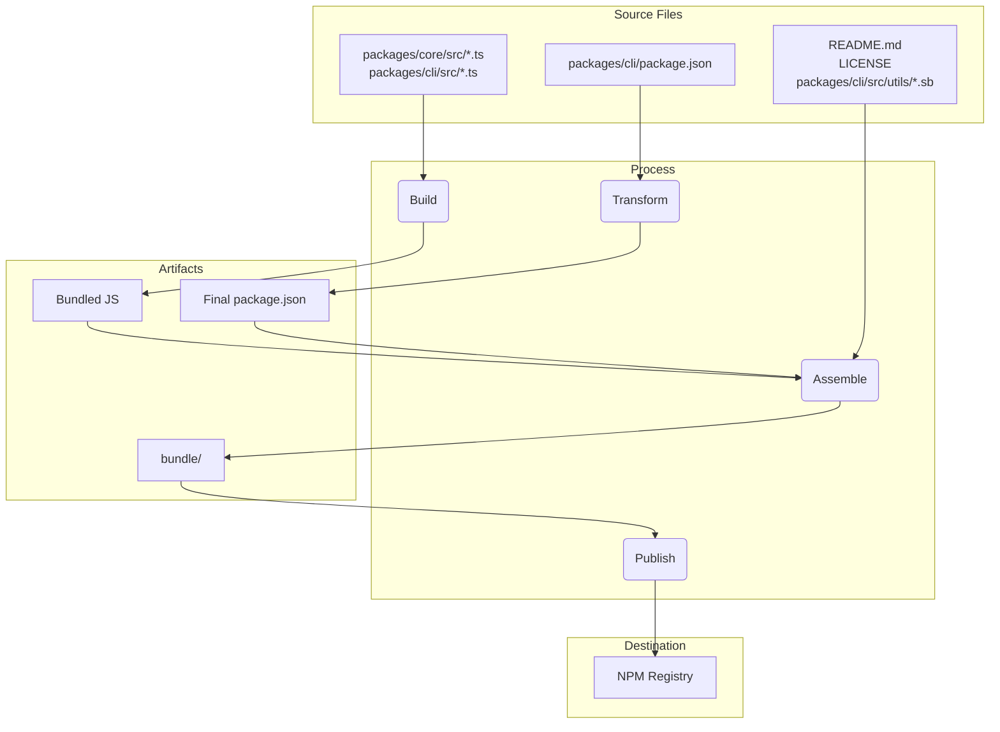

# Package Übersicht

Dieses Monorepo enthält zwei Hauptpakete: `@qwen-code/qwen-code` und `@qwen-code/qwen-code-core`.

## `@qwen-code/qwen-code`

Dies ist das Hauptpaket für Qwen Code. Es ist verantwortlich für die Benutzeroberfläche, das Parsen von Commands und alle anderen benutzerseitigen Funktionen.

Wenn dieses Paket veröffentlicht wird, wird es in eine einzelne ausführbare Datei gebundled. Dieses Bundle enthält alle Abhängigkeiten des Pakets, inklusive `@qwen-code/qwen-code-core`. Das bedeutet, egal ob ein Nutzer das Paket mit `npm install -g @qwen-code/qwen-code` installiert oder es direkt mit `npx @qwen-code/qwen-code` ausführt – er verwendet diese eine eigenständige, ausführbare Datei.

## `@qwen-code/qwen-code-core`

Dieses Package enthält die Kernlogik für die CLI. Es ist verantwortlich für das Senden von API-Anfragen an konfigurierte Provider, die Authentifizierung und das Management des lokalen Caches.

Dieses Package wird nicht gebundled. Bei der Veröffentlichung wird es als Standard-Node.js-Package mit seinen eigenen Abhängigkeiten veröffentlicht. Dadurch kann es bei Bedarf als eigenständiges Package in anderen Projekten verwendet werden. Der gesamte transpilierte JavaScript-Code im `dist`-Ordner ist im Package enthalten.

# Release-Prozess

Dieses Projekt folgt einem strukturierten Release-Prozess, um sicherzustellen, dass alle Packages korrekt versioniert und veröffentlicht werden. Der Prozess ist so weit wie möglich automatisiert.

## Wie man einen Release durchführt

Releases werden über den GitHub Actions Workflow [release.yml](https://github.com/QwenLM/qwen-code/actions/workflows/release.yml) verwaltet. Um einen manuellen Release für einen Patch oder Hotfix durchzuführen:

1. Gehe zum **Actions**-Tab des Repositories.
2. Wähle den **Release**-Workflow aus der Liste aus.
3. Klicke auf die Dropdown-Schaltfläche **Run workflow**.
4. Fülle die erforderlichen Eingaben aus:
   - **Version**: Die exakte Version, die veröffentlicht werden soll (z. B. `v0.2.1`).
   - **Ref**: Der Branch oder Commit-SHA, von dem aus veröffentlicht werden soll (standardmäßig `main`).
   - **Dry Run**: Auf `true` belassen, um den Workflow zu testen, ohne ihn tatsächlich zu veröffentlichen, oder auf `false` setzen, um einen echten Release durchzuführen.
5. Klicke auf **Run workflow**.

## Nightly Releases

Zusätzlich zu manuellen Releases verfügt dieses Projekt über einen automatisierten Nightly-Release-Prozess, um die neueste „bleeding edge“-Version zum Testen und Entwickeln bereitzustellen.

### Prozess

Jede Nacht um Mitternacht UTC wird der [Release Workflow](https://github.com/QwenLM/qwen-code/actions/workflows/release.yml) automatisch nach Zeitplan ausgeführt. Er führt folgende Schritte durch:

1.  Checkt den neuesten Code aus dem `main` Branch aus.
2.  Installiert alle Abhängigkeiten.
3.  Führt die komplette Suite an `preflight` Checks und Integrationstests aus.
4.  Falls alle Tests erfolgreich sind, berechnet er die nächste Nightly-Versionnummer (z.B. `v0.2.1-nightly.20230101`).
5.  Anschließend baut und veröffentlicht er die Pakete auf npm mit dem `nightly` dist-tag.
6.  Zuletzt erstellt er ein GitHub Release für die Nightly-Version.

### Fehlerbehandlung

Falls ein Schritt im Nightly-Workflow fehlschlägt, wird automatisch ein neues Issue im Repository erstellt mit den Labels `bug` und `nightly-failure`. Das Issue enthält einen Link zum fehlgeschlagenen Workflow-Lauf zur einfachen Fehlersuche.

### Wie man den Nightly Build verwendet

Um den neuesten Nightly Build zu installieren, verwende das `@nightly` Tag:

```bash
npm install -g @qwen-code/qwen-code@nightly
```

Wir führen außerdem einen Google Cloud Build namens [release-docker.yml](../.gcp/release-docker.yml) aus. Dieser veröffentlicht das Sandbox-Docker-Image entsprechend deinem Release. Sobald die Service-Account-Berechtigungen geklärt sind, wird dies ebenfalls auf GitHub verschoben und mit der Haupt-Release-Datei zusammengeführt.

### Nach dem Release

Sobald der Workflow erfolgreich abgeschlossen ist, kannst du seinen Fortschritt im [GitHub Actions Tab](https://github.com/QwenLM/qwen-code/actions/workflows/release.yml) verfolgen. Wenn er fertig ist, solltest du folgende Schritte durchführen:

1. Gehe zur [Pull Requests Seite](https://github.com/QwenLM/qwen-code/pulls) des Repositories.
2. Erstelle einen neuen Pull Request vom Branch `release/vX.Y.Z` in den `main` Branch.
3. Überprüfe den Pull Request (er sollte nur Versionsaktualisierungen in den `package.json` Dateien enthalten) und merge ihn. Dadurch bleibt die Version im `main` Branch aktuell.

## Release-Validierung

Nach dem Pushen eines neuen Releases sollte ein Smoke-Test durchgeführt werden, um sicherzustellen, dass die Pakete wie erwartet funktionieren. Dies kann erreicht werden, indem die Pakete lokal installiert und eine Reihe von Tests ausgeführt werden, um ihre korrekte Funktionsweise zu überprüfen.

- `npx -y @qwen-code/qwen-code@latest --version`, um zu validieren, dass der Push erfolgreich war – sofern kein RC- oder Dev-Tag verwendet wurde
- `npx -y @qwen-code/qwen-code@<release tag> --version`, um zu prüfen, ob das Tag korrekt gepusht wurde
- _Dies ist destruktiv für die lokale Umgebung_:  
  `npm uninstall @qwen-code/qwen-code && npm uninstall -g @qwen-code/qwen-code && npm cache clean --force && npm install @qwen-code/qwen-code@<version>`
- Ein Smoke-Test sollte einen einfachen Ablauf mit ein paar LLM-Befehlen und Tools beinhalten, um sicherzustellen, dass die Pakete wie erwartet funktionieren. Wir werden dies in Zukunft weiter formalisieren.

## Wann führe ich den Versionswechsel zusammen – oder nicht?

Das oben beschriebene Muster zum Erstellen von Patch- oder Hotfix-Releases von aktuellen oder älteren Commits aus lässt das Repository in folgendem Zustand zurück:

1.  Der Tag (`vX.Y.Z-patch.1`): Dieser Tag zeigt korrekterweise auf den ursprünglichen Commit im main-Branch, der den stabilen Code enthält, den du veröffentlichen wolltest. Das ist entscheidend. Jeder, der diesen Tag auscheckt, erhält exakt den Code, der veröffentlicht wurde.
2.  Der Branch (`release-vX.Y.Z-patch.1`): Dieser Branch enthält einen neuen Commit über dem getaggten Commit. Dieser neue Commit enthält nur die Versionsnummer-Änderung in der `package.json` (und anderen zugehörigen Dateien wie `package-lock.json`).

Diese Trennung ist gut. Sie hält den main-Branch sauber von release-spezifischen Versionsanhebungen, bis du dich entscheidest, sie zusammenzuführen.

Das ist die entscheidende Frage, und sie hängt vollständig von der Art des Releases ab.

### Merge Back für Stable Patches und Hotfixes

In den meisten Fällen solltest du den `release-<tag>` Branch zurück in `main` mergen, sobald du einen Stable Patch oder Hotfix releast.

- Warum? Der Hauptgrund ist, dass die Version in der package.json des main Branches aktualisiert werden muss. Wenn du z. B. v1.2.1 von einem älteren Commit releast, aber den Versionsbump nie zurückmerge, wird deine package.json im main Branch weiterhin `"version": "1.2.0"` anzeigen. Der nächste Entwickler, der mit der Arbeit an der nächsten Feature-Release (z. B. v1.3.0) beginnt, wird von einer Codebasis ausgehen, die eine falsche, veraltete Versionsnummer enthält. Das führt zu Verwirrung und erfordert später manuelles Anpassen der Versionsnummer.
- Der Prozess: Nachdem der release-v1.2.1 Branch erstellt und das Paket erfolgreich veröffentlicht wurde, solltest du einen Pull Request öffnen, um release-v1.2.1 in main zu mergen. Dieser PR enthält nur einen einzigen Commit: `"chore: bump version to v1.2.1"`. Es ist eine saubere und einfache Integration, die deinen main Branch mit der zuletzt releasten Version synchron hält.

### NICHT Zurückführen für Pre-Releases (RC, Beta, Dev)

Release Branches für Pre-Releases werden in der Regel nicht zurück in `main` gemerged.

- Warum? Pre-Release-Versionen (z. B. v1.3.0-rc.1, v1.3.0-rc.2) sind definitionsgemäß nicht stabil und nur temporär. Du willst den Verlauf deines main-Branches nicht mit einer Reihe von Versionsanpassungen für Release Candidates verschmutzen. Die package.json in main sollte die neueste stabile Release-Version widerspiegeln, nicht einen RC.
- Der Prozess: Der release-v1.3.0-rc.1-Branch wird erstellt, der Befehl `npm publish --tag rc` ausgeführt, und danach hat der Branch seinen Zweck erfüllt. Du kannst ihn einfach löschen. Der Code für den RC ist bereits in main (oder einem Feature-Branch) enthalten, sodass kein funktionaler Code verloren geht. Der Release-Branch war nur ein temporäres Transportmittel für die Versionsnummer.

## Lokales Testen und Validierung: Änderungen am Packaging- und Publishing-Prozess

Wenn du den Release-Prozess testen musst, ohne tatsächlich auf NPM zu veröffentlichen oder ein öffentliches GitHub-Release zu erstellen, kannst du den Workflow manuell über die GitHub UI auslösen.

1. Gehe zum [Actions-Tab](https://github.com/QwenLM/qwen-code/actions/workflows/release.yml) des Repositories.
2. Klicke auf das Dropdown-Menü „Run workflow“.
3. Lass die Option `dry_run` aktiviert (`true`).
4. Klicke auf den Button „Run workflow“.

Dadurch wird der gesamte Release-Prozess ausgeführt, jedoch werden die Schritte `npm publish` und `gh release create` übersprungen. Du kannst die Workflow-Logs einsehen, um sicherzustellen, dass alles wie erwartet funktioniert.

Es ist entscheidend, Änderungen am Packaging- und Publishing-Prozess lokal zu testen, bevor du sie committest. Dadurch wird sichergestellt, dass die Pakete korrekt veröffentlicht werden und wie erwartet funktionieren, wenn sie von einem Benutzer installiert werden.

Um deine Änderungen zu validieren, kannst du einen Dry-Run des Publishing-Prozesses durchführen. Dies simuliert den Publishing-Prozess, ohne tatsächlich Pakete im npm-Registry zu veröffentlichen.

```bash
npm_package_version=9.9.9 SANDBOX_IMAGE_REGISTRY="registry" SANDBOX_IMAGE_NAME="thename" npm run publish:npm --dry-run
```

Dieser Befehl führt folgende Aktionen aus:

1. Erstellt alle Pakete.
2. Führt alle Prepublish-Skripte aus.
3. Erzeugt die Paket-Tarballs, die auf npm veröffentlicht würden.
4. Gibt eine Zusammenfassung der Pakete aus, die veröffentlicht werden würden.

Du kannst dann die generierten Tarballs überprüfen, um sicherzustellen, dass sie die korrekten Dateien enthalten und dass die `package.json`-Dateien korrekt aktualisiert wurden. Die Tarballs werden im Root-Verzeichnis jedes Pakets erstellt (z. B. `packages/cli/qwen-code-0.1.6.tgz`).

Durch das Durchführen eines Dry-Runs kannst du sicher sein, dass deine Änderungen am Packaging-Prozess korrekt sind und dass die Pakete erfolgreich veröffentlicht werden.

## Release Deep Dive

Das Hauptziel des Release-Prozesses ist es, den Quellcode aus dem Verzeichnis `packages/` zu nehmen, zu bauen und ein sauberes, eigenständiges Paket im temporären `bundle`-Verzeichnis im Projektstamm zusammenzustellen. Dieses `bundle`-Verzeichnis ist es, was letztendlich auf NPM veröffentlicht wird.

Hier sind die wichtigsten Phasen:

### Phase 1: Vorab-Checks und Versionsverwaltung

- **Was passiert**: Bevor Dateien verschoben werden, stellt der Prozess sicher, dass sich das Projekt in einem guten Zustand befindet. Dazu gehören Tests, Linting und Type-Checking (`npm run preflight`). Die Versionsnummer in der root `package.json` sowie in `packages/cli/package.json` wird auf die neue Release-Version aktualisiert.
- **Warum**: Dadurch wird gewährleistet, dass nur hochwertiger, funktionierender Code veröffentlicht wird. Die Versionsaktualisierung ist der erste Schritt zur Kennzeichnung eines neuen Releases.

### Phase 2: Build des Quellcodes

- **Was passiert**: Der TypeScript-Quellcode in `packages/core/src` und `packages/cli/src` wird in JavaScript kompiliert.
- **Dateibewegung**:
  - `packages/core/src/**/*.ts` → kompiliert nach → `packages/core/dist/`
  - `packages/cli/src/**/*.ts` → kompiliert nach → `packages/cli/dist/`
- **Warum**: Der während der Entwicklung geschriebene TypeScript-Code muss in reines JavaScript umgewandelt werden, damit er von Node.js ausgeführt werden kann. Das Core-Package wird zuerst gebaut, da das CLI-Package davon abhängt.

### Phase 3: Zusammenstellen des finalen, veröffentlichbaren Pakets

Dies ist die kritischste Phase, in der Dateien verschoben und in ihren finalen Zustand für die Veröffentlichung überführt werden. Ein temporäres `bundle`-Verzeichnis wird im Projektstamm erstellt, um den Inhalt des finalen Pakets aufzunehmen.

#### 1. Transformation der `package.json`

- **Was passiert**: Die `package.json` aus `packages/cli/` wird eingelesen, modifiziert und ins root `bundle`-Verzeichnis geschrieben.
- **Dateibewegung**: `packages/cli/package.json` → (In-Memory-Transformation) → `bundle/package.json`
- **Warum**: Die finale `package.json` muss sich von derjenigen unterscheiden, die während der Entwicklung verwendet wird. Wichtige Änderungen sind:
  - Entfernen der `devDependencies`.
  - Entfernen von workspace-spezifischen `"dependencies"` wie `{ "@qwen-code/core": "workspace:*" }`, wobei sichergestellt wird, dass der Core-Code direkt in die finale JavaScript-Datei eingebunden wird.
  - Sicherstellen, dass die Felder `bin`, `main` und `files` auf die korrekten Pfade innerhalb der finalen Paketstruktur zeigen.

#### 2. Erstellung des JavaScript-Bundles

- **Was passiert**: Der gebaute JavaScript-Code aus `packages/core/dist` und `packages/cli/dist` wird zu einer einzigen, ausführbaren JavaScript-Datei gebündelt.
- **Dateibewegung**: `packages/cli/dist/index.js` + `packages/core/dist/index.js` → (gebündelt durch esbuild) → `bundle/gemini.js` (oder ähnlicher Name).
- **Warum**: Dies erzeugt eine einzelne, optimierte Datei mit dem gesamten benötigten Anwendungscode. Es vereinfacht das Paket, da das Core-Package nicht mehr als separate Abhängigkeit auf NPM benötigt wird – sein Code ist jetzt direkt enthalten.

#### 3. Kopieren statischer und unterstützender Dateien

- **Was passiert**: Wesentliche Dateien, die nicht Teil des Quellcodes sind, aber für das korrekte Funktionieren oder die Beschreibung des Pakets erforderlich sind, werden in das `bundle`-Verzeichnis kopiert.
- **Dateibewegung**:
  - `README.md` → `bundle/README.md`
  - `LICENSE` → `bundle/LICENSE`
  - `packages/cli/src/utils/*.sb` (Sandbox-Profile) → `bundle/`
- **Warum**:
  - `README.md` und `LICENSE` sind Standarddateien, die in jedem NPM-Paket enthalten sein sollten.
  - Die Sandbox-Profile (`.sb`-Dateien) sind wichtige Laufzeit-Ressourcen, die für die Funktionalität des CLI-Sandboxings erforderlich sind. Sie müssen sich neben der finalen ausführbaren Datei befinden.

### Phase 4: Veröffentlichen auf NPM

- **Was passiert**: Der Befehl `npm publish` wird aus dem root `bundle`-Verzeichnis heraus ausgeführt.
- **Warum**: Durch das Ausführen von `npm publish` aus dem `bundle`-Verzeichnis werden nur die Dateien hochgeladen, die wir sorgfältig in Phase 3 zusammengestellt haben. So wird verhindert, dass versehentlich Quellcode, Testdateien oder Entwicklungskonfigurationen veröffentlicht werden – das Ergebnis ist ein sauberes und minimales Paket für die Nutzer.

---

### Zusammenfassung des Dateiflusses



Dieser Prozess stellt sicher, dass das letztendlich veröffentlichte Artefakt eine gezielt erstellte, saubere und effiziente Darstellung des Projekts ist – und kein direkter Export des Entwicklungsumfelds.

## NPM Workspaces

Dieses Projekt verwendet [NPM Workspaces](https://docs.npmjs.com/cli/v10/using-npm/workspaces), um die Pakete innerhalb dieses Monorepos zu verwalten. Dies vereinfacht die Entwicklung, da wir Abhängigkeiten verwalten und Skripte über mehrere Pakete hinweg vom Root des Projekts aus ausführen können.

### Funktionsweise

Die root `package.json` Datei definiert die Workspaces für dieses Projekt:

```json
{
  "workspaces": ["packages/*"]
}
```

Dies teilt NPM mit, dass jeder Ordner innerhalb des `packages` Verzeichnisses ein separates Paket ist, das als Teil des Workspaces verwaltet werden sollte.

### Vorteile von Workspaces

- **Vereinfachte Dependency-Verwaltung**: Wenn du `npm install` im Root des Projekts ausführst, werden alle Abhängigkeiten für alle Pakete im Workspace installiert und miteinander verknüpft. Das bedeutet, dass du nicht in jedem Paket-Verzeichnis `npm install` ausführen musst.
- **Automatische Verlinkung**: Pakete innerhalb des Workspaces können voneinander abhängen. Beim Ausführen von `npm install` erstellt NPM automatisch Symlinks zwischen den Paketen. Das heißt, wenn du Änderungen an einem Paket vornimmst, stehen diese sofort für andere Pakete zur Verfügung, die davon abhängen.
- **Vereinfachte Skriptausführung**: Du kannst Skripte in beliebigen Paketen aus dem Root des Projekts mit dem Flag `--workspace` ausführen. Um beispielsweise das `build`-Skript im `cli`-Paket auszuführen, kannst du `npm run build --workspace @qwen-code/qwen-code` verwenden.