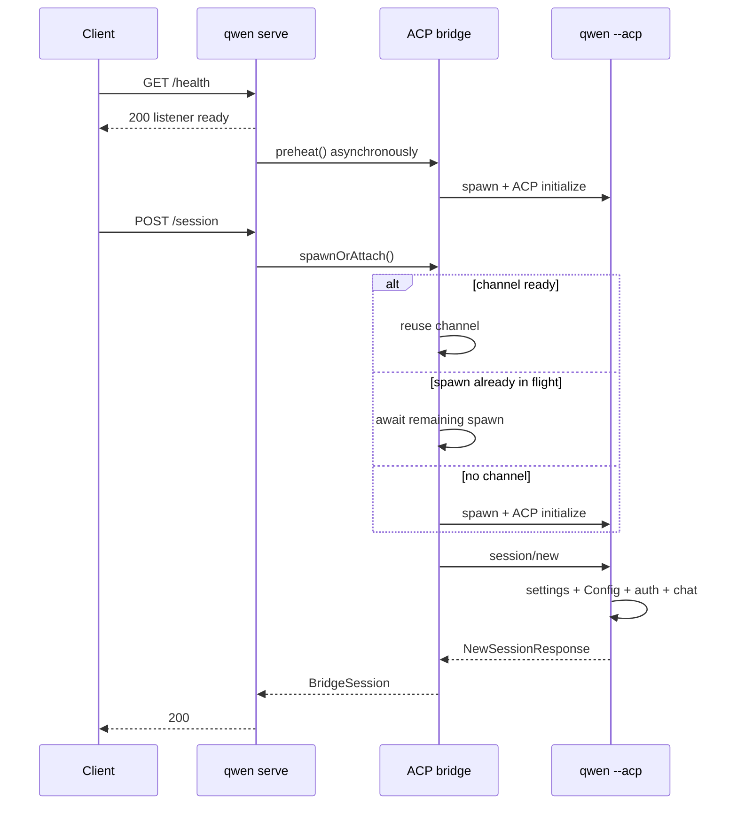

# Conception du profilage de la première session à froid

## Décision

La prochaine tranche d'implémentation de #4748 est l'observabilité, pas un nouveau cache de démarrage ni un nouveau protocole de session. Elle doit expliquer une requête froide à travers le démon, le canal ACP partagé et l'enfant ACP, tout en préservant le comportement rapide actuel de `/health`.

L'implémentation réutilise les spans OpenTelemetry existants de requête/bridge du démon et le point d'extension `_meta` d'ACP. Elle ajoute :

- le timing de la requête de bootstrap afin qu'une attente du runtime différé soit incluse dans le span HTTP ultérieur au lieu d'être confondue avec du temps de proxy/réseau ;
- un span d'attente de canal par requête qui indique si la Session a réutilisé un canal prêt, a rejoint un spawn en cours, ou a spawné à la demande ;
- un ID opaque sur chaque canal ACP afin qu'une trace de préchauffage automatique puisse être corrélée avec la trace de Session ultérieure sans inventer une fausse relation parent/enfant ;
- l'injection du contexte de trace sur `session/new` d'ACP ;
- un span `session/new` de l'enfant ACP avec des durées d'étapes bornées pour les paramètres, l'initialisation du Config, l'authentification, la configuration du système de fichiers, l'enregistrement de la Session et la construction de la réponse ;
- l'ID de Session ACP dans l'enregistrement JSONL existant opt-in `QWEN_CODE_PROFILE_SESSION_START`, afin que ses étapes détaillées de `startChat` puissent être jointes à la trace.

Cette tranche n'ajoute ni en-têtes de réponse, ni champs JSON publics, ni flags de capacité, ni un second format de profileur. La disponibilité d'ACP reste un changement P1 séparé du client/API, après que le découpage P0 est disponible.

## Preuves

L'échantillon aval `0.19.3-preview.2` montrait un P50 de 2 534 ms entre le succès du health et le succès de la Session, et un P50 de 1 713 ms pour `POST /session`. La corrélation négative entre le délai health-vers-requête et la durée du POST est cohérente avec une première requête qui attend le reste du préchauffage automatique, mais le timing du navigateur ne peut pas séparer le travail du proxy, du démon, du canal et de l'enfant.

Un dry-run local avec le `qwen 0.19.10` installé globalement a confirmé la même forme :

| Scénario                                            |                    Observation |
| --------------------------------------------------- | -----------------------------: |
| Démarrage du processus → listener                   |                          203ms |
| Health immédiatement suivi d'un `POST /session` à froid | 1 033ms navigateur / 962ms démon |
| `POST /session` déjà préchauffé dans une exécution distincte |   222ms navigateur / 221ms démon |

Ce sont des exécutions uniques illustratives, pas un benchmark d'acceptation. Elles montrent que la durée grossière actuelle de la route cache environ 700–800 ms qui peuvent être de l'attente de canal, du bootstrap de l'enfant ACP, ou les deux.

## Architecture actuelle

L'observabilité existante fournit déjà :

- un span de requête HTTP pour `POST /session` après que l'application runtime a reçu la requête ;
- des spans de bridge pour `channel.spawn`, `channel.initialize` et `session.new` ;
- l'injection et l'extraction du contexte de trace W3C via des clés `_meta` réservées d'ACP, actuellement utilisées pour le dispatch des prompts ;
- un profileur JSONL opt-in pour les étapes détaillées de `GeminiClient.startChat()`.

Les pièces manquantes sont toute attente du runtime différé au niveau bootstrap avant ce span de requête, l'attente de canal de la requête courante, la corrélation avec une trace de préchauffage démarrée indépendamment, la propagation sur `session/new`, et le timing avant `startChat` dans l'enfant.

## Conception

### Démon parent et bridge

Lorsqu'une requête hors bootstrap arrive avant que le runtime différé ne soit monté, l'application de bootstrap délégante enregistre son heure d'arrivée en temps réel, l'attente restante du runtime, et si cette requête a démarré le chargement du runtime ou a rejoint un travail déjà commencé par la planification health/fallback. Le middleware de télémétrie du runtime reçoit le même objet requête après montage et antidate le span HTTP à cette heure d'arrivée. Les métriques de durée de route utilisent la même frontière. Cela rend la durée navigateur moins la durée de requête du démon un résidu proxy/réseau significatif, même sur le chemin froid du runtime différé.

Avant que `doSpawn()` n'attende `ensureChannel()`, il classifie l'état synchrone du canal :

- `reused` : un canal non mourant est déjà disponible ;
- `joined` : `inFlightChannelSpawn` existe déjà ;
- `spawned_on_request` : ni un canal actif ni un spawn en cours n'existe.

Il enveloppe ensuite l'attente dans un span de bridge `channel.wait`. Les implémentations de télémétrie de production invoquent leur callback de manière synchrone, afin que la classification soit lue et que `ensureChannel()` soit invoqué sans céder la boucle d'événements JavaScript.

Chaque nouveau `ChannelInfo` reçoit un UUID aléatoire avant que `channelFactory()` ne soit appelé. Le même ID n'est attaché qu'aux spans de :

- `channel.spawn` ;
- `channel.initialize` ;
- `session.new` une fois que le canal est connu.

L'ID est une donnée de trace diagnostique, pas un label de métrique ni un identifiant public. Le préchauffage automatique et la première Session peuvent appartenir à des traces séparées ; l'ID de canal les relie sans affirmer que la requête HTTP ultérieure a causé le travail antérieur.

`preheat()` reçoit son propre span de bridge `channel.preheat`. Une Session qui le rejoint a un span `channel.wait` qui ne mesure que l'attente restante. `channel.initialize` et `channel.wait` se chevauchent dans ce cas et ne doivent pas être additionnés.

À l'intérieur du span existant `session.new`, le bridge injecte le contexte de trace actif dans `NewSessionRequest._meta`. Le helper d'injection existant retire déjà les clés réservées fournies par le client avant d'ajouter les valeurs détenues par le démon. Après la réponse de l'enfant, un événement de span enregistre l'ID de Session ACP pour la corrélation avec le profileur JSONL.

### Enfant ACP

`QwenAgent.newSession()` extrait le contexte du démon de la requête et démarre un span enfant `qwen-code.daemon.session_start` sous le span parent `session.new` du bridge. Si le contexte est absent ou invalide, le comportement normal de span racine OTel s'applique.

L'enfant enregistre des durées fixes et non chevauchantes en utilisant `performance.now()` :

| Étape               | Frontière                                                                                                                                                                          |
| ------------------- | ---------------------------------------------------------------------------------------------------------------------------------------------------------------------------------- |
| `settings_load`     | `loadSettingsCached(cwd)`                                                                                                                                                          |
| `config_setup`      | `newSessionConfig()`, incluant `loadCliConfig()`, `config.initialize()` et le premier `startChat()` normal                                                                       |
| `auth`              | `ensureAuthenticated()`                                                                                                                                                            |
| `file_system_setup` | `setupFileSystem()`                                                                                                                                                                |
| `session_register`  | `createAndStoreSession()`, normalement la construction et l'enregistrement de la `Session` ACP ; son initialisation défensive de Gemini n'est chronométrée ici que si Config ne l'a pas déjà initialisée |
| `response_build`    | modèles, modes, options de configuration et construction de l'objet de réponse                                                                                                   |

L'E2E d'implémentation a montré `config_setup` à environ 200 ms, dont environ 140 ms enregistrés par le profileur imbriqué existant de `startChat`. Cela confirme que le `startChat()` normal se produit pendant `config.initialize()`, et non pendant l'enregistrement ultérieur de la Session. Le Session ID JSONL rend ce coût imbriqué joignable sans suppositions sur les horodatages de fichiers. Une optimisation ultérieure pourra séparer la construction du Config de `config.initialize()` si les traces aval représentatives montrent que le coût restant non attribué du Config est significatif ; le faire dans cette tranche nécessiterait de faire passer un profileur à travers une méthode partagée par les chemins new/load/resume/transcript.

### Contrat d'attributs

Seuls des noms d'attributs fixes et des valeurs bornées sont émis :

- `qwen-code.daemon.channel.path` = `reused | joined | spawned_on_request` ;
- `qwen-code.daemon.runtime.path` = `started_on_request | joined` lorsque la requête a franchi la porte du runtime différé ;
- `qwen-code.daemon.runtime.wait_ms` = attente restante finie non négative du runtime ;
- l'histogramme de durée de requête HTTP `runtime_path` = `started_on_request | joined` pour les requêtes qui ont franchi la porte du runtime différé, sinon `none` ;
- `qwen-code.daemon.acp_channel.id` = UUID généré par le démon ;
- `qwen-code.daemon.session_start.<stage>_ms` = durée finie non négative ;
- `qwen-code.daemon.session_start.failed_stage` = un nom d'étape fixe ;
- `session.id` = Session ID généré par ACP.

Aucun chemin de workspace, prompt, valeur de paramètre, identifiant, réponse de modèle ou contenu de fichier n'est ajouté.

## Échec, concurrence et compatibilité

- OTel désactivé : le comportement existant est inchangé ; le bridge passe toujours par sa couture de télémétrie no-op et le profileur enfant évite la sortie fichier sauf si le flag d'environnement existant est activé.
- Échec du runtime différé : l'application de bootstrap renvoie toujours l'erreur de démarrage existante ; les métadonnées de timing sont locales au processus et ne sont jamais exposées dans la réponse.
- Métadonnées de trace invalides ou manquantes : l'enfant crée un span sans parent ou pas de span, et la création de Session continue.
- Échec d'attribut de télémétrie : les attributs d'étape sont enregistrés en best-effort et ne peuvent pas modifier le résultat de la Session.
- Échec du préchauffage : `channel.wait` reflète le chemin de retry de la requête ; le nettoyage existant de l'enfant et la sémantique de retry paresseux restent inchangés.
- Premières Sessions concurrentes : chaque requête obtient son propre `channel.wait` et son propre span de Session enfant, tout en pouvant toutes référencer le même ID de canal.
- Clients ACP anciens ou non-démon : `_meta` est optionnel, donc l'enfant continue d'accepter les messages `NewSessionRequest` ordinaires.
- Consommateurs JSONL existants : `sessionId` est additif et optionnel ; les champs existants et la disposition des fichiers ne changent pas.
- Démantèlement du canal : l'UUID diagnostique ne vit que sur `ChannelInfo` et disparaît avec le canal ; il ne modifie ni la réutilisation, ni le timeout d'inactivité, ni la logique de kill.

## Alternatives rejetées pour cette tranche

### Un ID de profil personnalisé et une enveloppe de réponse ACP

Renvoyer un second schéma de timing dans `NewSessionResponse._meta` dupliquerait OTel, nécessiterait validation/versionnement, et créerait deux sources de vérité. Le contexte W3C porte déjà la causalité et l'UUID de canal gère la trace de préchauffage volontairement séparée.

### `Server-Timing` et `X-Qwen-Profile-Id`

Ces en-têtes aideraient au diagnostic navigateur seul, mais ils imposent des décisions de pass-through des en-têtes de proxy et d'exposition CORS hors de ce dépôt. Le span de requête du démon et la durée de route existante fournissent déjà le temps serveur. Le travail sur les en-têtes pourra suivre si le tracing aval reste indisponible.

### Faire attendre `/health` pour ACP

Cela déplace la latence vers la disponibilité et risque des régressions des sondes de health. `/health` reste la disponibilité du listener/liveness ; la disponibilité d'ACP est un futur contrat séparé, contrôlé par capacité.

### Partager le Config ou pré-créer une Session

Les deux changent la sémantique d'isolation et de cycle de vie avant que le profilage n'identifie une étape dominante. Ils sont explicitement hors périmètre.

## Vérification

Des tests unitaires ciblés doivent prouver :

- que `session/new` reçoit les métadonnées de trace détenues par le démon ;
- qu'une requête de Session qui franchit la porte du runtime différé démarre son span HTTP à l'arrivée du bootstrap et enregistre si elle a démarré ou rejoint le chargement du runtime ;
- que `channel.wait` rapporte les chemins spawned, joined et reused ;
- qu'un UUID de canal relie les spans spawn, initialize et Session ;
- que l'enfant extrait le contexte parent et enregistre toutes les étapes fixes ;
- qu'une étape échouée est enregistrée et que l'erreur d'origine est préservée ;
- que le JSONL de session-start inclut le Session ID lorsqu'il est fourni et reste rétrocompatible en son absence ;
- que la télémétrie désactivée ou des métadonnées mal formées ne changent pas le comportement de la Session.

Le dry-run E2E compare deux cas avec le même workspace et la même authentification :

1. health immédiatement suivi de `POST /session` ;
2. health suivi d'un préchauffage explicite, puis de `POST /session`.

Pour les deux, vérifier le succès de la Session et inspecter l'arbre de trace. Le cas froid doit contenir le chemin `channel.wait` de la requête et les attributs d'étape de l'enfant ; le cas préchauffé doit rapporter `reused`. Les conclusions de performance nécessitent au moins 30 démarrages à froid sérialisés dans l'environnement aval représentatif et ne sont pas déduites de timings locaux à exécution unique.

## Frontière d'implémentation et porte de review

Les changements de production sont limités au transfert de requête du runtime différé et au middleware de télémétrie dans `run-qwen-serve`, à la couture de télémétrie existante dans `packages/acp-bridge`, à `newSession` d'ACP et au profileur existant core de session-start. Aucun changement de comportement Session/config/auth.

Les consommateurs aval inter-packages examinés pour cette conception sont :

- la construction du bridge du démon dans `run-qwen-serve.ts` et les implémentations de télémétrie des bridges de test/embedding ;
- l'admission des routes du runtime différé et les consommateurs de télémétrie/métriques des requêtes ;
- tous les appelants de `AcpSessionBridge.spawnOrAttach()`, qui reçoivent la même forme de `BridgeSession` ;
- les clients ACP autres que le démon, qui peuvent omettre `_meta` ;
- les tests du profileur de session-start et les lecteurs JSONL, pour lesquels `sessionId` est optionnel.

Comme cela traverse les frontières core/bridge/CLI, une review de mainteneur est requise même si le changement de logique de production est volontairement petit.
