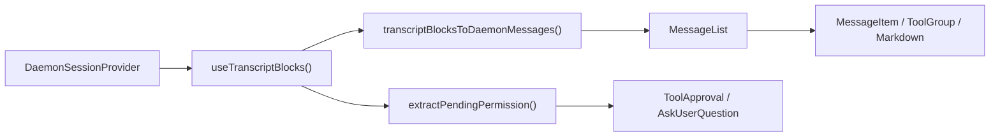
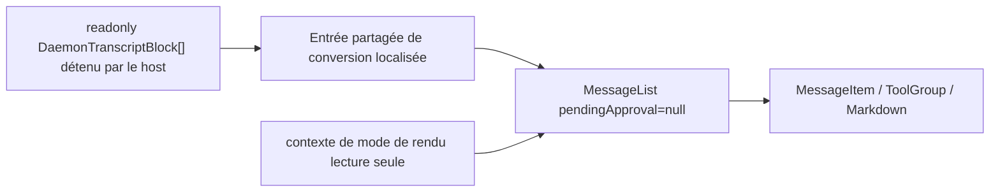

# Conception du rendu en lecture seule de la transcription du démon dans le WebShell

## Statut du document

- Statut : Implémenté
- Date : 2026-07-14
- Périmètre : `packages/web-shell`
- Entrée : `readonly DaemonTranscriptBlock[]`
- Sortie : une vue de transcription en lecture seule qui hérite des capacités de présentation de la `MessageList` du WebShell

## 1. Contexte

Le WebShell dispose déjà d'un chemin complet de rendu de la transcription du démon, mais il ne peut actuellement être utilisé qu'indirectement via `App` ou `ChatPane` en vue divisée. Le composant lit d'abord les blocs de transcription depuis `DaemonSessionProvider`, convertit ces blocs en messages internes du WebShell, puis les passe enfin à `MessageList` pour le rendu.

Le nouveau cas d'usage détient déjà directement un `DaemonTranscriptBlock[]` et n'a besoin que des capacités de style et de rendu des messages du WebShell pour afficher du contenu historique. Il n'a pas besoin d'établir une connexion de session au démon et ne doit pas effectuer de mutations de session. Les interactions explicitement exclues de la cible incluent l'approbation d'outils, `AskUserQuestion`, le retry, le branchement, la soumission de prompts et l'ouverture de panneaux qui modifient l'état de la session.

Si le host consomme directement le résultat de `transcriptBlocksToDaemonMessages` et assemble des composants internes, il expose le modèle privé `DaemonMessage` du WebShell, les contexts et les contraintes CSS. Il divergerait également du rendu pris en charge lorsque `MessageList` gagne des fonctionnalités. `@qwen-code/web-shell` doit donc fournir un point d'entrée public stable.

## 2. Objectifs

1. Ajouter un composant React public qui accepte directement et rend `readonly DaemonTranscriptBlock[]`.
2. Réutiliser le `transcriptBlocksToDaemonMessages()` existant et la même `MessageList`, afin que les capacités utilisateur, assistant, réflexion, outil, sous-agent, plan, statut, Markdown, timeline et défilement virtuel des longues sessions évoluent automatiquement avec `MessageList`.
3. Permettre au composant de rendre indépendamment de `DaemonWorkspaceProvider`, `DaemonSessionProvider` ou d'une connexion réseau.
4. N'invoquer aucune mutation de démon/session dans la frontière en lecture seule, ni afficher d'UI de réponse pour les permissions en attente ou `AskUserQuestion`.
5. Principalement ajouter des exports sans modifier les chemins runtime, les valeurs par défaut ni le comportement DOM du `WebShell`, `WebShellWithProviders`, `App` ou `ChatPane` existants.
6. Ajouter des tests unitaires complets du composant et passer la suite de tests WebShell existante, le build, le lint et le typecheck.

## 3. Non-objectifs

- Ajouter une récupération, une pagination, une mise en cache de transcription ou des abonnements SSE ; le host fournit les blocs.
- Insérer un mode lecture seule dans les `WebShellProps` existants, ou ajouter une double source de données conditionnelle `readOnly`/`blocks` à `App`.
- Exporter les types internes `MessageList`, `Message` ou `DaemonMessage`.
- Afficher ou traiter les approbations d'outils non résolues ou `AskUserQuestion`.
- Fournir le composer, les prompts en file d'attente, le statut de streaming, la barre latérale, la vue divisée, les dialogues, le panneau latéral droit des artefacts de l'App shell ou des capacités similaires. La timeline de session intégrée à `MessageList` reste.
- Déduire ou charger des artefacts de session séparés depuis les blocs. Les cartes de sortie de tour au niveau App pour les changements de fichiers, les artefacts et les tâches planifiées sont hors périmètre.
- Empêcher les interactions qui ne modifient que l'état de présentation local, telles que copier, replier/déplier un outil, déplier un tour terminé, le filtrage de tableau ou la navigation dans la timeline.

## 4. Terminologie et frontière de lecture seule

Dans cette conception, « lecture seule » signifie **ne pas lire ni modifier l'état runtime du démon/de la session**. Cela ne signifie pas poser `pointer-events: none` sur tout le DOM.

| Catégorie                    | Comportement                                                             | Conservé                            |
| ---------------------------- | ------------------------------------------------------------------------ | ----------------------------------- |
| Présentation passive         | Texte, Markdown, images, diff, sortie shell, statut d'outil/sous-agent   | Oui                                 |
| Consultation locale          | Copie, repli, dépliage, défilement virtuel, timeline, tri/filtrage de tableau | Oui                            |
| Présentation personnalisée du host | Renderer Markdown/bloc de code, renderer de contenu de message      | Oui ; le host possède les effets de bord |
| Liens externes ordinaires    | Navigation en nouvelle fenêtre après transformation d'URL sûre pour le navigateur | Oui                        |
| Navigation sémantique du WebShell | `qwen-session://` déclenche l'événement global `qwen:open-session`  | Non ; rendu comme texte non interactif |
| Mutation de session          | Envoyer un prompt, annuler, retry, branchement, rewind, changement de modèle/mode | Non                      |
| Mutation de permission       | Approuver/rejeter un outil, soumettre/ignorer `AskUserQuestion`          | Non                                 |
| Chargement de données externes | Attachement de session initié par le composant ou récupération de transcription/artefact/tâche/MCP | Non             |

Cette frontière préserve l'expérience de lecture de `MessageList` tout en garantissant que le composant lui-même n'a aucune capacité d'écriture vers le démon.

## 5. État actuel et carte des appelants

| Module                                                       | Responsabilité actuelle                                                                      | Relation avec cette conception                                        |
| ------------------------------------------------------------ | -------------------------------------------------------------------------------------------- | --------------------------------------------------------------------- |
| `packages/sdk-typescript/src/daemon/ui/types.ts`             | Définit l'union `DaemonTranscriptBlock`                                                      | Modèle d'entrée public du nouveau composant                           |
| `packages/web-shell/client/adapters/transcriptToMessages.ts` | Combine les blocs en `DaemonMessage[]` du WebShell                                           | Réutilisé directement ; ne pas créer de nouveau convertisseur         |
| `packages/web-shell/client/hooks/useMessages.ts`             | Lit les blocs depuis un hook de session et fournit les options de conversion localisées      | Extraire une entrée pure partagée de conversion acceptant des blocs externes |
| `packages/web-shell/client/components/MessageList.tsx`       | Repli des tours, groupes d'outils/sous-agents, timeline, défilement virtuel et rendu par message | La seule implémentation de liste partagée par les nouveaux et anciens chemins |
| `packages/web-shell/client/components/MessageItem.tsx`       | Dispatche les renderers concrets par rôle de message                                         | Aucun changement nécessaire                                           |
| `packages/web-shell/client/App.tsx`                          | WebShell complet à session unique, approbations, composer, panneaux latéraux                 | Le chemin existant reste inchangé                                     |
| `packages/web-shell/client/components/ChatPane.tsx`          | Session interactive complète en vue divisée                                                  | Le chemin existant reste inchangé                                     |
| `packages/web-shell/client/index.tsx` / `index.ts`           | Exports runtime/source du package                                                            | Exporter le nouveau composant et le type                              |

Le chemin principal actuel est :



Le nouveau chemin en lecture seule contourne le provider de session et la branche de permission :



Dans l'éditeur principal du WebShell, `/tasks` et `/mcp` sont interceptés à l'intérieur de `App`. Ils ne mettent à jour que l'état React du dialogue, n'appellent pas `sendPrompt()` et n'écrivent pas dans le JSONL de session. Les transcriptions persistées ne contiennent donc pas de sentinelle pour ces deux panneaux locaux, et la nouvelle entrée n'ajoute aucune branche de reconnaissance ou de filtrage correspondante.

## 6. API publique

Ajouter un composant nommé `WebShellTranscript`, exporté depuis la racine du package `@qwen-code/web-shell`.

```ts
export interface WebShellTranscriptProps {
  /** Blocs de transcription ordonnés d'une session logique. */
  blocks: readonly DaemonTranscriptBlock[];

  theme?: WebShellTheme;
  language?: 'en' | 'zh-CN' | 'zh' | 'zh-cn';
  className?: string;
  style?: React.CSSProperties;
  chatMaxWidth?: number;
  workspaceCwd?: string;

  compactThinking?: boolean;
  collapseCompletedTurns?: boolean;
  markdownTableMode?: MarkdownTableMode;
  virtualScrollThreshold?: number;
  markdown?: WebShellMarkdownCustomization;

  composerTagIcons?: WebShellComposerTagIconMap;
  renderToolHeaderExtra?: ToolHeaderExtraRenderer;
  parseUserMessageContent?: UserMessageContentParser;
  renderUserMessageContent?: UserMessageContentRenderer;
  renderComposerTag?: ComposerTagRenderer;
  renderComposerTagTooltip?: ComposerTagRenderer;
  renderAssistantTurnFooter?: AssistantTurnFooterRenderer;
}

export function WebShellTranscript(
  props: WebShellTranscriptProps,
): React.ReactElement;
```

Notes :

- `blocks` est requis et n'est ni copié ni modifié. Les appelants doivent garder les sessions et l'ordre des blocs cohérents dans le tableau.
- Les props visuelles réutilisent les noms et types de `WebShellProps`, évitant un second ensemble de sémantique de configuration pour les mêmes capacités.
- Ne pas exposer `onComposerTagClick`, `onRetryClick`, `onBranchSession`, `onTurnOutputOpen`, les callbacks de permission ni les callbacks du composer.
- `theme` a pour valeur par défaut `dark`. Lorsque `language` est omis, utiliser les règles de résolution URL/langue du navigateur du WebShell. `chatMaxWidth` a pour valeur par défaut 1000px.
- `compactThinking` a pour valeur par défaut `false` et `collapseCompletedTurns` a pour valeur par défaut `true`, en accord avec le `WebShell` existant.
- Le composant traite la transcription comme statique/déjà rejouée et passe `isResponding={false}` à `MessageList`. Le streaming live est hors du périmètre actuel de l'API.

Exemple :

```tsx
import { WebShellTranscript } from '@qwen-code/web-shell';
import type { DaemonTranscriptBlock } from '@qwen-code/sdk/daemon';

export function HistoryView({
  blocks,
}: {
  blocks: readonly DaemonTranscriptBlock[];
}) {
  return (
    <WebShellTranscript
      blocks={blocks}
      theme="dark"
      language="zh-CN"
      workspaceCwd="/workspace/project"
      style={{ height: 640 }}
    />
  );
}
```

Le host doit donner au composant une hauteur utilisable. Le composant lui-même préserve le `height: 100%`, le défilement interne et le comportement de largeur de contenu du WebShell.

## 7. Conception détaillée

### 7.1 Conversion localisée partagée

Conserver `transcriptBlocksToDaemonMessages()` comme unique adaptateur bloc-vers-message. Extraire une fonction pure interne dans `useMessages.ts`, par exemple :

```ts
export function transcriptBlocksToLocalizedMessages(
  blocks: readonly DaemonTranscriptBlock[],
  t: Translator,
): Message[];
```

Exporter cette fonction uniquement depuis son module de package interne pour la réutilisation par le nouveau composant ; ne pas l'exposer depuis la racine du package.

La fonction assemble uniquement les labels localisés actuellement utilisés par `useMessages()`, puis appelle l'adaptateur existant. Le `useMessages()` existant et le nouveau composant l'appellent tous deux, empêchant la dérive des textes pour l'annulation de prompt, le branchement, l'insertion en cours de tour et les streams interrompus.

C'est la seule restructuration interne nécessaire dans le chemin de rendu existant. L'entrée, la sortie et les résultats de conversion existants de la fonction restent inchangés, et les règles de combinaison de blocs de l'adaptateur ne sont pas modifiées.

### 7.2 Structure du composant `WebShellTranscript`

Ajouter `packages/web-shell/client/components/WebShellTranscript.tsx` avec cette séquence interne :

1. Résoudre le thème et la langue et créer un traducteur.
2. Convertir les `blocks` en `Message[]` avec `useMemo`.
3. Créer la même valeur de personnalisation de couche message que l'App existante.
4. Monter les contexts de thème, i18n, personnalisation, mode compact et mode de rendu lecture seule du WebShell, et les portails.
5. Créer une racine indépendante avec `data-web-shell-root` et `data-web-shell-shadcn`, en réutilisant la classe de thème, les variables de base, les polices, l'arrière-plan et les règles d'isolation CSS de l'App.
6. Rendre la même `MessageList`.

Les entrées fixes importantes de `MessageList` sont :

```tsx
<MessageList
  messages={messages}
  pendingApproval={null}
  isResponding={false}
  workspaceCwd={workspaceCwd ?? ''}
  virtualScrollThreshold={virtualScrollThreshold}
/>
```

Ne jamais passer ces props d'action :

- `onShowContextDetail`
- `onRetryClick`
- `onBranchSession`
- `onReviewChanges`
- `onOpenArtifact`
- `onOpenScheduledTask`
- `onTurnOutputOpen`

Ne pas passer de données de chargement, de rattrapage, de fin ou de sortie de tour, évitant toute dépendance à l'état de connexion de l'App et aux modèles de ressources externes.

### 7.3 Isolation des renderers interactifs

Passer uniquement `pendingApproval=null` à `MessageList` ne garantit pas pleinement un comportement en lecture seule. Les liens de session dans le statut des goals, le Markdown et les résultats d'outils n'utilisent pas les callbacks de `MessageList` ; ils déclenchent des événements sémantiques globaux sur `window`, pouvant potentiellement modifier le pied de page ou la session active d'un autre WebShell sur la même page.

Ajouter un contexte interne au package de mode de rendu de transcription dans `client/transcriptRenderMode.ts` avec une valeur par défaut de `interactive`. L'`App` et le `ChatPane` existants n'ont pas besoin de nouveau provider, leur comportement reste donc inchangé. `WebShellTranscript` définit la valeur à `readonly`. Le mode lecture seule applique uniquement ces restrictions :

- Préserver le texte et le style des liens `qwen-session://`, mais ne pas déclencher `qwen:open-session`.
- `GoalStatusMessage` ne déclenche pas `GOAL_STATUS_ACTIVE_EVENT`.
- Ne pas intercepter les liens HTTPS ordinaires ni les interactions de consultation locale telles que copier, replier et trier.

Ce contexte ne modifie que les sorties d'événements sémantiques dans `Markdown`, `ToolGroup` et `GoalStatusMessage`, et sa valeur par défaut est verrouillée à `interactive`. Cela évite d'ajouter une prop `readOnly` qui devrait traverser chaque renderer depuis `MessageList`. Les nouveaux tests unitaires doivent prouver à la fois que le comportement interactif par défaut est inchangé et que le comportement en lecture seule est supprimé.

### 7.4 Thème, CSS et portails

Le build de la bibliothèque WebShell injecte le CSS des composants et le porte sous `[data-web-shell-root]` ou `[data-web-shell-portal-root]`. Le nouveau composant doit créer sa propre racine WebShell ; sinon `MessageList` peut produire du DOM auquel les règles des modules CSS ne correspondent pas.

Les tooltips de timeline et les tableaux Markdown avancés utilisent des portails. Pour hériter pleinement de ces capacités, le nouveau composant utilise un cycle de vie d'hôte de portail équivalent à celui de l'App :

- Au montage, ajouter un nœud avec `data-web-shell-portal-root` et `data-web-shell-shadcn` à `document.body`.
- Synchroniser la classe de thème et les variables CSS de la racine.
- Fournir le nœud via `WebShellPortalRootContext`.
- Au démontage, supprimer le nœud et son observer/listener.

Conserver ce cycle de vie dans le nouveau composant plutôt que de refactoriser le code de portail existant de l'App, limitant la surface de régression du comportement existant à la nouvelle entrée. Ne pas accéder à `document` pendant le SSR ; activer le portail uniquement après le montage côté client.

### 7.5 Isolation des erreurs

La nouvelle entrée a une frontière publique extérieure et un composant de contenu intérieur. La conversion des blocs, l'initialisation des providers/portails et `MessageList` se trouvent toutes dans un enfant de la frontière, garantissant que les échecs à n'importe laquelle de ces étapes atteignent le même `RootErrorFallback` que l'entrée publique du WebShell. Chaque message reste isolé par la propre frontière de `MessageItem`, afin qu'un échec dans un renderer Markdown, KaTeX, Mermaid ou d'outil ne vide pas toute la transcription.

### 7.6 Stratégie de rendu des blocs

Toutes les stratégies continuent d'utiliser l'adaptateur existant ; ne pas ajouter un second switch dans le nouveau composant.

| `DaemonTranscriptBlock.kind` | Résultat en lecture seule                                                             |
| ---------------------------- | --------------------------------------------------------------------------------------- |
| `user`                       | Messages utilisateur, images et annotations d'entrée                                  |
| `assistant`                  | Markdown de l'assistant ; blocs consécutifs fusionnés ; contenu de sous-agent attribué par parent |
| `thought`                    | Messages de réflexion ; blocs consécutifs fusionnés                                   |
| `tool`                       | Cartes existantes pour les groupes d'outils, diff/read/shell/fetch/todo/sous-agent    |
| `shell`                      | Associé à l'outil d'exécution le plus proche ; fallback existant de shell brut lorsque indisponible |
| `user_shell`                 | Commande/sortie shell de l'utilisateur                                                |
| `status` / `debug`           | Message de plan ou de système/statut                                                  |
| `error`                      | Message système d'erreur sans action de retry                                         |
| `prompt_cancelled`           | Statut d'annulation localisé                                                          |
| `permission` non résolue     | Ne pas convertir, afficher ni fournir d'entrée d'action                               |
| `permission` résolue         | Règles existantes de placeholder/résultat d'outil historique de l'adaptateur          |
| Permission `AskUserQuestion` | Ne pas afficher le formulaire ; afficher les résultats historiques uniquement lorsqu'un bloc d'outil réel ultérieur existe |

### 7.7 Mises à jour et performance

- Réexécuter la conversion O(n) uniquement lorsque l'identité des `blocks` ou la langue change.
- `MessageList` conserve sa mémorisation existante, son regroupement de tours et son seuil de défilement virtuel.
- Ne pas copier profondément les blocs ni créer un nouveau provider React par bloc.
- Un appelant qui fournit fréquemment des tableaux à nouvelle identité mais au contenu identique déclenche à nouveau la conversion. C'est acceptable et correspond au modèle de mise à jour actuel de `useTranscriptBlocks()`.
- Ne pas ajouter d'adaptateur incrémental dans cette version. Concevoir une conversion incrémentale séparément uniquement si des mesures montrent que les mises à jour de grandes transcriptions externes sont un goulot d'étranglement.

## 8. Compatibilité et contrôle des régressions

### 8.1 Les chemins existants restent inchangés

- `WebShellProps` ne gagne aucun champ requis et ne modifie aucune valeur par défaut.
- `WebShell` et `WebShellWithProviders` continuent de rendre `App`.
- `App` et `ChatPane` continuent de lire l'état de session depuis leurs providers/hooks respectifs.
- L'overlay d'approbation, le composer, la barre latérale, la vue divisée et le panneau d'artefacts ne passent pas par le nouveau composant.
- `MessageList` ne gagne pas de branche de prop `readOnly`. Le nouvel appelant établit le comportement en lecture seule en passant `pendingApproval=null`, en omettant les callbacks d'action et en utilisant un contexte interne de mode de rendu dont la valeur par défaut reste interactive, pour isoler les quelques événements sémantiques globaux.

### 8.2 Exports du package

Mettre à jour à la fois `client/index.tsx` et `client/index.ts` pour exporter :

```ts
export { WebShellTranscript } from './components/WebShellTranscript';
export type { WebShellTranscriptProps } from './components/WebShellTranscript';
```

Les deux barrels doivent changer pour éviter que les chemins actuels de double entrée runtime et déclaration/source ne produisent « exporté au runtime mais absent des déclarations de types ». Ne pas ajouter d'export de sous-chemin de package.

### 8.3 Sécurité

- La nouvelle entrée n'importe pas `useActions()`, `useTranscriptStore()`, `useConnection()` ni `fetch`.
- Le contenu de permission en attente n'entre pas dans un renderer interactif.
- Ne pas inspecter ni réécrire le contenu des messages de statut. L'état de dialogue de `/tasks` et `/mcp` est par nature absent des transcriptions persistées.
- Le mode de rendu lecture seule ne déclenche pas d'événements globaux de session/goal susceptibles d'affecter un autre WebShell sur la même page.
- Le traitement des URL et du HTML du Markdown continue d'utiliser le sanitiseur/transformateur existant du WebShell ; ne pas ajouter `dangerouslySetInnerHTML` ni un autre contournement.
- Les renderers personnalisés sont du code du host. Les effets de bord exécutés par un renderer du host sont hors de la frontière garantie en lecture seule du composant, et le README doit l'indiquer explicitement.

## 9. Conception des tests

### 9.1 Nouveaux tests unitaires de contrat du composant

Ajouter `WebShellTranscript.test.tsx`, en mockant `MessageList` pour vérifier la frontière et le câblage :

1. L'adaptateur localisé partagé convertit les blocs en messages avec le bon ordre et le bon contenu.
2. `pendingApproval` est toujours `null`.
3. Les callbacks de mutation de session, de permission, de retry, de branchement et de sortie de tour sont tous omis.
4. `isResponding` a pour valeur par défaut `false`, et la configuration du workspace et du défilement virtuel est correctement relayée.
5. Le thème, la langue, le comportement compact/repli et la personnalisation des messages entrent dans les bons contexts.
6. Les changements de blocs ou de langue régénèrent les messages sans dupliquer l'ancien contenu.
7. Des blocs vides rendent une liste vide sans lever d'exception.

### 9.2 Nouveaux tests unitaires d'intégration DOM

Ajouter `WebShellTranscript.dom.test.tsx` en utilisant la vraie `MessageList` :

1. Rendre avec succès dans un arbre React sans providers du démon.
2. Des blocs représentatifs utilisateur, Markdown assistant, réflexion, outil, sous-agent, plan, statut, erreur et prompt annulé entrent dans le DOM WebShell correspondant.
3. Le repli/dépliage local, la copie ou la navigation dans la timeline fonctionnent toujours, prouvant que les capacités de `MessageList` sont réutilisées.
4. Une permission ordinaire non résolue ne produit pas de panneau d'approbation.
5. Un `AskUserQuestion` non résolu ne produit pas d'UI d'option, de saisie, de soumission ni d'ignorance.
6. Les résultats historiques résolus d'outil/AskUser suivent les règles de présentation existantes de l'adaptateur.
7. Les liens de session et les statuts de goal en lecture seule ne déclenchent pas d'événements sémantiques globaux ; les tests existants correspondants des composants continuent de prouver que le comportement interactif par défaut est inchangé.
8. Les classes sombre/clair, la langue, les textes localisés, la largeur maximale du chat et les marqueurs de racine CSS sont corrects.
9. La racine du portail se monte et se démonte correctement, et le contenu du portail est sous la racine portée.
10. Lorsqu'un renderer personnalisé individuel lève une exception, le fallback du renderer intégré est utilisé et le reste du message subsiste.

### 9.3 Tests de conversion partagée et d'exports

- Étendre les tests de `useMessages`/adaptateur pour prouver que le hook existant et les blocs externes utilisent exactement les mêmes options localisées.
- Étendre `index.test.tsx` ou les tests d'artefacts de build pour vérifier que l'export nommé runtime existe.
- Après le build, vérifier que `dist/types/index.d.ts` contient les exports de `WebShellTranscript` et de ses props, empêchant la dérive entre les deux déclarations d'entrée.

### 9.4 Suite de régression existante

La séquence de vérification minimale requise après l'implémentation est :

```bash
cd packages/web-shell
npm run build
npx vitest run --config vitest.config.ts \
  client/components/WebShellTranscript.test.tsx \
  client/components/WebShellTranscript.dom.test.tsx \
  client/hooks/useMessages.test.ts \
  client/adapters/transcriptToMessages.test.ts \
  client/components/MessageList.test.ts \
  client/components/MessageList.dom.test.tsx \
  client/components/messages/Markdown.test.ts \
  client/components/messages/ToolGroup.test.tsx \
  client/components/messages/SystemMessage.test.tsx \
  client/index.test.tsx
npm test
npm run format:check
npm run lint
npm run typecheck

cd ../..
npm run build
npm run typecheck
```

`npm test` est la suite WebShell complète existante et doit passer pour ce changement. Le changement n'ajoute aucune page autonome et ne modifie pas le test smoke Playwright existant du protocole App/démon, aucun test E2E navigateur n'est donc ajouté. `WebShellTranscript.dom.test.tsx` couvre le comportement réel du DOM.

## 10. Étapes d'implémentation

1. Extraire la conversion localisée partagée des blocs dans `useMessages.ts`, en préservant la sortie actuelle du hook.
2. Ajouter un contexte interne de mode de rendu de transcription et le consommer aux sorties des liens de session/événements de goal ; préserver `interactive` comme valeur par défaut.
3. Ajouter `WebShellTranscript` et ses props, en implémentant le câblage racine/providers/portails/`MessageList`.
4. Ajouter les exports runtime et de types aux deux barrels publics.
5. Mettre à jour `packages/web-shell/README.md` avec un exemple d'intégration en lecture seule, l'exigence de hauteur du host et la frontière de lecture seule.
6. Ajouter les tests de contrat, DOM, isolation des interactions et exports/déclarations de types.
7. Exécuter les tests ciblés, la suite de tests WebShell complète, le build, le lint et le typecheck.
8. Relire le diff complet selon les directives du dépôt ; réexécuter l'étape 7 après toute correction.

## 11. Alternatives

### 11.1 Ajouter `blocks` et `readOnly` au `WebShell` existant

Rejeté. `App` consomme actuellement plusieurs hooks du démon inconditionnellement et gère les approbations, le composer, la session, la barre latérale et les panneaux. Une double source de données ajouterait des branches conditionnelles dans tout `App`, nécessitant des providers tout en se protégeant des mutations. Sa surface de régression est bien plus grande que cette exigence.

### 11.2 Exporter publiquement `MessageList`

Rejeté. Les appelants dépendraient toujours des `Message[]` privés, de multiples contexts, des conventions de racine CSS et des conventions de portail, et le modèle interne deviendrait une API publique de long terme.

### 11.3 Dupliquer le renderer pour l'usage en lecture seule

Rejeté. La duplication ferait immédiatement diverger le comportement Markdown, outil/sous-agent, repli de tours, timeline et défilement virtuel, ne satisfaisant pas l'exigence d'hériter des capacités de rendu de `MessageList`.

### 11.4 Afficher les Permission/AskUserQuestion désactivées dans le nouveau composant

Rejeté. Les formulaires désactivés créent toujours une sémantique interactive et des branches d'état supplémentaires, et ils induisent les utilisateurs en erreur en leur faisant croire qu'ils peuvent répondre dans une vue historique. Les permissions en attente sont masquées dans cette version ; les blocs d'outils ultérieurs portent les résultats historiques.

## 12. Risques et atténuations

| Risque                                                       | Atténuation                                                                                                 |
| ------------------------------------------------------------ | --------------------------------------------------------------------------------------------------------- |
| La conversion localisée dérive entre la nouvelle entrée et App | Les deux appellent le même helper de conversion localisée                                                 |
| Le portail manque la portée CSS                              | Créer un `data-web-shell-portal-root` séparé, synchroniser les variables et couvrir avec des tests DOM    |
| Mutation accidentelle du démon                               | Le nouveau composant n'importe aucun hook d'action et n'expose aucun callback de mutation ; les tests de contrat le verrouillent |
| L'état de dialogue local à App est confondu avec des données de transcription | Documenter explicitement que `/tasks` et `/mcp` n'écrivent pas de JSONL ; la nouvelle entrée ne copie pas l'état de dialogue d'App |
| Les événements sémantiques globaux affectent un autre WebShell sur la page | Le mode de rendu lecture seule supprime les événements de session/goal ; les tests de régression couvrent le comportement par défaut |
| Un nouveau type de bloc n'a pas de présentation              | Continuer à le prendre en charge via l'adaptateur partagé ; ne pas dupliquer de switch dans le composant  |
| Les exports runtime et de types du package divergent         | Mettre à jour les deux barrels et inspecter les déclarations construites                                  |
| Coût de recalcul des grandes transcriptions                  | `useMemo` plus le défilement virtuel existant ; différer la conversion incrémentale jusqu'à ce que des mesures la justifient |
| Un renderer personnalisé introduit des effets de bord        | Documenter la responsabilité du host ; les renderers par défaut restent en lecture seule                  |

## 13. Critères d'acceptation

- Un host peut rendre une transcription du WebShell dans un environnement sans providers du démon en ne fournissant que les blocs.
- Les blocs représentatifs rendent de manière identique aux mêmes données dans la `MessageList` existante du WebShell.
- Les permissions d'outils en attente et `AskUserQuestion` ne produisent aucune UI interactive ni chemin de soumission.
- La vue en lecture seule ne déclenche aucun événement sémantique global de session/goal.
- Le nouveau composant conserve les interactions de lecture locales et les capacités de longues listes de `MessageList`.
- Les API, valeurs par défaut, tests et comportement runtime existants de `WebShell`/`WebShellWithProviders` restent inchangés.
- Le runtime et le `.d.ts` de `@qwen-code/web-shell` exportent tous deux le nouveau composant et ses props.
- Les nouveaux tests unitaires, la suite WebShell complète existante et le build/typecheck racine passent tous.
