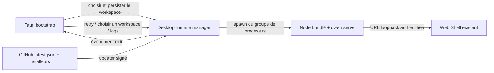

# Design de publication du Desktop Web Shell

## Problème

Le PoC de bureau actuel a déjà prouvé que Tauri peut réutiliser le Web Shell
fourni par le démon, sans avoir à maintenir une seconde UI. Mais le PoC manque
encore des flux utilisateur, de la récupération de pannes, des mises à jour
signées, des frontières de sécurité et des artefacts d'installation
tri-plateforme nécessaires à une publication publique.

Ce design affine `packages/desktop-shell` en une coquille de bureau fine : la
coquille de bureau n'est responsable que du cycle de vie et de l'intégration
plateforme ; les fonctionnalités produit continuent d'être fournies par
`qwen serve` et `@qwen-code/web-shell`.

## Objectifs

- macOS, Windows et Linux utilisent le même jeu d'UI Web Shell.
- Le premier démarrage permet à l'utilisateur de choisir un workspace ; les
  démarrages suivants restaurent le workspace le plus récent.
- Quand le démarrage du démon échoue ou qu'il se termine en cours d'exécution,
  fournir une interface de récupération actionnable plutôt qu'une sortie
  silencieuse.
- La coquille de bureau ne charge que la page bootstrap locale et le démon sur
  un port aléatoire local ; les URL externes sont toujours confiées au
  navigateur système.
- Les artefacts de publication portent une version, une origine, une licence,
  des sommes de contrôle et des métadonnées de mise à jour signées.
- La release publique est signée et notarisée sur macOS, signée Authenticode
  sur Windows ; Linux produit AppImage et deb.

## Non-objectifs

- Pas de nouvelle UI de chat, de modèle de session ou d'API du démon
  spécifique au bureau.
- Pas de copie du Web Shell dans le package de bureau à maintenir.
- Pas de multi-fenêtres, de multi-workspaces simultanés ni de résidence en
  arrière-plan.
- Pas d'engagement de distribution par Store ; la première version publique
  utilise GitHub Releases.
- Pas de Git, shell ou autres outils système intégrés. Les outils manquants
  continuent d'être signalés par les capacités existantes du Web Shell.

## Architecture



### Responsabilités des composants

| Composant            | Responsabilité                                                               |
| --------------- | ------------------------------------------------------------------ |
| page bootstrap  | état de démarrage, sélection du workspace, récupération de panne, entrée version et logs                     |
| état de bureau Rust   | persistance des réglages, état de la fenêtre, cycle de vie du runtime, instance unique, état de mise à jour           |
| runtime bundlé | Node.js de la plateforme actuelle, bundle Qwen Code, assets statiques du Web Shell             |
| CI de publication         | build tri-plateforme, signature, notarisation, smoke, sommes de contrôle, latest.json, GitHub Release |

## Machine à états de démarrage

| État              | Ce que l'utilisateur voit                   | Actions disponibles                        |
| ----------------- | -------------------------------- | ------------------------------- |
| `starting`        | page de démarrage à la marque Qwen Code et workspace actuel | attendre                            |
| `needs_workspace` | sélection du workspace au premier démarrage               | choisir un répertoire                        |
| `ready`           | Web Shell servi par le démon          | utilisation normale                        |
| `failed`          | résumé d'erreur concis                     | réessayer, choisir un autre répertoire, ouvrir les logs    |
| `stopped`         | notification de sortie inattendue du démon              | redémarrer le démon, choisir un répertoire, ouvrir les logs |

L'application crée d'abord la fenêtre bootstrap, puis démarre le démon de
manière asynchrone. Après que le health check profond du démon
(`/health?deep=true`) passe, la même fenêtre navigue vers
`http://127.0.0.1:<port>/#token=<token>`. Le token n'existe que dans le
fragment d'URL, n'est jamais envoyé au serveur avec les requêtes, donc aucun
handshake de cookie n'est nécessaire et il n'entre ni dans l'access log ni
dans le Referer. Ainsi, les démarrages lents et les chemins d'échec ont tous
une UI visible.

Le health check profond doit être utilisé : le fast path de serve répond au
`/health` superficiel avec l'app bootstrap avant que le vrai runtime (avec le
Web Shell) soit monté. À ce moment, `/health?deep=true` retourne encore
`503 {"reason": "bootstrap"}`, donc seul son passage à 200 signifie que le
Web Shell est disponible ; si la superficialité du health check déterminait la
disponibilité, la navigation heurterait la fenêtre du runtime différé.

## Sélection et persistance du workspace

Le fichier de réglages est stocké dans `desktop-state.json` sous le
`app_config_dir` de Tauri :

```json
{
  "workspace": "/absolute/path",
  "window": {
    "width": 1280,
    "height": 820,
    "x": 120,
    "y": 80,
    "maximized": false
  }
}
```

Priorité au démarrage :

1. `QWEN_DESKTOP_WORKSPACE`, pour le développement et les tests automatisés.
2. Le workspace le plus récent du fichier de réglages.
3. Le sélecteur de répertoire affiché au premier démarrage.

Seul un chemin absolu canonique existant et étant un répertoire est passé au
démon. Quand un nouveau workspace est choisi, le groupe de processus actuel
est d'abord arrêté, puis redémarré avec le nouveau répertoire.

## Cycle de vie du runtime et récupération

- À chaque démarrage, un bearer token de 256 bits est généré, transmis au
  démon via l'environnement du sous-processus (`QWEN_SERVER_TOKEN`) et remis
  au frontend du Web Shell via le fragment d'URL (`/#token=<token>`) ; le
  frontend le lit puis l'efface de l'URL, et appelle les API avec l'en-tête
  `Authorization: Bearer`. Le fragment n'est pas envoyé au serveur, donc
  aucun cookie n'est nécessaire.
- Le démon se lie à `127.0.0.1` sur un port aléatoire et active
  `--require-auth`.
- stdout et stderr sont écrits simultanément dans un log rotatif, et un résumé
  de démarrage limité est conservé pour l'affichage UI.
- Rust surveille la sortie du processus démon ; un arrêt non causé par la
  sortie de l'application déclenche l'événement `runtime-stopped` et renvoie
  à la page de panne du bootstrap.
- Le retry crée toujours un nouveau token et un nouveau démon, sans réutiliser
  un processus terminé.
- À la sortie de l'application, tout le groupe de sous-processus est terminé,
  évitant un démon orphelin.

## Fenêtre et instance unique

- La fenêtre principale a une taille minimale de 900 × 600, par défaut
  1280 × 820.
- Les états de fermeture, déplacement, redimensionnement et maximisation sont
  persistés ; à la restauration, les positions hors écran invisibles sont
  replacées au centre.
- Le plugin d'instance unique doit être enregistré en premier. Le second
  démarrage se contente de focaliser et restaurer la fenêtre principale, sans
  redémarrer le démon.

## Frontières de sécurité

- CSP du bootstrap : `default-src 'self'; script-src 'self'; style-src 'self' 'unsafe-inline'; img-src 'self' data:; connect-src ipc: http://ipc.localhost; object-src 'none'; base-uri 'none'; form-action 'none'; frame-ancestors 'none'`.
- Le Web Shell continue de générer sa propre CSP par le démon ; la coquille de
  bureau n'assouplit pas la politique des pages du démon.
- La fenêtre principale n'autorise que le protocole personnalisé du bootstrap
  et la navigation même origine vers le démon sélectionné.
- Les liens externes `http`, `https`, `mailto` sont confiés au navigateur
  système ; `file`, `javascript` et les protocoles personnalisés sont
  refusés.
- Les téléchargements blob ne peuvent être initiés que par le Web Shell
  principal, et le callback de téléchargement natif choisit un chemin cible
  sûr.
- Tauri n'expose pas d'API JavaScript de système de fichiers, shell ou
  processus ; le bootstrap n'utilise que des commandes `invoke` explicites.
- Le manifeste Windows utilise `asInvoker`, Common Controls v6 et la prise en
  charge des chemins longs.
- Le hardened runtime de macOS est activé, et les entitlements ne contiennent
  que les capacités nécessaires à l'exécution du WebView JIT et aux
  client/serveur réseau.

## Métadonnées de build et conformité

`prepare-runtime.js` génère :

- `manifest.json` : version du desktop, version de Qwen Code, commit de
  Qwen Code, version de Node, target, heure de build.
- `checksums.json` : SHA-256 de tous les fichiers du runtime bundlé.
- La `LICENSE` racine et le `NOTICE` du desktop.
- La `LICENSE` de Node.js.

Le smoke avant packaging valide le manifest, les fichiers critiques et les
sommes de contrôle. La GitHub Release publie aussi `SHA256SUMS.txt` pour
chaque artefact d'installation.

## Modèle de mise à jour

L'updater de Tauri utilise des artefacts de mise à jour signés et une clé
publique fixe. Après le démarrage de l'application, une vérification de mise à
jour est effectuée en arrière-plan :

- Pas de mise à jour : ne pas déranger l'utilisateur.
- Vérification échouée : écrire dans les logs, ne pas bloquer le démarrage.
- Mise à jour disponible : afficher une boîte de dialogue de confirmation
  native au-dessus du bootstrap/Web Shell ; après confirmation de
  l'utilisateur, télécharger et installer, puis redémarrer.

La CI de publication utilise `TAURI_SIGNING_PRIVATE_KEY` et
`TAURI_SIGNING_PRIVATE_KEY_PASSWORD` pour générer les signatures de
l'updater. `latest.json` pointe vers les packages de mise à jour de la même
GitHub Release par plateforme. Seules les publications non draft et non
prerelease mettent à jour la release fixe du feed `desktop-latest`.

## Matrice de publication par plateforme

| Plateforme    | Architectures       | Packages d'installation                                | Exigences de signature                                |
| ------- | ---------- | ------------------------------------- | --------------------------------------- |
| macOS   | arm64, x64 | `.dmg`, updater `.app.tar.gz`         | Developer ID Application + notarization |
| Windows | x64        | updater/installer NSIS `.exe`         | Authenticode SHA-256 + timestamp        |
| Linux   | x64        | updater/installer `.AppImage`, `.deb` | minisign de l'updater ; pas de signature de code OS    |

Le WebView2 de Windows utilise le bootstrapper de téléchargement ; si le
système est hors ligne et que WebView2 manque, l'échec de l'installation
signale clairement la dépendance. La CI Linux installe Tauri WebKit/GTK et les
dépendances de build AppImage et deb.

## Flux de publication

1. Saisir la version du desktop et le ref de Qwen Code à vendorer.
2. Vérifier que le ref est retraçable jusqu'à un commit autorisé à la
   publication.
3. Synchroniser les versions du package desktop-shell, de Cargo et de Tauri.
   Les versions ne sont définies que de façon transitoire par la CI à chaque
   build, sans être commitées dans le dépôt ; la branche `main` conserve
   intentionnellement une version de développement de remplissage (`0.0.1`),
   les versions publiées faisant foi par tag git.
4. Préparer le runtime pour chaque plateforme, exécuter les smokes de
   sommes de contrôle/runtime et les tests Rust.
5. Construire les packages d'installation et les artefacts de l'updater.
6. Le runner de la plateforme installe et démarre l'app packagée, et attend la
   preuve de disponibilité du démon/Web Shell.
7. Téléverser les artefacts ; le job de publication génère `latest.json` et
   `SHA256SUMS.txt`.
8. Une release stable non draft met à jour le feed `desktop-latest`.

Quand les clés de signature sont manquantes, seul `dry_run=true` est
autorisé ; une publication publique doit échouer en mode fermé.

## Critères de validation

- Le premier démarrage permet de choisir un répertoire et d'entrer dans le Web
  Shell.
- Le redémarrage restaure le workspace et la position de la fenêtre.
- Un workspace invalide, un runtime manquant et une sortie prématurée du démon
  affichent tous la page de récupération.
- Après que le démon est tué en cours d'exécution, l'utilisateur peut
  redémarrer dans la fenêtre d'origine.
- Les liens externes vont au navigateur système, la fenêtre principale ne
  quitte pas l'origine du démon.
- Les smokes des apps packagées des trois plateformes observent que `/health`
  et la navigation racine du Web Shell non authentifié retournent 200 (sans
  qu'aucun cookie soit émis), et que `/capabilities` sans token retourne 401.
- La signature du manifeste de l'updater peut être vérifiée par le client, et
  le retour à une version antérieure est refusé.
