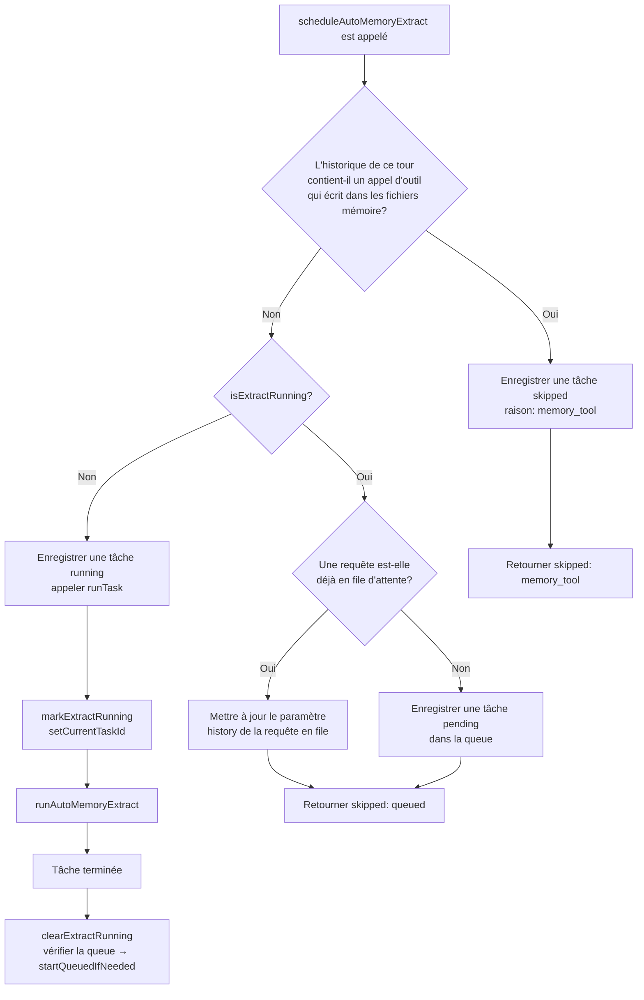
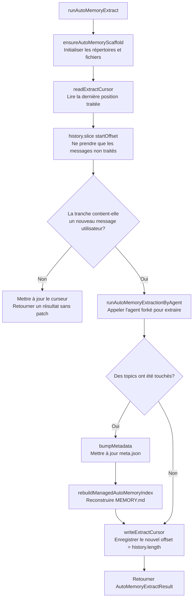
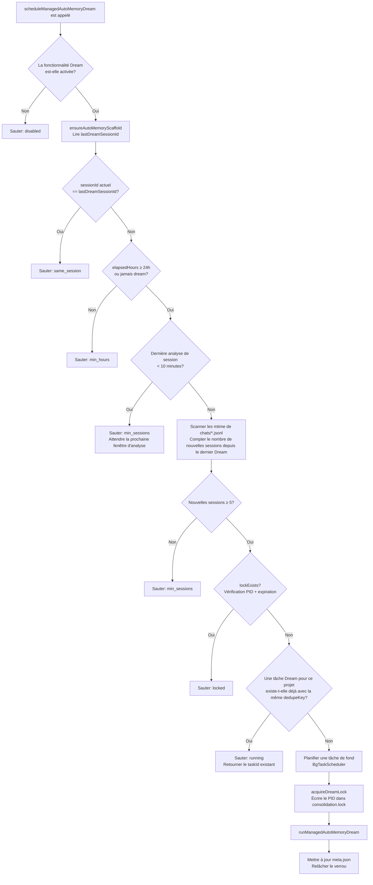
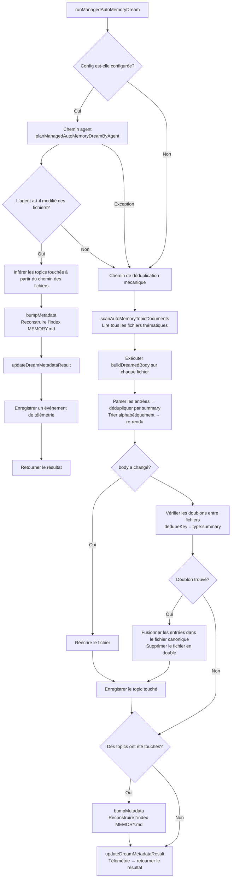
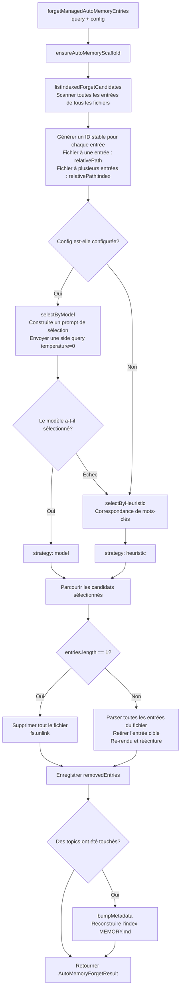

# Mémoire — Système de Gestion de la Mémoire

> Ce document présente le mécanisme de gestion de la mémoire **Managed Auto-Memory** (mémoire automatique gérée) de Qwen Code, ses déclencheurs et les détails d'implémentation.

---

## Table des matières

1. [Aperçu](#apercu)
2. [Structure de stockage](#structure-de-stockage)
3. [Types de mémoire](#types-de-memoire)
4. [Format des entrées mémoire](#format-des-entrees-memoire)
5. [Cycle de vie principal](#cycle-de-vie-principal)
6. [Extract — Extraction](#extract--extraction)
7. [Dream — Intégration](#dream--integration)
8. [Recall — Rappel](#recall--rappel)
9. [Forget — Oubli](#forget--oubli)
10. [Reconstruction d’index](#reconstruction-dindex)
11. [Télémétrie](#telemétrie)

---

## Aperçu

Managed Auto-Memory est un système de mémoire persistante qui **accumule**, **intègre** et **récupère** automatiquement les connaissances pertinentes sur l’utilisateur au fil des sessions de chat avec l’IA. Il maintient le cycle de vie de la mémoire via quatre opérations principales :

| Opération | Anglais   | Déclenchement                   | Rôle                                      |
| --------- | --------- | ------------------------------- | ----------------------------------------- |
| Extraction| Extract   | Automatique (après chaque tour) | Distiller de nouvelles connaissances à partir des logs de conversation et les écrire dans les fichiers mémoire |
| Intégration| Dream    | Automatique (tâche de fond périodique) | Dédupliquer, fusionner les fichiers mémoire pour rester propres |
| Rappel    | Recall    | Automatique (avant chaque tour) | Récupérer les mémoires pertinentes à la requête et les injecter dans le prompt système |
| Oubli     | Forget    | Manuel (commande `/forget`)     | Supprimer précisément une entrée mémoire spécifiée |

---

## Structure de stockage

### Organisation des répertoires

```
~/.qwen/                                      ← répertoire de base global (par défaut)
└── projects/
    └── <sanitized-git-root>/                 ← identifiant de projet (basé sur la racine Git)
        ├── meta.json                         ← métadonnées (horodatages extraction/intégration, état)
        ├── extract-cursor.json               ← curseur d’extraction (décalage de dialogue déjà traité)
        ├── consolidation.lock                ← verrou d’exclusion mutuelle pour le processus Dream
        └── memory/                           ← répertoire principal de la mémoire
            ├── MEMORY.md                     ← fichier d’index (généré automatiquement, résume toutes les entrées)
            ├── user.md                       ← mémoire des préférences utilisateur (exemple)
            ├── feedback.md                   ← mémoire des règles de feedback (exemple)
            ├── project/
            │   └── milestone.md              ← mémoire de projet (sous-répertoires possibles)
            └── reference/
                └── grafana.md                ← mémoire de ressource externe
```

> **Variables d’environnement de remplacement :**
>
> - `QWEN_CODE_MEMORY_BASE_DIR` : remplace le répertoire de base global
> - `QWEN_CODE_MEMORY_LOCAL=1` : utilise le chemin `.qwen/memory/` dans le projet

### Description des fichiers clés

| Fichier               | Description                                                                             |
| --------------------- | --------------------------------------------------------------------------------------- |
| `meta.json`           | Enregistre le dernier horodatage Extract / Dream, l’ID de session, les types de mémoire concernés, l’état d’exécution |
| `extract-cursor.json` | Enregistre le décalage de l’historique de dialogue déjà traité pour la session en cours, évite les extractions redondantes |
| `consolidation.lock`  | Verrou de fichier pendant l’exécution de Dream, contient le PID du processus, expire automatiquement après 1 heure |
| `MEMORY.md`           | Index de tous les fichiers thématiques, reconstruit après chaque Extract / Dream, formaté en liste Markdown |

---

## Types de mémoire

Le système prend en charge quatre types de mémoire intégrés, chacun correspondant à une dimension d’information différente :

| Type        | Contenu stocké                                       | Quand écrire                                                    | Quand lire                                                       |
| ----------- | ---------------------------------------------------- | --------------------------------------------------------------- | ---------------------------------------------------------------- |
| `user`      | Rôle, compétences, habitudes de travail de l’utilisateur | Quand on apprend le rôle / les préférences / le contexte de l’utilisateur | Quand la réponse doit être adaptée au profil de l’utilisateur   |
| `feedback`  | Directives sur le comportement de l’IA : ce qu’il faut éviter, continuer | Quand l’utilisateur corrige l’IA ou confirme une pratique non évidente | Quand le comportement de l’IA doit être influencé               |
| `project`   | Avancement du projet, objectifs, décisions, échéances, suivi de bugs | Quand on apprend qui fait quoi, pourquoi, date limite       | Quand l’IA doit comprendre le contexte et les motivations du travail |
| `reference` | Pointeurs vers des ressources système externes (tableaux de bord, systèmes de tickets, canaux Slack, etc.) | Quand on découvre une ressource externe et son but              | Quand l’utilisateur mentionne un système externe ou une info associée |

**Ce qui ne doit pas être stocké en mémoire** : modèles/conventions de code, historique Git, solutions de débogage, état de tâches temporaires, contenu déjà documenté dans `QWEN.md` / `AGENTS.md`.

---

## Format des entrées mémoire

Chaque fichier thématique utilise le format **YAML frontmatter + corps Markdown** :

```markdown
---
name: nom de la mémoire
description: description en une phrase (pour juger de la pertinence au rappel, doit être spécifique)
type: user|feedback|project|reference
---

Contenu principal de la mémoire (ligne de résumé)

Why: raison sous-jacente (permet à l’IA de comprendre les cas limites plutôt que de suivre aveuglément la règle)
How to apply: contexte et manière de l’appliquer
```

Pour les types `feedback` et `project`, il est fortement recommandé de renseigner `Why` et `How to apply` afin que la mémoire reste correctement appliquée dans les cas limites.

---

## Cycle de vie principal

```mermaid
flowchart TD
    A([Utilisateur envoie une requête]) --> B

    subgraph "Rappel (Recall)"
        B[Scanner tous les fichiers thématiques] --> C{Le nombre de documents\net le contenu de la requête\nsont-ils valides?}
        C -- Non --> D[Retourner un prompt vide\nstrategy: none]
        C -- Oui --> E{Config est-elle configurée?}
        E -- Oui --> F[Sélection par modèle\nside query]
        F --> G{Document(s) sélectionné(s)?}
        G -- Oui --> H[strategy: model]
        G -- Non --> I[strategy: none]
        E -- Non --> J[Score heuristique par mots-clés]
        F -- Échec --> J
        J --> K{Un document a un score > 0 ?}
        K -- Oui --> L[strategy: heuristic]
        K -- Non --> I
        H --> M[Construire le bloc "Relevant Memory"\net l'injecter dans le prompt système]
        L --> M
        I --> N[Ne pas injecter de mémoire]
    end

    M --> O([L'IA traite la requête])
    N --> O
    D --> O

    O --> P([L'IA renvoie la réponse])

    subgraph "Extraction (Extract) — arrière-plan"
        P --> Q{L'IA a-t-elle directement\nécrit dans un fichier mémoire\nlors de ce tour?}
        Q -- Oui --> R[Sauter\nmemory_tool]
        Q -- Non --> S{Une tâche d'extraction\nest-elle en cours?}
        S -- Oui --> T[Mettre en file d'attente ou sauter\nalready_running / queued]
        S -- Non --> U[Charger la tranche de dialogue non traitée\nbasée sur le curseur d'extraction]
        U --> V[Appeler l'agent d'extraction\nrunAutoMemoryExtractionByAgent]
        V --> W[Normaliser et dédupliquer les patches]
        W --> X{Des topics ont été touchés?}
        X -- Oui --> Y[Mettre à jour meta.json\nReconstruire l'index MEMORY.md]
        X -- Non --> Z[Mettre à jour uniquement le curseur d'extraction]
        Y --> Z
    end

    subgraph "Intégration (Dream) — arrière-plan, périodique"
        P --> AA{Vérification des conditions de déclenchement de Dream}
        AA --> AB{Même session?}
        AB -- Oui --> AC[Sauter\nsame_session]
        AB -- Non --> AD{Depuis le dernier Dream\n≥ 24 heures?}
        AD -- Non --> AE[Sauter\nmin_hours]
        AD -- Oui --> AF{Nombre de nouvelles sessions\ndepuis le dernier Dream ≥ 5?}
        AF -- Non --> AG[Sauter\nmin_sessions]
        AF -- Oui --> AH{consolidation.lock\nexiste-t-il?}
        AH -- Oui --> AI[Sauter\nlocked]
        AH -- Non --> AJ[Acquérir le verrou\nécrire le PID]
        AJ --> AK{Config est-elle configurée?}
        AK -- Oui --> AL[Chemin agent\nplanManagedAutoMemoryDreamByAgent]
        AL --> AM{L'agent a-t-il touché des fichiers?}
        AM -- Oui --> AN[Enregistrer les topics touchés]
        AM -- "Non/Échec" --> AO
        AK -- Non --> AO[Chemin de déduplication mécanique\nParser + dédupliquer + tri alphabétique]
        AO --> AP[Réécrire les fichiers thématiques mis à jour]
        AN --> AQ[Reconstruire l'index MEMORY.md\nMettre à jour meta.json]
        AP --> AQ
        AQ --> AR[Relâcher le verrou]
    end
```

---

## Extract — Extraction

### Déclenchement

Déclenché automatiquement après chaque réponse de l’IA par `scheduleAutoMemoryExtract` (arrière-plan non bloquant).

### Logique d’ordonnancement (`extractScheduler.ts`)



**Raisons de saut (skipped)** :

| Raison            | Signification                                                       |
| ----------------- | ------------------------------------------------------------------- |
| `memory_tool`     | L’agent principal a déjà écrit directement dans les fichiers mémoire ce tour, éviter les conflits |
| `already_running` | Une extraction est déjà en cours et ne peut pas être mise en file   |
| `queued`          | Une extraction est déjà en cours, la requête actuelle a été mise en file |

### Processus d’extraction principal (`extract.ts`)



> **Note :** La garde `isUnderMemoryPressure` se trouve dans `MemoryManager.runExtract()`, pas dans ce flux. Lorsque le moniteur signale une pression hard/critical, `MemoryManager` saute l’extraction et n’avance pas le curseur.

**Curseur d’extraction (Cursor)** :

- Champs : `{ sessionId, processedOffset, updatedAt }`
- Avant l’extraction, lire la progression actuelle avec `readExtractCursor`, puis ne traiter que la partie non lue via `history.slice(processedOffset)`
- Après chaque extraction, mettre à jour `processedOffset` avec la longueur actuelle de l’historique (`params.history.length`)
- En cas de changement de session (`sessionId` différent), repartir de l’offset 0
- Note : On ne construit plus de transcript via `buildTranscriptMessages` / `loadUnprocessedTranscriptSlice` — `hasNewUserMessages` est déterminé par `history.slice(startOffset).some(m => m.role === 'user' && partToString(m.parts).trim().length > 0)`, la sérialisation légère ne se fait que sur la tranche non lue, l’historique complet n’est plus traité

**Règles de filtrage des patches** :

- Résumé de moins de 12 caractères → rejeté
- Résumé se terminant par `?` → rejeté (phrase interrogative)
- Contenant des mots-clés temporaires (today/now/currently/temporary, etc.) → rejeté
- Combinaison `topic:summary` identique → dédoublonné

---

## Dream — Intégration

### Déclenchement

Déclenché automatiquement après chaque réponse de l’IA par `scheduleManagedAutoMemoryDream` (arrière-plan non bloquant). Mais protégé par plusieurs conditions de garde, il est souvent sauté.

### Conditions de déclenchement (`dreamScheduler.ts`)



**Paramètres des gardes** :

| Paramètre                    | Valeur par défaut | Description                                                 |
| ---------------------------- | ----------------- | ----------------------------------------------------------- |
| `minHoursBetweenDreams`      | 24 heures         | Intervalle minimal entre deux Dream                         |
| `minSessionsBetweenDreams`   | 5 sessions        | Nombre minimum de nouvelles sessions nécessaires pour déclencher Dream |
| `SESSION_SCAN_INTERVAL_MS`   | 10 minutes        | Intervalle de throttling pour l’analyse des fichiers de session |
| `DREAM_LOCK_STALE_MS`        | 1 heure           | Seuil après lequel le fichier de verrou est considéré expiré |

**Mécanisme de verrou** :

- Le verrou se trouve dans `<project-state-dir>/consolidation.lock`
- Contenu : le PID du processus qui le détient
- Vérification : si le processus du PID n’existe plus (`kill(pid, 0)` échoue) ou que le verrou a plus d’une heure → considéré comme expiré, nettoyé automatiquement

### Processus d’intégration (`dream.ts`)



**Logique de déduplication mécanique** :

1. Dans chaque fichier thématique : dédupliquer par `summary.toLowerCase()`, fusionner les champs `why` / `howToApply`
2. Re-tri alphabétique par summary
3. Entre fichiers : les entrées avec la même `type:summary` sont fusionnées dans le fichier découvert en premier, le fichier en double est supprimé

---

## Recall — Rappel

### Déclenchement

Avant que l’IA ne traite une requête utilisateur, `resolveRelevantAutoMemoryPromptForQuery` est déclenché automatiquement pour injecter les mémoires pertinentes dans le prompt système.

### Processus de rappel (`recall.ts`)

```mermaid
flowchart TD
    A[resolveRelevantAutoMemoryPromptForQuery] --> B[scanAutoMemoryTopicDocuments\nScanner tous les fichiers thématiques]
    B --> C[filterExcludedAutoMemoryDocuments\nFiltrer les fichiers déjà écrits lors de ce tour]
    C --> D{query vide\nou docs vides\nou limit <= 0?}
    D -- Oui --> E[Retourner un prompt vide\nstrategy: none]
    D -- Non --> F{Config est-elle configurée?}
    F -- Oui --> G[selectRelevantAutoMemoryDocumentsByModel\nEnvoyer une side query pour la sélection par modèle]
    G --> H{Le modèle a retourné des résultats?}
    H -- Documents --> I[strategy: model]
    H -- Aucun document --> J[strategy: none\nRetourner vide]
    G -- "Échec/Exception" --> K[Repli sur la sélection heuristique]
    F -- Non --> K
    K --> L[tokenize query\nExtraire les tokens ≥ 3 caractères]
    L --> M[scoreDocument\nCorrespondance de mots-clés +2 / mot-clé de type +1 / contenu non vide +1]
    M --> N[Filtrer les documents avec score=0\nTrier par score décroissant, prendre Top 5]
    N --> O{Des documents avec score > 0?}
    O -- Oui --> P[strategy: heuristic]
    O -- Non --> J
    I --> Q[buildRelevantAutoMemoryPrompt\nConstruire le bloc "Relevant Memory"]
    P --> Q
    Q --> R[Retourner le fragment de prompt à injecter dans le prompt système principal]
```

**Règles de score (heuristique)** :

| Condition                                           | Points supplémentaires |
| --------------------------------------------------- | ---------------------- |
| Un token de la requête apparaît dans le contenu du document | +2 (par token)         |
| Un token de la requête est un mot-clé caractéristique du type | +1 (par token)         |
| Le corps du document n’est pas vide                 | +1                     |

**Mots-clés caractéristiques par type** :

- `user` : user, preference, background, role, terse
- `feedback` : feedback, rule, avoid, style, summary
- `project` : project, goal, incident, deadline, release
- `reference` : reference, dashboard, ticket, docs, link

**Règles de construction du prompt** :

- Injecter au maximum 5 documents (`MAX_RELEVANT_DOCS`)
- Chaque document est tronqué à 1200 caractères (`MAX_DOC_BODY_CHARS`)
- Si tronqué, ajouter la note : "NOTE: Relevant memory truncated for prompt budget."
- Inclure l’information de fraîcheur du document (basée sur le mtime du fichier)

---

## Forget — Oubli

### Déclenchement

Déclenché manuellement par l’utilisateur via la commande `/forget <query>`.

### Processus d’oubli (`forget.ts`)



**Conception des ID d’entrée** :

- Fichier à une seule entrée (cas courant) : `relativePath` (ex. `feedback/no-summary.md`)
- Fichier à plusieurs entrées : `relativePath:index` (ex. `feedback/style.md:2`)
- Utiliser des ID stables permet au modèle de cibler précisément une entrée sans affecter les autres dans le même fichier

---

## Reconstruction d’index

`MEMORY.md` est l’index de navigation de tous les fichiers thématiques. Il est reconstruit après chaque Extract ou Dream via `rebuildManagedAutoMemoryIndex` :

```
- [Préférences utilisateur](user/preferences.md) — L’utilisateur est un ingénieur Go expérimenté, découvre React
- [Règles de feedback](feedback/style.md) — Réponses concises, pas de résumé final
- [Jalon projet](project/milestone.md) — Fenêtre de gel avant la branche de release mobile
```

**Limites de l’index** :

- Maximum 150 caractères par ligne (tronqué avec `…` si dépassé)
- Maximum 200 lignes
- Taille totale inférieure à 25 000 octets

---

## Télémétrie

Le système intègre trois catégories d’événements de télémétrie pour surveiller les performances et l’efficacité des opérations mémoire.

### Télémétrie Extract

| Champ            | Type                         | Description                              |
| ---------------- | ---------------------------- | ---------------------------------------- |
| `trigger`        | `'auto'`                     | Mode de déclenchement (actuellement auto uniquement) |
| `status`         | `'completed'` \| `'failed'`  | Résultat d’exécution                     |
| `patches_count`  | number                       | Nombre de patches valides extraits       |
| `touched_topics` | string[]                     | Liste des types de mémoire écrits        |
| `duration_ms`    | number                       | Durée totale (ms)                        |

### Télémétrie Dream

| Champ             | Type                                  | Description                              |
| ----------------- | ------------------------------------- | ---------------------------------------- |
| `trigger`         | `'auto'`                              | Mode de déclenchement                    |
| `status`          | `'updated'` \| `'noop'` \| `'failed'` | Résultat d’exécution                     |
| `deduped_entries` | number                                | Nombre d’entrées dédupliquées par la voie mécanique |
| `touched_topics`  | string[]                              | Liste des types de mémoire modifiés      |
| `duration_ms`     | number                                | Durée totale (ms)                        |

### Télémétrie Recall

| Champ           | Type                                   | Description                            |
| --------------- | -------------------------------------- | -------------------------------------- |
| `query_length`  | number                                 | Longueur de la chaîne de requête       |
| `docs_scanned`  | number                                 | Nombre total de documents scannés      |
| `docs_selected` | number                                 | Nombre de documents finalement injectés |
| `strategy`      | `'none'` \| `'heuristic'` \| `'model'` | Stratégie de sélection                 |
| `duration_ms`   | number                                 | Durée totale (ms)                      |

---

## Index des fichiers source associés

| Fichier                                                | Rôle                                                                                      |
| ------------------------------------------------------ | ----------------------------------------------------------------------------------------- |
| `packages/core/src/memory/types.ts`                    | Définitions de types : `AutoMemoryType`, `AutoMemoryMetadata`, `AutoMemoryExtractCursor` |
| `packages/core/src/memory/paths.ts`                    | Calcul des chemins : `getAutoMemoryRoot`, `isAutoMemPath`, helpers de chemins             |
| `packages/core/src/memory/store.ts`                    | Initialisation du scaffold : `ensureAutoMemoryScaffold`, lecture/écriture d’index et métadonnées |
| `packages/core/src/memory/scan.ts`                     | Scan des fichiers thématiques : `scanAutoMemoryTopicDocuments`, parsing du frontmatter   |
| `packages/core/src/memory/entries.ts`                  | Parsing et rendu des entrées : `parseAutoMemoryEntries`, `renderAutoMemoryBody`          |
| `packages/core/src/memory/extract.ts`                  | Logique principale d’extraction : `runAutoMemoryExtract`, gestion du curseur, déduplication des patches |
| `packages/core/src/memory/extractScheduler.ts`         | Ordonnanceur d’extraction : `ManagedAutoMemoryExtractRuntime`, file d’attente / machine à états d’exécution |
| `packages/core/src/memory/extractionAgentPlanner.ts`   | Agent d’extraction : `runAutoMemoryExtractionByAgent`                                     |
| `packages/core/src/memory/dream.ts`                    | Logique principale d’intégration : `runManagedAutoMemoryDream`, voie agent + déduplication mécanique |
| `packages/core/src/memory/dreamScheduler.ts`           | Ordonnanceur d’intégration : `ManagedAutoMemoryDreamRuntime`, vérification des gardes, gestion du verrou |
| `packages/core/src/memory/dreamAgentPlanner.ts`        | Agent d’intégration : `planManagedAutoMemoryDreamByAgent`                                 |
| `packages/core/src/memory/recall.ts`                   | Logique de rappel : `resolveRelevantAutoMemoryPromptForQuery`, double voie heuristique + modèle |
| `packages/core/src/memory/forget.ts`                   | Logique d’oubli : `forgetManagedAutoMemoryEntries`, génération des candidats + suppression précise |
| `packages/core/src/memory/indexer.ts`                  | Reconstruction d’index : `rebuildManagedAutoMemoryIndex`, `buildManagedAutoMemoryIndex`   |
| `packages/core/src/memory/prompt.ts`                   | Modèle de prompt système : description des types de mémoire, exemple de format, règles d’utilisation |
| `packages/core/src/memory/governance.ts`               | Type de suggestion de gouvernance : `AutoMemoryGovernanceSuggestionType`                   |
| `packages/core/src/memory/state.ts`                    | État d’exécution de l’extraction : `isExtractRunning`, `markExtractRunning`, `clearExtractRunning` |
| `packages/core/src/memory/memoryAge.ts`                | Description de fraîcheur : `memoryAge`, `memoryFreshnessText`                              |