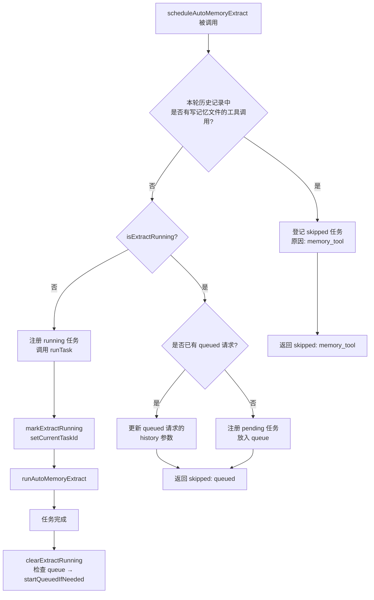
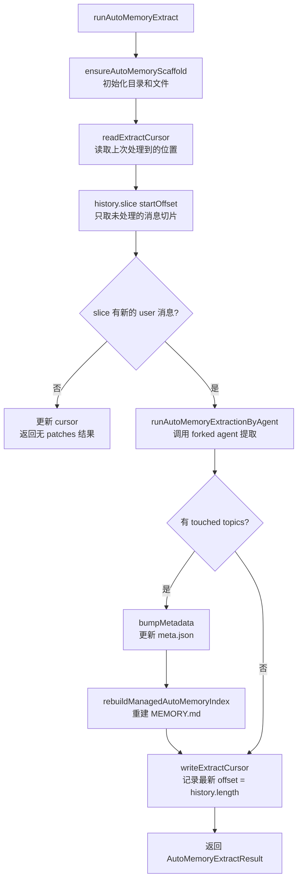
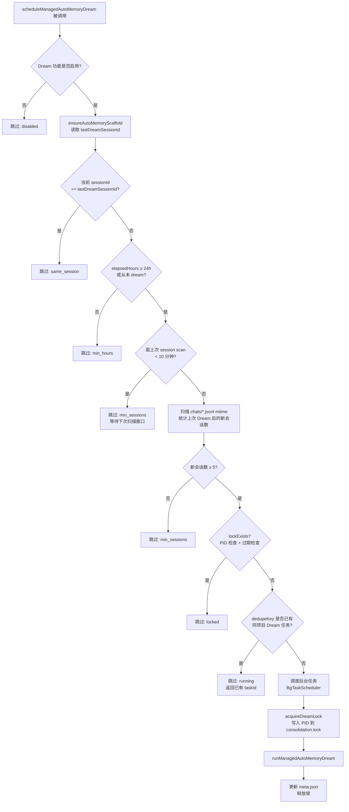
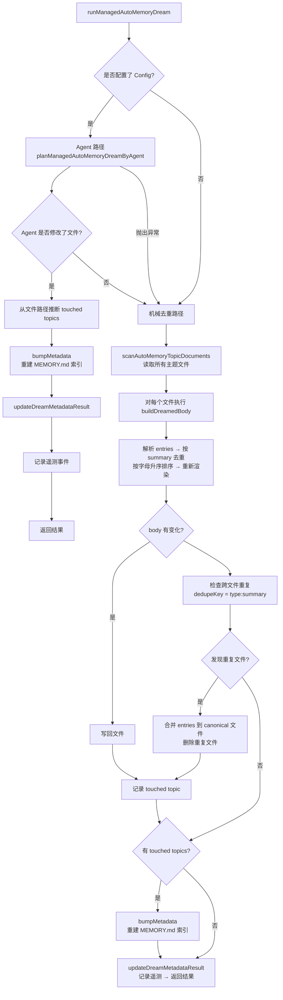
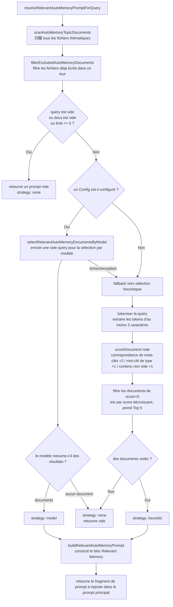
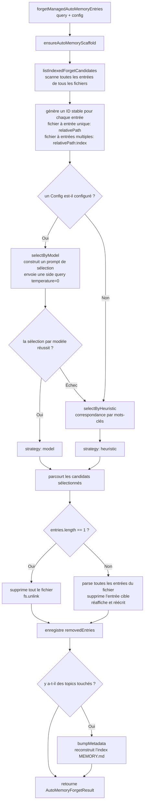

# Memory - Système de gestion de la mémoire

> Cet article présente le mécanisme de gestion de la mémoire **Managed Auto-Memory** (mémoire automatique gérée) de Qwen Code, ses déclencheurs et ses détails d'implémentation.

---

## Table des matières

1. [Vue d'ensemble](#vue-densemble)
2. [Structure de stockage](#structure-de-stockage)
3. [Types de mémoire](#types-de-mémoire)
4. [Format des entrées mémoire](#format-des-entrées-mémoire)
5. [Cycle de vie principal](#cycle-de-vie-principal)
6. [Extract — Extraction](#extract--extraction)
7. [Dream — Intégration](#dream--intégration)
8. [Recall — Rappel](#recall--rappel)
9. [Forget — Oubli](#forget--oubli)
10. [Reconstruction de l'index](#reconstruction-de-lindex)
11. [Télémétrie](#télémétrie)

---

## Vue d'ensemble

Managed Auto-Memory est un système de mémoire persistante qui **accumule**, intègre et récupère automatiquement les connaissances pertinentes de l'utilisateur au cours des sessions de dialogue avec l'IA. Il maintient le cycle de vie de la mémoire via quatre opérations principales :

| Opération | Anglais | Déclencheur                   | Rôle                                   |
| --------- | ------- | ----------------------------- | -------------------------------------- |
| Extraction| Extract | Automatique (après chaque tour)| Distille de nouvelles connaissances depuis l'historique de dialogue pour écrire dans les fichiers mémoire |
| Intégration| Dream  | Automatique (tâche de fond périodique) | Déduplication et fusion des fichiers mémoire pour rester propre |
| Rappel    | Recall  | Automatique (avant chaque tour)| Récupère les mémoires pertinentes pour la requête en cours et les injecte dans le prompt système |
| Oubli     | Forget  | Manuel (commande `/forget`) | Supprime précisément les entrées mémoire spécifiées |

---

## Structure de stockage

### Disposition des répertoires

```
~/.qwen/                                      ← Répertoire de base global (par défaut)
└── projects/
    └── <sanitized-git-root>/                 ← Identifiant du projet (basé sur la racine Git)
        ├── meta.json                         ← Métadonnées (horodatages d'extraction/intégration, état)
        ├── extract-cursor.json               ← Curseur d'extraction (décalage de dialogue déjà traité)
        ├── consolidation.lock                ← Verrou d'exclusion mutuelle pour le processus Dream
        └── memory/                           ← Répertoire principal de la mémoire
            ├── MEMORY.md                     ← Fichier d'index (généré automatiquement, récapitule toutes les entrées)
            ├── user.md                       ← Mémoire des préférences utilisateur (exemple)
            ├── feedback.md                   ← Mémoire des règles de feedback (exemple)
            ├── project/
            │   └── milestone.md              ← Mémoire de projet (supporte les sous-répertoires)
            └── reference/
                └── grafana.md                ← Mémoire de ressources externes
```

> **Variables d'environnement pour surcharge** :
>
> - `QWEN_CODE_MEMORY_BASE_DIR` : remplace le répertoire de base global
> - `QWEN_CODE_MEMORY_LOCAL=1` : utilise le chemin local `.qwen/memory/` dans le projet

### Description des fichiers clés

| Fichier                | Description                                                                   |
| ---------------------- | ----------------------------------------------------------------------------- |
| `meta.json`            | Enregistre le dernier horodatage d'Extract/Dream, l'ID de session, les types de mémoire concernés, l'état d'exécution |
| `extract-cursor.json`  | Enregistre jusqu'où l'historique de dialogue a été traité pour la session en cours, évite les extractions redondantes |
| `consolidation.lock`   | Verrou fichier lors de l'exécution de Dream, contient le PID du détenteur, expire automatiquement après 1 heure |
| `MEMORY.md`            | Index de tous les fichiers thématiques, reconstruit après chaque Extract/Dream, formaté en liste Markdown |

---

## Types de mémoire

Le système prend en charge quatre types de mémoire intégrés, chacun correspondant à une dimension d'information différente :

| Type         | Contenu stocké                                             | Quand écrire                                 | Quand lire                        |
| ------------ | ---------------------------------------------------------- | -------------------------------------------- | --------------------------------- |
| `user`       | Rôle, compétences, habitudes de travail de l'utilisateur   | Lorsque l'on apprend le rôle/préférence/contexte de connaissances de l'utilisateur | Lorsque la réponse doit être adaptée au contexte utilisateur |
| `feedback`   | Directives de l'utilisateur sur le comportement de l'IA : quoi éviter, quoi continuer | Lorsque l'utilisateur corrige l'IA ou confirme une action non évidente | Lorsque le comportement de l'IA doit être influencé |
| `project`    | Avancement, objectifs, décisions, échéances, suivi de bugs | Lorsque l'on apprend qui fait quoi, pourquoi, et jusqu'à quand | Lorsque l'IA doit comprendre le contexte et les motivations du travail |
| `reference`  | Pointeurs vers des ressources externes (Dashboard, système de tickets, canal Slack, etc.) | Lorsque l'on découvre une ressource externe et son usage | Lorsque l'utilisateur mentionne un système externe ou une information associée |

**Ce qui ne doit pas être stocké en mémoire** : conventions de code, historique Git, solutions de débogage, état de tâches temporaires, contenus déjà présents dans QWEN.md/AGENTS.md.

---

## Format des entrées mémoire

Chaque fichier thématique utilise le format **YAML frontmatter + Markdown body** :

```markdown
---
name: Nom de la mémoire
description: Description en une phrase (pour juger de la pertinence lors du rappel, être précis)
type: user|feedback|project|reference
---

Contenu principal de la mémoire (ligne de résumé)

Why: Raison sous-jacente (permet à l'IA de comprendre les cas limites sans appliquer aveuglément la règle)
How to apply: Scénarios d'application et mode d'emploi
```

Pour les types `feedback` et `project`, il est fortement recommandé de renseigner `Why` et `How to apply` afin que la mémoire soit correctement appliquée même dans les cas limites.

---

## Cycle de vie principal

```mermaid
flowchart TD
    A([L'utilisateur envoie une requête]) --> B

    subgraph "Rappel (Recall)"
        B[Scanne tous les fichiers thématiques] --> C{Le nombre de documents et\nle contenu de la requête sont-ils valides ?}
        C -- Non --> D[Retourne un prompt vide\nstrategy: none]
        C -- Oui --> E{Un Config est-il configuré ?}
        E -- Oui --> F[Sélection pilotée par modèle\nside query]
        F --> G{Des documents pertinents\nsélectionnés ?}
        G -- Oui --> H[strategy: model]
        G -- Non --> I[strategy: none]
        E -- Non --> J[Scoring heuristique par mots-clés]
        F -- Échec --> J
        J --> K{Document(s) avec score > 0 ?}
        K -- Oui --> L[strategy: heuristic]
        K -- Non --> I
        H --> M[Construction du prompt Relevant Memory\ninjection dans le prompt système]
        L --> M
        I --> N[Aucune injection de mémoire]
    end

    M --> O([L'IA traite la requête])
    N --> O
    D --> O

    O --> P([L'IA renvoie la réponse])

    subgraph "Extraction (Extract) – arrière-plan"
        P --> Q{L'IA a-t-elle directement\nécrit un fichier mémoire\nlors de ce tour ?}
        Q -- Oui --> R[Ignorer\nmemory_tool]
        Q -- Non --> S{Une tâche d'extraction\nest-elle en cours ?}
        S -- Oui --> T[Mise en file d'attente ou ignorée\nalready_running / queued]
        S -- Non --> U[Chargement des tranches de dialogue non traitées\nbasé sur le curseur d'extraction]
        U --> V[Appel de l'agent d'extraction\nrunAutoMemoryExtractionByAgent]
        V --> W[Déduplication et normalisation des patches]
        W --> X{Des sujets touchés ?}
        X -- Oui --> Y[Mise à jour de meta.json\nreconstruction de l'index MEMORY.md]
        X -- Non --> Z[Mise à jour du curseur d'extraction uniquement]
        Y --> Z
    end

    subgraph "Intégration (Dream) – arrière-plan, périodique"
        P --> AA{Vérification du déclencheur Dream}
        AA --> AB{Même session ?}
        AB -- Oui --> AC[Ignorer\nsame_session]
        AB -- Non --> AD{Dernier Dream\n≥ 24 heures ?}
        AD -- Non --> AE[Ignorer\nmin_hours]
        AD -- Oui --> AF{Nombre de nouvelles sessions\naprès dernier Dream ≥ 5 ?}
        AF -- Non --> AG[Ignorer\nmin_sessions]
        AF -- Oui --> AH{consolidation.lock\nexiste-t-il ?}
        AH -- Oui --> AI[Ignorer\nlocked]
        AH -- Non --> AJ[Acquisition du verrou\nécriture du PID]
        AJ --> AK{Un Config est-il configuré ?}
        AK -- Oui --> AL[Chemin piloté par l'agent\nplanManagedAutoMemoryDreamByAgent]
        AL --> AM{L'agent a-t-il touché des fichiers ?}
        AM -- Oui --> AN[Enregistrement des sujets touchés]
        AM -- Non/Échec --> AO
        AK -- Non --> AO[Chemin de déduplication mécanique\nAnalyse + déduplication + tri alphabétique]
        AO --> AP[Réécriture des fichiers thématiques mis à jour]
        AN --> AQ[Reconstruction de l'index MEMORY.md\nmise à jour de meta.json]
        AP --> AQ
        AQ --> AR[Libération du verrou]
    end
```
---

## Extract — Extraction

### Déclenchement

Chaque fois que l'IA termine un tour de réponse, déclenché automatiquement par `scheduleAutoMemoryExtract` (non bloquant en arrière-plan).

### Logique d'ordonnancement (`extractScheduler.ts`)



**Explication des raisons de saut** :

| Raison             | Signification                                                                 |
| ------------------ | ----------------------------------------------------------------------------- |
| `memory_tool`      | L'agent principal a déjà écrit directement un fichier mémoire dans cette itération, saut pour éviter les conflits. |
| `already_running`  | L'extraction est en cours et ne peut pas être mise en file d'attente.          |
| `queued`           | Une extraction est déjà en cours, cette demande a été mise en file d'attente. |

### Processus d'extraction principal (`extract.ts`)



> **Note :** La porte `isUnderMemoryPressure` se trouve dans `MemoryManager.runExtract()`, pas dans ce flux. Lorsque le moniteur signale une pression hard/critique, `MemoryManager` saute l'appel d'extraction et n'avance pas le curseur.

**Curseur d'extraction** :

- Champ : `{ sessionId, processedOffset, updatedAt }`
- Avant l'extraction, lire la progression actuelle via `readExtractCursor`, puis utiliser `history.slice(processedOffset)` pour ne traiter que la partie non lue.
- Après chaque extraction, mettre à jour `processedOffset` avec la longueur actuelle de l'historique (`params.history.length`).
- Lors du changement de session (`sessionId` différent), reprendre à l'offset 0.
- Note : On ne construit plus le texte de transcription via `buildTranscriptMessages` / `loadUnprocessedTranscriptSlice` – `hasNewUserMessages` est déterminé par `history.slice(startOffset).some(m => m.role === 'user' && partToString(m.parts).trim().length > 0)`, en ne traitant que la tranche non lue légèrement, l'historique complet n'est plus traité.

**Règles de filtrage des patches** :

- Longueur du résumé < 12 caractères → abandon
- Résumé se terminant par `?` → abandon (phrase interrogative)
- Contient des mots-clés temporaires (today/now/currently/temporary etc.) → abandon
- Même combinaison `topic:summary` → dédoublonnage

---

## Dream — Intégration

### Déclenchement

Chaque fois que l'IA termine un tour de réponse, déclenché automatiquement par `scheduleManagedAutoMemoryDream` (non bloquant en arrière-plan). Mais protégé par plusieurs conditions de contrôle, il est généralement ignoré.

### Contrôle d'ordonnancement (`dreamScheduler.ts`)



**Paramètres de contrôle** :

| Paramètre                  | Valeur par défaut | Description                                                                 |
| -------------------------- | ----------------- | --------------------------------------------------------------------------- |
| `minHoursBetweenDreams`    | 24 heures         | Intervalle minimum entre deux rêves (Dream)                                  |
| `minSessionsBetweenDreams` | 5 sessions        | Nombre minimum de nouvelles sessions nécessaires pour déclencher un Dream     |
| `SESSION_SCAN_INTERVAL_MS` | 10 minutes        | Intervalle de limitation de l'analyse des fichiers de session                |
| `DREAM_LOCK_STALE_MS`      | 1 heure           | Seuil de temps à partir duquel le fichier lock est considéré comme obsolète   |

**Mécanisme de verrou** :

- Le fichier lock se trouve à `<project-state-dir>/consolidation.lock`
- Le contenu est le PID du processus qui le détient.
- Lors de la vérification : si le processus PID n'existe plus (échec de `kill(pid, 0)`) ou si le lock est vieux de plus d'1 heure → considéré comme obsolète, effacé automatiquement.

### Processus d'exécution de l'intégration (`dream.ts`)



**Logique de dédoublonnage mécanique** :

1. Pour chaque fichier de sujet : dédoublonner par `summary.toLowerCase()`, fusionner les champs `why`/`howToApply`
2. Réordonner par ordre alphabétique de summary
3. Entre fichiers : les entrées avec la même combinaison `type:summary` sont fusionnées dans le premier fichier découvert, supprimer les fichiers dupliqués.
---

## Recall — Rappel

### Déclenchement

Avant chaque tour de traitement de la requête utilisateur par l’IA, `resolveRelevantAutoMemoryPromptForQuery` est automatiquement déclenché pour injecter les souvenirs pertinents dans le prompt système.

### Processus de rappel (`recall.ts`)



**Règles de notation (heuristique)** :

| Condition                                             | Bonus             |
| ---------------------------------------------------- | ----------------- |
| Un token de la query apparaît dans le contenu du document | +2 (par token)   |
| Un token de la query est un mot-clé caractéristique du type | +1 (par token)   |
| Le corps du document n’est pas vide                   | +1               |

**Mots-clés caractéristiques par type** :

- `user` : user, preference, background, role, terse
- `feedback` : feedback, rule, avoid, style, summary
- `project` : project, goal, incident, deadline, release
- `reference` : reference, dashboard, ticket, docs, link

**Règles de construction du prompt** :

- Au maximum 5 documents injectés (`MAX_RELEVANT_DOCS`)
- Chaque corps de document est tronqué à 1200 caractères (`MAX_DOC_BODY_CHARS`)
- En cas de troncature, un message est ajouté : "NOTE: Relevant memory truncated for prompt budget."
- Inclut l’information de fraîcheur du document (basée sur mtime du fichier)

---

## Forget — Oubli

### Déclenchement

Déclenché par la commande manuelle `/forget <query>` de l’utilisateur.

### Processus d’oubli (`forget.ts`)



**Conception des ID d’entrée** :

- Fichier à entrée unique (cas courant) : `relativePath` (ex. `feedback/no-summary.md`)
- Fichier à entrées multiples : `relativePath:index` (ex. `feedback/style.md:2`)
- Utilisation d’ID stables pour permettre au modèle de localiser précisément une entrée sans affecter les autres entrées du même fichier.

---

## Reconstruire l’index

`MEMORY.md` est l’index de navigation de tous les fichiers thématiques. Il est reconstruit après chaque Extract ou Dream via `rebuildManagedAutoMemoryIndex` :

```
- [User Preferences](user/preferences.md) — L’utilisateur est un ingénieur Go senior, découvre React pour la première fois
- [Feedback Rules](feedback/style.md) — Garder les réponses concises, pas de résumé final
- [Project Milestone](project/milestone.md) — Fenêtre de gel avant la ramification pour la release mobile
```

**Limites de l’index** :

- Maximum 150 caractères par ligne (tronqué avec `…` si dépassé)
- Maximum 200 lignes
- Taille totale maximale 25 000 octets

---

## Télémétrie intégrée

Le système intègre trois catégories d’événements de télémétrie pour surveiller les performances et l’efficacité des opérations mémoire :

### Télémétrie Extract

| Champ            | Type                          | Description                              |
| ---------------- | ----------------------------- | ---------------------------------------- |
| `trigger`        | `'auto'`                      | Mode de déclenchement (actuellement uniquement auto) |
| `status`         | `'completed'` \| `'failed'`   | Résultat de l’exécution                  |
| `patches_count`  | number                        | Nombre de correctifs extraits valides     |
| `touched_topics` | string[]                      | Liste des types de mémoire écrits        |
| `duration_ms`    | number                        | Durée totale en millisecondes            |

### Télémétrie Dream

| Champ              | Type                                    | Description                              |
| ------------------ | --------------------------------------- | ---------------------------------------- |
| `trigger`          | `'auto'`                                | Mode de déclenchement                    |
| `status`           | `'updated'` \| `'noop'` \| `'failed'`   | Résultat de l’exécution                  |
| `deduped_entries`  | number                                  | Nombre d’entrées dédupliquées mécaniquement |
| `touched_topics`   | string[]                                | Liste des types de mémoire modifiés      |
| `duration_ms`      | number                                  | Durée totale en millisecondes            |

### Télémétrie Recall

| Champ            | Type                                     | Description                              |
| ---------------- | ---------------------------------------- | ---------------------------------------- |
| `query_length`   | number                                   | Longueur de la chaîne de requête         |
| `docs_scanned`   | number                                   | Nombre total de documents scannés        |
| `docs_selected`  | number                                   | Nombre de documents finalement injectés  |
| `strategy`       | `'none'` \| `'heuristic'` \| `'model'`   | Stratégie de sélection                   |
| `duration_ms`    | number                                   | Durée totale en millisecondes            |

---

## Index des fichiers sources

| Fichier                                               | Responsabilité                                                                 |
| ---------------------------------------------------- | ------------------------------------------------------------------------------ |
| `packages/core/src/memory/types.ts`                  | Définitions de types : `AutoMemoryType`, `AutoMemoryMetadata`, `AutoMemoryExtractCursor` |
| `packages/core/src/memory/paths.ts`                  | Calcul de chemins : `getAutoMemoryRoot`, `isAutoMemPath`, helpers de chemins divers |
| `packages/core/src/memory/store.ts`                  | Initialisation du scaffold : `ensureAutoMemoryScaffold`, lecture/écriture d’index/métadonnées |
| `packages/core/src/memory/scan.ts`                   | Scan des fichiers thématiques : `scanAutoMemoryTopicDocuments`, parsing du frontmatter |
| `packages/core/src/memory/entries.ts`                | Analyse et rendu des entrées : `parseAutoMemoryEntries`, `renderAutoMemoryBody` |
| `packages/core/src/memory/extract.ts`                | Logique centrale d’extraction : `runAutoMemoryExtract`, gestion du curseur, déduplication de correctifs |
| `packages/core/src/memory/extractScheduler.ts`       | Ordonnanceur d’extraction : `ManagedAutoMemoryExtractRuntime`, file/machine à états d’exécution |
| `packages/core/src/memory/extractionAgentPlanner.ts` | Agent d’extraction : `runAutoMemoryExtractionByAgent`                          |
| `packages/core/src/memory/dream.ts`                  | Logique centrale d’intégration : `runManagedAutoMemoryDream`, chemin Agent + déduplication mécanique |
| `packages/core/src/memory/dreamScheduler.ts`         | Ordonnanceur d’intégration : `ManagedAutoMemoryDreamRuntime`, vérifications de garde, gestion de verrou |
| `packages/core/src/memory/dreamAgentPlanner.ts`      | Agent d’intégration : `planManagedAutoMemoryDreamByAgent`                      |
| `packages/core/src/memory/recall.ts`                 | Logique de rappel : `resolveRelevantAutoMemoryPromptForQuery`, double chemin heuristique + modèle |
| `packages/core/src/memory/forget.ts`                 | Logique d’oubli : `forgetManagedAutoMemoryEntries`, génération de candidats + suppression précise |
| `packages/core/src/memory/indexer.ts`                | Reconstruction de l’index : `rebuildManagedAutoMemoryIndex`, `buildManagedAutoMemoryIndex` |
| `packages/core/src/memory/prompt.ts`                 | Template de prompt système : description des types mémoire, exemples de format, bonnes pratiques |
| `packages/core/src/memory/governance.ts`             | Types de suggestions de gouvernance : `AutoMemoryGovernanceSuggestionType`      |
| `packages/core/src/memory/state.ts`                  | État d’exécution de l’extraction : `isExtractRunning`, `markExtractRunning`, `clearExtractRunning` |
| `packages/core/src/memory/memoryAge.ts`              | Description de fraîcheur : `memoryAge`, `memoryFreshnessText`                  |
