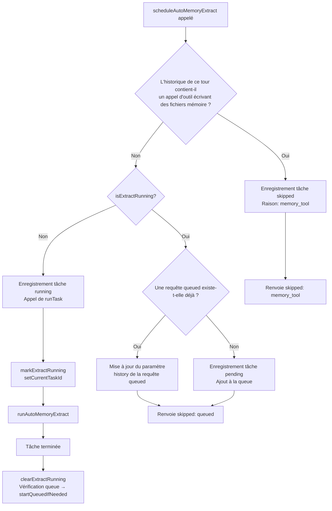
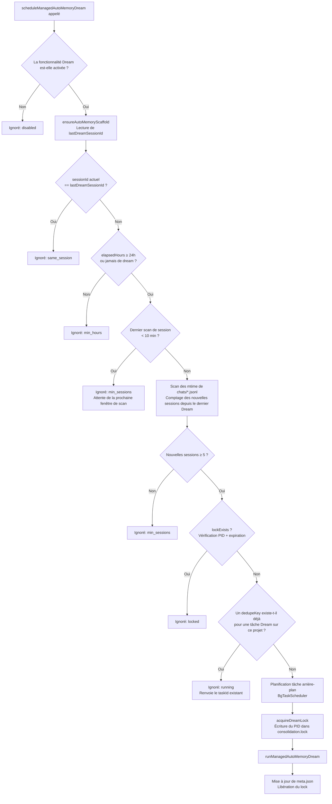
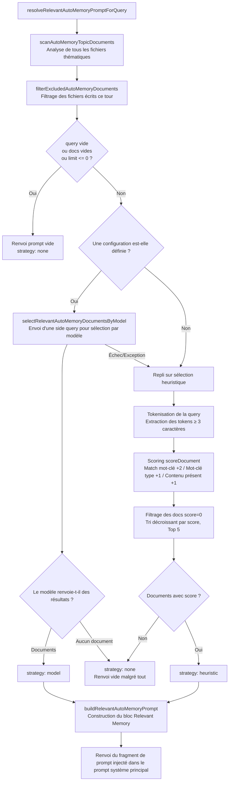

# Système de gestion de la mémoire

> Ce document détaille le mécanisme de gestion de la mémoire, les conditions de déclenchement et les détails d'implémentation de **Managed Auto-Memory** (mémoire automatique managée) dans Qwen Code.

---

## Table des matières

1. [Vue d'ensemble](#概述)
2. [Structure de stockage](#存储结构)
3. [Types de mémoire](#记忆类型)
4. [Format des entrées de mémoire](#记忆条目格式)
5. [Cycle de vie principal](#核心生命周期)
6. [Extract — Extraction](#extract--提取)
7. [Dream — Consolidation](#dream--整合)
8. [Recall — Rappel](#recall--召回)
9. [Forget — Oubli](#forget--遗忘)
10. [Reconstruction de l'index](#索引重建)
11. [Télémétrie](#遥测埋点)

---

## Vue d'ensemble

Managed Auto-Memory est un système de mémoire persistante qui accumule, consolide et récupère **automatiquement** les connaissances liées à l'utilisateur pendant les sessions IA. Il maintient le cycle de vie de la mémoire via quatre opérations principales :

| Opération | Terme anglais | Déclenchement | Rôle |
| ---- | ------- | -------------------------- | -------------------------------------- |
| Extraction | Extract | Automatique (après chaque tour de conversation) | Extrait les nouvelles connaissances des échanges et les écrit dans les fichiers de mémoire |
| Consolidation | Dream | Automatique (tâche de fond périodique) | Déduplique et fusionne les fichiers de mémoire pour les garder propres |
| Rappel | Recall | Automatique (avant chaque tour de conversation) | Récupère les mémoires pertinentes pour la requête actuelle et les injecte dans le prompt système |
| Oubli | Forget | Manuel (commande utilisateur `/forget`) | Supprime précisément les entrées de mémoire spécifiées |

---

## Structure de stockage

### Arborescence des répertoires

```
~/.qwen/                                      ← Répertoire de base global (par défaut)
└── projects/
    └── <sanitized-git-root>/                 ← Identifiant du projet (basé sur le chemin racine Git)
        ├── meta.json                         ← Métadonnées (horodatages extraction/consolidation, état)
        ├── extract-cursor.json               ← Curseur d'extraction (offset des conversations traitées)
        ├── consolidation.lock                ← Mutex pour le processus Dream
        └── memory/                           ← Répertoire principal de la mémoire
            ├── MEMORY.md                     ← Fichier d'index (généré automatiquement, résume toutes les entrées)
            ├── user.md                       ← Mémoire des préférences utilisateur (exemple)
            ├── feedback.md                   ← Mémoire des règles de feedback (exemple)
            ├── project/
            │   └── milestone.md              ← Mémoire du projet (sous-répertoires pris en charge)
            └── reference/
                └── grafana.md                ← Mémoire des ressources externes
```

> **Remplacement par variable d'environnement** :
>
> - `QWEN_CODE_MEMORY_BASE_DIR` : remplace le répertoire de base global
> - `QWEN_CODE_MEMORY_LOCAL=1` : utilise le chemin relatif au projet `.qwen/memory/`

### Description des fichiers clés

| Fichier | Description |
| --------------------- | ---------------------------------------------------------------------- |
| `meta.json` | Enregistre l'heure, l'ID de session, les types de mémoire concernés et l'état d'exécution du dernier Extract / Dream |
| `extract-cursor.json` | Enregistre l'offset de l'historique de conversation déjà traité pour éviter les extractions en double |
| `consolidation.lock` | Fichier de verrou pendant l'exécution de Dream, contient le PID du détenteur, expire automatiquement après 1 heure |
| `MEMORY.md` | Index de tous les fichiers thématiques, reconstruit après chaque Extract/Dream, formaté en liste Markdown |

---

## Types de mémoire

Le système prend en charge quatre types de mémoire intégrés, chacun correspondant à une dimension d'information différente :

| Type | Contenu stocké | Écriture | Lecture |
| ----------- | ----------------------------------------------------- | ---------------------------------------- | ---------------------------- |
| `user` | Rôle, compétences, habitudes de travail de l'utilisateur | Lorsque le rôle/les préférences/le contexte de l'utilisateur sont identifiés | Lorsque la réponse doit être adaptée au contexte de l'utilisateur |
| `feedback` | Directives de l'utilisateur sur le comportement de l'IA : quoi éviter, quoi continuer | Lorsque l'utilisateur corrige l'IA ou valide une approche non évidente | Lorsque cela influence la manière dont l'IA doit se comporter |
| `project` | Avancement, objectifs, décisions, échéances, suivi de bugs du projet | Lorsque l'on sait qui fait quoi, pourquoi et pour quand | Pour aider l'IA à comprendre le contexte et les motivations du travail |
| `reference` | Pointeurs vers des ressources externes (Dashboard, système de tickets, canal Slack, etc.) | Lorsqu'une ressource externe et son utilité sont identifiées | Lorsque l'utilisateur mentionne un système externe ou des informations connexes |

**Contenu à ne pas stocker en mémoire** : conventions/modes de code, historique Git, stratégies de débogage, états de tâches temporaires, contenu déjà documenté dans `QWEN.md`/`AGENTS.md`.

---

## Format des entrées de mémoire

Chaque fichier thématique utilise le format **YAML frontmatter + corps Markdown** :

```markdown
---
name: Nom de la mémoire
description: Description en une phrase (utilisée pour évaluer la pertinence du rappel, doit être précise)
type: user|feedback|project|reference
---

Contenu principal de la mémoire (ligne summary)

Why: Raison sous-jacente (permet à l'IA de comprendre les cas limites au lieu de suivre aveuglément les règles)
How to apply: Contextes d'application et méthode d'utilisation
```

Pour les types `feedback` et `project`, il est fortement recommandé de remplir `Why` et `How to apply` afin que la mémoire reste applicable même dans des cas limites.

---

## Cycle de vie principal

```mermaid
flowchart TD
    A([L'utilisateur envoie une requête]) --> B

    subgraph "Rappel (Recall)"
        B[Analyse de tous les fichiers thématiques] --> C{Le nombre de documents et\nle contenu de la requête sont-ils valides ?}
        C -- Non --> D[Renvoie un prompt vide\nstrategy: none]
        C -- Oui --> E{Une configuration est-elle définie ?}
        E -- Oui --> F[Sélection pilotée par le modèle\nside query]
        F --> G{Documents pertinents sélectionnés ?}
        G -- Oui --> H[strategy: model]
        G -- Non --> I[strategy: none]
        E -- Non --> J[Scoring heuristique par mots-clés]
        F -- Échec --> J
        J --> K{Documents avec score > 0 ?}
        K -- Oui --> L[strategy: heuristic]
        K -- Non --> I
        H --> M[Construction du prompt Relevant Memory\nInjection dans le prompt système]
        L --> M
        I --> N[Aucune mémoire injectée]
    end

    M --> O([L'IA traite la requête])
    N --> O
    D --> O

    O --> P([L'IA renvoie la réponse])

    subgraph "Extraction (Extract) (arrière-plan)"
        P --> Q{L'IA a-t-elle directement\nécrit des fichiers mémoire ce tour ?}
        Q -- Oui --> R[Ignoré\nmemory_tool]
        Q -- Non --> S{La tâche d'extraction\nest-elle en cours ?}
        S -- Oui --> T[Mis en file d'attente ou ignoré\nalready_running / queued]
        S -- Non --> U[Chargement du segment de conversation non traité\nbasé sur extract cursor]
        U --> V[Appel de l'agent d'extraction\nrunAutoMemoryExtractionByAgent]
        V --> W[Déduplication et normalisation des patches]
        W --> X{Sujets modifiés (touched topics) ?}
        X -- Oui --> Y[Mise à jour de meta.json\nReconstruction de l'index MEMORY.md]
        X -- Non --> Z[Mise à jour uniquement du extract cursor]
        Y --> Z
    end

    subgraph "Consolidation Dream (arrière-plan, périodique)"
        P --> AA{Vérification des garde-fous du planificateur Dream}
        AA --> AB{Même session ?}
        AB -- Oui --> AC[Ignoré\nsame_session]
        AB -- Non --> AD{Dernier Dream\n≥ 24h ?}
        AD -- Non --> AE[Ignoré\nmin_hours]
        AD -- Oui --> AF{Nouvelles sessions depuis le dernier Dream\n≥ 5 ?}
        AF -- Non --> AG[Ignoré\nmin_sessions]
        AF -- Oui --> AH{consolidation.lock\nexiste-t-il ?}
        AH -- Oui --> AI[Ignoré\nlocked]
        AH -- Non --> AJ[Acquisition du lock\nÉcriture du PID]
        AJ --> AK{Une configuration est-elle définie ?}
        AK -- Oui --> AL[Chemin Agent\nplanManagedAutoMemoryDreamByAgent]
        AL --> AM{L'agent a-t-il modifié des fichiers ?}
        AM -- Oui --> AN[Enregistrement des sujets modifiés]
        AM -- "Non/Échec" --> AO
        AK -- Non --> AO[Chemin de déduplication mécanique\nAnalyse + déduplication + tri alphabétique]
        AO --> AP[Écriture des fichiers thématiques mis à jour]
        AN --> AQ[Reconstruction de l'index MEMORY.md\nMise à jour de meta.json]
        AP --> AQ
        AQ --> AR[Libération du lock]
    end
```

---

## Extract — Extraction

### Conditions de déclenchement

Déclenché automatiquement (arrière-plan non bloquant) par `scheduleAutoMemoryExtract` après chaque réponse de l'IA.

### Logique de planification (`extractScheduler.ts`)



**Explication des raisons d'ignorage** :

| Raison | Signification |
| ----------------- | ----------------------------------------------- |
| `memory_tool` | L'agent principal a déjà écrit directement des fichiers mémoire ce tour, ignoré pour éviter les conflits |
| `already_running` | L'extraction est en cours et ne peut pas être mise en file d'attente |
| `queued` | Une extraction est déjà en cours, cette requête a été mise en file d'attente |

### Flux d'extraction principal (`extract.ts`)

```mermaid
flowchart TD
    A[runAutoMemoryExtract] --> B[ensureAutoMemoryScaffold\nInitialisation des répertoires et fichiers]
    B --> C[buildTranscriptMessages\nConversion de Content[] en liste de messages avec offset]
    C --> D[readExtractCursor\nLecture de la dernière position traitée]
    D --> E[loadUnprocessedTranscriptSlice\nExtraction du segment de messages non traité]
    E --> F{Le slice est-il vide ?}
    F -- Oui --> G[Renvoie un résultat sans patches]
    F -- Non --> H[runAutoMemoryExtractionByAgent\nAppel de l'agent forké pour extraire les patches]
    H --> I[dedupeExtractPatches\nDéduplication + normalisation]
    I --> J{Sujets modifiés (touched topics) ?}
    J -- Oui --> K[bumpMetadata\nMise à jour de meta.json]
    K --> L[rebuildManagedAutoMemoryIndex\nReconstruction de MEMORY.md]
    L --> M[writeExtractCursor\nEnregistrement du dernier offset]
    J -- Non --> M
    M --> N[Renvoie AutoMemoryExtractResult]
```

**Curseur d'extraction (Cursor)** :

- Champs : `{ sessionId, processedOffset, updatedAt }`
- `processedOffset` est mis à jour avec la longueur actuelle de l'historique après chaque extraction
- Lors de la prochaine extraction, seuls les messages avec `offset >= processedOffset` sont traités
- En cas de changement de session (`sessionId` modifié), le traitement reprend à l'offset 0

**Règles de filtrage des patches** :

- Résumé de moins de 12 caractères → ignoré
- Résumé se terminant par `?` → ignoré (phrase interrogative)
- Contient des mots-clés temporaires (today/now/currently/temporary, etc.) → ignoré
- Combinaison `topic:summary` identique → dédupliqué

---

## Dream — Consolidation

### Conditions de déclenchement

Déclenché automatiquement (arrière-plan non bloquant) par `scheduleManagedAutoMemoryDream` après chaque réponse de l'IA. Protégé par plusieurs garde-fous, il est ignoré dans la plupart des cas.

### Garde-fous de planification (`dreamScheduler.ts`)



**Paramètres des garde-fous** :

| Paramètre | Valeur par défaut | Description |
| -------------------------- | -------- | ----------------------------- |
| `minHoursBetweenDreams` | 24 heures | Intervalle minimum entre deux Dream |
| `minSessionsBetweenDreams` | 5 sessions | Nombre minimum de nouvelles sessions requis pour déclencher un Dream |
| `SESSION_SCAN_INTERVAL_MS` | 10 minutes | Intervalle de throttling pour le scan des fichiers de session |
| `DREAM_LOCK_STALE_MS` | 1 heure | Seuil d'expiration du fichier lock |

**Mécanisme de verrouillage** :

- Le fichier lock se trouve dans `<project-state-dir>/consolidation.lock`
- Contient le PID du processus détenteur
- Vérification : si le processus PID n'existe plus (`kill(pid, 0)` échoue) ou si le lock a plus d'1 heure → considéré comme expiré, supprimé automatiquement

### Flux d'exécution de la consolidation (`dream.ts`)

```mermaid
flowchart TD
    A[runManagedAutoMemoryDream] --> B{Une configuration est-elle définie ?}
    B -- Oui --> C[Chemin Agent\nplanManagedAutoMemoryDreamByAgent]
    C --> D{L'agent a-t-il modifié des fichiers ?}
    D -- Oui --> E[Inférence des touched topics depuis les chemins de fichiers]
    E --> F[bumpMetadata\nReconstruction de l'index MEMORY.md]
    F --> G[updateDreamMetadataResult]
    G --> H[Enregistrement de l'événement de télémétrie]
    H --> I[Renvoi du résultat]
    B -- Non --> J[Chemin de déduplication mécanique]
    C -- Exception --> J
    D -- Non --> J

    J --> K[scanAutoMemoryTopicDocuments\nLecture de tous les fichiers thématiques]
    K --> L[Exécution de buildDreamedBody pour chaque fichier]
    L --> M[Analyse des entries → déduplication par summary\nTri alphabétique ascendant → nouveau rendu]
    M --> N{Le body a-t-il changé ?}
    N -- Oui --> O[Écriture dans le fichier]
    O --> P[Enregistrement du sujet modifié]
    N --> Q[Vérification des doublons inter-fichiers\ndedupeKey = type:summary]
    Q --> R{Fichiers en double détectés ?}
    R -- Oui --> S[Merge des entries dans le fichier canonical\nSuppression des fichiers en double]
    S --> P
    R -- Non --> T{Sujets modifiés (touched topics) ?}
    P --> T
    T -- Oui --> U[bumpMetadata\nReconstruction de l'index MEMORY.md]
    U --> V[updateDreamMetadataResult\nEnregistrement télémétrie → renvoi résultat]
    T -- Non --> V
```

**Logique de déduplication mécanique** :

1. Pour chaque fichier thématique : déduplication par `summary.toLowerCase()`, fusion des champs `why`/`howToApply`
2. Retri par ordre alphabétique des summaries
3. Inter-fichiers : les entries avec le même `type:summary` sont fusionnées dans le premier fichier détecté, les fichiers en double sont supprimés

---

## Recall — Rappel

### Conditions de déclenchement

Déclenché automatiquement par `resolveRelevantAutoMemoryPromptForQuery` avant que l'IA ne traite la requête de l'utilisateur, pour injecter les mémoires pertinentes dans le prompt système.

### Flux de rappel (`recall.ts`)



**Règles de scoring (heuristique)** :

| Condition | Points |
| -------------------------------- | ---------------- |
| Token de la query présent dans le contenu du document | +2 (par token) |
| Token de la query est un mot-clé caractéristique du type | +1 (par token) |
| Body du document non vide | +1 |

**Mots-clés caractéristiques par type** :

- `user` : user, preference, background, role, terse
- `feedback` : feedback, rule, avoid, style, summary
- `project` : project, goal, incident, deadline, release
- `reference` : reference, dashboard, ticket, docs, link

**Règles de construction du Prompt** :

- Maximum 5 documents injectés (`MAX_RELEVANT_DOCS`)
- Body de chaque document tronqué à 1200 caractères (`MAX_DOC_BODY_CHARS`)
- En cas de troncature, ajout de la mention : "NOTE: Relevant memory truncated for prompt budget."
- Inclut les informations de fraîcheur du document (basées sur le mtime du fichier)

---

## Forget — Oubli

### Conditions de déclenchement

Déclenché manuellement par l'utilisateur via la commande `/forget <query>`.

### Flux d'oubli (`forget.ts`)

```mermaid
flowchart TD
    A[forgetManagedAutoMemoryEntries\nquery + config] --> B[ensureAutoMemoryScaffold]
    B --> C[listIndexedForgetCandidates\nScan de toutes les entries de tous les fichiers]
    C --> D[Génération d'un ID stable pour chaque entry\nFichier single entry: relativePath\nFichier multi-entry: relativePath:index]
    D --> E{Une configuration est-elle définie ?}
    E -- Oui --> F[selectByModel\nConstruction du prompt de sélection\nEnvoi side query temperature=0]
    F --> G{Sélection par modèle réussie ?}
    G -- Oui --> H[strategy: model]
    G -- Échec --> I[selectByHeuristic\nMatch par mots-clés]
    E -- Non --> I
    I --> J[strategy: heuristic]
    H --> K[Parcours des candidates sélectionnées]
    J --> K
    K --> L{entries.length == 1?}
    L -- Oui --> M[Suppression du fichier entier\nfs.unlink]
    L -- Non --> N[Analyse de toutes les entries du fichier\nSuppression de l'entry cible\nNouveau rendu et réécriture]
    M --> O[Enregistrement des removedEntries]
    N --> O
    O --> P{Sujets modifiés (touched topics) ?}
    P -- Oui --> Q[bumpMetadata\nReconstruction de l'index MEMORY.md]
    P --> R[Renvoi de AutoMemoryForgetResult]
    Q --> R
```

**Conception des Entry ID** :

- Fichier à entrée unique (cas courant) : `relativePath` (ex. `feedback/no-summary.md`)
- Fichier à entrées multiples : `relativePath:index` (ex. `feedback/style.md:2`)
- L'utilisation d'ID stables permet au modèle de cibler précisément une entrée sans affecter les autres entrées du même fichier

---

## Reconstruction de l'index

`MEMORY.md` est l'index de navigation de tous les fichiers thématiques. Il est reconstruit après chaque Extract ou Dream via `rebuildManagedAutoMemoryIndex` :

```
- [Préférences utilisateur](user/preferences.md) — L'utilisateur est un ingénieur Go senior, découvre React
- [Règles de feedback](feedback/style.md) — Garder les réponses concises, pas de résumé en fin de message
- [Jalons du projet](project/milestone.md) — Fenêtre de gel avant merge pour la release mobile
```

**Limites de l'index** :

- Maximum 150 caractères par ligne (tronqué avec `…` si dépassé)
- Maximum 200 lignes
- Taille totale ne dépassant pas 25 000 octets

---

## Télémétrie

Le système intègre trois types d'événements de télémétrie pour surveiller les performances et l'efficacité des opérations de mémoire :

### Télémétrie Extract

| Champ | Type | Description |
| ---------------- | --------------------------- | ----------------------- |
| `trigger` | `'auto'` | Mode de déclenchement (actuellement uniquement automatique) |
| `status` | `'completed'` \| `'failed'` | Résultat de l'exécution |
| `patches_count` | number | Nombre de patches valides extraits |
| `touched_topics` | string[] | Liste des types de mémoire modifiés |
| `duration_ms` | number | Durée totale (millisecondes) |

### Télémétrie Dream

| Champ | Type | Description |
| ----------------- | ------------------------------------- | ---------------------- |
| `trigger` | `'auto'` | Mode de déclenchement |
| `status` | `'updated'` \| `'noop'` \| `'failed'` | Résultat de l'exécution |
| `deduped_entries` | number | Nombre d'entrées dédupliquées (chemin mécanique) |
| `touched_topics` | string[] | Liste des types de mémoire modifiés |
| `duration_ms` | number | Durée totale (millisecondes) |

### Télémétrie Recall

| Champ | Type | Description |
| --------------- | -------------------------------------- | ---------------- |
| `query_length` | number | Longueur de la chaîne de requête |
| `docs_scanned` | number | Nombre total de documents analysés |
| `docs_selected` | number | Nombre final de documents injectés |
| `strategy` | `'none'` \| `'heuristic'` \| `'model'` | Stratégie de sélection |
| `duration_ms` | number | Durée totale (millisecondes) |

---

## Index des fichiers sources

| Fichier | Responsabilité |
| ---------------------------------------------------- | ----------------------------------------------------------------------------- |
| `packages/core/src/memory/types.ts` | Définitions de types : `AutoMemoryType`, `AutoMemoryMetadata`, `AutoMemoryExtractCursor` |
| `packages/core/src/memory/paths.ts` | Calcul de chemins : `getAutoMemoryRoot`, `isAutoMemPath`, helpers pour divers chemins de fichiers |
| `packages/core/src/memory/store.ts` | Initialisation du scaffolding : `ensureAutoMemoryScaffold`, lecture/écriture index/métadonnées |
| `packages/core/src/memory/scan.ts` | Scan des fichiers thématiques : `scanAutoMemoryTopicDocuments`, analyse du frontmatter |
| `packages/core/src/memory/entries.ts` | Analyse et rendu des entrées : `parseAutoMemoryEntries`, `renderAutoMemoryBody` |
| `packages/core/src/memory/extract.ts` | Logique principale d'extraction : `runAutoMemoryExtract`, gestion du curseur, déduplication des patches |
| `packages/core/src/memory/extractScheduler.ts` | Planificateur d'extraction : `ManagedAutoMemoryExtractRuntime`, file d'attente/machine d'états d'exécution |
| `packages/core/src/memory/extractionAgentPlanner.ts` | Agent d'extraction : `runAutoMemoryExtractionByAgent` |
| `packages/core/src/memory/dream.ts` | Logique principale de consolidation : `runManagedAutoMemoryDream`, chemin Agent + déduplication mécanique |
| `packages/core/src/memory/dreamScheduler.ts` | Planificateur de consolidation : `ManagedAutoMemoryDreamRuntime`, vérification des garde-fous, gestion des locks |
| `packages/core/src/memory/dreamAgentPlanner.ts` | Agent de consolidation : `planManagedAutoMemoryDreamByAgent` |
| `packages/core/src/memory/recall.ts` | Logique de rappel : `resolveRelevantAutoMemoryPromptForQuery`, double chemin heuristique + modèle |
| `packages/core/src/memory/forget.ts` | Logique d'oubli : `forgetManagedAutoMemoryEntries`, génération de candidats + suppression précise |
| `packages/core/src/memory/indexer.ts` | Reconstruction d'index : `rebuildManagedAutoMemoryIndex`, `buildManagedAutoMemoryIndex` |
| `packages/core/src/memory/prompt.ts` | Templates de prompt système : description des types de mémoire, exemples de format, règles d'utilisation |
| `packages/core/src/memory/governance.ts` | Types de suggestions de gouvernance : `AutoMemoryGovernanceSuggestionType` |
| `packages/core/src/memory/state.ts` | État d'exécution de l'extraction : `isExtractRunning`, `markExtractRunning`, `clearExtractRunning` |
| `packages/core/src/memory/memoryAge.ts` | Description de la fraîcheur : `memoryAge`, `memoryFreshnessText` |