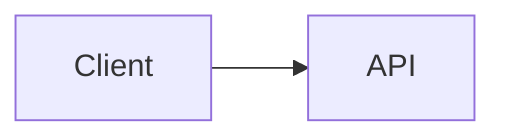

# Conception de l’extension de syntaxe Markdown

## Contexte

Ce document conserve les références d’implémentation pour la PR d’extension de syntaxe Markdown intégrée. Il se base sur la recherche d’optimisation TUI issue de `origin/docs/tui-optimization-design`, en particulier :

- `docs/design/tui-optimization/00-overview.md`
- `docs/design/tui-optimization/03-rendering-extensibility.md`
- `docs/design/tui-optimization/04-gemini-cli-research.md`
- `docs/design/tui-optimization/05-claude-code-research.md`
- `docs/design/tui-optimization/06-implementation-rollout-checklist.md`
- `docs/design/tui-optimization/08-execution-plan-and-test-matrix.md`

La recherche recommandée préconise une architecture Markdown long terme construite autour d’un analyseur AST, d’un cache de blocs/tokens, d’un streaming à préfixe stable, de panneaux de détail limités et de la détection des capacités du terminal. Cette première implémentation maintient une faible empreinte runtime et rend le nouveau comportement visible immédiatement.

## Périmètre de la PR intégrée

Cette PR traite l’extension de syntaxe Markdown comme une amélioration cohérente du rendu, et non comme des PR de fonctionnalités distinctes.

Ce qui est inclus dans la première implémentation :

- Les blocs de code Mermaid s’affichent visuellement dans la TUI.
- Les diagrammes Mermaid s’affichent sous forme d’images PNG dans le terminal lorsque le rendu d’images est explicitement activé, que `mmdc` est disponible et que le terminal prend en charge un chemin d’image.
- Les diagrammes Mermaid `flowchart` / `graph` tombent en mode prévisualisation boîte‑et‑flèche.
- Les diagrammes Mermaid `sequenceDiagram` tombent en mode prévisualisation participant‑flèche.
- Les blocs `classDiagram`, `stateDiagram`, `erDiagram`, `gantt`, `pie`, `journey`, `mindmap`, `gitGraph` et `requirementDiagram` de base tombent en mode prévisualisation textuelle limitée.
- Les types Mermaid sans prévisualisation textuelle tombent vers leur source originale délimitée, afin que l’utilisateur puisse toujours lire et copier la définition du diagramme.
- Les éléments de liste de tâches affichent des coches cochées/décochées.
- Les citations (`blockquote`) s’affichent avec une barre de citation visible.
- Le rendu des maths en ligne `$...$` et en bloc `$$...$$` utilise des substitutions Unicode courantes.
- Les tableaux Markdown existants continuent d’utiliser `TableRenderer`.
- Les blocs de code délimités non‑Mermaid existants continuent d’utiliser `CodeColorizer`.
- Les blocs visuels rendus restent accessibles via `/copy mermaid N`, `/copy latex N`, `/copy latex inline N` et le mode brut.
- `ui.renderMode` contrôle si les sessions démarrent en mode rendu ou brut/source, tandis que `Alt/Option+M` bascule la vue de la session active.

## Stratégie de rendu Mermaid

### Première version : rendu d’image conditionné par les capacités, avec repli textuel

L’implémentation considère désormais la mise en page native de Mermaid comme le chemin privilégié. Lorsque l’environnement local le permet, la TUI affiche les blocs Mermaid via ce pipeline :

```text
Source Mermaid
  -> mmdc / Mermaid CLI
  -> PNG
  -> Protocole d’image terminal Kitty ou iTerm2
```

Si le terminal ne prend pas en charge les images en ligne mais que `chafa` est installé, le même PNG est rendu sous forme de graphismes ANSI par blocs. Si ni le protocole d’image ni `chafa` n’est disponible, le rendu tombe vers la prévisualisation textuelle synchrone décrite ci‑dessous.

Le rendu d’image n’est pas tenté pendant qu’une réponse est encore en cours de streaming. Pendant le streaming, les blocs Mermaid affichent un aperçu en attente limité. Une fois la réponse finalisée, le chemin d’image n’est tenté que lorsqu’il est explicitement activé. Cela évite que le démarrage lent de `mmdc`, notamment le chemin `npx` optionnel, n’interfère avec le chemin de rendu interactif par défaut.

La génération des PNG est mise en cache indépendamment du placement dans le terminal. Les rendus répétés d’une même source Mermaid, y compris les mises à jour dues au redimensionnement du terminal, réutilisent le PNG généré et ne recalculent que les dimensions de placement pour Kitty/iTerm2.

Le chemin d’image est intentionnellement optionnel et conditionné par les capacités, plutôt que d’inclure ou d’invoquer systématiquement Puppeteer/Chromium depuis le chemin CLI à chaud. Un utilisateur peut activer le chemin d’image avec `QWEN_CODE_MERMAID_IMAGE_RENDERING=1`, puis fournir `@mermaid-js/mermaid-cli` en installant `mmdc` dans le `PATH` ou en définissant `QWEN_CODE_MERMAID_MMD_CLI` avec le chemin du binaire. Pour une vérification locale ponctuelle, `QWEN_CODE_MERMAID_ALLOW_NPX=1` permet au rendu d’invoquer `npx -y @mermaid-js/mermaid-cli@11.12.0` ; ceci est intentionnellement optionnel car la première exécution peut installer Puppeteer/Chromium et bloquer le rendu. Les rendus locaux dans `node_modules/.bin` ne sont pas découverts automatiquement à moins que `QWEN_CODE_MERMAID_ALLOW_LOCAL_RENDERERS=1` ne soit défini. La sélection du protocole de terminal peut être forcée avec `QWEN_CODE_MERMAID_IMAGE_PROTOCOL=kitty|iterm2|off`.

Pour les terminaux compatibles Kitty comme Ghostty, le rendu utilise les placeholders Unicode de Kitty au lieu d’écrire la charge utile d’image sous forme de texte Ink. Le PNG est transmis via stdout brut en mode silencieux (`q=2`) avec un placement virtuel (`U=1`), et l’arbre React affiche la grille normale de caractères placeholders (`U+10EEEE`) avec des signes diacritiques explicites de ligne et de colonne pour chaque cellule. Cela permet à Ink de gérer la mise en page et le redimensionnement tout en empêchant les octets de charge utile APC d’être encapsulés en texte base64 visible.

### Repli : prévisualisation filaire redimensionnable

Le repli évite le travail asynchrone car le chemin `<Static>` d’Ink est ajout‑seulement : un message finalisé ne peut pas attendre de manière fiable un rendu en arrière‑plan puis se mettre à jour sur place sans forcer un rafraîchissement statique complet. Le repli doit donc produire la sortie terminal pendant le passage de rendu React normal.

Pour les diagrammes `flowchart` / `graph`, le repli construit un modèle de graphe léger plutôt que d’afficher une arête à la fois :

- Les nœuds sont normalisés par l’identifiant Mermaid, l’étiquette et la forme de base.
- Les étiquettes de nœuds prennent en charge les sauts de ligne `\n` / `<br>` de style Mermaid.
- Les diagrammes de haut en bas sont classés en couches horizontales.
- Les diagrammes de gauche à droite sont classés en colonnes verticales lorsque cela est possible.
- Plusieurs arêtes sortant du même nœud sont dessinées comme une seule fourche avec des libellés d’arête entre crochets tels que `[Oui]`, `[Non]`, `[是]` et `[否]`.
- Les arêtes de retour et les cycles sont résumés dans une section `Cycles :` avec des marqueurs explicites `↩ vers <nœud>`. Cela évite les longs chemins instables entre diagrammes dans les polices de terminal tout en gardant la sémantique de boucle visible.
- Le graphe est recalculé à partir de `contentWidth`, donc le redimensionnement modifie la largeur des nœuds, l’espacement et les chemins de connexion.
- Les grandes prévisualisations sont limitées avant la mise en page du graphe, afin que les très grands blocs Mermaid n’allouent pas une toile terminal illimitée pendant le rendu.

Exemple :



s’affiche comme une prévisualisation visuelle dans le terminal plutôt que comme du code source Mermaid.

Les autres familles de diagrammes Mermaid courantes utilisent des résumés textuels limités plutôt qu’un moteur de mise en page complet : relations/membres de classes, transitions d’état, entités/relations ER, tâches Gantt, secteurs camembert, étapes de parcours, arbres mindmap, entrées de graphe Git et arbres d’exigences. Si un type de diagramme est inconnu ou non prévisualisable, le rendu affiche la source Mermaid délimitée d’origine plutôt qu’un espace réservé, afin que le contenu reste lisible et sélectionnable/copiable dans le terminal. Les en‑têtes Mermaid rendus affichent également la commande de copie spécifique à Mermaid, par exemple `/copy mermaid 2`, pour que les utilisateurs puissent récupérer la source du diagramme sans basculer toute la vue en mode brut.

Le repli n’est pas encore un moteur Mermaid complet. C’est une couche de prévisualisation rapide et légère pour les diagrammes couramment générés par LLM lorsqu’un rendu haute fidélité n’est pas disponible.

### Fournisseurs futurs

La limite du fournisseur est intentionnellement ouverte pour d’autres fournisseurs d’images natives :

- `mmdc` / `@mermaid-js/mermaid-cli` pour la sortie SVG/PNG.
- `terminal-image` pour Kitty/iTerm2 plus le repli ANSI.
- `chafa` lorsqu’il est présent pour les mosaïques Sixel/Kitty/iTerm2/Unicode.

Ce chemin doit rester optionnel, mis en cache et conditionné par les capacités, avec des clés de cache basées sur le hachage de la source, la largeur du terminal, le fournisseur de rendu et le protocole terminal. Il ne doit pas bloquer le démarrage ni ajouter de travail Mermaid/Puppeteer groupé au chemin TUI à chaud par défaut.

## Compatibilité avec l’analyseur AST

La première version étend l’analyseur existant pour minimiser l’impact. Les limites fonctionnelles restent compatibles avec un futur pipeline de tokens `marked` :

- `code(lang=mermaid)` -> `MermaidDiagram`
- `code(lang=*)` -> `CodeColorizer` existant
- `table` -> `TableRenderer` existant
- `blockquote` -> rendu de bloc de citation
- `list(task=true)` -> rendu de liste de tâches
- `paragraph/text` -> rendu en ligne avec support des maths/liens/style

L’implémentation ne met pas en cache les nœuds React. Un futur analyseur AST devrait mettre en cache les tokens/blocs, puis effectuer le rendu à partir des propriétés actuelles de largeur, thème et paramètres.

## Sécurité et performances

- La source Mermaid est traitée comme une entrée non fiable.
- Le premier rendu n’exécute pas de JavaScript Mermaid.
- Le rendu d’image natif doit être optionnel ou conditionné par les capacités.
- Un futur rendu basé sur navigateur doit utiliser des timeouts et des limites de taille.
- Le rendu doit dégrader vers du texte terminal plutôt que de lever une exception.
- Les grands blocs doivent respecter la hauteur et la largeur disponibles.

## Validation

Vérifications unitaires ciblées :

```bash
cd packages/cli
npx vitest run \
  src/config/settingsSchema.test.ts \
  src/ui/AppContainer.test.tsx \
  src/ui/utils/MarkdownDisplay.test.tsx \
  src/ui/utils/mermaidImageRenderer.test.ts \
  src/ui/commands/copyCommand.test.ts \
  src/ui/components/BaseTextInput.test.tsx \
  src/ui/keyMatchers.test.ts \
  src/ui/contexts/KeypressContext.test.tsx
```

Vérifications plus larges avant soumission de la PR :

```bash
npm run build --workspace=packages/cli
npm run typecheck --workspace=packages/cli
npm run lint --workspace=packages/cli
git diff --check
```

Scénario d’intégration avec capture terminal :

```bash
npm run build && npm run bundle
cd integration-tests/terminal-capture
npm run capture:markdown-rendering
```

Ce scénario capture une réponse de modèle riche en Markdown, bascule le mode brut/source avec `Alt/Option+M`, et vérifie les flux de copie de source visible avec `/copy mermaid 1` et `/copy latex 1`.

Scénarios manuels :

- Réponse de l’assistant avec un bloc Mermaid `flowchart LR`.
- Réponse de l’assistant avec un bloc Mermaid `sequenceDiagram`.
- Tableau Markdown et Mermaid dans la même réponse.
- Bloc de code JavaScript délimité affichant toujours le formatage du code.
- Largeur de terminal étroite.
- Surface d’outil/détail contrainte.
- `ui.renderMode: "raw"` démarre une session en mode source.
- `Alt/Option+M` bascule la même réponse entre mode rendu et brut/source.
- Les blocs visuels Mermaid et LaTeX exposent des indices de copie correspondant à l’ordre réel des sources `/copy mermaid N` et `/copy latex N`.