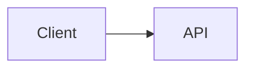

# Conception de l'extension de syntaxe Markdown

## Contexte

Ce document conserve les références d'implémentation pour la PR d'extension de
syntaxe Markdown intégrée. Il est basé sur la recherche d'optimisation TUI
provenant de `origin/docs/tui-optimization-design`, notamment :

- `docs/design/tui-optimization/00-overview.md`
- `docs/design/tui-optimization/03-rendering-extensibility.md`
- `docs/design/tui-optimization/04-gemini-cli-research.md`
- `docs/design/tui-optimization/05-claude-code-research.md`
- `docs/design/tui-optimization/06-implementation-rollout-checklist.md`
- `docs/design/tui-optimization/08-execution-plan-and-test-matrix.md`

La recherche référencée recommande une architecture Markdown à long terme,
construite autour d'un analyseur AST, de la mise en cache des blocs/tokens,
du streaming à préfixe stable, des panneaux de détails limités, et de la
détection des capacités du terminal. Cette première implémentation maintient
une faible empreinte mémoire et rend le nouveau comportement immédiatement
visible.

## Périmètre de la PR intégrée

Cette PR traite l'expansion de la syntaxe Markdown comme une amélioration
cohérente du rendu, et non comme des PR de fonctionnalités séparées.

Inclus dans la première implémentation :

- Les blocs de code Mermaid s'affichent visuellement dans la TUI.
- Les diagrammes Mermaid sont rendus via des images PNG dans le terminal
  lorsque le rendu d'image est explicitement activé, que `mmdc` est disponible,
  et que le terminal prend en charge un chemin d'image.
- Les diagrammes Mermaid `flowchart` / `graph` se replient sur un aperçu
  boîte-et-flèche.
- Les diagrammes Mermaid `sequenceDiagram` se replient sur un aperçu
  participant-flèche.
- Les blocs de base `classDiagram`, `stateDiagram`, `erDiagram`, `gantt`,
  `pie`, `journey`, `mindmap`, `gitGraph` et `requirementDiagram` se replient
  sur des aperçus textuels limités.
- Les types Mermaid sans aperçu textuel se replient sur leur source délimitée
  d'origine afin que l'utilisateur puisse toujours lire et copier la définition
  du diagramme.
- Les éléments de liste de tâches affichent des marqueurs cochés/décochés.
- Les citations s'affichent avec une barre de citation visible.
- Les maths en ligne `$...$` et en bloc `$$...$$` sont rendus avec des
  substitutions Unicode courantes.
- Les tableaux Markdown existants continuent d'utiliser `TableRenderer`.
- Les blocs de code délimités non-Mermaid existants continuent d'utiliser
  `CodeColorizer`.
- Les blocs visuels rendus restent accessibles via `/copy mermaid N`,
  `/copy latex N`, `/copy latex inline N` et le mode brut.
- `ui.renderMode` contrôle si les sessions démarrent en mode rendu ou en mode
  brut/source, tandis que `Alt/Option+M` bascule la vue de la session active.

## Stratégie de rendu Mermaid

### Première version : rendu d'image limité par les capacités avec repli textuel

L'implémentation traite désormais la mise en page propre à Mermaid comme le
chemin préféré. Lorsque l'environnement local le permet, la TUI rend les blocs
Mermaid via ce pipeline :

```text
Source Mermaid
  -> mmdc / Mermaid CLI
  -> PNG
  -> Protocole d'image terminal Kitty ou iTerm2
```

Si le terminal ne prend pas en charge les images en ligne mais que `chafa` est
installé, le même PNG est rendu sous forme de graphiques ANSI en blocs. Si ni
le protocole d'image ni `chafa` n'est disponible, le rendu se replie sur
l'aperçu textuel synchrone du terminal décrit ci-dessous.

Le rendu d'image n'est pas tenté tant que la réponse est encore en cours de
streaming. Pendant le streaming, les blocs Mermaid affichent un aperçu en
attente limité. Une fois la réponse finalisée, le chemin d'image n'est tenté
que s'il est explicitement activé. Cela évite que le démarrage lent de `mmdc`,
notamment le chemin opt-in `npx`, n'interfère avec le chemin de rendu
interactif par défaut.

La génération PNG est mise en cache indépendamment du placement dans le
terminal. Les rendus répétés de la même source Mermaid, y compris les mises à
jour de redimensionnement du terminal, réutilisent le PNG généré et ne
recalculent que les dimensions de placement Kitty/iTerm2.

Le chemin d'image est délibérément opt-in et limité par les capacités, plutôt
que d'embarquer ou d'invoquer systématiquement Puppeteer/Chromium depuis le
chemin CLI à chaud. Un utilisateur peut activer le chemin d'image avec
`QWEN_CODE_MERMAID_IMAGE_RENDERING=1`, puis fournir `@mermaid-js/mermaid-cli`
en installant `mmdc` dans `PATH` ou en définissant `QWEN_CODE_MERMAID_MMD_CLI`
sur le chemin du binaire. Pour une vérification locale ad-hoc,
`QWEN_CODE_MERMAID_ALLOW_NPX=1` permet au rendu d'invoquer
`npx -y @mermaid-js/mermaid-cli@11.12.0` ; ceci est délibérément opt-in car la
première exécution peut installer Puppeteer/Chromium et bloquer le rendu. Les
rendus situés dans `node_modules/.bin` local au dépôt ne sont pas
automatiquement découverts sauf si `QWEN_CODE_MERMAID_ALLOW_LOCAL_RENDERERS=1`
est défini. La sélection du protocole de terminal peut être forcée avec
`QWEN_CODE_MERMAID_IMAGE_PROTOCOL=kitty|iterm2|off`.

Pour les terminaux compatibles Kitty tels que Ghostty, le rendu utilise les
placeholders Unicode de Kitty au lieu d'écrire la charge utile de l'image
comme texte Ink. Le PNG est transmis via la sortie standard brute en mode
silencieux (`q=2`) avec un placement virtuel (`U=1`), et l'arbre React rend la
grille normale de caractères placeholders (`U+10EEEE`) avec des diacritiques
explicites de ligne et de colonne pour chaque cellule. Cela permet à Ink de
gérer la mise en page et le redimensionnement tout en empêchant les octets de
charge utile APC d'être intégrés dans du texte base64 visible.

### Repli : aperçu filaire redimensionnable

Le repli évite le travail asynchrone car le chemin `<Static>` d'Ink est en
mode ajout seulement : un message finalisé ne peut pas attendre de manière
fiable un travail de rendu en arrière-plan, puis se mettre à jour sur place
sans forcer un rafraîchissement statique complet. Le repli doit donc produire
la sortie terminale pendant le passage normal du rendu React.
Pour les diagrammes `flowchart` / `graph`, le repli construit un modèle de graphe léger au lieu d’afficher une arête à la fois :

- Les nœuds sont normalisés par l’identifiant Mermaid, le libellé et la forme de base.
- Les libellés des nœuds prennent en charge les sauts de ligne `\n` / `<br>` au format Mermaid.
- Les diagrammes de haut en bas sont classés en couches horizontales.
- Les diagrammes de gauche à droite sont classés en colonnes verticales lorsqu’ils tiennent.
- Plusieurs arêtes sortantes du même nœud sont dessinées comme une seule bifurcation avec des libellés d’arête entre crochets tels que `[Yes]`, `[No]`, `[是]` et `[否]`.
- Les arêtes retour et les cycles sont résumés dans une section `Cycles:` avec des marqueurs explicites `↩ to <node>`. Cela évite les longues routes instables entre diagrammes dans les polices terminal tout en rendant la sémantique des boucles visible.
- Le graphe est recalculé à partir de `contentWidth`, donc le redimensionnement modifie la largeur des nœuds, l’espacement et les chemins de connexion.
- Les grandes prévisualisations sont bornées avant la mise en page du graphe afin que les très gros blocs Mermaid n’allouent pas une zone terminale infinie pendant le rendu.

Exemple :



est rendu comme une prévisualisation visuelle dans le terminal, et non comme du code source Mermaid.

Les autres familles courantes de diagrammes Mermaid utilisent des résumés textuels bornés plutôt qu’un moteur de mise en page complet : relations/membres de classes, transitions d’états, entités/relations ER, tâches Gantt, secteurs de camembert, étapes de parcours, arbres mindmap, entrées de graphe git et arbres d’exigences. Si un type de diagramme est inconnu ou ne peut pas être prévisualisé, le moteur de rendu affiche le code source Mermaid original entre délimiteurs plutôt qu’un espace réservé, afin que le contenu reste lisible et sélectionnable/copiable dans le terminal. Les en-têtes des diagrammes Mermaid rendus affichent également la commande de copie spécifique à Mermaid, par exemple `/copy mermaid 2`, permettant aux utilisateurs de récupérer le code source original du diagramme sans basculer toute la vue en mode brut.

Le repli n’est pas encore un moteur Mermaid complet. C’est une couche de prévisualisation rapide et légère en dépendances pour les diagrammes courants générés par LLM lorsque le rendu haute fidélité n’est pas disponible.

### Fournisseurs futurs

La frontière des fournisseurs est intentionnellement ouverte pour d’autres fournisseurs d’images natives :

- `mmdc` / `@mermaid-js/mermaid-cli` pour la sortie SVG/PNG.
- `terminal-image` pour Kitty/iTerm2 avec repli ANSI.
- `chafa` lorsqu’il est présent pour les mosaïques Sixel/Kitty/iTerm2/Unicode.

Ce chemin doit rester optionnel, mis en cache et limité par capacités, avec des clés de cache basées sur le hachage de la source, la largeur du terminal, le fournisseur de rendu et le protocole du terminal. Il ne doit pas bloquer le démarrage ni ajouter par défaut du travail Mermaid/Puppeteer intégré au chemin chaud du TUI.

## Compatibilité avec le rendu AST

La première version étend l’analyseur existant pour minimiser l’impact. Les limites de la fonctionnalité restent compatibles avec un futur pipeline de tokens `marked` :

- `code(lang=mermaid)` -> `MermaidDiagram`
- `code(lang=*)` -> `CodeColorizer` existant
- `table` -> `TableRenderer` existant
- `blockquote` -> moteur de rendu de blocs de citation
- `list(task=true)` -> moteur de rendu de listes de tâches
- `paragraph/text` -> moteur de rendu en ligne avec support des maths/liens/styles

L’implémentation ne met pas en cache les nœuds React. Un futur moteur de rendu AST devrait mettre en cache les tokens/blocs, puis effectuer le rendu à partir des propriétés actuelles de largeur, thème et paramètres.

## Sécurité et performances

- Le code source Mermaid est considéré comme une entrée non fiable.
- Le premier moteur de rendu n’exécute pas de JavaScript Mermaid.
- Le rendu d’image native doit être opt-in ou limité par capacités.
- Le futur rendu basé sur navigateur doit utiliser des délais d’attente et des limites de taille.
- Le rendu doit se dégrader en texte terminal plutôt que de lever une erreur.
- Les gros blocs doivent respecter la hauteur et la largeur disponibles.

## Validation

Vérifications unitaires ciblées :

```bash
cd packages/cli
npx vitest run \
  src/config/settingsSchema.test.ts \
  src/ui/AppContainer.test.tsx \
  src/ui/utils/MarkdownDisplay.test.tsx \
  src/ui/utils/mermaidImageRenderer.test.ts \
  src/ui/commands/copyCommand.test.ts \
  src/ui/components/BaseTextInput.test.tsx \
  src/ui/keyMatchers.test.ts \
  src/ui/contexts/KeypressContext.test.tsx
```

Vérifications plus larges avant soumission de la PR :

```bash
npm run build --workspace=packages/cli
npm run typecheck --workspace=packages/cli
npm run lint --workspace=packages/cli
git diff --check
```

Scénario d’intégration avec capture terminal :

```bash
npm run build && npm run bundle
cd integration-tests/terminal-capture
npm run capture:markdown-rendering
```

Ce scénario capture une réponse de modèle riche en Markdown, bascule entre les modes brut/source avec `Alt/Option+M`, et vérifie les flux de copie de source visible avec `/copy mermaid 1` et `/copy latex 1`.

Scénarios manuels :

- Réponse de l’assistant avec un bloc Mermaid `flowchart LR`.
- Réponse de l’assistant avec un bloc Mermaid `sequenceDiagram`.
- Tableau Markdown plus Mermaid dans la même réponse.
- Bloc de code JavaScript délimité montrant toujours le formatage du code.
- Largeur de terminal étroite.
- Surface d’outil/détail réduite.
- `ui.renderMode: "raw"` démarre une session en mode source.
- `Alt/Option+M` bascule la même réponse entre le mode rendu et le mode brut/source.
- Les blocs visuels Mermaid et LaTeX affichent des indices de copie correspondant à l’ordre source réel de `/copy mermaid N` et `/copy latex N`.
