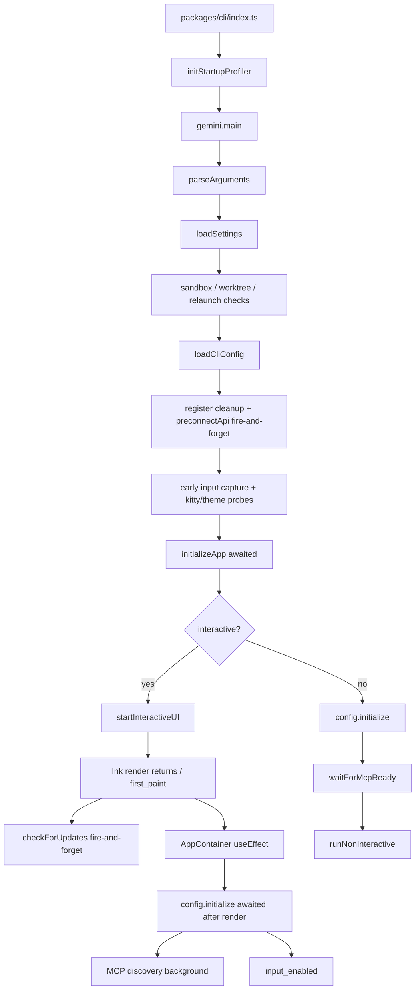
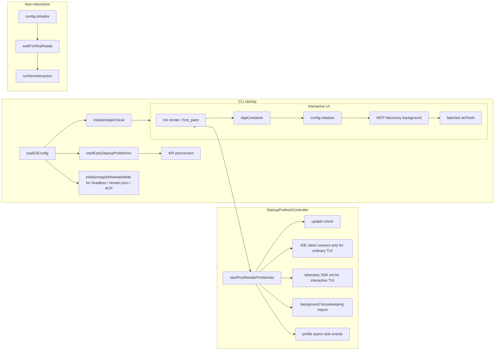
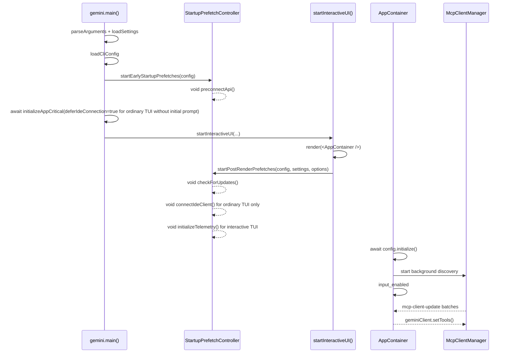

# Conception de l'optimisation du préchargement au démarrage en mode fire-and-forget

## Contexte et objectifs

L'issue parente #3011 décompose l'optimisation du démarrage de qwen-code en plusieurs sous-tâches. Le dépôt actuel intègre déjà plusieurs capacités fondamentales :

- #3219 : Le profileur de performance au démarrage est intégré, prenant en charge `QWEN_CODE_PROFILE_STARTUP=1` pour générer du JSON sur les phases de démarrage.
- #3221 : L'enregistrement des outils a été converti en lazy factory ; `Config.initialize()` n'instancie plus tous les outils de manière statique.
- #3223 : Le préconnect API existe déjà, actuellement déclenché en mode fire-and-forget après `loadCliConfig()`.
- La capture précoce des entrées, la découverte progressive du MCP et `config.initialize()` après le rendu de l'AppContainer sont également partiellement implémentés.

L'objectif de #3222 n'est pas de refaire ces capacités, mais de consolider les opérations de démarrage non critiques encore dispersées dans le chemin de démarrage en une couche de préchargement fire-and-forget unifiée : avant le premier rendu, attendre uniquement les opérations qui affectent réellement l'exactitude ; après le premier rendu, lancer des tâches en arrière-plan qui n'affectent pas l'exactitude de la première interaction, tout en préservant une sémantique compatible pour les modes non interactifs.

## Flux de démarrage actuel

Le flux clé du chemin de démarrage interactif actuel est le suivant :



Évaluation de l'état actuel :

- `initializeApp()` exécute toujours l'i18n, l'authentification, la validation du thème et la connexion du client IDE en série avant le premier rendu.
- L'authentification et l'i18n doivent rester avant le premier rendu ; la connexion IDE n'est pas une dépendance stricte pour le premier rendu d'une TUI simple sans prompt initial, et peut être différée sur le chemin de la TUI simple. Cependant, pour des chemins comme `qwen -i "prompt"`, `qwen -p`, stream-json et ACP/Zed — qui n'ont pas de fenêtre post-rendu sûre ou dont la première requête nécessite le contexte/statut de l'IDE — la connexion IDE doit continuer à être attendue avant la première requête.
- `checkForUpdates()` est déjà en mode fire-and-forget après le rendu dans `startInteractiveUI()`, mais la logique est dispersée dans la fonction de démarrage de l'UI.
- `preconnectApi()` est déjà en mode fire-and-forget et doit continuer à être déclenché le plus tôt possible, mais doit être intégré dans une planification unifiée.
- L'initialisation du SDK de télémétrie se faisait auparavant de manière synchrone lors de la construction de `Config` ; pour une TUI interactive simple, elle peut être différée après le rendu, tandis que les chemins non interactifs conservent la sémantique d'initialisation avant la première requête.
- Sur le chemin interactif, `config.initialize()` s'exécute déjà après le montage de React ; la découverte du MCP s'exécute déjà en arrière-plan dans le core, l'AppContainer rafraîchissant la liste des outils par lots.
- Le chemin non interactif doit toujours attendre `config.waitForMcpReady()`, sinon le premier prompt pourrait ne pas voir les outils MCP, ce qui entraînerait une régression du comportement scripté.

## Architecture cible

Introduire une petite couche de planification de préchargement au démarrage qui gère uniformément les tâches de type "lancer sans attendre", réparties en deux catégories selon le moment du déclenchement : tôt (early) et post-rendu (post-render).



La séquence de démarrage interactif sous la nouvelle conception :



## Modifications de conception

### 1. Nouveau planificateur de préchargement au démarrage unifié

Ajouter `packages/cli/src/startup/startup-prefetch.ts`, fournissant deux points d'entrée :

```ts
startEarlyStartupPrefetches(config: Config): void;
startPostRenderPrefetches(
  config: Config,
  settings: LoadedSettings,
  options?: { connectIde?: boolean; initializeTelemetry?: boolean },
): void;
```

Le planificateur fait exactement trois choses :

- Lance les tâches de préchargement par nom.
- Utilise `void task().catch(...)` pour ne explicitement pas attendre et ne pas lever d'erreur.
- Enregistre les logs de debug et les événements asynchrones du profileur pour vérifier si les tâches sont lancées avant ou après le rendu.

Le planificateur doit garantir l'idempotence par phase, empêchant React StrictMode, les appels de tests répétés ou les réentrées anormales de lancer la même tâche plusieurs fois.

### 2. Préchargement précoce (Early Prefetch) : Maximiser l'avance

`startEarlyStartupPrefetches(config)` est appelé immédiatement après le succès de `loadCliConfig()`.

La première phase inclut uniquement le préconnect API :

- Lit le type d'authentification actuel et l'URL de base résolue depuis `config.getModelsConfig()`.
- Lit le proxy depuis `config.getProxy()`.
- Appelle le `preconnectApi(authType, { resolvedBaseUrl, proxy })` existant.
- Préserve les portes d'environnement existantes : `QWEN_CODE_DISABLE_PRECONNECT`, sandbox, CA personnalisé, runtime non-Node, pas de proxy, etc.

Cela n'ajoute aucune nouvelle option de configuration. Les échecs de préconnect écrivent uniquement des logs de debug et n'affectent pas le démarrage.

### 3. Préchargement post-rendu (Post-Render Prefetch) : Lancer après le premier rendu

`startPostRenderPrefetches(config, settings)` est appelé dans `startInteractiveUI()` après que Ink `render()` retourne et que `first_paint` est enregistré.

Le premier lot inclut :

- Vérification des mises à jour : migrer la logique existante de `checkForUpdates().then(handleAutoUpdate)`, en préservant la porte `settings.merged.general?.enableAutoUpdate !== false`.
- Connexion du client IDE : déplacée vers le préchargement post-rendu uniquement sur le chemin de la TUI interactive simple sans prompt initial. Les appelants doivent passer explicitement `connectIde: true`, et le planificateur vérifie toujours en interne `config.getIdeMode()`. `qwen -i "prompt"`, non-interactif, stream-json et ACP/Zed ne diffèrent pas la connexion IDE via ce point d'entrée.
- Initialisation du SDK de télémétrie : déplacée vers le préchargement post-rendu uniquement sur le chemin de la TUI interactive. `Config` conserve toujours les paramètres de télémétrie, mais ignore l'effet de bord du SDK au moment de la construction via `deferTelemetryInitialization` ; le préchargement post-rendu lance le SDK via `initializeTelemetry(config)`. Non-interactif, stream-json et ACP/Zed ne diffèrent pas.
- Maintenance en arrière-plan (housekeeping) : peut être migrée de `gemini.tsx` vers le préchargement post-rendu, donnant à toutes les tâches de démarrage en arrière-plan un point d'entrée unifié ; toujours limité à l'interactif, utilise toujours l'import dynamique et l'absorption des erreurs.

Aucune de ces tâches ne doit affecter la valeur de retour de `startInteractiveUI()`, ni écrire d'erreurs visibles par l'utilisateur dans le stderr de la TUI. Les échecs vont uniquement dans les logs de debug.

### 4. Scinder le chemin critique de `initializeApp()`, préserver la connexion IDE attendue pour les non-TUI

Ajouter un helper partagé pour éviter de dupliquer la logique de connexion IDE entre le chemin différé de la TUI et le chemin attendu des non-TUI :

```ts
export async function connectIdeForStartup(config: Config): Promise<void> {
  if (!config.getIdeMode()) return;

  const ideClient = await IdeClient.getInstance();
  await ideClient.connect();
  logIdeConnection(config, new IdeConnectionEvent(IdeConnectionType.START));
}
```

`initializeApp()` reste en tant qu'initialisation critique avant le premier rendu, mais gagne une option explicite :

```ts
interface InitializeAppOptions {
  deferIdeConnection?: boolean;
}
```

La valeur par défaut doit rester rétrocompatible : `deferIdeConnection` est par défaut à `false`. C'est-à-dire que lorsqu'aucune option n'est passée, la connexion IDE est toujours attendue dans `initializeApp()`.

Le contenu attendu de `initializeApp()` devient :

- `initializeI18n(...)`
- `performInitialAuth(...)`
- `validateTheme(settings)`
- Quand `deferIdeConnection !== true`, `await connectIdeForStartup(config)`
- Calculer `shouldOpenAuthDialog`
- Lire `config.getGeminiMdFileCount()`

Le site d'appel dans `gemini.tsx` est responsable de la sélection en fonction du mode d'exécution :

```ts
const deferIdeConnections =
  config.isInteractive() && !config.getExperimentalZedIntegration() && !input;

const initializationResult = await initializeApp(config, settings, {
  deferIdeConnections,
});
```

Par la suite, uniquement quand `deferIdeConnection === true`, `startInteractiveUI()` lance la connexion IDE en mode fire-and-forget via `startPostRenderPrefetches(..., { connectIde: true })` ; le mode prompt-interactive, qui soumet automatiquement la première question, continue d'attendre l'IDE avant le rendu et passe `connectIde: false` pour éviter une connexion dupliquée post-rendu.

Cette scission adresse le risque de compatibilité signalé lors de la revue :

- TUI interactive simple : la connexion socket/IPC de l'IDE ne bloque plus le premier rendu.
- `qwen -i "prompt"` : continue d'attendre la connexion IDE avant la première requête auto-soumise, et le post-rendu ne se reconnecte pas.
- `qwen -p` / stdin pipée : continue d'attendre la connexion IDE avant la première requête au modèle.
- stream-json : continue de finaliser la connexion IDE avant la gestion des requêtes de session/contrôle.
- ACP/Zed : continue de conserver le démarrage attendu de l'IDE, évitant ainsi de manquer le contexte/statut de l'IDE sur la première requête.

### 5. La sémantique du MCP et du mode non interactif reste inchangée

Cette conception ne change pas la machine à états MCP principale.

Interactif :

- Continue d'appeler `config.initialize()` dans l'effet de montage de l'`AppContainer`.
- `Config.initialize()` continue de lancer la découverte du MCP en arrière-plan.
- L'AppContainer continue d'écouter `mcp-client-update` et d'appeler par lots `geminiClient.setTools()` à des intervalles d'environ 16 ms.
- Le premier rendu et la disponibilité des entrées n'attendent pas que le MCP soit entièrement résolu.

Non-interactif / stream-json / ACP :

- Continue d'attendre la connexion IDE avant la première requête au modèle.
- Continue d'attendre `config.waitForMcpReady()` avant la première requête au modèle.
- Préserve la sémantique de visibilité des outils de l'ancien chemin synchrone.
- Préserve le comportement existant des avertissements stderr en cas d'échec du MCP.

## Gains de performance estimés

Les gains se répartissent en deux catégories.

La première est le raccourcissement du chemin critique avant le premier rendu :

- La connexion du client IDE pour la TUI interactive simple ne bloque plus le premier rendu ; les gains dépendent du temps de connexion socket/IPC de l'IDE, attendu de quelques dizaines à quelques centaines de millisecondes.
- L'initialisation du SDK de télémétrie pour la TUI interactive simple ne bloque plus le premier rendu ; les gains dépendent du coût de construction du SDK/exporter OTel, généralement une surcharge de démarrage synchrone faible à modérée.
- La vérification des mises à jour, la maintenance (housekeeping), le préconnect et les tâches similaires disposent d'un point d'entrée fire-and-forget unifié, empêchant la maintenance future de les replacer accidentellement sur le chemin attendu.
Le second concerne les gains sur la première requête API :

- Continue de préserver la conception de préconnexion API #3223.
- Lorsque le proxy/dispatcher partagé est réutilisable, la première requête API peut éviter les coûts de handshake TCP+TLS, avec un gain attendu de 100 à 200 ms.

Note : Le baseline historique de #3219 montrait que le chargement des modules représentait autrefois ~94 % du temps de démarrage total ; le lazy tool registration de #3221 a déjà traité le plus gros goulot d'étranglement. Le bénéfice principal de #3222 porte davantage sur le TTI perçu et la réactivité du first-paint, plutôt que sur l'élimination de tous les coûts de chargement des modules.

## Risques et périmètre d'impact

### Risques

- Les capacités de l'IDE sur le TUI simple peuvent passer de "connecté avant le first-paint" à "connecté très peu de temps après le first-paint". Atténuation : ne différer que sur le chemin du TUI interactif simple ; les modes non-interactif, stream-json et ACP/Zed conservent une connexion attendue avant la première requête.
- Les événements de télémétrie pré-rendu peuvent être ignorés (no-op) lorsque le SDK n'est pas encore initialisé. Atténuation : différer uniquement pour le TUI interactif ; la télémétrie pré-première-requête non interactive conserve sa sémantique d'origine, aucune nouvelle file d'attente de buffering n'est ajoutée.
- Les échecs des tâches différées peuvent ne pas être visibles. Atténuation : un wrapper unifié enregistre les logs de debug et les événements asynchrones du profileur.
- La migration de la mise à jour/préconnexion peut modifier involontairement les gates existantes. Atténuation : préservation à l'identique des paramètres et conditions d'environnement existants.
- Un report excessif peut laisser des capacités non prêtes lorsque la première saisie de l'utilisateur en dépend. Atténuation : l'authentification, la construction de la config, les permissions, les hooks, la mémoire, le registre des outils et le MCP ready non interactif restent tous attendus.

### Périmètre d'impact

Devrait impliquer uniquement la couche de démarrage du CLI :

- `packages/cli/src/startup/startup-prefetch.ts`
- `packages/cli/src/core/initializer.ts`
- `packages/cli/src/gemini.tsx`
- `packages/cli/src/ui/startInteractiveUI.tsx`
- Tests unitaires correspondants

Aucun changement pour :

- Arguments du CLI et schéma de configuration
- Protocole du registre d'outils core
- Machine à états de découverte MCP
- Protocole de requête modèle
- Comportement des commandes visibles par l'utilisateur

## Plan de tests unitaires

### `packages/cli/src/startup/startup-prefetch.test.ts`

Couverture :

- `startEarlyStartupPrefetches()` appelle `preconnectApi()` avec le type d'auth, l'URL de base résolue et le proxy.
- Le prefetch précoce n'attend pas la fin de la tâche.
- Les appels répétés sont idempotents, ne relançant pas la même tâche précoce.
- `startPostRenderPrefetches()` lance la vérification de mise à jour lorsque `enableAutoUpdate !== false`.
- Ne lance pas la vérification de mise à jour lorsque `enableAutoUpdate === false`.
- Lance la connexion IDE et appelle `logIdeConnection()` lorsque `options.connectIde === true` et `config.getIdeMode() === true`.
- Ne déclenche pas la connexion IDE lorsque `options.connectIde !== true`.
- Ne déclenche pas la connexion IDE lorsque `config.getIdeMode() === false` même si `options.connectIde === true`.
- Lance l'initialisation du SDK de télémétrie lorsque `options.initializeTelemetry === true`.
- Ne déclenche pas l'initialisation du SDK de télémétrie lorsque `options.initializeTelemetry !== true`.
- Les rejets des tâches différées ne font pas lever d'exception à l'API publique, ils écrivent uniquement des logs de debug.

### `packages/cli/src/core/initializer.test.ts`

Ajustements et ajouts :

- `initializeApp()` attend par défaut `connectIdeForStartup()`, préservant la compatibilité du chemin non-TUI.
- `initializeApp(..., { deferIdeConnection: true })` n'appelle pas `IdeClient.getInstance()` ni `connect()`.
- `initializeApp(..., { deferIdeConnection: false })` appelle et attend la connexion IDE lorsque `config.getIdeMode() === true`.
- Attend toujours `initializeI18n()`.
- Attend toujours `performInitialAuth()`.
- En cas d'échec d'authentification, conserve `authError` et `shouldOpenAuthDialog === true`.
- En cas d'échec de validation du thème, conserve `themeError`.
- Lorsque le type d'authentification est explicitement fourni et que l'authentification réussit, `shouldOpenAuthDialog === false`.

### `packages/cli/src/ui/startInteractiveUI.test.tsx`

Couverture :

- Après que `render()` d'Ink retourne et que `first_paint` est enregistré, appelle `startPostRenderPrefetches(config, settings)`.
- Le chemin TUI simple passe `{ connectIde: true, initializeTelemetry: true }`.
- Lorsque prompt-interactive a déjà attendu l'IDE avant le rendu, passe `{ connectIde: false, initializeTelemetry: true }` pour éviter une connexion IDE en double.
- Les chemins non-TUI ne déclenchent pas le prefetch post-rendu IDE/télémétrie via `startInteractiveUI()`.
- Les rejets du prefetch post-rendu ne font pas rejeter `startInteractiveUI()`.
- Après que la vérification de mise à jour est sortie de la logique inline de `startInteractiveUI()`, elle n'est plus appelée directement.

### `packages/cli/src/gemini.test.tsx`

Ajustements et ajouts :

- Le TUI interactif simple appelle `initializeApp(config, settings, { deferIdeConnection: true })`, et connecte l'IDE dans le prefetch post-rendu.
- Prompt-interactive appelle `initializeApp(config, settings, { deferIdeConnection: false })`, et le prefetch post-rendu ne reconnecte pas l'IDE.
- `qwen -p` / stdin pipée / stream-json appelle `initializeApp(config, settings, { deferIdeConnection: false })` ou utilise les valeurs par défaut, garantissant que l'IDE est connecté avant la première requête.
- Le chemin ACP/Zed n'active pas le prefetch différé de l'IDE, et continue avec le démarrage attendu de l'IDE.

### `packages/core/src/config/config.test.ts`

Couverture :

- Lorsque la télémétrie est activée et que `deferTelemetryInitialization` n'est pas passé, la construction de `Config` appelle toujours `initializeTelemetry(config)`.
- Lorsque la télémétrie est activée et que `deferTelemetryInitialization === true`, la construction de `Config` n'appelle pas `initializeTelemetry(config)`, mais `config.getTelemetryEnabled()` retourne toujours true.

### Tests de régression

Exécution recommandée :

```bash
cd packages/cli && npx vitest run src/core/initializer.test.ts src/startup/startup-prefetch.test.ts
cd packages/cli && npx vitest run src/gemini.test.tsx
cd packages/core && npx vitest run src/config/config.test.ts -t "telemetry"
```

## Critères d'acceptation

- Le first-paint du REPL interactif n'attend pas la connexion IDE, l'initialisation de la télémétrie, la vérification de mise à jour ou les tâches de maintenance (housekeeping).
- Les modes non-interactif, stream-json et ACP/Zed attendent toujours la connexion IDE avant la première requête.
- Les modes non-interactif, stream-json et ACP/Zed ne diffèrent pas l'initialisation du SDK de télémétrie.
- La préconnexion API se déclenche toujours en fire-and-forget le plus tôt possible après `loadCliConfig()`.
- L'authentification, la configuration, les permissions, les hooks, la mémoire et les autres initialisations critiques pour la correction restent attendues lorsque nécessaire.
- Le premier prompt non interactif attend toujours que le MCP soit prêt.
- Tous les échecs de tâches différées n'affectent pas le rendu du REPL.
- Le profileur montre que les tâches différées se lancent comme prévu autour de first_paint.
- Les tests unitaires couvrent les chemins critiques, l'idempotence, l'absorption des erreurs et les contraintes de compatibilité non interactive.

## Hypothèses par défaut

- #3221 est en fait une issue sur GitHub, pas une PR ; le dépôt actuel contient déjà l'implémentation du lazy tool registry.
- Cette conception n'ajoute aucune nouvelle option de configuration, évitant ainsi de transformer l'optimisation du démarrage en complexité configurable par l'utilisateur.
- "Le rendu du REPL avant la fin des opérations différées" signifie le retour du first-paint d'Ink et la disponibilité de l'input, et non que toutes les capacités en arrière-plan doivent se terminer avant que l'utilisateur ne voie l'UI.
- Le mode non interactif privilégie la compatibilité, sans chercher à optimiser le first-paint de manière aussi agressive que le mode interactif.