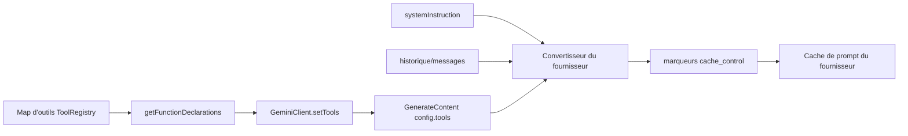
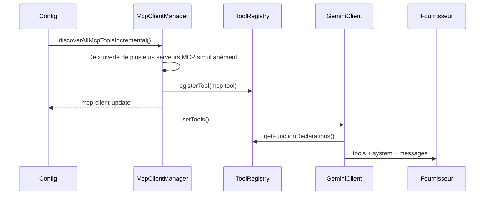

# Conception du tri stable global des schémas d'outils

## Contexte

Qwen Code prend déjà en charge `cache_control` dans les couches de conversion des requêtes Anthropic et DashScope. Lorsqu'un fournisseur prend en charge la mise en cache des prompts, un préfixe de requête stable peut être mis en cache et réutilisé, ce qui réduit le coût des tokens d'entrée répétés et diminue le temps jusqu'au premier token.

Le préfixe principal comprend actuellement trois parties :

1. Schéma des outils : déclarations des outils générées par
   `ToolRegistry.getFunctionDeclarations()`.
2. Instruction système : le prompt système de la session principale.
3. Messages/historique : prélude de démarrage, messages de l'utilisateur, résultats des outils et contexte associé.

Le schéma des outils est souvent volumineux et apparaît au début du préfixe de cache du fournisseur. Si les octets sérialisés du tableau des outils changent, le préfixe système et messages suivant peut également ne plus pouvoir être réutilisé.

Aujourd'hui, `GeminiClient.setTools()` utilise directement la valeur de retour de
`ToolRegistry.getFunctionDeclarations()`, et `getFunctionDeclarations()` itère sur les outils dans l'ordre d'insertion de la `Map`. L'ordre d'enregistrement des outils intégrés est généralement stable, mais la découverte progressive des MCP, les révélations de ToolSearch, les reconnexions MCP et l'enregistrement d'outils externes peuvent tous entraîner la sérialisation du même ensemble d'outils dans des ordres différents. Cela entraîne des échecs de cache de prompt inutiles.

## Objectifs

Implémenter un tri stable global pour les schémas d'outils : les `functionDeclarations` envoyées aux requêtes du modèle doivent avoir un ordre stable pour le même ensemble d'outils, indépendamment de l'ordre d'enregistrement.

Cette conception ne traite que les échecs de cache où l'ensemble des outils est identique mais l'ordre diffère. L'ajout d'outils, la suppression d'outils ou la modification du contenu du schéma modifient toujours le préfixe ; il s'agit d'échecs de cache légitimes.

Cette conception n'inclut pas :

- La mise en blocs du prompt système.
- Le snapshot/cache du schéma des outils au niveau de la session.
- L'implémentation complète de la détection des ruptures de cache de prompt.
- Les modifications de la politique `cache_control` du fournisseur.

## Flux actuel



La découverte progressive des MCP est la source la plus courante de variation d'ordre :



Si deux serveurs MCP finissent par devenir disponibles mais se stabilisent dans des ordres différents, le bloc d'outils actuel peut différer :

```text
Run 1:
[
  read_file,
  shell,
  mcp__filesystem__read_tree,
  mcp__github__search_issues
]

Run 2:
[
  read_file,
  shell,
  mcp__github__search_issues,
  mcp__filesystem__read_tree
]
```

Du point de vue des capacités du modèle, les deux exécutions exposent le même ensemble d'outils. Du point de vue du cache de prompt, il s'agit de préfixes d'outils différents.

Après le tri, le même ensemble se stabilise ainsi :

```text
[
  mcp__filesystem__read_tree,
  mcp__github__search_issues,
  read_file,
  shell
]
```

## Rôle du cache de prompt et différences entre hit et miss

Le cache de prompt permet au fournisseur de réutiliser le calcul KV/cache pour un préfixe stable. Pour les longues listes d'outils, les longs prompts système et les longs préfixes d'historique, un hit de cache présente généralement deux avantages :

- Coût réduit des tokens d'entrée : le préfixe mis en cache emprunte le chemin de facturation de lecture du cache.
- TTFT réduit : le fournisseur n'a pas besoin de retraiter l'ensemble du préfixe.

Avant un hit :

```text
octets de la requête modifiés
-> le préfixe tools/system/messages ne peut pas être réutilisé
-> cache_read_input_tokens est faible ou à 0
-> l'ensemble du préfixe est à nouveau compté comme entrée/création de cache
-> le TTFT est plus élevé
```

Après un hit :

```text
octets du préfixe stable inchangés
-> le préfixe tools/system/messages est réutilisé depuis le cache du fournisseur
-> cache_read_input_tokens augmente
-> seul le nouveau contenu de fin est compté comme entrée/création de cache
-> le TTFT est plus bas
```

Cette conception améliore la probabilité de hit en stabilisant l'ordre du tableau des outils, en particulier pour les variations d'ordre d'enregistrement causées par la découverte progressive des MCP et les révélations de ToolSearch.

## Conception

Le tri appartient à `ToolRegistry.getFunctionDeclarations()` car c'est le point de génération unique pour les déclarations d'outils de l'API actuelle. Ne pas trier dans le convertisseur du fournisseur, car les autres lecteurs de déclarations resteraient instables. Ne pas trier uniquement dans `GeminiClient.setTools()`, car les diagnostics, l'estimation du contexte et les tests pourraient toujours observer des déclarations non triées.

Règles de tri :

1. Appliquer d'abord la logique de filtrage existante :
   - Par défaut, exclure les outils où
     `shouldDefer && !alwaysLoad && !revealedDeferred`.
   - `{ includeDeferred: true }` inclut les outils différés.
   - Les outils `alwaysLoad` sont toujours visibles.
2. Trier les instances d'outils filtrées.
3. Utiliser `tool.schema.name ?? tool.name` comme clé de tri principale.
4. Utiliser `tool.displayName` comme critère de départage.
5. Retourner les valeurs `tool.schema` triées.

Pseudo-code :

```ts
getFunctionDeclarations(options?: { includeDeferred?: boolean }) {
  const includeDeferred = options?.includeDeferred === true;
  return Array.from(this.tools.values())
    .filter((tool) => {
      if (
        !includeDeferred &&
        tool.shouldDefer &&
        !tool.alwaysLoad &&
        !this.revealedDeferred.has(tool.name)
      ) {
        return false;
      }
      return true;
    })
    .sort(compareToolsByDeclarationName)
    .map((tool) => tool.schema);
}
```

Garder la fonction de comparaison locale et simple. Ne pas ajouter de configuration :

```ts
function compareToolsByDeclarationName(
  a: AnyDeclarativeTool,
  b: AnyDeclarativeTool,
) {
  const aName = a.schema.name ?? a.name;
  const bName = b.schema.name ?? b.name;
  const byName = aName.localeCompare(bName);
  if (byName !== 0) return byName;
  return a.displayName.localeCompare(b.displayName);
}
```

Ne pas préserver l'ordre d'enregistrement comme classement implicite. L'ordre des outils ne doit pas exprimer une préférence du modèle ; le modèle doit choisir les outils en fonction du nom, de la description, du schéma et du contexte.

## Plan de test

Ajouter ou mettre à jour les tests dans `packages/core/src/tools/tool-registry.test.ts`.

### 1. Trier les outils réguliers par nom canonique

Ordre d'enregistrement :

```text
zeta, alpha, middle
```

Assertion :

```text
getFunctionDeclarations().map(name) === [alpha, middle, zeta]
```

### 2. Filtrer les outils différés avant le tri

Enregistrer :

```text
visible-z
hidden-a (shouldDefer)
visible-a
```

Assertion par défaut :

```text
[visible-a, visible-z]
```

### 3. includeDeferred inclut tous les outils et les trie

Utiliser les mêmes outils que ci-dessus et appeler :

```ts
getFunctionDeclarations({ includeDeferred: true });
```

Assertion :

```text
[hidden-a, visible-a, visible-z]
```

### 4. Les outils différés révélés apparaissent à leur position triée

Enregistrer :

```text
visible-m
hidden-a (shouldDefer)
visible-z
```

Exécuter :

```ts
toolRegistry.revealDeferredTool('hidden-a');
```

Assertion :

```text
[hidden-a, visible-m, visible-z]
```

### 5. Les outils différés alwaysLoad restent visibles et triés

Enregistrer :

```text
z (shouldDefer, alwaysLoad)
a
```

Assertion par défaut :

```text
[a, z]
```

### 6. L'ordre d'enregistrement des outils MCP diffère mais la sortie correspond

Créer deux instances de `ToolRegistry` :

```text
registryA registration order:
  mcp__github__search_issues
  mcp__filesystem__read_tree

registryB registration order:
  mcp__filesystem__read_tree
  mcp__github__search_issues
```

Assertion :

```text
registryA.getFunctionDeclarations().map(name)
  === registryB.getFunctionDeclarations().map(name)
```

### 7. Mettre à jour les anciennes assertions

Les tests existants qui dépendent de l'ordre d'enregistrement doivent être mis à jour pour dépendre de l'ordre trié à la place. Par exemple, un test de filtrage différé qui ne vérifie que `['visible']` peut rester tel quel ; s'il enregistre plusieurs outils visibles à l'avenir, il doit vérifier le tableau trié.

Commandes de vérification recommandées :

```bash
cd packages/core && npx vitest run src/tools/tool-registry.test.ts
cd packages/core && npx vitest run src/tools/tool-search.test.ts
cd packages/core && npx vitest run src/core/client.test.ts
npm run build && npm run typecheck
```

## Risques et contraintes

- Le changement de l'ordre des outils peut affecter la préférence de sélection implicite du modèle. Ce risque est acceptable car l'ordre des outils ne doit pas être une sémantique produit ; les préfixes de cache stables ont une priorité plus élevée.
- Cette conception n'empêche pas les échecs de cache causés par les outils nouvellement ajoutés. Les nouveaux outils des serveurs MCP, les modifications du contenu du schéma des outils et les révélations de nouveaux outils par ToolSearch modifieront toujours légitimement le bloc des outils.
- Si un fournisseur exige de préserver la sémantique d'enregistrement des outils à l'avenir, cela doit être géré au niveau de la couche du fournisseur. Le code actuel n'a pas une telle exigence.

## Prochaine étape : Détection des ruptures de cache de prompt

Une fois le tri global implémenté, la prochaine étape devrait être une détection légère des ruptures de cache de prompt pour valider l'avantage du tri et localiser les échecs de cache restants.

L'implémenter en deux phases :

1. Enregistrer un snapshot avant chaque requête :
   - modèle.
   - hash de l'instruction système.
   - noms des functionDeclaration et hash du schéma.
   - cache control activé/périmètre.
2. Lire l'utilisation après chaque réponse :
   - `cache_read_input_tokens`.
   - `cache_creation_input_tokens`.
   - métadonnées compatibles des tokens en cache provenant d'OpenAI/DashScope/Gemini.

Lorsque la lecture du cache diminue de manière significative par rapport au tour précédent, émettre un log de debug ou un événement de télémétrie :

```text
prompt_cache_break:
  reason: tools_order_changed | tools_schema_changed | system_changed |
          cache_control_changed | model_changed | likely_provider_ttl_or_eviction
  previousCacheReadTokens
  currentCacheReadTokens
  changedToolNames
```

La première version doit se contenter d'observer et ne doit pas modifier le comportement des requêtes. Son objectif est de répondre à deux questions :

1. Le tri global des outils réduit-il les échecs de cache liés à l'ordre des outils ?
2. Les échecs de cache restants proviennent-ils principalement du texte système, du contenu du schéma des outils, de `cache_control` ou du TTL/éviction du fournisseur ?