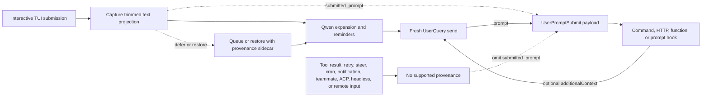

# Provenance du prompt soumis pour `UserPromptSubmit`

## Résumé

`UserPromptSubmit.prompt` est le prompt de l'invocation du modèle en cours. Il
peut contenir des rappels générés par Qwen, des fichiers et ressources
étendus, une sortie de slash command, une sortie d'extension ou un contexte
ajouté par un hook antérieur. Il ne peut donc pas répondre de manière fiable
à une question différente : quelle projection de texte a franchi une frontière
de saisie interactive prise en charge ?

Ce changement ajoute un champ optionnel `submitted_prompt` :

```ts
interface UserPromptSubmitInput {
  prompt: string;
  submitted_prompt?: string;
}
```

Le champ n'est renseigné que lorsque Qwen peut transporter la provenance
depuis une soumission TUI interactive prise en charge vers un `UserQuery` à
neuf. Les consommateurs qui exigent le texte soumis par l'utilisateur doivent
traiter un champ manquant comme indisponible et ne doivent pas retomber sur
`prompt`.

Le changement ne modifie ni le moment où `UserPromptSubmit` se déclenche, ni
la valeur `prompt` existante, ni l'ordre ou le blocage des hooks, ni le
comportement d'`additionalContext`.

## Objectifs et non-objectifs

Objectifs :

- Préserver le texte soumis via le TUI interactif pris en charge avant que
  Qwen ne l'étende.
- Transporter ce texte à travers les soumissions différées et restaurées sans
  l'associer à la mauvaise requête modèle.
- Ajouter le champ sans casser les consommateurs qui acceptent un JSON
  rétrocompatible.
- Rendre explicites tous les destinataires de données et frontières de
  confiance.

Non-objectifs :

- Modifier la sémantique de déclenchement de `UserPromptSubmit`.
- Inférer un prompt d'origine à partir du contenu destiné au modèle.
- Prendre en charge ACP, headless, distant, SDK ou d'autres producteurs de
  saisie dans ce changement.
- Fournir une authentification, une identité de tenant, une DLP ou une
  étiquette de sécurité immuable.
- Implémenter le rappel de contexte externe.

## Flux de données



La file reste orientée texte pour le rendu. La provenance est associée via un
sidecar interne et n'est consommée que lorsque le texte en file devient un
tour à neuf. Toute transformation ambiguë, tout lot partiel ou toute
restauration modifiée échoue en fail closed en omettant `submitted_prompt`.

Les placeholders de collage volumineux restent compacts dans
`submitted_prompt` ; leur contenu complet n'est étendu que dans le `prompt`
destiné au modèle. Cela préserve la projection TUI et évite de dupliquer un
contenu collé de plusieurs mégaoctets dans chaque payload de hook.

La restauration d'annulation conserve la propriété du tour principal
lorsqu'une question latérale `/btw` concurrente s'exécute. Comme cette
question latérale peut écrire une entrée utilisateur plus récente dans
l'historique sur disque, l'annulation ne supprime la dernière entrée
journalisée que si le tour principal la possède encore exclusivement. Ce
couplage garde le sidecar de provenance restauré et l'historique persistant
alignés au lieu de restaurer un tour tout en en supprimant un autre.

## Éligibilité

| Chemin                                                                             | `prompt`                   | `submitted_prompt`                               | Règle                                           |
| ---------------------------------------------------------------------------------- | -------------------------- | ------------------------------------------------ | ----------------------------------------------- |
| Nouvelle soumission TUI interactive envoyée comme `UserQuery`                      | Valeur destinée au modèle existante | Présent                                  | Capturer la projection rognée avant l'extension |
| Soumission TUI différée qui devient plus tard un tour à neuf                       | Valeur destinée au modèle existante | Présent uniquement avec une provenance complète | Préserver le sidecar pendant la mise en file    |
| Restauration exacte d'annulation ou de file suivie d'une resoumission              | Valeur destinée au modèle existante | Présent uniquement lorsque le texte restauré est inchangé | Réutiliser le sidecar uniquement pour une restauration exacte |
| Saisie restaurée modifiée ou partiellement connue                                  | Valeur destinée au modèle existante | Absent                                   | Ne pas deviner la provenance                    |
| Navigation dans l'historique de prompt, commande ou shell, ou correspondance de recherche sélectionnée | Valeur destinée au modèle existante | Absent                   | L'historique peut contenir des extensions générées |
| Prompt restauré depuis la réserve inter-redémarrage                                | Valeur destinée au modèle existante | Absent                                   | La réserve stocke le texte sans provenance      |
| Prompt restauré par le rewind de conversation                                      | Valeur destinée au modèle existante | Absent                                   | L'historique de rewind ne stocke que le texte destiné au modèle |
| Saisie de steering dans le même tour                                               | Comportement existant      | Absent                                           | Le steering n'est pas une nouvelle soumission prise en charge |
| Résultat d'outil ou continuation de hook                                           | Comportement existant      | Absent                                           | Préserver le comportement de continuation legacy |
| Trafic de retry, cron, notification ou coéquipier                                  | Comportement existant      | Absent                                           | Préserver le comportement de déclenchement existant |
| Prompt initial configuré par `--prompt-interactive`                                | Valeur destinée au modèle existante | Absent                                   | Il n'a pas franchi la frontière de saisie interactive |
| Saisie non vide présente lorsque le mode Vim est activé, y compris après la désactivation de Vim | Valeur destinée au modèle existante | Absent                   | Les registres Vim ne transportent pas la provenance |
| ACP, headless, `serve`, SDK, saisie distante ou saisie spéculative acceptée        | Comportement existant      | Absent                                           | Aucun producteur n'est ajouté dans ce changement |

Lorsqu'une saisie destinée au modèle restaurée ou sans provenance est effacée
ou soumise, le TUI rejette l'historique d'annulation et de rétablissement de
son tampon de texte avant qu'une saisie ultérieure puisse devenir éligible.
Cela empêche l'annulation de restaurer un texte destiné au modèle après que
son marqueur de provenance ou son sidecar a été consommé.

Toute saisie non vide présente lorsque Vim est activé reste inéligible après
la désactivation de Vim jusqu'à ce que le composer soit effacé. Cette règle
conservatrice couvre également les brouillons saisis avant l'activation de
Vim. Les registres Vim peuvent conserver du texte destiné au modèle à travers
les effacements de tampon, donc le changement de mode ne peut pas restaurer
la provenance du contenu existant.

La table définit uniquement la provenance. Le déclenchement des événements
existants reste inchangé, y compris les chemins qui ne déclenchent pas
`UserPromptSubmit`.

## Invariants

1. Le core sérialise `submitted_prompt` uniquement pour un `UserQuery` à neuf
   portant une chaîne non vide depuis un producteur pris en charge.
2. La valeur est préservée telle que reçue par le core ; le core ne la
   rogne pas, ne la reconstruit pas et ne la dérive pas de `prompt`.
3. Les mises à jour séquentielles d'`additionalContext` peuvent étendre
   `prompt` mais ne réécrivent pas `submitted_prompt`.
4. Les envois récursifs et pilotés par machine effacent la provenance.
5. Un lot en file n'est attribué que si chaque élément inclus a une
   provenance compatible. Sinon le lot omet le champ.
6. Un sidecar restauré est à usage unique et ne s'applique qu'à une
   resoumission exacte.
7. Une provenance manquante est un état normal, pas une erreur.

## Compatibilité et migration

Le contrat JSON du hook est extensible vers l'avant. Les décodeurs doivent
ignorer les champs inconnus. Les consommateurs qui rejettent intentionnellement
les champs inconnus, par exemple un JSON Schema avec
`additionalProperties: false`, doivent autoriser explicitement la propriété
optionnelle `submitted_prompt` avant la mise à niveau. Pour un hook sensible à
la sécurité, l'échec d'un décodeur strict peut changer le fait qu'une
invocation échoue en fail-open ou fail closed, donc les administrateurs
doivent tester le payload mis à niveau avec le hook déployé avant le
déploiement.

Les consommateurs existants qui ne lisent que `prompt` conservent leur
comportement actuel. Les consommateurs sensibles à la source doivent lire
`submitted_prompt` et ignorer, demander à l'utilisateur ou appliquer une
politique de fallback documentée lorsqu'il est absent. Utiliser silencieusement
`prompt` comme texte utilisateur d'origine n'est pas un fallback sûr.

## Frontières de confiance et de données

`submitted_prompt` est une provenance fournie par l'appelant. Ce n'est ni une
identité authentifiée, ni une décision d'autorisation, ni un lien de dépôt, ni
un résultat DLP. Il hérite de la confiance du processus Qwen local et du
producteur TUI pris en charge ; il n'établit pas de nouvelle frontière de
confiance. En particulier, un hook de fonction reçoit un objet in-process et
doit être traité comme du code fiable ; ce design ne revendique pas
l'immuabilité runtime contre un tel hook.

Tous les exécuteurs de hook configurés reçoivent le payload de l'événement :

| Type de hook | Destinataire                                              |
| ------------ | --------------------------------------------------------- |
| Command      | Processus enfant via l'entrée standard                    |
| HTTP         | Endpoint configuré via le corps POST                      |
| Function     | Callback in-process fiable                                  |
| Prompt       | Fournisseur de modèle configuré après substitution de `$ARGUMENTS` |

Les opérateurs doivent traiter à la fois `prompt` et `submitted_prompt` comme
potentiellement sensibles. Les hooks de prompt envoient le payload à un
fournisseur de modèle. La journalisation de débogage sur fichier enregistre la
requête de hook de prompt entièrement étendue, donc sa rétention et ses
contrôles d'accès doivent correspondre aux données soumises. Un hook peut
également copier son entrée dans sa propre sortie, erreur, log ou système en
aval ; ces destinations sont hors des garanties de ce champ.

Lorsque les deux champs sont présents, les payloads de hook de prompt
contiennent du texte qui se chevauche et peuvent consommer des tokens d'entrée
de modèle supplémentaires. Ce contrat ne fournit pas de suppression de champ
par hook.

La télémétrie des appels de hook exporte actuellement les métadonnées du hook
plutôt que l'entrée complète, mais ce détail d'implémentation n'est pas une
frontière de confidentialité et les consommateurs ne doivent pas s'y fier.

## Pourquoi cela diffère de Claude Code

Claude Code exécute `UserPromptSubmit` à sa frontière de soumission
utilisateur, avant que le contrôle n'entre dans la boucle de requête du
modèle. La récursion des résultats d'outil ne franchit pas cette frontière,
donc son `prompt` existant représente naturellement la saisie soumise.

Qwen Code exécute le hook plus près de son pipeline partagé d'envoi au modèle
et préserve le comportement legacy sur davantage de chemins d'envoi. Déplacer
l'événement serait un changement sémantique plus large et cassant. Un champ de
provenance additif donne aux appelants TUI pris en charge le signal de
frontière manquant tout en préservant les intégrations existantes.

## Vérification

Les tests unitaires couvrent le gate de sérialisation du core, le chaînage des
hooks, la capture TUI, la projection des collages volumineux, les files
différées, la restauration exacte et modifiée, l'effacement de provenance et
les lots incomplets. La couverture E2E interactive capture un véritable
payload de hook de commande et confirme que l'extension peut modifier `prompt`
sans modifier `submitted_prompt` et qu'une continuation de résultat d'outil
omet le champ.
