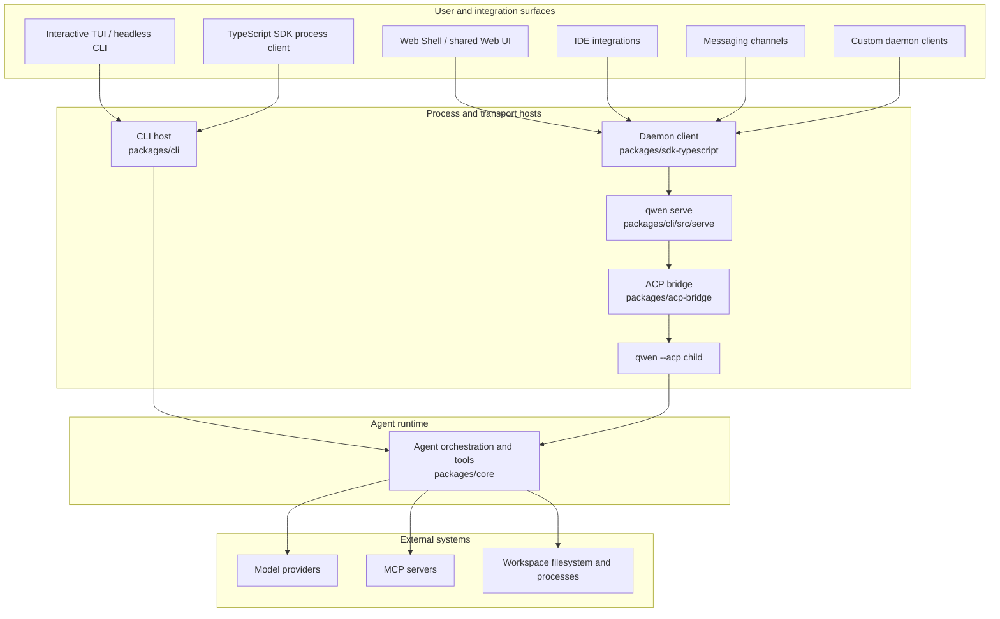

# Aperçu de l'architecture de Qwen Code

Qwen Code est un monorepo qui prend en charge un terminal interactif, une exécution headless et programmatique, l'Agent Client Protocol (ACP), un démon HTTP à exécution prolongée, des clients web et IDE, ainsi que des adaptateurs de canaux de messagerie. Ce document associe ces surfaces aux packages qui les implémentent et explique les principales frontières d'exécution.

Pour les détails internes du démon, commencez par la
[documentation du démon](./daemon/00-index.md). Pour les formes des requêtes HTTP et des événements, consultez la [référence du protocole `qwen serve`](./qwen-serve-protocol.md).

## Le système en un coup d'œil

Qwen Code dispose de deux modèles d'exécution d'agent :

- **Exécution directe :** le TUI interactif et le CLI headless construisent et exécutent directement le runtime de l'agent.
- **Exécution ACP :** `qwen --acp` héberge l'agent derrière un transport ACP. Il peut être piloté directement par un client ACP ou par `qwen serve` via le bridge ACP partagé.

`qwen serve` ajoute un plan de contrôle HTTP + Server-Sent Events (SSE) autour de l'exécution ACP afin que plusieurs clients puissent utiliser des runtimes à vie longue, limités à un workspace.

Le diagramme montre les principaux chemins de production. Certains adaptateurs disposent également de modes autonomes : par exemple, `qwen channel start` utilise le bridge ACP sans nécessiter de démon HTTP. Consultez le
[guide des plugins de canal](./channel-plugins.md#runtime-modes) pour ces variantes.

## Structure du dépôt

| Path                                                                                                       | Responsibility                                                                                                                                                                                   |
| ---------------------------------------------------------------------------------------------------------- | ------------------------------------------------------------------------------------------------------------------------------------------------------------------------------------------------ |
| `packages/cli`                                                                                             | L'exécutable `qwen`, l'analyse des arguments, l'assemblage de la configuration, le TUI Ink, la sortie headless, le point d'entrée ACP, `qwen serve`, et les adaptateurs spécifiques aux commandes. |
| `packages/core`                                                                                            | Orchestration de l'agent indépendante de l'UI, intégration des fournisseurs de modèles, construction des prompts et du contexte, enregistrement et exécution des outils, permissions, sessions, mémoire, télémétrie, et services partagés. |
| `packages/acp-bridge`                                                                                      | Cycle de vie du canal ACP, multiplexage de sessions, livraison d'événements, médiation des permissions, lancement de processus, et la couture filesystem partagée par le démon et les hôtes adaptateurs. |
| `packages/sdk-typescript`                                                                                  | Exécution programmatique de processus via `query()` plus clients HTTP/SSE et projection de transcription pour `qwen serve`.                                                                       |
| `packages/webui`                                                                                           | Composants React partagés et l'adaptateur React du démon construit sur le SDK TypeScript.                                                                                                                |
| `packages/web-shell`                                                                                       | L'UI navigateur de type terminal construite sur `packages/webui` et le SDK du démon.                                                                                                                      |
| `packages/web-templates`                                                                                   | Templates web empaquetés sous forme de chaînes JavaScript et CSS intégrables.                                                                                                                                 |
| `packages/audio-capture`                                                                                   | Capture native du microphone pour la saisie vocale.                                                                                                                                                       |
| `packages/channels`                                                                                        | Le runtime de canal partagé et les adaptateurs de plateforme pour les services de messagerie.                                                                                                                         |
| `packages/desktop`, `packages/vscode-ide-companion`, `packages/chrome-extension`, `packages/zed-extension` | Surfaces produit et éditeur qui adaptent Qwen Code à leurs environnements hôtes.                                                                                                                     |
| `packages/sdk-java`, `packages/sdk-python`                                                                 | Clients programmatiques spécifiques à un langage.                                                                                                                                                          |
| `packages/cua-driver`, `packages/mobile-mcp`                                                               | Intégrations computer-use et appareils mobiles exposées via des frontières compatibles MCP.                                                                                                           |
| `integration-tests`                                                                                        | Couverture de bout en bout pour le CLI, l'interactif, le SDK, la sandbox, les hooks et le comportement du terminal.                                                                                                             |
| `docs` et `docs-site`                                                                                     | Documentation utilisateur, développeur, protocole et conception, ainsi que le site de documentation.                                                                                                                 |
| `scripts`                                                                                                  | Automatisation de la build, du packaging, des releases, de la validation et de la maintenance du dépôt.                                                                                                                    |

La majeure partie du code se trouve dans les workspaces npm sous `packages/`. Un package doit dépendre d'un autre package via ses exports publics déclarés plutôt que via un chemin relatif vers l'arbre source de ce package.

## Frontières des packages

### CLI et surfaces de présentation

`packages/cli` possède l'exécutable et choisit le mode d'exécution à partir des arguments de ligne de commande. Il charge les paramètres utilisateur et du workspace, construit la configuration du core, entre dans la sandbox demandée si nécessaire, puis démarre l'un des flux interactif, headless, ACP, démon, canal ou maintenance.

La présentation reste en dehors du runtime core :

- le TUI Ink rend les sessions interactives locales ;
- `packages/webui` adapte l'état du démon aux providers et hooks React ;
- `packages/web-shell` fournit l'expérience de terminal dans le navigateur ;
- les packages IDE et canal traduisent les événements spécifiques à l'hôte en contrats partagés de client ou de bridge.

### Runtime core

`packages/core` possède la boucle de l'agent. Il construit les requêtes modèle, maintient le contexte de conversation, distribue les appels d'outils, applique la politique de permissions et renvoie des événements et résultats structurés à l'hôte actif. Les outils intégrés couvrent les opérations sur les fichiers, l'exécution shell, la recherche, la planification, l'accès web, la mémoire, les skills et les sous-agents. MCP étend la surface des outils et des ressources sans coupler le runtime à une intégration spécifique.

Le package core ne décide pas comment les résultats sont affichés ni comment un client distant les transporte. Ces décisions appartiennent aux couches CLI, bridge, SDK et UI.

### Bridge ACP

`packages/acp-bridge` connecte un processus hôte à un runtime d'agent ACP. Ses principales responsabilités sont :

- lancer ou s'attacher à un canal ACP ;
- multiplexer les sessions et les clients ;
- transmettre les prompts, les annulations et les notifications ACP ;
- assurer la médiation des demandes de permissions ;
- publier des flux d'événements de session bornés ;
- fournir une interface filesystem du workspace à l'hôte.

Le bridge peut utiliser un véritable processus enfant `qwen --acp` en production ou un canal en mémoire dans les tests. Consultez le
[README `@qwen-code/acp-bridge`](../../packages/acp-bridge/README.md) pour ses points d'entrée publics.

### SDK et adaptateurs UI

Le SDK TypeScript expose deux styles de clients :

- `query()` démarre et contrôle un processus Qwen Code pour un usage local programmatique ;
- les clients du démon communiquent avec `qwen serve` via HTTP et SSE.

`packages/webui` construit une couche d'état React sur le client du démon, et `packages/web-shell` construit l'UI navigateur sur cette couche d'état. D'autres clients, dont les intégrations IDE et les canaux gérés par le démon, réutilisent les mêmes contrats SDK et événements au lieu d'importer le code d'implémentation du serveur.

## Flux d'exécution

### Flux CLI direct

1. Le CLI analyse les arguments et résout la configuration utilisateur, du workspace, de l'environnement et de la ligne de commande.
2. Il prépare le sandboxing et construit la configuration du runtime core.
3. Le runtime core construit la requête modèle et entre dans la boucle agent/outils.
4. Les appels d'outils sont vérifiés par rapport à la politique de permissions et exécutés dans l'environnement de workspace actif.
5. Le CLI rend les événements incrémentaux dans le TUI ou les sérialise pour la sortie headless.

### Flux du démon

1. Un client utilise le SDK TypeScript ou l'API HTTP documentée pour se connecter à `qwen serve`.
2. Le démon authentifie la requête et résout le workspace propriétaire de l'opération demandée.
3. Le runtime du workspace transmet les opérations de l'agent via son bridge ACP à un processus enfant `qwen --acp`.
4. L'enfant exécute la même logique core d'agent et d'outils que l'exécution directe.
5. Les réponses et notifications reviennent via le bridge ; les événements de session sont livrés aux clients via SSE.

Avec les sessions multi-workspaces activées, chaque runtime de workspace live possède son propre bridge et son propre enfant ACP. L'accès au filesystem, les surcouches d'environnement, les transports MCP, les sessions et la gestion des erreurs restent limités au runtime résolu. L'[architecture du démon](./daemon/01-architecture.md) documente en détail la topologie des processus, les frontières de confiance, la relecture d'événements et le cycle de vie.

## Points d'extension

Qwen Code peut être étendu à plusieurs niveaux :

- **Les serveurs MCP** ajoutent des outils, des prompts et des ressources au runtime core.
- **Les extensions et skills** empaquettent des commandes réutilisables, de la configuration et du comportement d'agent.
- **Les plugins de canal** adaptent les plateformes de messagerie au runtime de canal partagé.
- **Les clients SDK** construisent des applications personnalisées locales ou adossées au démon.
- **Les adaptateurs UI** projettent les événements partagés du démon dans un état et une présentation spécifiques à l'hôte.

Maintenez les préoccupations spécifiques à la plateforme dans les adaptateurs. Le comportement partagé de l'agent appartient au runtime core, tandis que le comportement de transport et de protocole appartient au bridge ACP, au SDK ou à l'hôte du démon.

## Configuration et état

Le CLI assemble la configuration effective à partir des arguments de ligne de commande, des variables d'environnement, des paramètres utilisateur, des paramètres du workspace et des valeurs par défaut avant de construire le runtime. Le core reçoit la configuration résolue plutôt que de lire des entrées spécifiques à la présentation. Consultez
[Settings](../users/configuration/settings.md) pour les paramètres pris en charge et leurs portées.

Les sessions directes persistent leur historique et leurs métadonnées via des services core partagés. En mode démon, le démon résout le workspace propriétaire et expose aux clients des opérations limitées au workspace et à la session ; l'enfant ACP reste propriétaire de l'exécution live de l'agent.

## Où aller ensuite

- [Documentation développeur du démon](./daemon/00-index.md)
- [Protocole HTTP `qwen serve`](./qwen-serve-protocol.md)
- [SDK TypeScript](../../packages/sdk-typescript/README.md)
- [Bridge ACP](../../packages/acp-bridge/README.md)
- [Guide développeur des plugins de canal](./channel-plugins.md)
- [Développement d'outils](./tools/introduction.md)
- [Tests d'intégration](./development/integration-tests.md)
