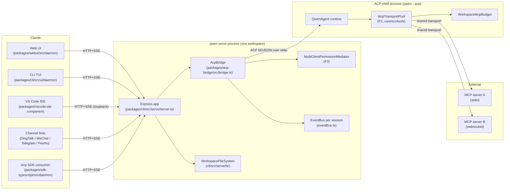
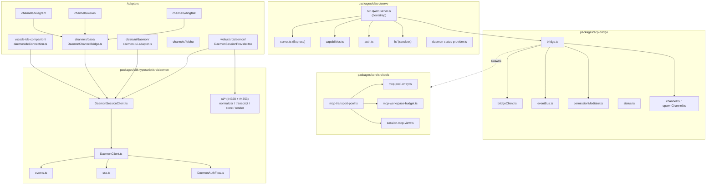
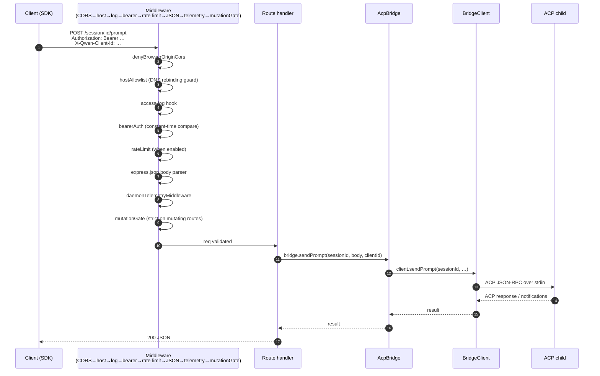
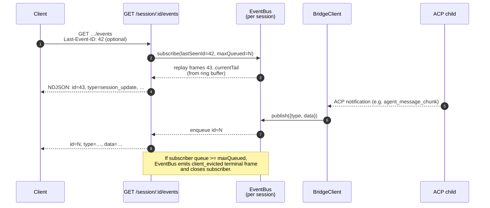
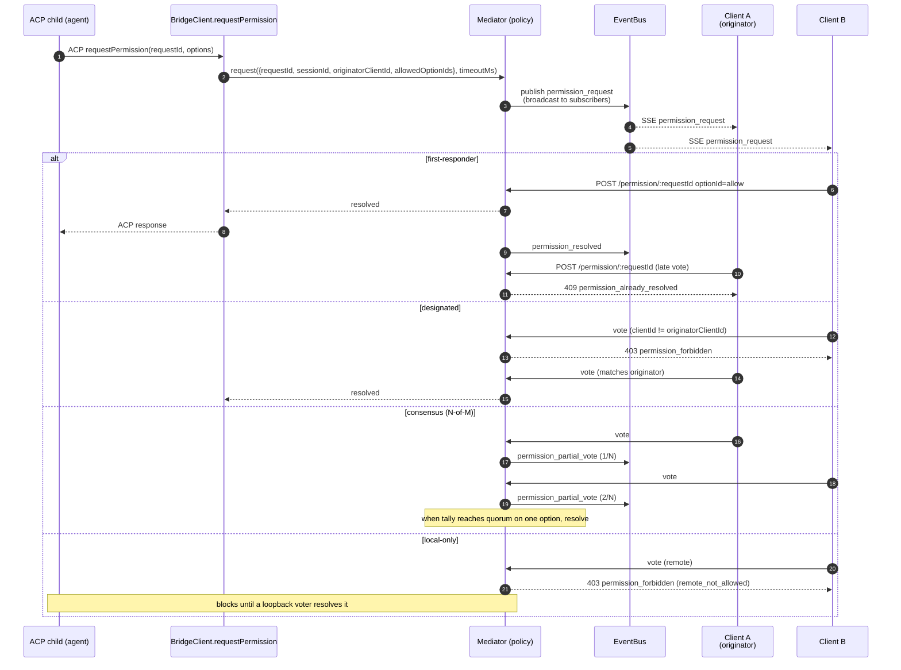
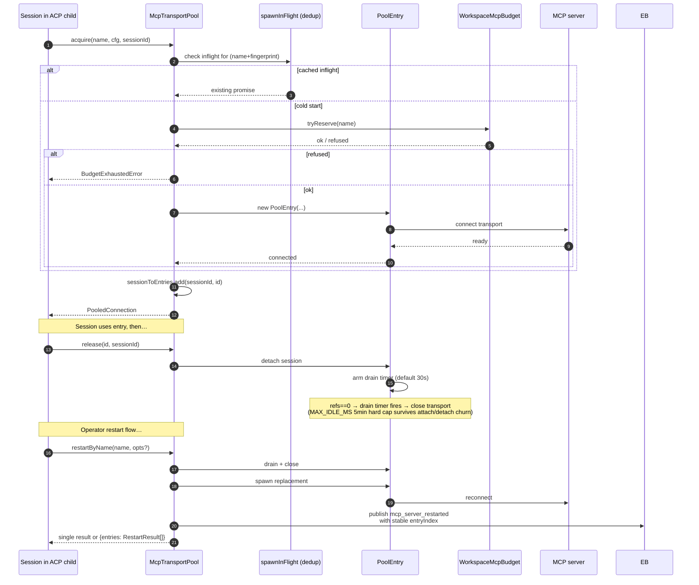
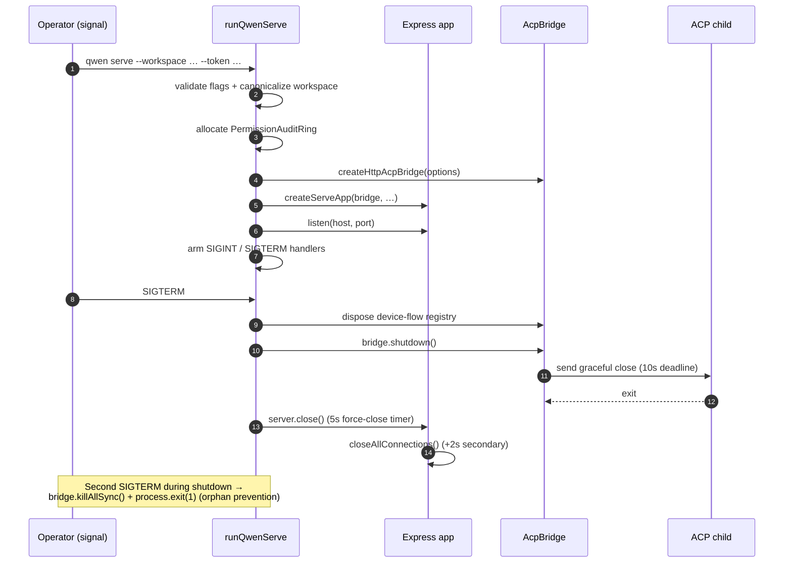

# Architecture du démon

## Vue d'ensemble

Un processus `qwen serve` correspond à **un démon = un espace de travail**. Il héberge un seul serveur HTTP Express, possède une instance `@qwen-code/acp-bridge`, et lance un processus enfant ACP (`qwen --acp`) qui exécute le véritable environnement d'exécution de l'agent. Plusieurs clients (TUI CLI, compagnon IDE, robots de canaux de messagerie, BFFs web, scripts personnalisés) se connectent via HTTP + SSE et soit partagent une session ACP (`sessionScope: 'single'`, par défaut), soit répartissent les sessions par fil de discussion (`sessionScope: 'thread'`).

À l'intérieur de l'enfant ACP, les serveurs MCP sont partagés à l'échelle de l'espace de travail via `McpTransportPool` (F2) : un seul tuple (nom du serveur + empreinte de configuration) correspond à un transport MCP, quel que soit le nombre de sessions qui le découvrent. Le `MultiClientPermissionMediator` (F3) du pont coordonne les votes d'autorisation parmi tous les clients connectés selon l'une des quatre politiques.

Ce document donne la **vue d'ensemble au niveau système** sur laquelle repose le reste de cette documentation. Chaque flux critique est représenté sous forme de diagramme de séquence Mermaid ; les détails d'implémentation par composant se trouvent dans les 18 autres documents.

## Topologie des processus

Le processus démon et l'enfant ACP sont connectés par un `AcpChannel` (par défaut : une paire de tubes stdio réels de sous-processus ; `inMemoryChannel` pour les tests). Tout ce que fait le démon est façonné par cette séparation : le trafic HTTP et SSE se termine dans le démon, les décisions de l'agent et les invocations d'outils se produisent dans l'enfant, et le pont relie les deux.

## Carte des paquets

Trois limites de confiance sont importantes : la frontière HTTP (chaîne de middleware `serve/auth.ts`), la frontière pont-enfant ACP (NDJSON sur stdio, sans authentification ; l'enfant fait implicitement confiance au pont), et la frontière agent-serveur MCP (l'agent peut invoquer des outils qui touchent l'hôte).
## Workflow 1 : Cycle de vie d'une requête HTTP

Les routes non-streaming (prompt, annulation, changement de modèle, métadonnées, CRUD d'espace de travail) se terminent par une réponse JSON unique. La sortie en streaming est délivrée hors bande sur le canal SSE, **pas** comme un corps HTTP fragmenté sur cette connexion. Voir le workflow 2.

## Workflow 2 : Distribution et relecture des événements SSE

Le tampon circulaire est limité (`eventRingSize`, par défaut 8000). Un client qui se reconnecte avec un `Last-Event-ID` plus ancien que la tête du tampon reçoit un signal de rattrapage synthétique et doit appeler `loadSession` / `resumeSession` pour reconstruire un état plus profond. Les clients lents déclenchent `slow_client_warning` à 75% de remplissage de la file et `client_evicted` à la limite.

## Workflow 3 : Médiation des permissions multi-client

Trappe de secours inter-politique : tout client peut voter `CANCEL_VOTE_SENTINEL` pour court-circuiter la requête en tant que `cancelled / agent_cancelled`. Le pont se protège contre les appelants réseau qui feraient passer le sentinelle via le champ normal `optionId` (`InvalidPermissionOptionError`).

## Workflow 4 : Acquisition / libération / redémarrage du pool de transport MCP

`releaseSession(sessionId)` utilise l'index inverse `sessionToEntries` pour libérer chaque entrée que la session détient en O(refs). À l'arrêt du daemon, `drainAll()` positionne le drapeau `draining` (refusant toute nouvelle acquisition) et attend la fermeture de chaque entrée dans un délai configurable.

## Workflow 5 : Cycle de vie — démarrage et arrêt gracieux

L'arrêt en deux phases est important car les requêtes HTTP en cours, les abonnés SSE en cours et les appels d'outils en cours du processus ACP ont tous besoin de fenêtres d'arrêt limitées. Si quelque chose bloque au-delà de ces délais, le chemin de fermeture forcée prend le relais afin qu'un processus enfant bloqué ne puisse pas maintenir le processus du daemon en vie.

## Fichiers critiques

| Domaine              | Fichier                                                     |
| -------------------- | ----------------------------------------------------------- |
| Bootstrap            | `packages/cli/src/serve/run-qwen-serve.ts`                    |
| Application Express  | `packages/cli/src/serve/server.ts`                          |
| Registre de capacités| `packages/cli/src/serve/capabilities.ts`                    |
| Middleware d'authentification | `packages/cli/src/serve/auth.ts`                     |
| Pont                 | `packages/acp-bridge/src/bridge.ts`                         |
| BridgeClient         | `packages/acp-bridge/src/bridgeClient.ts`                   |
| Médiateur d'autorisation | `packages/acp-bridge/src/permissionMediator.ts`          |
| EventBus             | `packages/acp-bridge/src/eventBus.ts`                       |
| Pool de transports MCP | `packages/core/src/tools/mcp-transport-pool.ts`           |
| Budget MCP de l'espace de travail | `packages/core/src/tools/mcp-workspace-budget.ts`   |
| FS de l'espace de travail | `packages/cli/src/serve/fs/`                             |
| DaemonClient SDK     | `packages/sdk-typescript/src/daemon/DaemonClient.ts`        |
| SessionClient SDK    | `packages/sdk-typescript/src/daemon/DaemonSessionClient.ts` |
| Schéma d'événements  | `packages/sdk-typescript/src/daemon/events.ts`              |

## Références

- Problèmes de conception : [#3803](https://github.com/QwenLM/qwen-code/issues/3803) (conception du daemon), [#4175](https://github.com/QwenLM/qwen-code/issues/4175) (jalons de la série F).
- Guide utilisateur : [`../../users/qwen-serve.md`](../../users/qwen-serve.md).
- Référence du protocole filaire : [`../qwen-serve-protocol.md`](../qwen-serve-protocol.md).
- Document de conception F2 : [`../../design/f2-mcp-transport-pool.md`](../../design/f2-mcp-transport-pool.md).
- Notes de conception F2 : issue [#4175](https://github.com/QwenLM/qwen-code/issues/4175) commits 4-6.
