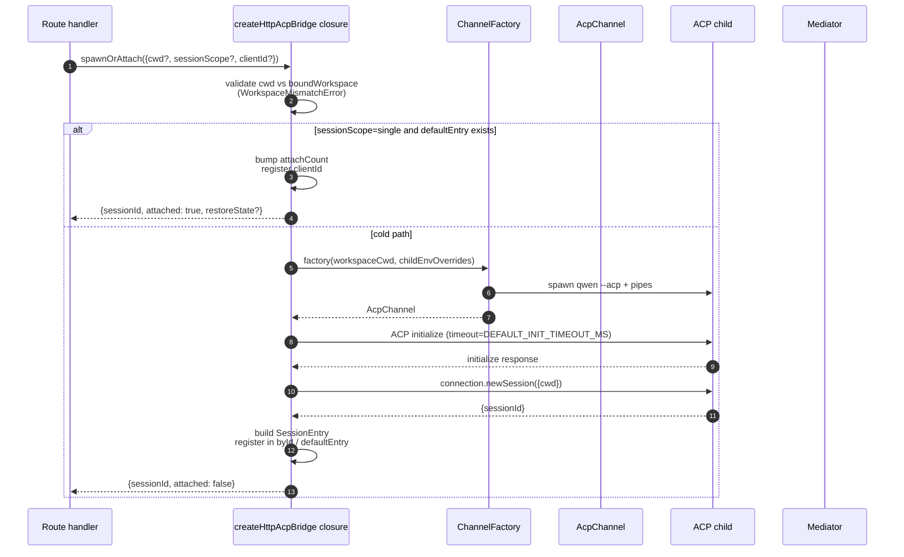
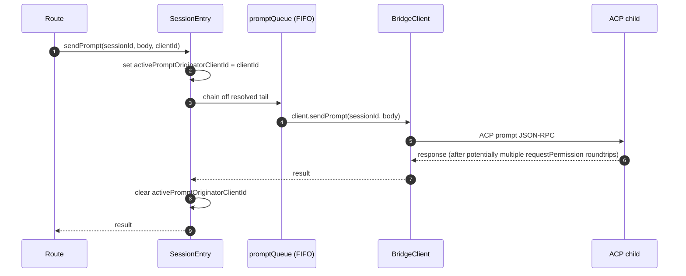
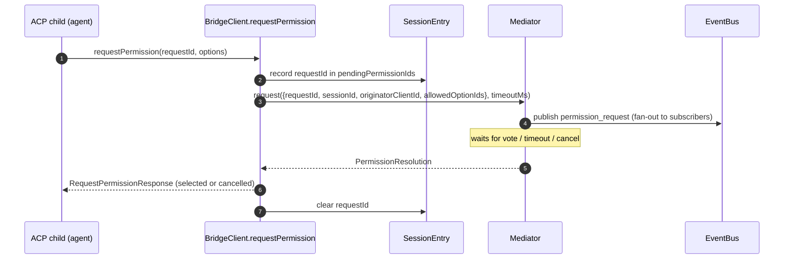
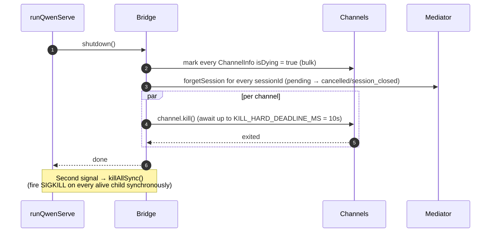

# Pont ACP

## Vue d'ensemble

`packages/acp-bridge/` gère la frontière entre la couche HTTP du démon et le processus enfant ACP. Il est consommé par `packages/cli/src/serve/` (le démon `qwen serve`) et a été extrait dans #4175 F1 étape 3 afin que de futurs consommateurs (`channels/base/AcpBridge.ts`, le compagnon IDE VS Code) puissent utiliser le même cœur de pont sans dépendre du package CLI.

Le pont fournit une instance `HttpAcpBridge`, un `AcpChannel` vers l'enfant ACP, des sessions multiplexées sur ce canal, des `EventBus` par session, un `MultiClientPermissionMediator`, un adaptateur `BridgeFileSystem`, et des assistants orientés ACP (`spawnOrAttach`, `loadSession`, `resumeSession`, `sendPrompt`, `cancelSession`, `respondToPermission`, plus des RPC extMethod pour le statut de l'espace de travail et le redémarrage MCP).

## Responsabilités

- Lancer ou attacher l'enfant ACP via une `ChannelFactory` enfichable. Fabrique par défaut : `defaultSpawnChannelFactory` (sous-processus `qwen --acp`). Les tests injectent `inMemoryChannel`.
- Maintenir `aliveChannels` (registre des canaux) et `byId` (registre des sessions).
- Multiplexer N sessions côté HTTP sur un seul enfant ACP via `connection.newSession()`.
- Sérialiser les invites par session via `promptQueue` (ACP impose une invite active par session).
- FIFO par session pour les appels `setSessionModel` afin que les attachements concurrents avec différents modèles ne provoquent pas de course avec l'agent.
- `EventBus` par session qui pilote `GET /session/:id/events` (voir [`10-event-bus.md`](./10-event-bus.md)).
- Flux d'autorisation : `BridgeClient.requestPermission` → `MultiClientPermissionMediator.request` → diffusion → collecte des votes → réponse ACP (voir [`04-permission-mediation.md`](./04-permission-mediation.md)).
- E/S de fichiers : adaptateur `BridgeFileSystem` pour les appels ACP `readTextFile` / `writeTextFile` (voir [`07-workspace-filesystem.md`](./07-workspace-filesystem.md)).
- RPC extMethod pour le statut au niveau de l'espace de travail (`/workspace/mcp`, `/workspace/skills`, `/workspace/providers`) et redémarrage MCP.
- Cycle de vie : `shutdown()` gracieux avec `KILL_HARD_DEADLINE_MS` (10s) par canal ; `killAllSync()` synchrone pour la sortie forcée au second signal.

## Architecture

**Point d'entrée public** : `createHttpAcpBridge(opts: BridgeOptions): HttpAcpBridge` dans `packages/acp-bridge/src/bridge.ts`.

**Types clés** :

| Type                            | Fichier                    | Rôle                                                                                                                                                                                                                  |
| ------------------------------- | -------------------------- | --------------------------------------------------------------------------------------------------------------------------------------------------------------------------------------------------------------------- |
| `HttpAcpBridge`                 | `bridgeTypes.ts`           | Interface publique : `spawnOrAttach`, `loadSession`, `resumeSession`, `sendPrompt`, `cancelSession`, `subscribeEvents`, `respondToPermission`, `getWorkspaceMcpStatus`, `restartMcpServer`, `shutdown`, `killAllSync`, … |
| `BridgeSession`                 | `bridgeTypes.ts`           | `{ sessionId, workspaceCwd, attached, clientId?, createdAt? }` retourné aux gestionnaires HTTP.                                                                                                                             |
| `BridgeOptions`                 | `bridgeOptions.ts`         | Configuration à la construction (voir [Configuration](#configuration)).                                                                                                                                                       |
| `AcpChannel`                    | `channel.ts`               | `{ stream, kill(), killSync(), exited }` — un canal ACP NDJSON.                                                                                                                                                    |
| `ChannelFactory`                | `channel.ts`               | `(workspaceCwd, childEnvOverrides?) => Promise<AcpChannel>`.                                                                                                                                                          |
| `BridgeClient`                  | `bridgeClient.ts`          | Encapsule une `ClientSideConnection` ACP ; implémente le `Client` ACP (`requestPermission`, `readTextFile`, `writeTextFile`, `sessionUpdate`, `extNotification`).                                                             |
| `EventBus`                      | `eventBus.ts`              | Pub/sous au sein de la session en mémoire. Voir [`10-event-bus.md`](./10-event-bus.md).                                                                                                                                            |
| `MultiClientPermissionMediator` | `permissionMediator.ts`    | Médiateur à quatre politiques. Voir [`04-permission-mediation.md`](./04-permission-mediation.md).                                                                                                                               |
**État interne (capturé par `createHttpAcpBridge`)** :

| État               | Forme                            | Objectif                                                                                                                                                                                                                                                                                                                                                                                                  |
| ------------------ | -------------------------------- | -------------------------------------------------------------------------------------------------------------------------------------------------------------------------------------------------------------------------------------------------------------------------------------------------------------------------------------------------------------------------------------------------------- |
| `aliveChannels`    | `Map<string, ChannelInfo>`       | Registre des canaux indexé par identifiant de canal. Chaque `ChannelInfo` contient `channel`, `connection`, `client` (un `BridgeClient` par canal), `sessionIds: Set<string>`, `pendingRestoreIds`, `statusClosedReject?`, `isDying: boolean`.                                                                                                                                                            |
| `byId`             | `Map<string, SessionEntry>`      | Registre des sessions indexé par sessionId. Chaque `SessionEntry` contient `channel`, `connection`, `events: EventBus`, `promptQueue: Promise<void>`, `modelChangeQueue: Promise<void>`, `pendingPermissionIds: Set<string>`, `clientIds: Map<string, count>`, `activePromptOriginatorClientId?`, `attachCount`, `spawnOwnerWantedKill`, `restoreState?`, `sessionLastSeenAt?`, `clientLastSeenAt: Map<string, ms>`. |
| `defaultEntry`     | `SessionEntry \| null`            | La session « unique » utilisée quand `sessionScope: 'single'`.                                                                                                                                                                                                                                                                                                                                           |
| `defaultPolicy`    | `PermissionPolicy`                | Configurée via `BridgeOptions.permissionPolicy`.                                                                                                                                                                                                                                                                                                                                                         |
| `mediator`         | `MultiClientPermissionMediator`   | Un médiateur par instance de pont.                                                                                                                                                                                                                                                                                                                                                                       |
| Constantes         | —                                | `DEFAULT_INIT_TIMEOUT_MS = 10_000`, `MCP_RESTART_TIMEOUT_MS = 300_000`, `DEFAULT_MAX_SESSIONS = 20`, `MAX_EVENT_RING_SIZE = 1_000_000`, `DEFAULT_PERMISSION_TIMEOUT_MS = 5min`, `DEFAULT_MAX_PENDING_PER_SESSION = 64`.                                                                                                                                                                                  |

**Invariant `isDying`** : tout chemin de démontage doit positionner `ChannelInfo.isDying = true` de manière synchrone **avant** d'attendre `channel.kill()`. `ensureChannel` traite un canal en état de « dying » comme absent et en crée un nouveau. Sans ce flag, un `spawnOrAttach` concurrent arrivant pendant la fenêtre de grâce SIGTERM (jusqu'à 10s) s'attacherait à un transport sur le point de se fermer, et le sessionId de l'appelant répondrait en 404 à chaque requête suivante. **Points d'affectation** (doivent rester synchronisés) : `ensureChannel` (échec d'initialisation + re-vérification lors d'un arrêt tardif), `doSpawn` (échec de newSession sur canal vide), `killSession` (dernière session quittant), `shutdown` (en masse).

**Invariant de rétention de `channelInfo`** : ne **pas** effacer `channelInfo` lorsqu'on positionne `isDying = true`. `killAllSync` doit encore trouver le canal pendant la fenêtre de grâce SIGTERM pour envoyer SIGKILL sur `process.exit(1)`. `aliveChannels` conserve l'entrée « dying » jusqu'à ce que `channel.exited` se déclenche.

**Tamponnement limité du BridgeClient** : Les trames ACP `extNotification` arrivant sur `BridgeClient` pour un sessionId pas encore présent dans `byId` (parce que la réponse de `connection.newSession` n'est pas encore revenue, mais la découverte MCP à l'intérieur de `newSession` a déjà émis des événements de budget) sont mises en file d'attente dans une queue d'événements précoces limitée par `MAX_EARLY_EVENT_SESSIONS = 64` × `MAX_EARLY_EVENTS_PER_SESSION = 32` × `EARLY_EVENT_TTL_MS = 60_000`. Le pire cas représente environ 400 Ko de tas. Sans tamponnement, le premier emplacement du ring SSE pour une nouvelle session manquerait les événements émis pendant sa création.
## Workflow

### `spawnOrAttach` (point d'entrée principal)

Points clés :

- `sessionScope='single'` avec un `defaultEntry` existant ne fait qu'incrémenter `attachCount`, enregistrer `clientId`, et retourner `attached: true`.
- Le chemin froid exécute ChannelFactory, effectue l'initialisation ACP (`DEFAULT_INIT_TIMEOUT_MS=10s`), appelle `connection.newSession({cwd})`, puis enregistre la nouvelle `SessionEntry`.
- `SessionLimitExceededError` est levée lorsque `byId.size >= maxSessions`.
- `InvalidClientIdError` est levée si `X-Qwen-Client-Id` n'est pas dans l'intervalle `[A-Za-z0-9._:-]{1,128}`.
- Le « disconnect-reaper » dans `server.ts` suit le propriétaire du spawn via `attachCount`/`spawnOwnerWantedKill` pour éviter de démonter une session dont le propriétaire du spawn s'est déconnecté mais où d'autres clients sont déjà attachés (revue #3889 BQ9tV).

### Sérialisation des prompts

Les échecs en queue de file sont **avalés** afin que le rejet d'une requête précédente n'empoisonne pas les requêtes suivantes ; l'appelant original reçoit toujours le rejet sur sa propre promesse retournée. Le `transportClosedReject` mis en cache sur la session met en concurrence la promesse de la requête avec `channel.exited` de sorte qu'un enfant planté se manifeste immédiatement plutôt que de bloquer.

### Flux de permissions (vue d'ensemble)

`InvalidPermissionOptionError` est levée avant le médiateur lorsqu'un vote filaire tente d'injecter `CANCEL_VOTE_SENTINEL` via le champ normal `optionId` — le sentinelle est la seule échappatoire du pont pour court-circuiter une requête en `cancelled / agent_cancelled` et ne doit pas être accessible depuis le filaire par accident. Voir [`04-permission-mediation.md`](./04-permission-mediation.md).

### Arrêt

## Channel factory

`AcpChannel` (`channel.ts`) est l'abstraction de transport du pont. En production, `defaultSpawnChannelFactory` dans `spawnChannel.ts` est utilisée, qui exécute `qwen --acp` comme un sous-processus avec une paire de pipes stdio. Les tests injectent `inMemoryChannel` pour exécuter l'agent en processus. Le pont ne connaît rien du mécanisme sous-jacent — il a seulement besoin de `{ stream, kill, killSync, exited }`.

`ChannelFactory` accepte `childEnvOverrides` afin que chaque poignée de démon puisse passer ses propres variables d'environnement de budget MCP (`QWEN_SERVE_MCP_CLIENT_BUDGET`, `QWEN_SERVE_MCP_BUDGET_MODE`) sans modifier `process.env` (ce qui créerait une course lorsque deux démons embarqués s'exécutent dans le même processus Node).
## État & Cycle de vie

- La construction du pont est synchrone ; le premier `spawnOrAttach` démarre à froid l'enfant ACP.
- `defaultEntry` vit pendant toute la durée de vie du pont sous `sessionScope: 'single'` ; le canal se rétracte lorsque `sessionIds.size === 0` (après `killSession`) ET `isDying` passe à vrai.
- `MAX_EVENT_RING_SIZE = 1_000_000` est une limite supérieure souple pour `BridgeOptions.eventRingSize` afin de détecter les fautes de frappe de l'opérateur avant un OOM d'environ 500 Mo par session.
- `DEFAULT_PERMISSION_TIMEOUT_MS = 5 * 60 * 1000` empêche une demande d'autorisation bloquée de bloquer indéfiniment la `promptQueue` par session.
- `DEFAULT_MAX_PENDING_PER_SESSION = 64` correspond à `DEFAULT_MAX_SUBSCRIBERS` ; les appels `requestPermission` en excès sont résolus comme annulés avec un avertissement sur stderr.

## Dépendances

| Amont                                                                                        | Aval                                          |
| -------------------------------------------------------------------------------------------- | --------------------------------------------- |
| `@agentclientprotocol/sdk` — `ClientSideConnection`, `PROTOCOL_VERSION`, types ACP            | `packages/cli/src/serve/` (le démon)          |
| `@qwen-code/qwen-code-core` — `ApprovalMode`, `TrustGateError`, `getCurrentGeminiMdFilename` | `packages/channels/base/` (prévu, V4)         |
| `node:crypto`, `node:fs`, `node:path`                                                        | `packages/vscode-ide-companion/` (prévu, V4)  |

## Configuration

`BridgeOptions` (`bridgeOptions.ts`) :

| Clé                                           | Défaut                                             | Objectif                                                                                                                |
| --------------------------------------------- | -------------------------------------------------- | ----------------------------------------------------------------------------------------------------------------------- |
| `boundWorkspace`                              | (obligatoire)                                      | Chemin d'espace de travail canonique imposé par le pont.                                                                |
| `sessionScope`                                | `'single'`                                         | `'single'` partage une session entre tous les clients ; `'thread'` crée une session distincte pour chaque fil de discussion. |
| `channelFactory`                              | `defaultSpawnChannelFactory`                       | Fabrique enfichable d'enfant ACP.                                                                                       |
| `initializeTimeoutMs`                         | `DEFAULT_INIT_TIMEOUT_MS = 10_000`                 | Délai d'attente de la poignée de main ACP `initialize`.                                                                 |
| `maxSessions`                                 | `DEFAULT_MAX_SESSIONS = 20`                        | Plafond de `byId.size`. `0` / `Infinity` = illimité ; NaN/négatif lève une exception.                                   |
| `eventRingSize`                               | `DEFAULT_RING_SIZE` (depuis `eventBus.ts`)         | Anneau d'événements par session ; plafonné souplement à `MAX_EVENT_RING_SIZE`.                                           |
| `permissionResponseTimeoutMs`                 | `DEFAULT_PERMISSION_TIMEOUT_MS = 5 min`            | Temps d'horloge par requête pour le médiateur.                                                                          |
| `maxPendingPermissionsPerSession`             | `DEFAULT_MAX_PENDING_PER_SESSION = 64`             | Contre-pression pour les agents à haut volume.                                                                          |
| `childEnvOverrides`                           | `{}`                                               | Ajouts/nettoyages d'environnement par poignée pour l'enfant ACP.                                                        |
| `persistApprovalMode`, `persistDisabledTools` | —                                                  | Crochets d'écriture des paramètres pour les routes de mutation de la Vague 4.                                           |
| `contextFilename`                             | depuis `settings.json`'s `context.fileName`        | Remplace `getCurrentGeminiMdFilename`.                                                                                  |
| `statusProvider`                              | (aucun)                                            | Cellules de pré-vérification hébergées par le démon (`DaemonStatusProvider`).                                            |
| `fileSystem`                                  | (aucun)                                            | Adaptateur `BridgeFileSystem` pour ACP `readTextFile` / `writeTextFile`.                                                |
| `permissionPolicy`                            | depuis `settings.json`'s `policy.permissionStrategy`| Un parmi `first-responder` / `designated` / `consensus` / `local-only`.                                                 |
| `permissionConsensusQuorum`                   | depuis `settings.json`                             | N pour la politique de consensus.                                                                                       |
| `permissionAudit`                             | `createNoOpPermissionAuditPublisher()`             | Câblage vers `PermissionAuditRing` pour la piste d'audit.                                                               |
| `channelIdleTimeoutMs`                        | `0`                                                | Maintient l'enfant ACP en vie pendant ce nombre de millisecondes après la fermeture de la dernière session.             |
## Méthodes supplémentaires du bridge

En plus des appels centraux `spawnOrAttach`, `sendPrompt`, `cancelSession`,
`respondToPermission`, `loadSession` et `resumeSession`, l'interface
`HttpAcpBridge` inclut désormais ces assistants orientés démon :

| Méthode                                                       | Objectif                                           |
| ------------------------------------------------------------- | --------------------------------------------------- |
| `generateSessionRecap(sessionId, context?)`                   | Générer un récapitulatif de session en une ligne.   |
| `generateSessionBtw(sessionId, question, signal?, context?)`  | Répondre à une question latérale / prompt btw.      |
| `executeShellCommand(sessionId, command, signal?, context?)`  | Exécuter une commande shell sur l’hôte du démon.    |
| `getSessionContextUsageStatus(sessionId, opts?)`              | Retourner l’utilisation de la fenêtre de contexte.  |
| `getSessionSupportedCommandsStatus(sessionId)`                | Retourner les commandes slash disponibles.          |
| `getSessionTasksStatus(sessionId)`                            | Retourner un instantané des tâches d’arrière-plan.  |
| `getSessionStatsStatus(sessionId)`                            | Retourner les statistiques d’utilisation de session.|
| `setSessionApprovalMode(sessionId, mode, opts, context?)`     | Mettre à jour le mode d’approbation d’une session.  |
| `detachClient(sessionId, clientId?)`                          | Détacher explicitement un client.                   |
| `addRuntimeMcpServer(name, config, originatorClientId)`       | Ajouter un serveur MCP à l’exécution.               |
| `removeRuntimeMcpServer(name, originatorClientId)`            | Supprimer un serveur MCP à l’exécution.             |
| `manageMcpServer(serverName, action, originatorClientId)`    | Activer / désactiver / authentifier / effacer l’authentification. |
| `generateWorkspaceAgent(description, originatorClientId)`     | Générer une définition de sous-agent avec IA.       |
| `preheat()`                                                   | Réchauffer le processus ACP avant la première session. |
| `getSessionLastEventId(sessionId)`                            | Lire l’identifiant d’événement monotone de la session. |
| `getWorkspaceToolsStatus()`                                   | Retourner l’instantané du registre d’outils intégrés. |
| `getWorkspaceMcpToolsStatus(serverName)`                      | Retourner les outils pour un serveur MCP spécifique. |

`BridgeSpawnRequest.sessionScope` a été renommé de `'per-client'` à
`'thread'`. `BridgeRestoredSession` transporte désormais `compactedReplay`,
`liveJournal` et `lastEventId`. `BridgeClientRequestContext` est le contexte
de requête transmis à travers les appels du bridge ; il porte `clientId`,
`fromLoopback: boolean` et `promptId`.

## Limitations et mises en garde connues

- `MCP_RESTART_TIMEOUT_MS = 300_000` (5 min) — le délai d’attente du bridge pour `/workspace/mcp/:server/restart` est intentionnellement grand car `McpClientManager.MAX_DISCOVERY_TIMEOUT_MS` peut atteindre 5 min pour les serveurs stdio. Une échéance plus courte produirait de faux délais d’attente pendant que le processus ACP enfant continue de se reconnecter en arrière-plan.
- `BridgeOptions.eventRingSize > 1_000_000` lève une exception à la construction.
- `connection.unstable_resumeSession` est exposé via la capacité stable du démon `session_resume` ; `unstable_session_resume` reste annoncé comme un alias de compatibilité déprécié pour les anciens SDK. Les clients doivent détecter la présence de `session_resume`.
- Le paquet bridge est `@qwen-code/acp-bridge` et est consommé via des shims de ré-export dans `serve/event-bus.ts`, `serve/status.ts`, `serve/httpAcpBridge.ts` pour la rétrocompatibilité avec les chemins d’importation pré-F1. Le nouveau code doit importer directement.

## Références

- `packages/acp-bridge/src/bridge.ts` (notamment `createHttpAcpBridge` à la ligne 350+)
- `packages/acp-bridge/src/bridgeClient.ts`
- `packages/acp-bridge/src/bridgeTypes.ts`
- `packages/acp-bridge/src/bridgeOptions.ts`
- `packages/acp-bridge/src/channel.ts`
- `packages/acp-bridge/src/spawnChannel.ts`
- `packages/acp-bridge/src/bridgeErrors.ts`
- Issues : [#3803](https://github.com/QwenLM/qwen-code/issues/3803), [#4175](https://github.com/QwenLM/qwen-code/issues/4175).
