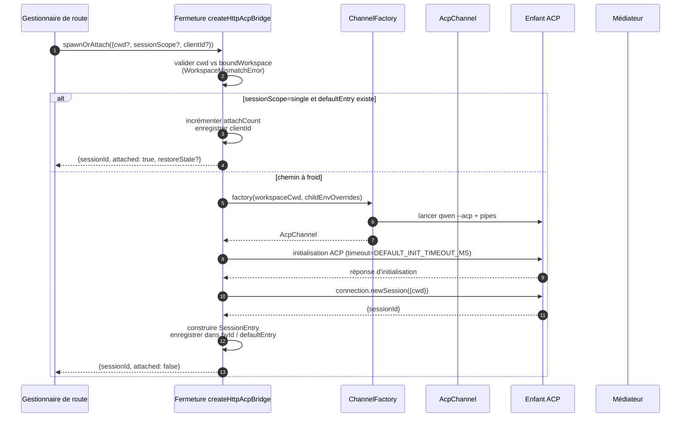
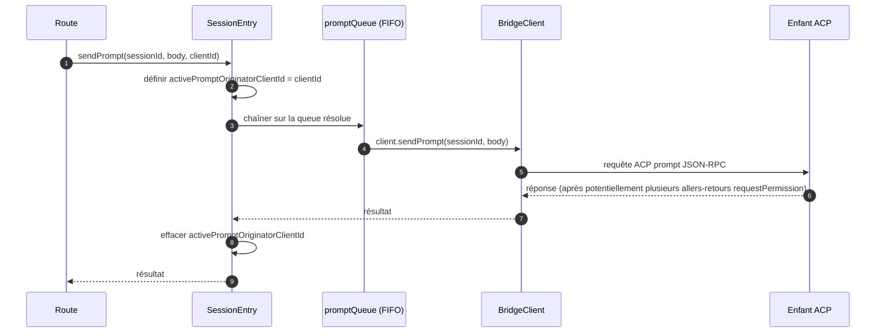
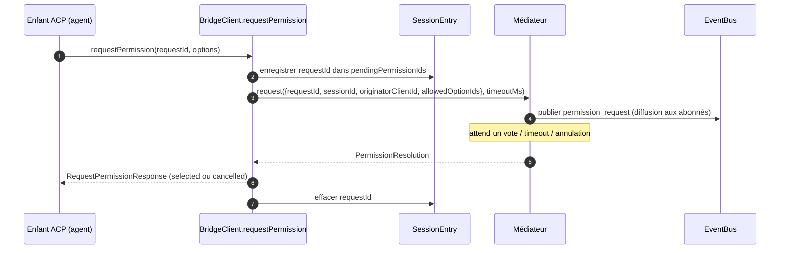
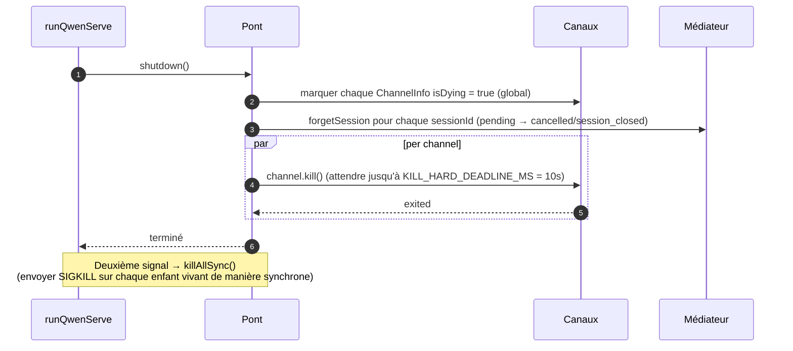

# Pont ACP

## Vue d'ensemble

`packages/acp-bridge/` gère la frontière entre la couche HTTP du démon et le processus enfant ACP. Il est utilisé par `packages/cli/src/serve/` (le démon `qwen serve`) et a été extrait dans #4175 étape F1 afin que de futurs consommateurs (`channels/base/AcpBridge.ts`, le compagnon VS Code IDE) puissent utiliser le même noyau de pont sans accéder au package CLI.

Le pont fournit une instance `HttpAcpBridge`, un `AcpChannel` vers l'enfant ACP, des sessions multiplexées sur ce canal, des `EventBus` par session, un `MultiClientPermissionMediator`, un adaptateur `BridgeFileSystem`, et des aides orientées ACP (`spawnOrAttach`, `loadSession`, `resumeSession`, `sendPrompt`, `cancelSession`, `respondToPermission`, ainsi que des RPC extMethod pour l'état de l'espace de travail et le redémarrage MCP).

## Responsabilités

- Lancer ou attacher l'enfant ACP via une `ChannelFactory` injectable. Fabrique par défaut : `defaultSpawnChannelFactory` (sous-processus `qwen --acp`). Les tests injectent `inMemoryChannel`.
- Maintenir `aliveChannels` (registre des canaux) et `byId` (registre des sessions).
- Multiplexer N sessions côté HTTP sur un seul enfant ACP via `connection.newSession()`.
- Sérialiser les requêtes par session via `promptQueue` (ACP impose une requête active par session).
- FIFO par session pour les appels `setSessionModel` afin que des attachements concurrents avec des modèles différents n'entrent pas en concurrence avec l'agent.
- `EventBus` par session qui alimente `GET /session/:id/events` (voir [`10-event-bus.md`](./10-event-bus.md)).
- Flux de permissions : `BridgeClient.requestPermission` → `MultiClientPermissionMediator.request` → diffusion → collecte des votes → réponse ACP (voir [`04-permission-mediation.md`](./04-permission-mediation.md)).
- Entrées/sorties fichiers : adaptateur `BridgeFileSystem` pour les appels ACP `readTextFile` / `writeTextFile` (voir [`07-workspace-filesystem.md`](./07-workspace-filesystem.md)).
- RPC extMethod pour l'état au niveau de l'espace de travail (`/workspace/mcp`, `/workspace/skills`, `/workspace/providers`) et redémarrage MCP.
- Cycle de vie : `shutdown()` gracieux avec `KILL_HARD_DEADLINE_MS` (10s) par canal ; `killAllSync()` synchrone pour la sortie forcée au deuxième signal.

## Architecture

**Point d'entrée publique** : `createHttpAcpBridge(opts: BridgeOptions): HttpAcpBridge` dans `packages/acp-bridge/src/bridge.ts`.

**Types clés** :

| Type                              | Fichier                 | Rôle                                                                                                                                                                                                                                            |
| --------------------------------- | ----------------------- | ----------------------------------------------------------------------------------------------------------------------------------------------------------------------------------------------------------------------------------------------- |
| `HttpAcpBridge`                   | `bridgeTypes.ts`        | Interface publique : `spawnOrAttach`, `loadSession`, `resumeSession`, `sendPrompt`, `cancelSession`, `subscribeEvents`, `respondToPermission`, `getWorkspaceMcpStatus`, `restartMcpServer`, `shutdown`, `killAllSync`, …                        |
| `BridgeSession`                   | `bridgeTypes.ts`        | `{ sessionId, workspaceCwd, attached, clientId?, createdAt? }` renvoyé aux gestionnaires HTTP.                                                                                                                                                 |
| `BridgeOptions`                   | `bridgeOptions.ts`      | Configuration à la construction (voir [Configuration](#configuration)).                                                                                                                                                                        |
| `AcpChannel`                      | `channel.ts`            | `{ stream, kill(), killSync(), exited }` — un canal ACP NDJSON.                                                                                                                                                                               |
| `ChannelFactory`                  | `channel.ts`            | `(workspaceCwd, childEnvOverrides?) => Promise<AcpChannel>`.                                                                                                                                                                                   |
| `BridgeClient`                    | `bridgeClient.ts`       | Encapsule une `ClientSideConnection` ACP ; implémente le `Client` ACP (`requestPermission`, `readTextFile`, `writeTextFile`, `sessionUpdate`, `extNotification`).                                                                             |
| `EventBus`                        | `eventBus.ts`           | Pub/souscription en mémoire par session. Voir [`10-event-bus.md`](./10-event-bus.md).                                                                                                                                                          |
| `MultiClientPermissionMediator`   | `permissionMediator.ts` | Médiateur à quatre stratégies. Voir [`04-permission-mediation.md`](./04-permission-mediation.md).                                                                                                                                              |

**État interne (fermé dans `createHttpAcpBridge`)** :

| État              | Forme                                   | Objectif                                                                                                                                                                                                                                                                                                                                                                                   |
| ----------------- | --------------------------------------- | ------------------------------------------------------------------------------------------------------------------------------------------------------------------------------------------------------------------------------------------------------------------------------------------------------------------------------------------------------------------------------------------ |
| `aliveChannels`   | `Map<string, ChannelInfo>`              | Registre des canaux indexé par identifiant de canal. Chaque `ChannelInfo` contient `channel`, `connection`, `client` (un `BridgeClient` par canal), `sessionIds: Set<string>`, `pendingRestoreIds`, `statusClosedReject?`, `isDying: boolean`.                                                                                                                                            |
| `byId`            | `Map<string, SessionEntry>`             | Registre des sessions indexé par sessionId. Chaque `SessionEntry` contient `channel`, `connection`, `events: EventBus`, `promptQueue: Promise<void>`, `modelChangeQueue: Promise<void>`, `pendingPermissionIds: Set<string>`, `clientIds: Map<string, count>`, `activePromptOriginatorClientId?`, `attachCount`, `spawnOwnerWantedKill`, `restoreState?`, `sessionLastSeenAt?`, `clientLastSeenAt: Map<string, ms>`. |
| `defaultEntry`    | `SessionEntry \| null`                  | Session « unique » utilisée quand `sessionScope: 'single'`.                                                                                                                                                                                                                                                                                                                                |
| `defaultPolicy`   | `PermissionPolicy`                      | Configuré via `BridgeOptions.permissionPolicy`.                                                                                                                                                                                                                                                                                                                                            |
| `mediator`        | `MultiClientPermissionMediator`         | Un par instance de pont.                                                                                                                                                                                                                                                                                                                                                                   |
| Constantes        | —                                       | `DEFAULT_INIT_TIMEOUT_MS = 10_000`, `MCP_RESTART_TIMEOUT_MS = 300_000`, `DEFAULT_MAX_SESSIONS = 20`, `MAX_EVENT_RING_SIZE = 1_000_000`, `DEFAULT_PERMISSION_TIMEOUT_MS = 5min`, `DEFAULT_MAX_PENDING_PER_SESSION = 64`.                                                                                                                                                                  |

**Invariant `isDying`** : tout chemin de démontage doit passer `ChannelInfo.isDying = true` de manière synchrone **avant** d'attendre `channel.kill()`. `ensureChannel` traite un canal mourant comme absent et en crée un nouveau. Sans ce drapeau, un `spawnOrAttach` concurrent arrivant pendant la fenêtre de grâce SIGTERM (jusqu'à 10s) s'attacherait à un transport sur le point de se fermer et le sessionId de l'appelant renverrait 404 à chaque requête suivante. **Sites de définition** (à maintenir synchronisés) : `ensureChannel` (échec d'initialisation + vérification tardive de l'arrêt), `doSpawn` (échec de newSession sur canal vide), `killSession` (dernière session quittant), `shutdown` (global).

**Invariant de rétention `channelInfo`** : ne pas **effacer** `channelInfo` quand `isDying = true`. `killAllSync` doit encore trouver le canal pendant la fenêtre SIGTERM pour envoyer SIGKILL sur `process.exit(1)`. `aliveChannels` conserve l'entrée mourante jusqu'à ce que `channel.exited` se déclenche.

**Buffering limité du BridgeClient** : les trames ACP `extNotification` arrivant sur `BridgeClient` pour un sessionId pas encore dans `byId` (car la réponse de `connection.newSession` n'est pas encore revenue, mais la découverte MCP à l'intérieur de `newSession` a déjà émis des événements de budget) sont mises en mémoire tampon dans une file d'événements précoces limitée par `MAX_EARLY_EVENT_SESSIONS = 64` × `MAX_EARLY_EVENTS_PER_SESSION = 32` × `EARLY_EVENT_TTL_MS = 60_000`. Le pire cas représente environ 400 Ko de tas. Sans cette mise en mémoire tampon, le premier slot de la boucle de rejeu SSE pour une nouvelle session manquerait les événements survenus pendant sa création.

## Flux de travail

### `spawnOrAttach` (point d'entrée principal)

Points clés :

- `sessionScope='single'` avec un `defaultEntry` existant ne fait qu'incrémenter `attachCount`, enregistrer `clientId`, et renvoyer `attached: true`.
- Le chemin à froid exécute la ChannelFactory, effectue l'initialisation ACP (`DEFAULT_INIT_TIMEOUT_MS=10s`), appelle `connection.newSession({cwd})`, puis enregistre la nouvelle `SessionEntry`.
- `SessionLimitExceededError` est levée quand `byId.size >= maxSessions`.
- `InvalidClientIdError` est levée si `X-Qwen-Client-Id` n'est pas dans `[A-Za-z0-9._:-]{1,128}`.
- Le ramasseur de déconnexion dans `server.ts` suit le propriétaire du spawn via `attachCount`/`spawnOwnerWantedKill` pour éviter de démanteler une session dont le propriétaire du spawn s'est déconnecté alors que d'autres clients sont déjà attachés (review #3889 BQ9tV).

### Sérialisation des requêtes

Les échecs en fin de queue sont **engloutis** afin qu'un rejet de requête précédente ne pollue pas les suivantes ; l'appelant d'origine reçoit toujours le rejet sur sa propre promesse retournée. Le `transportClosedReject` mis en cache sur la session met en concurrence la promesse de la requête avec `channel.exited` de sorte qu'un enfant crashé apparaît immédiatement plutôt que de bloquer.

### Flux de permission (haut niveau)

`InvalidPermissionOptionError` est levée avant le médiateur lorsqu'un vote filaire tente d'injecter `CANCEL_VOTE_SENTINEL` via le champ normal `optionId` — le sentinelle est la seule échappatoire du pont pour court-circuiter une requête en `cancelled / agent_cancelled` et ne doit pas être accessible depuis le filaire par accident. Voir [`04-permission-mediation.md`](./04-permission-mediation.md).

### Arrêt

## Fabrique de canaux

`AcpChannel` (`channel.ts`) est l'abstraction de transport du pont. En production, on utilise `defaultSpawnChannelFactory` dans `spawnChannel.ts`, qui exécute `qwen --acp` en tant que sous-processus avec une paire de pipes stdio. Les tests injectent `inMemoryChannel` pour exécuter l'agent dans le processus. Le pont ne connaît rien du mécanisme sous-jacent — il n'a besoin que de `{ stream, kill, killSync, exited }`.

`ChannelFactory` accepte `childEnvOverrides` afin que chaque gestionnaire de démon puisse passer ses propres variables d'environnement de budget MCP (`QWEN_SERVE_MCP_CLIENT_BUDGET`, `QWEN_SERVE_MCP_BUDGET_MODE`) sans modifier `process.env` (ce qui créerait une concurrence lorsque deux démons intégrés s'exécutent dans le même processus Node).

## État et cycle de vie

- La construction du pont est synchrone ; le premier `spawnOrAttach` démarre à froid l'enfant ACP.
- `defaultEntry` vit pendant toute la durée de vie du pont sous `sessionScope: 'single'` ; le canal se ferme quand `sessionIds.size === 0` (après `killSession`) ET `isDying` passe à true.
- `MAX_EVENT_RING_SIZE = 1_000_000` est une limite supérieure souple pour `BridgeOptions.eventRingSize` afin de détecter les fautes de frappe de l'opérateur avant des OOM d'environ 500 Mo par session.
- `DEFAULT_PERMISSION_TIMEOUT_MS = 5 * 60 * 1000` empêche une demande de permission bloquée de bloquer indéfiniment la `promptQueue` par session.
- `DEFAULT_MAX_PENDING_PER_SESSION = 64` reflète `DEFAULT_MAX_SUBSCRIBERS` ; les appels `requestPermission` en excès sont résolus comme annulés avec un avertissement sur stderr.

## Dépendances

| Amont                                                                                         | Aval                                           |
| --------------------------------------------------------------------------------------------- | ---------------------------------------------- |
| `@agentclientprotocol/sdk` — `ClientSideConnection`, `PROTOCOL_VERSION`, types ACP            | `packages/cli/src/serve/` (le démon)           |
| `@qwen-code/qwen-code-core` — `ApprovalMode`, `TrustGateError`, `getCurrentGeminiMdFilename` | `packages/channels/base/` (prévu, F4)          |
| `node:crypto`, `node:fs`, `node:path`                                                         | `packages/vscode-ide-companion/` (prévu, F4)   |

## Configuration

`BridgeOptions` (`bridgeOptions.ts`) :

| Clé                                        | Défaut                                             | Objectif                                                                                                               |
| ------------------------------------------ | -------------------------------------------------- | ---------------------------------------------------------------------------------------------------------------------- |
| `boundWorkspace`                           | (obligatoire)                                      | Chemin canonique de l'espace de travail que le pont impose.                                                            |
| `sessionScope`                             | `'single'`                                         | `'single'` partage une session entre tous les clients ; `'thread'` crée une session distincte pour chaque fil de discussion. |
| `channelFactory`                           | `defaultSpawnChannelFactory`                       | Fabrique d'enfant ACP injectable.                                                                                       |
| `initializeTimeoutMs`                      | `DEFAULT_INIT_TIMEOUT_MS = 10_000`                 | Délai d'attente de la poignée de main ACP `initialize`.                                                                |
| `maxSessions`                              | `DEFAULT_MAX_SESSIONS = 20`                        | Limite sur `byId.size`. `0` / `Infinity` = illimité ; NaN/négatif lève une exception.                                  |
| `eventRingSize`                            | `DEFAULT_RING_SIZE` (de `eventBus.ts`)             | Anneau d'événements par session ; plafond souple à `MAX_EVENT_RING_SIZE`.                                               |
| `permissionResponseTimeoutMs`              | `DEFAULT_PERMISSION_TIMEOUT_MS = 5 min`            | Temps d'horloge mural par demande pour le médiateur.                                                                   |
| `maxPendingPermissionsPerSession`          | `DEFAULT_MAX_PENDING_PER_SESSION = 64`             | Contre-pression sur les agents à volume élevé.                                                                          |
| `childEnvOverrides`                        | `{}`                                               | Ajouts/suppressions d'environnement par gestionnaire pour l'enfant ACP.                                                |
| `persistApprovalMode`, `persistDisabledTools` | —                                                | Crochets d'écriture des paramètres pour les routes de mutation de la vague 4.                                          |
| `contextFilename`                          | depuis `settings.json`'s `context.fileName`        | Remplace `getCurrentGeminiMdFilename`.                                                                                  |
| `statusProvider`                           | (aucun)                                            | Cellules de pré-vérification hébergées par le démon (`DaemonStatusProvider`).                                           |
| `fileSystem`                               | (aucun)                                            | Adaptateur `BridgeFileSystem` pour ACP `readTextFile` / `writeTextFile`.                                                |
| `permissionPolicy`                         | depuis `settings.json`'s `policy.permissionStrategy` | L'une parmi `first-responder` / `designated` / `consensus` / `local-only`.                                             |
| `permissionConsensusQuorum`                | depuis `settings.json`                             | N pour la stratégie consensus.                                                                                          |
| `permissionAudit`                          | `createNoOpPermissionAuditPublisher()`             | Connexion à `PermissionAuditRing` pour la piste d'audit.                                                               |
| `channelIdleTimeoutMs`                     | `0`                                                | Garder l'enfant ACP en vie pendant ce nombre de millisecondes après la fermeture de la dernière session.               |
## Méthodes de bridge supplémentaires

En plus des appels principaux `spawnOrAttach`, `sendPrompt`, `cancelSession`,
`respondToPermission`, `loadSession`, et `resumeSession`, l'interface
`HttpAcpBridge` inclut désormais ces assistants orientés daemon :

| Méthode                                                       | Objectif                                       |
| ------------------------------------------------------------ | ---------------------------------------------- |
| `generateSessionRecap(sessionId, context?)`                  | Générer un récapitulatif de session en une ligne. |
| `generateSessionBtw(sessionId, question, signal?, context?)` | Répondre à une question secondaire / prompt btw. |
| `executeShellCommand(sessionId, command, signal?, context?)` | Exécuter une commande shell sur l'hôte du daemon. |
| `getSessionContextUsageStatus(sessionId, opts?)`             | Retourner l'utilisation de la fenêtre de contexte. |
| `getSessionSupportedCommandsStatus(sessionId)`               | Retourner les commandes slash disponibles. |
| `getSessionTasksStatus(sessionId)`                           | Retourner un instantané des tâches en arrière-plan. |
| `getSessionStatsStatus(sessionId)`                           | Retourner les statistiques d'utilisation de la session. |
| `setSessionApprovalMode(sessionId, mode, opts, context?)`    | Mettre à jour le mode d'approbation d'une session. |
| `detachClient(sessionId, clientId?)`                         | Détacher explicitement un client. |
| `addRuntimeMcpServer(name, config, originatorClientId)`      | Ajouter un serveur MCP à l'exécution. |
| `removeRuntimeMcpServer(name, originatorClientId)`           | Supprimer un serveur MCP à l'exécution. |
| `manageMcpServer(serverName, action, originatorClientId)`    | Activer / désactiver / authentifier / effacer l'authentification. |
| `generateWorkspaceAgent(description, originatorClientId)`    | Générer une définition de sous-agent avec l'IA. |
| `preheat()`                                                  | Préparer le processus enfant ACP avant la première session. |
| `getSessionLastEventId(sessionId)`                           | Lire l'identifiant monotone d'événement de la session. |
| `getWorkspaceToolsStatus()`                                  | Retourner l'instantané du registre d'outils intégré. |
| `getWorkspaceMcpToolsStatus(serverName)`                     | Retourner les outils pour un serveur MCP spécifique. |

`BridgeSpawnRequest.sessionScope` a été renommé de `'per-client'` à `'thread'`. `BridgeRestoredSession` contient désormais `compactedReplay`, `liveJournal`, et `lastEventId`. `BridgeClientRequestContext` est le contexte de requête transmis à travers les appels de bridge ; il contient `clientId`, `fromLoopback: boolean`, et `promptId`.

## Limitations connues et mises en garde

- `MCP_RESTART_TIMEOUT_MS = 300_000` (5 min) — le délai d'attente du bridge pour `/workspace/mcp/:server/restart` est intentionnellement élevé car `McpClientManager.MAX_DISCOVERY_TIMEOUT_MS` peut aller jusqu'à 5 min pour les serveurs stdio. Un délai plus court produirait des faux dépassements de délai tandis que le processus enfant ACP continuerait de se reconnecter en arrière-plan.
- `BridgeOptions.eventRingSize > 1_000_000` lève une exception à la construction.
- `connection.unstable_resumeSession` est exposé via la capacité stable `session_resume` du daemon ; `unstable_session_resume` reste annoncé comme un alias de compatibilité obsolète pour les anciens SDK. Les clients doivent détecter la fonctionnalité `session_resume`.
- Le package bridge est `@qwen-code/acp-bridge` et est consommé via des shims de réexport dans `serve/event-bus.ts`, `serve/status.ts`, `serve/httpAcpBridge.ts` pour la rétrocompatibilité avec les chemins d'importation antérieurs à F1. Le nouveau code doit importer directement.

## Références

- `packages/acp-bridge/src/bridge.ts` (notamment `createHttpAcpBridge` à la ligne 350+)
- `packages/acp-bridge/src/bridgeClient.ts`
- `packages/acp-bridge/src/bridgeTypes.ts`
- `packages/acp-bridge/src/bridgeOptions.ts`
- `packages/acp-bridge/src/channel.ts`
- `packages/acp-bridge/src/spawnChannel.ts`
- `packages/acp-bridge/src/bridgeErrors.ts`
- Issues : [#3803](https://github.com/QwenLM/qwen-code/issues/3803), [#4175](https://github.com/QwenLM/qwen-code/issues/4175).