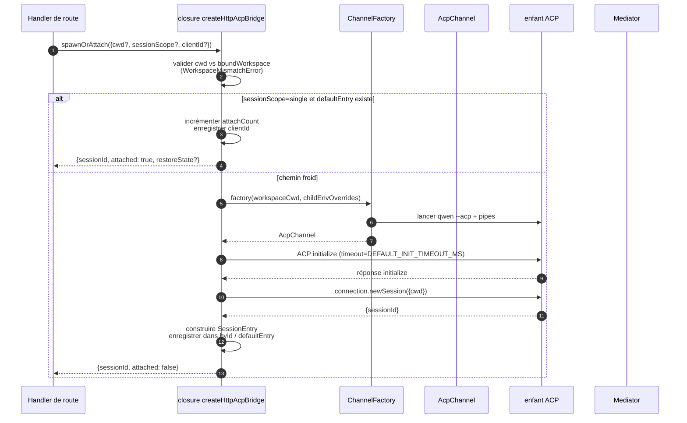
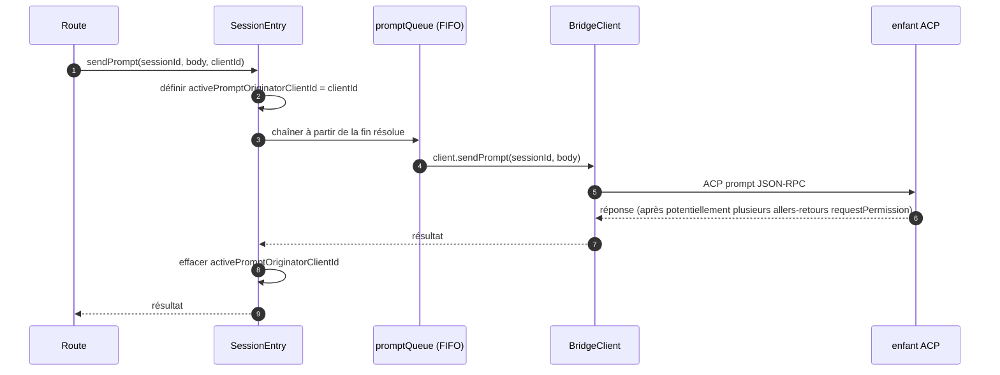
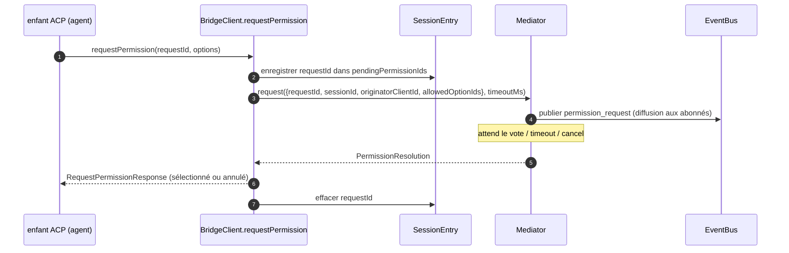
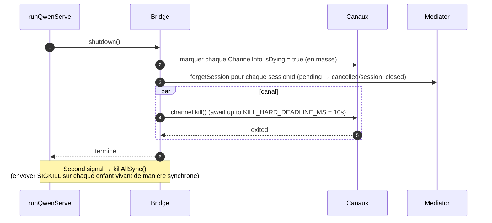

# ACP Bridge

## Vue d'ensemble

`packages/acp-bridge/` gère la frontière entre la couche HTTP du démon et le processus enfant ACP. Il est consommé par `packages/cli/src/serve/` (le démon `qwen serve`) et a été extrait dans l'étape 3 de #4175 F1 afin que de futurs consommateurs (`channels/base/AcpBridge.ts`, le compagnon IDE VS Code) puissent utiliser le même cœur de bridge sans accéder au package CLI.

Le bridge fournit une instance `HttpAcpBridge`, un `AcpChannel` vers l'enfant ACP, des sessions multiplexées sur ce canal, des `EventBus` par session, un `MultiClientPermissionMediator`, un adaptateur `BridgeFileSystem`, et des helpers orientés ACP (`spawnOrAttach`, `loadSession`, `resumeSession`, `sendPrompt`, `cancelSession`, `respondToPermission`, ainsi que des RPC extMethod pour le statut du workspace et le redémarrage MCP).

## Responsabilités

- Lancer ou attacher au processus enfant ACP via une `ChannelFactory` enfichable. Fabrique par défaut : `defaultSpawnChannelFactory` (sous-processus `qwen --acp`). Les tests injectent `inMemoryChannel`.
- Maintenir `aliveChannels` (registre des canaux) et `byId` (registre des sessions).
- Multiplexer N sessions côté HTTP sur un seul enfant ACP via `connection.newSession()`.
- Sérialiser les prompts par session via `promptQueue` (ACP impose un seul prompt actif par session).
- FIFO par session pour les appels à `setSessionModel` afin que les attachements simultanés avec des modèles différents n'entrent pas en concurrence au niveau de l'agent.
- `EventBus` par session qui alimente `GET /session/:id/events` (voir [`10-event-bus.md`](./10-event-bus.md)).
- Flux de permissions : `BridgeClient.requestPermission` → `MultiClientPermissionMediator.request` → diffusion → collecte des votes → réponse ACP (voir [`04-permission-mediation.md`](./04-permission-mediation.md)).
- E/S de fichiers : adaptateur `BridgeFileSystem` pour les appels ACP `readTextFile` / `writeTextFile` (voir [`07-workspace-filesystem.md`](./07-workspace-filesystem.md)).
- RPC extMethod pour le statut au niveau du workspace (`/workspace/mcp`, `/workspace/skills`, `/workspace/providers`) et le redémarrage MCP.
- Cycle de vie : `shutdown()` gracieux avec `KILL_HARD_DEADLINE_MS` (10s) par canal ; `killAllSync()` synchrone pour une sortie forcée au second signal.

## Architecture

**Point d'entrée public** : `createHttpAcpBridge(opts: BridgeOptions): HttpAcpBridge` dans `packages/acp-bridge/src/bridge.ts`.

**Types clés** :

| Type                            | Fichier                 | Rôle                                                                                                                                                                                                                  |
| ------------------------------- | ----------------------- | --------------------------------------------------------------------------------------------------------------------------------------------------------------------------------------------------------------------- |
| `HttpAcpBridge`                 | `bridgeTypes.ts`        | Interface publique : `spawnOrAttach`, `loadSession`, `resumeSession`, `sendPrompt`, `cancelSession`, `subscribeEvents`, `respondToPermission`, `getWorkspaceMcpStatus`, `restartMcpServer`, `shutdown`, `killAllSync`, … |
| `BridgeSession`                 | `bridgeTypes.ts`        | `{ sessionId, workspaceCwd, attached, clientId?, createdAt? }` retourné aux handlers HTTP.                                                                                                                             |
| `BridgeOptions`                 | `bridgeOptions.ts`      | Configuration à la construction (voir [Configuration](#configuration)).                                                                                                                                                       |
| `AcpChannel`                    | `channel.ts`            | `{ stream, kill(), killSync(), exited }` — un canal NDJSON ACP.                                                                                                                                                    |
| `ChannelFactory`                | `channel.ts`            | `(workspaceCwd, childEnvOverrides?) => Promise<AcpChannel>`.                                                                                                                                                          |
| `BridgeClient`                  | `bridgeClient.ts`       | Encapsule une `ClientSideConnection` ACP ; implémente le `Client` ACP (`requestPermission`, `readTextFile`, `writeTextFile`, `sessionUpdate`, `extNotification`).                                                             |
| `EventBus`                      | `eventBus.ts`           | Pub/sub en mémoire par session. Voir [`10-event-bus.md`](./10-event-bus.md).                                                                                                                                            |
| `MultiClientPermissionMediator` | `permissionMediator.ts` | Médiateur à quatre politiques. Voir [`04-permission-mediation.md`](./04-permission-mediation.md).                                                                                                                               |

**État interne (fermé par `createHttpAcpBridge`)** :

| État           | Forme                           | Objectif                                                                                                                                                                                                                                                                                                                                                                                                  |
| --------------- | ------------------------------- | -------------------------------------------------------------------------------------------------------------------------------------------------------------------------------------------------------------------------------------------------------------------------------------------------------------------------------------------------------------------------------------------------------- |
| `aliveChannels` | `Map<string, ChannelInfo>`      | Registre des canaux indexé par l'id du canal. Chaque `ChannelInfo` contient `channel`, `connection`, `client` (un `BridgeClient` par canal), `sessionIds: Set<string>`, `pendingRestoreIds`, `statusClosedReject?`, `isDying: boolean`.                                                                                                                                                                            |
| `byId`          | `Map<string, SessionEntry>`     | Registre des sessions indexé par sessionId. Chaque `SessionEntry` contient `channel`, `connection`, `events: EventBus`, `promptQueue: Promise<void>`, `modelChangeQueue: Promise<void>`, `pendingPermissionIds: Set<string>`, `clientIds: Map<string, count>`, `activePromptOriginatorClientId?`, `attachCount`, `spawnOwnerWantedKill`, `restoreState?`, `sessionLastSeenAt?`, `clientLastSeenAt: Map<string, ms>`. |
| `defaultEntry`  | `SessionEntry \| null`          | La session "unique" utilisée lorsque `sessionScope: 'single'`.                                                                                                                                                                                                                                                                                                                                                 |
| `defaultPolicy` | `PermissionPolicy`              | Configuré via `BridgeOptions.permissionPolicy`.                                                                                                                                                                                                                                                                                                                                                         |
| `mediator`      | `MultiClientPermissionMediator` | Un par instance de bridge.                                                                                                                                                                                                                                                                                                                                                                                 |
| Constantes       | —                               | `DEFAULT_INIT_TIMEOUT_MS = 10_000`, `MCP_RESTART_TIMEOUT_MS = 300_000`, `DEFAULT_MAX_SESSIONS = 20`, `MAX_EVENT_RING_SIZE = 1_000_000`, `DEFAULT_PERMISSION_TIMEOUT_MS = 5min`, `DEFAULT_MAX_PENDING_PER_SESSION = 64`.                                                                                                                                                                                  |

**Invariant `isDying`** : tout chemin de démontage doit définir `ChannelInfo.isDying = true` de manière synchrone **avant** d'attendre `channel.kill()`. `ensureChannel` traite un canal mourant comme absent et en lance un nouveau. Sans cet indicateur, un `spawnOrAttach` concurrent arrivant pendant la fenêtre de grâce SIGTERM (jusqu'à 10s) s'attacherait à un transport sur le point de se fermer et le sessionId de l'appelant retournerait une 404 à chaque suivi. **Sites de définition** (à garder synchronisés) : `ensureChannel` (échec d'initialisation + revérification d'arrêt tardif), `doSpawn` (échec de newSession sur un canal vide), `killSession` (dernière session partante), `shutdown` (en masse).

**Invariant de rétention de `channelInfo`** : ne **pas** effacer `channelInfo` lors de la définition de `isDying = true`. `killAllSync` doit toujours pouvoir trouver le canal pendant la fenêtre de grâce SIGTERM pour envoyer SIGKILL sur `process.exit(1)`. `aliveChannels` conserve l'entrée mourante jusqu'à ce que `channel.exited` se déclenche.

**Buffering borné de BridgeClient** : les trames ACP `extNotification` arrivant sur `BridgeClient` pour un sessionId pas encore dans `byId` (parce que la réponse de `connection.newSession` n'est pas encore revenue, mais que la découverte MCP dans `newSession` a déjà déclenché des événements de budget) sont mises en buffer dans une file d'événements précoces bornée par `MAX_EARLY_EVENT_SESSIONS = 64` × `MAX_EARLY_EVENTS_PER_SESSION = 32` × `EARLY_EVENT_TTL_MS = 60_000`. Le pire cas représente environ 400 Ko de heap. Sans buffering, le premier slot de l'anneau de relecture SSE pour une nouvelle session manquerait les événements déclenchés pendant sa création.

## Flux de travail

### `spawnOrAttach` (point d'entrée principal)

Points clés :

- `sessionScope='single'` avec un `defaultEntry` existant incrémente seulement
  `attachCount`, enregistre `clientId`, et retourne `attached: true`.
- Le chemin froid exécute la ChannelFactory, effectue l'`initialize` ACP
  (`DEFAULT_INIT_TIMEOUT_MS=10s`), appelle `connection.newSession({cwd})`, puis
  enregistre le nouveau `SessionEntry`.
- `SessionLimitExceededError` est levée lorsque `byId.size >= maxSessions`.
- `InvalidClientIdError` est levée si `X-Qwen-Client-Id` est en dehors de
  `[A-Za-z0-9._:-]{1,128}`.
- Le reaper de déconnexion dans `server.ts` suit le propriétaire du spawn via
  `attachCount`/`spawnOwnerWantedKill` pour éviter de démanteler une session dont le
  propriétaire du spawn s'est déconnecté mais à laquelle d'autres clients se sont déjà attachés (voir #3889
  BQ9tV).

### Sérialisation des prompts

Les échecs à la fin de la file sont **ignorés** afin que le rejet d'un prompt précédent n'empoisonne pas les prompts suivants ; l'appelant d'origine reçoit toujours le rejet sur sa propre promesse retournée. Le `transportClosedReject` mis en cache sur la session met en concurrence la promesse du prompt avec `channel.exited` afin qu'un enfant crashé remonte immédiatement au lieu de bloquer.

### Flux de permissions (haut niveau)

`InvalidPermissionOptionError` est levée pré-médiateur lorsqu'un vote sur le fil essaie d'injecter `CANCEL_VOTE_SENTINEL` via le champ normal `optionId` — le sentinel est la seule échappatoire du bridge pour court-circuiter une requête en tant que `cancelled / agent_cancelled` et ne doit pas être accessible accidentellement depuis le fil. Voir [`04-permission-mediation.md`](./04-permission-mediation.md).

### Arrêt

## Fabrique de canaux

`AcpChannel` (`channel.ts`) est l'abstraction de transport du bridge. La production utilise `defaultSpawnChannelFactory` dans `spawnChannel.ts`, qui exécute `qwen --acp` en tant que sous-processus avec une paire de pipes stdio. Les tests injectent `inMemoryChannel` pour exécuter l'agent dans le processus. Le bridge ne connaît rien au mécanisme sous-jacent — il a seulement besoin de `{ stream, kill, killSync, exited }`.

`ChannelFactory` accepte `childEnvOverrides` afin que chaque handle de démon puisse passer ses propres variables d'environnement de budget MCP (`QWEN_SERVE_MCP_CLIENT_BUDGET`, `QWEN_SERVE_MCP_BUDGET_MODE`) sans muter `process.env` (ce qui entrerait en concurrence si deux démons embarqués s'exécutaient dans le même processus Node).

## État et cycle de vie

- La construction du bridge est synchrone ; le premier `spawnOrAttach` démarre à froid l'enfant ACP.
- `defaultEntry` vit pendant toute la durée de vie du bridge sous `sessionScope: 'single'` ; le canal est récupéré lorsque `sessionIds.size === 0` (après `killSession`) ET que `isDying` passe à true.
- `MAX_EVENT_RING_SIZE = 1_000_000` est une limite supérieure souple pour `BridgeOptions.eventRingSize` afin de détecter les fautes de frappe de l'opérateur avant des OOM d'environ 500 Mo par session.
- `DEFAULT_PERMISSION_TIMEOUT_MS = 5 * 60 * 1000` empêche une demande de permission bloquée de bloquer indéfiniment la `promptQueue` par session.
- `DEFAULT_MAX_PENDING_PER_SESSION = 64` reflète `DEFAULT_MAX_SUBSCRIBERS` ; les appels `requestPermission` excédentaires sont résolus comme annulés avec un avertissement stderr.

## Dépendances

| Amont                                                                                     | Aval                                     |
| -------------------------------------------------------------------------------------------- | ---------------------------------------------- |
| `@agentclientprotocol/sdk` — `ClientSideConnection`, `PROTOCOL_VERSION`, types ACP           | `packages/cli/src/serve/` (le démon)         |
| `@qwen-code/qwen-code-core` — `ApprovalMode`, `TrustGateError`, `getCurrentGeminiMdFilename` | `packages/channels/base/` (prévu, F4)        |
| `node:crypto`, `node:fs`, `node:path`                                                        | `packages/vscode-ide-companion/` (prévu, F4) |

## Configuration

`BridgeOptions` (`bridgeOptions.ts`) :

| Clé                                           | Défaut                                            | Objectif                                                                                                               |
| --------------------------------------------- | -------------------------------------------------- | --------------------------------------------------------------------------------------------------------------------- |
| `boundWorkspace`                              | (requis)                                         | Chemin canonique du workspace que le bridge applique.                                                                         |
| `sessionScope`                                | `'single'`                                         | `'single'` partage une seule session entre tous les clients ; `'thread'` crée une session séparée pour chaque fil de conversation. |
| `channelFactory`                              | `defaultSpawnChannelFactory`                       | Fabrique d'enfant ACP enfichable.                                                                                          |
| `initializeTimeoutMs`                         | `DEFAULT_INIT_TIMEOUT_MS = 10_000`                 | Timeout du handshake `initialize` ACP.                                                                                   |
| `maxSessions`                                 | `DEFAULT_MAX_SESSIONS = 20`                        | Limite de `byId.size`. `0` / `Infinity` = illimité ; NaN/négatif lève une erreur.                                                |
| `eventRingSize`                               | `DEFAULT_RING_SIZE` (depuis `eventBus.ts`)           | Anneau d'événements par session ; limité souple à `MAX_EVENT_RING_SIZE`.                                                         |
| `permissionResponseTimeoutMs`                 | `DEFAULT_PERMISSION_TIMEOUT_MS = 5 min`            | Temps horloge par requête pour le médiateur.                                                                               |
| `maxPendingPermissionsPerSession`             | `DEFAULT_MAX_PENDING_PER_SESSION = 64`             | Contre-pression sur les agents à fort volume.                                                                                   |
| `childEnvOverrides`                           | `{}`                                               | Ajouts / nettoyages d'environnement par handle pour l'enfant ACP.                                                                  |
| `persistApprovalMode`, `persistDisabledTools` | —                                                  | Hooks d'écriture de paramètres pour les routes de mutation Wave 4.                                                                  |
| `contextFilename`                             | depuis `context.fileName` de `settings.json`          | Remplace `getCurrentGeminiMdFilename`.                                                                               |
| `statusProvider`                              | (aucun)                                             | Cellules de pré-vérification de l'hôte du démon (`DaemonStatusProvider`).                                                                 |
| `fileSystem`                                  | (aucun)                                             | Adaptateur `BridgeFileSystem` pour les appels ACP `readTextFile` / `writeTextFile`.                                                  |
| `permissionPolicy`                            | depuis `policy.permissionStrategy` de `settings.json` | Parmi `first-responder` / `designated` / `consensus` / `local-only`.                                                 |
| `permissionConsensusQuorum`                   | depuis `settings.json`                               | N pour la politique de consensus.                                                                                               |
| `permissionAudit`                             | `createNoOpPermissionAuditPublisher()`             | Câblage à `PermissionAuditRing` pour la piste d'audit.                                                                    |
| `channelIdleTimeoutMs`                        | `0`                                                | Maintenir l'enfant ACP en vie pendant ce nombre de millisecondes après la fermeture de la dernière session.                                    |
## Méthodes de bridge supplémentaires

En plus des appels principaux `spawnOrAttach`, `sendPrompt`, `cancelSession`,
`respondToPermission`, `loadSession` et `resumeSession`, l'interface
`HttpAcpBridge` inclut désormais les helpers suivants destinés au daemon :

| Méthode                                                      | Objectif                                    |
| ------------------------------------------------------------ | ------------------------------------------- |
| `generateSessionRecap(sessionId, context?)`                  | Génère un résumé de session sur une ligne.  |
| `generateSessionBtw(sessionId, question, signal?, context?)` | Répond à une question annexe ou à un prompt "btw". |
| `executeShellCommand(sessionId, command, signal?, context?)` | Exécute une commande shell sur l'hôte du daemon. |
| `getSessionContextUsageStatus(sessionId, opts?)`             | Retourne l'utilisation de la fenêtre de contexte. |
| `getSessionSupportedCommandsStatus(sessionId)`               | Retourne les commandes slash disponibles.   |
| `getSessionTasksStatus(sessionId)`                           | Retourne un instantané des tâches en arrière-plan. |
| `getSessionStatsStatus(sessionId)`                           | Retourne les statistiques d'utilisation de la session. |
| `setSessionApprovalMode(sessionId, mode, opts, context?)`    | Met à jour le mode d'approbation pour une session. |
| `detachClient(sessionId, clientId?)`                         | Détache explicitement un client.            |
| `addRuntimeMcpServer(name, config, originatorClientId)`      | Ajoute un serveur MCP au runtime.           |
| `removeRuntimeMcpServer(name, originatorClientId)`           | Supprime un serveur MCP au runtime.         |
| `manageMcpServer(serverName, action, originatorClientId)`    | Active / désactive / authentifie / efface l'authentification. |
| `generateWorkspaceAgent(description, originatorClientId)`    | Génère une définition de sous-agent avec l'IA. |
| `preheat()`                                                  | Préchauffe le processus enfant ACP avant la première session. |
| `getSessionLastEventId(sessionId)`                           | Lit l'identifiant d'événement monotone de la session. |
| `getWorkspaceToolsStatus()`                                  | Retourne un instantané du registre des outils intégrés. |
| `getWorkspaceMcpToolsStatus(serverName)`                     | Retourne les outils pour un serveur MCP spécifique. |

`BridgeSpawnRequest.sessionScope` a été renommé de `'per-client'` à
`'thread'`. `BridgeRestoredSession` contient désormais `compactedReplay`,
`liveJournal` et `lastEventId`. `BridgeClientRequestContext` est le contexte
de requête transmis à travers les appels de bridge ; il contient `clientId`,
`fromLoopback: boolean` et `promptId`.

## Mises en garde et limites connues

- `MCP_RESTART_TIMEOUT_MS = 300_000` (5 min) — le délai d'expiration du bridge pour `/workspace/mcp/:server/restart` est volontairement élevé car `McpClientManager.MAX_DISCOVERY_TIMEOUT_MS` peut atteindre 5 min pour les serveurs stdio. Un délai plus court produirait de faux timeouts pendant que l'enfant ACP continuerait de se reconnecter en arrière-plan.
- `BridgeOptions.eventRingSize > 1_000_000` lève une exception à la construction.
- `connection.unstable_resumeSession` est exposé via la capacité stable `session_resume` du daemon ; `unstable_session_resume` reste annoncé comme un alias de compatibilité obsolète pour les anciens SDK. Les clients doivent détecter la fonctionnalité `session_resume`.
- Le package bridge est `@qwen-code/acp-bridge`. Le code actuel importe les primitives event-bus et status directement depuis les sous-chemins du package ; `serve/acp-session-bridge.ts` reste la façade de compatibilité locale au CLI pour la surface de bridge plus large.

## Références

- `packages/acp-bridge/src/bridge.ts` (notamment `createHttpAcpBridge` à partir de la ligne 350)
- `packages/acp-bridge/src/bridgeClient.ts`
- `packages/acp-bridge/src/bridgeTypes.ts`
- `packages/acp-bridge/src/bridgeOptions.ts`
- `packages/acp-bridge/src/channel.ts`
- `packages/acp-bridge/src/spawnChannel.ts`
- `packages/acp-bridge/src/bridgeErrors.ts`
- Issues : [#3803](https://github.com/QwenLM/qwen-code/issues/3803), [#4175](https://github.com/QwenLM/qwen-code/issues/4175).