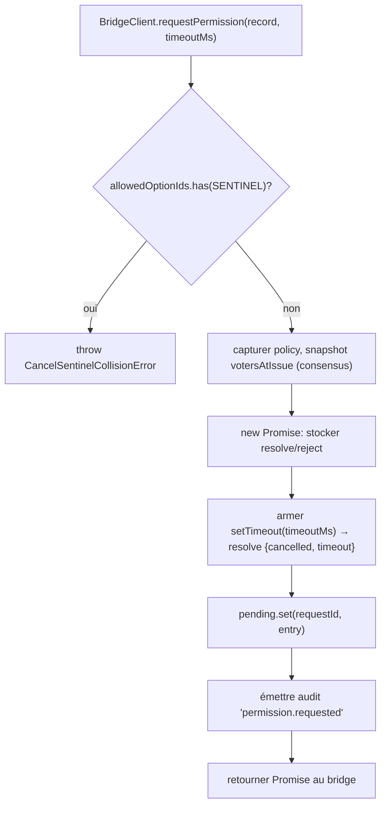
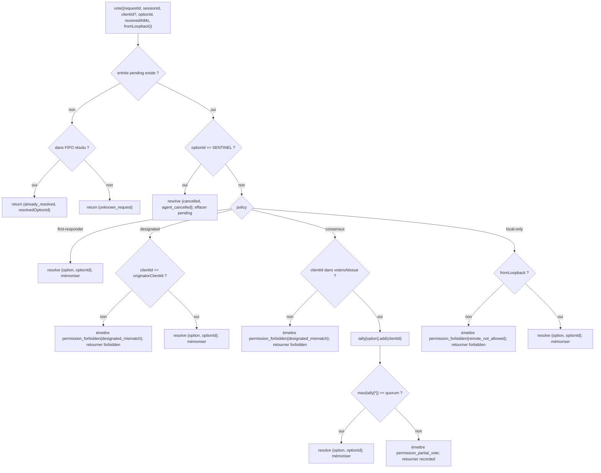

# Médiation des permissions multi-client

## Vue d'ensemble

Lorsque l'agent enfant de l'ACP appelle `requestPermission`, le démon ne se contente pas de le transmettre à un seul client. Sous `sessionScope: 'single'`, chaque client connecté voit la demande et n'importe lequel d'entre eux peut répondre. Sans médiation, les votes tardifs n'ont nulle part où aller, deux clients peuvent entrer en compétition sur la même demande, et un seul client malveillant peut outrepasser l'initiateur.

`MultiClientPermissionMediator` (`packages/acp-bridge/src/permissionMediator.ts`) implémente le contrat `PermissionMediator` (`packages/acp-bridge/src/permission.ts`) et possède tout l'état des permissions en attente et résolu pour le pont. Il distribue les votes via l'une des quatre politiques déclarées dans `PermissionPolicy` :

| Politique        | Règle de résolution                                                                                             | Cas d'usage                                                          |
| ---------------- | --------------------------------------------------------------------------------------------------------------- | -------------------------------------------------------------------- |
| `first-responder` | Le premier vote valide gagne ; les votants ultérieurs reçoivent `permission_already_resolved`.                   | UX de collaboration cross-client en direct (par défaut).             |
| `designated`      | Seul `originatorClientId` de l'invite peut résoudre ; les autres voient `permission_forbidden{designated_mismatch}`. | SaaS par locataire où l'interface utilisateur doit posséder ses propres approbations. |
| `consensus`       | Quorum N-of-M sur l'instantané client-id v1 ; les événements intermédiaires `permission_partial_vote` permettent aux IHM d'afficher la progression. | Révision de changements en entreprise où deux opérateurs doivent être d'accord. |
| `local-only`      | Refuse tout votant non loopback ; bloque jusqu'à ce qu'un client loopback résolve.                               | Postes de travail où le contrôle à distance ne doit jamais accorder d'escalade de privilèges. |

> **Limite de sécurité v1** : `X-Qwen-Client-Id` est auto-déclaré. `designated` et
> `consensus` n'ont pas encore de preuve de possession. Un client qui observe
> `originatorClientId` peut réutiliser cet identifiant. `{outcome:'cancelled'}` transite également
> via le sentinelle d'annulation avant l'envoi de la politique, donc même
> `local-only` ne peut pas traiter l'annulation comme une résolution protégée par la politique. Pour un isolement fort,
> liez le démon à loopback ou placez-le derrière un proxy inverse authentifié. Voir
> [Note de sécurité : l'identité client v1 est auto-déclarée](#note-de-sécurité--lidentité-client-v1-est-auto-déclarée).

## Responsabilités

- Suivre chaque demande en attente (cycle de vie `demande → vote → résolu`).
- Armer et désarmer les timeouts horloge murale par demande (l'**invariant N1** : le timeout doit être armé de manière synchrone à l'intérieur de `request()` afin qu'une session annulée immédiatement ne puisse pas laisser une fermeture en attente de façon permanente).
- Distribuer les votes via la politique capturée au moment de `request()` (changer la politique du démon en cours de route n'affecte pas les demandes en cours).
- Maintenir un FIFO borné (`MAX_RESOLVED_PERMISSION_RECORDS = 512`) des demandes récemment résolues afin que les votes en double reçoivent un `already_resolved` structuré plutôt qu'un `unknown_request`.
- Émettre `permission_partial_vote` (consensus) et `permission_forbidden` (designated / consensus / local-only) sur le bus d'événements par session.
- Résoudre les demandes en attente comme `{kind: 'cancelled', reason: 'session_closed'}` via `forgetSession(sessionId)` lors du démontage de session.
- Rejeter l'injection malveillante ou accidentelle de `CANCEL_VOTE_SENTINEL` via le câble (`InvalidPermissionOptionError`) et via les étiquettes d'option publiées par l'agent (`CancelSentinelCollisionError`).

## Architecture

### Surface publique

```ts
interface PermissionMediator {
  readonly policy: PermissionPolicy;
  request(
    record: PermissionRequestRecord,
    timeoutMs: number,
  ): Promise<PermissionResolution>;
  vote(vote: PermissionVote): PermissionVoteOutcome;
  forgetSession(sessionId: string): void;
}
```

`MultiClientPermissionMediator` ajoute : `peekSessionFor(requestId)`, `pendingCount(sessionId)`, éditeur d'audit interne, etc. `BridgeClient` ne dépend que de la moitié `request()` (sous-typage structurel — voir `bridgeClient.ts`).

### `PermissionPolicy` et `PermissionVoteOutcome`

```ts
type PermissionPolicy =
  | 'first-responder'
  | 'designated'
  | 'consensus'
  | 'local-only';

type PermissionVoteOutcome =
  | { kind: 'resolved'; resolvedOptionId: string }
  | { kind: 'recorded'; votesNeeded: number } // consensus partiel
  | { kind: 'already_resolved'; resolvedOptionId: string }
  | { kind: 'forbidden'; reason: 'designated_mismatch' | 'remote_not_allowed' }
  | { kind: 'unknown_request' };

type PermissionResolution =
  | { kind: 'option'; optionId: string }
  | {
      kind: 'cancelled';
      reason: 'timeout' | 'session_closed' | 'agent_cancelled';
    };
```

### Sentinelle d'annulation

`CANCEL_VOTE_SENTINEL = '__cancelled__'`. Le pont mappe le vote `{outcome:'cancelled'}` du votant vers cette sentinelle **avant** d'appeler `mediator.vote`. Le médiateur achemine la sentinelle **avant** l'envoi de la politique — l'annulation par votant fonctionne sous toutes les politiques, indépendamment de `clientId` / loopback / appartenance. Deux gardes :

1. **`bridge.ts`** rejette les votes provenant du câble dont `optionId === CANCEL_VOTE_SENTINEL` avec `InvalidPermissionOptionError` (un client malveillant sur le câble ne doit pas pouvoir injecter une annulation en mentant sur un `optionId`).
2. **`mediator.request`** rejette les enregistrements dont `allowedOptionIds` contient la sentinelle avec `CancelSentinelCollisionError` (un agent publiant légitimement `'__cancelled__'` comme étiquette d'option ne doit pas pouvoir se faire passer pour autre chose).

Cette échappatoire délibérée inter-politiques est documentée dans `permissionMediator.ts` afin qu'un futur mainteneur ne supprime pas accidentellement le contournement.

### État en attente

Chaque demande en attente est indexée par `requestId` et contient :

- `policy` — capturée au moment de `request()`.
- `record: PermissionRequestRecord` (requestId, sessionId, originatorClientId, allowedOptionIds, issuedAtMs).
- Fermetures `resolve` / `reject`.
- `votesAtIssue` (consensus uniquement) — instantané des `clientIds` enregistrés pour la session au moment de l'émission ; les votes ultérieurs sont rejetés s'ils ne font pas partie de cet ensemble.
- `tally` (consensus uniquement) — `Map<optionId, Set<clientId>>` comptant les votes par option.
- `timeoutHandle` — timeout Node armé à l'intérieur de `request()` (invariant N1).
- `auditTrail[]` — enregistrements d'audit par vote.

### FIFO résolu

`MAX_RESOLVED_PERMISSION_RECORDS = 512`. L'éviction est FIFO via `resolvedOrder.shift()` (revue DeepSeek #4335 / 3271627446 — miroir de `PermissionAuditRing`). Stocke uniquement `{requestId, sessionId, outcome}`, donc 512 enregistrements restent sous 100 Ko sur des fenêtres normales de reconnexion/concurrence d'interface utilisateur.

## Workflow

### `request()` (invariant N1)



Le minuteur est armé **avant** que l'entrée ne soit même visible ailleurs. Sans cela, un `forgetSession` arrivant entre `pending.set` et `setTimeout` laisserait l'entrée en attente sans timeout — la `promptQueue` par session du pont resterait bloquée indéfiniment.

### Distribution `vote()`



### `forgetSession()`

Appelé à la fermeture de session, à l'éviction et à l'arrêt du pont. Pour chaque entrée en attente dont `record.sessionId === sessionId` :

1. Annuler le timeout.
2. Résoudre la Promise en attente avec `{kind: 'cancelled', reason: 'session_closed'}`.
3. Ajouter un enregistrement d'audit.
4. Supprimer de `pending`.

Le chemin de démontage de session du pont appelle toujours `forgetSession` **avant** la fenêtre de coupure de canal afin que les permissions en attente ne survivent pas à leur session.

## État et cycle de vie

- `policy` est capturée par demande. Changer la politique à l'échelle du démon (surface future) n'affecte pas les demandes en cours.
- `votesAtIssue` (consensus) est capturée au moment de `request()` ; les clients qui arrivent après la demande peuvent voter, mais si leur `clientId` n'était pas déjà enregistré avec la session au moment de l'émission, leur vote est rejeté comme `designated_mismatch`. Cela réutilise intentionnellement la raison de non-concordance de la politique `designated` pour garder le contrat fermé ; les versions futures pourraient diviser l'union si les consommateurs du SDK ont besoin de distinguer.
- Les entrées résolues vivent dans le FIFO pendant au maximum `MAX_RESOLVED_PERMISSION_RECORDS` (512). Après éviction, un vote en double sur le même `requestId` renvoie `{unknown_request}`.
- `permission_partial_vote` ne se déclenche que pour `consensus`. Ne vous y fiez pas sous une autre politique.
- `permission_forbidden` se déclenche pour `designated`, `consensus` et `local-only` — pas pour `first-responder`.

## Dépendances

- [`03-acp-bridge.md`](./03-acp-bridge.md) — comment le pont relie `BridgeClient.requestPermission` à `mediator.request`.
- [`10-event-bus.md`](./10-event-bus.md) — comment les trames de vote partiel et d'interdiction atteignent les clients.
- [`09-event-schema.md`](./09-event-schema.md) — contrats de charge utile pour les événements `permission_*`.
- [`08-session-lifecycle.md`](./08-session-lifecycle.md) — `forgetSession()` est appelé à chaque terminaison de session.
- [`02-serve-runtime.md`](./02-serve-runtime.md) — `PermissionAuditRing` (FIFO de 512 enregistrements d'audit).

## Configuration

| Source              | Bouton                                                                                                 | Effet                                |
| ------------------- | ------------------------------------------------------------------------------------------------------ | ------------------------------------ |
| `settings.json`     | `policy.permissionStrategy`                                                                            | Politique de médiation active.       |
| `settings.json`     | `policy.consensusQuorum`                                                                               | N pour le consensus.                 |
| `BridgeOptions`     | `permissionPolicy`, `permissionConsensusQuorum`, `permissionAudit`                                     | Surcharge programmatique.            |
| Balise de capacité  | `permission_mediation` (toujours ; `modes: ['first-responder', 'designated', 'consensus', 'local-only']`) | Ensemble pris en charge par la construction. |
| Enveloppe de capacité | `policy.permission`                                                                                    | Politique active que ce démon exécute. |

Si `policy.permissionStrategy` n'est pas explicitement configuré, le démon utilise
`first-responder`. `designated`, `consensus` et `local-only` ne prennent effet
que lorsqu'ils sont définis dans `settings.json`.

## Quorum de consensus : formule par défaut et le cas M=2

Lorsque la politique `consensus` est active et que `policy.consensusQuorum` n'est pas défini,
le médiateur calcule **N = floor(M/2) + 1** via `consensusQuorumFor` dans
`permissionMediator.ts` :

```ts
Math.max(1, Math.floor(m / 2) + 1);
```

| M (`votersAtIssue.size`) | N par défaut | Comportement                        |
| ------------------------ | ------------ | ----------------------------------- |
| 1                        | 1            | Un votant résout immédiatement.     |
| 2                        | 2            | Nécessite un accord unanime.        |
| 3                        | 2            | Majorité.                           |
| 4                        | 3            | Plus de la moitié.                  |
| 5                        | 3            | Majorité.                           |
| 6                        | 4            | Plus de la moitié.                  |

Pour **M = 2**, des votes partagés (A choisit X, B choisit Y) ne peuvent être résolus que par
le timeout par permission : aucune option n'atteint l'unanimité, donc la demande attend
jusqu'à `permissionResponseTimeoutMs` (5 min par défaut) et se résout comme
`{cancelled, timeout}`. Le chemin d'avancement des votes journalise ce comportement "unanimité signifie que les votes partagés expirent" sur stderr pour les opérateurs.

Les opérateurs qui souhaitent un comportement "premier vote gagne" pour M = 2 peuvent explicitement définir
`policy.consensusQuorum: 1`. Les configurations plus strictes, comme exiger
l'unanimité pour M = 4, utilisent le même champ.

## Validation de la politique au démarrage

`runQwenServe.validatePolicyConfig(policyConfig)`
(`packages/cli/src/serve/run-qwen-serve.ts`) valide les `policy.*` fusionnés de `settings.json`
au démarrage et lève `InvalidPolicyConfigError` pour les erreurs de l'opérateur :

- `policy.permissionStrategy` est défini mais ne fait pas partie des quatre modes pris en charge. L'ensemble
  valide est dérivé à l'exécution depuis
  `SERVE_CAPABILITY_REGISTRY.permission_mediation.modes`, la source unique de
  vérité pour la publicité des capacités.
- `policy.consensusQuorum` est défini mais n'est pas un entier positif.

Il existe également un avertissement stderr léger lorsque `consensusQuorum` est défini alors que
`permissionStrategy !== 'consensus'` ; la surcharge serait sinon silencieusement
ignorée sous les politiques non-consensus.

`InvalidPolicyConfigError` est exporté pour les tests `instanceof`. `runQwenServe`
l'utilise pour distinguer une mauvaise configuration de l'opérateur, qui est relancée comme un
échec explicite au démarrage, des échecs I/O de lecture des paramètres, qui reviennent aux
valeurs par défaut.

## Note de sécurité : l'identité client v1 est auto-déclarée

`X-Qwen-Client-Id` est fourni par le client HTTP. En v1, le démon valide le
format (`[A-Za-z0-9._:-]{1,128}`) et suit les identifiants clients attachés dans
`clientIds`, mais il n'effectue pas de preuve de possession. Tout client qui peut
observer `originatorClientId` dans SSE peut s'enregistrer avec le même identifiant et
usurper l'identité de cet initiateur dans les requêtes ultérieures.

Impact sur les politiques :

- **`first-responder`** n'est pas affecté car il ne dépend pas de l'identité.
- **`designated`** peut être usurpé par un client distant réutilisant
  `originatorClientId`.
- **`consensus`** se verrouille sur l'instantané `votersAtIssue` au moment de l'émission ; si un
  identifiant usurpé est déjà attaché lorsque la demande est émise, il peut voter.
- **`local-only`** est immunisé contre l'usurpation d'identifiant car `fromLoopback: boolean` est
  estampillé par le démon depuis l'adresse distante de connexion, non fournie par le
  client.

Un futur mécanisme de jeton par paire émettra un secret par session depuis
`POST /session` et l'exigera sur les votes `designated` / `consensus`. Ce mécanisme
n'existe pas en v1.

## Mises en garde et limites connues

- **La sentinelle d'annulation est acheminée AVANT l'envoi de la politique** par conception — un démon `local-only` et un démon `consensus` peuvent tous deux être annulés par tout votant qui publie `{outcome: 'cancelled'}`. Cela est documenté dans `permissionMediator.ts` et constitue le chemin d'annulation côté agent.
- **`designated` et `consensus` surchargent `designated_mismatch`** dans `PermissionVoteOutcome`. Le médiateur émet des enregistrements d'audit séparés mais la forme sur le câble est unique. Les futures versions du protocole pourraient diviser l'union.
- **Les votants anonymes (pas de `X-Qwen-Client-Id`)** ne sont acceptés que sous `first-responder` et `local-only` (loopback) ; `designated` et `consensus` les rejettent.
- **L'échappatoire inter-politiques** signifie que l'annulation ne peut pas être verrouillée par politique. Si un déploiement a besoin d'une annulation verrouillée par politique, cela nécessiterait un changement de contrat futur — ne pas masquer avec des vérifications au niveau de la route.
- **La sémantique d'instantané `votesAtIssue`** signifie qu'un déploiement consensus avec un ensemble de clients fluctuant peut voir des clients légitimes rejetés car ils se sont connectés après que la demande a été émise. Les opérateurs doivent pré-enregistrer les identifiants clients des collaborateurs avant d'émettre des invites de révision de changement.

## Références

- `packages/acp-bridge/src/permission.ts` (contrat figé)
- `packages/acp-bridge/src/permissionMediator.ts` (implémentation du médiateur F3)
- `packages/acp-bridge/src/bridgeClient.ts` (utilise le sous-typage structurel sur `PermissionMediator`)
- `packages/acp-bridge/src/bridgeErrors.ts` (`CancelSentinelCollisionError`, `InvalidPermissionOptionError`, `PermissionForbiddenError`)
- `packages/cli/src/serve/permission-audit.ts` (anneau d'audit + éditeur)
- Problème : [#4175](https://github.com/QwenLM/qwen-code/issues/4175) série F3.