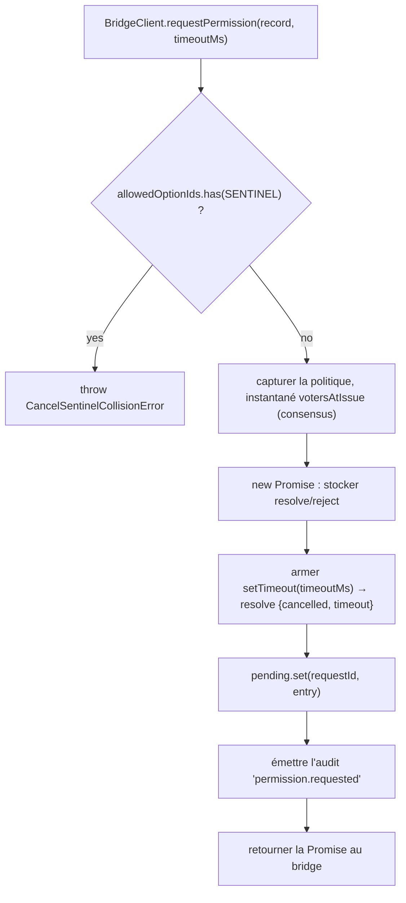
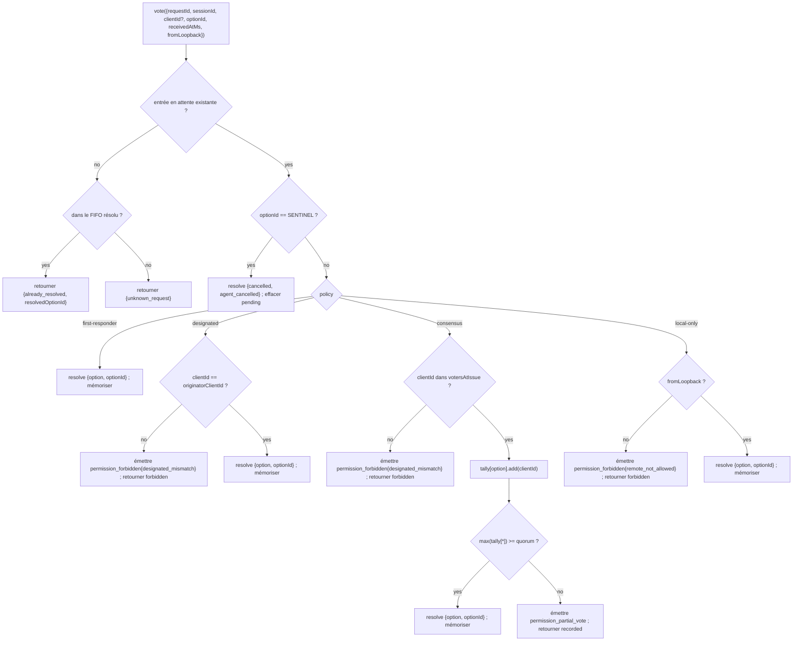

# Médiation des permissions multi-clients

## Vue d'ensemble

Lorsque l'agent enfant de l'ACP appelle `requestPermission`, le démon ne le transmet pas simplement à un seul client. Sous `sessionScope: 'single'`, chaque client connecté voit la requête et n'importe lequel d'entre eux peut y répondre. Sans médiation, les votes tardifs n'ont nulle part où aller, deux clients peuvent entrer en compétition pour la même requête, et un seul client malveillant peut outrepasser l'initiateur.

`MultiClientPermissionMediator` (`packages/acp-bridge/src/permissionMediator.ts`) implémente le contrat `PermissionMediator` (`packages/acp-bridge/src/permission.ts`) et gère tout l'état des permissions en attente et résolues pour le bridge. Il distribue les votes via l'une des quatre politiques déclarées dans `PermissionPolicy` :

| Policy            | Resolution rule                                                                                                        | Use case                                                                 |
| ----------------- | ---------------------------------------------------------------------------------------------------------------------- | ------------------------------------------------------------------------ |
| `first-responder` | Le premier vote valide l'emporte ; les votants ultérieurs reçoivent `permission_already_resolved`.                     | UX de collaboration inter-clients en temps réel (par défaut).            |
| `designated`      | Seul le `originatorClientId` de l'invite peut résoudre ; les autres voient `permission_forbidden{designated_mismatch}`.| SaaS multi-locataire où la surface d'interface utilisateur doit gérer ses propres approbations. |
| `consensus`       | Quorum de N sur M sur l'instantané des client-ids v1 ; les événements intermédiaires `permission_partial_vote` permettent aux interfaces utilisateur d'afficher la progression. | Revue des modifications en entreprise où deux opérateurs doivent se mettre d'accord. |
| `local-only`      | Refuse tout votant non-loopback ; bloque jusqu'à ce qu'un client loopback résolve.                                     | Postes de travail où le contrôle à distance ne doit jamais accorder d'élévation de privilèges. |

> **Limite de sécurité v1** : `X-Qwen-Client-Id` est auto-déclaré. `designated` et
> `consensus` n'ont pas encore de preuve de possession. Un client qui observe
> `originatorClientId` peut réutiliser cet identifiant. `{outcome:'cancelled'}` est également acheminé
> via la sentinelle d'annulation avant la distribution de la politique, donc même `local-only`
> ne peut pas traiter l'annulation comme une résolution protégée par la politique. Pour une isolation forte, liez
> le démon au loopback ou placez-le derrière un reverse proxy authentifié. Voir
> [Note de sécurité : l'identité du client v1 est auto-déclarée](#security-note-v1-client-identity-is-self-reported).

## Responsabilités

- Suivre chaque requête en attente (cycle de vie `request → vote → resolved`).
- Armer et désarmer les délais d'expiration par requête (l'**invariant N1** : le délai doit être armé de manière synchrone dans `request()` afin qu'une session immédiatement annulée ne puisse pas faire fuiter une fermeture définitivement en attente).
- Distribuer les votes via la politique capturée au moment de `request()` (changer la politique du démon en cours de route n'affecte pas les requêtes en cours).
- Maintenir un FIFO borné (`MAX_RESOLVED_PERMISSION_RECORDS = 512`) de requêtes récemment résolues afin que les votes en double reçoivent un `already_resolved` structuré plutôt qu'un `unknown_request`.
- Émettre `permission_partial_vote` (consensus) et `permission_forbidden` (designated / consensus / local-only) sur l'EventBus par session.
- Résoudre les requêtes en attente en tant que `{kind: 'cancelled', reason: 'session_closed'}` via `forgetSession(sessionId)` lors du démontage de la session.
- Rejeter l'injection malveillante ou accidentelle de `CANCEL_VOTE_SENTINEL` via le réseau (`InvalidPermissionOptionError`) et via les labels d'options publiés par l'agent (`CancelSentinelCollisionError`).

## Architecture

### Surface publique

```ts
interface PermissionMediator {
  readonly policy: PermissionPolicy;
  request(
    record: PermissionRequestRecord,
    timeoutMs: number,
  ): Promise<PermissionResolution>;
  vote(vote: PermissionVote): PermissionVoteOutcome;
  forgetSession(sessionId: string): void;
}
```

`MultiClientPermissionMediator` ajoute : `peekSessionFor(requestId)`, `pendingCount(sessionId)`, éditeur d'audit interne, etc. `BridgeClient` ne dépend que de la moitié `request()` (sous-typage structurel — voir `bridgeClient.ts`).

### `PermissionPolicy` et `PermissionVoteOutcome`

```ts
type PermissionPolicy =
  | 'first-responder'
  | 'designated'
  | 'consensus'
  | 'local-only';

type PermissionVoteOutcome =
  | { kind: 'resolved'; resolvedOptionId: string }
  | { kind: 'recorded'; votesNeeded: number } // consensus partial
  | { kind: 'already_resolved'; resolvedOptionId: string }
  | { kind: 'forbidden'; reason: 'designated_mismatch' | 'remote_not_allowed' }
  | { kind: 'unknown_request' };

type PermissionResolution =
  | { kind: 'option'; optionId: string }
  | {
      kind: 'cancelled';
      reason: 'timeout' | 'session_closed' | 'agent_cancelled';
    };
```

### Sentinelle d'annulation

`CANCEL_VOTE_SENTINEL = '__cancelled__'`. Le bridge mappe le votant `{outcome:'cancelled'}` à cette sentinelle **avant** d'appeler `mediator.vote`. Le médiateur achemine la sentinelle **avant** la distribution de la politique — l'annulation par le votant fonctionne sous chaque politique indépendamment du `clientId` / loopback / appartenance. Deux gardes :

1. **`bridge.ts`** rejette les votes réseau dont `optionId === CANCEL_VOTE_SENTINEL` avec `InvalidPermissionOptionError` (un client réseau malveillant ne doit pas pouvoir injecter une annulation en mentant sur un `optionId`).
2. **`mediator.request`** rejette les enregistrements dont `allowedOptionIds` contient la sentinelle avec `CancelSentinelCollisionError` (un agent publiant légitimement `'__cancelled__'` comme label d'option ne doit pas pouvoir se faire passer pour autre chose).

Cette échappatoire délibérée entre les politiques est documentée dans `permissionMediator.ts` afin qu'un futur mainteneur ne supprime pas accidentellement le contournement.

### État en attente

Chaque requête en attente est indexée par `requestId` et contient :

- `policy` — capturée au moment de `request()`.
- `record: PermissionRequestRecord` (requestId, sessionId, originatorClientId, allowedOptionIds, issuedAtMs).
- les fermetures `resolve` / `reject`.
- `votesAtIssue` (consensus uniquement) — instantané des `clientIds` enregistrés pour la session au moment de l'émission ; les votes ultérieurs sont rejetés s'ils ne font pas partie de cet ensemble.
- `tally` (consensus uniquement) — `Map<optionId, Set<clientId>>` comptant les votes par option.
- `timeoutHandle` — délai Node armé à l'intérieur de `request()` (invariant N1).
- `auditTrail[]` — enregistrements d'audit par vote.

### FIFO résolu

`MAX_RESOLVED_PERMISSION_RECORDS = 512`. L'éviction se fait par FIFO via `resolvedOrder.shift()` (revue DeepSeek #4335 / 3271627446 — reflète `PermissionAuditRing`). Ne stocke que `{requestId, sessionId, outcome}`, donc 512 enregistrements restent sous les 100 Ko sur les fenêtres normales de reconnexion/compétition de l'interface utilisateur.

## Workflow

### `request()` (invariant N1)



Le minuteur est armé **avant** même que l'entrée ne soit visible ailleurs. Sans cela, un `forgetSession` arrivant entre `pending.set` et `setTimeout` laisserait l'entrée en attente sans délai d'expiration — la `promptQueue` par session du bridge resterait bloquée indéfiniment.

### Distribution de `vote()`



### `forgetSession()`

Appelé lors de la fermeture de la session, de l'éviction et de l'arrêt du bridge. Pour chaque entrée en attente dont `record.sessionId === sessionId` :

1. Annuler le délai d'expiration.
2. Résoudre la Promise en attente avec `{kind: 'cancelled', reason: 'session_closed'}`.
3. Ajouter un enregistrement d'audit.
4. Retirer de `pending`.

Le chemin de démontage de session du bridge appelle toujours `forgetSession` **avant** la fenêtre de fermeture du canal afin que les permissions en attente ne survivent pas à leur session.

## État et cycle de vie

- `policy` est capturée par requête. Changer la politique à l'échelle du démon (surface future) n'affecte pas les requêtes en cours.
- `votesAtIssue` (consensus) est capturé au moment de `request()` ; les clients qui arrivent après la requête peuvent voter, mais si leur `clientId` n'était pas déjà enregistré auprès de la session au moment de l'émission, leur vote est rejeté en tant que `designated_mismatch`. Cela réutilise intentionnellement la raison de non-correspondance de la politique `designated` pour garder le contrat fermé ; les versions futures peuvent diviser l'union si les consommateurs du SDK ont besoin de faire la distinction.
- Les entrées résolues vivent dans le FIFO pour au maximum `MAX_RESOLVED_PERMISSION_RECORDS` (512). Après l'éviction, un vote en double sur le même `requestId` retourne `{unknown_request}`.
- `permission_partial_vote` ne se déclenche que pour `consensus`. Ne vous y fiez pas sous une autre politique.
- `permission_forbidden` se déclenche pour `designated`, `consensus` et `local-only` — pas pour `first-responder`.

## Dépendances

- [`03-acp-bridge.md`](./03-acp-bridge.md) — comment le bridge connecte `BridgeClient.requestPermission` à `mediator.request`.
- [`10-event-bus.md`](./10-event-bus.md) — comment les trames de vote partiel et interdites atteignent les clients.
- [`09-event-schema.md`](./09-event-schema.md) — contrats de charge utile pour les événements `permission_*`.
- [`08-session-lifecycle.md`](./08-session-lifecycle.md) — `forgetSession()` est appelé à chaque fin de session.
- [`02-serve-runtime.md`](./02-serve-runtime.md) — `PermissionAuditRing` (FIFO de 512 enregistrements d'audit).

## Configuration

| Source              | Knob                                                                                                   | Effect                                |
| ------------------- | ------------------------------------------------------------------------------------------------------ | ------------------------------------- |
| `settings.json`     | `policy.permissionStrategy`                                                                            | Politique active du médiateur.        |
| `settings.json`     | `policy.consensusQuorum`                                                                               | N pour le consensus.                  |
| `BridgeOptions`     | `permissionPolicy`, `permissionConsensusQuorum`, `permissionAudit`                                     | Remplacement programmatique.          |
| Balise de capacité  | `permission_mediation` (toujours ; `modes: ['first-responder', 'designated', 'consensus', 'local-only']`) | Ensemble pris en charge par la build. |
| Enveloppe de capacité | `policy.permission`                                                                                  | Politique active exécutée par ce démon. |

Si `policy.permissionStrategy` n'est pas explicitement configuré, le démon utilise `first-responder`. `designated`, `consensus` et `local-only` ne prennent effet que lorsqu'ils sont définis dans `settings.json`.

## Quorum de consensus : formule par défaut et le cas limite M=2

Lorsque la politique `consensus` est active et que `policy.consensusQuorum` n'est pas défini, le médiateur calcule **N = floor(M/2) + 1** via `consensusQuorumFor` dans `permissionMediator.ts` :

```ts
Math.max(1, Math.floor(m / 2) + 1);
```

| M (`votersAtIssue.size`) | N par défaut | Comportement                        |
| ------------------------ | --------- | ------------------------------- |
| 1                        | 1         | Un seul votant résout immédiatement. |
| 2                        | 2         | Nécessite un accord unanime.   |
| 3                        | 2         | Majorité.                       |
| 4                        | 3         | Plus de la moitié.                 |
| 5                        | 3         | Majorité.                       |
| 6                        | 4         | Plus de la moitié.                 |

Pour **M = 2**, les votes partagés (A sélectionne X, B sélectionne Y) ne peuvent être résolus que par le délai d'expiration par permission : aucune option n'atteint l'unanimité, la requête attend donc jusqu'à `permissionResponseTimeoutMs` (5 min par défaut) et se résout en `{cancelled, timeout}`. Le chemin d'avancement des votes enregistre ce comportement « l'unanimité signifie que les votes partagés expirent » dans stderr pour les opérateurs.

Les opérateurs qui souhaitent un comportement « le premier vote l'emporte » pour M = 2 peuvent définir explicitement `policy.consensusQuorum: 1`. Les configurations plus strictes, comme exiger l'unanimité pour M = 4, utilisent le même champ.

## Validation de la politique au démarrage

`runQwenServe.validatePolicyConfig(policyConfig)` (`packages/cli/src/serve/run-qwen-serve.ts`) valide le `settings.json` fusionné `policy.*` au démarrage et lève `InvalidPolicyConfigError` en cas d'erreurs de l'opérateur :

- `policy.permissionStrategy` est défini mais ne fait pas partie des quatre modes pris en charge. L'ensemble valide est dérivé au moment de l'exécution depuis `SERVE_CAPABILITY_REGISTRY.permission_mediation.modes`, la source unique de vérité pour l'annonce des capacités.
- `policy.consensusQuorum` est défini mais n'est pas un entier positif.

Il y a également un avertissement soft dans stderr lorsque `consensusQuorum` est défini alors que `permissionStrategy !== 'consensus'` ; le remplacement serait autrement ignoré silencieusement sous les politiques non-consensus.

`InvalidPolicyConfigError` est exporté pour les tests `instanceof`. `runQwenServe` l'utilise pour distinguer la mauvaise configuration de l'opérateur, qui est relancée en tant qu'échec de démarrage explicite, des erreurs d'E/S de lecture des paramètres, qui reviennent aux valeurs par défaut.

## Note de sécurité : l'identité du client v1 est auto-déclarée

`X-Qwen-Client-Id` est fourni par le client HTTP. Dans la v1, le démon valide le format (`[A-Za-z0-9._:-]{1,128}`) et suit les identifiants clients attachés dans `clientIds`, mais il n'effectue pas de preuve de possession. Tout client qui peut observer `originatorClientId` dans SSE peut s'enregistrer avec le même identifiant et usurper l'identité de cet initiateur dans les requêtes ultérieures.

Impact sur la politique :

- **`first-responder`** n'est pas affecté car il ne dépend pas de l'identité.
- **`designated`** peut être usurpé par un client distant réutilisant `originatorClientId`.
- **`consensus`** se base sur l'instantané `votersAtIssue` au moment de l'émission ; si un identifiant usurpé est déjà attaché lorsque la requête est émise, il peut voter.
- **`local-only`** est immunisé contre l'usurpation d'identité car `fromLoopback: boolean` est estampillé par le démon depuis l'adresse distante de la connexion, et non fourni par le client.

Un futur mécanisme de pair-token émettra un secret par session depuis `POST /session` et l'exigera pour les votes `designated` / `consensus`. Ce mécanisme n'existe pas dans la v1.

## Routage des votes inter-connexions

### Chemins de livraison des votes

Les votes de permission peuvent atteindre le médiateur du bridge via deux chemins de transport indépendants :

1. **Transport ACP (réponse sur la même connexion)** : L'événement bridge `permission_request` est livré au flux SSE/WS scoped à la session de la connexion propriétaire en tant que requête JSON-RPC `session/request_permission`. Le client répond avec une réponse JSON-RPC sur la même connexion. La méthode `resolveClientResponse` du dispatcher mappe l'identifiant JSON-RPC local à la connexion vers le `requestId` du bridge et appelle `bridge.respondToSessionPermission`.

2. **API REST (inter-connexions)** : Tout client HTTP — y compris les clients sur une connexion ACP différente ou sans connexion ACP — peut voter via `POST /session/:id/permission/:requestId`. La route héritée `POST /permission/:requestId` (sans session dans l'URL) utilise `peekSessionFor(requestId)` pour résoudre la session avant de déléguer au même chemin `respondToSessionPermission`.

### Identifiants de requête de permission locaux à la connexion

Le transport ACP utilise un schéma d'identifiants à deux niveaux pour mapper entre le réseau et le bridge :

| Layer               | ID format                                            | Scope            | Purpose                                                                                       |
| ------------------- | ---------------------------------------------------- | ---------------- | --------------------------------------------------------------------------------------------- |
| Identifiant de message JSON-RPC | `_qwen_perm_N` (chaîne, monotonique par connexion)    | Local à la connexion | Corrèle la paire requête→réponse JSON-RPC sur le flux de session.                          |
| Identifiant de requête du bridge   | Chaîne opaque (UUID généré par l'agent/médiateur) | Global au démon    | Identifie la requête de permission à travers toutes les routes et les cartes en attente/résolues du médiateur. |

L'identifiant de requête du bridge est transmis via l'extension fournisseur `_meta` afin que le client puisse l'inclure lors du vote via le chemin REST :

```json
{
  "method": "session/request_permission",
  "id": "_qwen_perm_3",
  "params": {
    "sessionId": "<session-id>",
    "toolCall": { "name": "shell" },
    "options": [{ "optionId": "allow", "name": "Allow" }],
    "_meta": { "qwen": { "requestId": "<bridge-request-id>" } }
  }
}
```

La connexion stocke le mappage dans `conn.pending: Map<jsonRpcId, PendingClientRequest>`, où `PendingClientRequest.bridgeRequestId` est l'identifiant au niveau du bridge.

### Règles d'autorisation des votes

`respondToSessionPermission(sessionId, requestId, response, context)` applique les vérifications suivantes **dans l'ordre** :

1. **Existence de la session** — la session adressée par `sessionId` doit être active (`byId.has(sessionId)`). Sinon, `SessionNotFoundError`.

2. **Rejet inter-sessions** — `peekSessionFor(requestId)` résout la session à laquelle la requête appartient réellement. Si elle appartient à une session _différente_, le vote est rejeté (retourne `false` / 404) sans exposer les informations d'appartenance à la session.

3. **Garde de requête inconnue** — lorsque `peekSessionFor` retourne `undefined` (requête expirée, évincée par LRU, ou inexistante), le vote est rejeté (retourne `false` / 404) **avant** toute validation de `clientId`. Cela empêche une attaque par oracle : sans cela, une sonde avec un `clientId` fabriqué pourrait distinguer « la session a ce client » (passe la validation → 404) de « client inconnu » (`InvalidClientIdError` → 400).

4. **Validation de l'identité du client** — `resolveTrustedClientId(entry, context?.clientId)` vérifie que le `X-Qwen-Client-Id` fourni (REST) ou le `clientId` estampillé par le bridge (ACP) est enregistré sur la carte `clientIds` de la session. Les votes anonymes (`clientId === undefined`) passent — la distribution de la politique les gère. Les identifiants non enregistrés lèvent `InvalidClientIdError` (mappé à 400 par les gestionnaires de routes).

5. **Application de la sentinelle d'annulation** — un vote réseau de `{ outcome: "selected", optionId: "__cancelled__" }` est rejeté avec `InvalidPermissionOptionError` pour empêcher l'injection de sentinelle.

6. **Distribution de `vote()` du médiateur** — le vote validé est transmis à `permissionMediator.vote(...)` qui applique la politique active (voir [Workflow → Distribution de `vote()`](#vote-dispatch)).
### Évaluation du loopback

Le bit `fromLoopback` est évalué **par requête**, et non par connexion :

- **Transport ACP** : `reqLoopback` est déterminé à partir de l'adresse `req.socket.remoteAddress` au niveau du noyau de la requête POST, au niveau de la couche HTTP, puis transmis à `dispatcher.handle(conn, msg, sessionHeader, isLoopbackReq(req))`. Cela signifie qu'un POST de vote de permission provenant d'un pair différent de celui de la requête `initialize` fait l'objet de sa propre évaluation de loopback.
- **API REST** : `detectFromLoopback(req)` évalue la même adresse distante au niveau du socket.

Aucun de ces chemins ne déduit le loopback d'en-têtes falsifiables (`X-Forwarded-For`, `Forwarded`, etc.).

### Format de réponse au vote du transport ACP

Un client répond à `session/request_permission` avec une réponse JSON-RPC standard :

**Accepter (sélectionner une option)** :

```json
{
  "jsonrpc": "2.0",
  "id": "_qwen_perm_3",
  "result": {
    "outcome": { "outcome": "selected", "optionId": "allow" }
  }
}
```

**Annuler** :

```json
{
  "jsonrpc": "2.0",
  "id": "_qwen_perm_3",
  "result": {
    "outcome": { "outcome": "cancelled" }
  }
}
```

**Réponse d'erreur** (mappée à une annulation par le dispatcher) :

```json
{
  "jsonrpc": "2.0",
  "id": "_qwen_perm_3",
  "error": { "code": -32000, "message": "user declined" }
}
```

### Récupération après échec dans `resolveClientResponse`

Lorsque `bridge.respondToSessionPermission` lève une exception (par ex. corps de vote mal formé), le dispatcher se rabat sur une annulation explicite (`cancelAbandonedPermission`) afin que le médiateur ne reste jamais bloqué de façon permanente. Si le vote et l'annulation lèvent tous deux une exception (double échec), l'entrée `pending` est **conservée** afin que le démontage éventuel de la connexion (`abandonPendingForSession`) puisse réessayer.

## Mises en garde et limites connues

- **Les routes de la sentinelle d'annulation s'exécutent AVANT le dispatch de la politique** par conception : un démon `local-only` et un démon `consensus` peuvent tous deux être annulés par n'importe quel votant qui envoie `{outcome: 'cancelled'}`. Ceci est documenté dans `permissionMediator.ts` et constitue le chemin d'abandon côté agent.
- **`designated` et `consensus` surchargent `designated_mismatch`** dans `PermissionVoteOutcome`. Le médiateur émet des enregistrements d'audit distincts, mais le format sur le réseau est unique. Les futures versions du protocole pourraient scinder l'union.
- **Les votants anonymes (sans `X-Qwen-Client-Id`)** sont acceptés uniquement sous `first-responder` et `local-only` (loopback) ; `designated` et `consensus` les rejettent.
- **Le mécanisme de dérogation inter-politiques** implique que l'annulation ne peut pas être contrôlée par la politique. Si un déploiement a besoin d'une annulation contrôlée par la politique, cela nécessitera un changement de contrat futur — ne tentez pas de contourner cela avec des vérifications au niveau des routes.
- **La sémantique d'instantané de `votesAtIssue`** implique que dans un déploiement `consensus` avec un ensemble de clients très dynamique, des clients légitimes peuvent être rejetés s'ils se sont connectés après l'émission de la requête. Les opérateurs doivent pré-enregistrer les identifiants client des collaborateurs avant d'émettre les invites de révision des changements.

## Références

- `packages/acp-bridge/src/permission.ts` (contrat figé)
- `packages/acp-bridge/src/permissionMediator.ts` (implémentation du médiateur F3)
- `packages/acp-bridge/src/bridgeClient.ts` (utilise le sous-typage structurel sur `PermissionMediator`)
- `packages/acp-bridge/src/bridge.ts` (`respondToSessionPermission` — routage et autorisation des votes)
- `packages/acp-bridge/src/bridgeErrors.ts` (`CancelSentinelCollisionError`, `InvalidPermissionOptionError`, `PermissionForbiddenError`, `InvalidClientIdError`)
- `packages/cli/src/serve/acp-http/dispatch.ts` (`resolveClientResponse` — chemin de vote du transport ACP)
- `packages/cli/src/serve/acp-http/connection-registry.ts` (`AcpConnection.pending` — mappage des requêtes locales à la connexion)
- `packages/cli/src/serve/routes/permission.ts` (routes de vote REST)
- `packages/cli/src/serve/permission-audit.ts` (anneau d'audit + éditeur)
- Issue : [#4175](https://github.com/QwenLM/qwen-code/issues/4175) série F3.