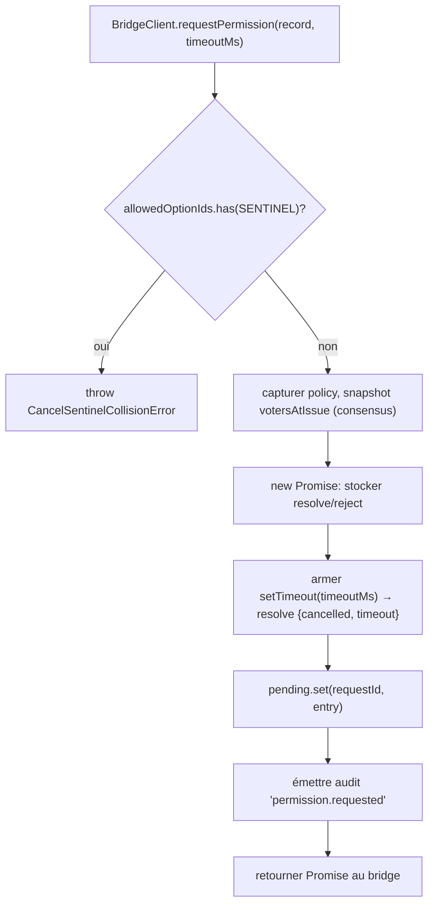
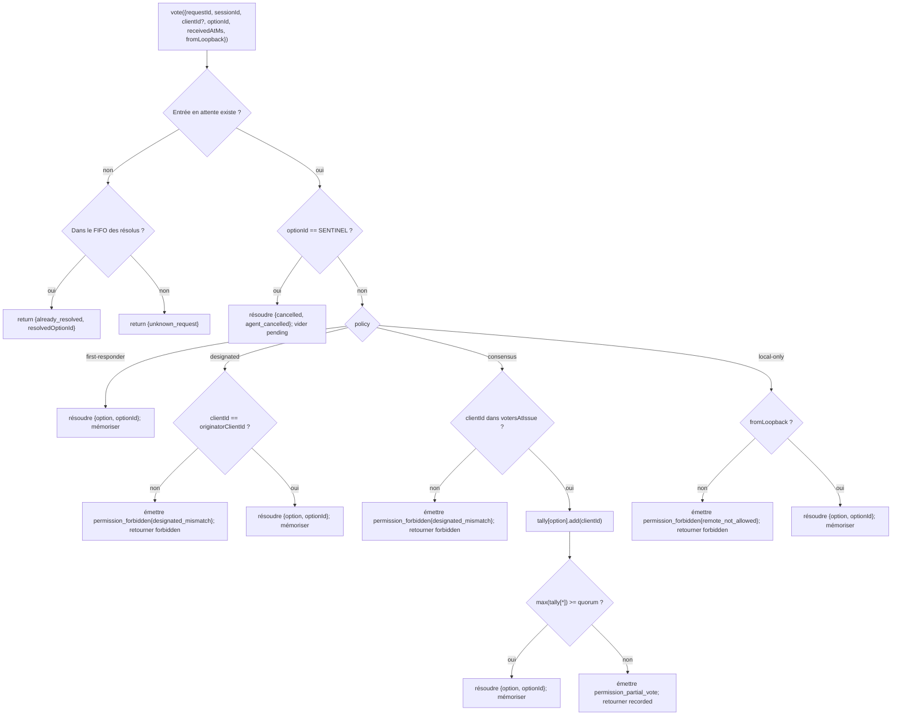

# Médiation d’autorisations multi‑client

## Aperçu

Lorsque l’agent enfant de l’ACP appelle `requestPermission`, le démon ne se contente pas de le transmettre à un client. Avec `sessionScope: 'single'`, chaque client connecté voit la requête et n’importe lequel d’entre eux peut répondre. Sans médiation, les votes tardifs n’ont nulle part où aller, deux clients peuvent se disputer la même requête, et un seul client malveillant peut outrepasser l’émetteur.

`MultiClientPermissionMediator` (`packages/acp-bridge/src/permissionMediator.ts`) implémente le contrat `PermissionMediator` (`packages/acp-bridge/src/permission.ts`) et possède tout l’état des autorisations en attente et résolues pour le pont. Il distribue les votes via l’une des quatre politiques déclarées dans `PermissionPolicy` :

| Politique         | Règle de résolution                                                                                                        | Cas d’utilisation                                                                    |
| ----------------- | -------------------------------------------------------------------------------------------------------------------------- | ------------------------------------------------------------------------------------ |
| `first-responder` | Le premier vote valide l’emporte ; les votants suivants reçoivent `permission_already_resolved`.                           | UX de collaboration multi‑client en direct (par défaut).                             |
| `designated`      | Seul le `originatorClientId` de l’invite peut résoudre ; les autres voient `permission_forbidden{designated_mismatch}`.    | SaaS par locataire où la surface d’interface doit posséder ses propres approbations. |
| `consensus`       | Quorum de N‑M votes parmi l’instantané v1 des client‑id ; les événements `permission_partial_vote` intermédiaires permettent aux IU d’afficher la progression. | Revue de changement en entreprise où deux opérateurs doivent être d’accord.          |
| `local-only`      | Refuse tout votant non‑loopback ; bloque jusqu’à ce qu’un client loopback résolve.                                         | Postes de travail où le contrôle à distance ne doit jamais accorder d’élévation de privilèges. |

> **Limite de sécurité v1** : `X-Qwen-Client-Id` est auto‑déclaré. `designated` et
> `consensus` ne disposent pas encore de preuve de possession. Un client qui observe
> `originatorClientId` peut réutiliser cet identifiant. `{outcome:'cancelled'}` passe également
> par la sentinelle d’annulation avant la distribution selon la politique, donc même
> `local-only` ne peut pas traiter une annulation comme une résolution protégée par la politique.
> Pour un isolement fort, liez le démon au loopback ou placez‑le derrière un proxy inverse authentifié.
> Voir [Note de sécurité : l’identité client v1 est auto‑déclarée](#security-note-v1-client-identity-is-self-reported).

## Responsabilités

- Suivre chaque requête en attente (cycle de vie `request → vote → resolved`).
- Armer et désarmer les expirations par requête (invariant **N1** : l’expiration doit être armée de manière synchrone à l’intérieur de `request()` pour qu’une session annulée immédiatement ne puisse pas laisser une fermeture en attente).
- Distribuer les votes via la politique capturée au moment de `request()` (changer la politique du démon en cours de route n’affecte pas les requêtes en vol).
- Maintenir un FIFO borné (`MAX_RESOLVED_PERMISSION_RECORDS = 512`) des requêtes récemment résolues afin que les votes en double reçoivent un `already_resolved` structuré plutôt que `unknown_request`.
- Émettre `permission_partial_vote` (consensus) et `permission_forbidden` (designated / consensus / local-only) sur le bus d’événements par session.
- Résoudre les requêtes en attente avec `{kind: 'cancelled', reason: 'session_closed'}` via `forgetSession(sessionId)` lors du démontage de la session.
- Rejeter l’injection malveillante ou accidentelle de `CANCEL_VOTE_SENTINEL` via le fil (`InvalidPermissionOptionError`) et via les libellés d’options publiés par l’agent (`CancelSentinelCollisionError`).

## Architecture

### Surface publique

```ts
interface PermissionMediator {
  readonly policy: PermissionPolicy;
  request(
    record: PermissionRequestRecord,
    timeoutMs: number,
  ): Promise<PermissionResolution>;
  vote(vote: PermissionVote): PermissionVoteOutcome;
  forgetSession(sessionId: string): void;
}
```

`MultiClientPermissionMediator` ajoute : `peekSessionFor(requestId)`, `pendingCount(sessionId)`, éditeur d’audit interne, etc. `BridgeClient` dépend uniquement de la moitié `request()` (sous‑typage structurel — voir `bridgeClient.ts`).

### `PermissionPolicy` et `PermissionVoteOutcome`

```ts
type PermissionPolicy =
  | 'first-responder'
  | 'designated'
  | 'consensus'
  | 'local-only';

type PermissionVoteOutcome =
  | { kind: 'resolved'; resolvedOptionId: string }
  | { kind: 'recorded'; votesNeeded: number } // consensus partial
  | { kind: 'already_resolved'; resolvedOptionId: string }
  | { kind: 'forbidden'; reason: 'designated_mismatch' | 'remote_not_allowed' }
  | { kind: 'unknown_request' };

type PermissionResolution =
  | { kind: 'option'; optionId: string }
  | {
      kind: 'cancelled';
      reason: 'timeout' | 'session_closed' | 'agent_cancelled';
    };
```

### Sentinelle d’annulation

`CANCEL_VOTE_SENTINEL = '__cancelled__'`. Le pont transforme le `{outcome:'cancelled'}` du votant en cette sentinelle **avant** d’appeler `mediator.vote`. Le médiateur achemine la sentinelle **avant** la distribution selon la politique — l’annulation par le votant fonctionne sous toutes les politiques, indépendamment du `clientId`, du loopback ou de l’appartenance. Deux gardes :
1. **`bridge.ts`** rejette les votes de fil dont `optionId === CANCEL_VOTE_SENTINEL` avec `InvalidPermissionOptionError` (un client fil malveillant ne doit pas pouvoir injecter une annulation en mentant sur un `optionId`).
2. **`mediator.request`** rejette les enregistrements dont `allowedOptionIds` contient le sentinelle avec `CancelSentinelCollisionError` (un agent publiant légitimement `'__cancelled__'` comme libellé d'option ne doit pas pouvoir se faire passer).

Cette échappatoire intentionnelle inter-politiques est documentée dans `permissionMediator.ts` afin qu'un mainteneur futur ne supprime pas accidentellement la dérogation.

### État en attente

Chaque requête en attente est indexée par `requestId` et contient :

- `policy` — capturée au moment de `request()`.
- `record: PermissionRequestRecord` (requestId, sessionId, originatorClientId, allowedOptionIds, issuedAtMs).
- closures `resolve` / `reject`.
- `votesAtIssue` (consensus uniquement) — instantané des `clientIds` enregistrés pour la session au moment de l'émission ; les votes ultérieurs sont rejetés s'ils ne font pas partie de cet ensemble.
- `tally` (consensus uniquement) — `Map<optionId, Set<clientId>>` comptant les votes par option.
- `timeoutHandle` — timer Node armé à l'intérieur de `request()` (invariant N1).
- `auditTrail[]` — enregistrements d'audit par vote.

### FIFO des résolus

`MAX_RESOLVED_PERMISSION_RECORDS = 512`. L'éviction est FIFO via `resolvedOrder.shift()` (revue DeepSeek #4335 / 3271627446 — miroir de `PermissionAuditRing`). Stocke uniquement `{requestId, sessionId, outcome}`, donc 512 enregistrements restent sous 100 Ko pour les fenêtres normales de reconnexion/concurrence UI.

## Workflow

### `request()` (invariant N1)



Le timer est armé **avant** que l'entrée ne soit visible ailleurs. Sans cela, un `forgetSession` arrivant entre `pending.set` et `setTimeout` laisserait l'entrée en attente sans timeout — la `promptQueue` par session du bridge resterait bloquée indéfiniment.

### Dispatch de `vote()`



### `forgetSession()`

Appelée à la fermeture de session, à l'éviction et à l'arrêt du bridge. Pour chaque entrée en attente dont `record.sessionId === sessionId` :

1. Annuler le timeout.
2. Résoudre la Promise en attente avec `{kind: 'cancelled', reason: 'session_closed'}`.
3. Ajouter un enregistrement d'audit.
4. Supprimer de `pending`.

Le chemin de démantèlement de session du bridge appelle toujours `forgetSession` **avant** la fenêtre de coupure de canal afin que les permissions en attente ne survivent pas à leur session.

## État & Cycle de vie

- `policy` est capturée par requête. Modifier la politique à l'échelle du démon (surface future) n'affecte pas les requêtes en cours.
- `votesAtIssue` (consensus) est capturé au moment de `request()` ; les clients qui arrivent après la requête peuvent voter, mais si leur `clientId` n'était pas déjà enregistré pour la session au moment de l'émission, leur vote est rejeté comme `designated_mismatch`. Cela réutilise intentionnellement la raison de non-concordance de la politique `designated` pour garder le contrat fermé ; les versions futures pourront diviser l'union si les consommateurs SDK doivent distinguer.
- Les entrées résolues vivent dans le FIFO pendant au plus `MAX_RESOLVED_PERMISSION_RECORDS` (512). Après éviction, un vote en double sur le même `requestId` retourne `{unknown_request}`.
- `permission_partial_vote` ne se déclenche que pour `consensus`. Ne pas s'y fier sous une autre politique.
- `permission_forbidden` se déclenche pour `designated`, `consensus` et `local-only` — pas `first-responder`.

## Dépendances
- [`03-acp-bridge.md`](./03-acp-bridge.md) — comment le pont connecte `BridgeClient.requestPermission` à `mediator.request`.
- [`10-event-bus.md`](./10-event-bus.md) — comment les trames de vote partiel et interdites atteignent les clients.
- [`09-event-schema.md`](./09-event-schema.md) — contrats de payload pour les événements `permission_*`.
- [`08-session-lifecycle.md`](./08-session-lifecycle.md) — `forgetSession()` est appelée à chaque terminaison de session.
- [`02-serve-runtime.md`](./02-serve-runtime.md) — `PermissionAuditRing` (FIFO de 512 entrées pour les enregistrements d'audit).

## Configuration

| Source              | Paramètre                                                                                               | Effet                                |
| ------------------- | ------------------------------------------------------------------------------------------------------- | ------------------------------------ |
| `settings.json`     | `policy.permissionStrategy`                                                                             | Politique du médiateur active.       |
| `settings.json`     | `policy.consensusQuorum`                                                                                | N pour le consensus.                 |
| `BridgeOptions`     | `permissionPolicy`, `permissionConsensusQuorum`, `permissionAudit`                                      | Surcharge programmatique.            |
| Étiquette de capacité | `permission_mediation` (toujours ; `modes: ['first-responder', 'designated', 'consensus', 'local-only']`) | Ensemble supporté par la build.      |
| Enveloppe de capacité | `policy.permission`                                                                                     | Politique active que ce démon exécute. |

Si `policy.permissionStrategy` n'est pas explicitement configuré, le démon utilise
`first-responder`. `designated`, `consensus`, et `local-only` ne prennent effet
que lorsqu'ils sont définis dans `settings.json`.

## Quorum de consensus : formule par défaut et le cas M=2

Lorsque la politique `consensus` est active et que `policy.consensusQuorum` n'est pas défini,
le médiateur calcule **N = floor(M/2) + 1** via `consensusQuorumFor` dans
`permissionMediator.ts` :

```ts
Math.max(1, Math.floor(m / 2) + 1);
```

| M (`votersAtIssue.size`) | N par défaut | Comportement                        |
| ------------------------ | ------------ | ----------------------------------- |
| 1                        | 1            | Un votant résout immédiatement.     |
| 2                        | 2            | Nécessite un accord unanime.        |
| 3                        | 2            | Majorité.                           |
| 4                        | 3            | Plus de la moitié.                  |
| 5                        | 3            | Majorité.                           |
| 6                        | 4            | Plus de la moitié.                  |

Pour **M = 2**, les votes partagés (A choisit X, B choisit Y) ne peuvent être résolus
que par le délai d'attente par permission : aucune option n'atteint l'unanimité,
donc la requête attend jusqu'à `permissionResponseTimeoutMs` (5 min par défaut)
et se résout en `{cancelled, timeout}`. Le chemin d'avancement des votes enregistre
ce comportement « l'unanimité signifie que les votes partagés expirent » sur stderr
pour les opérateurs.

Les opérateurs qui souhaitent un comportement de premier vote gagnant pour M = 2
peuvent définir explicitement `policy.consensusQuorum: 1`. Des configurations plus
strictes, comme exiger l'unanimité pour M = 4, utilisent le même champ.

## Validation de la politique au démarrage

`runQwenServe.validatePolicyConfig(policyConfig)`
(`packages/cli/src/serve/run-qwen-serve.ts`) valide le `settings.json` fusionné
`policy.*` au démarrage et lève `InvalidPolicyConfigError` pour les erreurs
de l'opérateur :

- `policy.permissionStrategy` est défini mais pas dans les quatre modes pris en charge.
  L'ensemble valide est dérivé à l'exécution de
  `SERVE_CAPABILITY_REGISTRY.permission_mediation.modes`, la source unique de
  vérité pour la publication des capacités.
- `policy.consensusQuorum` est défini mais n'est pas un entier positif.

Il existe également un avertissement logiciel sur stderr lorsque `consensusQuorum`
est défini alors que `permissionStrategy !== 'consensus'` ; la surcharge serait
autrement ignorée silencieusement sous les politiques non consensus.

`InvalidPolicyConfigError` est exporté pour les tests `instanceof`. `runQwenServe`
l'utilise pour distinguer les erreurs de configuration de l'opérateur, qui sont
relancées comme une défaillance explicite au démarrage, des échecs de lecture
des paramètres I/O, qui reviennent aux valeurs par défaut.

## Note de sécurité : l'identité du client v1 est auto-déclarée

`X-Qwen-Client-Id` est fourni par le client HTTP. Dans v1, le démon valide le format
(`[A-Za-z0-9._:-]{1,128}`) et suit les identifiants clients attachés dans
`clientIds`, mais il n'effectue pas de preuve de possession. Tout client qui peut
observer `originatorClientId` dans SSE peut s'enregistrer avec le même identifiant
et usurper l'identité de cet émetteur dans les requêtes ultérieures.

Impact sur la politique :

- **`first-responder`** n'est pas affecté car il ne dépend pas de l'identité.
- **`designated`** peut être usurpé par un client distant réutilisant `originatorClientId`.
- **`consensus`** se base sur l'instantané `votersAtIssue` au moment de l'émission ;
  si un identifiant usurpé est déjà attaché lors de l'émission de la requête, il peut voter.
- **`local-only`** est immunisé contre l'usurpation d'identifiant car `fromLoopback: boolean`
  est estampillé par le démon depuis l'adresse distante de la connexion, et non fourni par le client.
Un futur mécanisme de paire de jetons émettra un secret par session depuis
`POST /session` et l'exigera pour les votes `designated` / `consensus`. Ce
mécanisme n'existe pas dans la v1.

## Mises en garde et limites connues

- **Annuler les routes sentinelles AVANT la distribution des politiques** par conception — un démon `local-only` et un démon `consensus` peuvent tous deux être annulés par tout votant qui publie `{outcome: 'cancelled'}`. Ceci est documenté dans `permissionMediator.ts` et constitue la voie d’abandon côté agent.
- **`designated` et `consensus` surchargent `designated_mismatch`** dans `PermissionVoteOutcome`. Le médiateur émet des enregistrements d’audit séparés mais la forme sur le fil est unique. Les futures versions du protocole pourront diviser l’union.
- **Les votants anonymes (pas de `X-Qwen-Client-Id`)** sont acceptés uniquement sous `first-responder` et `local-only` (boucle locale) ; `designated` et `consensus` les rejettent.
- **L’échappatoire inter-politiques** signifie que l’annulation ne peut pas être restreinte par une politique. Si un déploiement a besoin d’une annulation restreinte par politique, cela nécessiterait un changement de contrat futur — ne pas masquer avec des vérifications au niveau des routes.
- **La sémantique d’instantané `votesAtIssue`** implique qu’un déploiement en consensus avec un ensemble de clients en rotation peut rejeter des clients légitimes parce qu’ils se sont connectés après l’émission de la requête. Les opérateurs devraient pré-enregistrer les identifiants clients des collaborateurs avant d’émettre des invites de révision de modifications.

## Références

- `packages/acp-bridge/src/permission.ts` (contrat figé)
- `packages/acp-bridge/src/permissionMediator.ts` (implémentation du médiateur F3)
- `packages/acp-bridge/src/bridgeClient.ts` (utilise le sous-typage structurel sur `PermissionMediator`)
- `packages/acp-bridge/src/bridgeErrors.ts` (`CancelSentinelCollisionError`, `InvalidPermissionOptionError`, `PermissionForbiddenError`)
- `packages/cli/src/serve/permission-audit.ts` (anneau d’audit + éditeur)
- Problème : [#4175](https://github.com/QwenLM/qwen-code/issues/4175) série F3.
