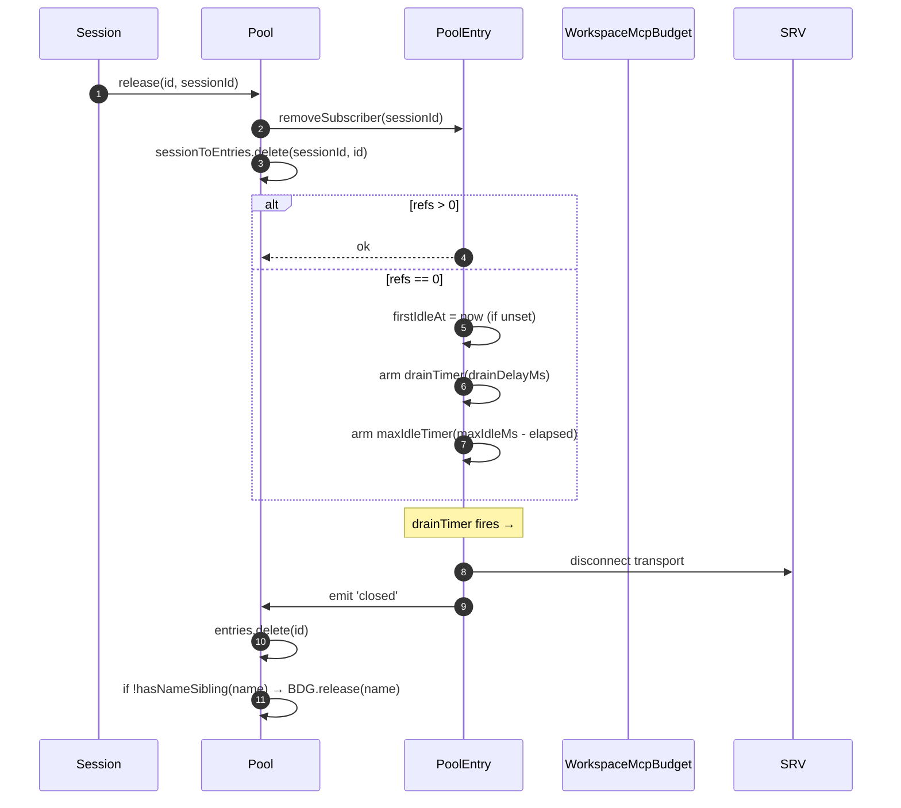
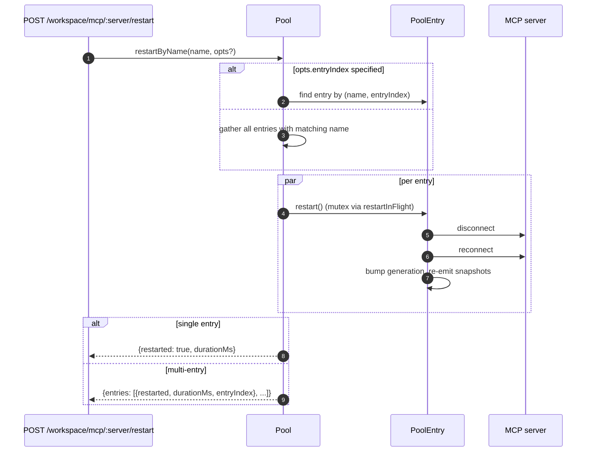
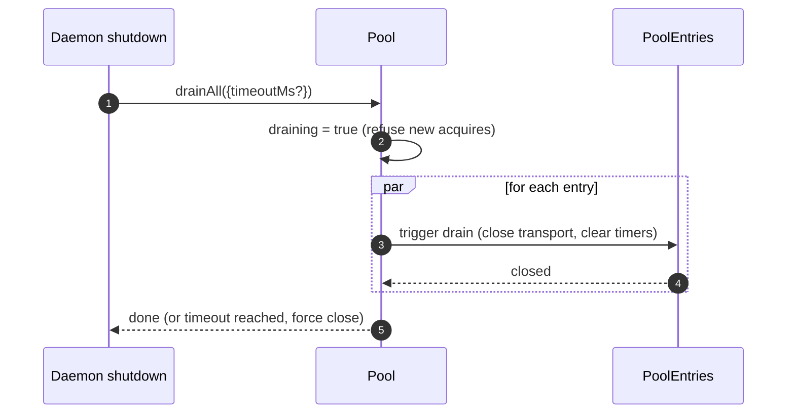

# Pool de Transports MCP de l’Espace de Travail

## Aperçu

`McpTransportPool` (`packages/core/src/tools/mcp-transport-pool.ts`) est le pool à l’échelle de l’espace de travail F2 (commit 5 de #4175) : plusieurs sessions ACP sur un même démon partagent un seul transport par tuple unique `(serverName + configFingerprint)`, au lieu que chacune génère son propre processus enfant MCP. Le pool réside **à l’intérieur de l’enfant ACP** (`QwenAgent.mcpPool`), est construit une fois au démarrage de l’agent avec le `Config` d’amorçage du démon, et survit aux cycles de vie des sessions. Les entrées comptent les références des sessions attachées et se ferment après une période de grâce configurable lorsque le compteur de références atteint zéro.

C’est le mécanisme principal qui empêche un démon multi-sessions de forker une copie de chaque serveur MCP par session.

## Responsabilités

- Acquérir ou générer un transport MCP par `(nom + empreinte)`, en dédoublonnant les acquisitions concurrentes via `spawnInFlight`.
- Libérer les références par session ; armer le minuteur de vidange de l’entrée lorsque la dernière référence se détache.
- Survivre aux fluctuations du compteur de références avec un plafond dur `MAX_IDLE_MS` afin qu’un client instable ne puisse pas maintenir un transport inactif indéfiniment.
- Compter les références des sessions dans un index inversé (`sessionToEntries`) pour que `releaseSession(sessionId)` soit en O(références) plutôt qu’O(entrées).
- Redémarrer les entrées à la demande (`restartByName`) — pour une entrée unique, retourne `{restarted, durationMs}`, pour plusieurs entrées, retourne `{entries: RestartResult[]}` (contrat multi-entrées F2).
- Vider l’intégralité du pool à l’arrêt du démon avec un délai d’attente configurable ; refuser de nouvelles acquisitions pendant le vidage.
- Consulter `WorkspaceMcpBudget` (voir [`06-mcp-budget-guardrails.md`](./06-mcp-budget-guardrails.md)) lors de l’`acquire` pour appliquer des limites de réservation par nom ; libérer l’emplacement à la fermeture de l’entrée lorsqu’aucune entrée sœur ne possède le même nom.
- Produire des instantanés filtrés d’outils/invites par session via `SessionMcpView` afin qu’une découverte dans une session n’enregistre pas d’outils dans d’autres sessions.

## Architecture

### Surface publique

```ts
class McpTransportPool {
  constructor(cliConfig: Config, options: McpTransportPoolOptions);
  acquire(
    serverName,
    cfg,
    sessionId,
    sessionToolRegistry,
    sessionPromptRegistry,
  ): Promise<PooledConnection>;
  release(id, sessionId): void;
  releaseSession(sessionId): void;
  restartByName(
    name,
    opts?,
  ): Promise<RestartResult | { entries: RestartResult[] }>;
  drainAll(opts?): Promise<void>;
  getBudget(): WorkspaceMcpBudget | undefined;
  getSnapshot(): McpPoolSnapshot;
}
```

`McpTransportPoolOptions` :

- `workspaceContext: WorkspaceContext` (obligatoire).
- `debugMode: boolean`.
- `sendSdkMcpMessage?` — rappel par session (le pool contourne le SDK MCP).
- `pooledTransports?: ReadonlySet<McpTransportKind>` — par défaut `{stdio, websocket}`. Les transports HTTP/SSE restent non mutualisés par défaut car leurs en-têtes peuvent contenir un état OAuth spécifique à la session, mais les opérateurs peuvent explicitement les autoriser dans le pool avec `QWEN_SERVE_MCP_POOL_TRANSPORTS`.
- `drainDelayMs?` — par défaut `30_000`.
- `entryOptions?: (transport) => PoolEntryOptions`.
- `budget?: WorkspaceMcpBudget`.

### État interne

| État                | Type                                    | Objectif                                                                                                                 |
| ------------------- | --------------------------------------- | ------------------------------------------------------------------------------------------------------------------------ |
| `entries`           | `Map<ConnectionId, PoolEntry>`          | Entrées actives du pool, indexées par `connectionIdOf(name, fingerprint)`.                                                |
| `unpooledIds`       | `Set<ConnectionId>`                     | Entrées pour les transports en dehors de la liste d’autorisation `pooledTransports` configurée.                          |
| `spawnInFlight`     | `Map<ConnectionId, Promise<PoolEntry>>` | Dédoublonne les acquisitions à froid concurrentes pour la même clé.                                                      |
| `sessionToEntries`  | `Map<string, Set<ConnectionId>>`        | Index inversé V21-2 pour `releaseSession` en O(références).                                                              |
| `draining`          | `boolean`                               | Mutex de vidage — une fois activé, tous les appels `acquire` sont rejetés.                                               |
| `nextIndexByName`   | `Map<string, number>`                   | Index d’entrée monotone V21-7 par nom de serveur (les tableaux de bord ne se remanient pas quand une nouvelle entrée apparaît). |

### `PoolEntry` (structure par entrée, `mcp-pool-entry.ts`)

Machine d’états : `spawning → active ⇄ (active ↔ reconnect) → (active → draining lors du dernier détachement, draining → active lors d’un attachement OU draining → closed à l’expiration du minuteur)`.

| Champ                                                  | Objectif                                                                                     |
| ------------------------------------------------------ | -------------------------------------------------------------------------------------------- |
| `localStatus: MCPServerStatus`                         | Piloté par le cycle de vie de `MCPServerStatus`.                                            |
| `state: PoolEntryState`                                | `spawning`/`active`/`draining`/`closed`/`failed`.                                           |
| `generation: number`                                   | Incrémenté à chaque redémarrage ; les abonnés comparent pour détecter les cycles de reconnexion. |
| `refs: Set<string>`                                    | Identifiants de session actuellement attachés.                                                |
| `subscribers: Map<string, SessionMcpView>`             | Vues filtrées par session.                                                                   |
| `subscriberHandles: Map<string, PooledConnectionImpl>` | Poignées retournées par `acquire`.                                                           |
| `toolsSnapshot[], promptsSnapshot[]`                   | Instantanés canoniques au niveau du pool ; réémis lors de `toolsChanged` / `promptsChanged`. |
| `drainTimer?`                                          | Armé quand `refs.size === 0` ; 30s par défaut. Réinitialisé lors d’un attachement.            |
| `maxIdleTimer?`                                        | Armé à la première inactivité ; jamais réinitialisé par les fluctuations d’acquisition/libération. Par défaut 5 min. |
| `firstIdleAt?`                                         | Marqueur pour le plafond dur d’inactivité maximale.                                          |
| `restartInFlight?`                                     | Mutex pour `restart()`.                                                                      |

### `PoolEntryOptions`

```ts
interface PoolEntryOptions {
  drainDelayMs: number; // par défaut 30_000
  maxIdleMs: number; // par défaut 5 * 60_000
  maxReconnectAttempts: number; // par défaut 3 (stdio/ws) ou 5 (http/sse)
  reconnectStrategy:
    | { kind: 'fixed'; delayMs: number }
    | { kind: 'exponential'; baseMs: number; capMs: number };
}
```

`defaultPoolEntryOptions(transport)` (`mcp-pool-entry.ts`) retourne les valeurs par défaut stdio/ws `{fixed 5s, 3 attempts}` et http/sse `{exponential 1s → 16s, 5 attempts}`. Les transports distants bénéficient de budgets de tentatives plus longs car leurs échecs sont plus souvent transitoires.

## Workflow

### `acquire`

```mermaid
sequenceDiagram
    autonumber
    participant S as Session
    participant P as Pool
    participant SIF as spawnInFlight
    participant E as PoolEntry
    participant BDG as WorkspaceMcpBudget
    participant SRV as MCP server

    S->>P: acquire(name, cfg, sessionId, sessionToolRegistry, sessionPromptRegistry)
    P->>P: refuse if draining
    P->>P: connectionId = connectionIdOf(name, fingerprint)
    P->>P: if !isPoolable(cfg) → mark unpooled
    alt entry in entries (warm)
        E-->>P: existing PoolEntry
    else inflight cold spawn
        SIF-->>P: existing Promise<PoolEntry>
    else cold start
        P->>BDG: tryReserve(name) (if budget set + poolable)
        BDG-->>P: 'reserved' | 'already_held' | 'refused'
        alt refused
            P->>BDG: recordRefusal(name, transport)
            P-->>S: BudgetExhaustedError
        else ok
            P->>E: spawnEntry(name, cfg)
            E->>SRV: connect transport
            SRV-->>E: ready
            P->>P: entries.set(id, E); nextIndexByName++
            E-->>P: connected
        end
    end
    P->>E: addSubscriber(sessionId, sessionToolRegistry, sessionPromptRegistry)
    P->>P: sessionToEntries.add(sessionId, id)
    P->>P: cancel drain timer (refs>0)
    P-->>S: PooledConnection { id, serverName, entryIndex, client, toolsSnapshot, promptsSnapshot, on, off, release }
```

### `release` + vidange



`hasNameSibling(name)` (`mcp-transport-pool.ts`) parcourt à la fois `entries.values()` et les clés de `spawnInFlight` en analysant ces dernières avec `parseConnectionId` (les noms de serveur peuvent légitimement contenir `::`, donc `startsWith` produirait un faux positif sur un nom de sœur commençant par `${name}::`).

`releaseSession(sessionId)` lit depuis `sessionToEntries`, libère toutes les entrées référencées en O(références), puis efface l’entrée d’index. Utilisé par le chemin de fermeture de session de la passerelle afin de ne pas itérer l’intégralité de la carte des entrées.

### `restartByName`



La vérification de budget préalable au niveau HTTP du démon retourne `{restarted:false, skipped:true, reason:'budget_would_exceed'}` (contrôle de mutation Vague 4) lorsque l’emplacement cible n’est pas déjà réservé et qu’un redémarrage ferait dépasser le budget `enforce`.

### `drainAll`



## État et cycle de vie

- La construction du pool est synchrone ; le premier `acquire` démarre à froid un transport.
- `drainDelayMs` (30s par défaut) est réinitialisé à l’annulation lors d’un attachement.
- `maxIdleMs` (5 min par défaut) n’est **jamais** réinitialisé par un attachement/détachement — il commence à s’écouler à la PREMIÈRE inactivité et ne s’arrête que lorsque l’entrée se ferme effectivement ou qu’un attachement survient avant l’échéance. Protection contre les clients instables.
- `nextIndexByName` est monotone. Les anciennes entrées conservent leur index attribué même après l’apparition de nouvelles, de sorte que les tableaux de bord lisant `entryIndex` ne se remanient pas.
- Un échec de génération libère l’emplacement de budget réservé (V21-4 — sans cela, une génération à froid qui plantait en cours de connexion fuyait la réservation pour toujours).

## Dépendances

- `packages/core/src/tools/mcp-client.ts` — `McpClient`, énumération d’état, `SendSdkMcpMessage`.
- `packages/core/src/tools/mcp-pool-entry.ts` — `PoolEntry`, `PoolEntryOptions`, `defaultPoolEntryOptions`.
- `packages/core/src/tools/mcp-pool-key.ts` — `connectionIdOf`, `parseConnectionId`, `isPoolable`, `mcpTransportOf`, `POOLED_TRANSPORTS_DEFAULT`.
- `packages/core/src/tools/mcp-pool-events.ts` — `ConnectionId`, `PoolEntryState`, `PoolEvent`.
- `packages/core/src/tools/session-mcp-view.ts` — vue par session qui filtre les instantanés du pool.
- `packages/core/src/tools/mcp-workspace-budget.ts` — `WorkspaceMcpBudget` (voir [`06-mcp-budget-guardrails.md`](./06-mcp-budget-guardrails.md)).
- `packages/core/src/tools/mcp-discovery-timeout.ts` — `discoveryTimeoutFor`, `runWithTimeout`.

## Configuration

| Source                        | Réglage                                                       | Effet                                                                                                                     |
| ----------------------------- | ------------------------------------------------------------- | ------------------------------------------------------------------------------------------------------------------------- |
| Env                           | `QWEN_SERVE_NO_MCP_POOL=1`                                    | Interrupteur — `QwenAgent.mcpPool` reste indéfini ; `McpClientManager` par session applique (chemin pré-F2).              |
| Flag                          | `--mcp-client-budget=N`, `--mcp-budget-mode={off,warn,enforce}` | Transmis à l’enfant ACP via `childEnvOverrides` ; l’enfant construit `WorkspaceMcpBudget` et le passe au pool.            |
| Étiquettes de capacité (conditionnelles) | `mcp_workspace_pool`, `mcp_pool_restart`                        | Annoncées ensemble lorsque le pool est actif. Le SDK pré-valide les deux pour bifurquer vers les formes de réponse tenant compte du pool. |

### Entrées non mutualisées (HTTP / SSE / SDK-MCP)

Les transports en dehors de la liste d’autorisation `pooledTransports` configurée (HTTP, SSE et SDK-MCP par défaut) empruntent un chemin séparé : `createUnpooledConnection(name, cfg, sessionId, ...)` (`mcp-transport-pool.ts`) crée une entrée par session avec l’id `${name}::unpooled-${entryIndex}`. Différences avec les entrées mutualisées :

- Stockées dans `entries` ET suivies dans `unpooledIds: Set<ConnectionId>` afin que `release` / `releaseSession` puissent prendre un chemin rapide pour le comportement de fermeture lors du détachement (les références n’atteignent jamais plus de 1).
- `McpClient.discover()` est utilisé directement au lieu de la relecture du pool ; `applyTools` / `applyPrompts` sont des opérations sans effet car les registres de la session contiennent déjà ce qui a été enregistré (W77 / `skipReplay: true` dans `attach()`).
- Le budget de l’espace de travail les verrouille également — le suivi du budget F2 a comblé l’ancienne lacune où les connexions non mutualisées contournaient `tryReserve` ; le même emplacement `WorkspaceMcpBudget` est réservé et libéré à la fermeture de l’entrée (qu’elle soit mutualisée ou non).

La race condition W77 (`cb206da36`) : `createUnpooledConnection` stocke l’entrée dans `this.entries` AVANT d’attendre `client.connect()` / `client.discover()`, mais n’indexe `sessionToEntries[sessionId]` qu’APRÈS que `attach()` réussisse. Un `closeStoredSession()` / `releaseSession(sessionId)` concurrent pendant la fenêtre de connexion/découverte voyait un index vide, laissait la génération non mutualisée se terminer, et `attach()` enregistrait alors des outils/invites dans une session déjà fermée. Le correctif :

- `mcp-pool-entry.ts` : sonde publique `isTerminated(): boolean` (`state === 'closed' || state === 'failed'`).
- `mcp-pool-entry.ts` : `markActive()` se court-circuite si `isTerminated()` afin qu’une entrée démantelée ne puisse pas être ressuscitée à l’état `'active'`.
- Les appelants (le chemin non mutualisé du pool) sondent `isTerminated()` entre les attentes et abandonnent l’attachement si la session parente a disparu.

Cette race condition était latente à l’époque (les hooks de `releaseSession` par session W61/W71 atterrissent en F4), mais serait devenue active dès l’arrivée de ce hook. Le correctif a été appliqué tôt dans la série F2.

## Champs d’instantané tenant compte du pool pour `GET /workspace/mcp`

Lorsque le pool est actif, chaque cellule de serveur `ServeWorkspaceMcpStatus`
(`packages/acp-bridge/src/status.ts`) inclut trois champs supplémentaires :

| Champ            | Type                                        | Objectif                                                                                                                                                                                                                                                                                                                 |
| ---------------- | ------------------------------------------- | ------------------------------------------------------------------------------------------------------------------------------------------------------------------------------------------------------------------------------------------------------------------------------------------------------------------------ |
| `disabledReason` | `'config' \| 'budget'`                      | Distingue les serveurs désactivés par l’opérateur (`disabled: true` depuis `disabledMcpServers`) d’un refus de budget (`status: 'error', errorKind: 'budget_exhausted'`). Les tableaux de bord peuvent afficher une ligne de serveur sans recouper `errors[]` ou `budgets[]`.                                            |
| `entryCount`     | `number` (`>=1`)                            | En mode pool, un espace de travail peut avoir plusieurs instances `PoolEntry` avec le même nom lorsque des sessions injectent des empreintes différentes, comme des en-têtes OAuth par session. Ce champ est absent lorsque `QWEN_SERVE_NO_MCP_POOL=1` désactive le pool. Les nouveaux clients affichent un badge "N entrées" lorsque `entryCount > 1`. |
| `entrySummary`   | `ReadonlyArray<{entryIndex, refs, status}>` | Détail par entrée. `entryIndex` est l’entier opaque stable attribué lors de la création de l’entrée ; ce n’est pas l’empreinte brute, donc les différences d’instantanés ne divulguent pas les horaires de rotation OAuth ou d’environnement. `refs` est le nombre actuel de sessions attachées. `status` permet aux tableaux de bord d’afficher l’état de santé par entrée tandis que le `mcpStatus` agrégé est déjà connecté. |

`(entryCount, entrySummary)` sont toujours diffusés ensemble. L’étiquette de
capacité `mcp_workspace_pool` implique les deux champs. Les anciens clients SDK
les ignorent conformément au contrat de protocole additif.

Les instantanés du pool exposent également `subprocessCount`. Il ne compte que
la famille `'stdio'`. Les transports WebSocket, HTTP et SSE se connectent à des
serveurs distants et ne génèrent pas de processus enfants locaux. Les premières
versions comptaient les transports WebSocket comme des sous-processus locaux,
ce qui gonflait les tableaux de bord de ressources.

## Le vidage s’exécute depuis les deux chemins d’arrêt

Le vidage du pool n’est pas limité au gestionnaire SIGTERM. Le chemin d’arrêt
normal de l’IDE (`await connection.closed`) appelle également `drainAll` via
`packages/cli/src/acp-integration/acpAgent.ts`'s `drainPoolBeforeExit`. Que le
démon reçoive un signal de processus ou que l’IDE ferme proprement sa connexion,
le pool entre en état `draining`, refuse de nouvelles acquisitions et attend la
fermeture des entrées.

## `/mcp refresh` partage le chemin de découverte de démarrage

`discoverAllMcpTools` (découverte au démarrage) et
`discoverAllMcpToolsIncremental` (`/mcp refresh` / rechargement à chaud)
consultent tous deux d’abord le pool en mode pool (`packages/core/src/tools/mcp-client-manager.ts`). La
porte commune empêche le rechargement à chaud de créer accidentellement un
client par session, de doubler le budget ou de laisser un transport orphelin
derrière lui.

## Appels d’outils en vol pendant la reconnexion (`MCPCallInterruptedError`)

Lorsque le transport MCP sous-jacent se déconnecte silencieusement (la connexion
passe de `'active'` / `'draining'` à `localStatus === DISCONNECTED` sans
fermeture explicite), le pool marque l’entrée `'failed'`, l’éjecte de
`pool.entries` et émet l’événement `failed` avant de détacher les vues des
abonnés. Cet ordre d’émission avant détachement est important : les abonnés
reçoivent l’événement `failed` suffisamment tôt pour orienter les promesses
`callTool` en attente vers `MCPCallInterruptedError`, de sorte qu’un
`await client.callTool(...)` bloqué se rejette proprement au lieu de pendre.
`forceShutdown` utilise le même ordre d’émission puis détachement.
## Empreinte et normalisation `canonicalOAuth`

La clé du pool provient de `fingerprint(cfg)` dans `mcp-pool-key.ts`. Le hachage couvre tous les champs définissant le transport :

> `transport, command, args, cwd, env, url, httpUrl, tcp, headers, timeout, oauth`

Les champs de filtrage par session et de métadonnées (`includeTools`, `excludeTools`, `trust`, `description`, `extensionName`, `discoveryTimeoutMs`) sont exclus, afin que des sessions avec des filtres différents puissent partager une même entrée.

Pour la cellule OAuth, `canonicalOAuth(o)` hache tous les champs de `MCPOAuthConfig` : `clientId`, `clientSecret`, `scopes` triés, `audiences` triés, `authorizationUrl`, `tokenUrl`, `redirectUri`, `tokenParamName`, et `registrationUrl`. C'est le contrat d'isolation des credentials : deux configurations de session qui ne diffèrent que par `clientSecret`, `audiences` ou `redirectUri` obtiennent des empreintes différentes et ne peuvent pas partager une même entrée. Les clients confidentiels et les déploiements multi-audience en dépendent.

Le tri de `scopes` et `audiences` rend l'ordre d'appel non pertinent. Le `null` explicite est normalisé afin que les champs non définis soient hachés de la même manière qu'un null explicite. La clé n'inclut pas `discoveryTimeoutMs` ; les appels `acquire` concurrents avec la même clé mais des timeouts différents sont traités selon le principe « premier arrivé, premier servi », ce qui correspond au comportement du gestionnaire par session avant F2.

`PoolEntry` conserve `cfg: MCPServerConfig` privé. Le code externe doit utiliser l'accesseur `entry.transportKind` lorsqu'il a besoin de la famille de transport. Cela évite que les champs env, header auth et OAuth ne fuient accidentellement vers les consommateurs.

## Les déchargements d'extension reposent sur `MAX_IDLE_MS`

Il n'existe intentionnellement aucun chemin de nettoyage actif pour décharger une extension MCP à l'exécution. Les entrées orphelines dont `MCPServerConfig` n'apparaît plus dans les paramètres fusionnés de l'espace de travail sont récupérées naturellement par la limite stricte `MAX_IDLE_MS` après le détachement du dernier abonné. Un chemin de nettoyage synchrone ajouterait de la complexité pour un cas rare d'opérateur ; la limite stricte limite la durée de vie des processus orphelins après le point de déchargement à 5 minutes par défaut.

Les opérateurs qui ont besoin d'un nettoyage plus rapide peuvent redémarrer le démon ou appeler `POST /workspace/mcp/:server/restart` pour le nom désormais non configuré, ce qui emprunte le chemin du serveur désactivé et démantèle l'entrée.

## Observabilité de l'auto-guérison

Le pool émet deux diagnostics structurés sur le chemin de l'auto-guérison :

**`McpClient.lastTransportError: Error | undefined`** (`packages/core/src/tools/mcp-client.ts`) — `McpClient.onerror` stocke l'exception de transport la plus récente dans un champ privé et l'efface à l'entrée de `connect()`. Le chemin de suppression silencieuse de `PoolEntry` lit `client.getLastTransportError()` et l'inclut dans `emit({kind:'failed', lastError})`, afin que les abonnés et les tableaux de bord n'aient pas à chercher la cause racine dans stderr.

**`SweepResult`** (interface interne, non exportée ; `packages/core/src/tools/mcp-pool-entry.ts`) — `sweepAndDisconnect(reason)` retourne `Promise<SweepResult>` :

```ts
interface SweepResult {
  pidSweepError?: Error; // listDescendantPids itself threw
  descendantsFound?: number; // descendant pid count found
  descendantsSignaled?: number; // successfully SIGTERM'd count
}
```

Le seul consommateur est le bloc de suppression silencieuse dans `statusChangeListener`. Il utilise `descendantsFound` / `descendantsSignaled` pour détecter les cas de signal partiel (moins de processus signalés que trouvés, généralement parce qu'un processus s'est terminé ou qu'un EPERM s'est produit entre `listDescendantPids` et `sigtermPids`) et les erreurs de balayage, puis enregistre un avertissement structuré. `forceShutdown` et `doRestart` ignorent cette valeur de retour car leurs chemins de capture portent déjà des signaux d'échec plus riches.

## Nettoyage des sous-processus : le chemin d'instantané `pid-descendants`

Lorsque `McpTransportPool` arrête des sous-processus stdio, il doit énumérer leurs processus descendants ; les wrappers `npx` et les wrappers shell peuvent créer plusieurs niveaux de fork. `packages/core/src/tools/pid-descendants.ts` expose `listDescendantPids(rootPid) → Promise<number[]>` et `sigtermPids(pids)` pour `sweepAndDisconnect`.

### Chemin principal Linux / macOS

Un seul instantané `ps -A -o pid=,ppid=` lit la table des processus, la parse dans `Map<ppid, pid[]>`, puis `walkDescendants(tree, root)` effectue un BFS pour extraire le sous-arbre. N'importe quelle profondeur ne nécessite qu'un seul fork `ps`.

`walkDescendants` maintient `visited: Set<number>` et inclut `root` dans l'ensemble pour se défendre contre les cycles de réutilisation des PID. En cas de renouvellement rapide des processus, l'instantané peut théoriquement contenir des boucles A→B / B→A. Sans `visited`, le parcours pourrait remplir le quota `MAX_DESCENDANTS` avec des données factices et évincer les véritables descendants.

### Chemin principal Windows

Un seul instantané `Get-CimInstance Win32_Process | ConvertTo-Csv -Delimiter ","` émet toutes les lignes `(ProcessId, ParentProcessId)`, puis le même chemin `Map` et `walkDescendants` s'exécute.

L'option explicite `-Delimiter ","` est requise. PowerShell 5.1, livré avec Windows, utilise par défaut le séparateur de liste des paramètres régionaux système pour `ConvertTo-Csv` ; les locales DE, FR, NL, IT, et similaires utilisent `;`, donc l'analyseur pré-correction `^"(\d+)","(\d+)"$` n'a jamais correspondu et chaque arrêt du démon tombait en recours sur le chemin de filtre CIM par pid, ajoutant environ 0,5-1s de coût de démarrage PowerShell par enfant.

### Chemin de fallback

BusyBox `<v1.28` ne dispose pas de `ps -o`, les conteneurs distroless peuvent ne pas inclure `ps`, et certains environnements Windows tronquent la sortie CIM via des ACL. Lorsque le chemin principal parse zéro ligne ou lève une exception, le code tombe en recours sur un BFS par pid : Linux / macOS utilisent `pgrep -P <pid>`, et Windows utilise `Get-CimInstance -Filter "ParentProcessId=$p"` où `$p` est une liaison de variable PowerShell plutôt qu'une concaténation de chaînes. La garde actuelle `Number.isInteger` est suffisante pour le point d'entrée ; la liaison est une défense en profondeur.

### Contraintes partagées

Les deux chemins sont bornés par `MAX_DESCENDANTS = 256` et `MAX_DEPTH = 8` pour éviter qu'un arbre de processus malveillant ou dégénéré ne ralentisse le balayage.

Le chemin d'instantané utilise `maxBuffer: 8MB`, suffisant pour des hôtes pathologiques avec environ 250 000 processus. Le buffer par défaut de 1 Mo de Node peut tronquer la sortie des processus enfants autour de 30 000 processus.

Le gain de performance est intentionnellement modeste (les machines de développement typiques avec 200 à 500 processus analysent en moins de 10 ms, environ 2 fois plus vite que `pgrep` par pid). Le principal avantage est l'hygiène des forks et la cohérence des instantanés : BFS voit l'intégralité du sous-arbre en une fois, tandis que l'ancien chemin de requête par pid pouvait manquer un petit-enfant forké entre deux requêtes.

## Note pour l'intégrateur : constructeur de `McpClientManager`

`McpClientManager` est construit comme `(config, toolRegistry, options?: McpClientManagerOptions)`. Les intégrateurs qui importent directement la classe doivent passer :

```ts
new McpClientManager(config, toolRegistry, {
  eventEmitter,
  sendSdkMcpMessage,
  healthConfig,
  budgetConfig,
  pool,
});
```

Les tests devraient préférer une fabrique `mkManager(overrides?)` afin que les cas qui ne concernent qu'un ou deux champs restent sur une seule ligne.

## Notes d'implémentation

Ces helpers sont internes, mais les lecteurs du code source peuvent les rencontrer :

- `McpTransportPool.acquire()` utilise `attachPooledSession` et `rollbackReservationOnSpawnFailure` pour partager le comportement d'attachement en chemin rapide, d'attachement post-spawn, et de capture du spawn en cours dans le pool. Le comportement à l'exécution est inchangé ; les invariants de fenêtre de concurrence restent aux sites d'appel.
- `SessionMcpView.applyTools` / `applyPrompts` compile `includeTools` / `excludeTools` une fois via `compileNameFilter(cfg)` et vérifie chaque outil avec `compiledFilterAccepts(compiled, name)`. Les fonctions exportées `passesSessionFilter` / `passesSessionPromptFilter` utilisent le même chemin compilé. `excludeTools` est une correspondance exacte ; `includeTools` supprime le premier suffixe `(...)` afin que `toolName(args)` corresponde à `toolName`.

Document de conception : [`../../design/f2-mcp-transport-pool.md`](../../design/f2-mcp-transport-pool.md) §6 couvre la machine d'état du pool de transport, la reconnexion, le vidage et les chemins de balayage des descendants.

## Mises en garde et limites connues

- **Les transports HTTP / SSE ne sont pas mis en pool par défaut** — à moins que les opérateurs ne les incluent explicitement dans `QWEN_SERVE_MCP_POOL_TRANSPORTS`, chaque appel `acquire` crée une nouvelle entrée qui ne vit que le temps de sa session. Leurs en-têtes peuvent transporter un état OAuth spécifique à la session, donc les mettre en pool par défaut risquerait de fuiter des credentials entre sessions.
- **`maxIdleMs` est une limite stricte qui survit au flux d'attachement/détachement.** Une limite stricte de 5 minutes d'inactivité signifie que même un client qui s'attache/se détache agressivement ne peut pas maintenir un transport inactif au-delà de 5 minutes. Les opérateurs qui souhaitent des transports persistants de longue durée doivent augmenter `maxIdleMs` ou exécuter le serveur en dehors du pool.
- **Les emplacements de budget par nom de serveur** signifient que deux entrées du pool qui partagent un nom mais diffèrent par leur empreinte consomment UN emplacement ensemble, et non deux. La comptabilité des sous-processus est exposée séparément via `pool.getSnapshot().subprocessCount`.
- **La régression `startsWith`** a été évitée dans `hasNameSibling` car les noms de serveurs MCP peuvent légitimement contenir `::` (`mcp-pool-key.test.ts`). Utilisez toujours la division `lastIndexOf('::')` de `parseConnectionId`, jamais une correspondance de préfixe de chaîne.
- **Le vidage du pool est à sens unique** — `drainAll` définit `draining = true` de manière permanente ; un nouveau pool est nécessaire pour tout travail ultérieur.

## Références

- `packages/core/src/tools/mcp-transport-pool.ts` (fichier entier)
- `packages/core/src/tools/mcp-pool-entry.ts` (cycle de vie des entrées)
- `packages/core/src/tools/mcp-pool-key.ts` (`connectionIdOf`, `parseConnectionId`)
- `packages/core/src/tools/mcp-pool-events.ts` (types d'événements)
- `packages/core/src/tools/session-mcp-view.ts` (vue filtrée par session)
- Document de conception F2 (v2.2, avec le journal des modifications d'intégration des 32 éléments) : [`../../design/f2-mcp-transport-pool.md`](../../design/f2-mcp-transport-pool.md). Considérez le contrat de conception comme faisant autorité ; cette page est la plongée en profondeur pour les développeurs.
- Notes de conception F2 : issue [#4175](https://github.com/QwenLM/qwen-code/issues/4175) (commits 4 à 6 de la série F2).