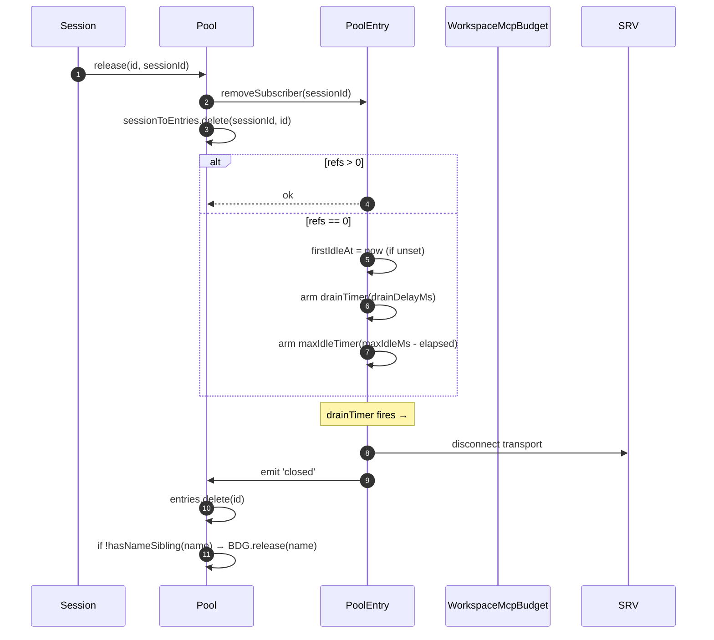
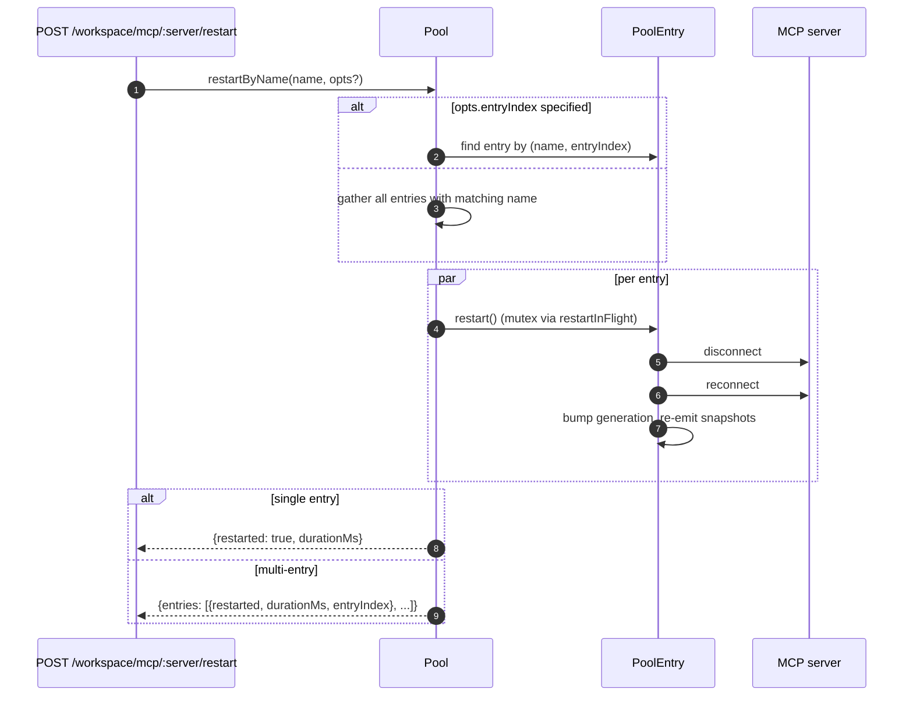
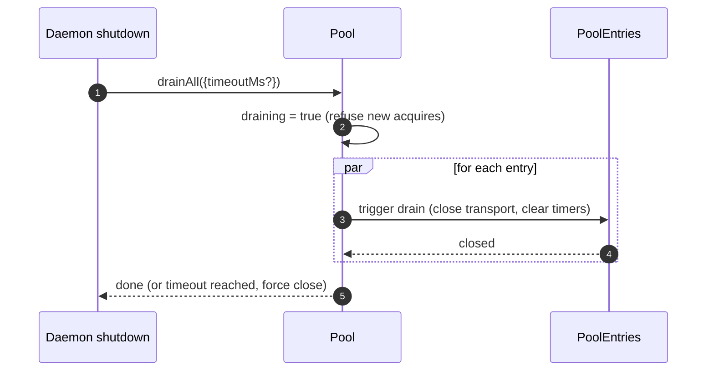

# Workspace MCP Transport Pool

## Vue d’ensemble

`McpTransportPool` (`packages/core/src/tools/mcp-transport-pool.ts`) est le pool au niveau de l’espace de travail de la F2 (commit 5 de #4175) : plusieurs sessions ACP sur un même daemon partagent un seul transport pour chaque tuple unique `(serverName + configFingerprint)`, au lieu que chaque session lance son propre processus enfant MCP. Le pool réside **à l’intérieur du processus ACP** (`QwenAgent.mcpPool`), est construit une fois au démarrage de l’agent avec la `Config` d’amorçage du daemon, et survit aux cycles de vie des sessions. Les entrées comptent les références des sessions attachées et se ferment après une période de grâce configurable lorsque le compteur de références atteint zéro.

C’est le mécanisme principal qui empêche un daemon multi-sessions de dupliquer une copie de chaque serveur MCP par session.

## Responsabilités

- Acquérir ou lancer un transport MCP par `(nom + empreinte)`, en dédupliquant les acquisitions concurrentes via `spawnInFlight`.
- Libérer les références par session ; armer le timer de vidange de l’entrée quand la dernière référence se détache.
- Survivre aux fluctuations du compteur de références avec un plafond dur `MAX_IDLE_MS` pour qu’un client instable ne puisse pas maintenir un transport inactif indéfiniment.
- Indexer inversement les sessions (`sessionToEntries`) pour que `releaseSession(sessionId)` soit en O(références) plutôt qu’O(entrées).
- Redémarrer les entrées à la demande (`restartByName`) — une seule entrée renvoie `{restarted, durationMs}`, plusieurs entrées renvoient `{entries: RestartResult[]}` (contrat multi‑entrées de F2).
- Vider l’intégralité du pool à l’arrêt du daemon avec un délai configurable ; refuser les nouvelles acquisitions pendant le vidage.
- Consulter `WorkspaceMcpBudget` (voir [`06-mcp-budget-guardrails.md`](./06-mcp-budget-guardrails.md)) lors de `acquire` pour appliquer des plafonds de réservation par nom ; libérer le créneau à la fermeture de l’entrée quand aucune autre entrée du même nom n’est présente.
- Produire des instantanés filtrés par session des outils et prompts via `SessionMcpView` afin qu’une découverte dans une session n’enregistre pas les outils dans les autres sessions.

## Architecture

### Surface publique

```ts
class McpTransportPool {
  constructor(cliConfig: Config, options: McpTransportPoolOptions);
  acquire(
    serverName,
    cfg,
    sessionId,
    sessionToolRegistry,
    sessionPromptRegistry,
  ): Promise<PooledConnection>;
  release(id, sessionId): void;
  releaseSession(sessionId): void;
  restartByName(
    name,
    opts?,
  ): Promise<RestartResult | { entries: RestartResult[] }>;
  drainAll(opts?): Promise<void>;
  getBudget(): WorkspaceMcpBudget | undefined;
  getSnapshot(): McpPoolSnapshot;
}
```

`McpTransportPoolOptions` :

- `workspaceContext: WorkspaceContext` (obligatoire).
- `debugMode: boolean`.
- `sendSdkMcpMessage?` — rappel par session (le pool contourne le MCP du SDK).
- `pooledTransports?: ReadonlySet<McpTransportKind>` — par défaut `{stdio, websocket}`. Les transports HTTP/SSE restent non mutualisés par défaut car leurs en-têtes peuvent contenir des informations OAuth propres à la session, mais les opérateurs peuvent explicitement les inclure dans le pool via `QWEN_SERVE_MCP_POOL_TRANSPORTS`.
- `drainDelayMs?` — par défaut `30_000`.
- `entryOptions?: (transport) => PoolEntryOptions`.
- `budget?: WorkspaceMcpBudget`.

### État interne

| État               | Type                                    | Objectif                                                                                                 |
| ------------------ | --------------------------------------- | -------------------------------------------------------------------------------------------------------- |
| `entries`          | `Map<ConnectionId, PoolEntry>`          | Entrées du pool en vie, indexées par `connectionIdOf(name, fingerprint)`.                                |
| `unpooledIds`      | `Set<ConnectionId>`                     | Entrées pour les transports en dehors de la liste autorisée `pooledTransports`.                          |
| `spawnInFlight`    | `Map<ConnectionId, Promise<PoolEntry>>` | Déduplique les acquisitions à froid concurrentes pour la même clé.                                       |
| `sessionToEntries` | `Map<string, Set<ConnectionId>>`        | Index inversé V21-2 pour un `releaseSession` en O(références).                                           |
| `draining`         | `boolean`                               | Mutex de vidage — une fois positionné, tous les appels à `acquire` échouent.                             |
| `nextIndexByName`  | `Map<string, number>`                   | `entryIndex` monotone V21-7 par nom de serveur (les tableaux de bord ne se mélangent pas quand une nouvelle entrée apparaît). |

### `PoolEntry` (structure par entrée, `mcp-pool-entry.ts`)

Machine à états : `spawning → active ⇄ (active ↔ reconnect) → (active → draining on last detach, draining → active on attach OR draining → closed on timer)`.

| Champ                                                   | Objectif                                                                          |
| ------------------------------------------------------- | --------------------------------------------------------------------------------- |
| `localStatus: MCPServerStatus`                          | Piloté par le cycle de vie de `MCPServerStatus`.                                  |
| `state: PoolEntryState`                                 | `spawning`/`active`/`draining`/`closed`/`failed`.                                 |
| `generation: number`                                    | Incrémenté à chaque redémarrage ; les abonnés le comparent pour détecter les cycles de reconnexion. |
| `refs: Set<string>`                                     | Identifiants de session actuellement attachés.                                    |
| `subscribers: Map<string, SessionMcpView>`              | Vues filtrées par session.                                                        |
| `subscriberHandles: Map<string, PooledConnectionImpl>`  | Handles renvoyés par `acquire`.                                                   |
| `toolsSnapshot[], promptsSnapshot[]`                    | Instantanés canoniques au niveau du pool ; réémis sur `toolsChanged` / `promptsChanged`. |
| `drainTimer?`                                           | Armé quand `refs.size === 0` ; par défaut 30 s. Réinitialisé sur un attachement.  |
| `maxIdleTimer?`                                         | Armé à la première inactivité ; jamais réinitialisé par les fluctuations d’acquisition/libération. Par défaut 5 min. |
| `firstIdleAt?`                                          | Repère pour le plafond dur d’inactivité maximale.                                 |
| `restartInFlight?`                                      | Mutex pour `restart()`.                                                           |
### `PoolEntryOptions`

```ts
interface PoolEntryOptions {
  drainDelayMs: number; // default 30_000
  maxIdleMs: number; // default 5 * 60_000
  maxReconnectAttempts: number; // default 3 (stdio/ws) or 5 (http/sse)
  reconnectStrategy:
    | { kind: 'fixed'; delayMs: number }
    | { kind: 'exponential'; baseMs: number; capMs: number };
}
```

`defaultPoolEntryOptions(transport)` (`mcp-pool-entry.ts`) retourne les valeurs par défaut pour stdio/ws `{fixed 5s, 3 tentatives}` et pour http/sse `{exponential 1s → 16s, 5 tentatives}`. Les transports distants bénéficient de budgets de nouvelle tentative plus longs car leurs échecs sont plus souvent transitoires.

## Workflow

### `acquire`

```mermaid
sequenceDiagram
    autonumber
    participant S as Session
    participant P as Pool
    participant SIF as spawnInFlight
    participant E as PoolEntry
    participant BDG as WorkspaceMcpBudget
    participant SRV as MCP server

    S->>P: acquire(name, cfg, sessionId, sessionToolRegistry, sessionPromptRegistry)
    P->>P: refuse if draining
    P->>P: connectionId = connectionIdOf(name, fingerprint)
    P->>P: if !isPoolable(cfg) → mark unpooled
    alt entry in entries (warm)
        E-->>P: existing PoolEntry
    else inflight cold spawn
        SIF-->>P: existing Promise<PoolEntry>
    else cold start
        P->>BDG: tryReserve(name) (if budget set + poolable)
        BDG-->>P: 'reserved' | 'already_held' | 'refused'
        alt refused
            P->>BDG: recordRefusal(name, transport)
            P-->>S: BudgetExhaustedError
        else ok
            P->>E: spawnEntry(name, cfg)
            E->>SRV: connect transport
            SRV-->>E: ready
            P->>P: entries.set(id, E); nextIndexByName++
            E-->>P: connected
        end
    end
    P->>E: addSubscriber(sessionId, sessionToolRegistry, sessionPromptRegistry)
    P->>P: sessionToEntries.add(sessionId, id)
    P->>P: cancel drain timer (refs>0)
    P-->>S: PooledConnection { id, serverName, entryIndex, client, toolsSnapshot, promptsSnapshot, on, off, release }
```

### `release` + drain



`hasNameSibling(name)` (`mcp-transport-pool.ts`) itère à la fois `entries.values()` et `spawnInFlight.keys()`, en analysant ces derniers avec `parseConnectionId` (les noms de serveur peuvent légitimement contenir `::`, donc un `startsWith` produirait un faux positif sur un nom frère commençant par `${name}::`).

`releaseSession(sessionId)` lit dans `sessionToEntries`, libère toutes les entrées référencées en O(refs), puis supprime l’entrée d’index. Utilisée par le chemin de fermeture de session du bridge pour éviter d’itérer l’intégralité de la map des entrées.

### `restartByName`



La vérification préalable de budget au niveau HTTP du daemon retourne `{restarted:false, skipped:true, reason:'budget_would_exceed'}` (contrôle de mutation Wave 4) lorsque l’emplacement de la cible n’est pas déjà réservé et qu’un redémarrage ferait dépasser le budget `enforce`.

### `drainAll`



## State & Lifecycle

- La construction du pool est synchrone ; le premier `acquire` démarre un transport à froid (`cold-start`).
- `drainDelayMs` (30s par défaut) est réinitialisé en annulation lors de l’attachement.
- `maxIdleMs` (5 min par défaut) n’est **jamais** réinitialisé par attachement/détachement — il commence à compter à la PREMIÈRE inactivité et ne s’arrête que lorsque l’entrée se ferme effectivement ou s’attache avant l’échéance. Protection contre les clients qui activent/désactivent en boucle.
- `nextIndexByName` est monotone. Les anciennes entrées conservent leur index même après l’apparition de nouvelles entrées, de sorte que les tableaux de bord lisant `entryIndex` ne se réorganisent pas.
- Un échec de spawn libère l’emplacement de budget réservé (V21-4 — sans cela, un démarrage à froid qui planterait en cours de connexion fuirait la réservation pour toujours).
## Dépendances

- `packages/core/src/tools/mcp-client.ts` — `McpClient`, status enum, `SendSdkMcpMessage`.
- `packages/core/src/tools/mcp-pool-entry.ts` — `PoolEntry`, `PoolEntryOptions`, `defaultPoolEntryOptions`.
- `packages/core/src/tools/mcp-pool-key.ts` — `connectionIdOf`, `parseConnectionId`, `isPoolable`, `mcpTransportOf`, `POOLED_TRANSPORTS_DEFAULT`.
- `packages/core/src/tools/mcp-pool-events.ts` — `ConnectionId`, `PoolEntryState`, `PoolEvent`.
- `packages/core/src/tools/session-mcp-view.ts` — vue par session qui filtre les instantanés du pool.
- `packages/core/src/tools/mcp-workspace-budget.ts` — `WorkspaceMcpBudget` (cf. [`06-mcp-budget-guardrails.md`](./06-mcp-budget-guardrails.md)).
- `packages/core/src/tools/mcp-discovery-timeout.ts` — `discoveryTimeoutFor`, `runWithTimeout`.

## Configuration

| Source                              | Réglage                                                        | Effet                                                                                                                                                                                               |
| ----------------------------------- | -------------------------------------------------------------- | --------------------------------------------------------------------------------------------------------------------------------------------------------------------------------------------------- |
| Environnement                       | `QWEN_SERVE_NO_MCP_POOL=1`                                     | Interrupteur d'arrêt — `QwenAgent.mcpPool` reste indéfini ; le `McpClientManager` par session applique la règle (chemin pré-F2).                                                                   |
| Indicateur                          | `--mcp-client-budget=N`, `--mcp-budget-mode={off,warn,enforce}` | Transmis à l'enfant ACP via `childEnvOverrides` ; l'enfant construit `WorkspaceMcpBudget` et le transmet au pool.                                                                                    |
| Étiquettes de capacité (conditionnelles) | `mcp_workspace_pool`, `mcp_pool_restart`                        | Annoncées ensemble lorsque le pool est actif. Le SDK pré-vérifie les deux pour bifurquer sur les formes de réponse tenant compte du pool.                                                           |

### Entrées non poolisées (HTTP / SSE / SDK-MCP)

Les transports en dehors de la liste autorisée `pooledTransports` configurée (HTTP, SSE et SDK-MCP par défaut) empruntent un chemin séparé : `createUnpooledConnection(name, cfg, sessionId, ...)` (`mcp-transport-pool.ts`) crée une entrée par session avec l'identifiant `${name}::unpooled-${entryIndex}`. Différences par rapport aux entrées poolisées :

- Stockée dans `entries` ET suivie dans `unpooledIds: Set<ConnectionId>` afin que `release` / `releaseSession` puissent optimiser le comportement de fermeture lors du détachement (les réf. plafonnent toujours à 1).
- `McpClient.discover()` est utilisé directement plutôt que la relecture du pool ; `applyTools` / `applyPrompts` sont des opérations sans effet car les registres de la session contiennent déjà ce qui a été enregistré (W77 / `skipReplay: true` dans `attach()`).
- Le budget de l'espace de travail les contrôle toujours — le suivi budgétaire F2 a fermé l'ancienne faille où les connexions non poolisées contournaient `tryReserve` ; le même emplacement `WorkspaceMcpBudget` est réservé et libéré à la fermeture de l'entrée (qu'elle soit poolisée ou non).

La race condition W77 (`cb206da36`) : `createUnpooledConnection` stocke l'entrée dans `this.entries` AVANT d'attendre `client.connect()` / `client.discover()`, mais n'indexe `sessionToEntries[sessionId]` qu'APRÈS la réussite de `attach()`. Une exécution concurrente de `closeStoredSession()` / `releaseSession(sessionId)` pendant la fenêtre de connexion/découverte voyait un index vide, laissait la création non poolisée se terminer, et `attach()` enregistrait ensuite des outils/prompts dans une session déjà fermée. Le correctif :

- `mcp-pool-entry.ts` : sonde publique `isTerminated(): boolean` (`state === 'closed' || state === 'failed'`).
- `mcp-pool-entry.ts` : `markActive()` se court-circuite si `isTerminated()` est vrai, de sorte qu'une entrée démantelée ne puisse pas être ressuscitée à l'état `'active'`.
- Les appelants (le chemin non poolisé du pool) vérifient `isTerminated()` entre les attentes et annulent l'attachement si la session parente a disparu.

Cette race condition était latente à l'époque (les hooks par session `releaseSession` de W61/W71 arrivent dans F4), mais deviendrait active au moment où ce hook arriverait. Le correctif a été appliqué tôt dans la série F2.

## Champs d'instantané tenant compte du pool pour `GET /workspace/mcp`

Lorsque le pool est actif, chaque cellule de serveur `ServeWorkspaceMcpStatus`
(`packages/acp-bridge/src/status.ts`) comprend trois champs supplémentaires :

| Champ            | Type                                        | Objectif                                                                                                                                                                                                                                                                                                                                                 |
| ---------------- | ------------------------------------------- | -------------------------------------------------------------------------------------------------------------------------------------------------------------------------------------------------------------------------------------------------------------------------------------------------------------------------------------------------------- |
| `disabledReason` | `'config' \| 'budget'`                      | Distingue les serveurs désactivés par l'opérateur (`disabled: true` provenant de `disabledMcpServers`) du refus budgétaire (`status: 'error', errorKind: 'budget_exhausted'`). Les tableaux de bord peuvent afficher une ligne de serveur sans avoir à croiser `errors[]` ou `budgets[]`.                                                                |
| `entryCount`     | `number` (`>=1`)                            | En mode poolisé, un espace de travail peut avoir plusieurs instances `PoolEntry` avec le même nom lorsque les sessions injectent différentes empreintes comme des en-têtes OAuth par session. Ce champ est absent lorsque `QWEN_SERVE_NO_MCP_POOL=1` désactive le pool. Les nouveaux clients affichent un badge "N entrées" lorsque `entryCount > 1`. |
| `entrySummary`   | `ReadonlyArray<{entryIndex, refs, status}>` | Ventilation par entrée. `entryIndex` est l'entier opaque stable attribué lors de la création de l'entrée ; ce n'est pas l'empreinte brute, donc les diff d'instantanés ne divulguent pas les OAuth ni le timing de rotation des environnements. `refs` est le nombre actuel de sessions attachées. `status` permet aux tableaux de bord d'afficher l'état de santé par entrée tandis que le `mcpStatus` agrégé est déjà connecté. |
`(entryCount, entrySummary)` sont toujours diffusés par paire. Le tag de capacité `mcp_workspace_pool` implique les deux champs. Les clients SDK plus anciens les ignorent sous le contrat de protocole additif.

Les instantanés du pool exposent également `subprocessCount`. Il ne compte que la famille `'stdio'`. Les transports WebSocket, HTTP et SSE se connectent à des serveurs distants et ne génèrent pas de processus enfants locaux. Les premières versions comptaient les transports WebSocket comme des sous-processus locaux, ce qui gonflait les tableaux de bord des ressources.

## Les drainages s'exécutent depuis les deux chemins d'arrêt

Le drainage du pool n'est pas limité au gestionnaire SIGTERM. Le chemin d'arrêt normal de l'IDE (`await connection.closed`) appelle également `drainAll` via `drainPoolBeforeExit` de `packages/cli/src/acp-integration/acpAgent.ts`. Que le démon reçoive un signal de processus ou que l'IDE ferme sa connexion proprement, le pool passe à l'état `draining`, refuse les nouvelles acquisitions, et attend que les entrées se ferment.

## `/mcp refresh` partage le chemin de découverte au démarrage

`discoverAllMcpTools` (découverte au démarrage) et `discoverAllMcpToolsIncremental` (`/mcp refresh` / rechargement à chaud) consultent tous deux le pool en premier en mode pool (`packages/core/src/tools/mcp-client-manager.ts`). La porte partagée empêche le rechargement à chaud de créer accidentellement un client par session, de compter deux fois le budget, ou de laisser un orphelin de transport derrière lui.

## Appels d'outils en cours lors de la reconnexion (`MCPCallInterruptedError`)

Lorsque le transport MCP sous-jacent se déconnecte silencieusement (la connexion passe de `'active'` / `'draining'` à `localStatus === DISCONNECTED` sans fermeture explicite), le pool marque l'entrée comme `'failed'`, l'expulse de `pool.entries`, et émet l'événement `failed` avant de détacher les vues des abonnés. Cet ordre émettre avant détacher est important : les abonnés reçoivent l'événement `failed` assez tôt pour router les promesses `callTool` en attente vers `MCPCallInterruptedError`, ainsi un `await client.callTool(...)` bloqué se rejette proprement au lieu de pendre. `forceShutdown` utilise le même ordre émettre-puis-détacher.

## Empreinte et normalisation `canonicalOAuth`

La clé du pool provient de `fingerprint(cfg)` dans `mcp-pool-key.ts`. Le hachage couvre tous les champs définissant le transport :

> `transport, command, args, cwd, env, url, httpUrl, tcp, headers, timeout, oauth`

Les champs de filtrage par session et de métadonnées (`includeTools`, `excludeTools`, `trust`, `description`, `extensionName`, `discoveryTimeoutMs`) sont exclus, de sorte que des sessions avec des filtres différents peuvent partager une même entrée.

Pour la cellule OAuth, `canonicalOAuth(o)` hache chaque champ de `MCPOAuthConfig` : `clientId`, `clientSecret`, `scopes` triés, `audiences` triés, `authorizationUrl`, `tokenUrl`, `redirectUri`, `tokenParamName`, et `registrationUrl`. C'est le contrat d'isolation des identifiants : deux configurations de session qui ne diffèrent que par `clientSecret`, `audiences`, ou `redirectUri` obtiennent des empreintes différentes et ne peuvent pas partager une entrée. Les clients confidentiels et les déploiements de jetons multi-audience en dépendent.

Le tri de `scopes` et `audiences` rend l'ordre d'appel sans importance. La valeur explicite `null` est normalisée de sorte que les champs non définis produisent la même empreinte qu'un `null` explicite. La clé n'inclut pas `discoveryTimeoutMs` ; les appels `acquire` simultanés avec la même clé mais des délais différents sont traités par "premier arrivé, premier servi", ce qui correspond au comportement du gestionnaire par session d'avant F2.

`PoolEntry` garde `cfg: MCPServerConfig` privé. Le code externe doit utiliser l'accesseur `entry.transportKind` lorsqu'il a besoin de la famille de transport. Cela empêche les fuites accidentelles de champs d'environnement, d'authentification par en-têtes et OAuth vers les consommateurs.

## Les déchargements d'extension reposent sur `MAX_IDLE_MS`

Il n'existe intentionnellement pas de chemin de nettoyage actif pour décharger une extension MCP à l'exécution. Les entrées orphelines dont le `MCPServerConfig` n'apparaît plus dans les paramètres fusionnés de l'espace de travail sont récupérées naturellement par le plafond dur `MAX_IDLE_MS` après que le dernier abonné se détache. Un chemin de nettoyage synchrone lors du déchargement ajouterait de la complexité pour un cas marginal rare ; le plafond dur limite la durée de vie des processus orphelins après le point de déchargement à 5 minutes par défaut.

Les opérateurs qui souhaitent un nettoyage plus rapide peuvent redémarrer le démon ou appeler `POST /workspace/mcp/:server/restart` pour le nom désormais non configuré, ce qui passe par le chemin du serveur désactivé et démonte l'entrée.

## Observabilité de l'auto-guérison

Le pool émet deux diagnostics structurés sur le chemin d'auto-guérison :

**`McpClient.lastTransportError: Error | undefined`** (`packages/core/src/tools/mcp-client.ts`) — `McpClient.onerror` stocke l'exception de transport la plus récente dans un champ privé et l'efface à l'entrée de `connect()`. Le chemin de suppression silencieuse de `PoolEntry` lit `client.getLastTransportError()` et l'inclut dans `emit({kind:'failed', lastError})`, de sorte que les abonnés et les tableaux de bord n'ont pas à fouiller stderr pour trouver la cause racine.

**`SweepResult`** (interface interne, non exportée ; `packages/core/src/tools/mcp-pool-entry.ts`) — `sweepAndDisconnect(reason)` retourne `Promise<SweepResult>` :

```ts
interface SweepResult {
  pidSweepError?: Error; // listDescendantPids itself threw
  descendantsFound?: number; // descendant pid count found
  descendantsSignaled?: number; // successfully SIGTERM'd count
}
```
Le seul consommateur est le bloc `silent-drop` dans `statusChangeListener`. Il utilise
`descendantsFound` / `descendantsSignaled` pour détecter les cas de signalement partiel
(moins de processus signalés que trouvés, généralement parce qu'un processus s'est arrêté ou qu'une erreur EPERM
s'est produite entre `listDescendantPids` et `sigtermPids`) et les erreurs de balayage, puis
enregistre un avertissement structuré. `forceShutdown` et `doRestart` ignorent cette valeur de retour
car leurs chemins de capture transportent déjà des signaux d'échec plus riches.

## Nettoyage des sous-processus : le chemin d'instantané `pid-descendants`

Lorsque `McpTransportPool` arrête les sous-processus stdio, il doit énumérer leurs
processus descendants ; les wrappers `npx` et les wrappers shell peuvent créer plusieurs niveaux
de fork. `packages/core/src/tools/pid-descendants.ts` expose
`listDescendantPids(rootPid) → Promise<number[]>` et `sigtermPids(pids)` pour
`sweepAndDisconnect`.

### Chemin principal Linux / macOS

Un seul instantané `ps -A -o pid=,ppid=` lit la table des processus, l'analyse en
`Map<ppid, pid[]>`, puis `walkDescendants(tree, root)` effectue un BFS pour extraire
le sous-arbre. N'importe quelle profondeur ne nécessite qu'un seul fork `ps`.

`walkDescendants` maintient `visited: Set<number>` et inclut `root` dans l'ensemble
pour se défendre contre les cycles de réutilisation de PID. Sous un renouvellement rapide de processus, l'instantané peut
théoriquement contenir des boucles A→B / B→A. Sans `visited`, le marcheur pourrait
remplir le quota `MAX_DESCENDANTS` avec des données erronées et évincer les véritables descendants.

### Chemin principal Windows

Un seul instantané `Get-CimInstance Win32_Process | ConvertTo-Csv -Delimiter ","`
émet toutes les lignes `(ProcessId, ParentProcessId)`, puis le même chemin `Map` et
`walkDescendants` est exécuté.

Le `-Delimiter ","` explicite est requis. PowerShell 5.1, fourni avec
Windows, utilise par défaut le séparateur de liste des paramètres régionaux du système pour `ConvertTo-Csv` ; les paramètres régionaux DE, FR,
NL, IT, et similaires utilisent `;`, donc l'analyseur pré-correction
`^"(\d+)","(\d+)"$` ne correspondait jamais et chaque arrêt de démon revenait au
chemin de filtre CIM par PID, ajoutant environ 0,5 à 1 seconde de coût de démarrage PowerShell par
enfant.

### Chemin de repli

BusyBox `<v1.28` manque `ps -o`, les conteneurs distroless peuvent ne pas inclure `ps`,
et certains environnements Windows tronquent la sortie CIM via des ACL. Lorsque le chemin
principal analyse zéro ligne ou génère une exception, le code revient à un BFS par PID : Linux /
macOS utilisent `pgrep -P <pid>`, et Windows utilise
`Get-CimInstance -Filter "ParentProcessId=$p"` où `$p` est une liaison de variable PowerShell
plutôt qu'une concaténation de chaînes. La protection actuelle
`Number.isInteger` est suffisante pour le point d'entrée ; la liaison est une
défense en profondeur.

### Contraintes partagées

Les deux chemins sont limités par `MAX_DESCENDANTS = 256` et `MAX_DEPTH = 8` pour éviter qu'un
arbre de processus malveillant ou dégénéré ne ralentisse le balayage.

Le chemin d'instantané utilise `maxBuffer: 8MB`, suffisant pour des hôtes pathologiques avec
environ 250k processus. La valeur par défaut de Node de 1 Mo peut tronquer la sortie des processus enfants
autour de 30k processus.

Le gain de performance est intentionnellement modeste (les machines de développement typiques avec 200-500 processus
analysent en moins de 10 ms, environ 2 fois plus rapidement que `pgrep` par PID). Le principal
avantage est l'hygiène des fork et la cohérence des instantanés : le BFS voit la totalité du sous-arbre
en une seule fois, tandis que le chemin de requête par PID précédent pouvait manquer un petit-fils forké
entre deux requêtes.

## Note pour l'intégrateur : constructeur `McpClientManager`

`McpClientManager` est construit comme
`(config, toolRegistry, options?: McpClientManagerOptions)`. Les intégrateurs qui
importent directement la classe doivent passer :

```ts
new McpClientManager(config, toolRegistry, {
  eventEmitter,
  sendSdkMcpMessage,
  healthConfig,
  budgetConfig,
  pool,
});
```

Les tests devraient préférer une fabrique `mkManager(overrides?)` afin que les cas qui se soucient d'un
ou deux champs restent sur une ligne.

## Notes d'implémentation

Ces assistants sont internes, mais les lecteurs du code source peuvent les voir :

- `McpTransportPool.acquire()` utilise `attachPooledSession` et `rollbackReservationOnSpawnFailure` pour partager le comportement d'attachement rapide, d'attachement post-fork et de capture du fork en cours dans le pool. Le comportement d'exécution est inchangé ; les invariants de fenêtre de concurrence résident toujours aux sites d'appel.
- `SessionMcpView.applyTools` / `applyPrompts` compile `includeTools` / `excludeTools` une fois via `compileNameFilter(cfg)` et vérifie chaque outil avec `compiledFilterAccepts(compiled, name)`. Les fonctions exportées `passesSessionFilter` / `passesSessionPromptFilter` utilisent le même chemin compilé. `excludeTools` correspond exactement ; `includeTools` supprime le premier suffixe `(...)` afin que `toolName(args)` corresponde à `toolName`.

Document de conception : [`../../design/f2-mcp-transport-pool.md`](../../design/f2-mcp-transport-pool.md) §6 couvre la machine à états du pool de transport, la reconnexion, la vidange et les chemins de balayage des descendants.

## Mises en garde et limites connues

- **Les transports HTTP / SSE ne sont pas mis en pool par défaut** — à moins que les opérateurs ne les incluent explicitement dans `QWEN_SERVE_MCP_POOL_TRANSPORTS`, chaque acquisition crée une nouvelle entrée qui ne vit que le temps de sa session. Leurs en-têtes peuvent transporter un état OAuth spécifique à la session, donc les mettre en pool par défaut risquerait de fuiter des identifiants entre les sessions.
- **`maxIdleMs` est un plafond dur qui survit au va-et-vient d'attachement/détachement.** Un plafond dur d'inactivité de 5 minutes signifie que même un client qui s'attache/se détache agressivement ne peut pas maintenir un transport inactif épinglé au-delà de 5 minutes. Les opérateurs qui souhaitent des transports longue durée épinglés doivent augmenter `maxIdleMs` ou exécuter le serveur en dehors du pool.
- **Les créneaux de budget par nom de serveur** signifient que deux entrées du pool qui partagent un nom mais diffèrent par leur empreinte consomment UN créneau ensemble, pas deux. La comptabilité des sous-processus est exposée séparément via `pool.getSnapshot().subprocessCount`.
- **La régression `startsWith`** a été évitée dans `hasNameSibling` car les noms de serveur MCP peuvent légitimement contenir `::` (`mcp-pool-key.test.ts`). Utilisez toujours la division `lastIndexOf('::')` de `parseConnectionId`, jamais la correspondance de préfixe de chaîne.
- **La vidange du pool est à sens unique** — `drainAll` définit `draining = true` de manière permanente ; un nouveau pool est nécessaire pour tout travail ultérieur.
## References

- `packages/core/src/tools/mcp-transport-pool.ts` (fichier complet)
- `packages/core/src/tools/mcp-pool-entry.ts` (cycle de vie de l'entrée)
- `packages/core/src/tools/mcp-pool-key.ts` (`connectionIdOf`, `parseConnectionId`)
- `packages/core/src/tools/mcp-pool-events.ts` (types d'événements)
- `packages/core/src/tools/session-mcp-view.ts` (vue filtrée par session)
- F2 design document (v2.2, avec le changelog intégré de la revue des 32 éléments) : [`../../design/f2-mcp-transport-pool.md`](../../design/f2-mcp-transport-pool.md). Considérez le contrat de conception comme faisant autorité ; cette page est l'analyse détaillée pour les développeurs.
- F2 design notes : issue [#4175](https://github.com/QwenLM/qwen-code/issues/4175) (commits 4 à 6 de la série F2).
