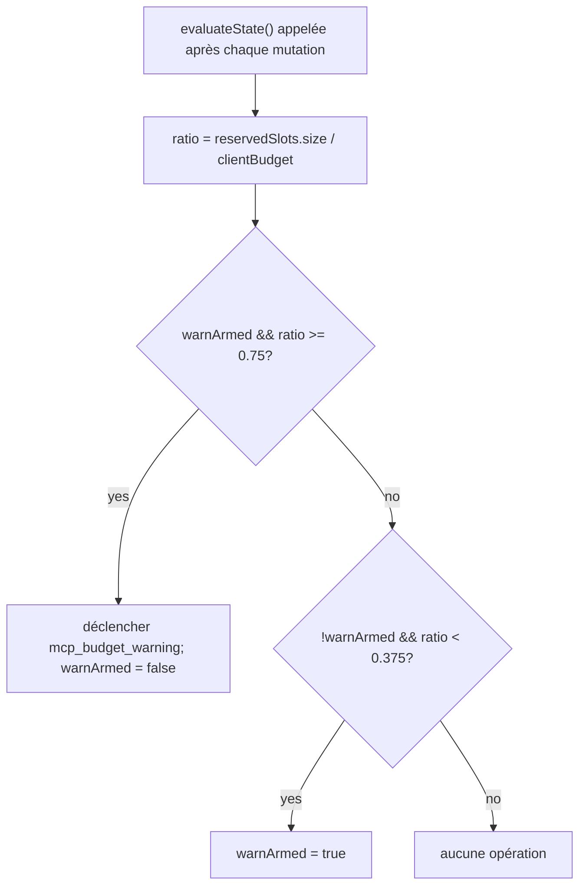

# Garde-fous du Budget de l'Espace de Travail MCP

## Vue d'ensemble

`WorkspaceMcpBudget` (`packages/core/src/tools/mcp-workspace-budget.ts`) est le contrôleur de budget du client MCP à l'échelle de l'espace de travail, issu de F2 (#4175 commit 6). Il possède la même machine d'état que `McpClientManager` transporte en ligne (réservation de slot, avertissement à 75% d'hystérésis, refus groupé lors d'une passe `discoverAllMcpTools*`), mais vit **une fois par espace de travail** à l'intérieur de `McpTransportPool` au lieu d'une fois par session dans chaque gestionnaire d'enfant ACP. Le pool délègue les appels `acquire` et `release` ici afin que la limite s'applique à l'**espace de travail**, et non à chaque session.

La mécanique de budget héritée de `McpClientManager` reste pour les serveurs MCP autonomes qwen et SDK (qui contournent le pool selon le correctif du commit 4). Mode pool → `WorkspaceMcpBudget` applique ; MCP autonome / SDK → la mécanique en ligne du gestionnaire applique. Pas de double comptage car la découverte en mode pool n'appelle jamais `tryReserveSlot` du gestionnaire.

## Responsabilités

- Suivre `reservedSlots: Set<string>` des NOMS de serveurs actuellement détenus (la clé de slot est par NOM, conforme à PR 14 v1).
- `tryReserve(name) → 'reserved' | 'already_held' | 'refused'` — atomique et synchrone afin que des acquisitions concurrentes via `Promise.all` ne puissent pas dépasser la limite à une frontière `await`.
- `release(name) → boolean` — idempotent (sémantique `Set.delete`).
- Déclencher `mcp_budget_warning` une fois lors du franchissement à la hausse de 75% de `reservedSlots.size / clientBudget` ; réarmer uniquement après un passage à la baisse de 37,5%.
- Regrouper les refus par serveur lors d'une passe de découverte groupée — `beginBulkPass()` / `endBulkPass()` encadrent l'accumulation des refus en un seul événement `mcp_child_refused_batch`.
- Maintenir `lastRefusedServerNames` pour les consommateurs d'instantanés (`GET /workspace/mcp`) — effacé au DÉBUT de la passe groupée suivante, PAS lors de l'émission, afin qu'un instantané entre deux passes voie toujours le dernier ensemble de refus.

## Architecture

### Configuration

```ts
new WorkspaceMcpBudget({
  clientBudget?: number,           // undefined = illimité
  mode: 'off' | 'warn' | 'enforce',
  onEvent?: (event: McpBudgetEvent) => void,
});
```

Sémantique de `mode` :

- `off` — chaque méthode est sans effet ; `tryReserve` retourne `'reserved'` inconditionnellement ; aucun événement n'est déclenché.
- `warn` — les slots sont suivis et `mcp_budget_warning` se déclenche à 75%, mais `tryReserve` ne REFUSE JAMAIS.
- `enforce` — `tryReserve` refuse au-delà de `clientBudget` ; `recordRefusal` met en file les refus par serveur ; `endBulkPass` émet `mcp_child_refused_batch`.

### Constantes depuis `mcp-client-manager.ts`

- `MCP_BUDGET_WARN_FRACTION = 0.75` — seuil à la hausse.
- `MCP_BUDGET_REARM_FRACTION = 0.375` — réarmement d'hystérésis à la baisse.
- `McpBudgetMode = 'off' | 'warn' | 'enforce'`.

### État interne

| État                                               | Objectif                                                                                                      |
| -------------------------------------------------- | -------------------------------------------------------------------------------------------------------------- |
| `reservedSlots: Set<string>`                       | Ensemble de réservation faisant autorité ; l'hystérésis évalue `size / clientBudget`.                           |
| `pendingRefusalNames: Set<string>`                 | Noms des refus accumulés durant la fenêtre `beginBulkPass`/`endBulkPass` courante ; vidés sur `endBulkPass`.   |
| `pendingRefusalTransports: Map<string, transport>` | Accompagnateur afin que le lot émis transporte le transport de chaque serveur refusé.                         |
| `lastRefusedServerNames: readonly string[]`        | Liste de refus visible dans l'instantané de la passe la plus récente terminée. Effacée au début de la passe suivante. |
| `warnArmed: boolean`                               | État d'hystérésis — true = prêt à déclencher, false = déjà déclenché depuis le dernier drainage à 37,5%.      |
| `bulkPassDepth: number`                            | Compteur de réentrance pour les passes groupées imbriquées (les passes imbriquées ne doivent pas émettre en double). |

## Flux de travail

### `tryReserve`


`tryReserve` est **synchrone**. L'`acquire` du pool est asynchrone, mais la réservation a lieu avant tout `await`, donc deux acquisitions concurrentes via `Promise.all` pour des noms différents ne peuvent pas toutes deux passer la limite.

### Hystérésis


L'hystérésis évite les avertissements répétés lorsqu'une charge de travail oscille autour de 75 %. Le premier franchissement déclenche l'événement ; les franchissements suivants sans retour sous 37,5 % ne le font pas.

### Regroupement des refus par lot

```mermaid
sequenceDiagram
    autonumber
    participant POOL as pool.discoverAllMcpToolsViaPool
    participant BDG as WorkspaceMcpBudget
    participant EB as EventBus

    POOL->>BDG: beginBulkPass()
    BDG->>BDG: bulkPassDepth++<br/>clear lastRefusedServerNames si outermost
    loop par serveur dans le pass
        POOL->>BDG: tryReserve(name)
        alt refusé
            POOL->>BDG: recordRefusal(name, transport)
            BDG->>BDG: pendingRefusalNames.add; pendingRefusalTransports.set
            Note over BDG: Pas encore d'événement (coalescence)
        end
    end
    POOL->>BDG: endBulkPass()
    BDG->>BDG: bulkPassDepth--
    alt outermost (depth == 0) ET pending non vide
        BDG->>EB: emit mcp_child_refused_batch<br/>{refusedServers, budget, liveCount, reservedCount, mode: 'enforce', scope?: 'workspace'}
        BDG->>BDG: lastRefusedServerNames = drain pendingRefusalNames
    end
```

Les refus hors d'un passage groupé (p. ex., un `readResource` paresseux qui contourne complètement le passage groupé) émettent des lots de taille 1 en ligne pour la cohérence de forme. Les passages groupés imbriqués (`bulkPassDepth > 0`) ne déclenchent rien ; seul le passage groupé le plus externe émet le lot coalescé à la fin.

## État et cycle de vie

- Le contrôleur de budget est construit une fois par espace de travail lors de l'initialisation du pool.
- `clientBudget` est immuable après la construction ; les modifications à l'exécution nécessitent une reconstruction du pool.
- `mode` est également immuable (`onEvent` est stocké comme `undefined` lorsque `mode === 'off'` comme défense en profondeur).
- `warnArmed` commence à vrai ; repasse à vrai via le franchissement descendant à 37,5 %.
- `lastRefusedServerNames` n'est PAS effacé lors de l'émission de `endBulkPass` — seulement au DÉBUT du prochain passage groupé. Cela permet à une route d'instantané appelée entre deux passages de toujours rapporter le dernier ensemble de refus (sinon les tableaux de bord montreraient des refus vides immédiatement après la livraison d'un événement de lot refusé).

## Dépendances

- `packages/core/src/tools/mcp-client-manager.ts` — réutilise `McpBudgetEvent`, `McpBudgetMode`, `McpRefusedServer`, `MCP_BUDGET_WARN_FRACTION`, `MCP_BUDGET_REARM_FRACTION`, `BudgetExhaustedError` (levé par la méthode `acquire` du pool lors d'un refus).
- `packages/core/src/tools/mcp-transport-pool.ts` — consomme le budget ; transmet les événements au bus d'événements du daemon via le mécanisme `onEvent` du pool.
- Route d'instantané du démon `GET /workspace/mcp` — lit `getReservedSlots()`, `getRefusedServerNames()`, `getReservedCount()`, `getBudget()`, `getMode()`.

## Configuration

| Source          | Bouton de réglage                                                                        | Effet                                                                                        |
| --------------- | ---------------------------------------------------------------------------------------- | -------------------------------------------------------------------------------------------- |
| Flag            | `--mcp-client-budget=N`                                                                  | Définit `clientBudget` pour le contrôleur de l'espace de travail.                            |
| Flag            | `--mcp-budget-mode={off,warn,enforce}`                                                   | Définit `mode`. `enforce` nécessite un `clientBudget` positif ; sinon le démarrage échoue explicitement. |
| Env             | `QWEN_SERVE_MCP_CLIENT_BUDGET`, `QWEN_SERVE_MCP_BUDGET_MODE`                             | Transmis à l'enfant ACP via `childEnvOverrides` ; `readBudgetFromEnv()` de l'enfant les récupère. |
| Tags de capacité | `mcp_guardrails` (toujours ; `modes: ['warn', 'enforce']`), `mcp_guardrail_events` (toujours) | Voir [`11-capabilities-versioning.md`](./11-capabilities-versioning.md).                      |

## Mises en garde et limites connues

- **La clé de réservation est par NOM.** Deux entrées de pool avec le même nom de serveur mais des empreintes différentes (p. ex., des sessions injectant des en-têtes OAuth divergents) consomment UN emplacement ensemble. La comptabilité des sous-processus est exposée séparément via la propriété `subprocessCount` de l'instantané du pool. Les opérateurs doivent considérer le budget comme « emplacements de serveur configurés », pas comme « nombre de sous-processus ».
- **L'hystérésis se déclenche sur le nombre de réservations, pas sur le nombre de connexions actives (CONNECTED).** Les réservations incluent les connexions en cours et survivent aux déconnexions transitoires, donc l'hystérésis reste stable à travers les cycles de reconnexion. Le nombre de connexions actives est exposé dans les charges utiles des événements comme `liveCount` pour les consommateurs SDK qui souhaitent cet angle.
- **Le mode `warn` ne refuse jamais.** Il suit toujours les réservations et déclenche `mcp_budget_warning`, mais `tryReserve` renvoie toujours `'reserved'`. La sémantique de refus est exclusive au mode `enforce`.
- **Les événements de budget à portée d'espace de travail portent `scope: 'workspace'`** afin qu'ils se propagent à chaque session attachée simultanément. Les compteurs `mcpBudgetWarningCount` / `mcpChildRefusedBatchCount` des réducteurs SDK s'incrémentent en synchronisation entre toutes les sessions sur la même connexion. Les événements hérités par session de `McpClientManager` ne portent pas de `scope` (par défaut, sémantiquement `'session'`).
- **Le coupe-circuit `QWEN_SERVE_NO_MCP_POOL=1`** désactive complètement le pool ; le budget de l'espace de travail est également désactivé, et le budget du `McpClientManager` par session prend le relais. Le périmètre des capacités abandonne `mcp_workspace_pool` et `mcp_pool_restart` pour signaler cela avec précision.
- **`ServeMcpBudgetStatusCell.scope` est une forme de liste compatible avec les versions futures.** Les cellules d'instantané exposent `budgets[]`, pas un champ unique `budget?`. La PR 14 v1 émet une cellule `scope: 'session'` pour chaque session ACP car `acpAgent.newSessionConfig()` construit le `Config` / `McpClientManager` de cette session. La portée `'pool'` est réservée à la cellule à portée de pool de la vague 5 PR 23 qui sera placée à côté des cellules à portée de session. Les consommateurs doivent tolérer des valeurs `scope` supplémentaires inconnues en les ignorant plutôt qu'en échouant.
## Références

- `packages/core/src/tools/mcp-workspace-budget.ts` (classe entière)
- `packages/core/src/tools/mcp-client-manager.ts` (`BudgetExhaustedError`, `McpBudgetEvent`, constantes d'hystérésis)
- `packages/core/src/tools/mcp-transport-pool.ts` (site `acquire` du pool qui appelle `tryReserve`)
- Document de conception F2 (v2.2) : [`../../design/f2-mcp-transport-pool.md`](../../design/f2-mcp-transport-pool.md) §11 pour le budget au niveau de l'espace de travail et les entrées du journal des modifications de la v2.2 concernant le budget et les suivis d'empreinte numérique.
- Notes de conception F2 : issue [#4175](https://github.com/QwenLM/qwen-code/issues/4175) commit 6.
