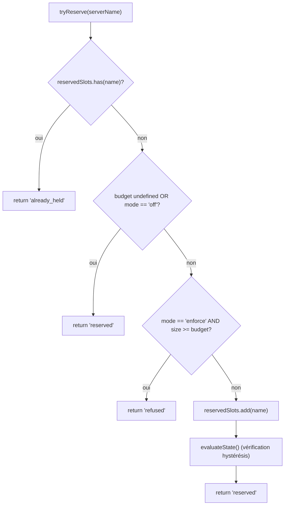
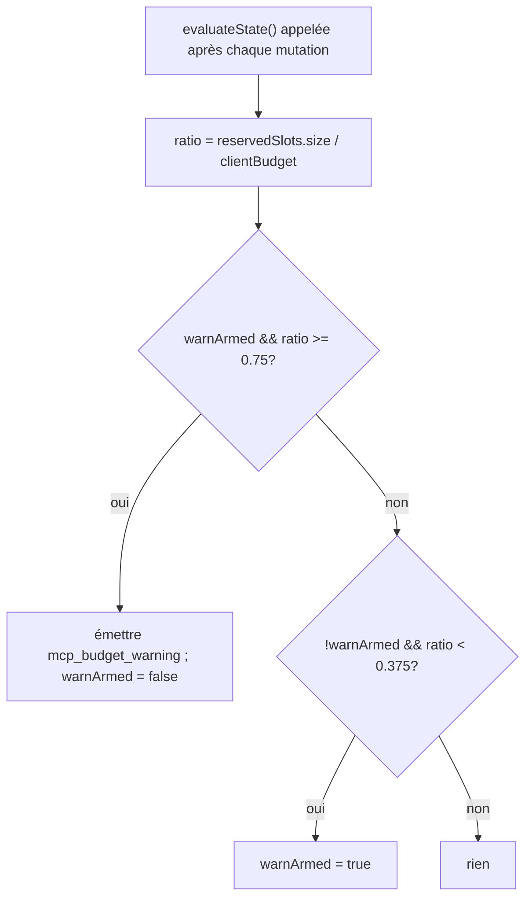

# MCP Workspace Budget Guardrails

## Vue d’ensemble

`WorkspaceMcpBudget` (`packages/core/src/tools/mcp-workspace-budget.ts`) est le contrôleur de budget client MCP à l’échelle d’un espace de travail provenant de F2 (#4175 commit 6). Il possède la même machine d’état que celle que `McpClientManager` embarque en ligne (réservation de créneaux, avertissement à hystérésis à 75%, coalescence des refus groupés lors d’une phase `discoverAllMcpTools*`), mais vit **une fois par espace de travail** à l’intérieur de `McpTransportPool` au lieu d’une fois par session dans chaque gestionnaire enfant ACP. Le pool délègue les appels `acquire` et `release` ici, de sorte que la limite s’applique à l’**espace de travail**, pas à chaque session.

Le mécanisme de budget hérité de `McpClientManager` reste pour les serveurs MCP autonomes qwen et SDK (qui contournent le pool selon le correctif du commit 4). Mode pool → `WorkspaceMcpBudget` applique la règle ; mode autonome / SDK MCP → le mécanisme en ligne du gestionnaire applique la règle. Pas de double comptage car la découverte en mode pool n’appelle jamais `tryReserveSlot` du gestionnaire.

## Responsabilités

- Suivi de `reservedSlots: Set<string>` des NOMS de serveurs actuellement détenus (la clé de créneau est par NOM, comme dans PR 14 v1).
- `tryReserve(name) → 'reserved' | 'already_held' | 'refused'` — atomique et synchrone afin que des `Promise.all` concurrents ne puissent pas dépasser la limite à une frontière `await`.
- `release(name) → boolean` — idempotent (sémantique `Set.delete`).
- Déclencher `mcp_budget_warning` une seule fois lors du franchissement à la hausse de 75% de `reservedSlots.size / clientBudget` ; réarmer uniquement après un franchissement à la baisse de 37,5%.
- Coalescence des refus par serveur lors d’une phase de découverte groupée — `beginBulkPass()` / `endBulkPass()` encadrent l’accumulation des refus en un seul événement `mcp_child_refused_batch`.
- Maintien de `lastRefusedServerNames` pour les consommateurs d’instantané (`GET /workspace/mcp`) — effacé au DÉBUT de la phase suivante, PAS à l’émission, afin qu’un instantané entre deux phases voie toujours le dernier ensemble de refus.

## Architecture

### Configuration

```ts
new WorkspaceMcpBudget({
  clientBudget?: number,           // undefined = illimité
  mode: 'off' | 'warn' | 'enforce',
  onEvent?: (event: McpBudgetEvent) => void,
});
```

Sémantique de `mode` :

- `off` — toutes les méthodes sont sans effet ; `tryReserve` retourne `'reserved'` inconditionnellement ; aucun événement n’est émis.
- `warn` — les créneaux sont suivis et `mcp_budget_warning` se déclenche à 75%, mais `tryReserve` ne refuse JAMAIS.
- `enforce` — `tryReserve` refuse au-delà de `clientBudget` ; `recordRefusal` met en file les refus par serveur ; `endBulkPass` émet `mcp_child_refused_batch`.

### Constantes provenant de `mcp-client-manager.ts`

- `MCP_BUDGET_WARN_FRACTION = 0.75` — seuil de déclenchement à la hausse.
- `MCP_BUDGET_REARM_FRACTION = 0.375` — seuil de réarmement à la baisse (hystérésis).
- `McpBudgetMode = 'off' | 'warn' | 'enforce'`.

### État interne

| État                                             | Objectif                                                                                         |
| ------------------------------------------------ | ------------------------------------------------------------------------------------------------ |
| `reservedSlots: Set<string>`                     | Ensemble de réservations faisant autorité ; l’hystérésis évalue `size / clientBudget`.           |
| `pendingRefusalNames: Set<string>`               | Noms de refus accumulés pendant la fenêtre `beginBulkPass`/`endBulkPass` ; vidé dans `endBulkPass`. |
| `pendingRefusalTransports: Map<string, transport>` | Complément pour que le lot émis transporte le transport de chaque serveur refusé.              |
| `lastRefusedServerNames: readonly string[]`      | Liste des refus visible dans l’instantané, issue de la phase la plus récente. Effacée au début de la phase suivante. |
| `warnArmed: boolean`                             | État d’hystérésis — true = prêt à déclencher, false = déjà déclenché depuis le dernier drainage à 37,5%. |
| `bulkPassDepth: number`                          | Compteur de réentrance pour les phases groupées imbriquées (les phases imbriquées ne doivent pas émettre deux fois). |

## Workflow

### `tryReserve`



`tryReserve` est **synchrone**. L’appel `acquire` du pool est asynchrone, mais la réservation a lieu avant tout `await`, donc deux `Promise.all` concurrents pour des noms différents ne peuvent pas dépasser la limite.

### Hystérésis



L’hystérésis évite les avertissements répétés lorsqu’une charge oscille autour de 75%. Le premier franchissement déclenche ; les franchissements suivants sans descendre à 37,5% ne déclenchent pas.

### Coalescence des refus groupés

```mermaid
sequenceDiagram
    autonumber
    participant POOL as pool.discoverAllMcpToolsViaPool
    participant BDG as WorkspaceMcpBudget
    participant EB as EventBus

    POOL->>BDG: beginBulkPass()
    BDG->>BDG: bulkPassDepth++<br/>effacer lastRefusedServerNames si le plus externe
    loop pour chaque serveur de la phase
        POOL->>BDG: tryReserve(name)
        alt refusé
            POOL->>BDG: recordRefusal(name, transport)
            BDG->>BDG: pendingRefusalNames.add ; pendingRefusalTransports.set
            Note over BDG: PAS encore d’événement (coalescence)
        end
    end
    POOL->>BDG: endBulkPass()
    BDG->>BDG: bulkPassDepth--
    alt le plus externe (depth == 0) ET pending non vide
        BDG->>EB: émettre mcp_child_refused_batch<br/>{refusedServers, budget, liveCount, reservedCount, mode: 'enforce', scope?: 'workspace'}
        BDG->>BDG: lastRefusedServerNames = vider pendingRefusalNames
    end
```

Les refus hors phase (par exemple un spawn `readResource` paresseux qui contourne totalement la phase groupée) émettent des lots de longueur 1 en ligne pour la cohérence de la forme. Les phases imbriquées (`bulkPassDepth > 0`) n’émettent pas ; seule la fin de la phase la plus externe émet le lot coalescé.

## État & Cycle de vie

- Le contrôleur de budget est construit une fois par espace de travail à l’initialisation du pool.
- `clientBudget` est immuable après construction ; les modifications à l’exécution nécessitent une reconstruction du pool.
- `mode` est également immuable (`onEvent` est mis à `undefined` quand `mode === 'off'` comme défense en profondeur).
- `warnArmed` commence à true ; repasse à true via le franchissement à la baisse de 37,5%.
- `lastRefusedServerNames` n’est PAS effacé lors de l’émission de `endBulkPass` — seulement au DÉBUT de la phase suivante. Cela permet à une route d’instantané appelée entre deux phases de toujours rapporter le dernier ensemble de refus (sinon les tableaux de bord montreraient des refus vides immédiatement après la livraison d’un événement de refus groupé).

## Dépendances

- `packages/core/src/tools/mcp-client-manager.ts` — réutilise `McpBudgetEvent`, `McpBudgetMode`, `McpRefusedServer`, `MCP_BUDGET_WARN_FRACTION`, `MCP_BUDGET_REARM_FRACTION`, `BudgetExhaustedError` (lancé par `acquire` du pool en cas de refus).
- `packages/core/src/tools/mcp-transport-pool.ts` — consomme le budget ; transmet les événements au bus d’événements du démon via la plomberie `onEvent` du pool.
- Route d’instantané du démon `GET /workspace/mcp` — lit `getReservedSlots()`, `getRefusedServerNames()`, `getReservedCount()`, `getBudget()`, `getMode()`.

## Configuration

| Source            | Bouton de réglage                                                                        | Effet                                                                                         |
| ----------------- | ---------------------------------------------------------------------------------------- | --------------------------------------------------------------------------------------------- |
| Flag              | `--mcp-client-budget=N`                                                                  | Définit `clientBudget` pour le contrôleur de l’espace de travail.                             |
| Flag              | `--mcp-budget-mode={off,warn,enforce}`                                                   | Définit `mode`. `enforce` nécessite un `clientBudget` positif ; sinon le démarrage échoue explicitement. |
| Env               | `QWEN_SERVE_MCP_CLIENT_BUDGET`, `QWEN_SERVE_MCP_BUDGET_MODE`                             | Transmis à l’enfant ACP via `childEnvOverrides` ; l’enfant les récupère avec `readBudgetFromEnv()`. |
| Étiquettes de capacité | `mcp_guardrails` (toujours ; `modes: ['warn', 'enforce']`), `mcp_guardrail_events` (toujours) | Voir [`11-capabilities-versioning.md`](./11-capabilities-versioning.md).                      |

## Limitations & Problèmes connus

- **La clé de réservation est par NOM.** Deux entrées du pool avec le même nom de serveur mais des empreintes différentes (par ex. sessions injectant des en-têtes OAuth divergents) consomment UN créneau ensemble. Le comptage des sous-processus est exposé séparément via le champ `subprocessCount` de l’instantané du pool. Les opérateurs doivent considérer le budget comme « créneaux de serveur configurés » et non « nombre de sous-processus ».
- **L’hystérésis se déclenche sur le nombre de réservations, pas sur le nombre de connexions actives (CONNECTED).** Les réservations incluent les connexions en cours et survivent aux déconnexions transitoires, donc l’hystérésis reste stable pendant les cycles de reconnexion. Le nombre de connexions actives est exposé dans les charges utiles des événements sous `liveCount` pour les consommateurs SDK qui souhaitent cette perspective.
- **Le mode `warn` ne refuse jamais.** Il suit toujours les réservations et émet `mcp_budget_warning`, mais `tryReserve` retourne toujours `'reserved'`. La sémantique de refus est réservée à `enforce`.
- **Les événements de budget à l’échelle de l’espace de travail portent `scope: 'workspace'`** afin qu’ils se propagent simultanément à chaque session attachée. Les compteurs `mcpBudgetWarningCount` / `mcpChildRefusedBatchCount` des réducteurs SDK s’incrémentent de manière synchrone entre les sessions sur la même connexion. Les événements hérités par session de `McpClientManager` ne portent pas de `scope` (par défaut, sémantique `'session'`).
- **Le coupe-circuit `QWEN_SERVE_NO_MCP_POOL=1`** désactive complètement le pool ; le budget de l’espace de travail est également désactivé, et le budget par session de `McpClientManager` prend le relais. L’enveloppe de capacités supprime `mcp_workspace_pool` et `mcp_pool_restart` pour signaler cela correctement.
- **`ServeMcpBudgetStatusCell.scope` est une liste de forme compatible ascendante.** Les cellules d’instantané exposent `budgets[]`, et non un seul champ `budget?`. PR 14 v1 émet une cellule `scope: 'session'` pour chaque session ACP car `acpAgent.newSessionConfig()` construit le `Config` / `McpClientManager` de cette session. La portée `'pool'` est réservée à la cellule de portée pool de la Wave 5 PR 23, qui coexistera avec les cellules de portée session. Les consommateurs doivent tolérer des valeurs `scope` inconnues supplémentaires en les ignorant plutôt qu’en échouant.

## Références

- `packages/core/src/tools/mcp-workspace-budget.ts` (classe entière)
- `packages/core/src/tools/mcp-client-manager.ts` (`BudgetExhaustedError`, `McpBudgetEvent`, constantes d’hystérésis)
- `packages/core/src/tools/mcp-transport-pool.ts` (site `acquire` du pool qui appelle `tryReserve`)
- Document de conception F2 (v2.2) : [`../../design/f2-mcp-transport-pool.md`](../../design/f2-mcp-transport-pool.md) §11 pour le budget au niveau de l’espace de travail et les entrées du journal des modifications v2.2 concernant le budget et les suivis d’empreintes.
- Notes de conception F2 : issue [#4175](https://github.com/QwenLM/qwen-code/issues/4175) commit 6.