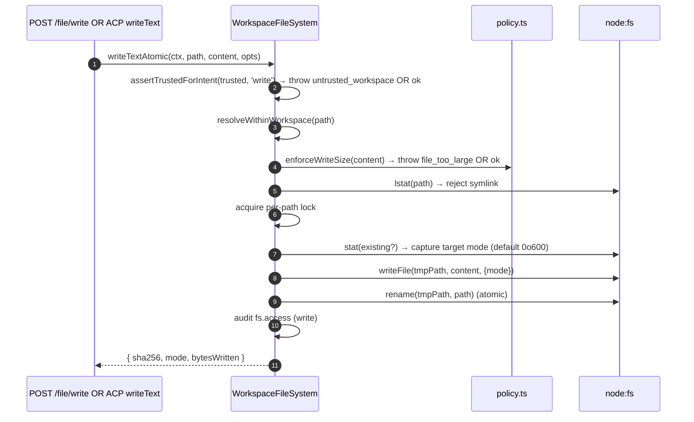
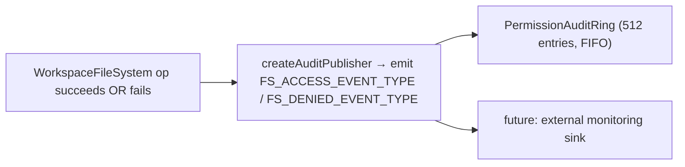

# Limite du système de fichiers de l'espace de travail

## Vue d'ensemble

Le démon ne laisse jamais les routes HTTP ou les appels d'agents côté ACP toucher directement le système de fichiers hôte. Chaque lecture, écriture, listage, glob et stat passe par la limite `WorkspaceFileSystem` (`packages/cli/src/serve/fs/`), qui fournit :

- **Résolution de chemin** — canonicalise les chemins et rejette tout ce qui sort de l'espace de travail lié, y compris via les liens symboliques.
- **Contrôle de confiance** — refuse les écritures lorsque l'espace de travail n'est pas de confiance (`untrusted_workspace`).
- **Politique de taille et de contenu** — plafond de lecture (`MAX_READ_BYTES = 256 KiB`), plafond d'écriture (`MAX_WRITE_BYTES = 5 MiB`), détection binaire.
- **Atomicité** — écriture puis renommage avec préservation du mode cible et `0o600` par défaut pour les nouveaux fichiers.
- **Audit** — chaque accès / refus émet un événement structuré pour `PermissionAuditRing` / la surveillance.
- **Erreurs typées** — union fermée `FsErrorKind` mappée aux codes HTTP.

Les routes HTTP de fichiers (`GET /file`, `GET /file/bytes`, `POST /file/write`, `POST /file/edit`, `GET /list`, `GET /glob`, `GET /stat`) et l'adaptateur côté ACP `BridgeFileSystem` (afin que les appels pilotés par agent `readTextFile` / `writeTextFile` reçoivent les mêmes contrôles) passent toutes par cette limite.

## Responsabilités

- Résoudre les chemins fournis par l'utilisateur en valeurs `ResolvedPath` typées que le reste de la limite peut utiliser en toute sécurité.
- Refuser les chemins en dehors de l'espace de travail lié (`path_outside_workspace`) et les chemins dont la cible est un lien symbolique (`symlink_escape`).
- Refuser les lectures au-dessus de `MAX_READ_BYTES`, les écritures au-dessus de `MAX_WRITE_BYTES`, et les fichiers binaires (`binary_file`).
- Refuser les écritures/éditions lorsque l'espace de travail n'est pas de confiance (`untrusted_workspace`) — contrôlé par `assertTrustedForIntent(trusted, intent)`.
- Respecter les motifs `.gitignore` / `.qwenignore` via `shouldIgnore`.
- Effectuer une écriture puis renommage atomique avec préservation du mode cible ; le mode par défaut pour les nouveaux fichiers est `0o600`.
- Émettre des événements d'audit `fs.access` / `fs.denied` à chaque opération.
- Mapper chaque échec à une `FsError` avec son type et son code HTTP ; les gestionnaires de route les sérialisent uniformément.

## Architecture

### Organisation des modules

| Fichier                     | Objectif                                                                                                                                                                                                                                               |
| --------------------------- | ------------------------------------------------------------------------------------------------------------------------------------------------------------------------------------------------------------------------------------------------------- |
| `paths.ts`                  | `canonicalizeWorkspace`, `resolveWithinWorkspace`, `hasSuspiciousPathPattern`, `ResolvedPath` typé, union `Intent` (`read \| write \| list \| stat \| glob`).                                                                                           |
| `policy.ts`                 | `MAX_READ_BYTES`, `MAX_WRITE_BYTES`, `BINARY_PROBE_BYTES`, `assertTrustedForIntent`, `detectBinary`, `enforceReadBytesSize`, `enforceReadSize`, `enforceWriteSize`, `shouldIgnore`.                                                                    |
| `audit.ts`                  | `FS_ACCESS_EVENT_TYPE`, `FS_DENIED_EVENT_TYPE`, `createAuditPublisher`, types de charge utile d'audit.                                                                                                                                                 |
| `errors.ts`                 | Classe `FsError`, `isFsError`, union `FsErrorKind` (14 types), union `FsErrorStatus` (`400 / 403 / 404 / 409 / 413 / 422 / 500 / 503`).                                                                                                                |
| `workspace-file-system.ts`  | `createWorkspaceFileSystemFactory`, `WorkspaceFileSystem` (l'orchestrateur qui lit/écrit/liste), `WriteMode`, `ContentHash`, `FsEntry`, `FsStat`, `ListOptions`, `GlobOptions`, `ReadTextOptions`, `ReadBytesOptions`, `WriteTextAtomicOptions`.        |

### Taxonomie `FsErrorKind`

| Type                      | HTTP par défaut | Signification                                                                                                                                                                                   |
| ------------------------- | --------------- | ----------------------------------------------------------------------------------------------------------------------------------------------------------------------------------------------- |
| `path_outside_workspace`  | 400             | Le chemin résolu est en dehors de l'espace de travail lié.                                                                                                                                      |
| `symlink_escape`          | 400             | La cible est un lien symbolique (rejeté conformément à la posture conservative PR 18 + PR 20).                                                                                                  |
| `path_not_found`          | 404             | `ENOENT`.                                                                                                                                                                                       |
| `binary_file`             | 422             | Contenu détecté comme binaire sur une route texte.                                                                                                                                              |
| `file_too_large`          | 413             | Au-dessus de `MAX_READ_BYTES` ou `MAX_WRITE_BYTES`.                                                                                                                                             |
| `hash_mismatch`           | 409             | Échec du `expectedSha256` de concurrence optimiste.                                                                                                                                             |
| `file_already_exists`     | 409             | `mode: 'create'` alors que le fichier existe déjà.                                                                                                                                              |
| `text_not_found`          | 422             | La chaîne de recherche de `POST /file/edit` n'a pas été trouvée dans le fichier.                                                                                                                |
| `ambiguous_text_match`    | 422             | Plusieurs correspondances alors qu'une seule était attendue.                                                                                                                                    |
| `untrusted_workspace`     | 403             | Écriture tentée dans un espace de travail non fiable.                                                                                                                                           |
| `permission_denied`       | 403             | `EACCES` / `EPERM` au niveau du système d'exploitation.                                                                                                                                         |
| `io_error`                | 503             | `ENOSPC` / `EIO` / `EBUSY` / `ETXTBSY` / `ENAMETOOLONG` / `EMFILE` / `ENFILE`. **Distinct de `permission_denied`** afin que les pipelines de surveillance n'alertent pas les équipes de sécurité pour « disque plein ». |
| `internal_error`          | 500             | Erreur sans errno qui atteint la limite (`TypeError`, bogue de programmeur).                                                                                                                    |
| `parse_error`             | 400 / 422       | Erreur d'analyse du corps de la requête (400) ou violation d'invariant au niveau du service (422).                                                                                              |
### `BridgeFileSystem` (l'adaptateur côté ACP)

`packages/acp-bridge/src/bridgeFileSystem.ts` définit :

```ts
interface BridgeFileSystem {
  readText(params: ReadTextFileRequest): Promise<ReadTextFileResponse>;
  writeText(params: WriteTextFileRequest): Promise<WriteTextFileResponse>;
}
```

C'est le point d'injection pour ACP `readTextFile` / `writeTextFile`. Les tests du pont et les appelants embarqués du mode A peuvent l'omettre sur `BridgeOptions` ; `BridgeClient` se rabat sur son proxy inline `fs.readFile` / `fs.writeFile` (préserve le comportement pré-F1). En production, `qwen serve` câble `BridgeFileSystem` via `createBridgeFileSystemAdapter(fsFactory)` (`packages/cli/src/serve/bridge-file-system-adapter.ts`) afin que les écritures ACP côté agent utilisent les mêmes barrières TOCTOU, symlink, trust-gate et audit que les routes HTTP.

Deux barrières défensives que l'adaptateur DOIT reproduire (car le proxy inline est complètement contourné lorsque l'adaptateur est injecté) :

1. **Rejeter les fichiers non réguliers** — les sockets, pipes, périphériques en mode caractère, entrées procfs/sysfs peuvent diffuser des données illimitées malgré `stats.size === 0`. Le chemin inline lève une exception avec `describeStatKind(stats)` dans le message.
2. **Plafonner la taille tampon** à `READ_FILE_SIZE_CAP = 100 MiB`. Une petite requête `{ line: 1, limit: 10 }` sur un journal de 500 MB coûterait autrement 500 MB de RSS juste pour renvoyer 10 lignes.

L'adaptateur va plus loin : il utilise `WorkspaceFileSystem.writeTextOverwrite` (primitive PR 18) pour les écritures atomiques avec fichier temporaire et renommage, avec préservation du mode, `0o600` par défaut, et rejet des liens symboliques à l'intérieur d'un verrou par chemin. C'est une **divergence par rapport au proxy inline pré-F1** qui résolvait les liens symboliques et écrivait à travers eux vers leur cible — les agents qui dépendaient de l'écriture via des dotfiles liés symboliquement doivent désormais adresser directement le chemin résolu.

### Préservation de FsError sur le fil ACP

Lorsque l'adaptateur `BridgeFileSystem` lève une `FsError` (`kind: 'untrusted_workspace'` / `'symlink_escape'` / `'file_too_large'` / etc.), le chemin d'erreur RPC par défaut du SDK ACP sérialise uniquement `error.message` comme une erreur générique `-32603 "Internal error"` — `kind` / `status` / `hint` sont supprimés. Le client RPC de l'agent en aval devrait alors faire une correspondance par expression régulière sur le message lisible par un humain pour distribuer une UI typée (réessai d'auth vs sélecteur de fichier vs indice de proxy).

`BridgeClient.writeTextFile` et `BridgeClient.readTextFile` installent une barrière légère (`packages/acp-bridge/src/bridgeClient.ts`) qui intercepte les levées en forme de `FsError` et les relance sous forme de `RequestError` ACP :

```ts
function isFsErrorShape(err: unknown): err is FsErrorShape {
  return (
    err instanceof Error &&
    err.name === 'FsError' &&
    typeof (err as { kind?: unknown }).kind === 'string'
  );
}

function preserveFsErrorOverAcp(err: unknown): never {
  if (isFsErrorShape(err)) {
    throw new RequestError(-32603, err.message, {
      errorKind: err.kind,
      ...(err.hint !== undefined ? { hint: err.hint } : {}),
      ...(err.status !== undefined ? { status: err.status } : {}),
    });
  }
  throw err;
}
```

Le client RPC de l'agent reçoit désormais `data.errorKind` (la valeur fermée de `FsErrorKind`) ainsi que les champs optionnels `data.hint` et `data.status`, de sorte que les consommateurs du SDK peuvent effectuer une branche sur l'enum typé plutôt que de faire une correspondance par expression régulière sur le message.

Deux notes de conception :

- **Duck typing plutôt qu'import** — `FsError` vit dans `packages/cli/src/serve/fs/errors.ts` tandis que `BridgeClient` vit dans `packages/acp-bridge`. Un `import { FsError }` direct inverserait la dépendance. La vérification duck (`name === 'FsError'` + `kind: string`) reflète ce que `mapDomainErrorToErrorKind` (`status.ts`) fait déjà pour `TrustGateError` / `SkillError` pour la même raison de regroupement cross-package.
- **Le code JSON-RPC reste à -32603** — le pont ne peut pas mapper de manière fiable `FsError.kind` à une forme de code d'erreur JSON-RPC, donc le champ structuré `data` transporte l'information sémantique pour les consommateurs du SDK. Le code de statut sur le fil (`-32603` "erreur interne") est inchangé ; les clients routent sur `data.errorKind`.

### Barrière de confiance

`assertTrustedForIntent(trusted, intent)` consomme le booléen de confiance injecté par l'appelant ; la couche de politique ne lit pas `Config.isTrustedFolder()` directement. Les opérations de lecture / listage / stat / glob sont toujours autorisées (la confiance ne concerne que les écritures). Les intentions d'écriture dans des espaces de travail non fiables lèvent `FsError('untrusted_workspace', ..., status: 403)`. Le signal de confiance arrive via `WorkspaceFileSystemFactoryDeps.trusted: boolean` — `runQwenServe` passe `true` car l'opérateur a démarré le démon dans un espace de travail qu'il juge implicitement fiable ; `createServeApp` (intégration directe sans `runQwenServe`) par défaut à `false` et émet un avertissement une fois par processus (voir [`02-serve-runtime.md`](./02-serve-runtime.md)).

## Flux de travail

### Lecture

```mermaid
sequenceDiagram
    autonumber
    participant R as HTTP route OR BridgeFileSystem.readText
    participant FS as WorkspaceFileSystem
    participant POL as policy.ts
    participant FSP as node:fs

    R->>FS: readText(ctx, path, opts)
    FS->>FS: resolveWithinWorkspace(path) → ResolvedPath OR throw
    FS->>FSP: stat(path)
    FSP-->>FS: stats
    FS->>FS: reject if not regular file (describeStatKind)
    FS->>POL: enforceReadSize(stats.size, opts.maxBytes?)<br/>→ throw file_too_large OR slice plan
    FS->>FSP: readFile(path)
    FSP-->>FS: buffer
    FS->>POL: detectBinary(buffer)
    POL-->>FS: isBinary?
    FS->>FS: reject if binary; sha256 hash; truncate to line window
    FS->>FS: shouldIgnore? → annotate meta.matchedIgnore
    FS->>FS: audit fs.access
    FS-->>R: { content, sha256, truncated?, meta }
```
`readText` ne saute ni ne rejette les lectures en raison des règles d'ignore. Il lit le fichier normalement et enregistre la classification d'ignore correspondante dans `meta.matchedIgnore`. `list` et `glob` filtrent les résultats ignorés uniquement lorsque `includeIgnored` n'est pas activé.

### Write



L'écriture atomique avec renommage garantit qu'un SIGKILL / OOM en cours d'écriture ne laisse PAS le fichier cible tronqué. `mode: 'create'` échoue avec `file_already_exists` lors du lstat ; `mode: 'overwrite'` procède ; `expectedSha256` arme la concurrence optimiste (`hash_mismatch` en cas de non-correspondance).

### `POST /file/edit` (single text replacement)

Ajoute deux modes d'échec en plus de l'écriture :

- `text_not_found` (422) — la chaîne de recherche n'est pas dans le fichier.
- `ambiguous_text_match` (422) — plusieurs correspondances alors qu'exactement une était requise (le contrat de la route).

### Audit fan-out



`FS_ACCESS_EVENT_TYPE` / `FS_DENIED_EVENT_TYPE` transportent le contexte (`ctx`), le chemin, l'intention, le résultat, errorKind?, bytesRead/written, sha256?.

## State & Lifecycle

- La fabrique est construite une fois au démarrage du démon (`runQwenServe` → `resolveBridgeFsFactory` → adaptateur).
- Chaque requête construit un `RequestContext` et invoque l'orchestrateur de la fabrique uniquement pour cet appel — aucun état persistant par fichier.
- Les verrous par chemin ne vivent que pendant la durée de l'opération d'écriture (pas de verrouillage entre appels ; les écritures concurrentes sur le même chemin se disputent le verrou et se sérialisent).
- L'anneau d'audit est possédé par `runQwenServe` et partagé avec l'éditeur d'audit des permissions.

## Dépendances

- `@qwen-code/qwen-code-core` — `Ignore`, `isBinaryFile`, `Config.isTrustedFolder()`.
- `node:fs`, `node:path`, `node:crypto`.
- `@qwen-code/acp-bridge` — `BridgeFileSystem` contract on the ACP side.
- HTTP routes: `packages/cli/src/serve/routes/workspace-file-read.ts`, `workspace-file-write.ts`.

## Configuration

| Source                                            | Réglage                                                               | Effet                                                                                                              |
| ------------------------------------------------- | --------------------------------------------------------------------- | ------------------------------------------------------------------------------------------------------------------ |
| `WorkspaceFileSystemFactoryDeps.trusted: boolean` | Entrée du constructeur                                                | Si les écritures sont autorisées ; par défaut `true` depuis `runQwenServe`, `false` depuis `createServeApp` (avec avertissement). |
| Constant                                          | `MAX_READ_BYTES = 256 KiB`                                            | Limite de lecture ; `file_too_large` au-delà.                                                                      |
| Constant                                          | `MAX_WRITE_BYTES = 5 MiB`                                             | Limite d'écriture ; dimensionnée en dessous de `express.json({ limit: '10mb' })`.                                   |
| Constant                                          | `BINARY_PROBE_BYTES = 4096`                                           | Taille d'échantillon pour la détection binaire basée sur le contenu.                                                |
| Balises de capacité                               | `workspace_file_read`, `workspace_file_bytes`, `workspace_file_write` | Voir [`11-capabilities-versioning.md`](./11-capabilities-versioning.md).                                            |
| Fichiers de l'espace de travail                   | `.gitignore`, `.qwenignore`                                           | Les chemins ignorés apparaissent comme `ignored: true` dans `shouldIgnore`.                                         |

## Caveats & Known Limits

- **Les liens symboliques sont rejetés, pas suivis.** C'est une divergence par rapport au proxy inline pré-F1 `BridgeClient.writeTextFile` qui résolvait les liens symboliques. Les agents écrivant via des fichiers dotfiles liés symboliquement doivent adresser directement le chemin résolu.
- **`io_error` et `permission_denied` sont distincts.** Ne les confondez pas. Les pipelines de surveillance se basent sur `errorKind` pour les alertes — intégrer ENOSPC dans permission_denied déclencherait des alertes de sécurité pour des problèmes de `df -h`.
- **Le mode des nouveaux fichiers par défaut est `0o600`, pas le umask par défaut.** L'argument `mode` de l'appel système d'écriture contourne le umask. Les agents écrivant des fichiers publics doivent explicitement passer une surcharge de mode.
- **`createServeApp` par défaut `trusted: false`** rejette silencieusement les écritures ACP avec `untrusted_workspace` pour les intégrateurs qui n'injectent pas un `fsFactory` ou `bridge` personnalisé. Un avertissement unique sur stderr est émis la première fois ; les appelants suivants ne voient pas de rappel. Voir [`02-serve-runtime.md`](./02-serve-runtime.md).
- **La limite de lecture est appliquée avant le décodage.** Un fichier de `MAX_READ_BYTES + 1` est refusé même si la requête ne veut que 10 lignes — car le sous-jacent `readFileWithLineAndLimit` lit tout le fichier en mémoire avant de découper.
- **L'adaptateur `BridgeFileSystem` DOIT reproduire les deux barrières du proxy inline** (refus des fichiers non réguliers + limite de taille tampon). Le chemin inline est complètement contourné lorsque l'adaptateur est injecté.
## Références

- `packages/cli/src/serve/fs/index.ts` (barrel)
- `packages/cli/src/serve/fs/paths.ts`
- `packages/cli/src/serve/fs/policy.ts`
- `packages/cli/src/serve/fs/errors.ts`
- `packages/cli/src/serve/fs/audit.ts`
- `packages/cli/src/serve/fs/workspace-file-system.ts`
- `packages/cli/src/serve/bridge-file-system-adapter.ts`
- `packages/acp-bridge/src/bridgeFileSystem.ts`
- Référence des routes HTTP : [`../qwen-serve-protocol.md`](../qwen-serve-protocol.md).
