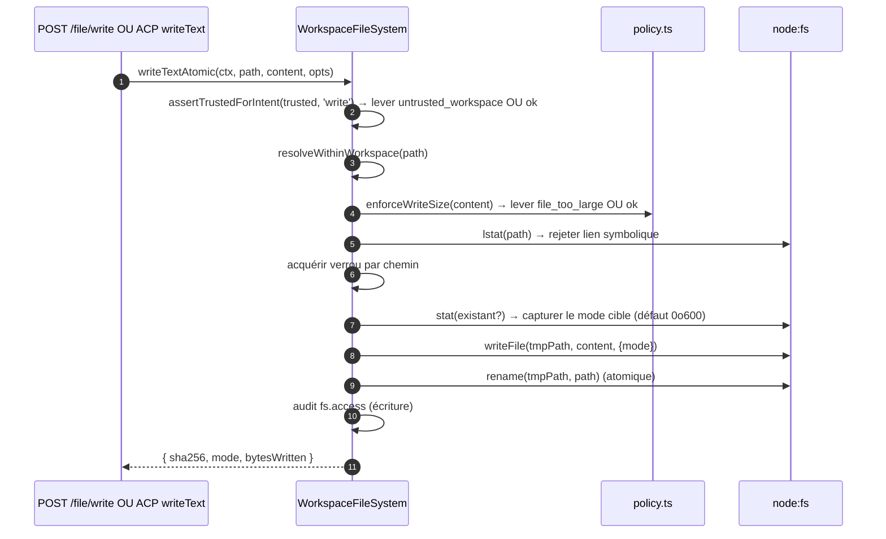
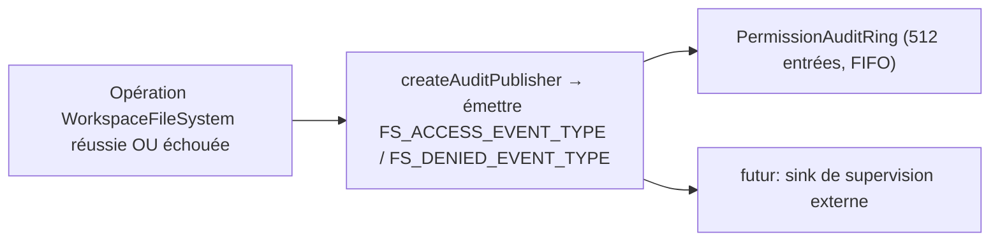

# Limites du système de fichiers de l'espace de travail

## Vue d'ensemble

Le démon ne laisse jamais les routes HTTP ou les appels d'agent côté ACP toucher directement le système de fichiers hôte. Chaque lecture, écriture, listage, glob et stat passe par la limite `WorkspaceFileSystem` (`packages/cli/src/serve/fs/`), qui fournit :

- **Résolution de chemin** — canonicalise les chemins et rejette tout ce qui sort de l'espace de travail lié, y compris via les liens symboliques.
- **Protection par confiance** — refuse les écritures lorsque l'espace de travail n'est pas approuvé (`untrusted_workspace`).
- **Politique de taille et de contenu** — limite de lecture (`MAX_READ_BYTES = 256 Ko`), limite d'écriture (`MAX_WRITE_BYTES = 5 Mo`), détection binaire.
- **Atomicité** — écriture puis renommage avec préservation du mode cible et valeur par défaut `0o600` pour les nouveaux fichiers.
- **Audit** — chaque accès / refus émet un événement structuré pour `PermissionAuditRing` / la supervision.
- **Erreurs typées** — union fermée `FsErrorKind` mappée sur des statuts HTTP.

Les routes HTTP de fichiers (`GET /file`, `GET /file/bytes`, `POST /file/write`, `POST /file/edit`, `GET /list`, `GET /glob`, `GET /stat`) et l'adaptateur côté ACP `BridgeFileSystem` (afin que les appels `readTextFile` / `writeTextFile` pilotés par agent passent par les mêmes protections) passent tous par cette limite.

## Responsabilités

- Résoudre les chemins fournis par l'utilisateur en valeurs `ResolvedPath` typées que le reste de la limite peut utiliser en toute sécurité.
- Refuser les chemins en dehors de l'espace de travail lié (`path_outside_workspace`) et les chemins dont la cible est un lien symbolique (`symlink_escape`).
- Refuser les lectures au-dessus de `MAX_READ_BYTES`, les écritures au-dessus de `MAX_WRITE_BYTES`, et les fichiers binaires (`binary_file`).
- Refuser les écritures/éditions lorsque l'espace de travail n'est pas approuvé (`untrusted_workspace`) — protégé par `assertTrustedForIntent(trusted, intent)`.
- Respecter les motifs `.gitignore` / `.qwenignore` via `shouldIgnore`.
- Effectuer une écriture atomique (écriture puis renommage) avec préservation du mode cible ; le mode par défaut pour un nouveau fichier est `0o600`.
- Émettre des événements d'audit `fs.access` / `fs.denied` pour chaque opération.
- Mapper chaque échec à une `FsError` avec un type et un statut HTTP ; les gestionnaires de route les sérialisent uniformément.

## Architecture

### Organisation des modules

| Fichier                     | Objectif                                                                                                                                                                                                                                                 |
| -------------------------- | -------------------------------------------------------------------------------------------------------------------------------------------------------------------------------------------------------------------------------------------------------- |
| `paths.ts`                 | `canonicalizeWorkspace`, `resolveWithinWorkspace`, `hasSuspiciousPathPattern`, `ResolvedPath` typé, union `Intent` (`read \| write \| list \| stat \| glob`).                                                                                           |
| `policy.ts`                | `MAX_READ_BYTES`, `MAX_WRITE_BYTES`, `BINARY_PROBE_BYTES`, `assertTrustedForIntent`, `detectBinary`, `enforceReadBytesSize`, `enforceReadSize`, `enforceWriteSize`, `shouldIgnore`.                                                                      |
| `audit.ts`                 | `FS_ACCESS_EVENT_TYPE`, `FS_DENIED_EVENT_TYPE`, `createAuditPublisher`, types de charge utile d'audit.                                                                                                                                                   |
| `errors.ts`                | Classe `FsError`, `isFsError`, union `FsErrorKind` (14 types), union `FsErrorStatus` (`400 / 403 / 404 / 409 / 413 / 422 / 500 / 503`).                                                                                                                 |
| `workspace-file-system.ts` | `createWorkspaceFileSystemFactory`, `WorkspaceFileSystem` (l'orchestrateur qui lit/écrit/liste), `WriteMode`, `ContentHash`, `FsEntry`, `FsStat`, `ListOptions`, `GlobOptions`, `ReadTextOptions`, `ReadBytesOptions`, `WriteTextAtomicOptions`. |

### Taxonomie `FsErrorKind`

| Type                       | HTTP par défaut | Signification                                                                                                                                                                                        |
| -------------------------- | --------------- | ---------------------------------------------------------------------------------------------------------------------------------------------------------------------------------------------------- |
| `path_outside_workspace`   | 400             | Le chemin résolu est en dehors de l'espace de travail lié.                                                                                                                                           |
| `symlink_escape`           | 400             | La cible est un lien symbolique (rejeté conformément à la posture prudente PR 18 + PR 20).                                                                                                          |
| `path_not_found`           | 404             | `ENOENT`.                                                                                                                                                                                            |
| `binary_file`              | 422             | Contenu détecté binaire sur une route texte.                                                                                                                                                         |
| `file_too_large`           | 413             | Au-dessus de `MAX_READ_BYTES` ou `MAX_WRITE_BYTES`.                                                                                                                                                  |
| `hash_mismatch`            | 409             | Échec de la concurrence optimiste `expectedSha256`.                                                                                                                                                  |
| `file_already_exists`      | 409             | `mode: 'create'` contre un fichier existant.                                                                                                                                                         |
| `text_not_found`           | 422             | La chaîne de recherche de `POST /file/edit` n'a pas été trouvée dans le fichier.                                                                                                                     |
| `ambiguous_text_match`     | 422             | Plusieurs correspondances alors qu'une seule était requise.                                                                                                                                          |
| `untrusted_workspace`      | 403             | Tentative d'écriture dans un espace de travail non approuvé.                                                                                                                                         |
| `permission_denied`        | 403             | `EACCES` / `EPERM` au niveau du système d'exploitation.                                                                                                                                              |
| `io_error`                 | 503             | `ENOSPC` / `EIO` / `EBUSY` / `ETXTBSY` / `ENAMETOOLONG` / `EMFILE` / `ENFILE`. **Distinct de `permission_denied`** pour que les pipelines de supervision n'alertent pas les équipes de sécurité pour un "disque plein". |
| `internal_error`           | 500             | Erreur non-errno qui atteint la limite (`TypeError`, bug de programmeur).                                                                                                                            |
| `parse_error`              | 400 / 422       | Erreur d'analyse du corps de la requête (400) ou violation d'invariant au niveau du service (422).                                                                                                   |

### `BridgeFileSystem` (l'adaptateur côté ACP)

`packages/acp-bridge/src/bridgeFileSystem.ts` définit :

```ts
interface BridgeFileSystem {
  readText(params: ReadTextFileRequest): Promise<ReadTextFileResponse>;
  writeText(params: WriteTextFileRequest): Promise<WriteTextFileResponse>;
}
```

C'est le point d'injection pour `readTextFile` / `writeTextFile` de l'ACP. Les tests du pont et les appelants intégrés en Mode A peuvent l'omettre sur `BridgeOptions` ; `BridgeClient` utilise alors son proxy `fs.readFile` / `fs.writeFile` en ligne (comportement pré-F1 conservé). En production, `qwen serve` câble `BridgeFileSystem` via `createBridgeFileSystemAdapter(fsFactory)` (`packages/cli/src/serve/bridge-file-system-adapter.ts`) afin que les écritures ACP côté agent bénéficient des mêmes protections TOCTOU, liens symboliques, confiance et audit que les routes HTTP.

Deux protections défensives que l'adaptateur DOIT reproduire (car le proxy en ligne est totalement contourné lorsque l'adaptateur est injecté) :

1. **Rejeter les fichiers non réguliers** — les sockets / pipes / périphériques de caractères / entrées procfs / sysfs peuvent diffuser des données illimitées malgré `stats.size === 0`. Le chemin en ligne lance une exception avec `describeStatKind(stats)` dans le message.
2. **Limiter la taille du tampon** à `READ_FILE_SIZE_CAP = 100 Mo`. Une petite requête `{ line: 1, limit: 10 }` contre un fichier journal de 500 Mo coûterait autrement 500 Mo de RSS pour simplement retourner 10 lignes.

L'adaptateur va plus loin : il utilise `WorkspaceFileSystem.writeTextOverwrite` (primitive PR 18) pour les écritures atomiques avec fichier temporaire et renommage, préservation du mode, valeur par défaut `0o600`, et rejet des liens symboliques à l'intérieur d'un verrou par chemin. Il s'agit d'une **divergence par rapport au proxy en ligne pré-F1** qui résolvait les liens symboliques et écrivait vers leur cible — les agents qui écrivaient via des fichiers points liés symboliquement doivent désormais utiliser le chemin résolu directement.

### Préservation de `FsError` sur le fil ACP

Lorsque l'adaptateur `BridgeFileSystem` lance une `FsError` (`kind: 'untrusted_workspace'` / `'symlink_escape'` / `'file_too_large'` / etc.), le chemin d'erreur RPC par défaut du SDK ACP ne sérialise que `error.message` comme une erreur générique `-32603 "Internal error"` — les champs `kind` / `status` / `hint` sont perdus. Le client RPC de l'agent en aval devrait alors utiliser une correspondance regex sur le message lisible pour décider du typage d'interface (réauthentification vs sélecteur de fichier vs indication de proxy).

`BridgeClient.writeTextFile` et `BridgeClient.readTextFile` installent une garde légère (`packages/acp-bridge/src/bridgeClient.ts`) qui intercepte les exceptions de forme FsError et les relance en tant que `RequestError` ACP :

```ts
function isFsErrorShape(err: unknown): err is FsErrorShape {
  return (
    err instanceof Error &&
    err.name === 'FsError' &&
    typeof (err as { kind?: unknown }).kind === 'string'
  );
}

function preserveFsErrorOverAcp(err: unknown): never {
  if (isFsErrorShape(err)) {
    throw new RequestError(-32603, err.message, {
      errorKind: err.kind,
      ...(err.hint !== undefined ? { hint: err.hint } : {}),
      ...(err.status !== undefined ? { status: err.status } : {}),
    });
  }
  throw err;
}
```

Le client RPC de l'agent reçoit désormais `data.errorKind` (la valeur fermée `FsErrorKind`) plus les champs optionnels `data.hint` et `data.status`, ce qui permet aux consommateurs du SDK de bifurquer sur l'énumération typée au lieu d'utiliser une regex sur le message.

Deux notes de conception :

- **Typage canard plutôt qu'import** — `FsError` vit dans `packages/cli/src/serve/fs/errors.ts` tandis que `BridgeClient` vit dans `packages/acp-bridge`. Un import direct `import { FsError }` inverserait la dépendance. La vérification par canard (`name === 'FsError'` + `kind: string`) reflète ce que `mapDomainErrorToErrorKind` (`status.ts`) fait déjà pour `TrustGateError` / `SkillError` pour la même raison de regroupement multi-packages.
- **Le code JSON-RPC reste à -32603** — le pont ne peut pas mapper de manière fiable `FsError.kind` vers une forme de code d'erreur JSON-RPC, donc le champ structuré `data` transporte l'information sémantique pour les consommateurs du SDK. Le code de statut sur le fil (`-32603` "erreur interne") reste inchangé ; les clients routent sur `data.errorKind`.

### Protection par confiance

`assertTrustedForIntent(trusted, intent)` consomme le booléen de confiance injecté par l'appelant ; la couche de politique ne lit pas directement `Config.isTrustedFolder()`. Les opérations de lecture / listage / stat / glob sont toujours autorisées (la confiance n'est nécessaire que pour les écritures). Les intentions d'écriture dans des espaces de travail non approuvés lèvent une `FsError('untrusted_workspace', ..., status: 403)`. Le signal de confiance arrive via `WorkspaceFileSystemFactoryDeps.trusted: boolean` — `runQwenServe` passe `true` car l'opérateur a démarré le démon contre un espace de travail qu'il approuve implicitement ; `createServeApp` (intégration directe sans `runQwenServe`) utilise `false` par défaut et émet un avertissement une fois par processus (voir [`02-serve-runtime.md`](./02-serve-runtime.md)).

## Workflow

### Lecture

```mermaid
sequenceDiagram
    autonumber
    participant R as Route HTTP OU BridgeFileSystem.readText
    participant FS as WorkspaceFileSystem
    participant POL as policy.ts
    participant FSP as node:fs

    R->>FS: readText(ctx, path, opts)
    FS->>FS: resolveWithinWorkspace(path) → ResolvedPath OU lever
    FS->>FSP: stat(path)
    FSP-->>FS: stats
    FS->>FS: rejeter si fichier non régulier (describeStatKind)
    FS->>POL: enforceReadSize(stats.size, opts.maxBytes?)<br/>→ lever file_too_large OU plan de découpage
    FS->>FSP: readFile(path)
    FSP-->>FS: buffer
    FS->>POL: detectBinary(buffer)
    POL-->>FS: isBinary?
    FS->>FS: rejeter si binaire ; hash sha256 ; tronquer à la fenêtre de lignes
    FS->>FS: shouldIgnore? → annoter meta.matchedIgnore
    FS->>FS: audit fs.access
    FS-->>R: { content, sha256, truncated?, meta }
```

`readText` ne saute ni ne rejette les lectures à cause des règles d'ignorance. Il lit le fichier normalement et enregistre la classification d'ignorance correspondante dans `meta.matchedIgnore`. `list` et `glob` filtrent les résultats ignorés uniquement lorsque `includeIgnored` n'est pas activé.

### Écriture



L'écriture atomique avec renommage garantit qu'un SIGKILL / OOM en cours d'écriture ne laisse PAS la cible tronquée. `mode: 'create'` échoue avec `file_already_exists` sur lstat ; `mode: 'overwrite'` continue ; `expectedSha256` arme la concurrence optimiste (`hash_mismatch` en cas de différence).

### `POST /file/edit` (remplacement de texte unique)

Ajoute deux modes d'échec supplémentaires par rapport à l'écriture :

- `text_not_found` (422) — la chaîne de recherche n'est pas dans le fichier.
- `ambiguous_text_match` (422) — plusieurs correspondances alors qu'une seule était requise (contrat de la route).

### Diffusion des audits



`FS_ACCESS_EVENT_TYPE` / `FS_DENIED_EVENT_TYPE` transportent le contexte (`ctx`), le chemin, l'intention, le résultat, errorKind?, bytesRead/écrits, sha256?.

## État et cycle de vie

- La fabrique est construite une fois au démarrage du démon (`runQwenServe` → `resolveBridgeFsFactory` → adaptateur).
- Chaque requête construit un `RequestContext` et invoque l'orchestrateur de la fabrique pour cet appel uniquement — pas d'état persistant par fichier.
- Les verrous par chemin vivent uniquement pendant la durée de l'opération d'écriture (pas de verrouillage entre appels ; les écritures concurrentes sur le même chemin se disputent le verrou et se sérialisent).
- L'anneau d'audit est possédé par `runQwenServe` et partagé avec l'éditeur d'audit des permissions.

## Dépendances

- `@qwen-code/qwen-code-core` — `Ignore`, `isBinaryFile`, `Config.isTrustedFolder()`.
- `node:fs`, `node:path`, `node:crypto`.
- `@qwen-code/acp-bridge` — contrat `BridgeFileSystem` côté ACP.
- Routes HTTP : `packages/cli/src/serve/routes/workspace-file-read.ts`, `workspace-file-write.ts`.

## Configuration

| Source                                            | Paramètre                                                          | Effet                                                                                                              |
| ------------------------------------------------- | ------------------------------------------------------------------ | ------------------------------------------------------------------------------------------------------------------ |
| `WorkspaceFileSystemFactoryDeps.trusted: boolean` | Entrée du constructeur                                             | Autorise ou non les écritures ; par défaut `true` depuis `runQwenServe`, `false` depuis `createServeApp` (avec avertissement). |
| Constante                                         | `MAX_READ_BYTES = 256 Ko`                                          | Limite de lecture ; `file_too_large` au-delà.                                                                      |
| Constante                                         | `MAX_WRITE_BYTES = 5 Mo`                                           | Limite d'écriture ; dimensionnée en dessous de `express.json({ limit: '10mb' })`.                                  |
| Constante                                         | `BINARY_PROBE_BYTES = 4096`                                        | Taille d'échantillon pour la détection binaire basée sur le contenu.                                               |
| Étiquettes de capacité                            | `workspace_file_read`, `workspace_file_bytes`, `workspace_file_write` | Voir [`11-capabilities-versioning.md`](./11-capabilities-versioning.md).                                          |
| Fichiers de l'espace de travail                   | `.gitignore`, `.qwenignore`                                        | Les chemins ignorés remontent comme `ignored: true` depuis `shouldIgnore`.                                         |

## Mises en garde et limitations connues

- **Les liens symboliques sont rejetés, pas suivis.** C'est une divergence par rapport au proxy en ligne pré-F1 `BridgeClient.writeTextFile` qui résolvait les liens symboliques. Les agents qui écrivent via des fichiers points liés symboliquement doivent utiliser le chemin résolu directement.
- **`io_error` et `permission_denied` sont distincts.** Ne pas les confondre. Les pipelines de supervision se basent sur `errorKind` pour les alertes — fusionner ENOSPC dans permission_denied déclencherait des alertes de sécurité pour des problèmes de `df -h`.
- **Le mode par défaut des nouveaux fichiers est `0o600`, pas les valeurs par défaut d'umask.** L'argument `mode` de l'appel système d'écriture contourne umask. Les agents qui écrivent des fichiers publics doivent passer explicitement un mode différent.
- **`createServeApp` avec `trusted: false` par défaut** rejette silencieusement les écritures ACP avec `untrusted_workspace` pour les intégrateurs qui n'injectent pas de `fsFactory` ou `bridge` personnalisé. Un avertissement sur stderr est émis une fois la première fois ; les appelants suivants ne voient pas de rappel. Voir [`02-serve-runtime.md`](./02-serve-runtime.md).
- **La limite de lecture est appliquée avant le décodage.** Un fichier à `MAX_READ_BYTES + 1` est refusé même si la requête ne demande que 10 lignes — car `readFileWithLineAndLimit` lit tout le fichier en mémoire avant de découper.
- **L'adaptateur `BridgeFileSystem` DOIT reproduire les deux protections du proxy en ligne** (refus des fichiers non réguliers + limite de taille du tampon). Le chemin en ligne est totalement contourné lorsque l'adaptateur est injecté.

## Références

- `packages/cli/src/serve/fs/index.ts` (baril)
- `packages/cli/src/serve/fs/paths.ts`
- `packages/cli/src/serve/fs/policy.ts`
- `packages/cli/src/serve/fs/errors.ts`
- `packages/cli/src/serve/fs/audit.ts`
- `packages/cli/src/serve/fs/workspace-file-system.ts`
- `packages/cli/src/serve/bridge-file-system-adapter.ts`
- `packages/acp-bridge/src/bridgeFileSystem.ts`
- Référence des routes HTTP : [`../qwen-serve-protocol.md`](../qwen-serve-protocol.md).