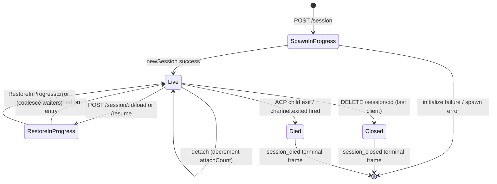

# Cycle de vie des sessions & Identité

## Vue d'ensemble

Une **session** de démon est une conversation logique liée à un `sessionId` ACP. Le pont maintient un `SessionEntry` par session (voir [`03-acp-bridge.md`](./03-acp-bridge.md)) qui associe la connexion enfant ACP avec la comptabilité côté HTTP : FIFO d'invites, FIFO de changement de modèle, bus d'événements, permissions en attente, clients attachés, battements de cœur, état de restauration, pierres tombales de trames de terminal.

Un **client** de démon est identifié par `X-Qwen-Client-Id` — une chaîne opaque validée par le démon que l'appelant HTTP appose sur ses requêtes. Le pont suit quels clients sont attachés à quelles sessions, et utilise l'identifiant du client émetteur pour piloter la politique de permission `designated`, les pistes d'audit, et l'attribution des événements.

Ce document explique chaque transition du cycle de vie des sessions (créer / attacher / charger / reprendre / fermer / mourir / expulser) et chaque surface d'identité exposée par le démon.

## Responsabilités

- Créer, attacher, restaurer et récolter les sessions.
- Valider `X-Qwen-Client-Id` et rejeter les identifiants malformés.
- Suivre plusieurs clients attachés par session (`clientIds: Map<string, count>`, `attachCount`).
- Apposer `originatorClientId` sur les événements sortants.
- Exécuter des battements de cœur pour que les tableaux de bord sachent quels clients sont encore connectés.
- Exposer les métadonnées de session (`displayName`) que les opérateurs définissent via `PATCH /session/:id/metadata`.
- Piloter l'émission de trames de terminal (`session_died`, `session_closed`, `client_evicted`, `stream_error`).

## Architecture

| Préoccupation              | Source                                                       | Notes                                                                                     |
| -------------------------- | ------------------------------------------------------------ | ----------------------------------------------------------------------------------------- |
| `SessionEntry`             | `packages/acp-bridge/src/bridge.ts`                          | Structure par session ; voir [`03-acp-bridge.md`](./03-acp-bridge.md) pour la liste complète des champs. |
| `BridgeSession` (public)   | `packages/acp-bridge/src/bridgeTypes.ts`                     | `{ sessionId, workspaceCwd, attached, clientId?, createdAt? }` retourné aux gestionnaires HTTP. |
| `BridgeSessionState`       | `packages/acp-bridge/src/bridgeTypes.ts`                     | `LoadSessionResponse \| ResumeSessionResponse` mis en cache sur l'entrée en tant que `restoreState`. |
| `DaemonSession` (SDK)      | `packages/sdk-typescript/src/daemon/types.ts`                | `{ sessionId, workspaceCwd, attached, clientId?, createdAt? }`.                           |
| Validation d'identifiant client | `packages/acp-bridge/src/bridge.ts` (autour de `spawnOrAttach`) | Modèle `[A-Za-z0-9._:-]{1,128}` ; `InvalidClientIdError` si malformé.                    |
| Récolteur de déconnexion de session | `packages/cli/src/serve/server.ts`                           | Suit les déconnexions du propriétaire de spawn avec `attachCount` + `spawnOwnerWantedKill`. |

### Machine d'état



### Attacher vs créer

Sous `sessionScope: 'single'` (par défaut), le `defaultEntry` du pont est partagé par tous les clients qui se connectent. Un `POST /session` qui arrive alors que `defaultEntry` existe déjà retourne `attached: true` sans créer un nouvel enfant ACP. Le pont incrémente de manière synchrone `attachCount` et enregistre le `X-Qwen-Client-Id` de l'appelant dans `clientIds`.

Sous `sessionScope: 'thread'`, chaque thread peut créer une session distincte. L'appelant respecte toujours `maxSessions`.

### Identité

`X-Qwen-Client-Id` est **facultatif** mais **fortement recommandé**. Le démon n'en génère pas pour le compte de l'appelant — les clients choisissent le leur et le réutilisent entre les requêtes afin que le démon puisse attribuer les votes, les événements d'audit, et détecter les reconnexions.

Règles de validation :

- Jeu de caractères : `[A-Za-z0-9._:-]`.
- Longueur : 1–128.
- En dehors de cet ensemble : `InvalidClientIdError` (`400`).

Le démon appose `originatorClientId` sur les événements SSE sortants lorsque :

1. La requête qui a déclenché l'événement portait `X-Qwen-Client-Id`, ET
2. L'identifiant est actuellement enregistré dans l'ensemble `clientIds` de la session, ET
3. La session a un `activePromptOriginatorClientId` défini (les `sessionUpdate` et `permission_request` en ligne héritent de l'émetteur de l'invite active).

Les appelants anonymes (pas de `X-Qwen-Client-Id`) fonctionnent correctement pour la politique `first-responder` ; `designated` rejette leurs votes avec `permission_forbidden{ reason: 'designated_mismatch' }` ; `consensus` rejette avec la même raison `forbidden` car l'électeur ne figure pas dans l'instantané `votersAtIssue` au moment de la demande ; `local-only` est la seule politique qui accepte les électeurs anonymes en boucle locale.
## Workflow

### Créer ou attacher

```mermaid
sequenceDiagram
    autonumber
    participant C as Client
    participant R as POST /session
    participant B as Bridge.spawnOrAttach
    participant CH as ACP child

    C->>R: POST /session<br/>X-Qwen-Client-Id: alice<br/>{cwd, sessionScope?}
    R->>R: validate clientId pattern
    R->>B: spawnOrAttach({cwd, sessionScope, clientId})
    alt single scope + defaultEntry exists
        B->>B: bump attachCount; register clientId
        B-->>R: {sessionId, attached: true, restoreState?}
    else cold
        B->>CH: spawn + ACP initialize + newSession
        CH-->>B: sessionId
        B->>B: build SessionEntry; register in byId
        B-->>R: {sessionId, attached: false}
    end
    R-->>C: 200 { sessionId, attached, ... }
```

### Charger / reprendre

`POST /session/:id/load` — rejoue l'historique ACP complet (les notifications `session/load` sont déclenchées avant le retour de la réponse).
`POST /session/:id/resume` — restaure sans rejeu (`connection.unstable_resumeSession`, exposé sous la capacité stable du daemon `session_resume` ; `unstable_session_resume` reste un alias déprécié).

Les deux :

1. Utilisent un jeu `pendingRestoreIds` par session sur le canal pour que les appels de restauration concurrents fusionnent (`RestoreInProgressError`).
2. Mettent en cache `restoreState` sur l'entrée afin qu'un attacheur tardif reçoive la même charge utile que le restaurateur d'origine.

### Battement de cœur

`POST /session/:id/heartbeat` met à jour `sessionLastSeenAt` quel que soit le `clientId`. Si la requête comporte un `X-Qwen-Client-Id` enregistré, `clientLastSeenAt.set(clientId, Date.now())` est également mis à jour. L'éviction par client n'est **pas** implémentée en v1 ; la révocation est prévue pour la vague F série 5. Aujourd'hui, les battements de cœur fournissent de l'observabilité pour les tableaux de bord et pour la future politique de révocation dans la PR 24.

### Métadonnées

`PATCH /session/:id/metadata` accepte `{displayName?}`. Validation :

- Longueur maximale : `MAX_DISPLAY_NAME_LENGTH = 256`.
- Ne doit pas contenir de caractères de contrôle (`hasControlCharacter` rejette les points de code ≤ 0x1f ou == 0x7f).
- `InvalidSessionMetadataError` (`400`) en cas de violation.

Une mise à jour réussie diffuse `session_metadata_updated` à chaque abonné.

### Terminaison

| Trame terminale    | Déclencheur                                                                                                                                                   |
| ----------------- | ------------------------------------------------------------------------------------------------------------------------------------------------------------- |
| `session_closed`  | `DELETE /session/:id` (client_close) ou fermeture programmatique.                                                                                             |
| `session_died`    | `channel.exited` se déclenche pour toute raison (crash, kill d'un enfant). Contient `exitCode?` + `signalCode?` lorsque le chemin de sortie OS a été utilisé. |
| `client_evicted`  | Débordement de file d'attente par abonné sur l'EventBus (voir [`10-event-bus.md`](./10-event-bus.md)). Il ne s'agit PAS d'une terminaison au niveau de la session — seul cet abonné est fermé. |
| `stream_error`    | SubscriberLimitExceededError ou autre échec de flux au niveau de la route.                                                                                    |

Les permissions en attente sont résolues comme `{kind:'cancelled', reason:'session_closed'}` via `mediator.forgetSession(sessionId)` sur chaque chemin de terminaison.

### Gardien de récolte de déconnexion

Lorsque la réponse HTTP du client propriétaire du spawn ne peut pas être écrite (réinitialisation TCP en plein milieu de l'établissement), la route appelle `killSession({ requireZeroAttaches: true })`. Si un autre client s'est déjà attaché (`attachCount > 0`), le gardien se court-circuite et la session survit. Définir `spawnOwnerWantedKill = true` mémorise l'intention afin qu'un ultérieur `detachClient()` qui ramène `attachCount` à 0 termine la récolte différée. Sans cela, un propriétaire de spawn qui se déconnecte rapidement démolirait une session saine à chaque reconnexion.

## État et cycle de vie

Champs de `SessionEntry` critiques pour le cycle de vie :

| Champ                              | Type                | Signification                                                                                                 |
| ---------------------------------- | ------------------- | ------------------------------------------------------------------------------------------------------------- |
| `clientIds`                        | `Map<string, number>` | Identifiants client enregistrés → compteur de références de l'enregistrement.                                 |
| `attachCount`                      | `number`            | Nombre de fois que `spawnOrAttach` a retourné `attached: true` pour cette entrée.                             |
| `activePromptOriginatorClientId`   | `string?`           | Originateur de l'invite en cours d'exécution.                                                                 |
| `restoreState`                     | `BridgeSessionState?` | Réponse de chargement/reprise mise en cache pour que les attacheurs tardifs voient des charges utiles cohérentes. |
| `spawnOwnerWantedKill`             | `boolean`           | Pierre tombale de récolte différée (voir gardien de déconnexion ci-dessus).                                   |
| `sessionLastSeenAt`                | `number?`           | Battement de cœur le plus récent pour tout client (ms epoch).                                                 |
| `clientLastSeenAt`                 | `Map<string, number>` | Battement de cœur par client.                                                                                 |
| `pendingPermissionIds`             | `Set<string>`       | identifiants de requête ACP en attente — utilisés lors de l'annulation/fermeture pour les résoudre comme annulés. |
## Dépendances

- Couche ACP : `connection.newSession`, `connection.unstable_resumeSession`, `connection.loadSession`.
- [`03-acp-bridge.md`](./03-acp-bridge.md) pour l'architecture de pont environnante.
- [`04-permission-mediation.md`](./04-permission-mediation.md) pour la manière dont l'initiateur + l'identité pilotent les décisions de politique.
- [`10-event-bus.md`](./10-event-bus.md) pour la livraison des trames terminales.

## Points de terminaison de session supplémentaires

Ces points de terminaison étendent la surface de cycle de vie de base :

### Invite non bloquante (étiquette de capacité `non_blocking_prompt`)

`POST /session/:id/prompt` renvoie désormais un HTTP **202** avec
`{ promptId, lastEventId }` au lieu de bloquer jusqu'à la fin de l'invite. Le
résultat réel arrive sur SSE sous forme de `turn_complete` / `turn_error`, et le
champ `promptId` relie ces événements à la réponse 202.
`DaemonSessionClient.prompt()` utilise automatiquement le chemin non bloquant lorsqu'il
a un abonnement événementiel actif et fait correspondre le résultat en toute transparence depuis le flux SSE.

### Récapitulatif de session (étiquette de capacité `session_recap`)

`POST /session/:id/recap` demande au modèle rapide un résumé en une ligne « où en
étais-je? ». Il renvoie `{ sessionId, recap: string | null }` ; `null` signifie que
l'historique était trop court ou que le modèle a échoué temporairement. Ce point de terminaison
est fourni au mieux.

### Question en passant / question secondaire (étiquette de capacité `session_btw`)

`POST /session/:id/btw` pose une question ponctuelle dans le contexte de la session
sans interrompre le fil de conversation principal. Il utilise `runForkedAgent` sur le
chemin de cache pour un appel LLM monotour sans outil et renvoie
`{ sessionId, answer: string | null }`. L'implémentation applique
`BTW_MAX_INPUT_LENGTH`, des gardes contre les fuites inter-sessions, et une gestion des délais d'attente.

### Exécution de commande shell

`POST /session/:id/shell` exécute une commande shell directement sur l'hôte du démon,
sans passer par le LLM. Il diffuse la sortie sur le bus SSE de la session via
les événements `user_shell_command` / `user_shell_result` et injecte la commande plus
le résultat dans l'historique de conversation du LLM. La réponse est
`{ exitCode, output, aborted }`.

### Détachement de session

`POST /session/:id/detach` détache explicitement un client d'une session en
décrémentant `attachCount` ; il ne ferme pas la session par lui-même. S'il ne reste
aucun autre attachement ou abonné, la session est nettoyée. Le point de terminaison renvoie 204.

### Suppression par lots de sessions

`POST /sessions/delete` accepte `{ sessionIds: string[] }` (jusqu'à 100 identifiants),
ferme les sessions de pont, et supprime les fichiers de transcription. Il utilise
`Promise.allSettled` pour la résilience et renvoie `{ removed, notFound, errors }`.

### Utilisation du contexte (étiquette de capacité `session_context_usage`)

`GET /session/:id/context-usage` renvoie une utilisation structurée de la fenêtre de contexte.
`?detail=true` inclut une utilisation plus fine groupée par outil, mémoire et compétence.

### Statistiques de session (étiquette de capacité `session_stats`)

`GET /session/:id/stats` renvoie les statistiques d'utilisation : métriques du modèle
(tokens d'entrée/sortie, lectures/écritures de cache, coût total), nombres et latences
d'appels par outil, nombres d'éditions de fichiers, et nombres d'invocations par compétence
pour la session active. Le bloc `skills` reflète les chargements de corps de compétence
et les commandes slash de compétence dans cette session uniquement ; il ne s'agit pas
d'un agrégat d'activité entre sessions.

### Tâches de session (étiquette de capacité `session_tasks`)

`GET /session/:id/tasks` renvoie un instantané des tâches d'arrière-plan pour les tâches
d'agent, les tâches shell, les tâches de surveillance, et leurs états de cycle de vie.

### Statut LSP de session (étiquette de capacité `session_lsp`)

`GET /session/:id/lsp` renvoie le statut LSP nettoyé par session pour les clients
du démon : activation, nombre total de serveurs, état non disponible/initialisation,
et par serveur `name`, `status`, `languages`, `transport`, `command`, et
`error`. Le LSP désactivé ou indisponible est représenté comme des données de statut HTTP 200,
et non comme une erreur de transport.

### Relecture compactée

`POST /session/:id/load` renvoie désormais un `BridgeRestoredSession` qui peut inclure
`compactedReplay?: BridgeEvent[]`, `liveJournal?: BridgeEvent[]`, et
`lastEventId?: number`. `compactedReplay` est produit par
`TurnBoundaryCompactionEngine` : aux limites de tour, il replie les blocs de texte /
pensée consécutifs, compresse les séquences d'appels d'outils à leur état final, ignore
les signaux transitoires, et produit des journaux de relecture O(tours) au lieu de O(tokens)
(généralement une réduction de 25 à 30 fois).

### Pré-échauffement de l'enfant ACP

`bridge.preheat()` réchauffe le processus enfant ACP avant la première session afin que
la première session réelle évite la latence de démarrage à froid. Il s'associe à
`channelIdleTimeoutMs`, qui maintient l'enfant ACP en vie après la fermeture de la dernière
session, et au comportement de non-relance, qui réutilise un enfant déjà inactif lorsqu'une
nouvelle session arrive.

## Configuration

- `BridgeOptions.maxSessions` (par défaut 20) — limite.
- `BridgeOptions.sessionScope` (par défaut `'single'` ; `'thread'` optionnel).
- `BridgeOptions.initializeTimeoutMs` (par défaut 10s) — poignée de main `initialize` ACP.
- `BridgeOptions.channelIdleTimeoutMs` (par défaut 0 ; nettoie immédiatement l'enfant ACP).
- Étiquettes de capacité : `session_create`, `session_scope_override`, `session_load`, `session_resume`, `unstable_session_resume` (alias déprécié), `session_list`, `session_close`, `session_metadata`, `session_set_model`, `client_identity`, `client_heartbeat`, `session_recap`, `session_btw`, `session_context_usage`, `session_tasks`, `session_stats`, `session_lsp`, `non_blocking_prompt`.
## Mises en garde et limites connues

- `connection.unstable_resumeSession` peut encore être instable au niveau de la couche ACP, mais le démon annonce le contrat de route v1 validé avec `session_resume`. `unstable_session_resume` est conservé uniquement comme alias de compatibilité obsolète.
- v1 n'a **aucune éviction par client** ; seulement une terminaison par session et par abonné. La politique de révocation est F-series Wave 5 / PR 24.
- `client_evicted` est par abonné, pas par session. Un client dont l'abonné SSE a été expulsé peut se reconnecter.
- Les clients anonymes (pas de `X-Qwen-Client-Id`) ne peuvent pas voter sous les politiques `designated` ou `consensus`.

## Références

- `packages/acp-bridge/src/bridge.ts` (définition de SessionEntry)
- `packages/acp-bridge/src/bridgeTypes.ts` (`HttpAcpBridge`, `BridgeSession`, `BridgeSessionState`)
- `packages/sdk-typescript/src/daemon/types.ts` (`DaemonSession`)
- `packages/sdk-typescript/src/daemon/DaemonSessionClient.ts`
- Référence filaire : [`../qwen-serve-protocol.md`](../qwen-serve-protocol.md) (catalogue des routes).
