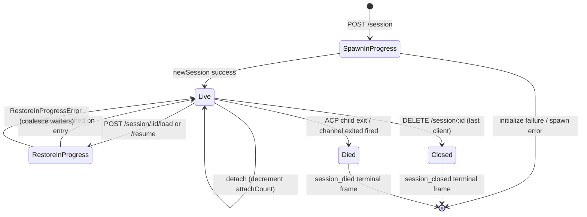

# Cycle de vie de session et identité

## Vue d'ensemble

Une **session** de démon est une conversation logique liée à un `sessionId` ACP. Le pont maintient une `SessionEntry` par session (voir [`03-acp-bridge.md`](./03-acp-bridge.md)) qui couple la connexion enfant ACP avec la comptabilité côté HTTP : FIFO de prompts, FIFO de changement de modèle, bus d'événements, permissions en attente, clients attachés, battements de cœur, état de restauration, pierres tombales de trames terminales.

Un **client** de démon est identifié par `X-Qwen-Client-Id` — une chaîne opaque, validée par le démon, que l'appelant HTTP appose sur ses requêtes. Le pont suit quels clients sont attachés à quelles sessions, et utilise l'identifiant du client d'origine pour piloter la politique de permission `designated`, les pistes d'audit et l'attribution des événements.

Ce document explique chaque transition du cycle de vie d'une session (créer / attacher / charger / reprendre / fermer / mourrir / expulser) et chaque surface d'identité exposée par le démon.

## Responsabilités

- Créer, attacher, restaurer et récolter les sessions.
- Valider `X-Qwen-Client-Id` et rejeter les identifiants malformés.
- Suivre plusieurs clients attachés par session (`clientIds: Map<string, count>`, `attachCount`).
- Apposer `originatorClientId` sur les événements sortants.
- Exécuter les battements de cœur pour que les tableaux de bord sachent quels clients sont toujours connectés.
- Exposer les métadonnées de session (`displayName`) que les opérateurs définissent via `PATCH /session/:id/metadata`.
- Piloter l'émission de trames terminales (`session_died`, `session_closed`, `client_evicted`, `stream_error`).

## Architecture

| Préoccupation                | Source                                                       | Notes                                                                                       |
| ---------------------------- | ------------------------------------------------------------ | ------------------------------------------------------------------------------------------- |
| `SessionEntry`               | `packages/acp-bridge/src/bridge.ts`                          | Structure par session ; voir [`03-acp-bridge.md`](./03-acp-bridge.md) pour la liste complète des champs. |
| `BridgeSession` (public)     | `packages/acp-bridge/src/bridgeTypes.ts`                     | `{ sessionId, workspaceCwd, attached, clientId?, createdAt? }` retourné aux gestionnaires HTTP. |
| `BridgeSessionState`         | `packages/acp-bridge/src/bridgeTypes.ts`                     | `LoadSessionResponse \| ResumeSessionResponse` mis en cache sur l'entrée sous `restoreState`. |
| `DaemonSession` (SDK)        | `packages/sdk-typescript/src/daemon/types.ts`                | `{ sessionId, workspaceCwd, attached, clientId?, createdAt? }`.                             |
| Validation de l'identifiant client | `packages/acp-bridge/src/bridge.ts` (autour de `spawnOrAttach`) | Motif `[A-Za-z0-9._:-]{1,128}` ; `InvalidClientIdError` si malformé.                        |
| Récolteur de déconnexion de session | `packages/cli/src/serve/server.ts`                           | Suit les déconnexions du propriétaire de spawn avec `attachCount` + `spawnOwnerWantedKill`. |

### Machine d'états



### Attacher vs spawner

Avec `sessionScope: 'single'` (par défaut), le `defaultEntry` du pont est partagé par tous les clients qui se connectent. Un `POST /session` qui arrive alors que `defaultEntry` existe déjà retourne `attached: true` sans créer un nouvel enfant ACP. Le pont incrémente de manière synchrone `attachCount` et enregistre le `X-Qwen-Client-Id` de l'appelant dans `clientIds`.

Avec `sessionScope: 'thread'`, chaque fil peut créer une session distincte. L'appelant respecte toujours `maxSessions`.

### Identité

`X-Qwen-Client-Id` est **optionnel** mais **fortement recommandé**. Le démon n'en génère pas un pour l'appelant — les clients choisissent le leur et le réutilisent entre les requêtes pour que le démon puisse attribuer les votes, auditer les événements et détecter les reconnexions.

Règles de validation :

- Jeu de caractères : `[A-Za-z0-9._:-]`.
- Longueur : 1–128.
- En dehors de cet ensemble : `InvalidClientIdError` (`400`).

Le démon appose `originatorClientId` sur les événements SSE sortants lorsque :

1. La requête qui a déclenché l'événement portait `X-Qwen-Client-Id`, ET
2. L'identifiant est actuellement enregistré dans l'ensemble `clientIds` de la session, ET
3. La session a un `activePromptOriginatorClientId` défini (les `sessionUpdate` et `permission_request` en ligne héritent de l'originateur du prompt actif).

Les appelants anonymes (sans `X-Qwen-Client-Id`) fonctionnent bien pour la politique `first-responder` ; `designated` rejette leurs votes avec `permission_forbidden{ reason: 'designated_mismatch' }` ; `consensus` rejette avec la même raison `forbidden` car l'électeur n'est pas dans l'instantané `votersAtIssue` au moment de l'émission ; `local-only` est la seule politique qui accepte les électeurs anonymes en boucle locale.

## Workflow

### Créer ou attacher

```mermaid
sequenceDiagram
    autonumber
    participant C as Client
    participant R as POST /session
    participant B as Bridge.spawnOrAttach
    participant CH as ACP child

    C->>R: POST /session<br/>X-Qwen-Client-Id: alice<br/>{cwd, sessionScope?}
    R->>R: validate clientId pattern
    R->>B: spawnOrAttach({cwd, sessionScope, clientId})
    alt single scope + defaultEntry exists
        B->>B: bump attachCount; register clientId
        B-->>R: {sessionId, attached: true, restoreState?}
    else cold
        B->>CH: spawn + ACP initialize + newSession
        CH-->>B: sessionId
        B->>B: build SessionEntry; register in byId
        B-->>R: {sessionId, attached: false}
    end
    R-->>C: 200 { sessionId, attached, ... }
```

### Charger / Reprendre

`POST /session/:id/load` — rejoue l'historique ACP complet (les notifications `session/load` sont envoyées avant que la réponse ne soit retournée).
`POST /session/:id/resume` — restaure sans rejeu (`connection.unstable_resumeSession`, exposée sous la capacité stable `session_resume` du démon ; `unstable_session_resume` reste un alias déprécié).

Les deux :

1. Utilisent un ensemble `pendingRestoreIds` par session sur le canal pour que les appels de restauration concurrents se regroupent (`RestoreInProgressError`).
2. Mettent en cache `restoreState` sur l'entrée afin qu'un attacheur tardif reçoive la même charge utile que le restaurateur d'origine.

### Battement de cœur

`POST /session/:id/heartbeat` met à jour `sessionLastSeenAt` indépendamment de `clientId`. Si la requête porte un `X-Qwen-Client-Id` enregistré, `clientLastSeenAt.set(clientId, Date.now())` est également mis à jour. L'expulsion par client **n'est pas** implémentée en v1 ; la révocation est prévue pour la vague 5 de la série F. Aujourd'hui, les battements de cœur fournissent une observabilité pour les tableaux de bord et pour la future politique de révocation dans le PR 24.

### Métadonnées

`PATCH /session/:id/metadata` accepte `{displayName?}`. Validation :

- Longueur max : `MAX_DISPLAY_NAME_LENGTH = 256`.
- Ne doit pas contenir de caractères de contrôle (`hasControlCharacter` rejette les points de code ≤ 0x1f ou == 0x7f).
- `InvalidSessionMetadataError` (`400`) en cas de violation.

Une mise à jour réussie diffuse `session_metadata_updated` à tous les abonnés.

### Terminaison

| Trame terminale   | Déclencheur                                                                                                                                                         |
| ---------------- | ------------------------------------------------------------------------------------------------------------------------------------------------------------------- |
| `session_closed` | `DELETE /session/:id` (client_close) ou fermeture programmatique.                                                                                                   |
| `session_died`   | `channel.exited` se déclenche pour n'importe quelle raison (crash, kill de l'enfant). Transporte `exitCode?` + `signalCode?` lorsque le chemin de sortie OS a été utilisé. |
| `client_evicted` | Débordement de file d'attente par abonné sur le bus d'événements (voir [`10-event-bus.md`](./10-event-bus.md)). PAS une terminaison au niveau de la session — seul cet abonné est fermé. |
| `stream_error`   | SubscriberLimitExceededError ou autre échec de flux au niveau de la route.                                                                                          |

Les permissions en attente sont résolues sous forme de `{kind:'cancelled', reason:'session_closed'}` via `mediator.forgetSession(sessionId)` à chaque chemin de terminaison.

### Garde de récolteur de déconnexion

Lorsque la réponse HTTP du client propriétaire du spawn ne peut pas être écrite (réinitialisation TCP en plein milieu de la négociation), la route appelle `killSession({ requireZeroAttaches: true })`. Si un autre client s'est déjà attaché (`attachCount > 0`), le garde court-circuite et la session continue. La définition de `spawnOwnerWantedKill = true` mémorise l'intention afin qu'un appel ultérieur à `detachClient()` qui ramène `attachCount` à 0 termine la récolte différée. Sans cela, un propriétaire de spawn se déconnectant rapidement déchirerait une session saine à chaque reconnexion.

## État et cycle de vie

Champs critiques de `SessionEntry` pour le cycle de vie :

| Champ                            | Type                  | Signification                                                                         |
| -------------------------------- | --------------------- | ------------------------------------------------------------------------------------- |
| `clientIds`                      | `Map<string, number>` | Identifiants clients enregistrés → nombre de références d'enregistrement.             |
| `attachCount`                    | `number`              | Nombre de fois que `spawnOrAttach` a retourné `attached: true` pour cette entrée.     |
| `activePromptOriginatorClientId` | `string?`             | Originateur du prompt en cours d'exécution.                                           |
| `restoreState`                   | `BridgeSessionState?` | Réponse de chargement/reprise mise en cache pour que les attacheurs tardifs voient des charges utiles cohérentes. |
| `spawnOwnerWantedKill`           | `boolean`             | Pierre tombale de récolte différée (voir garde de récolteur de déconnexion ci-dessus).|
| `sessionLastSeenAt`              | `number?`             | Battement de cœur le plus récent de tous les clients (ms epoch).                      |
| `clientLastSeenAt`               | `Map<string, number>` | Battement de cœur par client.                                                         |
| `pendingPermissionIds`           | `Set<string>`         | RequestIds ACP en attente — utilisés lors de l'annulation/fermeture pour résoudre en annulé. |

## Dépendances

- Couche ACP : `connection.newSession`, `connection.unstable_resumeSession`, `connection.loadSession`.
- [`03-acp-bridge.md`](./03-acp-bridge.md) pour l'architecture globale du pont.
- [`04-permission-mediation.md`](./04-permission-mediation.md) pour la façon dont l'originateur + l'identité pilotent les décisions de politique.
- [`10-event-bus.md`](./10-event-bus.md) pour la livraison des trames terminales.

## Points d'accès supplémentaires de session

Ces points d'accès étendent la surface de cycle de vie de base :

### Prompt non bloquant (étiquette de capacité `non_blocking_prompt`)

`POST /session/:id/prompt` retourne désormais HTTP **202** avec
`{ promptId, lastEventId }` au lieu de bloquer jusqu'à la fin du prompt. Le
résultat réel arrive sur SSE sous forme de `turn_complete` / `turn_error`, et le
champ `promptId` corrèle ces événements avec la réponse 202.
`DaemonSessionClient.prompt()` utilise automatiquement le chemin non bloquant lorsqu'il
a un abonnement actif aux événements et fait correspondre le résultat du
flux SSE de manière transparente.

### Récapitulatif de session (étiquette de capacité `session_recap`)

`POST /session/:id/recap` demande au modèle rapide un résumé en une ligne de « où en
étais-je ». Il retourne `{ sessionId, recap: string | null }` ; `null` signifie que
l'historique était trop court ou que le modèle a temporairement échoué. Ce point d'accès est
au mieux.

### Question BTW / Question secondaire (étiquette de capacité `session_btw`)

`POST /session/:id/btw` pose une question ponctuelle dans le contexte de la session
sans interrompre le flux de conversation principal. Il utilise `runForkedAgent` sur le
chemin de cache pour un appel LLM à un seul tour, sans outil, et retourne
`{ sessionId, answer: string | null }`. L'implémentation applique
`BTW_MAX_INPUT_LENGTH`, des gardes contre les fuites entre sessions, et la gestion des délais d'attente.

### Exécution de commande shell

`POST /session/:id/shell` exécute une commande shell directement sur l'hôte du démon,
sans passer par le LLM. Il diffuse la sortie sur le bus SSE de la session via les événements
`user_shell_command` / `user_shell_result` et injecte la commande plus le
résultat dans l'historique de conversation du LLM. La réponse est
`{ exitCode, output, aborted }`.

### Détachement de session

`POST /session/:id/detach` détache explicitement un client d'une session en
décrémentant `attachCount` ; il ne ferme pas la session par lui-même. Si aucun autre
attachement ou abonné ne reste, la session est récoltée. Le point d'accès retourne 204.

### Suppression groupée de sessions

`POST /sessions/delete` accepte `{ sessionIds: string[] }` (jusqu'à 100 identifiants),
ferme les sessions du pont et supprime les fichiers de transcription. Il utilise
`Promise.allSettled` pour la résilience et retourne `{ removed, notFound, errors }`.

### Utilisation du contexte (étiquette de capacité `session_context_usage`)

`GET /session/:id/context-usage` retourne des statistiques structurées d'utilisation de la fenêtre de contexte.
`?detail=true` inclut une utilisation plus fine regroupée par outil, mémoire et compétence.

### Statistiques de session (étiquette de capacité `session_stats`)

`GET /session/:id/stats` retourne des statistiques d'utilisation : métriques du modèle
(tokens d'entrée/sortie, lectures/écritures du cache, coût total), compteurs d'appels et
latences par outil, compteurs d'éditions de fichiers, et compteurs d'invocations par compétence pour la session
active. Le bloc `skills` reflète les chargements de corps de compétence et les commandes slash de compétence
uniquement dans cette session ; ce n'est pas un agrégat d'activité entre sessions.

### Tâches de session (étiquette de capacité `session_tasks`)

`GET /session/:id/tasks` retourne un instantané des tâches d'arrière-plan pour les tâches d'agent,
les tâches shell, les tâches de surveillance et leurs états de cycle de vie.

### Statut LSP de session (étiquette de capacité `session_lsp`)

`GET /session/:id/lsp` retourne le statut LSP par session, nettoyé, pour les clients
du démon : activation, nombre total de serveurs, état d'indisponibilité/initialisation,
et par serveur `name`, `status`, `languages`, `transport`, `command` et
`error`. Le LSP désactivé ou indisponible est représenté comme des données de statut HTTP 200,
pas comme une erreur de transport.

### Rejeu compacté

`POST /session/:id/load` retourne désormais un `BridgeRestoredSession` qui peut inclure
`compactedReplay?: BridgeEvent[]`, `liveJournal?: BridgeEvent[]` et
`lastEventId?: number`. `compactedReplay` est produit par
`TurnBoundaryCompactionEngine` : aux frontières de tour, il plie les blocs de texte /
pensée consécutifs, réduit les séquences d'appels d'outils à leur état final,
supprime les signaux transitoires, et produit des journaux de rejeu en O(nombre de tours) au lieu
de O(nombre de tokens) (généralement une réduction de 25 à 30 fois).

### Préchauffage de l'enfant ACP

`bridge.preheat()` réchauffe le processus enfant ACP avant la première session afin que
la première session réelle évite la latence de démarrage à froid. Il s'associe avec
`channelIdleTimeoutMs`, qui maintient l'enfant ACP en vie après la fermeture de la dernière session,
et le comportement de re-lancement sauté, qui réutilise un enfant déjà inactif lorsqu'une
nouvelle session arrive.

## Configuration

- `BridgeOptions.maxSessions` (par défaut 20) — limite.
- `BridgeOptions.sessionScope` (par défaut `'single'` ; optionnel `'thread'`).
- `BridgeOptions.initializeTimeoutMs` (par défaut 10s) — négociation `initialize` ACP.
- `BridgeOptions.channelIdleTimeoutMs` (par défaut 0 ; récolte immédiate de l'enfant ACP).
- Étiquettes de capacité : `session_create`, `session_scope_override`, `session_load`, `session_resume`, `unstable_session_resume` (alias déprécié), `session_list`, `session_close`, `session_metadata`, `session_set_model`, `client_identity`, `client_heartbeat`, `session_recap`, `session_btw`, `session_context_usage`, `session_tasks`, `session_stats`, `session_lsp`, `session_status`, `non_blocking_prompt`.

## Mises en garde et limitations connues

- `connection.unstable_resumeSession` peut encore être instable au niveau de la couche ACP, mais le démon annonce le contrat de route v1 validé avec `session_resume`. `unstable_session_resume` est conservé uniquement comme alias de compatibilité déprécié.
- La v1 n'a **pas d'expulsion par client** ; seulement une terminaison par session et par abonné. La politique de révocation est prévue pour la vague 5 de la série F / PR 24.
- `client_evicted` est par abonné, pas par session. Un client dont l'abonné SSE a été expulsé peut se reconnecter.
- Les clients anonymes (sans `X-Qwen-Client-Id`) ne peuvent pas voter sous les politiques `designated` ou `consensus`.

## Références

- `packages/acp-bridge/src/bridge.ts` (définition de `SessionEntry`)
- `packages/acp-bridge/src/bridgeTypes.ts` (`HttpAcpBridge`, `BridgeSession`, `BridgeSessionState`)
- `packages/sdk-typescript/src/daemon/types.ts` (`DaemonSession`)
- `packages/sdk-typescript/src/daemon/DaemonSessionClient.ts`
- Référence filaire : [`../qwen-serve-protocol.md`](../qwen-serve-protocol.md) (catalogue de routes).