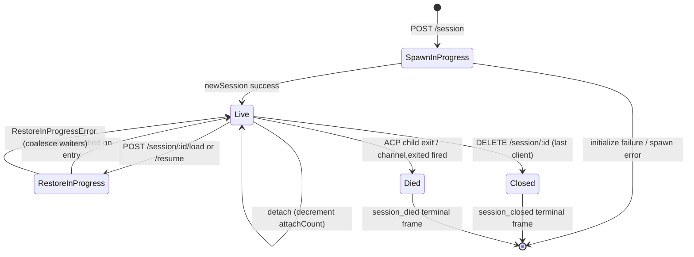

# Cycle de vie et identité des sessions

## Vue d'ensemble

Une **session** du daemon est une conversation logique unique épinglée à un `sessionId` ACP. Le bridge maintient une `SessionEntry` par session (voir [`03-acp-bridge.md`](./03-acp-bridge.md)) qui couple la connexion enfant ACP avec la comptabilité côté HTTP : FIFO de prompts, FIFO de changements de modèle, bus d'événements, permissions en attente, clients attachés, heartbeats, état de restauration, tombstones de trames terminales.

Un **client** du daemon est identifié par `X-Qwen-Client-Id` — une chaîne opaque validée par le daemon que l'appelant HTTP appose sur ses requêtes. Le bridge suit quels clients sont attachés à quelles sessions, et utilise l'ID client d'origine pour piloter la politique de permission `designated`, les pistes d'audit et l'attribution des événements.

Ce document explique chaque transition du cycle de vie d'une session (create / attach / load / resume / close / die / evict) et chaque surface d'identité exposée par le daemon.

## Responsabilités

- Créer, attacher, restaurer et nettoyer les sessions.
- Valider `X-Qwen-Client-Id` et rejeter les IDs malformés.
- Suivre plusieurs clients attachés par session (`clientIds: Map<string, count>`, `attachCount`).
- Apposer `originatorClientId` sur les événements sortants.
- Exécuter les heartbeats pour que les tableaux de bord sachent quels clients sont encore connectés.
- Exposer les métadonnées de session (`displayName`) que les opérateurs définissent via `PATCH /session/:id/metadata`.
- Piloter l'émission des trames terminales (`session_died`, `session_closed`, `client_evicted`, `stream_error`).

## Architecture

| Sujet                     | Source                                                       | Notes                                                                                     |
| ------------------------- | ------------------------------------------------------------ | ----------------------------------------------------------------------------------------- |
| `SessionEntry`            | `packages/acp-bridge/src/bridge.ts`                          | Struct par session ; voir [`03-acp-bridge.md`](./03-acp-bridge.md) pour la liste complète des champs.  |
| `BridgeSession` (public)  | `packages/acp-bridge/src/bridgeTypes.ts`                     | `{ sessionId, workspaceCwd, attached, clientId?, createdAt? }` renvoyé aux gestionnaires HTTP. |
| `BridgeSessionState`      | `packages/acp-bridge/src/bridgeTypes.ts`                     | `LoadSessionResponse \| ResumeSessionResponse` mis en cache sur l'entrée en tant que `restoreState`.     |
| `DaemonSession` (SDK)     | `packages/sdk-typescript/src/daemon/types.ts`                | `{ sessionId, workspaceCwd, attached, clientId?, createdAt? }`.                           |
| Validation de l'ID client | `packages/acp-bridge/src/bridge.ts` (autour de `spawnOrAttach`) | Motif `[A-Za-z0-9._:-]{1,128}` ; `InvalidClientIdError` si malformé.                    |
| Nettoyeur de déconnexion de session | `packages/cli/src/serve/server.ts`                           | Suit les déconnexions du propriétaire du spawn avec `attachCount` + `spawnOwnerWantedKill`.               |

### Machine à états



### Attach vs spawn

Sous `sessionScope: 'single'` (par défaut), la `defaultEntry` du bridge est partagée par chaque client se connectant. Un `POST /session` qui arrive alors que `defaultEntry` existe déjà renvoie `attached: true` sans créer un nouvel enfant ACP. Le bridge incrémente de manière synchrone `attachCount` et enregistre le `X-Qwen-Client-Id` de l'appelant dans `clientIds`.

Sous `sessionScope: 'thread'`, chaque thread peut créer une session distincte. L'appelant respecte toujours `maxSessions`.

### Identité

`X-Qwen-Client-Id` est **facultatif** mais **fortement recommandé**. Le daemon n'en génère pas pour le compte de l'appelant — les clients choisissent le leur et le réutilisent à travers les requêtes afin que le daemon puisse attribuer les votes, auditer les événements et détecter les reconnexions.

Règles de validation :

- Jeu de caractères : `[A-Za-z0-9._:-]`.
- Longueur : 1 à 128.
- En dehors de cet ensemble : `InvalidClientIdError` (`400`).

Le daemon appose `originatorClientId` sur les événements SSE sortants lorsque :

1. La requête qui a déclenché l'événement portait `X-Qwen-Client-Id`, ET
2. L'ID est actuellement enregistré dans l'ensemble `clientIds` de la session, ET
3. La session a un `activePromptOriginatorClientId` défini (les `sessionUpdate` et `permission_request` inline héritent de l'origine du prompt actif).

Les appelants anonymes (sans `X-Qwen-Client-Id`) fonctionnent parfaitement pour la politique `first-responder` ; `designated` rejette leurs votes avec `permission_forbidden{ reason: 'designated_mismatch' }` ; `consensus` rejette avec la même raison `forbidden` car le votant n'est pas dans le snapshot `votersAtIssue` au moment de l'émission ; `local-only` est la seule politique qui accepte les votants anonymes en boucle locale.

## Workflow

### Créer ou attacher

```mermaid
sequenceDiagram
    autonumber
    participant C as Client
    participant R as POST /session
    participant B as Bridge.spawnOrAttach
    participant CH as ACP child

    C->>R: POST /session<br/>X-Qwen-Client-Id: alice<br/>{cwd, sessionScope?}
    R->>R: validate clientId pattern
    R->>B: spawnOrAttach({cwd, sessionScope, clientId})
    alt single scope + defaultEntry exists
        B->>B: bump attachCount; register clientId
        B-->>R: {sessionId, attached: true, restoreState?}
    else cold
        B->>CH: spawn + ACP initialize + newSession
        CH-->>B: sessionId
        B->>B: build SessionEntry; register in byId
        B-->>R: {sessionId, attached: false}
    end
    R-->>C: 200 { sessionId, attached, ... }
```

### Load / resume

`POST /session/:id/load` — rejoue l'historique ACP complet (les notifications `session/load` sont déclenchées avant le retour de la réponse).
`POST /session/:id/resume` — restaure sans rejouer (`connection.unstable_resumeSession`, exposé sous la capacité stable `session_resume` du daemon ; `unstable_session_resume` reste un alias obsolète).

Les deux :

1. Utilisent un ensemble `pendingRestoreIds` par session sur le canal afin que les appels de restauration simultanés fusionnent (`RestoreInProgressError`).
2. Mettent en cache `restoreState` sur l'entrée afin qu'un client attaché tardivement reçoive la même charge utile que le restaurateur d'origine.

### Heartbeat

`POST /session/:id/heartbeat` met à jour `sessionLastSeenAt` indépendamment du `clientId`. Si la requête porte un `X-Qwen-Client-Id` enregistré, `clientLastSeenAt.set(clientId, Date.now())` est également mis à jour. L'éviction par client n'est **pas** implémentée dans la v1 ; la révocation est prévue pour la F-series Wave 5. Aujourd'hui, les heartbeats fournissent de l'observabilité pour les tableaux de bord et pour la politique de révocation à venir dans la PR 24.

### Métadonnées

`PATCH /session/:id/metadata` accepte `{displayName?}`. Validation :

- Longueur max : `MAX_DISPLAY_NAME_LENGTH = 256`.
- Ne doit pas contenir de caractères de contrôle (`hasControlCharacter` rejette les points de code ≤ 0x1f ou == 0x7f).
- `InvalidSessionMetadataError` (`400`) en cas de violation.

Une mise à jour réussie diffuse `session_metadata_updated` à chaque abonné.

### Terminaison

| Trame terminale  | Déclencheur                                                                                                                                                       |
| ---------------- | ------------------------------------------------------------------------------------------------------------------------------------------------------------- |
| `session_closed` | `DELETE /session/:id` (client_close) ou fermeture programmatique.                                                                                                   |
| `session_died`   | `channel.exited` se déclenche pour n'importe quelle raison (crash, kill de l'enfant). Transporte `exitCode?` + `signalCode?` lorsque le chemin de sortie OS a été utilisé.                                |
| `client_evicted` | Dépassement de la file d'attente par abonné sur l'EventBus (voir [`10-event-bus.md`](./10-event-bus.md)). N'est PAS une terminaison au niveau de la session — seul cet abonné est fermé. |
| `stream_error`   | SubscriberLimitExceededError ou autre échec de flux au niveau de la route.                                                                                             |

Les permissions en attente sont résolues en tant que `{kind:'cancelled', reason:'session_closed'}` via `mediator.forgetSession(sessionId)` à chaque chemin de terminaison.

### Garde du nettoyeur de déconnexion

Lorsque la réponse HTTP du client propriétaire du spawn ne peut pas être écrite (TCP reset en plein handshake), la route appelle `killSession({ requireZeroAttaches: true })`. Si un autre client s'est déjà attaché (`attachCount > 0`), la garde court-circuite et la session continue de vivre. Définir `spawnOwnerWantedKill = true` mémorise l'intention afin qu'un `detachClient()` ultérieur qui ramène `attachCount` à 0 termine le nettoyage différé. Sans cela, un propriétaire de spawn se déconnectant rapidement détruirait une session saine à chaque reconnexion.

## État et cycle de vie

Champs de `SessionEntry` critiques pour le cycle de vie :

| Champ                            | Type                  | Signification                                                                          |
| -------------------------------- | --------------------- | -------------------------------------------------------------------------------- |
| `clientIds`                      | `Map<string, number>` | IDs clients enregistrés → compte de références d'enregistrement.                                  |
| `attachCount`                    | `number`              | Nombre de fois que `spawnOrAttach` a renvoyé `attached: true` pour cette entrée.                  |
| `activePromptOriginatorClientId` | `string?`             | Origine du prompt en cours d'exécution.                                     |
| `restoreState`                   | `BridgeSessionState?` | Réponse load/resume mise en cache pour que les clients attachés tardivement voient des charges utiles cohérentes.           |
| `spawnOwnerWantedKill`           | `boolean`             | Tombstone de nettoyage différé (voir le nettoyeur de déconnexion ci-dessus).                           |
| `sessionLastSeenAt`              | `number?`             | Heartbeat le plus récent sur n'importe quel client (epoch ms).                              |
| `clientLastSeenAt`               | `Map<string, number>` | Heartbeat par client.                                                            |
| `pendingPermissionIds`           | `Set<string>`         | requestIds ACP actuellement en attente — utilisé lors de l'annulation/fermeture pour résoudre en tant qu'annulé. |

## Dépendances

- Couche ACP : `connection.newSession`, `connection.unstable_resumeSession`, `connection.loadSession`.
- [`03-acp-bridge.md`](./03-acp-bridge.md) pour l'architecture du bridge environnante.
- [`04-permission-mediation.md`](./04-permission-mediation.md) pour comprendre comment l'origine + l'identité pilotent les décisions de politique.
- [`10-event-bus.md`](./10-event-bus.md) pour la livraison des trames terminales.

## Points de terminaison de session supplémentaires

Ces points de terminaison étendent la surface de cycle de vie de base :

### Prompt non bloquant (tag de capacité `non_blocking_prompt`)

`POST /session/:id/prompt` renvoie désormais HTTP **202** avec
`{ promptId, lastEventId }` au lieu de bloquer jusqu'à ce que le prompt se termine. Le
résultat réel arrive sur SSE sous forme de `turn_complete` / `turn_error`, et le
champ `promptId` fait le lien entre ces événements et la réponse 202.
`DaemonSessionClient.prompt()` utilise automatiquement le chemin non bloquant lorsqu'il
a un abonnement aux événements actif et fait correspondre de manière transparente le résultat du
flux SSE.

### Récapitulatif de session (tag de capacité `session_recap`)

`POST /session/:id/recap` demande au modèle rapide un résumé en une ligne de type « où en étais-je ».
Il renvoie `{ sessionId, recap: string | null }` ; `null` signifie que
l'historique était trop court ou que le modèle a temporairement échoué. Ce point de terminaison est
best-effort.

### Session BTW / Question annexe (tag de capacité `session_btw`)

`POST /session/:id/btw` pose une question ponctuelle sur le contexte de la session
sans interrompre le flux de conversation principal. Il utilise `runForkedAgent` sur le
chemin du cache pour un appel LLM à tour unique sans outil et renvoie
`{ sessionId, answer: string | null }`. L'implémentation applique
`BTW_MAX_INPUT_LENGTH`, les gardes contre les fuites inter-sessions et la gestion des timeouts.

### Exécution de commandes Shell

`POST /session/:id/shell` exécute une commande shell directement sur l'hôte du daemon,
sans passer par le LLM. Il diffuse la sortie sur le bus SSE de la session via
les événements `user_shell_command` / `user_shell_result` et injecte la commande ainsi que
le résultat dans l'historique de conversation du LLM. La réponse est
`{ exitCode, output, aborted }`.

### Détachement de session

`POST /session/:id/detach` détache explicitement un client d'une session en
décrémentant `attachCount` ; il ne ferme pas la session par lui-même. Si aucun autre
attachement ou abonné ne reste, la session est nettoyée. Le point de terminaison renvoie 204.

### Suppression de sessions par lot

`POST /sessions/delete` accepte `{ sessionIds: string[] }` (jusqu'à 100 IDs),
ferme les sessions du bridge et supprime les fichiers de transcription actifs ou archivés. Si des fichiers JSONL
actifs et archivés existent pour le même ID, la suppression forcée (hard delete) supprime les deux
afin que les opérateurs puissent résoudre le conflit. Il nettoie les sidecars worktree actifs et archivés,
mais laisse intacts les snapshots d'historique de fichiers, les transcriptions de sous-agents et les sidecars
d'exécution. Il utilise `Promise.allSettled` pour la résilience et renvoie
`{ removed, notFound, errors }`.

### Archivage de session

`POST /sessions/archive` déplace les fichiers JSONL des sessions inactives de `chats/` vers
`chats/archive/`. Si la session cible est active, le daemon entre d'abord dans une
porte d'archivage par session et effectue une fermeture stricte qui exige que l'enfant ACP
vide (flush) `ChatRecordingService` ; l'archivage laisse le JSONL en place si la fermeture ou le
flush échoue.

`POST /sessions/unarchive` replace les fichiers JSONL archivés dans `chats/`. Il s'agit
uniquement d'une transition d'état de stockage ; les clients doivent appeler `session/load` ou
`session/resume` ensuite. Les sessions archivées renvoient `409 session_archived` pour
load/resume, et les mutations entrant en concurrence avec une transition d'archivage renvoient
`409 session_archiving`.

### Utilisation du contexte (tag de capacité `session_context_usage`)

`GET /session/:id/context-usage` renvoie l'utilisation structurée de la fenêtre de contexte.
`?detail=true` inclut une utilisation plus détaillée regroupée par outil, mémoire et skill.

### Statistiques de session (tag de capacité `session_stats`)

`GET /session/:id/stats` renvoie les statistiques d'utilisation : métriques du modèle
(tokens d'entrée/sortie, lectures/écritures de cache, coût total), nombre d'appels et latences par outil,
nombre de modifications de fichiers et nombre d'invocations par skill pour la session
active. Le bloc `skills` reflète les chargements de corps de skill et les commandes slash de skill
uniquement dans cette session ; il ne s'agit pas d'un agrégat d'activité inter-sessions.

### Tâches de session (tag de capacité `session_tasks`)

`GET /session/:id/tasks` renvoie un snapshot des tâches en arrière-plan pour les tâches d'agent,
les tâches shell, les tâches de monitoring et leurs états de cycle de vie.

### Statut LSP de session (tag de capacité `session_lsp`)

`GET /session/:id/lsp` renvoie le statut LSP par session nettoyé pour les clients du
daemon : activation, nombre total de serveurs, état indisponible/en cours d'initialisation,
et `name`, `status`, `languages`, `transport`, `command` et
`error` par serveur. Un LSP désactivé ou indisponible est représenté sous forme de données de statut HTTP 200,
et non comme une erreur de transport.

### Replay compacté

`POST /session/:id/load` renvoie désormais un `BridgeRestoredSession` qui peut inclure
`compactedReplay?: BridgeEvent[]`, `liveJournal?: BridgeEvent[]` et
`lastEventId?: number`. `compactedReplay` est produit par
`TurnBoundaryCompactionEngine` : aux limites de tour, il plie les blocs de texte /
pensée consécutifs, réduit les séquences d'appels d'outils à leur état final, écarte les
signaux transitoires et produit des logs de replay en O(tours) au lieu de logs en O(tokens)
(généralement une réduction de 25 à 30 fois).

### Préchauffage de l'enfant ACP

`bridge.preheat()` réchauffe le processus enfant ACP avant la première session afin que
la première session réelle évite la latence de démarrage à froid. Il s'associe à
`channelIdleTimeoutMs`, qui maintient l'enfant ACP en vie après la fermeture de la dernière session,
et au comportement de non-relance (skip-relaunch), qui réutilise un enfant déjà inactif lorsqu'une
nouvelle session arrive.

## Configuration

- `BridgeOptions.maxSessions` (par défaut 20) — limite maximale.
- `BridgeOptions.sessionScope` (par défaut `'single'` ; `'thread'` optionnel).
- `BridgeOptions.initializeTimeoutMs` (par défaut 10s) — handshake ACP `initialize`.
- `BridgeOptions.channelIdleTimeoutMs` (par défaut 0 ; nettoie l'enfant ACP immédiatement).
- Tags de capacité : `session_create`, `session_scope_override`, `session_load`, `session_resume`, `unstable_session_resume` (alias obsolète), `session_list`, `session_close`, `session_metadata`, `session_set_model`, `client_identity`, `client_heartbeat`, `session_recap`, `session_btw`, `session_context_usage`, `session_tasks`, `session_stats`, `session_lsp`, `session_status`, `non_blocking_prompt`.

## Mises en garde et limites connues

- `connection.unstable_resumeSession` peut encore être instable au niveau de la couche ACP, mais le daemon annonce le contrat de route v1 engagé avec `session_resume`. `unstable_session_resume` est conservé uniquement comme alias de compatibilité obsolète.
- La v1 n'a **pas d'éviction par client** ; seulement une terminaison par session et par abonné. La politique de révocation est F-series Wave 5 / PR 24.
- `client_evicted` est par abonné, pas par session. Un client dont l'abonné SSE a été évincé peut se reconnecter.
- Les clients anonymes (sans `X-Qwen-Client-Id`) ne peuvent pas voter sous les politiques `designated` ou `consensus`.

## Références

- `packages/acp-bridge/src/bridge.ts` (définition de SessionEntry)
- `packages/acp-bridge/src/bridgeTypes.ts` (`HttpAcpBridge`, `BridgeSession`, `BridgeSessionState`)
- `packages/sdk-typescript/src/daemon/types.ts` (`DaemonSession`)
- `packages/sdk-typescript/src/daemon/DaemonSessionClient.ts`
- Référence wire : [`../qwen-serve-protocol.md`](../qwen-serve-protocol.md) (catalogue de routes).