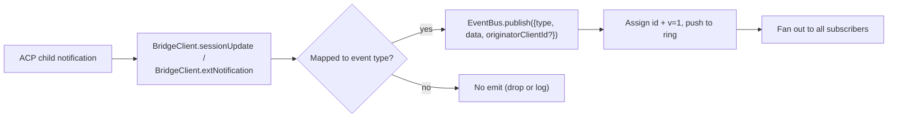
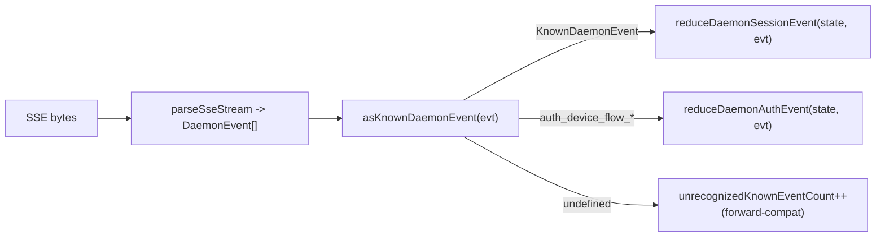

# Schéma d'Événement Typé du Daemon v1

## Aperçu

Chaque trame SSE émise par le daemon sur `GET /session/:id/events` a la forme `{ id, v, type, data, originatorClientId?, _meta? }`. `v: 1` est la version actuelle (`EVENT_SCHEMA_VERSION`). `type` provient de l'ensemble fermé et versionné `DAEMON_KNOWN_EVENT_TYPE_VALUES` défini dans `packages/sdk-typescript/src/daemon/events.ts` ; l'ensemble actuel compte 43 types d'événements connus. Le champ d'enveloppe `_meta` est estampillé à la limite d'écriture SSE par `formatSseFrame()` dans `server.ts` ; voir [Métadonnées au niveau de l'enveloppe](#metadonnees-au-niveau-de-lenveloppe).

Le SDK expose `asKnownDaemonEvent(evt)`. Il retourne un `KnownDaemonEvent` discriminé pour les types d'événements connus et `undefined` pour les autres types. Les consommateurs du SDK peuvent ainsi gérer la compatibilité prospective sans nécessiter une mise à jour bloquante du SDK lorsqu'un daemon plus récent ajoute un type d'événement ; le réducteur de session enregistre ceux-ci comme `unrecognizedKnownEventCount`.

Le format filaire se trouve dans [`../qwen-serve-protocol.md`](../qwen-serve-protocol.md). Cette page est le contrat de charge utile pour chaque événement.

## Responsabilités

- Fournir la source unique de vérité pour le vocabulaire des événements (`DAEMON_KNOWN_EVENT_TYPE_VALUES`).
- Fournir une enveloppe typée pour chaque type d'événement (`DaemonEventEnvelope<TType, TData>`).
- Fournir des réducteurs purs (`reduceDaemonSessionEvent`, `reduceDaemonAuthEvent`) qui projettent un flux d'événements dans l'état de vue du SDK.
- Diffuser la balise de capacité `typed_event_schema` comme signal informatif. Si la balise est absente, `asKnownDaemonEvent` se rabat quand même sur `unknown`.

## Vocabulaire des événements (43 types connus)

Groupés par domaine.

### Session principale

| Type                       | Sens           | Déclencheur                                                                     | Champs clés de la charge utile                                                          |
| -------------------------- | -------------- | ------------------------------------------------------------------------------- | --------------------------------------------------------------------------------------- |
| `session_update`           | S->C           | Toute notification ACP `sessionUpdate` : texte de l'agent, pensée, appel d'outil ou plan | `sessionUpdate: string, content?: ...` (forme ACP opaque)                               |
| `session_metadata_updated` | S->C           | `PATCH /session/:id/metadata`                                                   | `sessionId, displayName?`                                                               |
| `session_died`             | S->C terminal  | `channel.exited`                                                                | `sessionId, reason, exitCode? \| null, signalCode? \| null`                             |
| `session_closed`           | S->C terminal  | `DELETE /session/:id` ou fermeture programmatique                               | `sessionId, reason: 'client_close' \| string, closedBy?`                                |
| `session_snapshot`         | S->C synthétique | Trame d'instantané après attachement SSE / rejeu                               | `sessionId, currentModelId: string \| null, currentApprovalMode: string \| null`        |

### Trames synthétiques au niveau de l'abonné

| Type                    | Déclencheur                                                                                                                                                                                                                                       | Notes                                                                                                                                                                                                                                                                                                                          |
| ----------------------- | ------------------------------------------------------------------------------------------------------------------------------------------------------------------------------------------------------------------------------------------------- | ------------------------------------------------------------------------------------------------------------------------------------------------------------------------------------------------------------------------------------------------------------------------------------------------------------------------------ |
| `client_evicted`        | Débordement de la file EventBus par abonné. **Pas de `id`**.                                                                                                                                                                                      | `reason: string, droppedAfter?: number` ; terminal uniquement pour l'abonné courant, alors que la session reste active.                                                                                                                                                                                                        |
| `slow_client_warning`   | File >= 75% ; poussée forcée et **n'a pas de `id`**.                                                                                                                                                                                              | `queueSize, maxQueued, lastEventId` ; réarmé après que la file descend sous 37,5%.                                                                                                                                                                                                                                             |
| `stream_error`          | `SubscriberLimitExceededError` ou autre erreur de flux de route                                                                                                                                                                                   | `error: string` ; terminal pour l'abonnement.                                                                                                                                                                                                                                                                                  |
| `state_resync_required` | `subscribe({lastEventId})` détecte que l'anneau du daemon ne contient plus `[lastEventId+1, earliestInRing-1]`, ou que le curseur client provient d'une époque de bus précédente. Poussé forcément **avant** les trames de rejeu restantes et **n'a pas de `id`**. | `reason: 'ring_evicted' \| 'epoch_reset' \| string`, `lastDeliveredId: number`, `earliestAvailableId: number`. C'est un signal de récupération, pas terminal : le flux SSE reste ouvert et les trames de rejeu + live continuent. Le réducteur SDK positionne `awaitingResync = true` et ignore les deltas jusqu'à ce que l'appelant réinitialise avec `loadSession`. |
| `replay_complete`       | Sentinelle sans id émise après la boucle de rejeu `Last-Event-ID`, aussi bien pour un rejeu propre que pour un chemin d'anneau évincé, même lorsque `data.replayedCount === 0`. **Pas de `id`**.                                                       | `replayedCount: number` ; permet aux consommateurs de supprimer l'interface de rattrapage de manière déterministe sans timeout.                                                                                                                                                                                                |
### Permissions (F3 + base)

| Type                          | Direction | Déclencheur                                        | Champs clés du payload                                                                                                                                                                                          |
| ----------------------------- | --------- | -------------------------------------------------- | ---------------------------------------------------------------------------------------------------------------------------------------------------------------------------------------------------------------- |
| `permission_request`          | S->C      | L'agent appelle `requestPermission`                | `requestId, sessionId, toolCall, options[]` ; l'enveloppe estampille `originatorClientId` depuis l'initiateur du prompt.                                                                                         |
| `permission_resolved`         | S->C      | Le médiateur a décidé                              | `requestId, outcome` (ACP `PermissionOutcome`)                                                                                                                                                                   |
| `permission_already_resolved` | S->C      | Le vote arrive après que la demande a été décidée  | `requestId, sessionId, outcome`                                                                                                                                                                                  |
| `permission_partial_vote`     | S->C      | La politique `consensus` enregistre un vote non définitif | `requestId, sessionId, votesReceived, votesNeeded (>= 1), quorum, optionTallies: Record<string, number>, originatorClientId?`                                                                                    |
| `permission_forbidden`        | S->C      | La politique rejette un vote                       | `requestId, sessionId, clientId?, reason: 'designated_mismatch' \| 'remote_not_allowed', originatorClientId?` ; les votants anonymes omettent `clientId`. |

### Modèles

| Type                  | Direction | Payload                                      |
| --------------------- | --------- | -------------------------------------------- |
| `model_switched`      | S->C      | `sessionId, modelId`                         |
| `model_switch_failed` | S->C      | `sessionId, requestedModelId, error: string` |

### Garde-fous MCP (PR 14b + F2)

| Type                         | Direction | Payload                                                                                                                                                                                                                                                                                                                                                                                                                                           |
| ---------------------------- | --------- | ------------------------------------------------------------------------------------------------------------------------------------------------------------------------------------------------------------------------------------------------------------------------------------------------------------------------------------------------------------------------------------------------------------------------------------------------- |
| `mcp_budget_warning`         | S->C      | `liveCount, reservedCount, budget, thresholdRatio: 0.75, mode: 'warn' \| 'enforce', scope?: 'workspace' \| 'session'`                                                                                                                                                                                                                                                                                                                             |
| `mcp_child_refused_batch`    | S->C      | `refusedServers: [{ name, transport, reason: 'budget_exhausted' }], budget, liveCount, reservedCount, mode: 'enforce', scope?: 'workspace' \| 'session'`                                                                                                                                                                                                                                                                                          |
| `mcp_server_restarted`       | S->C      | `serverName, durationMs, entryIndex?` pour les redémarrages du pool multi-entrées F2                                                                                                                                                                                                                                                                                                                                                              |
| `mcp_server_restart_refused` | S->C      | `serverName, reason: 'budget_would_exceed' \| 'in_flight' \| 'disabled' \| 'restart_failed', entryIndex?, details?`. La quatrième valeur, `restart_failed`, porte une erreur matérielle sous-jacente pour le redémarrage multi-entrées en mode pool. `MCP_RESTART_REFUSED_REASONS` rejette les raisons inconnues ; un réducteur SDK plus ancien ignore silencieusement les nouvelles valeurs de raisons additives car `parseDaemonEvent` renvoie `undefined`. Livrez une nouvelle raison avec un SDK qui la connaît. |
### Contrôle des mutations (Wave 4 PR 16+17)

| Type                    | Direction | Payload                                                                                              |
| ----------------------- | --------- | ---------------------------------------------------------------------------------------------------- |
| `memory_changed`        | S->C      | `scope: 'workspace' \| 'global', filePath, mode: 'append' \| 'replace', bytesWritten`                |
| `agent_changed`         | S->C      | `change: 'created' \| 'updated' \| 'deleted', name, level: 'project' \| 'user'`                      |
| `approval_mode_changed` | S->C      | `sessionId, previous, next, persisted: boolean`                                                      |
| `tool_toggled`          | S->C      | `toolName, enabled` ; affecte le prochain enfant ACP généré et ne mute pas les sessions déjà en cours d'exécution. |
| `settings_changed`      | S->C      | Écriture des paramètres de l'espace de travail terminée. La charge utile est ouverte ; les consommateurs doivent rafraîchir avec lecture après écriture. |
| `settings_reloaded`     | S->C      | Le service d'espace de travail du démon a relu les paramètres. La charge utile est ouverte. |
| `workspace_initialized` | S->C      | `path, action: 'created' \| 'overwrote' \| 'noop', originatorClientId?`                        |

### Flux d'appareil d'authentification (PR 21)

Ces événements sont associés à l'espace de travail, non à la session. Le réducteur de session les traite comme des no-op ; `reduceDaemonAuthEvent` les projette dans l'état au niveau de l'espace de travail.

| Type                          | Direction | Payload                                               |
| ----------------------------- | --------- | ----------------------------------------------------- |
| `auth_device_flow_started`    | S->C      | `deviceFlowId, providerId, expiresAt`                 |
| `auth_device_flow_throttled`  | S->C      | `deviceFlowId, intervalMs`                            |
| `auth_device_flow_authorized` | S->C      | `deviceFlowId, providerId, expiresAt?, accountAlias?` |
| `auth_device_flow_failed`     | S->C      | `deviceFlowId, errorKind, hint?`                      |
| `auth_device_flow_cancelled`  | S->C      | `deviceFlowId`                                        |

### Mutation d'exécution MCP

| Type                 | Direction | Déclencheur                                                   | Champs de charge utile clés                                                           |
| -------------------- | --------- | ------------------------------------------------------------- | ------------------------------------------------------------------------------------ |
| `mcp_server_added`   | S->C      | Serveur ajouté au moment de l'exécution via `POST /workspace/mcp/servers` | `name, transport, replaced, shadowedSettings, toolCount, originatorClientId` |
| `mcp_server_removed` | S->C      | Serveur supprimé au moment de l'exécution                     | `name, wasShadowingSettings, originatorClientId`                             |

### Cycle de vie du tour / poussées de l'assistant

| Type                  | Direction | Déclencheur                                                                                                             | Champs de charge utile clés                                                                                                                                                                               |
| --------------------- | --------- | ----------------------------------------------------------------------------------------------------------------------- | -------------------------------------------------------------------------------------------------------------------------------------------------------------------------------------------------------- |
| `prompt_cancelled`    | S->C      | L'invite a été annulée via la route explicite `cancelSession` **ou** déconnexion SSE de l'initiateur                        | Les enveloppes marquent `originatorClientId` pour le client annulateur. Cela signifie « annulation demandée », pas « annulation confirmée ». Les abonnés pairs apprennent que l'invite est terminée. |
| `turn_complete`       | S->C      | Un tour s'est terminé avec succès                                                                                       | `sessionId, stopReason, promptId?`. `promptId` relie aux réponses d'invite non bloquantes (`202`). Le SDK fait correspondre les événements SSE à l'invite d'origine via ce champ. |
| `turn_error`          | S->C      | Un tour a échoué                                                                                                       | `sessionId, message, code?, promptId?` ; même mécanisme de corrélation `promptId`.                                                                                                                   |
| `session_rewound`     | S->C      | `POST /session/:id/rewind` a réussi                                                                                | `sessionId, promptId, targetTurnIndex, filesChanged[], filesFailed[], originatorClientId?`                                                                                                       |
| `session_branched`    | S->C      | `POST /session/:id/branch` a créé une branche à partir d'une session existante                                                | `sourceSessionId, newSessionId, displayName, originatorClientId?`                                                                                                                                |
| `followup_suggestion` | S->C      | Un enfant ACP a généré des suggestions de suivi en texte fantôme après `end_turn`, transmises via SSE par session               | `sessionId, suggestion, promptId` ; le câble ne transporte que les suggestions dont `getFilterReason()===null`. Les clients les affichent comme texte fantôme dans l'espace réservé de saisie et les invalident lors du prochain `sendPrompt`. |
| `user_shell_command`  | S->C      | L'utilisateur a démarré une commande shell via `POST /session/:id/shell` ; diffusée aux autres abonnés de la même session | `sessionId, command, shellId, originatorClientId?`. Il n'existe pas encore d'interface typée `DaemonXxxData` ; `asKnownDaemonEvent` renvoie `undefined` et le normalisateur UI le traite de manière ad hoc. |
| `user_shell_result`   | S->C      | Résultat de la commande shell ci-dessus                                                                                   | `sessionId, shellId, exitCode, output, aborted`. Même remarque de traitement ad hoc que `user_shell_command`.                                                                                               |
## Architecture

| Aspect                                | Source                                         | Notes                                                                                                              |
| -------------------------------------- | ---------------------------------------------- | ------------------------------------------------------------------------------------------------------------------ |
| `EVENT_SCHEMA_VERSION = 1`             | `packages/acp-bridge/src/eventBus.ts`          | Envoyé sur chaque trame.                                                                                           |
| `DAEMON_KNOWN_EVENT_TYPE_VALUES`       | `packages/sdk-typescript/src/daemon/events.ts` | Liste fermée avec 43 types.                                                                                        |
| `DaemonEventEnvelope<TType, TData>`    | `events.ts`                                    | Enveloppe générique.                                                                                               |
| `DaemonKnownEventType`                 | `events.ts`                                    | `typeof DAEMON_KNOWN_EVENT_TYPE_VALUES[number]`.                                                                   |
| Per-event payload types                | `events.ts`                                    | La plupart des types d'événements ont une interface `DaemonXxxData` ; `user_shell_*` est actuellement analysé ad hoc par le normaliseur de l'interface utilisateur. |
| `asKnownDaemonEvent(evt)`              | `events.ts`                                    | Retourne `KnownDaemonEvent \| undefined`.                                                                           |
| `reduceDaemonSessionEvent(state, evt)` | `events.ts`                                    | Projette dans `DaemonSessionViewState`.                                                                            |
| `reduceDaemonAuthEvent(state, evt)`    | `events.ts`                                    | Projette dans `DaemonAuthState`.                                                                                   |
| `isWorkspaceScopedBudgetEvent(evt)`    | `events.ts`                                    | Détecte F2 `scope: 'workspace'`.                                                                                   |

### `DaemonSessionViewState`

`reduceDaemonSessionEvent` remplit cet état de vue. L'adaptateur CLI TUI, `DaemonChannelBridge`, et l'IDE VS Code le consomment. Champs clés :

- `alive: boolean` - devient `false` après une trame terminale (`session_died`, `session_closed`, `client_evicted`, `stream_error`).
- `currentModelId?: string` - depuis `model_switched`.
- `displayName?: string` - depuis `session_metadata_updated`.
- `pendingPermissions: Record<string, DaemonPermissionRequestData>` - requêtes ouvertes indexées par `requestId` ; effacées par `permission_resolved` / `permission_already_resolved`.
- `lastSessionUpdate?: DaemonSessionUpdateData` - dernière `session_update`.
- `lastModelSwitchFailure?: DaemonModelSwitchFailedData` - depuis `model_switch_failed`.
- `terminalEvent?` - événement terminal brut.
- `streamError?: DaemonStreamErrorData` - dernière charge utile `stream_error`.
- `unrecognizedKnownEventCount`, `lastUnrecognizedKnownEvent?` - l'événement a été reconnu par `asKnownDaemonEvent` mais le réducteur n'a pas encore d'état dédié pour celui-ci.
- `droppedPermissionRequestCount`, `lastDroppedPermissionRequestId?` - une demande d'autorisation malformée n'a pas pu entrer dans la carte des demandes en attente.
- `unmatchedPermissionResolutionCount`, `lastUnmatchedPermissionResolutionId?` - la résolution d'autorisation n'avait pas de demande en attente correspondante.
- `slowClientWarningCount`, `lastSlowClientWarning?` - depuis `slow_client_warning`.
- `mcpBudgetWarningCount`, `lastMcpBudgetWarning?` - depuis `mcp_budget_warning`.
- `mcpChildRefusedBatchCount`, `lastMcpChildRefusedBatch?` - depuis `mcp_child_refused_batch`.
- `lastWorkspaceMutation?`, `lastWorkspaceMutationType?` - depuis `memory_changed` / `agent_changed`.
- `approvalMode?`, `approvalModeChangedCount`, `lastApprovalModeChange?` - depuis `approval_mode_changed`.
- `toolToggleCount`, `lastToolToggle?` - depuis `tool_toggled`.
- `workspaceInitCount`, `lastWorkspaceInit?` - depuis `workspace_initialized`.
- `mcpRestartCount`, `lastMcpRestart?` - depuis `mcp_server_restarted`.
- `mcpRestartRefusedCount`, `lastMcpRestartRefused?` - depuis `mcp_server_restart_refused`.
- `settings_changed` / `settings_reloaded` - reconnus par `asKnownDaemonEvent` ; le réducteur de session ne maintient pas de champs d'état de vue dédiés, et les interfaces utilisateur les traitent généralement comme des signaux de rafraîchissement.
- `permissionVoteProgress: Record<string, DaemonPermissionPartialVoteData>` - progression du vote par consensus.
- `forbiddenVotes: DaemonPermissionForbiddenData[]`, `forbiddenVoteCount` - enregistrements de vote rejetés par la politique, plafonnés à 32.
- `awaitingResync: boolean` - défini par `state_resync_required` ; effacé lorsque le consommateur réinitialise l'état de vue.
- `resyncRequiredCount`, `lastResyncRequired?` - observabilité de la resynchronisation.
- `lastFollowupSuggestion?: DaemonFollowupSuggestionData` - dernière suggestion de suivi poussée par le daemon.
- `lastTurnComplete?: DaemonTurnCompleteData` - dernier achèvement de tour réussi.
- `lastTurnError?: DaemonTurnErrorData` - dernière erreur de tour.
- `rewindCount`, `lastRewind?`, `lastBranch?` - derniers événements de rembobinage / branchement.
### `DaemonAuthState`

Une entrée par `providerId`, pilotée par `auth_device_flow_*`. Chaque flux expose `{ deviceFlowId, status, providerId, expiresAt?, lastThrottleIntervalMs?, lastError? }`.

## Flux

### Côté producteur



### Côté consommateur (SDK)



## Métadonnées au niveau de l'enveloppe

Au-delà de la charge utile `data` de chaque événement, le démon ajoute deux champs au niveau de l'enveloppe.

### `_meta.serverTimestamp` - horloge du démon

`formatSseFrame()` dans `packages/cli/src/serve/server.ts` ajoute ce champ à la limite d'écriture SSE, **pas** à l'intérieur de `EventBus.publish`. Le type `BridgeEvent` en mémoire reste inchangé ; les consommateurs internes du démon ne voient pas `_meta`, contrairement aux trames SSE sur le fil.

```jsonc
{
  "id": 47,
  "v": 1,
  "type": "session_update",
  "data": { ... },
  "_meta": { "serverTimestamp": 1716287345123 }
}
```

La fusion préserve toute clé `_meta` existante (`{...existingMeta, serverTimestamp: Date.now()}`). **Aucun producteur actuel du démon n'écrit de `_meta` au niveau de l'enveloppe**. La fusion de niveau supérieur est une échappatoire de rétrocompatibilité.

Pourquoi c'est important : les interfaces multi-clients qui affichent le temps relatif ou trient les blocs de transcription devraient utiliser le temps serveur au lieu de l'horloge locale de chaque navigateur/onglet/téléphone. L'horodatage serveur maintient l'ordre cohérent entre les clients.

Accès SDK : préférez `event._meta?.serverTimestamp`. Les chemins de compatibilité peuvent également sonder `event.serverTimestamp` ou `event.data._meta.serverTimestamp`. Ne mélangez pas la charge utile ACP `data._meta` avec l'enveloppe `_meta` du démon.

### `originatorClientId`

Les événements déclenchés par une requête qui portait un `X-Qwen-Client-Id` enregistré peuvent ajouter ce champ. Voir [`08-session-lifecycle.md`](./08-session-lifecycle.md).

## `_meta` des appels d'outil (provenance / serverId)

Ceci est distinct de l'enveloppe `_meta` : les charges utiles ACP `session/update` peuvent porter leur propre `_meta` dans `event.data._meta`. `ToolCallEmitter` (`packages/cli/src/acp-integration/session/emitters/ToolCallEmitter.ts`) ajoute deux champs sur `emitStart`, `emitResult` et `emitError` :

| Champ        | Type                                      | Règle de résolution                                                                                                                                                            |
| ------------ | ----------------------------------------- | -------------------------------------------------------------------------------------------------------------------------------------------------------------------------- |
| `provenance` | `'builtin' \| 'mcp' \| 'subagent'`        | `ToolCallEmitter.resolveToolProvenance` : `subagentMeta` gagne avec `subagent` ; le nom d'outil correspondant à `mcp__<server>__<tool>` correspond à `mcp` ; tout le reste correspond à `builtin`. |
| `serverId`   | `string` uniquement quand `provenance === 'mcp'` | Extrait heuristiquement de `mcp__<serverId>__<tool>`.                                                                                                                    |

Le nom d'affichage `_meta.toolName` existant est préservé. L'interface utilise ces champs pour afficher les badges builtin / serveur MCP / sous-agent sans avoir à ré-analyser le nom de l'outil.

## Comportement du réducteur SDK

`reduceDaemonSessionEvent(state, evt)` dans `packages/sdk-typescript/src/daemon/events.ts` projette le flux dans `DaemonSessionViewState`. Les champs liés à la resynchronisation sont :

- **`awaitingResync: boolean`** - défini par `state_resync_required` ; l'appelant le réinitialise, généralement après que `POST /session/:id/load` a réinitialisé l'état de la vue.
- **`resyncRequiredCount: number`** - compteur d'observabilité.
- **`lastResyncRequired?: DaemonStateResyncRequiredData`** - dernière charge utile.

Lorsque `awaitingResync = true`, le réducteur **saute l'application des deltas** et n'autorise que l'ensemble fermé `RESYNC_PASSTHROUGH_TYPES` :

| Type de passage autorisé        | Pourquoi il est toujours appliqué pendant la resynchronisation                                          |
| ----------------------- | ------------------------------------------------------------------------------ |
| `state_resync_required` | Une deuxième resynchronisation rare devrait mettre à jour `lastResyncRequired` / `resyncRequiredCount`. |
| `session_died`          | Le signal de flux terminal doit rester visible pendant la resynchronisation.                      |
| `session_closed`        | Idem ci-dessus.                                                                 |
| `client_evicted`        | Idem ci-dessus.                                                                 |
| `stream_error`          | Idem ci-dessus.                                                                 |
| `session_snapshot`      | Trame faisant autorité pour l'état complet ; sans risque à appliquer pendant la resynchronisation.                   |
`lastEventId` continue d'avancer de manière monotone via `advanceLastEventId(base)` pendant la resynchronisation. Une fois que l'appelant réinitialise et efface `awaitingResync`, les deltas suivants s'alignent sur le curseur correct.

`reduceDaemonAuthEvent` projette les événements de flux de périphérique dans des entrées d'état d'authentification au niveau de l'espace de travail, conceptuellement sous la forme `{deviceFlowId, status, providerId, expiresAt?, lastThrottleIntervalMs?, lastError?}`. Dans le code, le réducteur stocke `status`, `errorKind`, `hint`, `intervalMs`, `lastSeenEventId`, `authorizedExpiresAt` et `accountAlias` sur `DaemonDeviceFlowReducerState` ; les payloads des événements du démon eux-mêmes conservent les formes par événement listées ci-dessus.

## State and forward compatibility

- Ajoutez un type d'événement connu en l'ajoutant à `DAEMON_KNOWN_EVENT_TYPE_VALUES`. Les anciens SDK renvoient `undefined` pour les types d'événements non reconnus via le chemin de repli et incrémentent `unrecognizedKnownEventCount` ; les nouveaux SDK s'appuient sur l'union discriminée.
- Ajouter des champs optionnels à un payload existant est sûr car les payloads sont ouverts (`{ [key: string]: unknown }`).
- Modifier la **forme** d'un payload existant est un changement cassant et nécessite d'incrémenter `EVENT_SCHEMA_VERSION` et de publier une balise de capacité compatible telle que `caps.features.typed_event_schema_v2`.
- `id` est monotone par session. Les trames synthétiques au niveau de l'abonné (`client_evicted`, `slow_client_warning`, `stream_error`, `state_resync_required`, `replay_complete`, `session_snapshot`) n'ont intentionnellement pas d'ID afin que les autres abonnés ne voient pas de lacunes.
- `originatorClientId` se trouve sur l'enveloppe plutôt que dans `data`. Les payloads F3 partial-vote / forbidden le fusionnent également dans `data` via `mergeOriginator` afin que les consommateurs d'état de vue n'aient pas à conserver l'enveloppe.

## Dependencies

- [`10-event-bus.md`](./10-event-bus.md) - canal de livraison.
- [`11-capabilities-versioning.md`](./11-capabilities-versioning.md) - comment les SDK pré-autorisent `typed_event_schema`, `mcp_guardrail_events` et `permission_mediation`.
- [`04-permission-mediation.md`](./04-permission-mediation.md) - comment les événements de permission sont produits.
- [`13-sdk-daemon-client.md`](./13-sdk-daemon-client.md) - `asKnownDaemonEvent`, les réducteurs et la forme de l'état de vue.

## Configuration

- Toujours annoncés : `typed_event_schema`, `mcp_guardrail_events` et `permission_mediation` (avec les modes de politique pris en charge).
- Aucune variable d'environnement ni option ne contrôle directement le schéma lui-même. `QWEN_SERVE_NO_MCP_POOL=1` change la `scope` de l'événement MCP de `'workspace'` à absent ou `'session'`.

## Caveats and known limits

- Six types de trames synthétiques n'ont intentionnellement pas d'`id` ; le code SDK ne doit pas supposer que chaque événement a un identifiant.
- `permission_partial_vote` n'apparaît que sous `consensus`. `permission_forbidden` apparaît sous `designated`, `consensus` et `local-only`, mais pas sous `first-responder`.
- `mcp_child_refused_batch` n'apparaît qu'en `mode: 'enforce'` ; le mode `warn` ne refuse jamais.
- Les événements `auth_device_flow_*` ne sont pas associés à une session. Lors de la consommation via `DaemonSessionClient`, utilisez `reduceDaemonAuthEvent` pour eux plutôt que le réducteur de session.

## References

- `packages/sdk-typescript/src/daemon/events.ts`
- `packages/acp-bridge/src/eventBus.ts` (`EVENT_SCHEMA_VERSION`)
- `packages/cli/src/serve/capabilities.ts` (`typed_event_schema`, `mcp_guardrail_events`, `permission_mediation`)
- Wire reference: [`../qwen-serve-protocol.md`](../qwen-serve-protocol.md)
