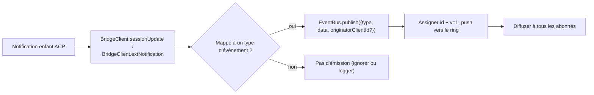
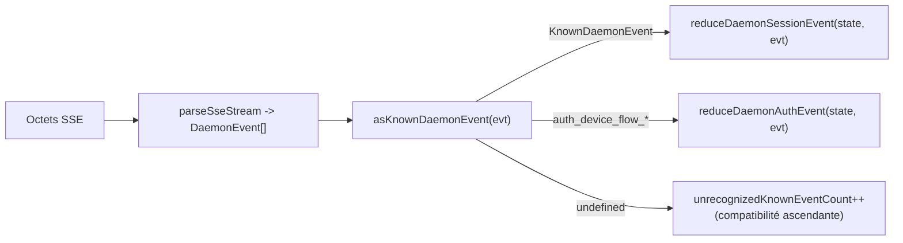

# Schéma d'événements typés du démon v1

## Vue d'ensemble

Chaque trame SSE émise par le démon sur `GET /session/:id/events` a la forme `{ id, v, type, data, originatorClientId?, _meta? }`. `v: 1` est la `EVENT_SCHEMA_VERSION` actuelle. `type` provient de l'ensemble fermé et épinglé par version `DAEMON_KNOWN_EVENT_TYPE_VALUES` dans `packages/sdk-typescript/src/daemon/events.ts`. Le champ d'enveloppe `_meta` est estampillé à la limite d'écriture SSE par `formatSseFrame()` dans `packages/cli/src/serve/routes/sse-events.ts` ; voir [Métadonnées au niveau de l'enveloppe](#envelope-level-metadata).

Le SDK expose `asKnownDaemonEvent(evt)`. Il retourne un `KnownDaemonEvent` discriminé pour les types d'événements connus et `undefined` pour les autres types. Les consommateurs du SDK peuvent ainsi gérer la compatibilité ascendante sans nécessiter une mise à jour du SDK au même rythme lorsqu'un démon plus récent ajoute un type d'événement ; le réducteur de session les enregistre sous `unrecognizedKnownEventCount`.

Le format de transmission se trouve dans [`../qwen-serve-protocol.md`](../qwen-serve-protocol.md). Cette page définit le contrat de charge utile pour chaque événement.

## Responsabilités

- Fournir la source unique de vérité pour le vocabulaire des événements (`DAEMON_KNOWN_EVENT_TYPE_VALUES`).
- Fournir une enveloppe typée pour chaque type d'événement (`DaemonEventEnvelope<TType, TData>`).
- Fournir des réducteurs purs (`reduceDaemonSessionEvent`, `reduceDaemonAuthEvent`) qui projettent un flux d'événements dans l'état de vue du SDK.
- Diffuser le tag de capacité `typed_event_schema` comme signal informatif. Si le tag est absent, `asKnownDaemonEvent` retombe tout de même sur `unknown`.

## Vocabulaire des événements

Regroupés par domaine.

### Session principale

| Type                         | Direction      | Déclencheur                                                                               | Champs clés de la charge utile                                                                                           |
| ---------------------------- | -------------- | ------------------------------------------------------------------------------------- | ------------------------------------------------------------------------------------------------------------ |
| `session_update`             | S->C           | Toute notification ACP `sessionUpdate` : texte de l'agent, réflexion, appel d'outil ou plan | `sessionUpdate: string, content?: ...` (forme ACP opaque)                                                    |
| `session_metadata_updated`   | S->C           | `PATCH /session/:id/metadata`                                                         | `sessionId, displayName?`                                                                                    |
| `session_died`               | S->C terminal  | `channel.exited`                                                                      | `sessionId, reason, exitCode? \| null, signalCode? \| null`                                                  |
| `session_closed`             | S->C terminal  | `DELETE /session/:id` ou fermeture programmatique                                           | `sessionId, reason: 'client_close' \| string, closedBy?`                                                     |
| `session_snapshot`           | S->C synthetic | Trame de snapshot après attachement / relecture SSE                                      | `sessionId, currentModelId: string \| null, currentApprovalMode: string \| null, recordingDegraded: boolean` |
| `session_recording_degraded` | S->C           | Le writer de transcription de session a définitivement arrêté après un échec d'écriture asynchrone | `sessionId, reason: 'write_failed'`                                                                          |

### Trames synthétiques au niveau de l'abonné

| Type                    | Déclencheur                                                                                                                                                                                                                              | Notes                                                                                                                                                                                                                                                                                                                          |
| ----------------------- | ------------------------------------------------------------------------------------------------------------------------------------------------------------------------------------------------------------------------------------ | ------------------------------------------------------------------------------------------------------------------------------------------------------------------------------------------------------------------------------------------------------------------------------------------------------------------------------ |
| `client_evicted`        | Débordement de la file d'attente EventBus par abonné. **Pas d'`id`**                                                                                                                                                                                  | `reason: 'queue_overflow' \| 'queue_bytes_overflow' \| string, droppedAfter?: number, queueSize?: number, maxQueued?: number, queuedBytes?: number, maxQueuedBytes?: number, eventBytes?: number` ; terminal uniquement pour l'abonné actuel, tandis que la session reste active.                                                  |
| `slow_client_warning`   | Arriéré de trames en direct ou arriéré d'octets sérialisés en direct >= 75 % ; poussé de force et **n'a pas d'`id`**                                                                                                                                          | `queueSize, maxQueued, lastEventId, queuedBytes?, maxQueuedBytes?, threshold?: 'frames' \| 'bytes' \| 'frames_and_bytes'` ; réarmé après que les mesures de trames et d'octets passent toutes deux sous les 37,5 %.                                                                                                                                   |
| `stream_error`          | `SubscriberLimitExceededError` ou une autre erreur de flux de route                                                                                                                                                                         | `error: string` ; terminal pour l'abonnement.                                                                                                                                                                                                                                                                                |
| `state_resync_required` | `subscribe({lastEventId})` détecte que l'anneau du démon ne contient plus `[lastEventId+1, earliestInRing-1]`, ou que le curseur du client provient d'une époque de bus précédente. Poussé de force **avant** les trames de relecture restantes et **n'a pas d'`id`**. | `reason: 'ring_evicted' \| 'epoch_reset' \| string`, `lastDeliveredId: number`, `earliestAvailableId: number`. Il s'agit d'un signal de récupération, non terminal : le flux SSE reste ouvert et la relecture + les trames en direct continuent. Le réducteur du SDK définit `awaitingResync = true` et ignore les deltas jusqu'à ce que l'appelant réinitialise avec `loadSession`. |
| `history_truncated`     | `POST /session/:id/load` renvoie un snapshot de relecture borné après que des entrées de relecture en mémoire plus anciennes ont été supprimées. Préfixé à `compactedReplay` et **n'a pas d'`id`**.                                                                    | `reason: 'replay_window_exceeded'`, `truncatedEvents: number`, `retainedEvents: number`, `maxBytes: number`, `truncatedTurns?: number`, `fullTranscriptAvailable: boolean`. Ceci est un marqueur de statut, pas une demande de resync ; les clients l'affichent et continuent à appliquer la relecture conservée.                                            |
| `replay_complete`       | Sentinelle sans `id` émise après la fin de la boucle de relecture `Last-Event-ID`, pour les chemins de relecture propre et d'éviction d'anneau, même lorsque `data.replayedCount === 0`. **Pas d'`id`**                                                             | `replayedCount: number` ; permet aux consommateurs de supprimer l'UI de rattrapage de manière déterministe sans délai d'attente.                                                                                                                                                                                                                                |

`fullTranscriptAvailable` est un flag de capacité booléen, pas un type littéral `true`. Les démons actuels émettent `true` lorsque `/session/:id/transcript` peut être utilisé pour paginer la transcription persistée ; les démons plus anciens ou contraints peuvent émettre `false`, et les clients doivent continuer à afficher la relecture bornée normalement.

### Permissions (F3 + base)

| Type                          | Direction | Déclencheur                                            | Champs clés de la charge utile                                                                                                                               |
| ----------------------------- | --------- | -------------------------------------------------- | ------------------------------------------------------------------------------------------------------------------------------------------------ |
| `permission_request`          | S->C      | L'agent appelle `requestPermission`                    | `requestId, sessionId, toolCall, options[]` ; l'enveloppe estampille `originatorClientId` depuis l'origine du prompt.                                |
| `permission_resolved`         | S->C      | Le médiateur a décidé                               | `requestId, outcome` (ACP `PermissionOutcome`)                                                                                                   |
| `permission_already_resolved` | S->C      | Le vote arrive après que la demande a déjà été décidée | `requestId, sessionId, outcome`                                                                                                                  |
| `permission_partial_vote`     | S->C      | La politique `consensus` enregistre un vote non final        | `requestId, sessionId, votesReceived, votesNeeded (>= 1), quorum, optionTallies: Record<string, number>, originatorClientId?`                    |
| `permission_forbidden`        | S->C      | La politique rejette un vote                              | `requestId, sessionId, clientId?, reason: 'designated_mismatch' \| 'remote_not_allowed', originatorClientId?` ; les votants anonymes omettent `clientId`. |

### Modèles

| Type                  | Direction | Charge utile                                      |
| --------------------- | --------- | -------------------------------------------- |
| `model_switched`      | S->C      | `sessionId, modelId`                         |
| `model_switch_failed` | S->C      | `sessionId, requestedModelId, error: string` |

### Garde-fous MCP (PR 14b + F2)

| Type                         | Direction | Charge utile                                                                                                                                                                                                                                                                                                                                                                                                                                           |
| ---------------------------- | --------- | ------------------------------------------------------------------------------------------------------------------------------------------------------------------------------------------------------------------------------------------------------------------------------------------------------------------------------------------------------------------------------------------------------------------------------------------------- |
| `mcp_budget_warning`         | S->C      | `liveCount, reservedCount, budget, thresholdRatio: 0.75, mode: 'warn' \| 'enforce', scope?: 'workspace' \| 'session'`                                                                                                                                                                                                                                                                                                                             |
| `mcp_child_refused_batch`    | S->C      | `refusedServers: [{ name, transport, reason: 'budget_exhausted' }], budget, liveCount, reservedCount, mode: 'enforce', scope?: 'workspace' \| 'session'`                                                                                                                                                                                                                                                                                          |
| `mcp_server_restarted`       | S->C      | `serverName, durationMs, entryIndex?` pour les redémarrages de pool multi-entrées F2                                                                                                                                                                                                                                                                                                                                                                            |
| `mcp_server_restart_refused` | S->C      | `serverName, reason: 'budget_would_exceed' \| 'in_flight' \| 'disabled' \| 'restart_failed', entryIndex?, details?`. La quatrième valeur, `restart_failed`, indique une panne matérielle sous-jacente pour le redémarrage multi-entrées en mode pool. `MCP_RESTART_REFUSED_REASONS` rejette les raisons inconnues ; un réducteur SDK plus ancien ignore silencieusement les nouvelles valeurs de raisons additives car `parseDaemonEvent` retourne `undefined`. Expédiez une nouvelle raison avec un SDK qui la connaît. |
### Contrôle des mutations (Wave 4 PR 16+17)

| Type                     | Direction | Payload                                                                                                                                        |
| ------------------------ | --------- | ---------------------------------------------------------------------------------------------------------------------------------------------- |
| `memory_changed`         | S->C      | Mémoire fichier : `scope: 'workspace' \| 'global', filePath, mode, bytesWritten` ; mémoire managée : `scope: 'managed', source, taskId, touchedScopes` |
| `agent_changed`          | S->C      | `change: 'created' \| 'updated' \| 'deleted', name, level: 'project' \| 'user'`                                                                |
| `approval_mode_changed`  | S->C      | `sessionId, previous, next, persisted: boolean`                                                                                                |
| `tool_toggled`           | S->C      | `toolName, enabled` ; affecte le prochain spawn d'enfant ACP et ne modifie pas les sessions déjà en cours d'exécution.                                            |
| `settings_changed`       | S->C      | L'écriture des paramètres du workspace est terminée. Le payload inclut `key` ; `value`, `scope` et `mutation` (skill-toggle) sont optionnels.                        |
| `settings_reloaded`      | S->C      | Le service workspace du daemon relit les paramètres. Le payload est ouvert.                                                                                     |
| `trust_change_requested` | S->C      | `workspaceCwd, desiredState: 'trusted' \| 'untrusted', reason?`                                                                                |
| `workspace_initialized`  | S->C      | `path, action: 'created' \| 'overwrote' \| 'noop', originatorClientId?`                                                                        |
| `github_setup_completed` | S->C      | `releaseTag, readmeUrl, secretsUrl?, workflows: [{path, status, sizeBytes?, error?}], gitignore: {path, status, added?, error?}`               |

`memory_changed` couvre également les tâches de mémoire managée sans session. Pour ces payloads, `scope` est `"managed"`, `source` est l'un des éléments suivants : `"workspace_memory_remember"`, `"workspace_memory_forget"` ou `"workspace_memory_dream"`, `taskId` est l'identifiant de la tâche en file d'attente, et `touchedScopes` liste les scopes de mémoire managée qui ont changé (`"user"` et/ou `"project"`). Aucun événement n'est émis lorsqu'une tâche remember/forget/dream se termine sans toucher la mémoire managée.

### Flux d'authentification par appareil (PR 21)

Ces événements sont indexés par workspace, et non par session. Le reducer de session les traite comme des no-ops ; `reduceDaemonAuthEvent` les projette dans l'état au niveau du workspace.

| Type                          | Direction | Payload                                               |
| ----------------------------- | --------- | ----------------------------------------------------- |
| `auth_device_flow_started`    | S->C      | `deviceFlowId, providerId, expiresAt`                 |
| `auth_device_flow_throttled`  | S->C      | `deviceFlowId, intervalMs`                            |
| `auth_device_flow_authorized` | S->C      | `deviceFlowId, providerId, expiresAt?, accountAlias?` |
| `auth_device_flow_failed`     | S->C      | `deviceFlowId, errorKind, hint?`                      |
| `auth_device_flow_cancelled`  | S->C      | `deviceFlowId`                                        |

### Mutation runtime MCP

| Type                 | Direction | Déclencheur                                                       | Champs de payload clés                                                           |
| -------------------- | --------- | ------------------------------------------------------------- | ---------------------------------------------------------------------------- |
| `mcp_server_added`   | S->C      | Serveur ajouté à l'exécution via `POST /workspace/mcp/servers` | `name, transport, replaced, shadowedSettings, toolCount, originatorClientId` |
| `mcp_server_removed` | S->C      | Serveur supprimé à l'exécution                                     | `name, wasShadowingSettings, originatorClientId`                             |

### Cycle de vie des extensions

| Type                 | Direction | Déclencheur                                                              | Champs de payload clés                                                                                                                               |
| -------------------- | --------- | -------------------------------------------------------------------- | ------------------------------------------------------------------------------------------------------------------------------------------------ |
| `extensions_changed` | S->C      | Travail d'installation/actualisation d'extension en arrière-plan terminé ou changement de statut | `refreshed, failed, status?: 'installed' \| 'enabled' \| 'disabled' \| 'updated' \| 'uninstalled' \| 'failed', source?, name?, version?, error?` |

### Injection de messages en cours de tour

| Type                        | Direction | Déclencheur                                                                                         | Champs de payload clés                                                                                                                 |
| --------------------------- | --------- | ----------------------------------------------------------------------------------------------- | ---------------------------------------------------------------------------------------------------------------------------------- |
| `mid_turn_message_injected` | S->C      | Le web-shell ou un client distant injecte des messages dans un tour en cours via `POST /session/:id/inject` | `sessionId, messages: string[], originatorClientId?` ; les consommateurs DOIVENT comparer `originatorClientId` à leur propre identifiant avant la déduplication. |

### Cycle de vie du tour / pushes de l'assistant

| Type                  | Direction | Déclencheur                                                                                                             | Champs de payload clés                                                                                                                                                                               |
| --------------------- | --------- | ------------------------------------------------------------------------------------------------------------------- | ------------------------------------------------------------------------------------------------------------------------------------------------------------------------------------------------ |
| `prompt_cancelled`    | S->C      | Le prompt est annulé via la route explicite `cancelSession` **ou** déconnexion SSE de l'origine                        | L'enveloppe ajoute `originatorClientId` pour le client qui annule. Cela signifie "annulation demandée", et non "annulation confirmée". Les abonnés pairs apprennent que le prompt est terminé.              |
| `turn_complete`       | S->C      | Un tour se termine avec succès                                                                                       | `sessionId, stopReason, promptId?, branchPoint?`. `promptId` fait le lien avec les réponses de prompt non bloquantes (`202`). Les tours éligibles terminés incluent `branchPoint: { assistantRecordUuid, checkpointUuid }`.         |
| `turn_error`          | S->C      | Un tour échoue                                                                                                       | `sessionId, message, code?, promptId?` ; même mécanisme de corrélation `promptId`.                                                                                                                   |
| `session_rewound`     | S->C      | `POST /session/:id/rewind` réussit                                                                                | `sessionId, promptId, targetTurnIndex, filesChanged[], filesFailed[], originatorClientId?`                                                                                                       |
| `session_branched`    | S->C      | Événement de compatibilité legacy ; le point de terminaison de branch actuel renvoie son résultat directement et ne publie pas cet événement | `sourceSessionId, newSessionId, displayName, originatorClientId?`. Les lecteurs conservent le support pour les anciens producteurs.                                                               |
| `followup_suggestion` | S->C      | L'enfant ACP génère des suggestions de suivi en ghost-text après `end_turn`, transmises via le SSE par session               | `sessionId, suggestion, promptId` ; le wire ne transporte que les suggestions dont `getFilterReason()===null`. Les clients les affichent sous forme de ghost-text en placeholder d'input et les invalident lors du prochain `sendPrompt`. |
| `user_shell_command`  | S->C      | L'utilisateur démarre une commande shell via `POST /session/:id/shell` ; diffusé aux autres abonnés de la même session | `sessionId, command, shellId, originatorClientId?`. Il n'y a pas encore d'interface typée `DaemonXxxData` ; `asKnownDaemonEvent` retourne `undefined` et le normalisateur d'UI l'analyse de manière ad hoc.            |
| `user_shell_result`   | S->C      | Résultat de la commande shell ci-dessus                                                                                   | `sessionId, shellId, exitCode, output, aborted`. Même note d'analyse ad hoc que pour `user_shell_command`.                                                                                               |

## Architecture

| Sujet                                | Source                                         | Notes                                                                                                              |
| -------------------------------------- | ---------------------------------------------- | ------------------------------------------------------------------------------------------------------------------ |
| `EVENT_SCHEMA_VERSION = 1`             | `packages/acp-bridge/src/eventBus.ts`          | Envoyé sur chaque frame.                                                                                               |
| `DAEMON_KNOWN_EVENT_TYPE_VALUES`       | `packages/sdk-typescript/src/daemon/events.ts` | Liste fermée avec 53 types.                                                                                         |
| `DaemonEventEnvelope<TType, TData>`    | `events.ts`                                    | Enveloppe générique.                                                                                                  |
| `DaemonKnownEventType`                 | `events.ts`                                    | `typeof DAEMON_KNOWN_EVENT_TYPE_VALUES[number]`.                                                                   |
| Types de payload par événement                | `events.ts`                                    | La plupart des types d'événements ont une interface `DaemonXxxData` ; `user_shell_*` est actuellement analysé de manière ad hoc par le normalisateur d'UI. |
| `asKnownDaemonEvent(evt)`              | `events.ts`                                    | Retourne `KnownDaemonEvent \| undefined`.                                                                           |
| `reduceDaemonSessionEvent(state, evt)` | `events.ts`                                    | Projette dans `DaemonSessionViewState`.                                                                            |
| `reduceDaemonAuthEvent(state, evt)`    | `events.ts`                                    | Projette dans `DaemonAuthState`.                                                                                   |
| `isWorkspaceScopedBudgetEvent(evt)`    | `events.ts`                                    | Détecte F2 `scope: 'workspace'`.                                                                                   |

### `DaemonSessionViewState`

`reduceDaemonSessionEvent` remplit cet état de vue. L'adaptateur CLI TUI, `DaemonChannelBridge` et l'IDE VS Code le consomment. Champs clés :

- `alive: boolean` - devient `false` après une frame terminale (`session_died`, `session_closed`, `client_evicted`, `stream_error`).
- `currentModelId?: string` - provenant de `model_switched`.
- `displayName?: string` - provenant de `session_metadata_updated`.
- `recordingDegraded: boolean` - état d'enregistrement de session sticky provenant de `session_recording_degraded` ; une valeur explicite `session_snapshot.recordingDegraded` est autoritaire.
- `pendingPermissions: Record<string, DaemonPermissionRequestData>` - requêtes ouvertes indexées par `requestId` ; vidées par `permission_resolved` / `permission_already_resolved`.
- `lastSessionUpdate?: DaemonSessionUpdateData` - dernier `session_update`.
- `lastModelSwitchFailure?: DaemonModelSwitchFailedData` - provenant de `model_switch_failed`.
- `terminalEvent?` - événement terminal brut.
- `streamError?: DaemonStreamErrorData` - dernier payload `stream_error`.
- `unrecognizedKnownEventCount`, `lastUnrecognizedKnownEvent?` - l'événement a été reconnu par `asKnownDaemonEvent` mais le reducer n'a pas encore d'état dédié pour celui-ci.
- `droppedPermissionRequestCount`, `lastDroppedPermissionRequestId?` - une requête de permission malformée n'a pas pu entrer dans la map pending.
- `unmatchedPermissionResolutionCount`, `lastUnmatchedPermissionResolutionId?` - la résolution de permission n'avait aucune requête pending correspondante.
- `slowClientWarningCount`, `lastSlowClientWarning?` - provenant de `slow_client_warning`.
- `mcpBudgetWarningCount`, `lastMcpBudgetWarning?` - provenant de `mcp_budget_warning`.
- `mcpChildRefusedBatchCount`, `lastMcpChildRefusedBatch?` - provenant de `mcp_child_refused_batch`.
- `lastWorkspaceMutation?`, `lastWorkspaceMutationType?` - provenant de `memory_changed` / `agent_changed`.
- `approvalMode?`, `approvalModeChangedCount`, `lastApprovalModeChange?` - provenant de `approval_mode_changed`.
- `toolToggleCount`, `lastToolToggle?` - provenant de `tool_toggled`.
- `workspaceInitCount`, `lastWorkspaceInit?` - provenant de `workspace_initialized`.
- `mcpRestartCount`, `lastMcpRestart?` - provenant de `mcp_server_restarted`.
- `mcpRestartRefusedCount`, `lastMcpRestartRefused?` - provenant de `mcp_server_restart_refused`.
- `settings_changed` / `settings_reloaded` - reconnus par `asKnownDaemonEvent` ; le reducer de session ne maintient pas de champs d'état de vue dédiés. Les événements `settings_changed` de skill-toggle portent des métadonnées `mutation` optionnelles pour que les hôtes puissent appliquer les changements uniquement liés aux skills de manière incrémentale au lieu de recharger la tâche. Les autres UI peuvent toujours traiter l'événement comme un signal d'actualisation.
- `permissionVoteProgress: Record<string, DaemonPermissionPartialVoteData>` - progression du vote par consensus.
- `forbiddenVotes: DaemonPermissionForbiddenData[]`, `forbiddenVoteCount` - enregistrements de votes rejetés par la politique, plafonnés à 32.
- `awaitingResync: boolean` - défini par `state_resync_required` ; vidé lorsque le consommateur réinitialise l'état de vue.
- `resyncRequiredCount`, `lastResyncRequired?` - observabilité de la resynchronisation.
- `lastFollowupSuggestion?: DaemonFollowupSuggestionData` - dernière suggestion de suivi poussée par le daemon.
- `lastTurnComplete?: DaemonTurnCompleteData` - dernière complétion de tour réussie.
- `lastTurnError?: DaemonTurnErrorData` - dernière erreur de tour.
- `rewindCount`, `lastRewind?`, `lastBranch?` - derniers événements rewind / branch.
### `DaemonAuthState`

Une entrée par `providerId`, pilotée par `auth_device_flow_*`. Chaque flux expose `{ deviceFlowId, status, providerId, expiresAt?, lastThrottleIntervalMs?, lastError? }`.

## Flux

### Côté producteur


```mermaid
flowchart LR
    A["Notification enfant ACP"] --> B["BridgeClient.sessionUpdate /<br/>BridgeClient.extNotification"]
    B --> C{"Mappé à un type d'événement ?"}
    C -->|oui| D["EventBus.publish({type, data, originatorClientId?})"]
    C -->|non| E["Pas d'émission (ignorer ou logger)"]
    D --> F["Assigner id + v=1, push vers le ring"]
    F --> G["Diffuser à tous les abonnés"]
```

### Côté consommateur (SDK)


```mermaid
flowchart LR
    A["Octets SSE"] --> B["parseSseStream -> DaemonEvent[]"]
    B --> C["asKnownDaemonEvent(evt)"]
    C -->|"KnownDaemonEvent"| D["reduceDaemonSessionEvent(state, evt)"]
    C -->|"auth_device_flow_*"| E["reduceDaemonAuthEvent(state, evt)"]
    C -->|"undefined"| F["unrecognizedKnownEventCount++<br/>(compatibilité ascendante)"]
```

## Métadonnées au niveau de l'enveloppe

Au-delà de la charge utile `data` de chaque événement, le démon ajoute deux champs au niveau de l'enveloppe.

### `_meta.serverTimestamp` - horloge du démon

`EventBus.publish()` dans `packages/acp-bridge/src/eventBus.ts` ajoute `_meta.serverTimestamp` lorsque l'événement entre dans le bus. Le type `BridgeEvent` inclut `_meta?: Record<string, unknown>`, ainsi les consommateurs internes du démon **voient bien** `_meta` sur chaque événement publié dans le bus. `formatSseFrame()` dans `packages/cli/src/serve/routes/sse-events.ts` fournit un timestamp de secours uniquement pour les trames synthétiques (par ex. `stream_error`) qui contournent `EventBus.publish`.

```jsonc
{
  "id": 47,
  "v": 1,
  "type": "session_update",
  "data": { ... },
  "_meta": { "serverTimestamp": 1716287345123 }
}
```

La fusion préserve toutes les clés `_meta` existantes de l'événement d'entrée
(`{...input._meta, serverTimestamp: Date.now()}`). Les producteurs peuvent attacher
des clés `_meta` supplémentaires au niveau de l'enveloppe ; `EventBus.publish` les fusionne avec le
timestamp au lieu de les écraser.

Pourquoi c'est important : les interfaces multi-clients qui affichent un temps relatif ou trient les blocs de transcription doivent utiliser l'heure du serveur au lieu de l'horloge locale de chaque navigateur/onglet/téléphone. L'horodatage par le serveur maintient un ordre cohérent entre les clients.

Accès SDK : préférez `event._meta?.serverTimestamp`. Les chemins de compatibilité peuvent aussi sonder `event.serverTimestamp` ou `event.data._meta.serverTimestamp`. Ne mélangez pas le `_meta` de la charge utile ACP `data._meta` avec le `_meta` de l'enveloppe du démon.

### `originatorClientId`

Les événements déclenchés par une requête portant un `X-Qwen-Client-Id` enregistré peuvent renseigner ce champ. Voir [`08-session-lifecycle.md`](./08-session-lifecycle.md).

## `_meta` des appels d'outils (provenance / serverId)

Ceci est distinct du `_meta` de l'enveloppe : les charges utiles ACP `session/update` peuvent porter leur propre `_meta` dans `event.data._meta`. `ToolCallEmitter` (`packages/cli/src/acp-integration/session/emitters/tool-call-emitter.ts`) ajoute deux champs lors de `emitStart`, `emitResult` et `emitError` :

| Champ        | Type                                      | Règle de résolution                                                                                                                                                            |
| ------------ | ----------------------------------------- | -------------------------------------------------------------------------------------------------------------------------------------------------------------------------- |
| `provenance` | `'builtin' \| 'mcp' \| 'subagent'`        | `ToolCallEmitter.resolveToolProvenance` : `subagentMeta` l'emporte avec `subagent` ; le nom de l'outil correspondant à `mcp__<server>__<tool>` est mappé à `mcp` ; tout le reste est mappé à `builtin`. |
| `serverId`   | `string` uniquement quand `provenance === 'mcp'` | Extrait de manière heuristique depuis `mcp__<serverId>__<tool>`.                                                                                                                    |

Le nom d'affichage existant `_meta.toolName` est conservé. L'interface utilisateur utilise ces champs pour afficher les badges builtin / serveur MCP / subagent sans avoir à reparser le nom de l'outil.

## Comportement du reducer SDK

`reduceDaemonSessionEvent(state, evt)` dans `packages/sdk-typescript/src/daemon/events.ts` projette le flux dans `DaemonSessionViewState`. Les champs liés à la resynchronisation sont :

- **`awaitingResync: boolean`** - défini par `state_resync_required` ; l'appelant le réinitialise, généralement après que `POST /session/:id/load` a réinitialisé l'état de la vue.
- **`resyncRequiredCount: number`** - compteur d'observabilité.
- **`lastResyncRequired?: DaemonStateResyncRequiredData`** - dernière charge utile.

Tant que `awaitingResync = true`, le reducer **ignore l'application des deltas** et n'autorise que l'ensemble fermé `RESYNC_PASSTHROUGH_TYPES` :

| Type transitant        | Pourquoi il est toujours appliqué pendant la resynchronisation                                          |
| ----------------------- | ------------------------------------------------------------------------------ |
| `state_resync_required` | Une seconde resynchronisation rare doit mettre à jour `lastResyncRequired` / `resyncRequiredCount`. |
| `session_died`          | Le signal de fin de flux doit rester visible pendant la resynchronisation.                      |
| `session_closed`        | Idem ci-dessus.                                                                 |
| `client_evicted`        | Idem ci-dessus.                                                                 |
| `stream_error`          | Idem ci-dessus.                                                                 |
| `session_snapshot`      | Trame faisant autorité pour l'état complet ; sûre à appliquer pendant la resynchronisation.                   |
| `session_recording_degraded` | Signal de sécurité sticky indépendant de l'état de delta de transcription.                    |

`lastEventId` continue d'avancer de manière monotone via `advanceLastEventId(base)` pendant la resynchronisation. Après que l'appelant a réinitialisé et effacé `awaitingResync`, les deltas suivants s'alignent sur le bon curseur.

`reduceDaemonAuthEvent` projette les événements de flux d'appareil (device-flow) dans des entrées d'état d'authentification au niveau du workspace, ayant conceptuellement la forme
`{deviceFlowId, status, providerId, expiresAt?, lastThrottleIntervalMs?, lastError?}`. Dans le code, le reducer stocke `status`, `errorKind`, `hint`,
`intervalMs`, `lastSeenEventId`, `authorizedExpiresAt` et `accountAlias` sur
`DaemonDeviceFlowReducerState` ; les charges utiles des événements du démon restent quant à elles conformes aux formes par événement listées ci-dessus.

## État et compatibilité ascendante

- Ajoutez un type d'événement connu en l'ajoutant à `DAEMON_KNOWN_EVENT_TYPE_VALUES`. Les anciens SDKs retournent `undefined` pour les types d'événements non reconnus via le chemin de secours et incrémentent `unrecognizedKnownEventCount` ; les nouveaux SDKs s'appuient sur l'union discriminée.
- L'ajout de champs optionnels à une charge utile existante est sûr car les charges utiles sont ouvertes (`{ [key: string]: unknown }`).
- Modifier la **forme** d'une charge utile existante est un changement cassant (breaking) et doit incrémenter `EVENT_SCHEMA_VERSION` ainsi qu'annoncer un tag de capacité compatible tel que `caps.features.typed_event_schema_v2`.
- `id` est monotone par session. Les trames synthétiques au niveau de l'abonné (`client_evicted`, `slow_client_warning`, `stream_error`, `state_resync_required`, `replay_complete`, `session_snapshot`) n'ont volontairement pas d'id afin que les autres abonnés ne voient pas de trous.
- `originatorClientId` se trouve sur l'enveloppe plutôt que dans `data`. Les charges utiles F3 partial-vote / forbidden le fusionnent également dans `data` via `mergeOriginator` afin que les consommateurs de l'état de la vue n'aient pas besoin de conserver l'enveloppe.

## Dépendances

- [`10-event-bus.md`](./10-event-bus.md) - canal de livraison.
- [`11-capabilities-versioning.md`](./11-capabilities-versioning.md) - comment les SDKs pré-vérifient `typed_event_schema`, `mcp_guardrail_events` et `permission_mediation`.
- [`04-permission-mediation.md`](./04-permission-mediation.md) - comment les événements de permission sont produits.
- [`13-sdk-daemon-client.md`](./13-sdk-daemon-client.md) - `asKnownDaemonEvent`, reducers et forme de l'état de la vue.

## Configuration

- Toujours annoncées : `typed_event_schema`, `mcp_guardrail_events` et `permission_mediation` (avec les modes de politique supportés).
- Aucune variable d'environnement ou flag ne contrôle directement le schéma lui-même. `QWEN_SERVE_NO_MCP_POOL=1` change le `scope` des événements MCP de `'workspace'` à absent ou `'session'`.

## Mises en garde et limites connues

- Six types de trames synthétiques n'ont volontairement pas d'`id` ; le code du SDK ne doit pas supposer que chaque événement a un id.
- `permission_partial_vote` n'apparaît que sous `consensus`. `permission_forbidden` apparaît sous `designated`, `consensus` et `local-only`, mais pas sous `first-responder`.
- `mcp_child_refused_batch` n'apparaît qu'en `mode: 'enforce'` ; le mode `warn` ne refuse jamais.
- Les événements `auth_device_flow_*` ne sont pas liés à une session. Lors de la consommation via `DaemonSessionClient`, utilisez `reduceDaemonAuthEvent` pour ceux-ci plutôt que le reducer de session.

## Références

- `packages/sdk-typescript/src/daemon/events.ts`
- `packages/acp-bridge/src/eventBus.ts` (`EVENT_SCHEMA_VERSION`)
- `packages/cli/src/serve/capabilities.ts` (`typed_event_schema`, `mcp_guardrail_events`, `permission_mediation`)
- Référence wire : [`../qwen-serve-protocol.md`](../qwen-serve-protocol.md)