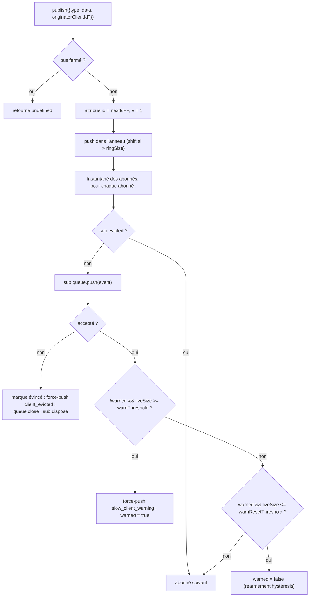

# SSE Event Bus & Backpressure

## Vue d’ensemble

`EventBus` (`packages/acp-bridge/src/eventBus.ts`) est le pub/sub en mémoire par session qui alimente la route SSE `GET /session/:id/events` du démon. Il attribue à chaque événement un identifiant monotone, met en mémoire tampon les événements récents dans un anneau borné pour la relecture via `Last-Event-ID`, diffuse les événements publiés à tous les abonnés, applique une contre-pression par abonné (avertissement à 75 % de remplissage de la file, éviction à la limite), et émet deux trames terminales synthétiques (`client_evicted`, `slow_client_warning`) que le SDK traite comme des événements de première classe, mais que le bus marque **sans `id`** afin qu’elles ne consomment pas de créneau dans la séquence par session.

Actuellement, `EventBus` est privé au package `acp-bridge` et est consommé par la fabrique du bridge via une instance fermée par session. Une future refactorisation (signalée aux lignes 150–159 de `eventBus.ts`) l’élèvera au rang de brique de base de sorte que les canaux, les sorties doubles et les futurs transports WebSocket puissent s’abonner via le même bus au lieu d’exécuter des flux parallèles.

## Responsabilités

- Attribuer des identifiants d’événements monotones par session en commençant à 1.
- Mettre en mémoire tampon les derniers événements `ringSize` pour la relecture lors d’un abonnement avec `lastEventId`.
- Diffuser les événements publiés à ≤ `maxSubscribers` abonnés simultanés.
- Appliquer des files bornées par abonné ; supprimer les abonnés qui débordent avec une trame terminale synthétique `client_evicted`.
- Émettre `slow_client_warning` une fois par épisode de débordement à 75 % de remplissage de la file, avec une hystérésis de 37,5 % pour éviter des avertissements répétés.
- Résilier rapidement les abonnements sur `AbortSignal.abort()`.
- Fermer proprement chaque abonné à la fermeture du bus (par exemple, lors du démantèlement de session).
- Ne jamais lever d’exception depuis `publish` (le contrat est « publish est toujours sûr à appeler »).

## Architecture

| Constante                               | Valeur      | Objectif                                                                                          |
| --------------------------------------- | ----------- | ------------------------------------------------------------------------------------------------- |
| `EVENT_SCHEMA_VERSION`                  | `1`         | Apposée sur chaque `BridgeEvent.v` ; incrémentée lors de changements cassants de trame.           |
| `DEFAULT_RING_SIZE`                     | `8000`      | Anneau de relecture par session. Surcharge opérateur via `--event-ring-size`.                     |
| `DEFAULT_MAX_QUEUED`                    | `256`       | Limite d’accumulation par abonné.                                                                 |
| `DEFAULT_MAX_SUBSCRIBERS`               | `64`        | Limite d’abonnés par session.                                                                     |
| `WARN_THRESHOLD_RATIO`                  | `0,75`      | Fraction de `maxQueued` déclenchant `slow_client_warning`.                                        |
| `WARN_RESET_RATIO`                      | `0,375`     | Fraction de réarmement de l’hystérésis.                                                           |
| `MAX_EVENT_RING_SIZE` (dans `bridge.ts`) | `1_000_000` | Limite supérieure souple sur `BridgeOptions.eventRingSize` pour détecter les défaillances mémoire hors limites dues à des fautes de frappe. |

### `BridgeEvent`

```ts
interface BridgeEvent {
  id?: number; // monotone par session ; absent sur les trames terminales synthétiques
  v: 1; // EVENT_SCHEMA_VERSION
  type: string; // un des 43 types connus ou futur-extensible
  data: unknown; // payload (typé par type par le SDK ; voir 09-event-schema.md)
  originatorClientId?: string; // défini quand l’événement dérive d’une requête estampillée clientId
}
```

### `SubscribeOptions`

```ts
interface SubscribeOptions {
  lastEventId?: number; // relecture à partir d’après cet id (reprise Last-Event-ID)
  signal?: AbortSignal; // interrompt l’abonnement rapidement
  maxQueued?: number; // limite d’accumulation par abonné ; défaut 256
}
```

`subscribe()` retourne un `AsyncIterable<BridgeEvent>`. La route SSE le consomme avec `for await`. L’enregistrement est **synchrone** — au moment où `subscribe()` retourne, l’abonné est déjà attaché, donc un `publish()` qui entre en concurrence avec le premier `next()` du consommateur est tout de même délivré.

### `BoundedAsyncQueue`

La file par abonné. Deux comportements essentiels :

- **La limite en direct ne s’applique qu’aux éléments en direct.** Les éléments insérés via `forcePush()` portent une étiquette `forced: true` par entrée et ne comptent jamais dans `maxSize`. Cela permet au chemin de relecture `Last-Event-ID` de forcer l’insertion de centaines de trames historiques dans un nouvel abonné sans déclencher immédiatement la limite en direct et évincer l’abonné qui vient de reprendre.
- **`liveCount` est maintenu comme champ**, non dérivé de la position `forcedInBuf`. L’heuristique basée sur la position précédente a cassé quand `slow_client_warning` a commencé à faire des force-push en milieu de flux (les avertissements vont à la FIN de la file, pas au début comme les relectures). Les étiquettes `forced` par entrée sont indépendantes de la position.

`push(value)` retourne `false` (au lieu de bloquer ou de lever une exception) quand l’accumulation en direct a atteint la limite — le bus utilise ce signal pour évincer l’abonné. `forcePush(value)` contourne la limite. `close({drain?: boolean})` vide les éléments en attente par défaut ; le chemin d’annulation passe `drain: false` pour les supprimer immédiatement.

## Flux de travail

### Publication



`publish` ne lève jamais d’exception. La fermeture du bus en cours de publication (le chemin d’arrêt ferme les bus par session avant d’attendre `channel.kill()`) retourne `undefined` plutôt que de lever car l’agent peut encore émettre des notifications `sessionUpdate` dans la petite fenêtre entre la fermeture du bus et l’arrêt du canal.

### Abonnement + relecture (avec détection d’éviction par anneau)

```mermaid
sequenceDiagram
    autonumber
    participant SR as route SSE
    participant EB as EventBus
    participant Q as BoundedAsyncQueue

    SR->>EB: subscribe({lastEventId: 42, maxQueued: 256, signal})
    EB->>EB: refuser si subs.size >= maxSubscribers<br/>(lève SubscriberLimitExceededError)
    EB->>Q: new BoundedAsyncQueue(256)
    EB->>EB: subs.add(sub)
    EB->>EB: epochReset = lastEventId >= nextId
    alt epochReset (ancienne époque de bus)
        EB->>Q: forcePush state_resync_required<br/>{ reason: 'epoch_reset', lastDeliveredId: 42, earliestAvailableId: ring[0]?.id ?? nextId }
        Note over EB,Q: trame sans id, va AVANT la relecture.<br/>La relecture parcourt tout l’anneau actuel.
    else même époque de bus
        EB->>EB: earliestInRing = ring[0]?.id
        opt earliestInRing > lastEventId + 1 (écart évincé)
            EB->>Q: forcePush state_resync_required<br/>{ reason: 'ring_evicted', lastDeliveredId: 42, earliestAvailableId: earliestInRing }
            Note over EB,Q: trame sans id, va AVANT la relecture.<br/>Le flux reste ouvert ; le réducteur SDK bascule awaitingResync.
        end
    end
    loop parcours de l’anneau
        EB->>EB: pour e dans ring où e.id > (epochReset ? 0 : 42)
        EB->>Q: forcePush(e)
    end
    EB->>EB: attache écouteur AbortSignal<br/>(onAbort → queue.close({drain:false}) ; dispose)
    EB-->>SR: AsyncIterable
    SR->>Q: next() dans la boucle for-await
```

Si `subs.size >= maxSubscribers` au moment de l’abonnement, `SubscriberLimitExceededError` est levée — la route SSE l’attrape et sérialise une trame synthétique `stream_error` au client rejeté afin qu’il ne voie pas un flux vide silencieux. Retourner un itérable vide laisserait les opérateurs sans visibilité sur le fait que « certains clients reçoivent des événements, d’autres non » en charge.

### Éviction par anneau → `state_resync_required` (le flux de récupération)

Quand un consommateur se reconnecte avec `Last-Event-ID: N` et que le plus ancien événement survivant de l’anneau a `id > N + 1`, les événements dans `[N+1, earliestInRing-1]` ont été évincés avant la reconnexion du consommateur. La relecture naïve réussirait silencieusement avec un suffixe non contigu, le réducteur SDK continuerait d’appliquer les deltas comme si le flux était contigu, et son état divergerait de la vérité du démon — sans signal terminal.

Implémenté dans `EventBus.subscribe()` :

1. D’abord vérifier `opts.lastEventId >= this.nextId`. Si vrai, le curseur du client provient d’une époque de bus plus ancienne (redémarrage du démon / reconstruction d’EventBus), donc le bus émet `reason: 'epoch_reset'` et rejoue tout l’anneau actuel.
2. Sinon calculer `earliestInRing = this.ring[0]?.id`.
3. Si `earliestInRing > opts.lastEventId + 1`, forcer l’insertion d’une trame synthétique **avant** les trames de relecture :
   ```jsonc
   {
     "v": 1,
     "type": "state_resync_required",
     "data": {
       "reason": "ring_evicted",
       "lastDeliveredId": <opts.lastEventId>,
       "earliestAvailableId": <earliestInRing>
     }
   }
   ```
4. Continuer la boucle de relecture normale ensuite.

Contrats critiques (et ce que la revue #4360 a corrigé) :

- **Pas d’`id`** — même motif sans créneau que `client_evicted`, donc elle n’occupe pas de créneau dans la séquence monotone par session observée par les autres abonnés.
- **Le flux reste ouvert** — contrairement à `client_evicted` (vraiment terminal), `state_resync_required` est orienté récupération. Les trames de relecture et en direct continuent de circuler après.
- **Le réducteur ignore automatiquement les deltas** — le côté SDK bascule `awaitingResync = true` et n’applique que `state_resync_required`, les trames terminales et les instantanés d’état complet jusqu’à ce que le code consommateur appelle `loadSession` et efface le drapeau. Voir [`09-event-schema.md`](./09-event-schema.md) pour `RESYNC_PASSTHROUGH_TYPES`.
- **Respectueux du réseau** — les trames restent sur le fil afin que le SDK puisse calculer un diff « ce que vous avez manqué » plus tard s’il le souhaite. Aucun cycle de reconnexion supplémentaire nécessaire.

### Flux terminal d’éviction

Quand l’accumulation en direct d’un abonné a atteint `maxQueued` et que le prochain `push()` retourne `false` :

1. Marquer `sub.evicted = true`.
2. Construire la trame `client_evicted` **sans `id`** — `{ v: 1, type: 'client_evicted', data: { reason: 'queue_overflow', droppedAfter: <dernier id délivré> } }`.
3. `queue.forcePush(evictionFrame)` pour que l’itérateur du consommateur voie une trame terminale.
4. `queue.close()` pour que l’itération se termine après la trame terminale.
5. Appeler `sub.dispose()` — supprime de `subs` et détache l’écouteur `AbortSignal` ; sans ce nettoyage, les fermetures de consommateurs bloqués restent actives jusqu’au garbage collection de `AbortSignal`.

### Flux d’annulation

`AbortSignal.abort()` → `onAbort()` :

1. `queue.close({drain: false})` — supprime les éléments en mémoire tampon pour que la route SSE ne continue pas à sérialiser des événements vers un socket que personne n’écoute.
2. `dispose()` — idempotent grâce à un drapeau `disposed`.

Les signaux déjà annulés au moment de l’abonnement appellent `onAbort()` de manière synchrone avant de retourner l’itérateur.

## État & Cycle de vie

- `nextId` commence à 1 et ne fait qu’augmenter. L’accesseur `lastEventId` retourne `nextId - 1`.
- `ring` est borné ; l’éviction par décalage est en O(n) une fois plein. Avec `ringSize=8000`, cela se mesure en quelques millisecondes sur des sessions à fort volume — bien en dessous du budget de latence par trame. Une refactorisation en tampon circulaire est différée jusqu’à ce que le profilage la signale ou que les opérateurs augmentent `--event-ring-size` d’un ordre de grandeur.
- `close()` bascule `closed`, ferme la file de chaque abonné et vide `subs`. Les `publish()` / `subscribe()` ultérieurs sont sans effet (`publish` retourne undefined ; `subscribe` retourne `emptyAsyncIterable`).
- Chaque session possède un `EventBus`. La fermeture du bus a lieu avant `channel.kill()` afin que les publications en vol pendant l’arrêt retournent undefined plutôt que de lever.

## Dépendances

- Consommé par `packages/acp-bridge/src/bridge.ts` (`BridgeClient.sessionUpdate` / `BridgeClient.extNotification` → `events.publish(...)`).
- Consommé par `packages/cli/src/serve/server.ts` (gestionnaire de route SSE → `events.subscribe(...)` puis formate `BridgeEvent` en trames SSE sur le fil).
- Réexportation : `packages/cli/src/serve/event-bus.ts` → `@qwen-code/acp-bridge/eventBus`.
- Consommateur SDK : `packages/sdk-typescript/src/daemon/sse.ts` (`parseSseStream`), puis `asKnownDaemonEvent` (voir [`09-event-schema.md`](./09-event-schema.md), [`13-sdk-daemon-client.md`](./13-sdk-daemon-client.md)).

## Configuration

- `--event-ring-size <n>` — profondeur de l’anneau par session ; limite supérieure souple à `MAX_EVENT_RING_SIZE = 1_000_000`.
- Paramètre de requête abonné `?maxQueued=N` sur `GET /session/:id/events`, plage `[16, 2048]`. Les clients SDK effectuent un pré-vol `caps.features.slow_client_warning` avant d’opter.
- `BridgeOptions.eventRingSize` (remplace la valeur par défaut du démon pour une utilisation embarquée).
- Étiquettes de capacité : `session_events`, `slow_client_warning`, `typed_event_schema`.

## Mises en garde & Limites connues

- **Les trames synthétiques n’ont pas d’`id`.** Les consommateurs SDK utilisant la reprise `Last-Event-ID` n’enregistrent que les trames avec id ; `slow_client_warning`, `client_evicted`, `state_resync_required` et `replay_complete` n’avancent pas le curseur et ne consomment pas de numéros de séquence par session. Si deux trames en direct avec id présentent un écart réel, gérez-le via le chemin de resynchronisation par éviction d’anneau / réinitialisation d’époque plutôt que de le traiter comme une trame synthétique privée.
- `client_evicted` est **par abonné**, pas par session. Le même client peut se reconnecter.
- L’itérateur `BoundedAsyncQueue` **n’est pas sûr pour des pilotes concurrents** — deux appels `.next()` simultanés entreraient en concurrence pour le même événement. L’utilisation du démon est séquentielle (`for await ... of` dans le gestionnaire de route SSE), donc c’est sûr en production.
- Le bus est actuellement privé au package ; les canaux et l’interface web doivent s’abonner via la route HTTP SSE du démon, pas en accédant directement au bus. L’étape 1.5 élèvera cela.

## Références

- `packages/acp-bridge/src/eventBus.ts` (fichier entier)
- `packages/acp-bridge/src/bridge.ts` (sites de publication, notamment `BridgeClient.sessionUpdate` et les événements de permission F3)
- `packages/cli/src/serve/server.ts` (gestionnaire de route SSE — formate `BridgeEvent` en SSE sur le fil)
- `packages/sdk-typescript/src/daemon/sse.ts` (analyseur SSE côté client)
- Référence fil : [`../qwen-serve-protocol.md`](../qwen-serve-protocol.md) (le contrat de reconnexion `Last-Event-ID`).