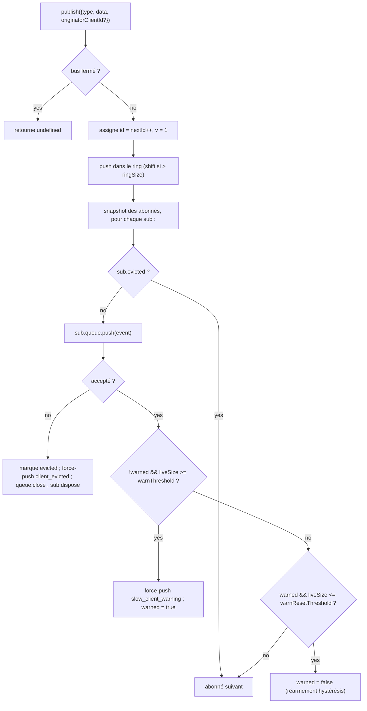

# SSE Event Bus et Backpressure

## Vue d'ensemble

`EventBus` (`packages/acp-bridge/src/eventBus.ts`) est le pub/sub en mémoire par session qui alimente la route SSE `GET /session/:id/events` du daemon. Il attribue à chaque événement un id monotone, met en buffer les événements récents dans un ring borné pour la relecture `Last-Event-ID`, diffuse les événements publiés à tous les abonnés, applique une backpressure par abonné (avertissement à 75 % de remplissage de la file, éviction à la limite), et émet deux frames terminaux synthétiques (`client_evicted`, `slow_client_warning`) que le SDK traite comme des événements de premier ordre, mais que le bus marque **sans `id`** afin qu'ils ne consomment pas de slot dans la séquence par session.

`EventBus` est actuellement privé au package `acp-bridge` et consommé par la factory du bridge via une instance fermée par session. Une refactorisation future (mentionnée aux lignes 150-159 de `eventBus.ts`) le promouvra en bloc de construction de premier niveau afin que les canaux, la double sortie et les futurs transports WebSocket puissent s'abonner via le même bus au lieu d'exécuter des flux parallèles.

## Responsabilités

- Attribuer des ids d'événements monotones par session, en commençant à 1.
- Mettre en buffer les `ringSize` derniers événements pour la relecture lors d'un abonnement avec `lastEventId`.
- Diffuser les événements publiés à ≤ `maxSubscribers` abonnés simultanés.
- Appliquer des files bornées par abonné ; exclure les abonnés en débordement avec une frame terminal synthétique `client_evicted`.
- Émettre `slow_client_warning` une fois par épisode de débordement à 75 % de remplissage de la file, avec une hystérésis de 37,5 % pour éviter les avertissements répétés.
- Détruire rapidement les abonnements lors de `AbortSignal.abort()`.
- Fermer proprement chaque abonné à la fermeture du bus (ex. démontage de session).
- Ne jamais lever d'exception depuis `publish` (le contrat est "publish est toujours sûr à appeler").

## Architecture

| Constante                              | Valeur      | Objectif                                                                                           |
| -------------------------------------- | ----------- | -------------------------------------------------------------------------------------------------- |
| `EVENT_SCHEMA_VERSION`                 | `1`         | Horodaté sur chaque `BridgeEvent.v` ; incrémenté lors de changements de frame cassant la compatibilité. |
| `DEFAULT_RING_SIZE`                    | `8000`      | Ring de relecture par session. Override opérateur via `--event-ring-size`.                         |
| `DEFAULT_MAX_QUEUED`                   | `256`       | Limite de backlog par abonné.                                                                      |
| `DEFAULT_MAX_SUBSCRIBERS`              | `64`        | Limite d'abonnés par session.                                                                      |
| `WARN_THRESHOLD_RATIO`                 | `0.75`      | Fraction de déclenchement de `slow_client_warning` par rapport à `maxQueued`.                      |
| `WARN_RESET_RATIO`                     | `0.375`     | Fraction de réarmement de l'hystérésis.                                                            |
| `MAX_EVENT_RING_SIZE` (dans `bridge.ts`) | `1_000_000` | Limite supérieure souple pour `BridgeOptions.eventRingSize` afin de détecter les erreurs de mémoire morte causées par des fautes de frappe. |

### `BridgeEvent`

```ts
interface BridgeEvent {
  id?: number; // monotone par session ; absent sur les frames terminaux synthétiques
  v: 1; // EVENT_SCHEMA_VERSION
  type: string; // l'un des 47 types connus ou extensible à l'avenir
  data: unknown; // payload (typé par type par le SDK ; voir 09-event-schema.md)
  _meta?: { serverTimestamp?: number; [key: string]: unknown }; // horodaté par EventBus.publish
  originatorClientId?: string; // défini lorsque l'événement dérive d'une requête horodatée par clientId
}
```

### `SubscribeOptions`

```ts
interface SubscribeOptions {
  lastEventId?: number; // relecture à partir de cet id (reprise Last-Event-ID)
  signal?: AbortSignal; // annule l'abonnement rapidement
  maxQueued?: number; // limite de backlog par abonné ; défaut 256
}
```

`subscribe()` retourne un `AsyncIterable<BridgeEvent>`. La route SSE le consomme avec `for await`. L'enregistrement est **synchrone** — au moment où `subscribe()` retourne, l'abonné est déjà attaché, donc un `publish()` qui entre en compétition avec le premier `next()` du consommateur est tout de même délivré.

### `BoundedAsyncQueue`

La file par abonné. Deux comportements clés :

- **La limite s'applique uniquement aux éléments actifs.** Les éléments insérés via `forcePush()` portent un tag `forced: true` par entrée et ne comptent jamais dans `maxSize`. Cela permet au chemin de relecture `Last-Event-ID` de forcer l'insertion de centaines de frames historiques dans un nouvel abonné sans déclencher immédiatement la limite active et évincer l'abonné qui vient de reprendre.
- **`liveCount` est maintenu comme un champ**, et non dérivé de la position `forcedInBuf`. L'ancienne heuristique basée sur la position cassait lorsque `slow_client_warning` a commencé à forcer l'insertion en milieu de flux (les avertissements vont à la FIN de la file, pas au début comme les relectures). Les tags `forced` par entrée sont indépendants de la position.

`push(value)` retourne `false` (au lieu de bloquer ou de lever une exception) lorsque le backlog actif est à la limite — le bus utilise ce signal pour évincer l'abonné. `forcePush(value)` contourne la limite. `close({drain?: boolean})` vide les éléments en attente par défaut ; le chemin d'annulation passe `drain: false` pour les supprimer immédiatement.

## Workflow

### Publication



`publish` ne lève jamais d'exception. Fermer le bus en plein publish (le chemin d'arrêt ferme les bus par session avant d'attendre `channel.kill()`) retourne `undefined` au lieu de lever une exception, car l'agent peut encore émettre des notifications `sessionUpdate` dans la petite fenêtre entre la fermeture du bus et le kill du canal.

### Abonnement + relecture (avec détection d'éviction du ring)

```mermaid
sequenceDiagram
    autonumber
    participant SR as Route SSE
    participant EB as EventBus
    participant Q as BoundedAsyncQueue

    SR->>EB: subscribe({lastEventId: 42, maxQueued: 256, signal})
    EB->>EB: refuse si subs.size >= maxSubscribers<br/>(lève SubscriberLimitExceededError)
    EB->>Q: new BoundedAsyncQueue(256)
    EB->>EB: subs.add(sub)
    EB->>EB: epochReset = lastEventId >= nextId
    alt epochReset (ancienne epoch du bus)
        EB->>Q: forcePush state_resync_required<br/>{ reason: 'epoch_reset', lastDeliveredId: 42, earliestAvailableId: ring[0]?.id ?? nextId }
        Note over EB,Q: synthétique sans id, la frame passe AVANT la relecture.<br/>La relecture scanne tout le ring actuel.
    else même epoch du bus
        EB->>EB: earliestInRing = ring[0]?.id
        opt earliestInRing > lastEventId + 1 (écart évincé)
            EB->>Q: forcePush state_resync_required<br/>{ reason: 'ring_evicted', lastDeliveredId: 42, earliestAvailableId: earliestInRing }
            Note over EB,Q: synthétique sans id, la frame passe AVANT la relecture.<br/>Le stream reste ouvert ; le reducer SDK bascule awaitingResync.
        end
    end
    loop scan du ring
        EB->>EB: for e in ring where e.id > (epochReset ? 0 : 42)
        EB->>Q: forcePush(e)
    end
    EB->>EB: attache l'écouteur AbortSignal<br/>(onAbort → queue.close({drain:false}); dispose)
    EB-->>SR: AsyncIterable
    SR->>Q: next() dans la boucle for-await
```

Si `subs.size >= maxSubscribers` au moment de l'abonnement, `SubscriberLimitExceededError` est levée — la route SSE l'attrape et sérialise une frame synthétique `stream_error` vers le client rejeté afin qu'il ne voie pas un stream vide silencieux. Retourner un itérable vide à la place priverait les opérateurs de visibilité sur "certains clients reçoivent des événements, d'autres non" sous charge.

### Éviction du ring → `state_resync_required` (le flux de récupération)

Lorsqu'un consommateur se reconnecte avec `Last-Event-ID: N` et que le premier événement survivant du ring a `id > N + 1`, les événements dans `[N+1, earliestInRing-1]` ont été évincés avant que le consommateur ne se reconnecte. Une relecture naïve réussirait silencieusement avec un suffixe non contigu, le reducer SDK continuerait à appliquer les deltas comme si le stream était contigu, et son état divergerait de la vérité du daemon — sans signal terminal.

Implémenté dans `EventBus.subscribe()` :

1. Vérifie d'abord `opts.lastEventId >= this.nextId`. Si vrai, le curseur du client provient d'une ancienne epoch du bus (redémarrage du daemon / reconstruction de l'EventBus), donc le bus émet `reason: 'epoch_reset'` et relit tout le ring actuel.
2. Sinon, calcule `earliestInRing = this.ring[0]?.id`.
3. Si `earliestInRing > opts.lastEventId + 1`, force l'insertion d'une frame synthétique **avant** les frames de relecture :
   ```jsonc
   {
     "v": 1,
     "type": "state_resync_required",
     "data": {
       "reason": "ring_evicted",
       "lastDeliveredId": <opts.lastEventId>,
       "earliestAvailableId": <earliestInRing>
     }
   }
   ```
4. Continue la boucle de relecture normale ensuite.

Contrats critiques (et ce que la review #4360 a corrigé) :

- **Pas d'`id`** — même modèle sans slot que `client_evicted`, afin qu'il n'occupe pas de slot dans la séquence monotone par session observée par les autres abonnés.
- **Le stream reste ouvert** — contrairement à `client_evicted` (véritablement terminal), `state_resync_required` est orienté récupération. La relecture + les frames en direct continuent de circuler ensuite.
- **Le reducer saute automatiquement les deltas** — côté SDK, il bascule `awaitingResync = true` et applique uniquement `state_resync_required`, les frames terminaux et les snapshots d'état complet jusqu'à ce que le code consommateur appelle `loadSession` et efface le flag. Voir [`09-event-schema.md`](./09-event-schema.md) pour `RESYNC_PASSTHROUGH_TYPES`.
- **Optimisé pour le réseau** — les frames restent sur le fil pour que le SDK puisse calculer un diff "ce que vous avez manqué" plus tard s'il le souhaite. Aucun cycle de reconnexion supplémentaire n'est requis.

### Flux terminal d'éviction

Lorsque le backlog actif d'un abonné est à `maxQueued` et que le prochain `push()` retourne `false` :

1. Marque `sub.evicted = true`.
2. Construit la frame `client_evicted` **sans `id`** — `{ v: 1, type: 'client_evicted', data: { reason: 'queue_overflow', droppedAfter: <last delivered id> } }`.
3. `queue.forcePush(evictionFrame)` pour que l'itérateur du consommateur voie une frame terminal.
4. `queue.close()` pour que l'itération se déroule après la frame terminal.
5. Appelle `sub.dispose()` — retire de `subs` et détache l'écouteur `AbortSignal` ; sans ce nettoyage, les fermetures des consommateurs bloqués restent actives jusqu'au garbage collection de l'`AbortSignal`.

### Flux d'annulation

`AbortSignal.abort()` → `onAbort()` :

1. `queue.close({drain: false})` — supprime les éléments en buffer pour que la route SSE ne continue pas à sérialiser des événements vers un socket que personne n'écoute.
2. `dispose()` — idempotent via un flag `disposed`.

Les signaux déjà annulés au moment de l'abonnement appellent `onAbort()` de manière synchrone avant de retourner l'itérateur.

## État et Cycle de vie

- `nextId` commence à 1 et ne fait qu'incrémenter. Le getter `lastEventId` retourne `nextId - 1`.
- `ring` est borné ; l'éviction par shift est O(n) une fois plein. À `ringSize=8000`, cela se mesure en quelques millisecondes sur les sessions à fort volume — bien en dessous du budget de latence par frame. Une refactorisation en buffer circulaire est reportée jusqu'à ce que le profiling la signale ou que les opérateurs augmentent `--event-ring-size` d'un ordre de grandeur.
- `close()` bascule `closed`, ferme la file de chaque abonné et vide `subs`. Les `publish()` / `subscribe()` suivants sont des no-ops (`publish` retourne undefined ; `subscribe` retourne `emptyAsyncIterable`).
- Chaque session possède un `EventBus`. La fermeture du bus se produit avant `channel.kill()` afin que les publications en cours lors de l'arrêt retournent undefined au lieu de lever une exception.

## Dépendances

- Consommé par `packages/acp-bridge/src/bridge.ts` (`BridgeClient.sessionUpdate` / `BridgeClient.extNotification` → `events.publish(...)`).
- Consommé par `packages/cli/src/serve/routes/sse-events.ts` (gestionnaire de route SSE → `events.subscribe(...)` puis formate `BridgeEvent` en frames fil SSE).
- Les consommateurs CLI importent le bus d'événements directement depuis `@qwen-code/acp-bridge/eventBus`.
- Consommateur SDK : `packages/sdk-typescript/src/daemon/sse.ts` (`parseSseStream`), puis `asKnownDaemonEvent` (voir [`09-event-schema.md`](./09-event-schema.md), [`13-sdk-daemon-client.md`](./13-sdk-daemon-client.md)).

## Configuration

- `--event-ring-size <n>` — profondeur du ring par session ; limite souple à `MAX_EVENT_RING_SIZE = 1_000_000`.
- Paramètre de requête `?maxQueued=N` de l'abonné sur `GET /session/:id/events`, plage `[16, 2048]`. Les clients SDK pré-vérifient `caps.features.slow_client_warning` avant d'opter.
- `BridgeOptions.eventRingSize` (override le défaut du daemon pour une utilisation embarquée).
- Tags de capacité : `session_events`, `slow_client_warning`, `typed_event_schema`.

## Intégration Client : Reconnexion `Last-Event-ID`

### Format sur le fil

Chaque frame SSE portant un id émise par `GET /session/:id/events` inclut une ligne `id:` :

```
id: 42
event: session_update
data: {"id":42,"v":1,"type":"session_update","data":{...},"_meta":{"serverTimestamp":1719000000000}}

```

Les frames synthétiques/terminaux (`state_resync_required`, `replay_complete`, `client_evicted`, `slow_client_warning`, `stream_error`) sont émis **sans** ligne `id:` — ils ne font pas avancer la séquence monotone par session.

### Protocole de reconnexion

Lorsqu'un client se reconnecte après une déconnexion, il envoie le dernier id d'événement reçu avec succès comme en-tête HTTP `Last-Event-ID` :

```
GET /session/:id/events HTTP/1.1
Last-Event-ID: 42
Accept: text/event-stream
```

L'`EventBus` du daemon relit tous les événements du ring buffer dont l'`id > Last-Event-ID`, puis passe à la livraison en direct. Une frame synthétique `replay_complete` marque la limite entre la relecture et le direct :

```jsonc
// pas de ligne id: — synthétique
{
  "v": 1,
  "type": "replay_complete",
  "data": { "replayedCount": 7, "lastReplayedEventId": 49 },
}
```

### Comportement de relecture

| Scénario                                     | Comportement                                                                                                                                                        |
| -------------------------------------------- | --------------------------------------------------------------------------------------------------------------------------------------------------------------- |
| `Last-Event-ID` absent                       | Stream en direct uniquement ; pas de relecture. Rétrocompatible avec les clients pré-reprise.                                                                                       |
| `Last-Event-ID: 0`                           | Relit tout le ring buffer depuis le début (borné par `--event-ring-size`, défaut 8000).                                                                    |
| `Last-Event-ID: N` où `ring[0].id <= N+1` | Relecture contiguë des événements `id > N`, puis direct.                                                                                                                |
| `Last-Event-ID: N` où `ring[0].id > N+1`  | Écart détecté — `state_resync_required` (`reason: 'ring_evicted'`) émis avant la relecture du suffixe survivant. Le SDK doit appeler `loadSession` pour récupérer l'état complet. |
| `Last-Event-ID: N` où `N >= nextId`       | Réinitialisation d'epoch (redémarrage du daemon) — `state_resync_required` (`reason: 'epoch_reset'`) émis, puis relecture complète du ring.                                                |

### Règles de validation

Le daemon analyse `Last-Event-ID` strictement :

- Seules les chaînes de chiffres décimaux purs sont acceptées (ex. `"42"`).
- Les valeurs non numériques, négatives, fractionnaires ou en débordement (au-delà de `Number.MAX_SAFE_INTEGER`) sont rejetées silencieusement — le stream démarre en direct uniquement et le daemon log un breadcrumb.
- La directive `retry: 3000` indique aux implémentations `EventSource` conformes d'attendre 3 secondes avant de se reconnecter.

### Rétrocompatibilité

Le mécanisme `Last-Event-ID` est entièrement opt-in :

- Les clients qui n'envoient jamais l'en-tête reçoivent un stream en direct uniquement identique au comportement pré-reprise.
- Les anciennes versions du SDK qui ne suivent pas les ids d'événements continuent de fonctionner.
- La frame `replay_complete` est synthétique (pas de `id:`), donc elle ne perturbe pas les consommateurs ignorant les ids.

### Limitation de l'`EventSource` du navigateur

L'API native `EventSource` du navigateur suit automatiquement le dernier champ `id:` et l'envoie à la reconnexion. Cependant, elle **ne peut pas** définir d'en-têtes personnalisés (ex. `Authorization: Bearer`). Les clients nécessitant une authentification doivent utiliser `fetch()` brut + analyse SSE manuelle (comme le fait le SDK TypeScript via `parseSseStream`) plutôt que `EventSource`. Le `RestSseTransport` du SDK démontre ce pattern — il définit `Last-Event-ID` comme un en-tête HTTP explicite sur l'appel `fetch()`.

## Mises en garde et limites connues

- **Les frames synthétiques n'ont pas d'`id`.** Les consommateurs SDK utilisant la reprise `Last-Event-ID` n'enregistrent que les frames avec des ids ; `slow_client_warning`, `client_evicted`, `state_resync_required` et `replay_complete` ne font pas avancer le curseur et ne consomment pas de numéros de séquence par session. Si deux frames en direct portant un id ont un véritable écart, gérez-le via le chemin de resync d'éviction du ring / réinitialisation d'epoch plutôt que de le traiter comme une frame synthétique privée.
- `client_evicted` est **par abonné**, pas par session. Le même client peut se reconnecter.
- L'itérateur `BoundedAsyncQueue` **n'est pas sûr pour des drivers concurrents** — deux appels `.next()` simultanés entreraient en compétition pour le même événement. L'utilisation du daemon est séquentielle (`for await ... of` dans le gestionnaire de route SSE), donc c'est sûr en production.
- Le bus est actuellement privé au package ; les canaux et l'interface web doivent s'abonner via la route HTTP SSE du daemon, et non en accédant directement au bus. L'étape 1.5 lèvera cette restriction.

## Références

- `packages/acp-bridge/src/eventBus.ts` (fichier entier)
- `packages/acp-bridge/src/bridge.ts` (sites de publication, notamment `BridgeClient.sessionUpdate` et les événements de permission F3)
- `packages/cli/src/serve/routes/sse-events.ts` (gestionnaire de route SSE — formate `BridgeEvent` en SSE sur le fil)
- `packages/sdk-typescript/src/daemon/sse.ts` (parseur SSE sur le fil côté client)
- Référence fil : [`../qwen-serve-protocol.md`](../qwen-serve-protocol.md) (le contrat de reconnexion `Last-Event-ID`).