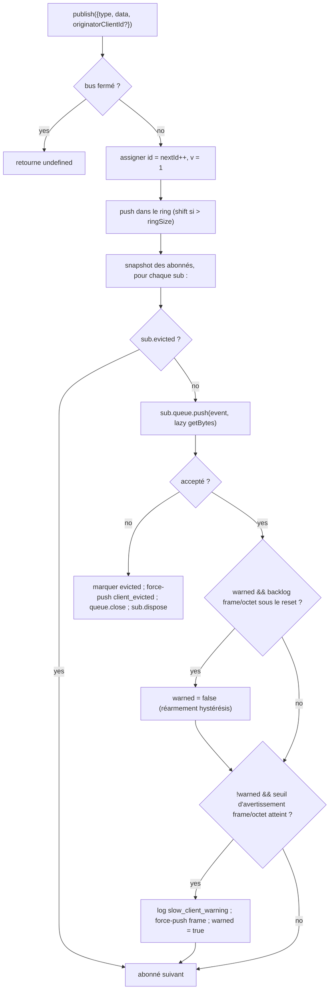

# Bus d'événements SSE et Backpressure

## Vue d'ensemble

`EventBus` (`packages/acp-bridge/src/eventBus.ts`) est le pub/sub en mémoire par session qui alimente la route SSE `GET /session/:id/events` du daemon. Il attribue à chaque événement un id monotone, met en buffer les événements récents dans un ring borné pour la relecture `Last-Event-ID`, diffuse les événements publiés à tous les abonnés, applique une backpressure par abonné (avertissement à 75 % de remplissage de la file d'attente live / remplissage en octets sérialisés, éviction à la limite), et émet des frames synthétiques locales à l'abonné (`client_evicted`, `slow_client_warning`) que le SDK traite comme des événements de premier ordre, mais que le bus marque **sans `id`** afin qu'ils ne consomment pas de slot dans la séquence par session.

`EventBus` est actuellement privé au package `acp-bridge` et consommé par la fabrique de bridge via une instance fermée par session. Une future refactorisation (mentionnée aux lignes 150-159 de `eventBus.ts`) le hissera au rang de bloc de construction de premier plan afin que les canaux, la double sortie et les futurs transports WebSocket puissent s'abonner via le même bus au lieu d'exécuter des flux parallèles.

## Responsabilités

- Attribuer des ids d'événements monotones par session, en commençant à 1.
- Mettre en buffer les `ringSize` derniers événements pour la relecture lors d'un subscribe avec `lastEventId`.
- Diffuser les événements publiés à ≤ `maxSubscribers` abonnés simultanés.
- Appliquer des files d'attente bornées par abonné ; déconnecter les abonnés qui dépassent la limite de frames live ou la limite d'octets sérialisés live avec une frame terminale synthétique `client_evicted`.
- Émettre `slow_client_warning` une fois par épisode de dépassement à 75 % de remplissage de frames live ou d'octets sérialisés live, avec une hystérésis de 37,5 % pour éviter les avertissements répétés.
- Terminer les abonnements promptement lors de `AbortSignal.abort()`.
- Fermer proprement chaque abonné lors de la fermeture du bus (par ex. démontage de session).
- Ne jamais lever d'exception depuis `publish` (le contrat est "publish est toujours sûr à appeler").

## Architecture

| Constant                               | Valeur      | Objectif                                                                                           |
| -------------------------------------- | ----------- | -------------------------------------------------------------------------------------------------- |
| `EVENT_SCHEMA_VERSION`                 | `1`         | Tamponné sur chaque `BridgeEvent.v` ; incrémenté lors de changements de frame incompatibles (breaking changes). |
| `DEFAULT_RING_SIZE`                    | `8000`      | Ring de relecture par session. Surcharge par l'opérateur via `--event-ring-size`.                  |
| `DEFAULT_MAX_QUEUED`                   | `256`       | Limite de backlog de frames live par abonné.                                                       |
| `DEFAULT_MAX_QUEUED_BYTES`             | `2 MiB`     | Limite de backlog d'octets sérialisés live par abonné.                                             |
| `DEFAULT_MAX_SUBSCRIBERS`              | `64`        | Limite d'abonnés par session.                                                                      |
| `WARN_THRESHOLD_RATIO`                 | `0.75`      | Fraction de déclenchement de `slow_client_warning` de `maxQueued` ou `maxQueuedBytes`.             |
| `WARN_RESET_RATIO`                     | `0.375`     | Fraction de réarmement de l'hystérésis.                                                            |
| `MAX_EVENT_RING_SIZE` (dans `bridge.ts`) | `1_000_000` | Limite supérieure souple pour `BridgeOptions.eventRingSize` afin de détecter les erreurs de mémoire (out-of-memory) causées par des fautes de frappe. |

### `BridgeEvent`

```ts
interface BridgeEvent {
  id?: number; // monotone par session ; absent sur les frames terminales synthétiques
  v: 1; // EVENT_SCHEMA_VERSION
  type: string; // l'un des 47 types connus ou extensible dans le futur
  data: unknown; // payload (typé par type par le SDK ; voir 09-event-schema.md)
  _meta?: { serverTimestamp?: number; [key: string]: unknown }; // tamponné par EventBus.publish
  originatorClientId?: string; // défini lorsque l'événement dérive d'une requête tamponnée par clientId
}
```

### `SubscribeOptions`

```ts
interface SubscribeOptions {
  lastEventId?: number; // relecture à partir de cet id (reprise Last-Event-ID)
  signal?: AbortSignal; // annule l'abonnement promptement
  maxQueued?: number; // limite de backlog de frames live par abonné ; par défaut 256
}
```

`subscribe()` retourne un `AsyncIterable<BridgeEvent>`. La route SSE le consomme avec `for await`. L'enregistrement est **synchrone** — au moment où `subscribe()` retourne, l'abonné est déjà attaché, donc un `publish()` qui entre en compétition avec le premier `next()` du consommateur est tout de même délivré.

La limite d'octets live est une option de constructeur au niveau du bus, réservée aux tests / appelants embarqués. Elle n'est pas exposée en tant que paramètre de requête HTTP, option SDK, flag CLI ou capability, car les clients ne doivent pas pouvoir augmenter le budget mémoire du daemon.

### `BoundedAsyncQueue`

La file d'attente par abonné. Deux comportements pivots :

- **Les limites live s'appliquent uniquement aux éléments live.** Les éléments insérés via `forcePush()` portent un tag `forced: true` par entrée et ne comptent jamais dans `liveCount` ou `liveBytes`. Cela permet au chemin de relecture `Last-Event-ID` de force-pusher des centaines de frames historiques dans un nouvel abonné sans déclencher immédiatement les limites live et évincer l'abonné qui vient de reprendre.
- **`liveCount` et `liveBytes` sont maintenus en tant que champs**, et non dérivés de la position `forcedInBuf`. L'ancienne heuristique basée sur la position a cassé lorsque `slow_client_warning` a commencé à force-pusher au milieu du flux (les avertissements vont à la FIN de la file d'attente, pas au début comme les relectures). Les tags `forced` par entrée sont indépendants de la position ; les entrées live stockent également leur estimation d'octets sérialisés afin que la vidange de la file décrémente `liveBytes`.
- **Les octets sérialisés sont estimés de manière paresseuse (lazily).** `push()` calcule `Buffer.byteLength(JSON.stringify(event), 'utf8')` uniquement lorsque l'événement va être mis en buffer. Si un abonné attend déjà `next()`, l'événement est délivré directement et aucune estimation d'octets n'est calculée. Si la sérialisation échoue, le daemon émet un diagnostic stderr au mieux (best-effort) et cet événement saute la comptabilité des octets tout en préservant le contrat "ne lève jamais d'exception" de `publish()` ; il compte toujours dans la limite de frames live.

`push(value, getBytes)` retourne un résultat accepté / rejeté au lieu de bloquer ou de lever une exception. Le dépassement de frames rejette avec `queue_overflow` ; le dépassement d'octets rejette avec `queue_bytes_overflow`. Un seul événement surdimensionné est autorisé lorsque la file live est vide, mais un deuxième événement live derrière lui évince l'abonné. `forcePush(value)` contourne les deux limites. `close({drain?: boolean})` vide les éléments en attente par défaut ; le chemin d'annulation (abort-path) passe `drain: false` pour les supprimer immédiatement.

## Workflow

### Publication


```mermaid
flowchart TD
    P["publish({type, data, originatorClientId?})"] --> C{"bus fermé ?"}
    C -->|yes| RU["retourne undefined"]
    C -->|no| AID["assigner id = nextId++, v = 1"]
    AID --> PR["push dans le ring (shift si > ringSize)"]
    PR --> FAN["snapshot des abonnés, pour chaque sub :"]
    FAN --> EVCK{"sub.evicted ?"}
    EVCK -->|yes| NEXT[abonné suivant]
    EVCK -->|no| PUSH["sub.queue.push(event, lazy getBytes)"]
    PUSH --> OK{"accepté ?"}
    OK -->|no| EVICT["marquer evicted ; force-push client_evicted ; queue.close ; sub.dispose"]
    OK -->|yes| RES{"warned && backlog frame/octet sous le reset ?"}
    RES -->|yes| RA["warned = false (réarmement hystérésis)"]
    RES -->|no| WARN{"!warned && seuil d'avertissement frame/octet atteint ?"}
    RA --> WARN
    WARN -->|yes| FW["log slow_client_warning ; force-push frame ; warned = true"]
    WARN -->|no| NEXT
    FW --> NEXT
```

`publish` ne lève jamais d'exception. Fermer le bus en cours de publication (le chemin d'arrêt ferme les bus par session avant d'attendre `channel.kill()`) retourne `undefined` plutôt que de lever une exception, car l'agent peut encore émettre des notifications `sessionUpdate` dans la petite fenêtre entre la fermeture du bus et le kill du canal.

### Abonnement + relecture (avec détection d'éviction du ring)

```mermaid
sequenceDiagram
    autonumber
    participant SR as route SSE
    participant EB as EventBus
    participant Q as BoundedAsyncQueue

    SR->>EB: subscribe({lastEventId: 42, maxQueued: 256, signal})
    EB->>EB: refuser si subs.size >= maxSubscribers<br/>(lève SubscriberLimitExceededError)
    EB->>Q: new BoundedAsyncQueue(maxQueued, maxQueuedBytes)
    EB->>EB: subs.add(sub)
    EB->>EB: epochReset = lastEventId >= nextId
    alt epochReset (ancienne epoch du bus)
        EB->>Q: forcePush state_resync_required<br/>{ reason: 'epoch_reset', lastDeliveredId: 42, earliestAvailableId: ring[0]?.id ?? nextId }
        Note over EB,Q: synthétique sans id, la frame passe AVANT la relecture.<br/>La relecture scanne tout le ring actuel.
    else même epoch du bus
        EB->>EB: earliestInRing = ring[0]?.id
        opt earliestInRing > lastEventId + 1 (écart évincé)
            EB->>Q: forcePush state_resync_required<br/>{ reason: 'ring_evicted', lastDeliveredId: 42, earliestAvailableId: earliestInRing }
            Note over EB,Q: synthétique sans id, la frame passe AVANT la relecture.<br/>Le flux reste ouvert ; le reducer SDK bascule awaitingResync.
        end
    end
    loop ring scan
        EB->>EB: for e in ring where e.id > (epochReset ? 0 : 42)
        EB->>Q: forcePush(e)
    end
    EB->>EB: attacher l'écouteur AbortSignal<br/>(onAbort → queue.close({drain:false}); dispose)
    EB-->>SR: AsyncIterable
    SR->>Q: next() dans la boucle for-await
```

Si `subs.size >= maxSubscribers` au moment de l'abonnement, `SubscriberLimitExceededError` est levée — la route SSE l'attrape et sérialise une frame synthétique `stream_error` vers le client rejeté afin qu'il ne voie pas un flux vide silencieux. Retourner un itérable vide à la place laisserait les opérateurs sans visibilité sur le fait que "certains clients reçoivent des événements, d'autres non" sous charge.

### Éviction du ring → `state_resync_required` (le flux de récupération)

Lorsqu'un consommateur se reconnecte avec `Last-Event-ID: N` et que le premier événement survivant du ring a un `id > N + 1`, les événements dans `[N+1, earliestInRing-1]` ont été évincés avant que le consommateur ne se reconnecte. Une relecture naïve réussirait silencieusement avec un suffixe non contigu, le reducer SDK continuerait à appliquer les deltas comme si le flux était contigu, et son état divergerait de la vérité du daemon — sans signal terminal.

Implémenté dans `EventBus.subscribe()` :

1. Vérifier d'abord `opts.lastEventId >= this.nextId`. Si vrai, le curseur du client provient d'une ancienne epoch du bus (redémarrage du daemon / reconstruction de l'EventBus), donc le bus émet `reason: 'epoch_reset'` et relit tout le ring actuel.
2. Sinon, calculer `earliestInRing = this.ring[0]?.id`.
3. Si `earliestInRing > opts.lastEventId + 1`, force-pusher une frame synthétique **avant** les frames de relecture :
   ```jsonc
   {
     "v": 1,
     "type": "state_resync_required",
     "data": {
       "reason": "ring_evicted",
       "lastDeliveredId": <opts.lastEventId>,
       "earliestAvailableId": <earliestInRing>
     }
   }
   ```
4. Continuer la boucle de relecture normale ensuite.

Contrats critiques (et ce que la revue #4360 a corrigé) :

- **Pas d'`id`** — même modèle sans slot que `client_evicted`, afin qu'il n'occupe pas de slot dans la séquence monotone par session observée par les autres abonnés.
- **Le flux reste ouvert** — contrairement à `client_evicted` (véritablement terminal), `state_resync_required` est orienté récupération. La relecture + les frames live continuent de circuler ensuite.
- **Le reducer saute automatiquement les deltas** — côté SDK, on bascule `awaitingResync = true` et on applique uniquement `state_resync_required`, les frames terminales et les snapshots d'état complet jusqu'à ce que le code consommateur appelle `loadSession` et efface le flag. Voir [`09-event-schema.md`](./09-event-schema.md) pour `RESYNC_PASSTHROUGH_TYPES`.
- **Optimisé pour le réseau** — les frames restent sur le fil (on the wire) afin que le SDK puisse calculer un diff "ce que vous avez manqué" plus tard s'il le souhaite. Aucun cycle de reconnexion supplémentaire n'est requis.

### Flux terminal d'éviction

Lorsque le backlog live d'un abonné atteint une limite et que le prochain `push()` est rejeté :

1. Marquer `sub.evicted = true`.
2. Construire les données d'éviction, émettre `logSubscriberEvicted(evictionData)` vers stderr, puis construire une frame `client_evicted` **sans `id`**. Le dépassement de frames utilise `reason: 'queue_overflow'` ; le dépassement d'octets utilise `reason: 'queue_bytes_overflow'`. Les deux incluent `queueSize`, `maxQueued`, `queuedBytes` et `maxQueuedBytes` ; le dépassement d'octets inclut également `eventBytes`.
3. `queue.forcePush(evictionFrame)` pour que l'itérateur du consommateur voie une frame terminale.
4. `queue.close()` pour que l'itération se termine après la frame terminale.
5. Appeler `sub.dispose()` — retire de `subs` et détache l'écouteur `AbortSignal` ; sans ce nettoyage, les fermetures des consommateurs bloqués restent actives jusqu'à la garbage collection de l'`AbortSignal`.
### Flux d'abandon

`AbortSignal.abort()` → `onAbort()` :

1. `queue.close({drain: false})` — supprime les éléments en mémoire tampon afin que la route SSE ne continue pas à sérialiser des événements vers un socket que personne n'écoute.
2. `dispose()` — idempotent grâce à un flag `disposed`.

Les signaux déjà abandonnés au moment de l'abonnement appellent `onAbort()` de manière synchrone avant de retourner l'itérateur.

## État et cycle de vie

- `nextId` commence à 1 et ne fait qu'incrémenter. Le getter `lastEventId` retourne `nextId - 1`.
- `ring` est borné ; l'éviction par décalage est en O(n) une fois plein. Avec `ringSize=8000`, cela se mesure en quelques millisecondes sur les sessions à fort volume — bien en dessous du budget de latence par frame. Un refactoring vers un buffer circulaire est reporté jusqu'à ce que le profiling le signale ou que les opérateurs augmentent `--event-ring-size` d'un ordre de grandeur.
- `close()` bascule `closed`, ferme la file d'attente de chaque abonné et vide `subs`. Les appels suivants à `publish()` / `subscribe()` sont des no-ops (`publish` retourne undefined ; `subscribe` retourne `emptyAsyncIterable`).
- Chaque session possède un `EventBus`. La fermeture du bus se produit avant `channel.kill()` afin que les publications en cours lors de l'arrêt retournent undefined plutôt que de lever une erreur.

## Dépendances

- Consommé par `packages/acp-bridge/src/bridge.ts` (`BridgeClient.sessionUpdate` / `BridgeClient.extNotification` → `events.publish(...)`).
- Consommé par `packages/cli/src/serve/routes/sse-events.ts` (gestionnaire de route SSE → `events.subscribe(...)` puis formate `BridgeEvent` en frames SSE sur le wire).
- Les consommateurs CLI importent l'event bus directement depuis `@qwen-code/acp-bridge/eventBus`.
- Consommateur SDK : `packages/sdk-typescript/src/daemon/sse.ts` (`parseSseStream`), puis `asKnownDaemonEvent` (voir [`09-event-schema.md`](./09-event-schema.md), [`13-sdk-daemon-client.md`](./13-sdk-daemon-client.md)).

## Configuration

- `--event-ring-size <n>` — profondeur du ring par session ; plafonné de manière souple à `MAX_EVENT_RING_SIZE = 1_000_000`.
- Paramètre de requête `?maxQueued=N` de l'abonné sur `GET /session/:id/events`, plage `[16, 2048]`. Les clients SDK vérifient en amont `caps.features.slow_client_warning` avant d'y souscrire.
- L'option de constructeur `EventBus(..., { maxQueuedBytes })` existe uniquement pour les tests / appelants embarqués. La valeur par défaut est de 2 MiB et les valeurs invalides lèvent une `TypeError`. Il n'y a volontairement pas de paramètre de requête `?maxQueuedBytes`.
- `BridgeOptions.eventRingSize` (écrase la valeur par défaut du daemon pour une utilisation embarquée).
- Tags de capacité : `session_events`, `slow_client_warning`, `typed_event_schema`.

## Intégration client : Reconnexion via Last-Event-ID

### Format sur le wire

Chaque frame SSE portant un id émise par `GET /session/:id/events` inclut une ligne `id:` :

```
id: 42
event: session_update
data: {"id":42,"v":1,"type":"session_update","data":{...},"_meta":{"serverTimestamp":1719000000000}}

```

Les frames synthétiques/terminales (`state_resync_required`, `replay_complete`, `client_evicted`, `slow_client_warning`, `stream_error`) sont émises **sans** ligne `id:` — elles ne font pas avancer la séquence monotone par session.

### Protocole de reconnexion

Lorsqu'un client se reconnecte après une déconnexion, il envoie le dernier id d'événement reçu avec succès dans l'en-tête HTTP `Last-Event-ID` :

```
GET /session/:id/events HTTP/1.1
Last-Event-ID: 42
Accept: text/event-stream
```

L'`EventBus` du daemon rejoue tous les événements du ring buffer dont l'`id > Last-Event-ID`, puis passe en livraison en direct. Une frame synthétique `replay_complete` marque la limite entre le replay et le direct :

```jsonc
// pas de ligne id: — synthétique
{
  "v": 1,
  "type": "replay_complete",
  "data": { "replayedCount": 7, "lastReplayedEventId": 49 },
}
```

### Comportement du replay

| Scénario                                     | Comportement                                                                                                                                                        |
| -------------------------------------------- | ------------------------------------------------------------------------------------------------------------------------------------------------------------------- |
| `Last-Event-ID` absent                       | Flux en direct uniquement ; pas de replay. Rétrocompatible avec les clients pré-resume.                                                                             |
| `Last-Event-ID: 0`                           | Rejoue l'intégralité du ring buffer depuis le début (borné par `--event-ring-size`, 8000 par défaut).                                                               |
| `Last-Event-ID: N` où `ring[0].id <= N+1`    | Replay contigu des événements `id > N`, puis direct.                                                                                                                |
| `Last-Event-ID: N` où `ring[0].id > N+1`     | Trou détecté — `state_resync_required` (`reason: 'ring_evicted'`) émis avant le replay du suffixe survivant. Le SDK doit appeler `loadSession` pour récupérer l'état complet. |
| `Last-Event-ID: N` où `N >= nextId`          | Réinitialisation d'époque (redémarrage du daemon) — `state_resync_required` (`reason: 'epoch_reset'`) émis, puis replay complet du ring.                           |

### Règles de validation

Le daemon analyse `Last-Event-ID` de manière stricte :

- Seules les chaînes de chiffres décimaux purs sont acceptées (par ex. `"42"`).
- Les valeurs non numériques, négatives, fractionnaires ou en dépassement (au-delà de `Number.MAX_SAFE_INTEGER`) sont rejetées silencieusement — le flux démarre en direct uniquement et le daemon consigne un breadcrumb.
- La directive `retry: 3000` indique aux implémentations conformes de `EventSource` d'attendre 3 secondes avant de se reconnecter.

### Rétrocompatibilité

Le mécanisme `Last-Event-ID` est entièrement opt-in :

- Les clients qui n'envoient jamais l'en-tête reçoivent un flux en direct uniquement identique au comportement pré-resume.
- Les anciennes versions du SDK qui ne suivent pas les ids d'événements continuent de fonctionner.
- La frame `replay_complete` est synthétique (pas de `id:`), elle ne perturbe donc pas les consommateurs ignorant les ids.

### Limitation de EventSource dans le navigateur

L'API native `EventSource` du navigateur suit automatiquement le dernier champ `id:` et l'envoie lors de la reconnexion. Cependant, elle **ne peut pas** définir d'en-têtes personnalisés (par ex. `Authorization: Bearer`). Les clients nécessitant une authentification doivent utiliser `fetch()` brut + une analyse SSE manuelle (comme le fait le SDK TypeScript via `parseSseStream`) plutôt que `EventSource`. Le `RestSseTransport` du SDK illustre ce pattern — il définit `Last-Event-ID` comme un en-tête HTTP explicite lors de l'appel `fetch()`.

## Mises en garde et limites connues

- **Les frames synthétiques n'ont pas d'`id`.** Les consommateurs SDK utilisant la reprise via `Last-Event-ID` n'enregistrent que les frames avec des ids ; `slow_client_warning`, `client_evicted`, `state_resync_required` et `replay_complete` ne font pas avancer le curseur et ne consomment pas de numéros de séquence par session. Si deux frames en direct portant un id ont un véritable trou, gérez-le via le chemin de resync par éviction du ring / réinitialisation d'époque plutôt que de le traiter comme une frame synthétique privée.
- `client_evicted` est **par abonné**, et non par session. Le même client peut se reconnecter.
- L'itérateur `BoundedAsyncQueue` **n'est pas sûr pour les pilotes concurrents** — deux appels simultanés à `.next()` entreraient en compétition pour le même événement. L'utilisation par le daemon est séquentielle (`for await ... of` dans le gestionnaire de route SSE), c'est donc sûr en production.
- Le bus est actuellement privé au package ; les canaux et l'interface web doivent s'abonner via la route HTTP SSE du daemon, et non en accédant directement au bus. L'étape 1.5 lèvera cette restriction.

## Références

- `packages/acp-bridge/src/eventBus.ts` (fichier entier)
- `packages/acp-bridge/src/bridge.ts` (sites de publication, not. `BridgeClient.sessionUpdate` et les événements de permission F3)
- `packages/cli/src/serve/routes/sse-events.ts` (gestionnaire de route SSE — formate `BridgeEvent` en SSE sur le wire)
- `packages/sdk-typescript/src/daemon/sse.ts` (analyseur de wire SSE côté client)
- Référence wire : [`../qwen-serve-protocol.md`](../qwen-serve-protocol.md) (le contrat de reconnexion `Last-Event-ID`).