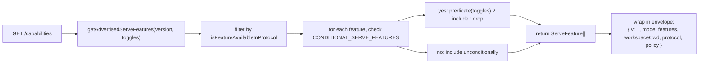
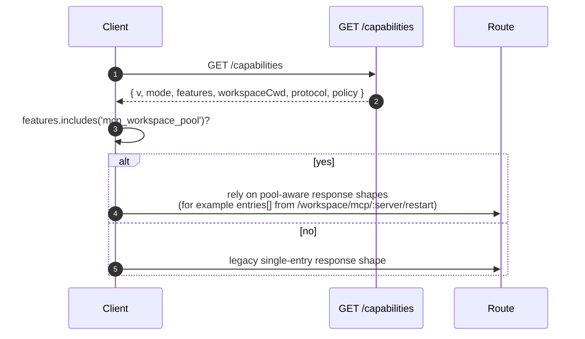

# Capacités et versionnage du protocole

## Vue d'ensemble

`GET /capabilities` est le point de terminaison de pré-vol du démon. Chaque client SDK devrait le lire avant d'appeler toute autre route afin de connaître la version du protocole utilisée par le démon, les tags de fonctionnalités activés et l'espace de travail auquel le démon est lié. Le contrat :

- **Il existe une seule version de protocole : `v1`.** `SERVE_PROTOCOL_VERSION = 'v1'` et `SUPPORTED_SERVE_PROTOCOL_VERSIONS = ['v1']`. v1 est additif en interne ; les changements de forme de trame cassants sont réservés à v2.
- **Chaque tag a une version `since`.** Les futurs démons v2 pourront annoncer à la fois les tags v1 et v2.
- **Certains tags sont conditionnels.** Dix tags (`require_auth`, `mcp_workspace_pool`, `mcp_pool_restart`, `allow_origin`, `prompt_absolute_deadline`, `writer_idle_timeout`, `workspace_settings`, `session_shell_command`, `rate_limit`, `workspace_reload`) ne sont annoncés que lorsque le toggle de déploiement correspondant est activé. La présence d'un tag signifie que le comportement existe.
- **Tag de capacité = contrat de comportement.** Ajouter un nouveau comportement sous un tag existant peut silencieusement casser les clients qui ont prévolé l'ancien tag. Un nouveau comportement nécessite un nouveau tag.

Le registre complet se trouve dans `packages/cli/src/serve/capabilities.ts`.

## Responsabilités

- Déclarer chaque fonctionnalité que le démon peut annoncer.
- Filtrer les fonctionnalités annoncées par version de protocole et toggles de déploiement.
- Exposer `getRegisteredServeFeatures()` (toutes les clés, non filtrées), `getAdvertisedServeFeatures(version, toggles)` (filtrées) et `getServeProtocolVersions()` (enveloppe `{ current, supported }`).
- Préserver l'invariant « tag présent signifie comportement présent ». `server.test.ts` inclut un test qui vérifie que chaque tag conditionnel est annoncé lorsque son toggle est activé ; ajouter un tag conditionnel sans prédicat fait échouer ce test.

## Architecture

### Enveloppe des capacités

`/capabilities` renvoie :

```ts
{
  v: 1,                    // CAPABILITIES_SCHEMA_VERSION
  mode: 'http-bridge',
  features: ServeFeature[],
  workspaceCwd: string,
  protocol?: { current: 'v1', supported: ['v1'] },
  policy?: { permission: PermissionPolicy },
}
```

`workspaceCwd` est l'espace de travail canonique lié au démarrage du démon (voir [`02-serve-runtime.md`](./02-serve-runtime.md)). `policy.permission` est la politique de médiation active.

### `ServeCapabilityDescriptor`

```ts
interface ServeCapabilityDescriptor {
  since: ServeProtocolVersion; // current = 'v1'
  modes?: readonly string[]; // lists operation modes when a feature has modes
}
```

Deux tags v1 utilisent `modes` :

- `mcp_guardrails: { since: 'v1', modes: ['warn', 'enforce'] }` - les clients devraient prévoler `'enforce'` avant de compter sur le comportement de refus.
- `permission_mediation: { since: 'v1', modes: ['first-responder', 'designated', 'consensus', 'local-only'] }` - c'est l'ensemble supporté au moment de la compilation ; la politique active se trouve dans `policy.permission`.

### Tags conditionnels

```ts
export const CONDITIONAL_SERVE_FEATURES: ReadonlyMap<
  ServeFeature,
  (toggles: AdvertiseFeatureToggles) => boolean
> = new Map([
  ['require_auth', (t) => t.requireAuth === true],
  ['mcp_workspace_pool', (t) => t.mcpPoolActive === true],
  ['mcp_pool_restart', (t) => t.mcpPoolActive === true],
  ['allow_origin', (t) => t.allowOriginActive === true],
  [
    'prompt_absolute_deadline',
    (t) => typeof t.promptDeadlineMs === 'number' && t.promptDeadlineMs > 0,
  ],
  [
    'writer_idle_timeout',
    (t) =>
      typeof t.writerIdleTimeoutMs === 'number' && t.writerIdleTimeoutMs > 0,
  ],
  ['workspace_settings', (t) => t.persistSettingAvailable === true],
  ['session_shell_command', (t) => t.sessionShellCommandEnabled === true],
  ['rate_limit', (t) => t.rateLimit === true],
  ['workspace_reload', (t) => t.reloadAvailable === true],
]);
```

Le `Map` stocke l'appartenance et le prédicat ensemble. Ajouter un nouveau tag conditionnel nécessite deux modifications coordonnées :

1. Enregistrer le tag et sa version `since` dans `SERVE_CAPABILITY_REGISTRY`.
2. Ajouter son prédicat à `CONDITIONAL_SERVE_FEATURES`.

Les tags de base ne sont pas présents dans le `Map` et sont annoncés inconditionnellement. Ceci est intentionnellement représenté par l'absence plutôt que par un ensemble séparé.

### 67 tags (v1, groupés par domaine)

Foundation : `health`, `capabilities`.

Sessions : `session_create`, `session_scope_override`, `session_load`, `session_resume`, `unstable_session_resume`, `session_list`, `session_prompt`, `session_cancel`, `session_events`, `session_set_model`, `session_close`, `session_metadata`, `session_context`, `session_context_usage`, `session_supported_commands`, `session_tasks`, `session_stats`, `session_lsp`, `session_status`, `session_approval_mode_control`, `session_recap`, `session_btw`, **`session_shell_command`** (conditionnel), `session_language`, `session_rewind`, `session_hooks`, `session_branch`.

Streaming : `slow_client_warning`, `typed_event_schema`.

Identité et pulsation : `client_identity`, `client_heartbeat`.

Permissions : `session_permission_vote`, `permission_vote`, **`permission_mediation`** (`modes: ['first-responder', 'designated', 'consensus', 'local-only']`).

Instantanés d'espace de travail en lecture seule : `workspace_mcp`, `workspace_skills`, `workspace_providers`, `workspace_env`, `workspace_preflight`, `workspace_hooks`, `workspace_extensions`.

Mutation d'espace de travail (Wave 4+) : `workspace_memory`, `workspace_agents`, `workspace_agent_generate`, `workspace_tool_toggle`, **`workspace_settings`** (conditionnel), `workspace_init`, `workspace_mcp_restart`, `workspace_mcp_manage`, `workspace_file_read`, `workspace_file_bytes`, `workspace_file_write`, **`workspace_reload`** (conditionnel).

Garde-fous MCP : **`mcp_guardrails`** (`modes: ['warn', 'enforce']`), `mcp_guardrail_events`, `mcp_server_runtime_mutation`, **`mcp_workspace_pool`** (conditionnel), **`mcp_pool_restart`** (conditionnel).

Contrôle des prompts : **`prompt_absolute_deadline`** (conditionnel), **`writer_idle_timeout`** (conditionnel), `non_blocking_prompt`.

Auth : `auth_provider_install`, `auth_device_flow`, **`require_auth`** (conditionnel), **`allow_origin`** (conditionnel).

Limitation de débit : **`rate_limit`** (conditionnel).

Les tags en gras ont des `modes` ou sont conditionnels.

## Flux

### Côté démon : assembler l'enveloppe



### Côté client : pré-vol des fonctionnalités



## État et cycle de vie

- `CAPABILITIES_SCHEMA_VERSION` est la version de la forme de l'enveloppe filaire, actuellement `1`. Ne la monter que pour une rupture d'enveloppe.
- `SERVE_PROTOCOL_VERSION = 'v1'` est la version des fonctionnalités du protocole. Ajouter des fonctionnalités dans v1 est additif ; les anciens clients ne voient pas les nouveaux comportements à moins de prévoler le nouveau tag. Supprimer une fonctionnalité est une rupture v2.
- `EVENT_SCHEMA_VERSION = 1` est le champ `v` des trames SSE (voir [`09-event-schema.md`](./09-event-schema.md)). C'est un axe de versionnage indépendant ; monter le schéma d'événement n'implique pas de monter la version du protocole, et vice versa.
- `session_resume` est la capacité stable du démon pour `POST /session/:id/resume`. `unstable_session_resume` reste annoncé comme alias déprécié car la méthode ACP sous-jacente est toujours nommée `connection.unstable_resumeSession` ; les nouveaux clients devraient détecter la fonctionnalité `session_resume`.

## Dépendances

- Lu par `packages/cli/src/serve/server.ts` lors de la construction des réponses `/capabilities`.
- Les entrées de toggle proviennent de `runQwenServe` / `createServeApp` : `{ requireAuth, mcpPoolActive, allowOriginActive, promptDeadlineMs, writerIdleTimeoutMs, persistSettingAvailable, sessionShellCommandEnabled, rateLimit, reloadAvailable }`.
- La politique `permission` active dans l'enveloppe provient de `BridgeOptions.permissionPolicy`, qui elle-même lit `settings.json` `policy.permissionStrategy`.

## Configuration

| Source                     | Paramètre                                                      | Effet sur les capacités                                                                                                        |
| -------------------------- | -------------------------------------------------------------- | ------------------------------------------------------------------------------------------------------------------------------ |
| CLI flag                   | `--require-auth`                                               | Annonce `require_auth`.                                                                                                    |
| Env                        | `QWEN_SERVE_NO_MCP_POOL=1`                                     | Cesse d'annoncer `mcp_workspace_pool` et `mcp_pool_restart` ; les événements MCP n'ajoutent plus `scope: 'workspace'`.               |
| CLI flag                   | `--mcp-client-budget=N`, `--mcp-budget-mode={off,warn,enforce}` | Ne change pas l'ensemble des tags (`mcp_guardrails` est toujours annoncé), mais modifie la réservation par serveur et le comportement de refus. |
| CLI flag / env             | `--rate-limit` / `QWEN_SERVE_RATE_LIMIT=1`                     | Annonce `rate_limit`.                                                                                                      |
| Option intégrée            | `persistSettingAvailable`                                      | Annonce `workspace_settings`.                                                                                              |
| CLI flag / option intégrée | `--enable-session-shell` / `sessionShellCommandEnabled`         | Annonce `session_shell_command`.                                                                                           |
| Option intégrée            | `reloadAvailable`                                              | Annonce `workspace_reload`.                                                                                                |
| `settings.json`            | `policy.permissionStrategy`                                    | Définit `policy.permission` de l'enveloppe.                                                                                            |

## Mises en garde et limites connues

- **`--require-auth` masque le preflight.** Avec `--require-auth`, toutes les routes, y compris `/capabilities`, nécessitent une authentification bearer. Un client non authentifié ne peut pas prévoler `caps.features.require_auth` ; le corps de la réponse 401 est la surface de découverte. Le tag `require_auth` est une confirmation authentifiée pour les interfaces d'audit de déploiement renforcé.
- **La présence d'un tag signifie que le comportement existe.** Si un futur contributeur ajoute un comportement sous un tag existant sans monter `since`, les clients qui ont prévolé l'ancien tag peuvent silencieusement recevoir un nouveau comportement. La convention est : un nouveau comportement obtient un nouveau tag.
- **Les tags `unstable_*` peuvent changer de forme entre les versions** sans augmentation de protocole. Épingler une version du SDK lorsqu'on dépend d'eux.
- Le catalogue des routes se trouve dans [`../qwen-serve-protocol.md`](../qwen-serve-protocol.md) ; cette page ne le duplique pas intentionnellement.

## Références

- `packages/cli/src/serve/capabilities.ts`
- `packages/cli/src/serve/types.ts` (`ServeOptions`, `CapabilitiesEnvelope`)
- `packages/cli/src/serve/server.ts` (assemblage de l'enveloppe)
- `packages/acp-bridge/src/eventBus.ts` (`EVENT_SCHEMA_VERSION`)
- Référence filaire : [`../qwen-serve-protocol.md`](../qwen-serve-protocol.md)
- Auth et garde-fous de déploiement : [`12-auth-security.md`](./12-auth-security.md)