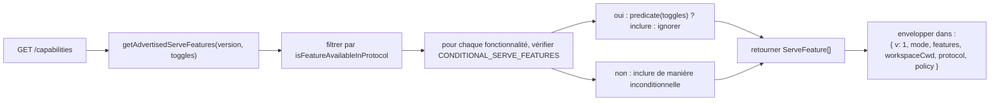
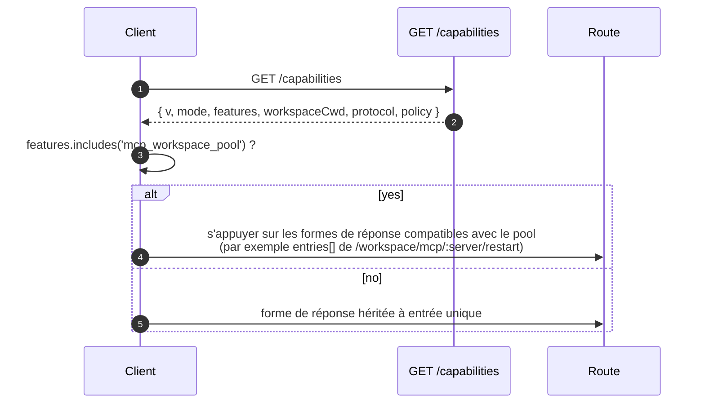

# Capacités et versioning du protocole

## Vue d'ensemble

`GET /capabilities` est le point de terminaison de preflight du démon. Chaque client SDK doit le lire avant d'appeler toute autre route afin de connaître la version du protocole prise en charge par le démon, les tags de fonctionnalités activés et le workspace auquel le démon est lié. Le contrat :

- **Il n'y a qu'une seule version de protocole : `v1`.** `SERVE_PROTOCOL_VERSION = 'v1'` et `SUPPORTED_SERVE_PROTOCOL_VERSIONS = ['v1']`. v1 est additif en interne ; les modifications cassantes (breaking changes) de la forme des trames sont réservées à v2.
- **Chaque tag a une version `since`.** Les futurs démons v2 peuvent annoncer à la fois les tags v1 et v2.
- **Certains tags sont conditionnels.** Treize tags (`require_auth`, `mcp_workspace_pool`, `mcp_pool_restart`, `allow_origin`, `prompt_absolute_deadline`, `writer_idle_timeout`, `workspace_settings`, `workspace_voice`, `workspace_voice_transcription`, `session_shell_command`, `rate_limit`, `workspace_reload`, `voice_transcribe`) sont annoncés uniquement lorsque le toggle de déploiement correspondant est activé. La présence d'un tag signifie que le comportement existe.
- **Tag de capacité = contrat de comportement.** Ajouter un nouveau comportement sous un tag existant peut casser silencieusement les clients qui ont effectué le preflight de l'ancien tag. Un nouveau comportement nécessite un nouveau tag.

Le registre complet se trouve dans `packages/cli/src/serve/capabilities.ts`.

## Responsabilités

- Déclarer chaque fonctionnalité que le démon peut annoncer.
- Filtrer les fonctionnalités annoncées par version de protocole et toggles de déploiement.
- Exposer `getRegisteredServeFeatures()` (toutes les clés, non filtrées), `getAdvertisedServeFeatures(version, toggles)` (filtrées) et `getServeProtocolVersions()` (enveloppe `{ current, supported }`).
- Préserver l'invariant "tag présent signifie comportement présent". `server.test.ts` inclut un test vérifiant que chaque tag conditionnel s'annonce lorsque son toggle est activé ; l'ajout d'un tag conditionnel sans prédicat fait échouer ce test.

## Architecture

### Enveloppe de capacités

`/capabilities` renvoie :

```ts
{
  v: 1,                    // CAPABILITIES_SCHEMA_VERSION
  mode: 'http-bridge',
  features: ServeFeature[],
  workspaceCwd: string,
  protocol?: { current: 'v1', supported: ['v1'] },
  policy?: { permission: PermissionPolicy },
}
```

`workspaceCwd` est le workspace canonique lié au démarrage du démon (voir [`02-serve-runtime.md`](./02-serve-runtime.md)). `policy.permission` est la politique du médiateur actif.

### `ServeCapabilityDescriptor`

```ts
interface ServeCapabilityDescriptor {
  since: ServeProtocolVersion; // current = 'v1'
  modes?: readonly string[]; // lists operation modes when a feature has modes
}
```

Quatre tags v1 utilisent `modes` :

- `mcp_guardrails: { since: 'v1', modes: ['warn', 'enforce'] }` - les clients doivent effectuer le preflight de `'enforce'` avant de s'appuyer sur le comportement de refus.
- `permission_mediation: { since: 'v1', modes: ['first-responder', 'designated', 'consensus', 'local-only'] }` - il s'agit de l'ensemble pris en charge au moment de la compilation (build-time) ; la politique active se trouve dans `policy.permission`.
- `workspace_voice_transcription: { since: 'v1', modes: ['batch'] }` - le chemin de transcription que le démon propose.
- `voice_transcribe: { since: 'v1', modes: ['streaming', 'batch'] }` - les deux chemins de transcription disponibles sur le WebSocket `/voice/stream`.

### Tags conditionnels

```ts
export const CONDITIONAL_SERVE_FEATURES: ReadonlyMap<
  ServeFeature,
  (toggles: AdvertiseFeatureToggles) => boolean
> = new Map([
  ['require_auth', (t) => t.requireAuth === true],
  ['mcp_workspace_pool', (t) => t.mcpPoolActive === true],
  ['mcp_pool_restart', (t) => t.mcpPoolActive === true],
  ['allow_origin', (t) => t.allowOriginActive === true],
  [
    'prompt_absolute_deadline',
    (t) => typeof t.promptDeadlineMs === 'number' && t.promptDeadlineMs > 0,
  ],
  [
    'writer_idle_timeout',
    (t) =>
      typeof t.writerIdleTimeoutMs === 'number' && t.writerIdleTimeoutMs > 0,
  ],
  ['workspace_settings', (t) => t.persistSettingAvailable === true],
  ['workspace_voice', (t) => t.persistSettingAvailable === true],
  [
    'workspace_voice_transcription',
    (t) => t.voiceTranscriptionAvailable === true,
  ],
  ['session_shell_command', (t) => t.sessionShellCommandEnabled === true],
  ['rate_limit', (t) => t.rateLimit === true],
  ['workspace_reload', (t) => t.reloadAvailable === true],
  ['voice_transcribe', (t) => t.voiceWsAvailable !== false],
]);
```

La `Map` stocke l'appartenance et le prédicat ensemble. L'ajout d'un nouveau tag conditionnel nécessite deux modifications coordonnées :

1. Enregistrer le tag et sa version `since` dans `SERVE_CAPABILITY_REGISTRY`.
2. Ajouter son prédicat à `CONDITIONAL_SERVE_FEATURES`.

Les tags de base ne sont pas présents dans la `Map` et sont annoncés de manière inconditionnelle. Cela est intentionnellement représenté par une absence plutôt que par un Set séparé.

### 75 tags (v1, regroupés par domaine)

Fondation : `health`, `daemon_status`, `capabilities`.

Sessions : `session_create`, `session_scope_override`, `session_load`, `session_resume`, `unstable_session_resume`, `session_list`, `session_prompt`, `session_cancel`, `session_events`, `session_set_model`, `session_close`, `session_metadata`, `session_context`, `session_context_usage`, `session_supported_commands`, `session_tasks`, `session_stats`, `session_lsp`, `session_status`, `session_approval_mode_control`, `session_recap`, `session_btw`, **`session_shell_command`** (conditionnel), `session_language`, `session_rewind`, `session_hooks`, `session_branch`.

Streaming : `slow_client_warning`, `typed_event_schema`.

Identité et heartbeat : `client_identity`, `client_heartbeat`.

Permissions : `session_permission_vote`, `permission_vote`, **`permission_mediation`** (`modes: ['first-responder', 'designated', 'consensus', 'local-only']`).

Snapshots en lecture seule du workspace : `workspace_mcp`, `workspace_skills`, `workspace_providers`, `workspace_env`, `workspace_preflight`, `workspace_hooks`, `workspace_extensions`.

Mutation du workspace (Wave 4+) : `workspace_memory`, `workspace_agents`, `workspace_agent_generate`, `workspace_tool_toggle`, **`workspace_settings`** (conditionnel), `workspace_permissions`, `workspace_init`, `workspace_github_setup`, `workspace_trust`, `workspace_mcp_restart`, `workspace_mcp_manage`, `workspace_file_read`, `workspace_file_bytes`, `workspace_file_write`, **`workspace_reload`** (conditionnel).

MCP guardrails : **`mcp_guardrails`** (`modes: ['warn', 'enforce']`), `mcp_guardrail_events`, `mcp_server_runtime_mutation`, **`mcp_workspace_pool`** (conditionnel), **`mcp_pool_restart`** (conditionnel).

Contrôle de prompt : **`prompt_absolute_deadline`** (conditionnel), **`writer_idle_timeout`** (conditionnel), `non_blocking_prompt`.

Authentification : `auth_provider_install`, `auth_device_flow`, **`require_auth`** (conditionnel), **`allow_origin`** (conditionnel).

Voix : **`workspace_voice`** (conditionnel), **`workspace_voice_transcription`** (conditionnel, `modes: ['batch']`), **`voice_transcribe`** (conditionnel, `modes: ['streaming', 'batch']`).

Rate limiting : **`rate_limit`** (conditionnel).

Les tags en gras ont des `modes` ou sont conditionnels.

## Flux

### Côté démon : assemblage de l'enveloppe



### Côté client : preflight des fonctionnalités



## État et cycle de vie

- `CAPABILITIES_SCHEMA_VERSION` est la version de la forme de l'enveloppe wire, actuellement `1`. Ne l'incrémenter qu'en cas de cassure de l'enveloppe.
- `SERVE_PROTOCOL_VERSION = 'v1'` est la version des fonctionnalités du protocole. L'ajout de fonctionnalités dans v1 est additif ; les anciens clients ne voient pas le nouveau comportement à moins d'effectuer le preflight du nouveau tag. La suppression d'une fonctionnalité est une cassure v2.
- `EVENT_SCHEMA_VERSION = 1` est le champ `v` de la trame SSE (voir [`09-event-schema.md`](./09-event-schema.md)). Il s'agit d'un axe de version indépendant ; l'incrémentation du schéma d'événement n'implique pas l'incrémentation de la version du protocole, et vice versa.
- `session_resume` est la capacité stable du démon pour `POST /session/:id/resume`. `unstable_session_resume` reste annoncé comme un alias obsolète car la méthode ACP sous-jacente s'appelle toujours `connection.unstable_resumeSession` ; les nouveaux clients doivent détecter la fonctionnalité `session_resume`.

## Dépendances

- Lu par `packages/cli/src/serve/server.ts` lors de la construction des réponses `/capabilities`.
- L'entrée des toggles provient de `runQwenServe` / `createServeApp` : `{ requireAuth, mcpPoolActive, allowOriginActive, promptDeadlineMs, writerIdleTimeoutMs, persistSettingAvailable, sessionShellCommandEnabled, rateLimit, reloadAvailable }`.
- La politique `permission` active dans l'enveloppe provient de `BridgeOptions.permissionPolicy`, qui lit lui-même `policy.permissionStrategy` dans `settings.json`.

## Configuration

| Source                     | Paramètre                                                       | Effet sur les capacités                                                                                                       |
| -------------------------- | --------------------------------------------------------------- | ----------------------------------------------------------------------------------------------------------------------------- |
| Flag CLI                   | `--require-auth`                                                | Annonce `require_auth`.                                                                                                       |
| Env                        | `QWEN_SERVE_NO_MCP_POOL=1`                                      | Arrête d'annoncer `mcp_workspace_pool` et `mcp_pool_restart` ; les événements MCP n'ajoutent plus le stamp `scope: 'workspace'`. |
| Flag CLI                   | `--mcp-client-budget=N`, `--mcp-budget-mode={off,warn,enforce}` | Ne modifie pas l'ensemble des tags (`mcp_guardrails` est toujours annoncé), mais modifie la réservation par serveur et le comportement de refus. |
| Flag CLI / env             | `--rate-limit` / `QWEN_SERVE_RATE_LIMIT=1`                      | Annonce `rate_limit`.                                                                                                         |
| Option intégrée            | `persistSettingAvailable`                                       | Annonce `workspace_settings` et `workspace_voice`.                                                                            |
| Option intégrée            | `voiceTranscriptionAvailable`                                   | Annonce `workspace_voice_transcription`.                                                                                      |
| Flag CLI / option intégrée | `--enable-session-shell` / `sessionShellCommandEnabled`         | Annonce `session_shell_command`.                                                                                              |
| Option intégrée            | `reloadAvailable`                                               | Annonce `workspace_reload`.                                                                                                   |
| Option intégrée            | `voiceWsAvailable`                                              | Annonce `voice_transcribe`.                                                                                                   |
| `settings.json`            | `policy.permissionStrategy`                                     | Définit `policy.permission` dans l'enveloppe.                                                                                 |

## Mises en garde et limites connues

- **`--require-auth` masque le preflight.** Avec `--require-auth`, toutes les routes, y compris `/capabilities`, nécessitent une authentification bearer. Un client non authentifié ne peut pas effectuer le preflight de `caps.features.require_auth` ; le corps de la réponse 401 est la surface de découverte. Le tag `require_auth` est une confirmation authentifiée pour les interfaces d'audit des déploiements sécurisés.
- **La présence d'un tag signifie que le comportement existe.** Si un futur contributeur ajoute un comportement sous un tag existant sans incrémenter `since`, les clients qui ont effectué le preflight de l'ancien tag peuvent recevoir silencieusement le nouveau comportement. La convention est : un nouveau comportement obtient un nouveau tag.
- **Les tags `unstable_*` peuvent changer de forme entre les versions** sans incrémenter la version du protocole. Fixez une version du SDK lorsque vous en dépendez.
- Le catalogue des routes se trouve dans [`../qwen-serve-protocol.md`](../qwen-serve-protocol.md) ; cette page ne le duplique pas intentionnellement.

## Références

- `packages/cli/src/serve/capabilities.ts`
- `packages/cli/src/serve/types.ts` (`ServeOptions`, `CapabilitiesEnvelope`)
- `packages/cli/src/serve/server.ts` (assemblage de l'enveloppe)
- `packages/acp-bridge/src/eventBus.ts` (`EVENT_SCHEMA_VERSION`)
- Référence wire : [`../qwen-serve-protocol.md`](../qwen-serve-protocol.md)
- Garde-fous d'authentification et de déploiement : [`12-auth-security.md`](./12-auth-security.md)