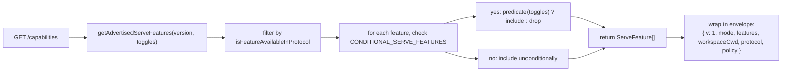
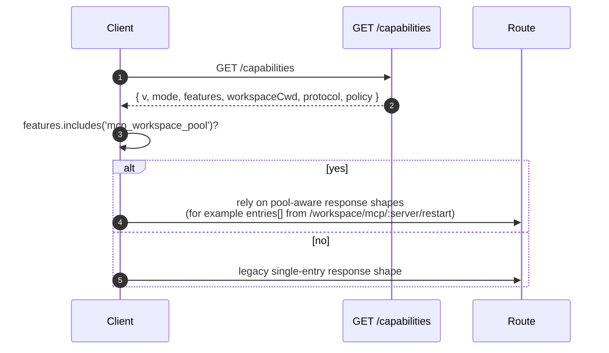

# Capacités et versions du protocole

## Présentation

`GET /capabilities` est l'endpoint de pré-vérification du démon. Chaque client SDK doit le lire avant d'appeler toute autre route afin de connaître la version du protocole utilisée par le démon, les étiquettes de fonctionnalités activées et l'espace de travail auquel le démon est lié. Le contrat :

- **Il existe une version du protocole : `v1`.** `SERVE_PROTOCOL_VERSION = 'v1'` et `SUPPORTED_SERVE_PROTOCOL_VERSIONS = ['v1']`. v1 est additif en interne ; les changements de structure majeurs sont réservés à v2.
- **Chaque étiquette a une version `since`.** Les futurs démons v2 peuvent annoncer à la fois des étiquettes v1 et v2.
- **Certaines étiquettes sont conditionnelles.** Dix étiquettes (`require_auth`, `mcp_workspace_pool`, `mcp_pool_restart`, `allow_origin`, `prompt_absolute_deadline`, `writer_idle_timeout`, `workspace_settings`, `session_shell_command`, `rate_limit`, `workspace_reload`) ne sont annoncées que lorsque l'option de déploiement correspondante est activée. La présence d'une étiquette signifie que le comportement existe.
- **Étiquette de capacité = contrat de comportement.** Ajouter un nouveau comportement sous une étiquette existante peut silencieusement casser les clients qui ont pré-vérifié l'ancienne étiquette. Un nouveau comportement nécessite une nouvelle étiquette.

Le registre complet se trouve dans `packages/cli/src/serve/capabilities.ts`.

## Responsabilités

- Déclarer chaque fonctionnalité que le démon peut annoncer.
- Filtrer les fonctionnalités annoncées en fonction de la version du protocole et des options de déploiement.
- Exposer `getRegisteredServeFeatures()` (toutes les clés, non filtrées), `getAdvertisedServeFeatures(version, toggles)` (filtrées) et `getServeProtocolVersions()` (enveloppe `{ current, supported }`).
- Préserver l'invariant « étiquette présente signifie comportement présent ». `server.test.ts` inclut un test qui vérifie que chaque étiquette conditionnelle est annoncée lorsque son option est activée ; l'ajout d'une étiquette conditionnelle sans prédicat fait échouer ce test.

## Architecture

### Enveloppe des capacités

`/capabilities` retourne :

```ts
{
  v: 1,                    // CAPABILITIES_SCHEMA_VERSION
  mode: 'http-bridge',
  features: ServeFeature[],
  workspaceCwd: string,
  protocol?: { current: 'v1', supported: ['v1'] },
  policy?: { permission: PermissionPolicy },
}
```

`workspaceCwd` est l'espace de travail canonique lié au démarrage du démon (voir [`02-serve-runtime.md`](./02-serve-runtime.md)). `policy.permission` est la politique de médiation active.

### `ServeCapabilityDescriptor`

```ts
interface ServeCapabilityDescriptor {
  since: ServeProtocolVersion; // current = 'v1'
  modes?: readonly string[]; // liste les modes de fonctionnement lorsqu'une fonctionnalité a des modes
}
```

Deux étiquettes v1 utilisent `modes` :

- `mcp_guardrails: { since: 'v1', modes: ['warn', 'enforce'] }` - les clients doivent pré-vérifier `'enforce'` avant de compter sur le comportement de refus.
- `permission_mediation: { since: 'v1', modes: ['first-responder', 'designated', 'consensus', 'local-only'] }` - il s'agit de l'ensemble pris en charge à la compilation ; la politique active se trouve dans `policy.permission`.

### Étiquettes conditionnelles

```ts
export const CONDITIONAL_SERVE_FEATURES: ReadonlyMap<
  ServeFeature,
  (toggles: AdvertiseFeatureToggles) => boolean
> = new Map([
  ['require_auth', (t) => t.requireAuth === true],
  ['mcp_workspace_pool', (t) => t.mcpPoolActive === true],
  ['mcp_pool_restart', (t) => t.mcpPoolActive === true],
  ['allow_origin', (t) => t.allowOriginActive === true],
  [
    'prompt_absolute_deadline',
    (t) => typeof t.promptDeadlineMs === 'number' && t.promptDeadlineMs > 0,
  ],
  [
    'writer_idle_timeout',
    (t) =>
      typeof t.writerIdleTimeoutMs === 'number' && t.writerIdleTimeoutMs > 0,
  ],
  ['workspace_settings', (t) => t.persistSettingAvailable === true],
  ['session_shell_command', (t) => t.sessionShellCommandEnabled === true],
  ['rate_limit', (t) => t.rateLimit === true],
  ['workspace_reload', (t) => t.reloadAvailable === true],
]);
```

La `Map` stocke l'appartenance et le prédicat ensemble. L'ajout d'une nouvelle étiquette conditionnelle nécessite deux modifications coordonnées :

1. Enregistrer l'étiquette et sa version `since` dans `SERVE_CAPABILITY_REGISTRY`.
2. Ajouter son prédicat dans `CONDITIONAL_SERVE_FEATURES`.

Les étiquettes de base ne sont pas présentes dans la `Map` et sont annoncées inconditionnellement. Ceci est intentionnellement représenté par l'absence plutôt que par un ensemble séparé.

### 67 étiquettes (v1, regroupées par domaine)

Fondation : `health`, `capabilities`.

Sessions : `session_create`, `session_scope_override`, `session_load`, `session_resume`, `unstable_session_resume`, `session_list`, `session_prompt`, `session_cancel`, `session_events`, `session_set_model`, `session_close`, `session_metadata`, `session_context`, `session_context_usage`, `session_supported_commands`, `session_tasks`, `session_stats`, `session_lsp`, `session_approval_mode_control`, `session_recap`, `session_btw`, **`session_shell_command`** (conditionnelle), `session_language`, `session_rewind`, `session_hooks`, `session_branch`.

Streaming : `slow_client_warning`, `typed_event_schema`.

Identité et battement de cœur : `client_identity`, `client_heartbeat`.

Permissions : `session_permission_vote`, `permission_vote`, **`permission_mediation`** (`modes: ['first-responder', 'designated', 'consensus', 'local-only']`).
Instantanés d’espace de travail en lecture seule : `workspace_mcp`, `workspace_skills`, `workspace_providers`, `workspace_env`, `workspace_preflight`, `workspace_hooks`, `workspace_extensions`.

Mutation de l’espace de travail (Wave 4+) : `workspace_memory`, `workspace_agents`, `workspace_agent_generate`, `workspace_tool_toggle`, **`workspace_settings`** (conditionnel), `workspace_init`, `workspace_mcp_restart`, `workspace_mcp_manage`, `workspace_file_read`, `workspace_file_bytes`, `workspace_file_write`, **`workspace_reload`** (conditionnel).

Garde-fous MCP : **`mcp_guardrails`** (`modes: ['warn', 'enforce']`), `mcp_guardrail_events`, `mcp_server_runtime_mutation`, **`mcp_workspace_pool`** (conditionnel), **`mcp_pool_restart`** (conditionnel).

Contrôle des invites : **`prompt_absolute_deadline`** (conditionnel), **`writer_idle_timeout`** (conditionnel), `non_blocking_prompt`.

Authentification : `auth_provider_install`, `auth_device_flow`, **`require_auth`** (conditionnel), **`allow_origin`** (conditionnel).

Limitation de débit : **`rate_limit`** (conditionnel).

Les balises en gras ont des `modes` ou sont conditionnelles.

## Flux

### Côté daemon : assemblage de l’enveloppe



### Côté client : pré-vérification des fonctionnalités



## État et cycle de vie

- `CAPABILITIES_SCHEMA_VERSION` est la version de la forme de l’enveloppe filaire, actuellement `1`. Ne l’incrémentez que pour une rupture d’enveloppe.
- `SERVE_PROTOCOL_VERSION = 'v1'` est la version des fonctionnalités du protocole. Ajouter des fonctionnalités dans v1 est additif ; les clients anciens ne voient pas le nouveau comportement à moins qu’ils ne pré‑vérifient la nouvelle balise. Supprimer une fonctionnalité est une rupture v2.
- `EVENT_SCHEMA_VERSION = 1` est le champ `v` de la trame SSE (voir [`09-event-schema.md`](./09-event-schema.md)). C’est un axe de version indépendant ; incrémenter le schéma d’événement n’implique pas d’incrémenter la version du protocole, et vice versa.
- `session_resume` est la capacité stable du daemon pour `POST /session/:id/resume`. `unstable_session_resume` reste annoncé comme alias déprécié car la méthode ACP sous‑jacente est toujours nommée `connection.unstable_resumeSession` ; les nouveaux clients doivent détecter la fonctionnalité `session_resume`.

## Dépendances

- Lu par `packages/cli/src/serve/server.ts` lors de la construction des réponses `/capabilities`.
- L’entrée des bascules provient de `runQwenServe` / `createServeApp` : `{ requireAuth, mcpPoolActive, allowOriginActive, promptDeadlineMs, writerIdleTimeoutMs, persistSettingAvailable, sessionShellCommandEnabled, rateLimit, reloadAvailable }`.
- La politique `permission` active dans l’enveloppe provient de `BridgeOptions.permissionPolicy`, qui elle‑même lit `settings.json` `policy.permissionStrategy`.

## Configuration

| Source                     | Bouton                                                          | Effet sur les capacités                                                                                                       |
| -------------------------- | --------------------------------------------------------------- | ----------------------------------------------------------------------------------------------------------------------------- |
| Flag CLI                   | `--require-auth`                                                | Annonce `require_auth`.                                                                                                       |
| Env                        | `QWEN_SERVE_NO_MCP_POOL=1`                                      | Cesse d’annoncer `mcp_workspace_pool` et `mcp_pool_restart` ; les événements MCP n’estampillent plus `scope: 'workspace'`.    |
| Flag CLI                   | `--mcp-client-budget=N`, `--mcp-budget-mode={off,warn,enforce}` | Ne modifie pas l’ensemble des balises (`mcp_guardrails` est toujours annoncé), mais change le comportement de réservation et de refus par serveur. |
| Flag CLI / env             | `--rate-limit` / `QWEN_SERVE_RATE_LIMIT=1`                      | Annonce `rate_limit`.                                                                                                         |
| Option intégrée            | `persistSettingAvailable`                                       | Annonce `workspace_settings`.                                                                                                 |
| Flag CLI / option intégrée | `--enable-session-shell` / `sessionShellCommandEnabled`         | Annonce `session_shell_command`.                                                                                              |
| Option intégrée            | `reloadAvailable`                                               | Annonce `workspace_reload`.                                                                                                   |
| `settings.json`            | `policy.permissionStrategy`                                     | Fixe l’enveloppe `policy.permission`.                                                                                         |
## Mises en garde et limitations connues

- **`--require-auth` cache le pré-vol.** Avec `--require-auth`, toutes les routes, y compris `/capabilities`, nécessitent une authentification bearer. Un client non authentifié ne peut pas exécuter le pré-vol de `caps.features.require_auth` ; le corps de la réponse 401 constitue la surface de découverte. La balise `require_auth` est une confirmation authentifiée destinée aux interfaces d’audit des déploiements durcis.
- **La présence d’une balise signifie que le comportement existe.** Si un contributeur futur ajoute un comportement sous une balise existante sans incrémenter `since`, les clients ayant effectué le pré-vol de l’ancienne balise peuvent recevoir silencieusement le nouveau comportement. La convention est : un nouveau comportement reçoit une nouvelle balise.
- **Les balises `unstable_*` peuvent changer de forme entre deux versions** sans incrément de protocole. Épinglez une version du SDK lorsque vous en dépendez.
- Le catalogue des routes se trouve dans [`../qwen-serve-protocol.md`](../qwen-serve-protocol.md) ; cette page ne le duplique pas intentionnellement.

## Références

- `packages/cli/src/serve/capabilities.ts`
- `packages/cli/src/serve/types.ts` (`ServeOptions`, `CapabilitiesEnvelope`)
- `packages/cli/src/serve/server.ts` (assemblage de l’enveloppe)
- `packages/acp-bridge/src/eventBus.ts` (`EVENT_SCHEMA_VERSION`)
- Référence filaire : [`../qwen-serve-protocol.md`](../qwen-serve-protocol.md)
- Authentification et garde-fous de déploiement : [`12-auth-security.md`](./12-auth-security.md)
