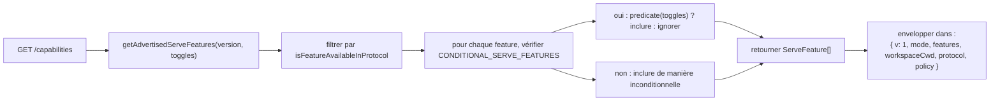
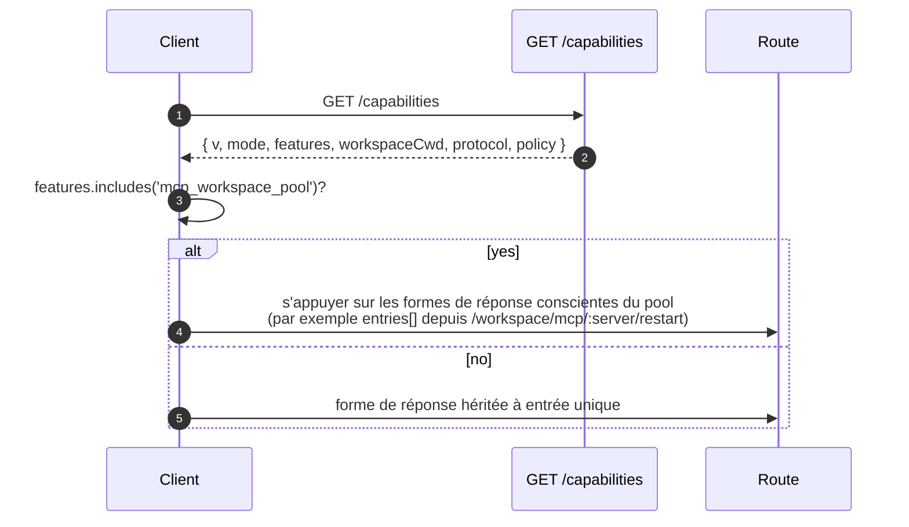

# Capacités et versioning du protocole

## Vue d'ensemble

`GET /capabilities` est le point de terminaison de preflight du démon. Chaque client SDK doit le lire avant d'appeler toute autre route afin de connaître la version du protocole prise en charge par le démon, les tags de fonctionnalités activés et les runtimes de workspace que le démon accepte. Le contrat :

- **Il n'y a qu'une seule version de protocole : `v1`.** `SERVE_PROTOCOL_VERSION = 'v1'` et `SUPPORTED_SERVE_PROTOCOL_VERSIONS = ['v1']`. La v1 est additive en interne ; les modifications qui cassent la structure des frames sont réservées à la v2.
- **Chaque tag a une version `since`.** Les futurs démons v2 pourront annoncer à la fois des tags v1 et v2.
- **Certains tags sont conditionnels.** Les tags listés dans `CONDITIONAL_SERVE_FEATURES` sont annoncés uniquement lorsque le toggle de déploiement correspondant est activé. La présence d'un tag signifie que le comportement existe.
- **Tag de capacité = contrat de comportement.** Ajouter un nouveau comportement sous un tag existant peut casser silencieusement les clients qui ont effectué le preflight de l'ancien tag. Un nouveau comportement nécessite un nouveau tag.

Le registre complet se trouve dans `packages/cli/src/serve/capabilities.ts`.

## Responsabilités

- Déclarer chaque fonctionnalité que le démon peut annoncer.
- Filtrer les fonctionnalités annoncées par version de protocole et toggles de déploiement.
- Exposer `getRegisteredServeFeatures()` (toutes les clés, non filtrées), `getAdvertisedServeFeatures(version, toggles)` (filtrées) et `getServeProtocolVersions()` (enveloppe `{ current, supported }`).
- Préserver l'invariant "tag présent signifie comportement présent". `server.test.ts` inclut un test vérifiant que chaque tag conditionnel est annoncé lorsque son toggle est activé ; l'ajout d'un tag conditionnel sans prédicat fait échouer ce test.

## Architecture

### Enveloppe de capacités

`/capabilities` renvoie :

```ts
{
  v: 1,                    // CAPABILITIES_SCHEMA_VERSION
  mode: 'http-bridge',
  features: ServeFeature[],
  workspaceCwd: string,
  workspaces?: Array<{ id: string, cwd: string, primary: boolean, trusted: boolean }>,
  protocol?: { current: 'v1', supported: ['v1'] },
  policy?: { permission: PermissionPolicy },
}
```

`workspaceCwd` est le chemin canonique du workspace primaire (voir [`02-serve-runtime.md`](./02-serve-runtime.md)). Les démons actuels utilisent `workspaces[]` comme catalogue de runtimes enregistrés ; `multi_workspace_sessions` indique que plus d'un runtime est actif. `policy.permission` est la politique active du médiateur.

### `ServeCapabilityDescriptor`

```ts
interface ServeCapabilityDescriptor {
  since: ServeProtocolVersion; // current = 'v1'
  modes?: readonly string[]; // liste les modes d'opération lorsqu'une fonctionnalité a des modes
}
```

Quatre tags v1 utilisent `modes` :

- `mcp_guardrails: { since: 'v1', modes: ['warn', 'enforce'] }` - les clients doivent effectuer un preflight de `'enforce'` avant de s'appuyer sur le comportement de refus.
- `permission_mediation: { since: 'v1', modes: ['first-responder', 'designated', 'consensus', 'local-only'] }` - il s'agit de l'ensemble pris en charge au moment de la compilation ; la politique active se trouve dans `policy.permission`.
- `workspace_voice_transcription: { since: 'v1', modes: ['batch'] }` - le chemin de transcription que le démon propose.
- `voice_transcribe: { since: 'v1', modes: ['streaming', 'batch'] }` - les deux chemins de transcription disponibles sur le WebSocket `/voice/stream`.

### Tags conditionnels

```ts
export const CONDITIONAL_SERVE_FEATURES: ReadonlyMap<
  ServeFeature,
  (toggles: AdvertiseFeatureToggles) => boolean
> = new Map([
  ['require_auth', (t) => t.requireAuth === true],
  ['mcp_workspace_pool', (t) => t.mcpPoolActive === true],
  ['mcp_pool_restart', (t) => t.mcpPoolActive === true],
  ['allow_origin', (t) => t.allowOriginActive === true],
  [
    'prompt_absolute_deadline',
    (t) => typeof t.promptDeadlineMs === 'number' && t.promptDeadlineMs > 0,
  ],
  [
    'writer_idle_timeout',
    (t) =>
      typeof t.writerIdleTimeoutMs === 'number' && t.writerIdleTimeoutMs > 0,
  ],
  ['workspace_settings', (t) => t.persistSettingAvailable === true],
  ['user_language_sync', (t) => t.persistSettingAvailable === true],
  ['workspace_voice', (t) => t.persistSettingAvailable === true],
  [
    'workspace_voice_transcription',
    (t) => t.voiceTranscriptionAvailable === true,
  ],
  ['session_shell_command', (t) => t.sessionShellCommandEnabled === true],
  [
    'multi_workspace_session_rewind',
    (t) => t.multiWorkspaceSessionsEnabled === true,
  ],
  [
    'multi_workspace_session_shell',
    (t) =>
      t.multiWorkspaceSessionsEnabled === true &&
      t.sessionShellCommandEnabled === true,
  ],
  ['rate_limit', (t) => t.rateLimit === true],
  ['workspace_reload', (t) => t.reloadAvailable === true],
  ['voice_transcribe', (t) => t.voiceWsAvailable !== false],
]);
```

La `Map` stocke l'appartenance et le prédicat ensemble. L'ajout d'un nouveau tag conditionnel nécessite deux modifications coordonnées :

1. Enregistrer le tag et sa version `since` dans `SERVE_CAPABILITY_REGISTRY`.
2. Ajouter son prédicat à `CONDITIONAL_SERVE_FEATURES`.

Les tags de base ne sont pas présents dans la `Map` et sont annoncés de manière inconditionnelle. Cela est intentionnellement représenté par une absence plutôt que par un Set séparé.

### Tags v1 regroupés par domaine

Fondation : `health`, `daemon_status`, `capabilities`.

Sessions : `session_create`, `session_id_override`, `session_scope_override`, `session_load`, `session_resume`, `unstable_session_resume`, `session_list`, `session_info`, `session_prompt`, `session_mid_turn_message_mutation`, `session_cancel`, `session_events`, `session_set_model`, `session_close`, `session_metadata`, `session_archive`, `session_storage_conflict_repair`, `session_export`, `session_transcript`, `session_context`, `session_context_usage`, `session_supported_commands`, `session_tasks`, `session_monitor_tool_correlation`, `session_stats`, `session_lsp`, `session_status`, `session_approval_mode_control`, `session_recap`, `session_btw`, **`session_shell_command`** (conditionnel), `session_language`, **`user_language_sync`** (conditionnel), `session_rewind`, `session_hooks`, `session_branch`.

Streaming : `slow_client_warning`, `typed_event_schema`.

Identité et heartbeat : `client_identity`, `client_heartbeat`.

Permissions : `session_permission_vote`, `permission_vote`, **`permission_mediation`** (`modes: ['first-responder', 'designated', 'consensus', 'local-only']`).

Snapshots en lecture seule de l'espace de travail : `workspace_mcp`, `workspace_skills`, `workspace_providers`, `workspace_acp_status`, `workspace_env`, `workspace_preflight`, `workspace_hooks`, `workspace_extensions`.

Gestion des extensions : `extension_management_v2` ajoute le contrat global de catalogue/mutation/opération `/extensions/*` et la projection d'activation de workspace. Il est distinct de la surface de compatibilité `workspace_extensions` publiée et de `workspace_qualified_rest_core`.

Installation locale d'extensions : `extension_local_path_install` autorise un chemin absolu sur l'hôte du démon dans le champ `source` existant des deux routes d'installation d'extension. Il est distinct de `extension_management_v2` car la route de compatibilité du workspace primaire le prend également en charge, et les clients ne doivent pas envoyer de chemins locaux aux anciens démons.

Activation par lot d'extensions V2 : `extension_batch_activation_v2` ajoute des lots en file d'attente d'activation globale par défaut et de surcharge par workspace sélectionné à `extension_management_v2`. Les clients doivent effectuer un preflight indépendant car les anciens démons V2 n'exposent que des routes d'activation singulières.

Lectures de session qualifiées par workspace : `workspace_persisted_transcript`, `workspace_session_export`, `workspace_archived_session_export`, `workspace_session_live_state`. Les tags d'export actif et archivé sont indépendants les uns des autres ainsi que de `session_export` et `workspace_qualified_rest_core`, donc les clients doivent pré-vérifier l'état de stockage exact qu'ils ont l'intention d'exporter. La pagination de transcription persistée permet un secondaire non fiable dans le cadre de sa politique de lecture bornée ; les deux chemins d'export complets restent réservés aux fiables. `workspace_session_live_state` est également indépendant de `workspace_qualified_rest_core` et réservé aux fiables uniquement : il sert le snapshot en mémoire de la session live du runtime sélectionné et la version du catalogue et n'étend pas la politique de lecture persistée non fiable à l'état live du bridge.

Mutation de l'espace de travail (Wave 4+) : `workspace_memory`, `workspace_agents`, `workspace_agent_generate`, `workspace_acp_preheat`, `workspace_tool_toggle`, `workspace_skill_settings_toggle`, `workspace_skill_settings_batch_toggle`, **`workspace_settings`** (conditionnel), `workspace_permissions`, `workspace_init`, `workspace_github_setup`, `workspace_trust`, `workspace_mcp_restart`, `workspace_mcp_manage`, `workspace_file_read`, `workspace_file_bytes`, `workspace_file_read_cursor`, `workspace_file_write`, `workspace_file_upload`, **`workspace_reload`** (conditionnel).

Garde-fous MCP : **`mcp_guardrails`** (`modes: ['warn', 'enforce']`), `mcp_guardrail_events`, `mcp_server_runtime_mutation`, **`mcp_workspace_pool`** (conditionnel), **`mcp_pool_restart`** (conditionnel).

Les deux tags de paramètres de Skill remplacent les tags retirés validés par le catalogue `workspace_skill_toggle` et `workspace_skill_batch_toggle`.

Contrôle de prompt : **`prompt_absolute_deadline`** (conditionnel), **`writer_idle_timeout`** (conditionnel), `non_blocking_prompt`.

Auth : `auth_provider_install`, `auth_device_flow`, **`require_auth`** (conditionnel), **`allow_origin`** (conditionnel).

Voix : **`workspace_voice`** (conditionnel), **`workspace_voice_transcription`** (conditionnel, `modes: ['batch']`), **`voice_transcribe`** (conditionnel, `modes: ['streaming', 'batch']`).

Limitation de débit : **`rate_limit`** (conditionnel).

Routage de session multi-workspace : **`multi_workspace_sessions`** (conditionnel),
**`multi_workspace_session_rewind`** (conditionnel), et
**`multi_workspace_session_shell`** (conditionnel). Un client peut utiliser le rewind pour
une session primaire avec `session_rewind` ; une session live secondaire nécessite en plus
`multi_workspace_session_rewind`. Shell utilise l'équivalent
`session_shell_command` plus le couplage `multi_workspace_session_shell` pour une
session secondaire. Les clients ACP natifs continuent d'utiliser les `_qwen.methods`
retournées par initialize ; aucune méthode vendor ACP de rewind n'est annoncée.

Les tags en gras ont des `modes` ou sont conditionnels.

## Flux

### Côté démon : assemblage de l'enveloppe


```mermaid
flowchart LR
    A["GET /capabilities"] --> B["getAdvertisedServeFeatures(version, toggles)"]
    B --> C["filtrer par isFeatureAvailableInProtocol"]
    C --> D["pour chaque feature, vérifier CONDITIONAL_SERVE_FEATURES"]
    D --> E["oui : predicate(toggles) ? inclure : ignorer"]
    D --> F["non : inclure de manière inconditionnelle"]
    E --> G["retourner ServeFeature[]"]
    F --> G
    G --> H["envelopper dans :<br/>{ v: 1, mode, features, workspaceCwd, protocol, policy }"]
```

### Côté client : preflight des fonctionnalités


```mermaid
sequenceDiagram
    autonumber
    participant C as Client
    participant D as GET /capabilities
    participant R as Route

    C->>D: GET /capabilities
    D-->>C: { v, mode, features, workspaceCwd, protocol, policy }
    C->>C: features.includes('mcp_workspace_pool')?
    alt yes
        C->>R: s'appuyer sur les formes de réponse conscientes du pool<br/>(par exemple entries[] depuis /workspace/mcp/:server/restart)
    else no
        C->>R: forme de réponse héritée à entrée unique
    end
```

## État et cycle de vie

- `CAPABILITIES_SCHEMA_VERSION` est la version de la forme de l'enveloppe wire, actuellement `1`. Ne l'incrémentez qu'en cas de cassure de l'enveloppe.
- `SERVE_PROTOCOL_VERSION = 'v1'` est la version du protocole-fonctionnalité. L'ajout de fonctionnalités dans la v1 est additif ; les anciens clients ne voient pas le nouveau comportement à moins d'effectuer le preflight du nouveau tag. Un comportement corrigé peut remplacer une capacité dans la v1 : le tag de remplacement supplante l'ancien tag, l'ancien tag cesse d'être annoncé, et les clients doivent effectuer le preflight du remplacement. La suppression d'une fonctionnalité sans remplacement est une cassure pour la v2.
- `EVENT_SCHEMA_VERSION = 1` est le champ `v` de la frame SSE (voir [`09-event-schema.md`](./09-event-schema.md)). C'est un axe de versioning indépendant ; l'incrémentation du schéma d'événement n'implique pas l'incrémentation de la version du protocole, et vice versa.
- `session_resume` est la capacité stable du démon pour `POST /session/:id/resume`. `unstable_session_resume` reste annoncé comme un alias obsolète car la méthode ACP sous-jacente s'appelle toujours `connection.unstable_resumeSession` ; les nouveaux clients doivent détecter la fonctionnalité `session_resume`.

## Dépendances

- Lu par `packages/cli/src/serve/server.ts` lors de la construction des réponses de `/capabilities`.
- L'entrée des toggles provient de `runQwenServe` / `createServeApp`, y compris
  l'authentification, MCP, origin, prompt, paramètres, shell, rate-limit, reload, et
  l'état dynamique du nombre de runtimes de workspace.
- La politique `permission` active dans l'enveloppe provient de `BridgeOptions.permissionPolicy`, qui lit lui-même `policy.permissionStrategy` dans `settings.json`.

## Configuration

| Source                     | Paramètre                                                       | Effet sur les capacités                                                                                                       |
| -------------------------- | --------------------------------------------------------------- | ----------------------------------------------------------------------------------------------------------------------------- |
| Flag CLI                   | `--require-auth`                                                | Annonce `require_auth`.                                                                                                       |
| Env                        | `QWEN_SERVE_NO_MCP_POOL=1`                                      | Arrête d'annoncer `mcp_workspace_pool` et `mcp_pool_restart` ; les événements MCP n'ajoutent plus le stamp `scope: 'workspace'`. |
| Flag CLI                   | `--mcp-client-budget=N`, `--mcp-budget-mode={off,warn,enforce}` | Ne modifie pas l'ensemble des tags (`mcp_guardrails` est toujours annoncé), mais modifie la réservation par serveur et le comportement de refus. |
| Flag CLI / env             | `--rate-limit` / `QWEN_SERVE_RATE_LIMIT=1`                      | Annonce `rate_limit`.                                                                                                         |
| Option intégrée            | `persistSettingAvailable`                                       | Annonce `workspace_settings`, `user_language_sync` et `workspace_voice`.                                                                            |
| Option intégrée            | `voiceTranscriptionAvailable`                                   | Annonce `workspace_voice_transcription`.                                                                                      |
| Flag CLI / option intégrée | `--enable-session-shell` / `sessionShellCommandEnabled`         | Annonce `session_shell_command`.                                                                                              |
| État runtime               | Plus d'un runtime de workspace enregistré                       | Annonce `multi_workspace_sessions` et `multi_workspace_session_rewind` ; annonce aussi `multi_workspace_session_shell` quand le shell de session est effectivement activé. |
| Option intégrée            | `reloadAvailable`                                               | Annonce `workspace_reload`.                                                                                                   |
| Option intégrée            | `voiceWsAvailable`                                              | Annonce `voice_transcribe`.                                                                                                   |
| `settings.json`            | `policy.permissionStrategy`                                     | Définit `policy.permission` dans l'enveloppe.                                                                                 |

## Mises en garde et limites connues

- **`--require-auth` masque le preflight.** Avec `--require-auth`, toutes les routes, y compris `/capabilities`, nécessitent une authentification bearer. Un client non authentifié ne peut pas effectuer le preflight de `caps.features.require_auth` ; le corps de la réponse 401 est la surface de découverte. Le tag `require_auth` est une confirmation authentifiée pour les interfaces d'audit des déploiements sécurisés.
- **La présence d'un tag signifie que le comportement existe.** Si un futur contributeur ajoute un comportement sous un tag existant sans incrémenter `since`, les clients qui ont effectué le preflight de l'ancien tag peuvent recevoir silencieusement le nouveau comportement. La convention est : un nouveau comportement obtient un nouveau tag.
- **Les tags `unstable_*` peuvent changer de forme entre les versions** sans incrémenter le protocole. Épinglez une version du SDK lorsque vous en dépendez.
- Le catalogue des routes se trouve dans [`../qwen-serve-protocol.md`](../qwen-serve-protocol.md) ; cette page ne le duplique pas intentionnellement.

## Références

- `packages/cli/src/serve/capabilities.ts`
- `packages/cli/src/serve/types.ts` (`ServeOptions`, `CapabilitiesEnvelope`)
- `packages/cli/src/serve/server.ts` (assemblage de l'enveloppe)
- `packages/acp-bridge/src/eventBus.ts` (`EVENT_SCHEMA_VERSION`)
- Référence wire : [`../qwen-serve-protocol.md`](../qwen-serve-protocol.md)
- Garde-fous d'authentification et de déploiement : [`12-auth-security.md`](./12-auth-security.md)
